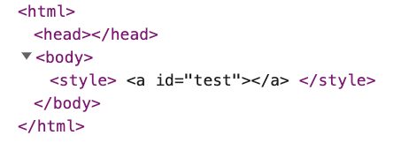
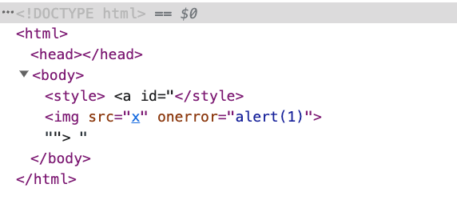

# 繞過你的防禦：Mutation XSS

之前在講 sanitization 的時候，有提醒大家不要輕易嘗試自己實作，而是去找一些 library 來用，因為這個水很深，坑很多。

那這些 library 會不會也有問題呢？當然有可能，而且事實上也曾經發生過。而有一種常拿來針對 sanitizer 的攻擊方式，叫做 mutation based XSS，也被稱做 mutation XSS 或是簡稱 mXSS。

在理解 mXSS 以前，我們要來看 sanitizer 通常是怎麼運作的。

## Sanitizer 的基本運作方式

根據我們之前使用的經驗，sanitizer 的輸入是一個字串，裡面含有 HTML，而輸出也是一個含有 HTML 的字串，使用方式如下：

``` js
const inputHtml = '<h1>hello</h1>'
const safeHtml = sanitizer.sanitize(inputHtml)
document.body.innerHTML = safeHtml
```

那 sanitizer 內部又是怎麼運作的呢？其實內部的運作方式跟我們前面用 `BeautifulSoup` 實作出的 sanitizer 差不多：

1. 把 `inputHtml` 解析成 DOM tree
2. 根據設定檔，刪除不合法的 node 以及 attribute
3. 把 DOM tree 序列化（serialize）成字串
4. 回傳

這流程看似也沒有什麼問題，但魔鬼藏在細節裡，萬一「看起來很安全的 HTML，其實並不安全」呢？咦？不是都已經 sanitize 過了嗎？怎麼個不安全法？讓我們先來看個例子。

## 瀏覽器的貼心服務

瀏覽器是一個貼心的程式，為了因應各種情況以及符合規格，你眼中的 HTML，不一定會是最後呈現出來的，例如說下面這個範例：

``` html
<!DOCTYPE html>
<html>
<body>
  <div id=content></div>
  <script>
    content.innerHTML = '<table><h1>hello</h1></table>'
  </script>
</body>
</html>
```

在 `<table>` 裡面放一個 `<h1>`，看起來沒什麼問題，但如果你打開了這個網頁，會發現：


HTML 的結構變了！

變成了：

``` html
<h1>hello</h1>
<table></table>
```

原本應該在 `<table>` 中的 `<h1>`，從裡面「跳出來了」，會有這樣的結果是因為瀏覽器根據 HTML 規格，判定 `<h1>` 不該在 `<table>` 中，因此就很貼心地把它拿了出來。從網頁的發展史來看是很正常的，當 HTML 不合法時，瀏覽器總是會先試著修它，畢竟這樣總比拋出錯誤或是顯示白畫面好。

這種「HTML 字串 render 時會被瀏覽器改變」的行為，就稱作 mutation，而利用這個特性所達成的 XSS，自然而然就叫做 mutation XSS。

我們再看一個例子：

``` html
<!DOCTYPE html>
<html>
<body>
  <div id=content></div>
  <script>
    content.innerHTML = '<svg><p>hello</svg>'
  </script>
</body>
</html>
```

render 出來的結果為：


瀏覽器認為 `<p>` 不應該在 `<svg>` 裡面，所以把在 `<svg>` 裡面的 `<p>` 給搬了出來，還順便修復了 HTML，幫忙加上 `</p>`

那這個更奇怪的例子呢？這次不是用 `<p>`，而是 `</p>`：

``` html
<!DOCTYPE html>
<html>
<body>
  <div id=content></div>
  <script>
    content.innerHTML = '<svg></p>hello</svg>'
  </script>
</body>
</html>
```

結果為：

``` html
<svg><p></p>hello</svg>
```

瀏覽器自動修復了 `</p>`，幫前面加上了 `<p>`，但是標籤依舊在 `<svg>` 裡面。

（備註：現在 Chrome 瀏覽器的行為已經修復，會是 `<svg></svg><p></p>hello`，所以現在沒辦法測出來這個狀況，但讓我們先繼續看下去）

這時候有趣的事情來了，如果我們把 `<svg><p></p>hello</svg>` 再拿去丟給 `innerHTML`，結果會變什麼呢？

``` html
<!DOCTYPE html>
<html>
<body>
  <div id=content></div>
  <script>
    content.innerHTML = '<svg><p></p>hello</svg>'
    console.log(content.innerHTML)
  </script>
</body>
</html>
```

結果為：

``` html
<svg></svg>
<p></p>
hello
```

不只是 `<p>`，連後面的 hello 也一起跳了出來，等於是所有原本在 `<svg>` 裡的東西，現在都在 `<svg>` 外了。

那這一連串的變化，對我們想要繞過 sanitizer 有什麼幫助呢？這就要再結合前面提過的 sanitizer 流程了。

假設我們的 inputHtml 是這樣：`<svg></p>hello</svg>`，而 sanitizer 的第一步就是把這個解析成 DOM tree，根據之前的實驗，會變成：

``` html
<svg>
  <p></p>
  hello
</svg>
```

看起來完全沒問題，沒有需要過濾的東西，下一步就是把 DOM tree 序列化成字串，變為：`<svg><p></p>hello</svg>`

接著我們自己的前端拿到了 safeHtml，執行 `document.body.innerHTML = safeHtml`，最終的 HTML 就是上面寫過的：

``` html
<svg></svg>
<p></p>
hello
```

對 sanitizer 來說，`<p>` 跟 hello 是在 svg 裡面的，但是最終的結果卻不是這樣，會是在外面。因此透過這個 mutation，我們可以讓任意元素從 `<svg>` 裡面跳出來。

接下來你可能會問說：「所以勒？那有什麼用？」，這就是有趣的地方了。

## 神奇的 HTML

`<style>` 是個神奇的標籤，因為在這標籤裡面的東西都會被解讀為文字，例如說：

``` html
<!DOCTYPE html>
<html>
<body>
  <style>
    <a id="test"></a>
  </style>
</body>
</html>
```

會被解析為：



黑字就代表是純文字的節點。

但有趣的是，如果在外面加上一層 `<svg>`，瀏覽器解析的方式就會不同，一切就都不一樣了，現在的 HTML 原始碼是：

``` html
<!DOCTYPE html>
<html>
<body>
  <svg>
    <style>
      <a id="test"></a>
    </style>
  </svg>
</body>
</html>
```

解析的結果為：


`<style>` 裡面的 `<a>` 變成了真的 HTML 元素，而不是純文字。

更有趣的是，你可以構造這樣一串 HTML：

``` html
<svg>
  <style>
    <a id="</style>"></a>
  </style>
</svg>
```

呈現出來是：


這邊只是幫 `<a>` 加上了一個 id，內容為 `</style>`，雖然說有 `</style>` 但是並不會閉合之前的 `<style>`，而是會被當作 `id` 屬性的一部分。後面的 `` 也是，它不是一個新的標籤，只是屬性內容的一部分。

但如果把 svg 給拿掉，變成：

``` html
<style>
  <a id="</style>"></a>
</style>
```

因為 `<a>` 現在不是一個元素了，只是單純的純文字，所以也沒有什麼屬性可言，因此這邊的 `</style>` 就會關閉前面的 `<style>`，變成：



原本在 `<a>` 的 id 裡面的 `` 只是屬性的內容，現在卻因為前面的 `</style>` 而跑了出來，變成了一個真的 HTML 元素。

從上面的實驗中我們可以得知，`<style>` 外層有沒有 `<svg>` 是重要的，因為會影響瀏覽器的解析。

## 全部加在一起

一開始我們提到了瀏覽器的 mutation，讓我們能做到「讓所有元素從 `<svg>` 中跳出來」，剛剛又提到了「`<style>` 外層有沒有 `<svg>` 是重要的」，把這兩個加在一起，就變成了最後的終極大魔王：mXSS。

在 2019 年 9 月 19 號，DOMPurify 釋出了 2.0.1 版本，目的是修正一個利用 mutation 來繞過檢查的 mXSS 漏洞，當時有問題的完整 payload 是這樣：

``` html
<svg></p><style><a id="</style>">
```

把這個解析成 DOM tree 之後會變成底下的結構：

``` html
<svg>
  <p></p>
  <style>
    <a id="</style>"></a>
  </style>
</svg>
```

瀏覽器在這邊做了幾件事：

1. 把 `</p>` 變成 `<p></p>`
2. 自動閉合 `<svg>`、`<style>` 跟 `<a>` 這些標籤

接著 DOMPurify 根據這個 DOM tree 檢查，因為 `<svg>`、`<p>`、`<style>` 跟 `<a>` 都是允許的標籤，id 也是允許的屬性，所以都沒問題，於是就回傳序列化後的結果：

``` html
<svg>
  <p></p>
  <style>
    <a id="</style>"></a>
  </style>
</svg>
```

然後使用者的程式把上面這個字串丟給 `innerHTML`，此時前面一再提到的 mutation 發生，所有的標籤都從 `<svg>` 裡面跳了出來，最終變成：

``` html
<svg></svg>
<p></p>
<style><a id="</style>

"></a>
</style>
```

因為 `<style>` 也跳了出來，導致 `<a>` 元素不復存在，變成了純文字，因此 `</style>` 就提前閉合，讓原本隱藏著的 `` 也從屬性內容變成了標籤，最後演變成 XSS。

## 問題的修復

為了修復這個問題，DOMPurify 在程式碼裡面特別加上了[檢查](https://github.com/cure53/DOMPurify/commit/ae16278018e7055c82d6a4ec87132fea3e236e30#diff-ac7cd96b8f4b994868af43ac8aff25573dd7cede1aab33fdcfd438811c7e853d)，來避免受到 mXSS 的影響。

而同時這個問題也回報給了 Chromium，因為是 parser 的行為錯誤才導致了這個奇怪的 mutation：[Issue 1005713: Security: Parser bug can introduce mXSS and HTML sanitizers bypass](https://bugs.chromium.org/p/chromium/issues/detail?id=1005713#c_ts1574850321)，結果在討論中開發者們發現這樣做是符合規格的，也就是說，這其實是一個 HTML 規格的 bug！

所以這個問題就變成規格也要修了，因此他們在規格的 repo 開了一個 issue：[Unmatched p or br inside foreign context needs a special parser rule #5113](https://github.com/whatwg/html/issues/5113)。

最後的結果就是在規格中補上了新的規則，而 Chromium 也根據新的規則修復了這個漏洞。

於是之後就再也沒有產生過類似的漏洞，所有人都過著幸福快樂的生活⋯⋯嗎？

並沒有，後來 DOMPurify 又被發現了一個更複雜一點的繞過方式，但修復之後變得更加強壯，在那之後基本上都沒有發生問題。

當時發現這個問題的人叫做 Michał Bentkowski，是個非常熟悉前端資安的前輩，回報過各種大大小小的問題，對於 HTML parsing 還有各種機制都很了解，我們之後還會看到他所回報過的經典漏洞。

想要更深入研究這個問題的話，可以參考他以前寫過的文章，我的 mXSS 知識都是從他那邊學來的：

1. [Write-up of DOMPurify 2.0.0 bypass using mutation XSS](https://research.securitum.com/dompurify-bypass-using-mxss/)
2. [Mutation XSS via namespace confusion – DOMPurify < 2.0.17 bypass](https://research.securitum.com/mutation-xss-via-mathml-mutation-dompurify-2-0-17-bypass/)
3. [HTML sanitization bypass in Ruby Sanitize < 5.2.1](https://research.securitum.com/html-sanitization-bypass-in-ruby-sanitize-5-2-1/)

## 小結

當初在接觸 mXSS 的時候只覺得懵懵懂懂的，好像瞭解了又好像沒有，為了寫這篇文章重新再順一遍脈絡跟自己試了一遍，才覺得好像有理解到底在幹嘛。要理解它的概念不難，但要理解所有的細節就需要多花一點時間，而且當初發現的問題已經修復了，所以在現在的瀏覽器上面沒辦法重現，也是比較麻煩的地方。

但總之呢，我覺得 mXSS 算是 XSS 裡面比較進階的主題了，牽涉到了 HTML 的 spec、瀏覽器的解析以及 sanitizer 的運作方式，要多花一點時間理解是正常的。
