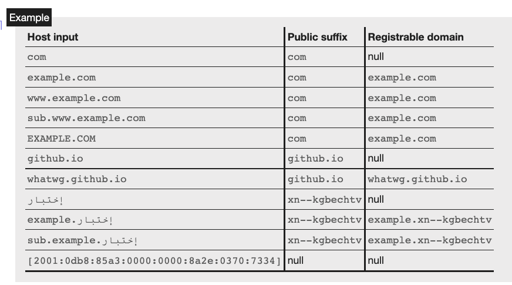
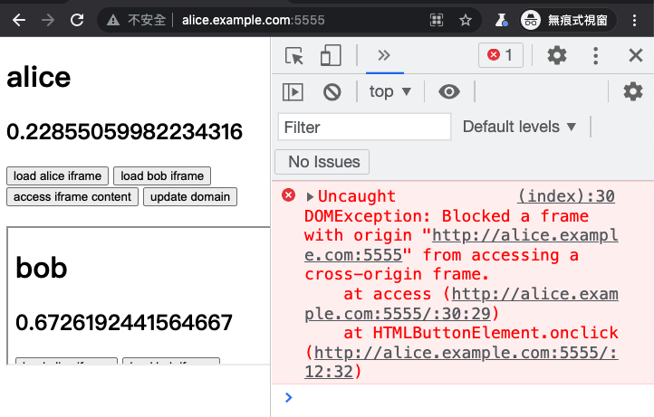

# 重中之重：Same-origin policy 與 site

在前面的文章裡有提過不少次「same-origin」或是「同源」，無論在前端或是資安的世界裡都是個非常重要的名詞，因為瀏覽器的同源政策（Same-origin policy）在開發上會碰到，在攻擊的時候也會碰到，至關重要。

另外，還有幾個常被混用的名詞，例如說 host 或是 site，像是 XSS 的 XS 就是 cross-site，CSRF 的 CS 也是 cross-site 的意思，那 origin 跟 site 又有什麼不同？跟 host 又有什麼不同？

這篇就帶你完全搞懂這些觀念，以後再也不搞混。

## Origin 跟 site 到底是什麼？該怎麼區分？

先提供一下簡單好懂但有些許錯誤的解釋，待會我們再來一個個修正。

Origin 的話就是：scheme + port + host，三者加起來就是 origin。

假設有個 URL 是 `https://huli.tw/abc`，各個組成分別是：

* scheme：https
* port：443（https 的預設 port）
* host：huli.tw

因此它的 origin 就是 `https://huli.tw`，可以看到 path 的部分 `/abc` 並不影響 origin，而 port 的部份 https 已經蘊含預設就是 443 port 了。

而 same origin 就是兩個 URL 的 origin 要是一樣的，舉例來說：

1. `https://huli.tw/abc` 跟 `https://huli.tw/hello/yo` 是 same origin，因為 scheme、port 跟 host 都一樣，path 不影響結果
2. `https://huli.tw` 跟 `http://huli.tw` 不是 same origin，因為 scheme 不一樣
3. `http://huli.tw` 跟 `http://huli.tw:8080` 不是 same origin，因為 port 不一樣
4. `https://huli.tw` 跟 `https://blog.huli.tw` 不是 same origin，因為 host 不一樣

從上面幾個範例可以看出 same origin 的條件相當嚴苛，基本上除了 path 以外的部分都要一樣，才能叫做 same origin。

接著我們看一下 site，site 的話看的東西比 origin 少，只看 scheme 跟 host，所以不看 port。而兩個 URL 是 same site 的定義也更寬鬆了，host 的部分不用完全相同，只要是 subdomain 也算是 same site。

舉例來說，

1. `https://huli.tw/abc` 跟 `https://huli.tw/hello/yo` 是 same site，因為 scheme 跟 host 都一樣
2. `https://huli.tw` 跟 `http://huli.tw` 不是 same site，因為 scheme 不一樣
3. `http://huli.tw` 跟 `http://huli.tw:8080` 是 same site，因為 port 不影響結果
4. `https://huli.tw` 跟 `https://blog.huli.tw` 是 same site，因為 huli.tw 跟 blog.huli.tw 都在同一個 domain huli.tw 底下
5. `https://abc.huli.tw` 跟 `https://blog.huli.tw` 也是 same site，因為 abc.huli.tw 跟 blog.huli.tw 都在同一個 domain huli.tw 底下

跟 same origin 比起來，same site 顯然更為寬鬆，port 不同也是 same site，host 的部分只要隸屬於同個 parent domain 基本上也是 same site。

但就如同我開頭說的，上面的定義雖然在大多數情況下都正確，但其實並不精確，底下我們直接來看 spec，看看有哪些狀況例外。

## 細究 same origin

在 HTML 規範中的 [7.5 Origin](https://html.spec.whatwg.org/multipage/origin.html#origin) 章節裡面可以看到完整的定義，先來看一下規範裡面對 origin 的說明：

> Origins are the fundamental currency of the web's security model. Two actors in the web platform that share an origin are assumed to trust each other and to have the same authority. Actors with differing origins are considered potentially hostile versus each other, and are isolated from each other to varying degrees.

這邊寫得很清楚，開宗明義就講了如果兩個網站有著相同的 origin，就意味著這兩個網站信任彼此，但如果是不同的 origin，就會被隔離開來而且受到限制。

接著規範裡把 origin 分成兩種，一種是 `An opaque origin`，另一種是 `A tuple origin`。

Opaque origin 可以想成是在特殊狀況下才會出現的 origin，例如說我在本機開啟一個網頁，網址會是 `file:///...`，這時候在網頁內發送 request，origin 就會是 opaque origin，也就是 `null`。

Tuple origin 則是比較常見而且我們也比較關心的 origin，文件寫說 tuple 內包含了：

1. scheme (an ASCII string).
2. host (a host).
3. port (null or a 16-bit unsigned integer).
4. domain (null or a domain). Null unless stated otherwise.

你可能會好奇為什麼又有 host 又有 domain，這個我們晚點會提到。

接著，在規範裡面也有講到判斷 A 跟 B 兩個 origin 是否是 same origin 的演算法：

1. If A and B are the same opaque origin, then return true.
2. If A and B are both tuple origins and their schemes, hosts, and port are identical, then return true.
3. Return false.

要嘛兩個是一樣的 opaque origin，否則的話要 scheme、host 跟 port 三者都相等，才是 same origin。除了 same origin 以外，你還會在 spec 裡面看到另外一個詞叫做「same origin-domain」，這個等等也會提到。

如同我前面說的，same origin 是很嚴格的限制，以 `https://huli.tw/api` 這個網址來說，因為 origin 不看 path，所以它的 origin 會是 `https://huli.tw`，也就是說，跟它同源的網站的網址一定都是 `https://huli.tw/*`，才會是同源的。

`https://huli.tw` 跟 `https://blog.huli.tw` 雖然只是網域跟子網域的關係，但也不是同源的，因為 host 不一樣。

記住這點，這很重要。

這邊仔細探究的 origin 跟 same origin 的定義跟開頭所說的「不精確的說法」比起來，差別在於多了一個 opaque origin 以及 same origin-domain，還有 origin tuple 中多了一個我們剛剛都沒用到的「domain」。

最後再提一個東西，當我說「`https://huli.tw/api` 的 origin 是 `https://huli.tw`」的時候，更精確的說法是：「`https://huli.tw/api` 的 origin 序列化（serialization）過的結果是 `https://huli.tw`」

這是因為前面有提到 origin 其實是個 tuple，表示起來會像這樣：`(https, huli.tw, null, null)`，而 tuple 變成字串後才會是 `https://huli.tw`。tuple 的表示法跟序列化過後的字串比起來，我認為後者比較好讀，因此當兩者能表現出的資訊類似時，我會採用後者那種做法

## 細究 same site

site 的定義也在同一份 spec 裡面，寫說：

> A site is an opaque origin or a scheme-and-host.

所以 site 可以是 opaque origin，或者是 scheme-and-host。

在 spec 中可以發現除了 same site 以外，還有另外一個名詞叫做「schemelessly same site」，這兩個的差別也很明顯，same site 會看 scheme，而 schemelessly same site 則不看 scheme。

因此，在判斷兩個 origin A 跟 B 是否是 same site 時，演算法是這樣的：

> Two origins, A and B, are said to be same site if both of the following statements are true:
> 
> * A and B are schemelessly same site  
> * A and B are either both opaque origins, or both tuple origins with the same scheme

如果 A 跟 B 是 same site，要嘛他們都是 opaque origin，要嘛兩個有著同樣的 scheme 而且兩個是 schemelessly same site。

所以 same site 是會看 scheme 的，http 跟 https 的兩個網址絕對不會是 same site，但有可能是 schemelessly same site。

這邊其實有一小段歷史，那就是 same site 剛出來的時候，其實是不看 scheme 的，是到後來才把 scheme 納入考量。

在這份 2016 的 [RFC: Same-site Cookies](https://datatracker.ietf.org/doc/html/draft-west-first-party-cookies-07#section-2.1) 中，可以看到對於 same site 的判斷並沒有 scheme，所以那時候 `https://huli.tw` 跟 `http://huli.tw` 是 same site。

一直到 2019 年 6 月的時候，才開始在討論是否要把 scheme 列入考量，詳情可參考：[Treat http://foo.com -> https://foo.com requests as Sec-Fetch-Site: cross-site. #34](https://github.com/w3c/webappsec-fetch-metadata/issues/34)。

那時 same site 的 spec 並不是定義在我們今天看的 HTML spec 裡面，而是另外一份 URL spec，所以後來討論被移到那邊去：[Consider introducing a "same-site" concept that includes scheme. #448](https://github.com/whatwg/url/issues/448)，接著在 2019 年 9 月，就有了這個 PR：[Tighten 'same site' checks to include 'scheme'. #449](https://github.com/whatwg/url/pull/449)，才正式在規格中把 scheme 列入考量，將 same site 定義成「會看 scheme」，而不看 scheme 的則引入了一個新的名詞：schemelessly same site。

接著過了兩個月，相關的 spec 從 URL 移到 HTML，可參考這兩個 PR：[Let HTML handle the "same site" definition #457](https://github.com/whatwg/url/pull/457)、[Define (schemelessly) same site for origins #5076](https://github.com/whatwg/html/pull/5076)

Spec 歸 spec，有時候規格修正不代表瀏覽器就會馬上跟上，那瀏覽器目前的實作為何呢？

Chrome 在 2020 年 11 月時有寫了一篇文章：[Schemeful Same-Site](https://web.dev/schemeful-samesite/)，看來在那時瀏覽器還是把不同 scheme 也當作是 same site，但從 [Chrome platform status:  Feature: Schemeful same-site](https://chromestatus.com/feature/5096179480133632) 中我們可以得知，Chrome 從 89 以後就把 scheme 也列入考慮了。

至於 Firefox 的話，從這個 issue：[[meta] Enable cookie sameSite schemeful](https://bugzilla.mozilla.org/show_bug.cgi?id=1651119) 的狀態看來，似乎還沒有把這個行為當作是預設值，如果沒有特別調整設定，scheme 不同也會被看作是 same site。

看完了歷史，接著就來看一下最重要的 schemelessly same site 是如何判斷的：


Opaque 的部份我們就先不說了，上面的重點很顯然是一個新的名詞：「registrable domain」，在判斷兩個 host 是否是 same site 時，會用這個來做比較。

這個 registrable domain 的定義在另外一份 [URL 的 spec](https://url.spec.whatwg.org/#host-registrable-domain) 中：

> A host’s registrable domain is a domain formed by the most specific public suffix, along with the domain label immediately preceding it, if any

這邊又提到一個新的詞：「public suffix」。

先舉個例子會比較好懂，`blog.huli.tw` 的 registrable domain 會是 `huli.tw`，而 `huli.tw` 的 registrable domain 也是 `huli.tw`。

但是 `bob.github.io` 的 registrable domain 不是 `github.io`，而是 `bob.github.io`。

這是為什麼呢？底下我簡單解釋一下。

如果沒有「registrable domain」以及「public suffix」這兩個概念的話，那 same site 的定義就是開頭所講的，`huli.tw` 跟 `blog.huli.tw` 是 same site，這沒什麼問題。

但如果是這樣的話，`bob.github.io` 跟 `alice.github.io` 也是 same site 了。

咦，這樣不好嗎？

不好，因為 `github.io` 是 GitHub pages 的服務，每一個 GitHub 的使用者都會有自己專屬的 subdomain 可以用，但 GitHub 不希望 `bob.github.io` 能干擾到 `alice.github.io`，因為它們其實就是完全獨立的兩個網站，並不像 `huli.tw` 跟 `blog.huli.tw` 一樣，擁有者都是我。

因此，public suffix 的概念就出現了，這是一個人工維護的清單，裡面有著這些「不想被當作是同個網站的列表」，我舉幾個例子：

1. github.io
2. com.tw
3. s3.amazonaws.com
4. azurestaticapps.net
5. herokuapp.com

所以瀏覽器參照這張表之後，就會認定 `bob.github.io` 跟 `alice.github.io` 其實並沒有關係，不是 same site。這也有個專有名詞叫做 eTLD（effective Top-Level-Domain），細節可參考：[如何判斷兩個網域的擁有者是否相同？](https://blog.kalan.dev/2021-11-09-url-and-samesite/)

如上所述，因為 `github.io` 存在於 public suffix list 裡面，所以 `bob.github.io` 的 registrable domain 是 `bob.github.io`，而 `alice.github.io` 的 registrable domain 則是 `alice.github.io`。

所以呢，我們一開始講的 same site 的定義並不正確，兩個 host 看起來很像是隸屬於同一個 parent domain，並不代表就一定是 same site，還要看有沒有在 public suffix list 裡面。

而 `bob.github.io` 跟 `alice.github.io` 不是 same site，因為他們的 registrable domain 不一樣。

`blog.huli.tw` 跟 `huli.tw` 還有 `test.huli.tw` 這三個 host 都是 same site，因為 registrable domain 都是 `huli.tw`。

spec 中有附上一張更清楚的表格，大家可以仔細看一下：



最後，為 same site 做個總結：

1. 有 same site 跟 schemelessly same site，較常用的是前者
2. 要比較兩個 host 是否為 same site 時，要看 registrable domain
3. 要決定 registrable domain 是什麼，要看 public suffix list
4. 兩個 host 僅管看起來隸屬於同個 parent domain，但因為有 public suffix 的存在，不一定是 same site
5. same site 不看 port，所以 `http://blog.huli.tw:8888` 跟 `http://huli.tw` 是 same site

## Same origin 與 same site

Same origin 看的是：

1. scheme
2. port
3. host

而 same site 看的是：

1. scheme
2. host(registrable domain)

如果兩個網站是 same origin，那就一定是 same site，因為 same origin 的判斷標準更為嚴苛。

兩者最大的差別就在於：

1. same origin 看 port，same site 不看
2. same origin 看 host，same site 看 registrable domain

底下舉幾個例子：

| A                   | B              | same origin | same site | 說明 |
|---------------------|----------------|-------------|-----------|------|
| http://huli.tw:8080 | http://huli.tw | X           | O         |  same site 不看 port    |
| https://blog.huli.tw                    |   https://huli.tw             |     X        |   O        |  registrable domain 相同    |
| https://alice.github.io                    |   https://github.io             |     X        |   X        |  github.io 在 public suffix 裡面    |
| https://a.alice.github.io                    |   https://b.alice.github.io             |     X        |   O        |  registrable domain 相同    |
| https://bob.github.io/page1                    |   https://bob.github.io/about             |     O        |   O        |  不管 path    |

## 神奇的 document.domain

在看 origin 的 spec 時，就有提到一個神奇的「domain」屬性，不知道要幹嘛，甚至還有「same origin-domain」這個東西，在 origin 的 spec 中其實有一段綠底的 note，直接破題：


寫說 origin 除了 domain 這個屬性以外都是不可變的，而這屬性可以透過 `document.domain` 來改變。在 spec 中有一個章節 [7.5.2 Relaxing the same-origin restriction](https://html.spec.whatwg.org/multipage/origin.html#relaxing-the-same-origin-restriction)，就是在講這件事情，我節錄一小段：

> (document.domain) can be set to a value that removes subdomains, to change the origin's domain to allow pages on other subdomains of the same domain (if they do the same thing) to access each other. This enables pages on different hosts of a domain to synchronously access each other's DOMs.

為了方便大家理解，直接來個 demo。

我改了本機的 `/etc/hosts`，內容如下：

```
127.0.0.1   alice.example.com
127.0.0.1   bob.example.com
```

如此一來，這兩個網址都會連到 local，接著我開了一個簡單的 HTTP server，寫了一個簡單的 HTML，讓它跑在 localhost:5555

``` html
<!DOCTYPE html>
<html>
  <head>
    <meta charset="utf-8" />
    <meta name="viewport" content ="width=device-width, initial-scale=1" />
  </head>
  <body>
    <h1></h1>
    <h2></h2>
    <button onclick="load('alice')">load alice iframe</button>
    <button onclick="load('bob')">load bob iframe</button>
    <button onclick="access()">access iframe content</button>
    <button onclick="update()">update domain</button>
    <br>
    <br>
  </body>
  <script>
    const name = document.domain.replace('.example.com', '')
    document.querySelector('h1').innerText = name
    document.querySelector('h2').innerText = Math.random()

    function load(name) {
      const iframe = document.createElement('iframe')
      iframe.src = 'http://' + name + '.example.com:5555'
      document.body.appendChild(iframe)
    }

    function access() {
      const win = document.querySelector('iframe').contentWindow
      alert('secret:' + win.document.querySelector('h2').innerText)    
    }

    function update() {
      document.domain = 'example.com'
    }
  </script>
</html>
```

頁面上有三個功能：

1. 載入 iframe
2. 讀取 iframe 內 DOM 的資料
3. 改變 document.domain

我們先開啟 `http://alice.example.com:5555`，然後載入 `http://bob.example.com:5555` 的 iframe，接著按下 alice 頁面中的「access iframe content」：



你會在 console 看到錯誤訊息，寫說：

> Uncaught DOMException: Blocked a frame with origin "http://alice.example.com:5555" from accessing a cross-origin frame.

因為 alice 跟 bob 雖然是 same site，但是並不是 same origin，而 iframe 如果要存取到 DOM 的內容，必須是 same origin 才行。

接著我們雙雙按下 alice 跟 bob 頁面中的「update domain」，按完以後再按一次「access iframe content」：


你會看到這一次，我們順便取得了 bob 頁面中的資料，成功把  `http://alice.example.com:5555` 跟 `http://bob.example.com:5555` 從 cross origin 變成了 same origin，這就是忍術，same site 變成 same origin 之術！

這一招並不是任意兩個網頁都可以使用的，基本上只有 same site 的網站可以，而且在設置時還會做很多檢查：


以 github.io 為例，如果 `alice.github.io` 執行了 `document.domain = 'github.io'`，console 就會跳出錯誤：

> Uncaught DOMException: Failed to set the 'domain' property on 'Document': 'github.io' is a top-level domain.

為什麼改變 `document.domain` 後，兩個頁面就會變成是 same origin 呢？其實嚴格來說不是 same origin，而是 same origin-domain，在 [docuemnt](https://html.spec.whatwg.org/multipage/browsers.html#concept-bcc-content-document) 相關的 spec 中有寫到，有些檢查是看 same origin-domain，而不是 same origin。

那怎麼看兩個 origin 是不是 same origin-domain 呢？一起來看看 spec 怎麼說：

> 1. If A and B are the same opaque origin, then return true.  
> 2. If A and B are both tuple origins, run these substeps:
>   * If A and B's schemes are identical, and their domains are identical and non-null, then return true.  
>   * Otherwise, if A and B are same origin and their domains are identical and null, then return true.
> 3. Return false.

如果 A 跟 B 的 scheme 一樣，而且 domain 屬性也一樣而且不是 null 的話，就回傳 true，否則的話檢查 A 跟 B 是不是 same origin 而且 domain 都是 null，成立才回傳 true。

這邊可以看到幾個有趣的地方：

1. 一定要兩個網頁都沒有設置 domain 或是都有設置，才有可能回傳 true（這很重要）
2. 如果有設置 domain 的話，same origin-domain 就不檢查 port 了

`document.domain` 就是改變 origin tuple 中 domain 這個屬性用的。

在上面的範例中，我們兩個網頁 `http://alice.example.com:5555` 跟 `http://bob.example.com:5555` 都將自己的 domain 改成 `example.com`，所以是 same origin-domain。

底下我們來看看三個有趣的案例。

### 案例一：單方面改變

如果 `https://alice.example.com` 執行了 `document.domain = 'example.com'`，接著把 `https://example.com` 嵌入在 iframe 裡面，它們兩個「依舊不是 same origin-domain」，因為 alice 頁面有 domain 屬性，但是 `example.com` 頁面沒有 domain 屬性。

`example.com` 也要執行 `document.domain = 'example.com'`，兩者才會是 same origin-domain。

### 案例二：消失的 port

`http://alice.example.com:1234` 跟 `http://alice.example.com:4567`，因為 port 不一樣，所以是 cross origin，但如果兩個頁面都執行了 `document.domain = 'alice.example.com'` 的話，就會變成 same origin-domain，可以存取彼此的 DOM，因為它不看 port。

### 案例三：我不是原來的我

假設 `http://alice.example.com` 把自己嵌入在 iframe 裡面，那 iframe 跟原本的頁面顯然是 same origin，可以存取彼此的 DOM。

但是呢，如果我在頁面上執行了 `document.domain = 'alice.example.com'`，這頁面就會被設置 domain 屬性，而 iframe 裡的頁面並沒有設置 domain 屬性，所以它們就變得不是 same origin-domain 了。

## document.domain 的淡出及退場

用這一招來放寬 same origin 的限制應該滿早就有了，而遲遲沒有拔掉就是為了相容早期的行為，我猜在早期的時候很多網頁都會用這招去存取 same site 但是 cross origin 的頁面。

但這樣做顯然是有風險的，例如說假設某個 subdomain 有 XSS 漏洞，就有機會利用這個方式擴大影響範圍，在 2016 年由 [@fin1te](https://twitter.com/fin1te) 所寫的一篇文章 [An XSS on Facebook via PNGs & Wonky Content Types](https://whitton.io/articles/xss-on-facebook-via-png-content-types/) 中，就利用了這個手法，成功從 subdomain 繞到 `www.facebook.com` 進行 XSS，提升漏洞的影響力。 

也因為安全性的問題，Chrome 在 2022 年 1 月 11 日於部落格發布了一篇文章：[Chrome will disable modifying document.domain to relax the same-origin policy](https://developer.chrome.com/blog/immutable-document-domain/)，文中說明了最快從 Chrome 101 版開始，就會停止支援更改 `document.domain`。

原本的行為可以用 `postMessage` 或是 `Channel Messaging API` 來取代，只是要多寫一些程式碼就是了，畢竟沒辦法像原本直接操作 DOM 這麼方便。

而如果有網頁想繼續使用這個修改 document.domain 的功能，需要在 response header 裡面帶上 `Origin-Agent-Cluster: ?0`，才能繼續使用。

文中也有附上關於這個改動的相關討論串：[Deprecating document.domain setter. #564](https://github.com/w3ctag/design-reviews/issues/564)

## 小結

所謂的同源政策，就是瀏覽器的保護機制，確保只有同源的網頁可以讀取彼此的資料，來避免資安問題。因此我們有需要知道 origin 的定義是什麼，才能判斷兩個網頁是否同源。

介紹完 origin 與 site 這兩個重要的基本觀念以後，我們會陸續看到兩個延伸的名詞，分別是 CSRF（Cross-site request forgery） 與 CORS（Cross-origin resource sharing）。

本文改寫自：[忍術！把 same site 變 same origin 之術！](https://blog.huli.tw/2022/01/16/same-site-to-same-origin-document-domain/)

參考資料：

1. [HTML spec](https://html.spec.whatwg.org/multipage/origin.html#origin)
2. [URL spec](https://url.spec.whatwg.org/#host-registrable-domain)
3. [如何判斷兩個網域的擁有者是否相同？](https://blog.kalan.dev/2021-11-09-url-and-samesite/)
4. [Chrome will disable modifying document.domain to relax the same-origin policy](https://developer.chrome.com/blog/immutable-document-domain/)


