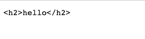

# 結合 MIME sniffing 發起攻擊

在每一個 response 中，幾乎都有一個叫做 `Content-Type` 的 response header，用來告訴瀏覽器這個 response 的 MIME type 是什麼，而最常見的就是 `text/html`，或者是 `application/json` 等等。

那如果沒有的話呢？瀏覽器就會根據檔案的內容，自己決定這個檔案應該要是什麼型態。不只如此，就算有這個 `Content-Type` 的 header，瀏覽器有時可能還是會自作主張，當成是別的型態。

這個「從檔案內容推測 MIME type」的行為就叫做 MIME sniffing，這篇就讓我們一起來看一下這個特性吧！

## MIME sniffing 初體驗

可以利用 Express 簡單的輸出一個沒有 `Content-type` header 的 response：

``` js
const express = require('express');
const app = express();

app.get('/', (req, res) => {
  res.write('<h1>hello</h1>')
  res.end()
});

app.listen(5555, () => {
  console.log('Server is running on port 5555');
});
```

打開瀏覽器觀看這個網頁的話，會看到字體變大而且變粗體的 `hello` 字樣，代表瀏覽器確實把 response 當成是網頁來渲染：


接著我們看第二個範例，把 `<h1>` 換成 `<h2>`：

``` js
const express = require('express');
const app = express();

app.get('/', (req, res) => {
  res.write('<h2>hello</h2>')
  res.end()
});

app.listen(5555, () => {
  console.log('Server is running on port 5555');
});
```



咦？為什麼突然就以純文字顯示了？

接著第三個範例，一樣是 `<h1>`，只是前面多加一些字：

``` js
const express = require('express');
const app = express();

app.get('/', (req, res) => {
  res.write('Hello, <h1>world</h1>')
  res.end()
});

app.listen(5555, () => {
  console.log('Server is running on port 5555');
});
```


一樣是以純文字顯示，而不是 HTML。

或許你會覺得瀏覽器的 MIME sniffing 機制是個謎團，就像個黑盒子一樣，不知道怎麼運作的。但幸好我們拿來測試的瀏覽器是 Chrome，而 Chromium 是開源的。

Chromium 中拿來做 MIME sniffing 的程式碼在 [net/base/mime_sniffer.cc](https://source.chromium.org/chromium/chromium/src/+/refs/tags/118.0.5981.4:net/base/mime_sniffer.cc)，開頭其實就有一大段在寫說它是怎麼偵測的了，節錄如下：

``` cpp
// Detecting mime types is a tricky business because we need to balance
// compatibility concerns with security issues.  Here is a survey of how other
// browsers behave and then a description of how we intend to behave.
//
// HTML payload, no Content-Type header:
// * IE 7: Render as HTML
// * Firefox 2: Render as HTML
// * Safari 3: Render as HTML
// * Opera 9: Render as HTML
//
// Here the choice seems clear:
// => Chrome: Render as HTML
//
// HTML payload, Content-Type: "text/plain":
// * IE 7: Render as HTML
// * Firefox 2: Render as text
// * Safari 3: Render as text (Note: Safari will Render as HTML if the URL
//                                   has an HTML extension)
// * Opera 9: Render as text
//
// Here we choose to follow the majority (and break some compatibility with IE).
// Many folks dislike IE's behavior here.
// => Chrome: Render as text
// We generalize this as follows.  If the Content-Type header is text/plain
// we won't detect dangerous mime types (those that can execute script).
//
// HTML payload, Content-Type: "application/octet-stream":
// * IE 7: Render as HTML
// * Firefox 2: Download as application/octet-stream
// * Safari 3: Render as HTML
// * Opera 9: Render as HTML
//
// We follow Firefox.
// => Chrome: Download as application/octet-stream
// One factor in this decision is that IIS 4 and 5 will send
// application/octet-stream for .xhtml files (because they don't recognize
// the extension).  We did some experiments and it looks like this doesn't occur
// very often on the web.  We choose the more secure option.
```

那到底怎麼樣才會被視為「HTML payload」呢？在原始碼更下面的地方有：

``` cpp
// Our HTML sniffer differs slightly from Mozilla.  For example, Mozilla will
// decide that a document that begins "<!DOCTYPE SOAP-ENV:Envelope PUBLIC " is
// HTML, but we will not.

#define MAGIC_HTML_TAG(tag) \
  MAGIC_STRING("text/html", "<" tag)

static const MagicNumber kSniffableTags[] = {
  // XML processing directive.  Although this is not an HTML mime type, we sniff
  // for this in the HTML phase because text/xml is just as powerful as HTML and
  // we want to leverage our white space skipping technology.
  MAGIC_NUMBER("text/xml", "<?xml"),  // Mozilla
  // DOCTYPEs
  MAGIC_HTML_TAG("!DOCTYPE html"),  // HTML5 spec
  // Sniffable tags, ordered by how often they occur in sniffable documents.
  MAGIC_HTML_TAG("script"),  // HTML5 spec, Mozilla
  MAGIC_HTML_TAG("html"),  // HTML5 spec, Mozilla
  MAGIC_HTML_TAG("!--"),
  MAGIC_HTML_TAG("head"),  // HTML5 spec, Mozilla
  MAGIC_HTML_TAG("iframe"),  // Mozilla
  MAGIC_HTML_TAG("h1"),  // Mozilla
  MAGIC_HTML_TAG("div"),  // Mozilla
  MAGIC_HTML_TAG("font"),  // Mozilla
  MAGIC_HTML_TAG("table"),  // Mozilla
  MAGIC_HTML_TAG("a"),  // Mozilla
  MAGIC_HTML_TAG("style"),  // Mozilla
  MAGIC_HTML_TAG("title"),  // Mozilla
  MAGIC_HTML_TAG("b"),  // Mozilla
  MAGIC_HTML_TAG("body"),  // Mozilla
  MAGIC_HTML_TAG("br"),
  MAGIC_HTML_TAG("p"),  // Mozilla
};

// ...

// Returns true and sets result if the content appears to be HTML.
// Clears have_enough_content if more data could possibly change the result.
static bool SniffForHTML(base::StringPiece content,
                         bool* have_enough_content,
                         std::string* result) {
  // For HTML, we are willing to consider up to 512 bytes. This may be overly
  // conservative as IE only considers 256.
  *have_enough_content &= TruncateStringPiece(512, &content);

  // We adopt a strategy similar to that used by Mozilla to sniff HTML tags,
  // but with some modifications to better match the HTML5 spec.
  base::StringPiece trimmed =
      base::TrimWhitespaceASCII(content, base::TRIM_LEADING);

  // |trimmed| now starts at first non-whitespace character (or is empty).
  return CheckForMagicNumbers(trimmed, kSniffableTags, result);
}
```

會檢查 response 移除空白以後開頭的字串是不是符合上面列出的那些 HTML 的模式，可以看到一般常見的網頁開頭 `<!DOCTYPE html` 跟 `<html` 都有在上面。這也解釋了為什麼我們前面試過的三個範例中，只有 `<h1>hello</h1>` 這個範例最後是呈現為 HTML。

從原始碼裡面也可以看出 Chromium 似乎不考慮 URL 上的副檔名或其他因素，單純只考慮檔案內容而已，可以再做一次測試驗證一下：

``` js
const express = require('express');
const app = express();

app.get('/test.html', (req, res) => {
  res.write('abcde<h1>test</h1>')
  res.end()
});

app.listen(5555, () => {
  console.log('Server is running on port 5555');
});
```

這邊就不放圖了，總之儘管網址是 `test.html`，最後呈現出來的結果依舊是純文字。那其他瀏覽器呢？我們可以用 Firefox 打開看看：


可以發現 Firefox 呈現的居然是 HTML！因此可以推斷出 Firefox 在做 MIME sniffing 的時候，會參考網址列上的副檔名。

## 利用 MIME sniffing 進行攻擊

從剛剛的研究結果中我們確定了一個事實，那就是如果 response 沒有設置 content-type，而且內容我們可以操控的話，就可以利用 MIME sniffing 讓瀏覽器把檔案當成是網頁來顯示。

舉例來說，假設有個上傳圖片的功能，只有檢查副檔名而沒有檢查內容，我們就可以上傳一個 `a.png` 的檔案，但是內容是 `<script>alert(1)</script>`，如果伺服器在輸出這張圖片時沒有自動加上 content-type，就變成了一個 XSS 的漏洞。

可是現在的伺服器基本上都會自動加了，這有可能嗎？

有，我們可以結合別的小問題一起利用。

Apache HTTP Server 是一個很常被使用的伺服器，例如說很有名的 LAMP 就是 Linux + Apache + MySQL + PHP 的後端套裝組合，使用的就是這個伺服器。

而 Apache HTTP Server 有一個神奇的行為，那就是如果檔名裡面只有 `.` 的話，就不會輸出 `Content-Type`。舉例來說，`a.png` 會自動從副檔名偵測 MIME type 並輸出 `image/png`，但如果是 `..png` 這個檔名，就不會輸出 `Content-Type`。

因此，如果後端是用 Apache HTTP Server 來處理下載檔案的功能，我們就可以上傳一個看似是合法圖片的 `..png`，但是用瀏覽器打開後卻會呈現為網頁，變成 XSS 漏洞。

根據 Apache HTTP Server 的說法，這是預期行為，細節可以參考 [@YNizry](https://twitter.com/YNizry/status/1582733545759330306) 的推文。

## 可以執行 JavaScript 的 content type

除了我們所熟知的 HTML 檔案，還有哪些檔案可以執行 JavaScript 呢？

在 BlackFan 於 2020 年做過的研究：[Content-Type Research](https://github.com/BlackFan/content-type-research/tree/master) 中，就有提供一個完整的清單：[Content-Type that can be used for XSS](https://github.com/BlackFan/content-type-research/blob/master/XSS.md)。

可以從清單中看出除了 HTML 以外，XML 跟 SVG 這兩種 content type 也是最常見的可以執行 JavaScript 的類別。

這邊比較值得關注的是 SVG 檔案，因為現在很多網站都有上傳圖片的功能，SVG 也是圖片的一種，因此有些網站是允許上傳 SVG 的。但是從這個研究中我們可以知道，開放上傳 SVG 就等於是開放上傳 HTML，因為 SVG 是可以執行 JavaScript 的！

例如說 febin 在 2022 年回報給開源軟體 Mantis Bug Tracker 的漏洞：[CVE-2022-33910: Stored XSS via SVG file upload](https://mantisbt.org/bugs/view.php?id=30384)，就是因為使用者在建立新的 issue 時可以上傳檔案，而檔案的格式可以是 SVG，因此就可以上傳一個惡意的 SVG 檔案，其他使用者點開以後就會執行裡面暗藏的程式碼。 

## 可以當成 script 載入的 content type

以底下這段程式碼為例：

``` html
<script src="URL"></script>
```

你有想過 `URL` 的 content type 是什麼，瀏覽器才會當作 script 載入嗎？

舉例來說，如果是 `image/png` 的話是不行的，會看到瀏覽器輸出底下的錯誤訊息：

> Refused to execute script from 'http://localhost:5555/js' because its MIME type ('image/png') is not executable.

而最常見的 `text/javascript` 顯然是沒問題的，除了這個還有嗎？

底下的十個 content type 只有兩個是不行的，請大家猜猜看是哪兩個：

1. application/zip
2. application/json
3. application/octet-stream
4. text/csv
5. text/html
6. text/json
7. text/plain
8. huli/blog
9. video/mp4
10. font/woff2

待會公佈答案，我們先公佈「合法的 JavaScript MIME type」，寫在 Chromium 的原始碼裡面：[/third_party/blink/common/mime_util/mime_util.cc](https://chromium.googlesource.com/chromium/src.git/+/refs/tags/103.0.5012.1/third_party/blink/common/mime_util/mime_util.cc) ：

``` cpp
//  Support every script type mentioned in the spec, as it notes that "User
//  agents must recognize all JavaScript MIME types." See
//  https://html.spec.whatwg.org/#javascript-mime-type.
const char* const kSupportedJavascriptTypes[] = {
    "application/ecmascript",
    "application/javascript",
    "application/x-ecmascript",
    "application/x-javascript",
    "text/ecmascript",
    "text/javascript",
    "text/javascript1.0",
    "text/javascript1.1",
    "text/javascript1.2",
    "text/javascript1.3",
    "text/javascript1.4",
    "text/javascript1.5",
    "text/jscript",
    "text/livescript",
    "text/x-ecmascript",
    "text/x-javascript",
};
```

上面這些都是合法的 JavaScript MIME types，可以看到裡面有很多時代的眼淚，像是 `jscript` 或是 `livescript` 之類的。

除了合法的 JavaScript MIME types 以外，根據規格所寫的，只有四種不行：

1. `audio/*`
2. `image/*`
3. `video/*`
4. `text/csv`

除了這些都是可以的，因此在上面的選項中，只有 `text/csv` 跟 `video/mp4` 這兩個不行，其他都可以！沒錯，`text/html` 可以，`application/json` 可以，甚至連 `huli/blog` 也可以。

如果想要關閉這個很寬鬆的機制，只讓 JavaScript MIME types 載入的話，可以在 response 中新增一個 header：`X-Content-Type-Options: nosniff`，加了這個 header 以後，剛剛講的 10 個全部都不行了，載入的時候會出現：

> Refused to execute script from 'http://localhost:5555/js' because its MIME type ('text/plain') is not executable, and strict MIME type checking is enabled.

`strict MIME type` 就是我們加上那個 header 以後開啟的功能。

除了 script，style 也是一樣，加了之後就只有 `text/css` 這個 MIME type 會被認可是合格的，其他都會出現錯誤。

那如果繼續開啟這功能會怎樣呢？就會多出一個資安風險。

假設你剛好在某個網站找到一個 XSS，不過麻煩的事情是這個網站的 CSP 是 `script-src 'self';`，所以無法引入外部的任何 script，也沒辦法用 inline script，這樣要怎麼繞過 CSP 呢？

如果這網站有提供上傳檔案的功能，而且接受除了圖片、影片跟 CSV 以外的檔案，並且沒有檢查內容，假設只接受 ZIP 檔好了，我們就可以上傳一個內容其實是 JavaScript 程式碼的壓縮檔。

如此一來，就可以用 `<script src="/uploads/files/my.zip"></script>` 去引入 script，成功繞過了 CSP。之所以可以這樣，就是因為剛剛提的行為，只要不是那幾種 MIME types，都可以作為 script 載入。

這就是為什麼你會看到很多網站都加上了這個 header，因為要為了防止這種行為出現。

## 小結

在這篇文章中我們看到了很多有趣的東西，都是與 MIME type 相關的知識，同時也看了不少的 Chromium 原始碼。其實我覺得很多東西 Chromium 的原始碼都寫得很清楚，而且都有加上註解以及規格的網址，就不需要自己再額外去找規格來看，簡直是一魚兩吃。

在最後也介紹到了 `X-Content-Type-Options: nosniff` 這個 header 的作用以及目的，我相信應該很多人有看過這個 header，但不知道它是幹嘛的，而你現在知道了。

參考資料：

1. [UIUCTF 2022 筆記](https://blog.huli.tw/2022/08/01/uiuctf-2022-writeup/)
2. [script type 知多少？](https://blog.huli.tw/2022/04/24/script-type/)
