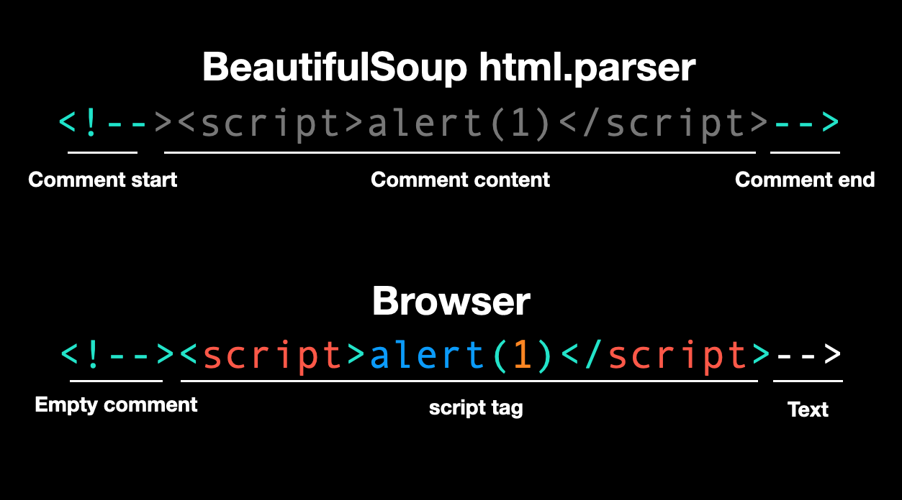
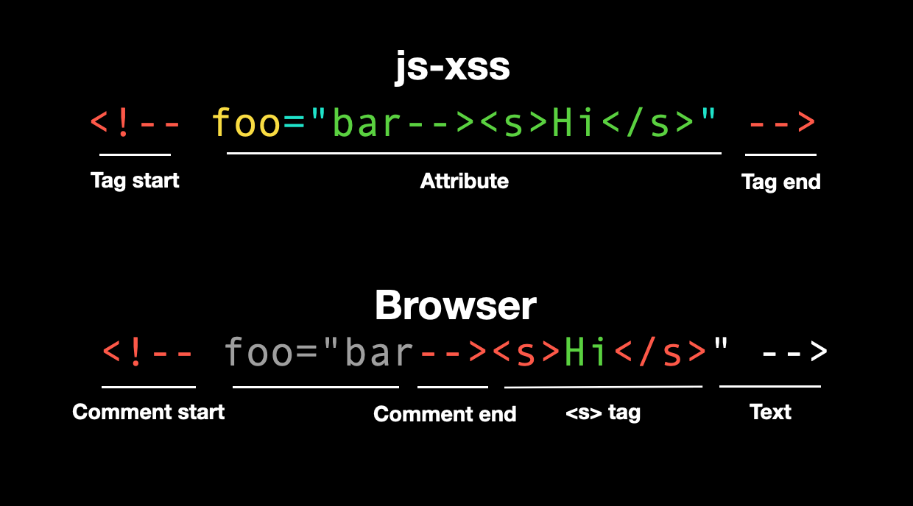

# The First Line of Defense Against XSS: Sanitization

After discussing the various basics and attack techniques of XSS, let's talk about defense. Starting from this post, we will officially enter Chapter 2: "Defense and Bypass for XSS."

As mentioned before when discussing XSS defense, we can encode user input to prevent it from being interpreted as its original meaning, thus avoiding risks.

In addition to encoding, there is another method that is more like "removing harmful parts from user input." This operation is called sanitization, and the program responsible for handling it is usually called a sanitizer.

There are some subtle differences between this and the previously mentioned "encoding" or "escaping." Encoding only encodes specific characters in user input, which will still be displayed as plain text. Sanitization, on the other hand, removes the entire part that does not comply with the rules, deleting it completely.

Before getting into the main topic, let's take a look at the answer to the previous post. At the end of the previous post, I posted a piece of code and asked if anyone had any questions:

``` js
// This is a feature that users can embed their favorite YouTube videos in their profile page
const url = 'value from user'

// Make sure it's YouTube video URL
if (url.startsWith('https://www.youtube.com/watch')) {
  document.querySelector('iframe').src = url
}
```

The problem with this code is that the validation for the URL is not strict enough, allowing users to input non-video URLs, such as `https://www.youtube.com/watch/../account`, which would lead to the account settings page.

But that doesn't sound too bad, right? It's just another YouTube page, and it should still be within YouTube.

In theory, that's correct, unless the website has an [open redirect](https://blog.huli.tw/2021/09/26/en/what-is-open-redirect/) vulnerability that can redirect to any URL. In that case, the attacker can control the content displayed in the iframe.

For example, if `https://www.youtube.com/redirect?target=https://blog.huli.tw` redirects to `https://blog.huli.tw`, I can use this URL to make the iframe display my blog instead of the expected YouTube video.

And indeed, YouTube currently has URLs with open redirect that can be exploited. However, since they can be fixed at any time, I won't provide the URL here.

If you need to validate URLs, the recommended approach is to use `new URL()` for parsing and make judgments based on the return value. This method is much more robust than simple string comparison or RegExp.

Now that we've finished the quiz, let's talk in detail about how to handle user input.

## The Most Basic Measure: Encoding

Why does XSS attack work?

It's because engineers expect user input to be simple text input, but in reality, this input is interpreted by the browser as part of HTML code. This difference creates the vulnerability. It's similar to SQL injection, where I think you're entering a string, but it's interpreted as part of an SQL command.

Therefore, the fix is simple: encode the user input and make it appear as it should.

For frontend development, when putting user input on the screen in JavaScript, remember to use `innerText` or `textContent` instead of `innerHTML`. This way, the user input will be interpreted as plain text.

Both React and Vue have built-in similar features. The basic logic is:

> By default, everything rendered will be treated as plain text. If you need to render HTML, use special methods like `dangerouslySetInnerHTML` or `v-html`.

As for the backend, in PHP, you can use the [htmlspecialchars](https://www.php.net/manual/en/function.htmlspecialchars.php) function. The table in the documentation shows which characters it encodes:


However, nowadays, many backends don't directly output content. They use template engines to handle it. For example, the commonly used `handlebarsjs` treats `{{ name }}` as encoded output by default. To output raw content, you need three curly braces: `{{{ vulnerable_to_xss }}}`.

In Laravel's Blade, `{{ $text }}` is encoded, while `{!! $text !!}` is not. I wonder if the exclamation mark is a warning: "Hey, be careful when using this."

Some template engines use filters. For example, in Python's Jinja, `{{ text }}` is encoded, while `{{ text | safe }}` means that the content is safe and can be directly output in its original format.

Therefore, when writing code, it's best to default to the safe approach. Pay attention to the unsafe parts (including the previously mentioned issue with `<a href>`, which requires special attention).

When will we use unsafe output methods?

Usually, this occurs when the original text is already in HTML format. For example, blog platforms may support certain HTML tags, which is a common scenario.

So how do we handle this situation? This is where sanitization comes in.

## Handling HTML

As the saying goes, use a library that someone else has already built, don't try to reinvent the wheel.

If the framework or programming language you are using already provides relevant functionality, use it. If not, find a well-reputed library that is widely used. Of course, these libraries may have vulnerabilities, that's inevitable, but they usually consider many scenarios and have resolved many issues, so they are much more thorough than what you can do on your own.

Moreover, these libraries must be specifically designed for sanitization purposes; otherwise, it's like doing it yourself.

For example, Python has a library called `BeautifulSoup` which can parse web pages and is commonly used for web scraping. However, it is not designed for sanitization, so using it may lead to issues.

Even though it's not designed for sanitization, it is used for parsing web pages, right? So, why can't we use it?

Let me demonstrate:

``` python
from bs4 import BeautifulSoup
html = """
  <div>
    test
    <script>alert(1)</script>
    
  </div>
"""
tree = BeautifulSoup(html, "html.parser")
for element in tree.find_all():
  print(f"name: {element.name}")
  print(f"attrs: {element.attrs}")
```

The output of this program is:

```
name: div
attrs: {}
name: script
attrs: {}
name: img
attrs: {'src': 'x', 'onerror': 'alert(1)'}
```

It seems fine, as it parses the tag names and attributes correctly. So, can't I just create an allow list or block list myself? It sounds reasonable, but actually...

``` python
from bs4 import BeautifulSoup
html = """
  <div>
    test
    <!--><script>alert(1)</script>-->
  </div>
"""
tree = BeautifulSoup(html, "html.parser")
for element in tree.find_all():
  print(f"name: {element.name}")
  print(f"attrs: {element.attrs}")
```

The output is:

```
name: div
attrs: {}
```

It seems normal, but if you open the above HTML in a browser, you will see our beloved pop-up window, indicating that JavaScript has been executed and the check by BeautifulSoup has been successfully bypassed.

The bypass is based on the difference in parsing between browsers and BeautifulSoup for the following HTML:

``` html
<!--><script>alert(1)</script>-->
```

BeautifulSoup's HTML parser treats this as a comment enclosed by `<!--` and `-->`, so it won't parse any tags or attributes.

However, according to the [HTML5 spec](https://html.spec.whatwg.org/multipage/syntax.html#comments), `<!-->` is a valid empty comment, so the above becomes a comment followed by the `<script>` tag and the text `-->`.



Exploiting this parser difference, an attacker can bypass the check and successfully execute XSS.

By the way, if you switch BeautifulSoup's parser to `lxml`, it still won't be able to parse it correctly. But if you switch to `html5lib`, it will correctly parse it as `<script>`. However, there may be other issues with `html5lib`.

(I learned this technique from CTF challenges, references: [irisctf2023 - Feeling Tagged (Web)](https://github.com/Seraphin-/ctf/blob/master/irisctf2023/feelingtagged.md) and [HackTM CTF Qualifiers 2023 - Crocodilu](https://ctf.zeyu2001.com/2023/hacktm-ctf-qualifiers/crocodilu#bypassing-html-sanitization))

So, are there any recommended libraries specifically designed for sanitization? Yes, I happen to know one.

### DOMPurify

[DOMPurify](https://github.com/cure53/DOMPurify) is an open-source package developed by Cure53, a German cybersecurity company, specifically for HTML sanitization. Cure53 has many members who specialize in web and frontend development and have reported numerous well-known vulnerabilities. They are experts in this field.

The basic usage of DOMPurify is as follows:

``` js
const clean = DOMPurify.sanitize(html);
```

It does a lot behind the scenes, not only removing dangerous tags and attributes but also defending against other attacks like DOM clobbering. It is very thorough.

DOMPurify allows only safe tags by default, such as `<h1>`, `<p>`, `<div>`, and `<span>`. It also removes all event handlers and clears out the javascript: pseudo-protocol mentioned earlier, ensuring that any HTML you input will not result in XSS in the default scenario.

But one thing to note is that the `<style>` tag is enabled by default, and we will discuss the related risks later.

If you want to allow more tags or attributes, you can adjust the relevant settings:

``` js
const config = {
  ADD_TAGS: ['iframe'],
  ADD_ATTR: ['src'],
};

let html = '<div><iframe src=javascript:alert(1)></iframe></div>'
console.log(DOMPurify.sanitize(html, config))
// <div><iframe></iframe></div>

html = '<div><iframe src=https://example.com></iframe></div>'
console.log(DOMPurify.sanitize(html, config))
// <div><iframe src="https://example.com"></iframe></div>
```

From the example above, even if we allow the `src` attribute of the `iframe` tag, dangerous content will still be automatically filtered out. This is because we only allow the `src` attribute and do not allow the use of `javascript:`.

However, if you want to allow some attributes or tags that can cause XSS, DOMPurify won't stop you:

``` js
const config = {
  ADD_TAGS: ['script'],
  ADD_ATTR: ['onclick'],
};

html = 'abc<script>alert(1)<\/script><button onclick=alert(2)>abc</button>'
console.log(DOMPurify.sanitize(html, config))
// abc<script>alert(1)</script><button onclick="alert(2)">abc</button>
```

DOMPurify's documentation is quite detailed, and there is a specific page called [Security Goals & Threat Model](https://github.com/cure53/DOMPurify/wiki/Security-Goals-&-Threat-Model) that explains the goals of this library and the situations in which issues may arise.

## Correct Library, Incorrect Usage

When using these libraries, it is important to learn how to use them through official documentation and pay extra attention during usage. Even with the correct library, incorrect configurations can still cause problems.

The first classic case is a vulnerability discovered by the well-known Taiwanese hacker, orange, in 2019. When filtering content, HackMD used the following configuration (HackMD uses a different package called js-xss):

``` js
var filterXSSOptions = {
  allowCommentTag: true,
  whiteList: whiteList,
  escapeHtml: function (html) {
    // allow html comment in multiple lines
    return html.replace(/<(?!!--)/g, '&lt;').replace(/-->/g, '-->').replace(/>/g, '&gt;').replace(/-->/g, '-->')
  },
  onIgnoreTag: function (tag, html, options) {
    // allow comment tag
    if (tag === '!--') {
            // do not filter its attributes
      return html
    }
  },
  // ...
}
```

If the tag is `!--`, it is directly ignored and not returned. The intention was to preserve comments, for example, `<!-- hello -->` would be treated as a tag named `!--`.

However, orange bypassed it using the following method:

``` html
<!-- foo="bar--><s>Hi</s>" -->
```

Since `<!--` is treated as a tag, the content above just adds the `foo` attribute. But when the browser renders it, the opening `<!--` combines with `bar-->` in `foo`, becoming an HTML comment, and the following `<s>Hi</s>` is displayed, resulting in an XSS vulnerability.



For more detailed information and the fix, please refer to the original article: [A Wormable XSS on HackMD!](https://blog.orange.tw/2019/03/a-wormable-xss-on-hackmd.html)

I also discovered a different case in 2021, but it was still a misuse.

A website sanitized `article.content` on the backend, and the frontend rendering was written as follows:

``` jsx
<>
  <div
    className={classNames({ 'u-content': true, translating })}
    dangerouslySetInnerHTML={{
      __html: optimizeEmbed(translation || article.content),
    }}
    onClick={captureClicks}
    ref={contentContainer}
  />

  <style jsx>{styles}</style>
</>
```

The already filtered content went through the `optimizeEmbed` processing, which means that if there is a problem with `optimizeEmbed`, it can still cause XSS.

Let's see what this function does (some code is omitted):

``` js
export const optimizeEmbed = (content: string) => {
  return content
    .replace(/\<iframe /g, '<iframe loading="lazy"')
    .replace(
      /]*?src\s*=\s*['\"]([^'\"]*?)['\"][^>]*?>/g,
      (match, src, offset) => {
        return /* html */ `
      <picture>
        <source
          type="image/webp"
          media="(min-width: 768px)"
          srcSet=${toSizedImageURL({ url: src, size: '1080w', ext: 'webp' })}
          onerror="this.srcset='${src}'"
        />
        
      </picture>
    `
      }
    )
}
```

Here, the image URL is directly concatenated as a string, and the attributes are not enclosed in single or double quotes! If we can control `toSizedImageURL`, we can create an XSS vulnerability. The implementation of this function is as follows:

``` js
export const toSizedImageURL = ({ url, size, ext }: ToSizedImageURLProps) => {
  const assetDomain = process.env.NEXT_PUBLIC_ASSET_DOMAIN
    ? `https://${process.env.NEXT_PUBLIC_ASSET_DOMAIN}`
    : ''
  const isOutsideLink = url.indexOf(assetDomain) < 0
  const isGIF = /gif/i.test(url)

  if (!assetDomain || isOutsideLink || isGIF) {
    return url
  }

  const key = url.replace(assetDomain, ``)
  const extedUrl = changeExt({ key, ext })
  const prefix = size ? '/' + PROCESSED_PREFIX + '/' + size : ''

  return assetDomain + prefix + extedUrl
}
```

If the URL does not meet the specified conditions, it is directly returned; otherwise, some string processing is performed before returning. In summary, we can indeed control the return value of this function.

If the passed URL is `https://assets.matters.news/processed/1080w/embed/test style=animation-name:spinning onanimationstart=alert(1337)`, the final concatenated HTML will be:

``` html
<source
  type="image/webp"
  media="(min-width: 768px)"   
  srcSet=https://assets.matters.news/processed/1080w/embed/test 
  style=animation-name:spinning 
  onanimationstart=console.log(1337)
  onerror="this.srcset='${src}'"
/>
```

By using `style=animation-name:spinning` along with the event handler `onanimationstart=console.log(1337)`, an XSS vulnerability is successfully created without requiring user interaction.


From the above two cases, we can see that:

1. Using incorrect configurations
2. Modifying content after filtering

can both cause problems and evolve into XSS vulnerabilities.

Therefore, even with the correct library, it is important to pay attention to the usage. A small mistake can still lead to an XSS vulnerability.

## Conclusion

In this article, we introduced the first line of defense against XSS, which is encoding or sanitizing user input to remove dangerous content or render it safely on the screen.

This sounds simple but is actually difficult, otherwise there wouldn't be so many XSS vulnerabilities. The article also introduces many real-life examples to help everyone avoid pitfalls, so that in similar situations in the future, we know what to pay attention to.

Since it is mentioned as the first line of defense, it means there is still a second line of defense. Before introducing the second line of defense in the next article, everyone can think about what the second line of defense might be. When the website forgets to handle user input, what other methods can be used to block XSS?

Alternatively, you can also think about why we need a second line of defense.

References:

1. [Preventing XSS may be more difficult than you think](https://blog.huli.tw/2021/05/25/en/prevent-xss-is-not-that-easy/).
