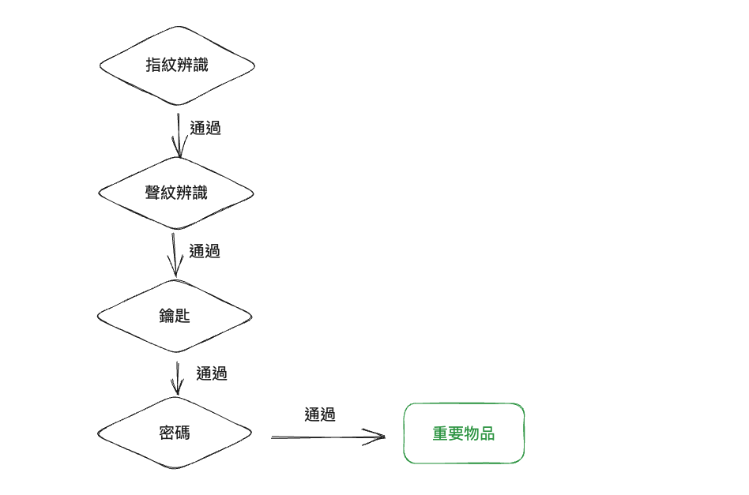

# The Third Line of Defense against XSS: Reducing the Impact Scope

In the first line of defense, we processed user input to ensure that it is encoded or sanitized, preventing the insertion of malicious content. The second line of defense is CSP, which prevents the execution of JavaScript and loading of external resources, even if malicious content is inserted. 

Now, let's discuss the third line of defense, which assumes that XSS will inevitably occur and formulates protection strategies based on this assumption.

Some may wonder why we need to do this. Shouldn't the first two lines of defense be enough to prevent XSS attacks? Why do we need to assume that XSS will occur and develop strategies to mitigate the damage? Isn't this putting the cart before the horse?

Let me give you an example. You have probably seen movies like "Mission: Impossible" where there are scenes involving theft. The place where valuable items are stored is always designed with multiple layers of security measures. There are retina recognition, facial recognition, voiceprint recognition, and even walking posture recognition. After passing these checks, you still need a key to open the vault door. Inside the door, there may be a safe, and you need another set of passwords to open the safe and finally get the item.



The reason for having multiple layers of security is simple: to increase safety. Although some designs may seem secure, you can never guarantee that they won't be breached. Therefore, additional layers of protection are needed to ensure that "only when each layer is breached will there be damage," thus increasing the cost for attackers.

The same principle applies to cybersecurity. Even if we thoroughly check the backend code and ensure that every part is properly validated and encoded, we cannot guarantee that the frontend will never be vulnerable to XSS. New developers may make mistakes and write insecure code, and third-party libraries may have 0-day vulnerabilities or be compromised with malicious code. All of these are possibilities.

That's why we add CSP, which at least ensures that if the first layer is compromised, the second layer can still block the attack, preventing the attacker from loading external resources or sending data out. Of course, the second layer is not foolproof either. In the upcoming chapters, we will see techniques to bypass CSP rules, rendering CSP ineffective.

After taking all possible measures to protect against XSS, the third layer is to think in reverse: "If XSS inevitably occurs, what can we do to minimize the damage?" This adds an extra layer of security so that even if XSS does occur, the impact will not be as severe.

First of all, I want to clarify that every company and product should choose appropriate protection measures based on their own cybersecurity needs. To put it more professionally, it depends on their risk appetite. How much risk are they willing to accept?

While adding an extra layer does increase security to some extent, it also adds costs and complexity. Not every product requires such stringent protection. For example, in the case of my blog website, even if it is affected by XSS, the impact is minimal. Therefore, I don't need CSP or to consider how to mitigate the damage caused by XSS.

On the other hand, for a cryptocurrency exchange, if the cold wallet is stolen or compromised, the losses could be significant. Therefore, they usually implement a series of risk management measures. For example, the cold wallet itself is stored in a highly encrypted storage device, which is then placed in a fireproof and waterproof safe. This safe is kept in a room with 24-hour surveillance, and access to the room requires fingerprint recognition and a key, among other measures.

Knowing the benefits of different layers allows you to immediately identify possible solutions and evaluate their costs and benefits. The more information you have, the better you can determine whether to adopt these solutions.

Before discussing the protection measures for the third layer, we need to understand what an attacker can do once they find an XSS vulnerability.

When an attacker discovers an XSS vulnerability, they can execute JavaScript code on a page when a user opens it. Therefore, the most common actions are stealing tokens used for authentication or directly calling APIs to perform dangerous operations such as changing passwords or making transfers. They may also steal data, such as personal information or transaction records.

To reduce the impact of XSS, we need to find ways to limit what attackers can do.

## Tactic 1: The Most Effective Solution - Multi-Factor Authentication

Why can attackers access data or perform operations after XSS? It's because the backend of the website considers the request to be legitimate, either from the user themselves or, to be more technical, the request contains a token that can verify the user's identity. The backend trusts this request and executes the operation.

Therefore, one of the most effective solutions is to introduce multi-factor authentication. In addition to the token, the server should require other information that only the user knows, thereby reducing the potential harm.

For example, when making a transfer in online banking, after entering the amount and recipient's address, there is usually an additional step, such as entering a pre-defined online banking password or receiving an SMS verification code. This is to ensure an extra layer of security. For instance, if a banking website has an XSS vulnerability and an attacker can execute arbitrary code on the banking page, without the additional security step, the attacker could simply call the `/transfer` API and transfer your money.

However, with the additional step, one of the parameters for `/transfer` would be the SMS verification code. Since the attacker doesn't know the verification code, they cannot successfully call the API and, therefore, cannot steal your money.

You will notice that significant operations usually require an additional step, such as entering the current password to change it or receiving an SMS verification code for transfers. The concept is similar.

And in addition to XSS, it also ensures that "even if someone physically accesses your computer, they cannot do anything malicious." This shows a significant improvement in security. Typically, security and user experience are inversely proportional. The higher the security, the worse the experience because there are more things you have to do, and this is unavoidable.

For example, the most secure approach is to require a new SMS for every API call, which is very secure but also provides a poor user experience. Therefore, in practical situations, most operations only require a second verification method for major actions. Other APIs that retrieve data, such as transaction records or user data, do not require additional protection.

## Second Trick: Preventing Token Theft

As mentioned earlier, the most common way is to steal the token after an attack. Here, the term "token" does not refer to any specific technology. It can be a session ID, a JWT token, or an OAuth token. Just consider it as something that can verify identity.

If the token is stolen, the user can use it to send requests to the backend API without being limited to the browser.

Some people may think, "Does it matter if the token is stolen? Can't it be used to perform actions on behalf of the user?" For example, suppose the token is stored as an HttpOnly cookie, which ensures that JavaScript cannot access the cookie. However, when an attacker uses `fetch('/api/me')`, they can still obtain personal data because the cookie is automatically included in the request.

This is correct, but although it may not seem different, attackers can still do many things. However, there are some subtle differences.

The first difference is whether they will be "restricted by the website."

If they have the token, they can return it and send requests to the backend from anywhere. But if they don't have it, they can only execute malicious code at the XSS attack point. At this point, there may be some restrictions, such as limitations on payload length or the same-origin policy.

For example, let's say there are two websites, `a.huli.tw` and `b.huli.tw`, both using cookies stored in `huli.tw` for authentication.

Suppose the attacker successfully finds an XSS vulnerability on `a.huli.tw`, but the user data is on `b.huli.tw`. In this case, they cannot access the user's data on `a` because the same-origin policy blocks the `fetch` request. However, if both services use the same token and store it in `localStorage`, the attacker can use this token to access `b` and successfully retrieve the user's data.

The second difference is whether there is a "time limit." If they have the token, they can send requests as the user as long as the token is not expired.

But if they can only use XSS, it means they can only execute attacks when the user has the webpage open. Once the user closes the webpage or the browser, they cannot execute JavaScript code anymore.

Therefore, if possible, it is best not to directly take away the token, as it limits the attacks that the attacker can launch.

With the current frontend mechanisms, the only way to ensure that JavaScript cannot access the token is to use an HttpOnly cookie (excluding browser vulnerabilities and APIs that directly return tokens). There are no other options.

However, if your requirement is to "only allow certain JavaScript to access the token," there is another solution. But note that this solution does not persistently store the token. Once the user refreshes the page, the token will be gone.

This solution is simple: store the token in a JavaScript variable and wrap it with a closure to ensure that it cannot be accessed from outside, like this:

``` js
const API = (function() {
  let token
  return {
    login(username, password) {
      fetch('/api/login', {
        method: 'POST',
        body: JSON.stringify({ username, password })
      }).then(res => res.json())
      .then(data => token = data.token)
    },

    async getProfile() {
      return fetch('/api/me', {
        headers: {
          'Authorization': 'Bearer ' + token
        }
      })
    }
  }
})()

// 使用的時候
API.login()
API.getProfile()
```

In this way, even if the attacker finds an XSS vulnerability, they cannot "directly" access the `token` variable due to the scope. I marked the word "directly" because once the attacker has XSS, they can do many malicious things, like this:

``` js
window.fetch = function(path, options) {
  console.log(options?.headers?.Authorization)
}
API.getProfile()
```

By replacing the implementation of `window.fetch`, they can intercept the parameters passed to the function and indirectly access the `token`.

Therefore, a more secure method is to prevent XSS from interfering with the execution environment that has the token, achieving context isolation. In web frontend, this can be accomplished using Web Workers. By using Web Workers, a new execution environment can be created to isolate it, as shown in the following diagram:


The approximate code is as follows (just a conceptual example, not actually executed):

``` js
// worker.js
let token
async function login({ username, password }) {
  return fetch('/api/login', {
    method: 'POST',
    body: JSON.stringify({ username, password })
  }).then(res => res.json())
  .then(data => {
    // 讓 token 不要回傳
    const { token, ...props } = data
    token = data.token
    return props
  })
}

async function getProfile() {
  return fetch('/api/me', {
    headers: {
      'Authorization': 'Bearer ' + token
    }
  })
}

onmessage = async function(e) {
  const { name, params } = e.data
  let response
  if (name === 'login') {
    response = await login(params)
    
  } else if (name === 'getProfile') {
    response = await getProfile()
  }

  postMessage({
    name,
    response
  })
}
```

And in the application code, initialize the worker and call the API:

``` js
const apiWorker = new Worker("worker.js");

async function login(params) {
  return new Promise(resolve => {
    apiWorker.postMessage({
      name: 'login',
      params: {
        username,
        password
      }
    })

    apiWorker.onmessage = (e) => {
      const { name, response } = e.data
      if (name === 'login') {
        resolve(e.response)
      }
    }
  })
}

login({
  username: 'test',
  password: 'test'
})
```

Actually, the idea is to put all API network requests in a worker. Due to the isolation of the execution environment, unless there is XSS in the worker, the main thread cannot interfere with the worker and cannot access its data. This ensures the security of the token.

However, this solution obviously increases development costs because many things need to be adjusted. If you are interested in more details and pros and cons of this solution, you can refer to the technical blog of Mercari, a Japanese second-hand goods trading platform: [Building secure web apps using Web Workers](https://engineering.mercari.com/en/blog/entry/20220930-building-secure-apps-using-web-workers/)

Regarding token storage, if you need to access the token in JavaScript and do not need persistence, this option is probably the best solution. Auth0, a company specializing in identity verification, has also written an article discussing token storage, which you can refer to: [Auth0 docs - Token Storage](https://auth0.com/docs/secure/security-guidance/data-security/token-storage)

## Third Measure: Limit API Calls

As mentioned earlier, even if the token is not stolen, attackers can still call the API and get a response through XSS, which is true when using cookies to store the token.

However, if you use the method mentioned above, using Web Workers and variables to store the token, the situation is different. Using this method means that it is useless for attackers to call the API themselves using `fetch()` because there will be no token attached to the request, so the server's authentication will not pass.

Just like the example given above, all API requests must go through Web Workers, which is like creating a frontend proxy at the worker level. Therefore, even if XSS can access `apiWorker`, it can only call the APIs implemented by `apiWorker` and cannot call others.

For example, suppose the backend API server has implemented a `/uploadFile` function, but this function is for internal use only, so it is not implemented in the worker. In this case, attackers cannot use this function no matter what, adding an extra layer of protection.

## Fourth Measure: Limit Token Permissions

Similar to when devising defense strategies against XSS, it is important to minimize the damage in case XSS occurs. Therefore, the last measure is to assume that the token will be exploited and consider what else can be done to reduce the damage.

The most intuitive approach is to limit the permissions of the token, so that it cannot perform too many actions. Of course, backend access control is a must, but the frontend can also do more.

For example, suppose there is a restaurant reservation system, and the backend API is a complete package, whether it is for making reservations or for internal use. They all use the same API server, such as `/users/me` to get one's own data and `/internal/users` to get all user data (with permission checks).

Suppose XSS occurs on the restaurant reservation website, and the target being attacked is an authorized internal employee. In that case, the attacker can call `/internal/users` to get all user data. The ideal solution would be to separate the internal system from the restaurant reservation system at the backend API level, but this may require too much time and cost.

In this case, another solution called Backend For Frontend (BFF) can be used. BFF is a backend server specifically for the frontend, and all frontend requests go through BFF, as shown in the diagram:


Therefore, the token obtained by the frontend is only the token used to communicate with BFF, not the token of the backend server behind BFF. In this way, access permissions can be limited on the BFF side, directly blocking all requests to `/internal`, and restricting the permissions of the token obtained by the frontend, ensuring that the APIs used internally cannot be called.

## Conclusion

"Preventing XSS" is something that must be done, but it is only the first line of defense. If only this is done, the defense is either 0 or 1. Either everything is well defended, or if one aspect is not well defended, it is as if there is no defense at all, and the system is easily breached.

That's why we need a second or even third line of defense to provide deeper security. Even if one aspect forgets to filter user input, there is CSP blocking JavaScript execution. Even if CSP is bypassed, at least the transfer function cannot be executed because a mobile verification code is required.

More layers of defense mean higher security, but also higher costs and system complexity. It is important to understand the means of defense, but it does not mean that every product needs all these measures. For most websites, the first two lines of defense may be sufficient.

Originally, I didn't have a deep understanding of this topic. It was just by chance that someone brought up this topic in the Facebook group "Front-End Developers Taiwan," which gave me a better understanding of it and prompted me to include it in this series of articles.

I would like to express my special thanks to Ho Hong Yip for providing the Auth0 reference materials and to 証寓 for sharing multiple links. The technical discussions with them have helped me clarify my thoughts on this issue to some extent (although there may still be room for improvement, so please feel free to leave comments for further discussion).

References:

1. [Facebook Group: Front-End Developers Taiwan Discussion Thread](https://www.facebook.com/groups/f2e.tw/posts/6432399706797340/)
2. [auth0 - Token Storage](https://auth0.com/docs/secure/security-guidance/data-security/token-storage)
3. [Building secure web apps using Web Workers](https://engineering.mercari.com/en/blog/entry/20220930-building-secure-apps-using-web-workers/)
4. [Why is BFF pattern deemed safer for SPA's?](https://stackoverflow.com/questions/73096336/why-is-bff-pattern-deemed-safer-for-spas)
