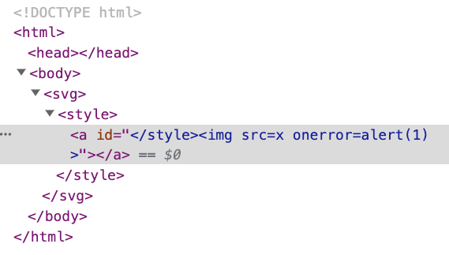

# Bypassing Your Defense: Mutation XSS

When we talked about sanitization earlier, I reminded everyone not to attempt implementing it themselves, but to use existing libraries instead. This is because the waters are deep and there are many pitfalls.

But do these libraries also have issues? It is possible, and in fact, it has happened before. One common attack against sanitizers is called mutation-based XSS, also known as mutation XSS or mXSS.

Before understanding mXSS, let's take a look at how sanitizers typically work.

## Basic Flow of Sanitizers

Based on our previous experience, the input to a sanitizer is a string that contains HTML, and the output is also a string containing HTML. Here's an example of how it is used:

``` js
const inputHtml = '<h1>hello</h1>'
const safeHtml = sanitizer.sanitize(inputHtml)
document.body.innerHTML = safeHtml
```

So, how does the sanitizer work internally? In fact, the internal operation is similar to the sanitizer we implemented using `BeautifulSoup`:

1. Parse `inputHtml` into a DOM tree.
2. Delete invalid nodes and attributes based on the configuration file.
3. Serialize the DOM tree into a string.
4. Return the string.

This process seems to have no issues, but the devil is in the details. What if "HTML that appears to be safe is actually not safe"? Wait, didn't we already sanitize it? How can it be unsafe? Let's look at an example first.

## Browser's "Considerate" Feature

The browser is a considerate software that, in order to handle various situations and comply with specifications, may not display the HTML exactly as you see it. For example, consider the following example:

``` html
<!DOCTYPE html>
<html>
<body>
  <div id=content></div>
  <script>
    content.innerHTML = '<table><h1>hello</h1></table>'
  </script>
</body>
</html>
```

Putting an `<h1>` inside a `<table>` seems fine, but if you open this webpage, you will notice:


The structure of the HTML has changed!

It becomes:

``` html
<h1>hello</h1>
<table></table>
```

The `<h1>` that should have been inside the `<table>` has "jumped out" from it. This happens because the browser, based on the HTML specification, determines that `<h1>` should not be inside `<table>`, so it kindly takes it out. From the history of web development, it is normal for browsers to try to fix invalid HTML. After all, it's better than throwing an error or displaying a blank page.

This behavior of "HTML strings being changed by the browser during rendering" is called mutation. And the XSS achieved by exploiting this behavior is naturally called mutation XSS.

Let's look at another example:

``` html
<!DOCTYPE html>
<html>
<body>
  <div id=content></div>
  <script>
    content.innerHTML = '<svg><p>hello</svg>'
  </script>
</body>
</html>
```

The rendered result is:


The browser thinks that `<p>` should not be inside `<svg>`, so it moves the `<p>` out of the `<svg>` and also fixes the HTML by adding `</p>`.

What about this even stranger example? This time, instead of `<p>`, it's `</p>`:

``` html
<!DOCTYPE html>
<html>
<body>
  <div id=content></div>
  <script>
    content.innerHTML = '<svg></p>hello</svg>'
  </script>
</body>
</html>
```

The result is:

``` html
<svg><p></p>hello</svg>
```

The browser automatically fixes `</p>` by adding `<p>` in front of it, but the tag is still inside the `<svg>`.

(Note: The behavior of Chrome browser has been fixed now, and it will be `<svg></svg><p></p>hello`. So, currently, we cannot reproduce this situation, but let's continue.)

Now, something interesting happens. If we take `<svg><p></p>hello</svg>` and pass it to `innerHTML`, what will be the result?

``` html
<!DOCTYPE html>
<html>
<body>
  <div id=content></div>
  <script>
    content.innerHTML = '<svg><p></p>hello</svg>'
    console.log(content.innerHTML)
  </script>
</body>
</html>
```

The result is:

``` html
<svg></svg>
<p></p>
hello
```

Not only the `<p>`, but even the following "hello" jumps out. Everything that was originally inside the `<svg>` is now outside of it.

So, how does this series of changes help us bypass the sanitizer? This requires combining it with the sanitizer process mentioned earlier.

Let's assume our `inputHtml` is like this: `<svg></p>hello</svg>`. The first step of the sanitizer is to parse it into a DOM tree. Based on the previous experiment, it becomes:

``` html
<svg>
  <p></p>
  hello
</svg>
```

It looks completely fine, with nothing to filter. The next step is to serialize the DOM tree into a string, resulting in: `<svg><p></p>hello</svg>`.

Next, our frontend team received the `safeHtml` and executed `document.body.innerHTML = safeHtml`. The resulting HTML is as follows:

``` html
<svg></svg>
<p></p>
hello
```

For the sanitizer, `<p>` and "hello" are inside the SVG, but the final result is different. They are placed outside. Therefore, through this mutation, we can make any element jump out of the `<svg>`.

You might ask, "So what? What's the use of this?" This is where it gets interesting.

## The Magic of HTML

`<style>` is a magical tag because everything inside this tag is interpreted as text. For example:

``` html
<!DOCTYPE html>
<html>
<body>
  <style>
    <a id="test"></a>
  </style>
</body>
</html>
```

is interpreted as:


The black text represents a text node.

But here's the interesting part. If we add an outer `<svg>`, the way the browser interprets it will be different, and everything changes. The current HTML source code is:

``` html
<!DOCTYPE html>
<html>
<body>
  <svg>
    <style>
      <a id="test"></a>
    </style>
  </svg>
</body>
</html>
```

The interpretation result is:


The `<a>` inside the `<style>` becomes an actual HTML element, not just plain text.

What's even more interesting is that you can construct the following HTML:

``` html
<svg>
  <style>
    <a id="</style>"></a>
  </style>
</svg>
```

And it will be displayed as:



Here, we simply added an id to `<a>`, with the content `</style>`. Although it contains `</style>`, it does not close the previous `<style>`. Instead, it becomes part of the `id` attribute. The same goes for the `` tag. It is not a new tag, but part of the attribute content.

However, if we remove the `<svg>` and change it to:

``` html
<style>
  <a id="</style>"></a>
</style>
```

Since `<a>` is no longer an element but just plain text, it doesn't have any attributes. Therefore, the `</style>` here will close the previous `<style>`, resulting in:


The `` inside the id of `<a>` was originally just part of the attribute content, but now it appears as an actual HTML element because of the preceding `</style>`.

From the experiments above, we can conclude that whether there is an outer `<svg>` for `<style>` is important because it affects how the browser interprets it.

## Putting It All Together

We mentioned the browser's mutation at the beginning, which allows us to "make all elements jump out of the `<svg>`". We also mentioned that "whether there is an outer `<svg>` for `<style>` is important". Combining these two concepts, we can have a mXSS.

On September 19, 2019, DOMPurify released version 2.0.1 to fix an mXSS vulnerability that bypassed checks using mutations. The problematic payload at that time was:

``` html
<svg></p><style><a id="</style>">
```

After parsing this into a DOM tree, the structure becomes:

``` html
<svg>
  <p></p>
  <style>
    <a id="</style>"></a>
  </style>
</svg>
```

The browser does a few things here:

1. Converts `</p>` to `<p></p>`
2. Automatically closes the `<svg>`, `<style>`, and `<a>` tags

Then, DOMPurify checks based on this DOM tree. Since `<svg>`, `<p>`, `<style>`, and `<a>` are all allowed tags, and the id is an allowed attribute, everything is fine. Therefore, it returns the serialized result:

``` html
<svg>
  <p></p>
  <style>
    <a id="</style>"></a>
  </style>
</svg>
```

Then, the user's program passes this string to `innerHTML`, and the aforementioned mutations occur. All the tags jump out of the `<svg>`, resulting in:

``` html
<svg></svg>
<p></p>
<style><a id="</style>

"></a>
</style>
```

Because `<style>` also jumps out, the `<a>` element no longer exists and becomes plain text. As a result, `</style>` prematurely closes, causing the hidden `` to become an actual HTML element within the attribute content. This ultimately leads to XSS.

## Fixing the Issue

To fix this problem, DOMPurify added a [check](https://github.com/cure53/DOMPurify/commit/ae16278018e7055c82d6a4ec87132fea3e236e30#diff-ac7cd96b8f4b994868af43ac8aff25573dd7cede1aab33fdcfd438811c7e853d) in the code to prevent being affected by mXSS.

And at the same time, this issue was also reported to Chromium because it was a parser behavior error that caused this strange mutation: [Issue 1005713: Security: Parser bug can introduce mXSS and HTML sanitizers bypass](https://bugs.chromium.org/p/chromium/issues/detail?id=1005713#c_ts1574850321). As a result, during the discussion, developers discovered that this behavior actually complied with the specification, which means that it was a bug in the HTML specification!

So this issue became a matter of fixing the specification as well, and they opened an issue in the specification's repository: [Unmatched p or br inside foreign context needs a special parser rule #5113](https://github.com/whatwg/html/issues/5113).

The final result was that a new rule was added to the specification, and Chromium fixed this vulnerability based on the new rule.

So afterwards, similar vulnerabilities were no longer found, and everyone lived happily ever after... or did they?

No, later on, DOMPurify was found to have a more complex bypass method, but after fixing it, it became even stronger, and basically no issues occurred thereafter.

The person who discovered this issue was Michał Bentkowski, a senior expert in frontend security. He has reported various big and small issues and has a deep understanding of HTML parsing and various mechanisms. We will see some of the classic vulnerabilities he reported later on.

If you want to delve deeper into this issue, you can refer to the articles he wrote in the past. My knowledge of mXSS comes from him:

1. [Write-up of DOMPurify 2.0.0 bypass using mutation XSS](https://research.securitum.com/dompurify-bypass-using-mxss/)
2. [Mutation XSS via namespace confusion – DOMPurify < 2.0.17 bypass](https://research.securitum.com/mutation-xss-via-mathml-mutation-dompurify-2-0-17-bypass/)
3. [HTML sanitization bypass in Ruby Sanitize < 5.2.1](https://research.securitum.com/html-sanitization-bypass-in-ruby-sanitize-5-2-1/)

## Conclusion

When I first encountered mXSS, I felt confused and didn't fully understand it. In order to write this article, I went through the context again and tried it myself, and then I felt like I understood what was going on. Understanding its concept is not difficult, but understanding all the details requires a bit more time. Moreover, the issues that were discovered have already been fixed, so it's not possible to reproduce them on current browsers, which is a bit troublesome.

But overall, I think mXSS is a more advanced topic within XSS. It involves the HTML specification, browser parsing, and the operation of sanitizers. It's normal to spend a bit more time to understand it.
