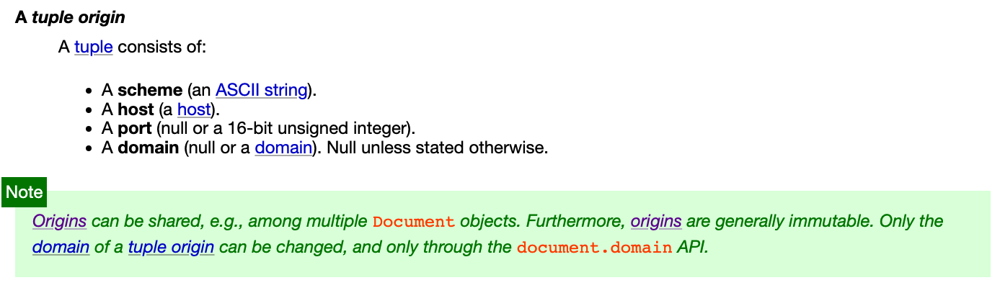

# The Essence: Same-origin Policy and Site

In previous articles, we have mentioned "same-origin" several times. It is an extremely important term in both the frontend and cybersecurity worlds. The same-origin policy of browsers is crucial in development and also when dealing with attacks.

Additionally, there are a few terms that are often confused, such as host and site. For example, XS in XSS stands for cross-site, and CS in CSRF also means cross-site. So, what is the difference between origin and site? How are they different from host?

This article will help you fully understand these concepts so that you won't get confused anymore.

## What exactly are Origin and Site? How to differentiate them?

Let's start with a simple and somewhat incorrect explanation, and then we will correct it step by step.

Origin is composed of the scheme, port, and host. When combined, they form the origin.

For example, if we have a URL like `https://huli.tw/abc`, the components are:

* Scheme: https
* Port: 443 (the default port for https)
* Host: huli.tw

Therefore, its origin is `https://huli.tw`. As you can see, the path part `/abc` does not affect the origin, and for the port part, https already implies the default port 443.

The same origin means that the origins of two URLs must be the same. For example:

1. `https://huli.tw/abc` and `https://huli.tw/hello/yo` are the same origin because the scheme, port, and host are the same, and the path does not affect the result.
2. `https://huli.tw` and `http://huli.tw` are not the same origin because the schemes are different.
3. `http://huli.tw` and `http://huli.tw:8080` are not the same origin because the ports are different.
4. `https://huli.tw` and `https://blog.huli.tw` are not the same origin because the hosts are different.

From the above examples, we can see that the conditions for the same origin are quite strict. Basically, except for the path, all other parts must be the same to be considered the same origin.

Now let's take a look at site. Site considers fewer elements compared to origin; it only looks at the scheme and host, ignoring the port. The definition of two URLs being the same site is more relaxed, as the host does not have to be exactly the same; as long as it is a subdomain, it is still considered the same site.

For example:

1. `https://huli.tw/abc` and `https://huli.tw/hello/yo` are the same site because the scheme and host are the same.
2. `https://huli.tw` and `http://huli.tw` are not the same site because the schemes are different.
3. `http://huli.tw` and `http://huli.tw:8080` are the same site because the port does not affect the result.
4. `https://huli.tw` and `https://blog.huli.tw` are the same site because both huli.tw and blog.huli.tw are under the same parent domain, huli.tw.
5. `https://abc.huli.tw` and `https://blog.huli.tw` are also the same site because both abc.huli.tw and blog.huli.tw are under the same parent domain, huli.tw.

Compared to the same origin, it is evident that the same site is more relaxed. Different ports are considered the same site, and as long as the host belongs to the same parent domain, it is generally considered the same site.

However, as I mentioned at the beginning, although the above definitions are correct in most cases, they are not precise. Let's directly refer to the specification to see the exceptions.

## Examining Same-origin in Detail

In the HTML specification's [7.5 Origin](https://html.spec.whatwg.org/multipage/origin.html#origin) section, you can find the complete definition. Let's take a look at the specification's explanation of origin:

> Origins are the fundamental currency of the web's security model. Two actors in the web platform that share an origin are assumed to trust each other and to have the same authority. Actors with differing origins are considered potentially hostile versus each other, and are isolated from each other to varying degrees.

The content here is very clear. It starts by explaining that if two websites have the same origin, it means that these two websites trust each other. However, if they have different origins, they will be isolated and restricted.

Next, the specification divides origins into two types: "An opaque origin" and "A tuple origin".

Opaque origin can be considered as an origin that only appears in special cases. For example, when I open a webpage on my local machine, the URL will be "file:///...". In this case, when sending a request within the webpage, the origin will be an opaque origin, which is "null".

Tuple origin is more common and is the type of origin we are more concerned about. The document states that a tuple origin includes:

1. scheme (an ASCII string).
2. host (a host).
3. port (null or a 16-bit unsigned integer).
4. domain (null or a domain). Null unless stated otherwise.

You might wonder why there is both a host and a domain. We will discuss this later.

Furthermore, the specification also describes the algorithm to determine whether two origins, A and B, are the same origin:

1. If A and B are the same opaque origin, then return true.
2. If A and B are both tuple origins and their schemes, hosts, and port are identical, then return true.
3. Return false.

Either the two origins are the same opaque origin, or their schemes, hosts, and ports are all identical to be considered the same origin. In addition to the same origin, you will also come across another term called "same origin-domain" in the specification, which will be explained later.

As I mentioned earlier, same origin is a strict restriction. For example, for the URL "https://huli.tw/api", since the origin does not consider the path, its origin will be "https://huli.tw". This means that any website with the same origin must have a URL starting with "https://huli.tw/*" to be considered the same origin.

Although "https://huli.tw" and "https://blog.huli.tw" are related to domain and subdomain, they are not the same origin because the hosts are different.

Remember this, as it is important.

The detailed exploration of origin and same origin in the specification, compared to the "inaccurate statement" mentioned at the beginning, adds an opaque origin, same origin-domain, and an unused "domain" in the origin tuple.

Finally, let me mention one more thing. When I say that the origin of "https://huli.tw/api" is "https://huli.tw", a more accurate statement would be: "The serialized form of the origin of 'https://huli.tw/api' is 'https://huli.tw'".

This is because it was mentioned earlier that the origin is actually a tuple, represented as `(https, huli.tw, null, null)`, and it becomes `https://huli.tw` when serialized into a string. I find the serialized form of the tuple easier to read compared to its representation as a tuple. Therefore, when both can convey similar information, I prefer the latter approach.

## Exploring same site in detail

The definition of site is also in the same specification, stating:

> A site is an opaque origin or a scheme-and-host.

So, a site can be an opaque origin or a scheme-and-host.

In the specification, you can find another term called "schemelessly same site" in addition to same site. The difference between these two is also clear: same site considers the scheme, while schemelessly same site does not consider the scheme.

Therefore, when determining whether two origins, A and B, are the same site, the algorithm is as follows:

> Two origins, A and B, are said to be same site if both of the following statements are true:
> 
> * A and B are schemelessly same site
> * A and B are either both opaque origins, or both tuple origins with the same scheme

If A and B are the same site, either they are both opaque origins or they have the same scheme and are schemelessly same site.

Therefore, the concept of same site depends on the scheme. URLs with different schemes, such as http and https, are never considered the same site, but they can be schemelessly same site.

There is a bit of history here. When same site was first introduced, it did not consider the scheme. It was later that the scheme was taken into consideration.

In the 2016 RFC: Same-site Cookies, you can see that the determination of same site did not include the scheme. So at that time, `https://huli.tw` and `http://huli.tw` were considered the same site.

It wasn't until June 2019 that the discussion started on whether to include the scheme in the consideration. For more details, refer to: https://github.com/w3c/webappsec-fetch-metadata/issues/34

At that time, the same site specification was not defined in the HTML specification we see today, but in another URL specification. So the discussion was moved there: [Consider introducing a "same-site" concept that includes scheme. #448](https://github.com/whatwg/url/issues/448). Then in September 2019, there was this PR: [Tighten 'same site' checks to include 'scheme'. #449](https://github.com/whatwg/url/pull/449), which officially included the scheme in the specification. Same site was defined as "considering the scheme", and a new term was introduced for not considering the scheme: schemelessly same site.

Then, after two months, the relevant specification was moved from URL to HTML. You can refer to these two PRs: [Let HTML handle the "same site" definition #457](https://github.com/whatwg/url/pull/457), [Define (schemelessly) same site for origins #5076](https://github.com/whatwg/html/pull/5076).

Specifications are one thing, but sometimes browsers don't immediately catch up with the changes. So what is the current implementation in browsers?

In November 2020, Chrome wrote an article: [Schemeful Same-Site](https://web.dev/schemeful-samesite/), indicating that at that time, different schemes were still considered the same site. But from [Chrome platform status: Feature: Schemeful same-site](https://chromestatus.com/feature/5096179480133632), we can see that Chrome started considering the scheme from version 89.

As for Firefox, from the status of this issue: [[meta] Enable cookie sameSite schemeful](https://bugzilla.mozilla.org/show_bug.cgi?id=1651119), it seems that this behavior is not yet the default. If not specifically configured, different schemes are still considered the same site.

After going through the history, let's take a look at how schemelessly same site is determined:


Let's not talk about the opaque part for now. The key point above is a new term: "registrable domain", which is used to compare two hosts to determine if they are the same site.

The definition of registrable domain is in another URL spec: [URL's spec](https://url.spec.whatwg.org/#host-registrable-domain).

> A host's registrable domain is a domain formed by the most specific public suffix, along with the domain label immediately preceding it, if any.

Here, a new term is mentioned: "public suffix."

Let's start with an example to better understand it. The registrable domain of `blog.huli.tw` would be `huli.tw`, and the registrable domain of `huli.tw` would also be `huli.tw`.

However, the registrable domain of `bob.github.io` is not `github.io`, but rather `bob.github.io`.

Why is that? Let me explain briefly below.

If we didn't have the concepts of "registrable domain" and "public suffix," then the definition of a same site would be as mentioned earlier: `huli.tw` and `blog.huli.tw` would be considered the same site, and there would be no problem with that.

But if that were the case, `bob.github.io` and `alice.github.io` would also be considered the same site.

Wait, is that a problem?

Yes, it is. `github.io` is a service provided by GitHub, and each GitHub user has their own subdomain. However, GitHub does not want `bob.github.io` to interfere with `alice.github.io` because they are actually two completely independent websites, unlike `huli.tw` and `blog.huli.tw`, which are both owned by me.

Therefore, the concept of a public suffix emerged. It is a manually maintained list that contains the "list of domains that should not be considered as the same website." Let me give you a few examples:

1. github.io
2. com.tw
3. s3.amazonaws.com
4. azurestaticapps.net
5. herokuapp.com

So, after referring to this list, the browser will recognize that `bob.github.io` and `alice.github.io` are not related and are not the same site. There is also a specific term for this called eTLD (effective Top-Level-Domain). For more details, you can refer to: [How to determine if two domains have the same owner?](https://blog.kalan.dev/2021-11-09-url-and-samesite/)

As mentioned above, because `github.io` is included in the public suffix list, the registrable domain of `bob.github.io` is `bob.github.io`, and the registrable domain of `alice.github.io` is `alice.github.io`.

So, the definition of the same site that we initially mentioned is incorrect. Two hosts may appear to belong to the same parent domain, but that does not necessarily mean they are the same site. It also depends on whether they are listed in the public suffix list.

`bob.github.io` and `alice.github.io` are not the same site because their registrable domains are different.

`blog.huli.tw`, `huli.tw`, and `test.huli.tw` are all the same site because their registrable domain is `huli.tw`.

The specification includes a clearer table for reference. Please take a closer look:


Finally, let's summarize the same site:

1. There are same site and schemelessly same site, with the former being more commonly used.
2. To determine if two hosts are the same site, we need to look at the registrable domain.
3. To determine the registrable domain, we need to refer to the public suffix list.
4. Even if two hosts appear to belong to the same parent domain, they may not be the same site due to the presence of a public suffix.
5. Same site does not consider the port, so `http://blog.huli.tw:8888` and `http://huli.tw` are the same site.

## Same origin and same site

Same origin is determined by:

1. Scheme
2. Port
3. Host

And the same site is:

1. scheme
2. host (registrable domain)

If two websites have the same origin, then they must be the same site because the criteria for determining the same origin are stricter.

The main differences between the two are:

1. Same origin considers the port, while same site does not.
2. Same origin considers the host, while same site considers the registrable domain.

Here are some examples:

| A                   | B              | Same Origin | Same Site | Explanation |
|---------------------|----------------|-------------|-----------|-------------|
| http://huli.tw:8080 | http://huli.tw | X           | O         | Same site does not consider the port |
| https://blog.huli.tw                    |   https://huli.tw             |     X        |   O        | Same registrable domain |
| https://alice.github.io                    |   https://github.io             |     X        |   X        | github.io is in the public suffix list |
| https://a.alice.github.io                    |   https://b.alice.github.io             |     X        |   O        | Same registrable domain |
| https://bob.github.io/page1                    |   https://bob.github.io/about             |     O        |   O        | Path is not considered |

## The magical document.domain

When looking at the origin specification, there is a mention of a magical "domain" attribute that is not clear what it is used for. There is even something called "same origin-domain" mentioned in the origin specification, and there is a green note directly addressing this:



It states that the origin is immutable except for the domain attribute, which can be changed using `document.domain`. In the specification, there is a section [7.5.2 Relaxing the same-origin restriction](https://html.spec.whatwg.org/multipage/origin.html#relaxing-the-same-origin-restriction) that explains this. Here is a small excerpt:

> (document.domain) can be set to a value that removes subdomains, to change the origin's domain to allow pages on other subdomains of the same domain (if they do the same thing) to access each other. This enables pages on different hosts of a domain to synchronously access each other's DOMs.

To help everyone understand, let's have a demo.

I modified the `/etc/hosts` file on my local machine with the following content:

```
127.0.0.1   alice.example.com
127.0.0.1   bob.example.com
```

Now, both of these URLs will connect to the local machine. Then, I started a simple HTTP server and created a basic HTML page running on localhost:5555.

``` html
<!DOCTYPE html>
<html>
  <head>
    <meta charset="utf-8" />
    <meta name="viewport" content ="width=device-width, initial-scale=1" />
  </head>
  <body>
    <h1></h1>
    <h2></h2>
    <button onclick="load('alice')">load alice iframe</button>
    <button onclick="load('bob')">load bob iframe</button>
    <button onclick="access()">access iframe content</button>
    <button onclick="update()">update domain</button>
    <br>
    <br>
  </body>
  <script>
    const name = document.domain.replace('.example.com', '')
    document.querySelector('h1').innerText = name
    document.querySelector('h2').innerText = Math.random()

    function load(name) {
      const iframe = document.createElement('iframe')
      iframe.src = 'http://' + name + '.example.com:5555'
      document.body.appendChild(iframe)
    }

    function access() {
      const win = document.querySelector('iframe').contentWindow
      alert('secret:' + win.document.querySelector('h2').innerText)    
    }

    function update() {
      document.domain = 'example.com'
    }
  </script>
</html>
```

The page has three functionalities:

1. Loading an iframe
2. Reading data from the iframe's DOM
3. Changing the document.domain

Let's start by opening `http://alice.example.com:5555` and then loading the iframe from `http://bob.example.com:5555`. Then, click on "access iframe content" on the Alice page.


You will see an error message in the console that says:

> Uncaught DOMException: Blocked a frame with origin "http://alice.example.com:5555" from accessing a cross-origin frame.

This is because although Alice and Bob are on the same site, they are not on the same origin. In order for an iframe to access the content of the DOM, it must be on the same origin.

Next, both Alice and Bob click on "update domain" on their respective pages, and then click "access iframe content" again:


This time, you will see that we have successfully obtained the data from Bob's page, and changed `http://alice.example.com:5555` and `http://bob.example.com:5555` from cross-origin to same origin.

This technique cannot be used by any two web pages. Basically, only websites on the same site can use it, and there are also many checks during the setup:


Taking github.io as an example, if `alice.github.io` executes `document.domain = 'github.io'`, an error will be thrown in the console:

> Uncaught DOMException: Failed to set the 'domain' property on 'Document': 'github.io' is a top-level domain.

Why does changing `document.domain` make the two pages become the same origin? Strictly speaking, it is not the same origin, but the same origin-domain. In the [document](https://html.spec.whatwg.org/multipage/browsers.html#concept-bcc-content-document) related spec, it is mentioned that some checks are based on the same origin-domain, not the same origin.

So how do we determine if two origins are the same origin-domain? Let's take a look at what the spec says:

> 1. If A and B are the same opaque origin, then return true.
> 2. If A and B are both tuple origins, run these substeps:
>   * If A and B's schemes are identical, and their domains are identical and non-null, then return true.
>   * Otherwise, if A and B are same origin and their domains are identical and null, then return true.
> 3. Return false.

If A and B have the same scheme, and their domain properties are identical and non-null, then return true. Otherwise, if A and B are the same origin and their domains are identical and null, then return true. Otherwise, return false.

Here are a few interesting points:

1. Both web pages must either have no domain set or have the same domain set in order for it to potentially return true (this is important).
2. If the domain is set, the same origin-domain check does not consider the port.

`document.domain` is used to change the domain property in the origin tuple.

In the example above, both of our web pages, `http://alice.example.com:5555` and `http://bob.example.com:5555`, change their domain to `example.com`, so they are the same origin-domain.

Now let's look at three interesting scenarios.

### Scenario 1: One-sided change

If `https://alice.example.com` executes `document.domain = 'example.com'`, and then embeds `https://example.com` in an iframe, they are still not the same origin-domain because Alice's page has the domain property, but the `example.com` page does not.

`example.com` also needs to execute `document.domain = 'example.com'` in order for them to be in the same origin-domain.

### Case 2: Disappearing port

`http://alice.example.com:1234` and `http://alice.example.com:4567` are considered cross-origin because they have different ports. However, if both pages execute `document.domain = 'alice.example.com'`, they will become the same origin-domain and can access each other's DOM because the port is not taken into account.

### Case 3: I am not who I used to be

Assuming `http://alice.example.com` embeds itself in an iframe, the iframe and the original page are obviously the same origin and can access each other's DOM.

However, if I execute `document.domain = 'alice.example.com'` on the page, the page will set the domain attribute, but the page inside the iframe does not have the domain attribute set. Therefore, they become different origin-domains.

## The fading and exit of document.domain

Using this technique to relax the same-origin restriction has been around for a while, and it hasn't been removed for compatibility with early behaviors. I guess many web pages used this technique to access same-site but cross-origin pages in the early days.

However, this approach is obviously risky. For example, if a subdomain has an XSS vulnerability, it can be exploited to expand the impact. In a 2016 article by [@fin1te](https://twitter.com/fin1te) titled [An XSS on Facebook via PNGs & Wonky Content Types](https://whitton.io/articles/xss-on-facebook-via-png-content-types/), this technique was used to successfully perform XSS from a subdomain to `www.facebook.com`, increasing the vulnerability's impact.

Due to security concerns, Chrome published an article on January 11, 2022, on their blog: [Chrome will disable modifying document.domain to relax the same-origin policy](https://developer.chrome.com/blog/immutable-document-domain/). The article explains that starting from Chrome version 101, support for modifying `document.domain` will be discontinued.

The original behavior can be replaced with `postMessage` or the `Channel Messaging API`, but it requires writing more code. After all, it is not as convenient as directly manipulating the DOM.

If a webpage wants to continue using the functionality of modifying `document.domain`, it needs to include `Origin-Agent-Cluster: ?0` in the response header.

The article also includes a related discussion thread about this change: [Deprecating document.domain setter. #564](https://github.com/w3ctag/design-reviews/issues/564)

## Conclusion

The same-origin policy is a browser protection mechanism that ensures only web pages from the same origin can access each other's data to avoid security issues. Therefore, it is important to understand the definition of origin in order to determine whether two web pages are from the same origin.

After introducing the important concepts of origin and site, we will gradually encounter two related terms: CSRF (Cross-site request forgery) and CORS (Cross-origin resource sharing).

References:

1. [HTML spec](https://html.spec.whatwg.org/multipage/origin.html#origin)
2. [URL spec](https://url.spec.whatwg.org/#host-registrable-domain)
3. [如何判斷兩個網域的擁有者是否相同？](https://blog.kalan.dev/2021-11-09-url-and-samesite/)
4. [Chrome will disable modifying document.domain to relax the same-origin policy](https://developer.chrome.com/blog/immutable-document-domain/)
