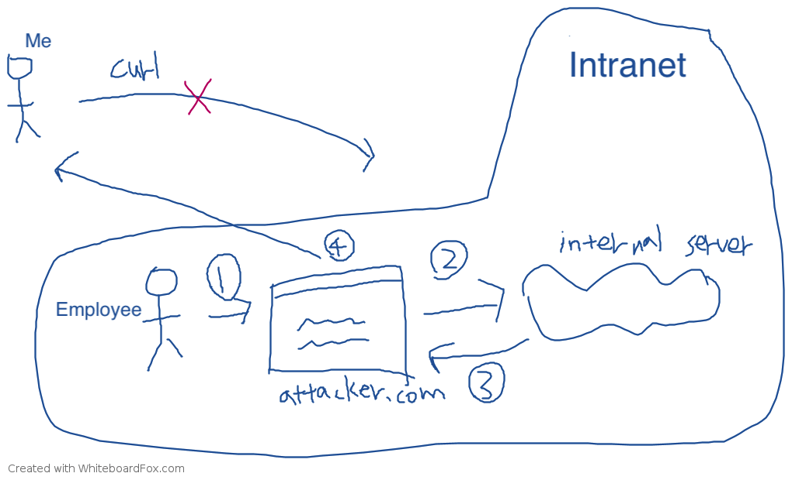

# Introduction to Cross-Origin Resource Sharing (CORS)

When discussing the same-origin policy, I mentioned that browsers generally prevent a website from accessing data from a different origin. However, during development, the frontend and backend may not be on the same origin. For example, one may be on `huli.tw` and the other on `api.huli.tw`. In such cases, how can the frontend access data from the backend?

This is where CORS comes into play. CORS stands for Cross-Origin Resource Sharing and is a mechanism that allows websites to exchange data across different origins. This mechanism is commonly used in development, but if not configured correctly, it can become a security vulnerability.

To understand why CORS exists, we need to start with why browsers block cross-origin API calls.

## Why can't we make cross-origin API calls?

To be more precise, the question should be: "Why can't we use `XMLHttpRequest` or `fetch` (also known as AJAX) to retrieve resources from a different origin?"

This more accurate definition is necessary because retrieving a "cross-origin resource" is actually quite common. For example, `` is a cross-origin request to fetch an image. Similarly, `<script src="https://another-domain.com/script.js" />` is a cross-origin request to fetch and execute a JavaScript file.

But have you encountered any issues with these two scenarios? Most likely not, as we are already accustomed to using them without problems.

So why is it different when it comes to AJAX using `XMLHttpRequest` or `fetch`? Why are cross-origin requests blocked in this case? (This explanation is not entirely accurate and will be further explained later.)

To understand this issue, we need to think in reverse. Since we already know that cross-origin requests are blocked, there must be a reason for it. But what is the reason? It's similar to using the method of proof by contradiction. To prove something, let's assume that blocking cross-origin requests is wrong or meaningless. Then, if we find a contradiction, we will know why cross-origin requests are blocked.

Therefore, let's consider the following question:

> What would happen if cross-origin requests were not blocked?

In that case, we could freely make API calls without having to search for CORS solutions! It sounds like there wouldn't be any issues. After all, `` and `<script>` tags can access cross-origin resources, so why can't AJAX?

If cross-origin AJAX requests were not blocked, I could use AJAX in my webpage (let's say `https://huli.tw/index.html`) to fetch data from `https://google.com`, right?

At first glance, it seems harmless, just fetching the HTML of the Google homepage. No big deal.

But what if I happen to know that your company has an "internal" public website with the URL `http://internal.good-company.com`? This website is not accessible from outside; only company employees' computers can access it. Now, what if I write a piece of AJAX code in my webpage to fetch data from that internal website? Would I be able to retrieve the website's content and send it back to my server?

This raises security concerns because an attacker could gain access to confidential information.


1. The target opens a malicious website.
2. The malicious website uses AJAX to fetch data from the internal confidential website.
3. The data is obtained.
4. It is sent back to the attacker's server.

You might ask, "But to use this technique, the attacker would need to know the URL of the internal website. Isn't that difficult?"

If you think that's too difficult, let me give you another example.

During development, many people run a server on their own computer with URLs like `http://localhost:3000` or `http://localhost:5566`. This is very common in modern frontend development.

If the browser didn't block cross-origin APIs, I could write code like this:

``` js
// 發出 request 得到資料
function sendRequest(url, callback) {
  const request = new XMLHttpRequest();
  request.open('GET', url, true);
  request.onload = function() {
    callback(this.response);
  }
  request.send();
}

// 嘗試針對每一個 port 拿資料，拿到就送回去我的 server
for (let port = 80; port < 10000; port++) {
  sendRequest('http://localhost:' + port, data => {
    // 把資料送回我的 server
  })
}
```

In this case, as long as you have a server running on localhost, I could access its content and learn about what you are developing. In a work setting, this could potentially expose company secrets, or attackers could analyze these websites to find vulnerabilities and exploit them using similar methods.

Furthermore, if you think the above two examples are not feasible, let's make another assumption here. In addition to assuming that cross-origin requests are not blocked, let's also assume that "cross-origin requests automatically include cookies."

So, if I send a request to `https://www.facebook.com/messages/t`, I could see your chat messages. If I send a request to `https://mail.google.com/mail/u/0/`, I could see your private emails.

When it comes to this point, we can understand why cross-origin AJAX requests are blocked, in three words: "security".


In the browser, if you want to retrieve the complete content of a website (able to fully read it), you can basically only do it through `XMLHttpRequest` or `fetch`. If these cross-origin AJAX requests are not restricted, it would be possible to use the user's browser to retrieve the content of "any website", including various websites that may contain sensitive information.


Therefore, it is reasonable for browsers to block cross-origin AJAX requests for the sake of security.


At this point, some people may have a question: "Why are images, CSS, or scripts not blocked?"


This is because these are more like "part of the web resources". For example, if I want to use someone else's image, I use `` to import it, and if I want to use CSS, I use `<link href="...">`. The resources that can be obtained through these tags are limited. Furthermore, once I load an image, it is just an image. Only the browser knows the content of the image, I don't know it, and I cannot read it with a program. This is important.


After I load an image, it is really just an image. I cannot read its content with a program, so I cannot send the obtained result to another place. Therefore, there is less risk of data leakage.


To correctly understand cross-origin requests, the first step is to understand "why browsers block them", and the second step is to have a correct understanding of "how they are blocked". Below, I have prepared a quiz for you to try to answer.


## In-class Quiz

John is working on a project that needs to integrate an API. In the company, there is an API for deleting posts. You can delete a post by sending a POST request to `https://lidemy.com/deletePost` with the post ID as `application/x-www-form-urlencoded` content type.


For example, sending a POST request to `https://lidemy.com/deletePost` with `id=13` will delete the post with ID 13 (the backend does not perform any permission checks).


The frontend and backend domains are different, and the backend does not add the CORS header. Therefore, John believes that the frontend cannot make the AJAX call to delete the post because it will be restricted by the same-origin policy, and the request cannot be sent.


After making the call, the console indeed shows the error message: "request has been blocked by CORS policy: No 'Access-Control-Allow-Origin' header is present on the requested resource".


So John believes that the frontend cannot use AJAX to call this API and delete the post. He thinks the post cannot be deleted.


Is John's statement correct? If not, please point out the error.


## How are cross-origin AJAX requests blocked?

This question is testing the concept:

> When a cross-origin request is blocked by the browser, what does it actually mean? How is it blocked?


This question is included because many people think that "the blocked part is the request" and therefore, in John's example, the request is blocked by the browser and cannot reach the server, so the data cannot be deleted.


But if you think about it, you will realize that this statement is problematic. Just look at the error message:

> request has been blocked by CORS policy: No 'Access-Control-Allow-Origin' header is present on the requested resource


When the browser says that the header does not exist, what does it mean? It means that it has already sent out the request for you, and it has received the response, only to find that the `Access-Control-Allow-Origin` header is not present.


So what the browser blocks is not the request, but the response. This is a crucial point.


Your request has already reached the server, and the server has returned a response. It's just that the browser doesn't give you the result.


Therefore, the answer to this question is that although John sees the CORS error, because the request has actually been sent to the server, the post has been deleted. It's just that John cannot receive the response. Yes, believe me, the post has been deleted, really.


This is completely in line with the specifications, but many people are confused about it. Some even mistakenly think that this is a security issue and report it to Chromium:


1. [Issue 1122756: Possible to send XHR POST request from different origins - SOP bypass](https://bugs.chromium.org/p/chromium/issues/detail?id=1122756&q=sop%20bypass&can=1)
2. [Issue 1151540: Same-Origin-Policy is bypassed by an XMLHttpRequest Executed within an eval()](https://bugs.chromium.org/p/chromium/issues/detail?id=1151540)

But the results are always the same, marked as "won't fix" because it is a compliant implementation.

Let me clarify a concept that many people are confused about.

Earlier, I mentioned that blocking CORS is for security purposes. If it is not blocked, attackers can use AJAX to retrieve internal non-public data, resulting in the leakage of company secrets. And here I also mentioned that "there is no CORS issue outside the browser," which means that even if CORS is blocked, can I still send requests to the same website and retrieve data? Does this mean there is no security issue?

For example, if I use curl or Postman or any other tool, shouldn't I be able to bypass CORS restrictions?

People who think this way overlook one key difference between these two approaches.

Let's assume our target is an internal network of a company, with the URL: http://internal.good-company.com

If I directly send a request using curl from my computer, I will only see an error page because, firstly, I am not on the internal network of that company, so I don't have the authorization, and secondly, I may not even be able to reach that domain because only the internal network can resolve it.

On the other hand, CORS is like this: "I have created a website for internal network users to access and send requests to retrieve data." The biggest difference between these two approaches is "who is visiting the website." In the former case, it's me, but in the latter case, it's someone else (and someone who can access the internal network).



As shown in the figure, the top part is the attacker trying to access that URL, but it will fail because the target is within the internal network. So, even without the same-origin policy, the attacker still cannot obtain the desired information.

The bottom part, however, is when the attacker creates a malicious website and finds a way to make users visit that website. For example, at point 1, when the user visits the website, the flow goes to point 2, where an AJAX request is made to the target (internal server). After retrieving the data at point 3, it returns to the attacker at point 4.

With the protection of the same-origin policy, point 4 will not be executed because JavaScript cannot access the fetch result, so it won't know what the response is.

## How to set up CORS?

Now that we have discussed the principles and understood why browsers block cross-origin requests, let's talk about how to set up CORS. The setup is straightforward. Since browsers protect for security purposes, you just need to tell the browser: "I allow xxx to access the response of this request." Here's how you do it:

```
Access-Control-Allow-Origin: *
```

This response header means "allow any origin to access this response." If you want to restrict it to a single origin, you can write it like this:

```
Access-Control-Allow-Origin: https://blog.huli.tw
```

But what if you want to allow multiple origins? Currently, it is not possible. The value of this header does not support multiple origins. You can only handle it on the server side by dynamically outputting different headers based on the request.

Furthermore, cross-origin requests are divided into two types: "simple requests" and "non-simple requests." Regardless of which type, the backend needs to include the `Access-Control-Allow-Origin` header. The main difference is that non-simple requests send a preflight request before sending the actual request. If the preflight request fails, the actual request will not be sent.

For the preflight request, we also need to include the `Access-Control-Allow-Origin` header to pass it.

In addition, some products may want to send custom headers, such as `X-App-Version`, to indicate the current version of the website. In this case, the backend needs to add the `Access-Control-Allow-Headers` header to pass the preflight:

``` js
fetch('http://localhost:3000/form', {
      method: 'POST',
      headers: {
        'X-App-Version': "v0.1",
        'Content-Type': 'application/json'
      },
      body: JSON.stringify(data)
    }).then(res => res.json())
      .then(res => console.log(res))
```

In summary, the preflight is a validation mechanism to ensure that the backend knows the expected request from the frontend, and only then will the browser allow it. What I mentioned earlier, "CORS blocks the response, not the request," only applies to simple requests. For non-simple requests with a preflight, the actual request you want to send will indeed be blocked.

So why do we need a preflight request? We can consider it from two perspectives:

1. Compatibility
2. Security

Regarding the first point, you may have noticed that if a request is a non-simple request, you cannot replicate it using the HTML `<form>` element, and vice versa. For example, the `<form>` element's enctype does not support `application/json`, so this content type is a non-simple request. On the other hand, enctype supports `multipart/form`, so this content type belongs to a simple request.

For those ancient websites, even before XMLHttpRequest existed, their backends did not expect browsers to send requests with the `DELETE` or `PATCH` method, nor did they expect requests with the `application/json` content-type. This is because in that era, `<form>` and `` were the only elements capable of sending requests.

At that time, there was no `fetch`, not even `XMLHttpRequest`. So, in order to prevent these backends from receiving unexpected requests, a preflight request is sent first. Since the ancient backends do not handle this preflight, it will not pass, and the browser will not send the actual request.

This is what I mean by compatibility. By passing the preflight request, early websites are protected from receiving unexpected requests.

As for the second point, security, let's take an example. Typically, the `DELETE` HTTP method is used for delete APIs. If there is no preflight request to block it, the browser will actually send this request, which may cause unexpected behavior on the backend (as the browser was not expected to send it).

That's why a preflight request is needed, to ensure that the backend knows that the upcoming request is legitimate before sending the actual request.

Lastly, let's talk about cookies. Cross-origin requests do not include cookies by default. If cookies need to be included, three conditions must be met:

1. The backend's response header must have `Access-Control-Allow-Credentials: true`.
2. The `Access-Control-Allow-Origin` in the backend's response header cannot be `*`; it must be explicitly specified.
3. The frontend's fetch must include `credentials: 'include'`.

For "simple requests," only the third condition needs to be met. For "non-simple requests," all three conditions must be met.

## Conclusion

In this article, we have learned the basic principles of CORS and "why browsers block cross-origin requests." Ultimately, it is all about security, which is why this restriction exists. In addition, we have learned how to set CORS headers. One section mentions that `Access-Control-Allow-Origin` does not support multiple values, so if many origins require this header, it must be dynamically set. What if it is not set correctly? That would be a security vulnerability, which we will discuss in our next article.

This article is adapted from: [CORS 完全手冊（一）：為什麼會發生 CORS 錯誤？](https://blog.huli.tw/2021/02/19/cors-guide-1) and [CORS 完全手冊（三）：CORS 詳解](https://blog.huli.tw/2021/02/19/cors-guide-3/)
