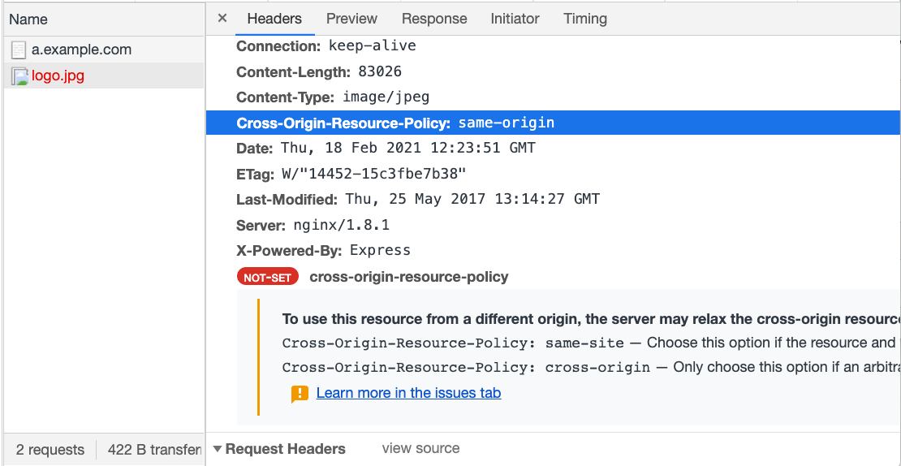

# Cross-Origin Security Issues

While some websites use reverse proxies or other mechanisms to place the frontend and backend under the same origin, this seems to be the exception rather than the norm. In most cases, allowing frontend access to cross-origin backend APIs is almost inevitable.

However, configuring CORS headers may not be as simple as it seems. If misconfigured, it can allow attackers to access resources they shouldn't have access to.

In addition to misconfigurations in CORS settings, there are also security concerns with cross-origin access for elements like `` or `<script>`, which we will discuss in this post.

## CORS Misconfiguration

As mentioned earlier, if a cross-origin non-simple request wants to include cookies, the `Access-Control-Allow-Origin` cannot be `*`. It must specify a single origin; otherwise, the browser will not allow it.

But in reality, we cannot have just one origin. We may have multiple origins, such as `buy.example.com`, `social.example.org`, `note.example.com.tw`, all needing to access `api.example.com`. In this case, we cannot hardcode the origin in the response header; it needs to be dynamically adjusted.

Let's start with the worst approach, which is:

``` js
app.use((req, res, next) => {
  res.headers['Access-Control-Allow-Credentials'] = 'true'
  res.headers['Access-Control-Allow-Origin'] = req.headers['Origin']
})
```

The origin is directly taken from the request header for convenience. By doing this, any origin can pass the CORS check.

What problems does this approach have?

It has significant issues.

Let's say I create a website with the URL `https://fake-example.com` and try to get users to click on it. Inside the website, there is a script:

``` js
// 用 api 去拿使用者資料，並且帶上 cookie
fetch('https://api.example.com/me', {
  credentials: 'include'
})
  .then(res => res.text())
  .then(res => {
    // 成功拿到使用者資料，我可以傳送到我自己的 server
    console.log(res)

    // 把使用者導回真正的網站
    window.location = 'https://example.com'
  })
```

Because the server returns the correct header, recognizing `https://fake-example.com` as a valid origin, the CORS check passes. Therefore, this website can also retrieve data from `http://api.example.com/me`.

As a result, this attack will only affect users who visit the website and are logged into `example.com`. The impact depends on the website's API. At a minimum, it can access user data, and in more severe cases, it may obtain the user's token (if such an API exists).

There are a few things to note about this attack:

1. This is not XSS because I am not executing code on `example.com`. I am executing it on my own website, `http://fake-example.com`.
2. It is somewhat similar to CSRF, but websites usually do not add CSRF token protection to GET APIs, so it can pass.
3. If SameSite cookies are set, the attack will fail because the cookie will not be sent.

(CSRF and SameSite will be discussed later)

Therefore, for this attack to succeed, several prerequisites must be met:

1. CORS headers are given to an unauthorized origin.
2. The website uses cookies for authentication and does not set SameSite.
3. The user actively clicks on the website and is logged in.

Regarding the first point, it is unlikely that anyone would write code like the example above, directly using the origin from the request header. A more likely approach is:

``` js
app.use((req, res, next) => {
  res.headers['Access-Control-Allow-Credentials'] = 'true'
  const origin = req.headers['Origin']

  // 偵測是不是 example.com 結尾
  if (/example\.com$/.test(origin)) {
    res.headers['Access-Control-Allow-Origin'] = origin
  }
})
```

This way, the following origins can pass:

1. example.com
2. buy.example.com
3. social.example.com

However, this approach has a problem because this can also pass:

1. fakeexample.com

Vulnerabilities like this are caused by incorrect CORS settings and are therefore called CORS misconfigurations.

The solution is not to use RegExp for checking but to prepare a whitelist in advance. Only origins that appear in the whitelist can pass; otherwise, they will fail. This way, we can ensure that there are no vulnerabilities in the checking process and remember to add the SameSite attribute to cookies.

``` js
const allowOrigins = [
  'https://example.com',
  'https://buy.example.com',
  'https://social.example.com'
]
app.use((req, res, next) => {
  res.headers['Access-Control-Allow-Credentials'] = 'true'
  const origin = req.headers['Origin']

  if (allowOrigins.includes(origin)) {
    res.headers['Access-Control-Allow-Origin'] = origin
  }
})
```

### Real-World Example

The first example is a vulnerability found by Jordan Milne in JetBrains IDE in 2016.

When using JetBrains IDE, it runs a local server. When you open a file and click "view in browser," it opens the URL: `http://localhost:63342/<projectname>/<your_file.html>`, which is handled by the local server behind the scenes.

And this server is not well implemented. Its `Access-Control-Allow-Origin` header is just like the error example I mentioned earlier, directly using the origin header from the request. Therefore, any website can read the response.

Furthermore, the author discovered a path traversal vulnerability, which allows accessing any file through this API. Therefore, when combined, it means that an attacker can read files on the system through the JetBrains local server API on their website.

The simple PoC provided by the author is as follows:

``` html
<script>
var xhr = new XMLHttpRequest();
xhr.open("GET", "http://localhost:63342/testing/something.txt", true);
xhr.onload = function() {alert(xhr.responseText)};
xhr.send();
</script>
```

Later, the author found other issues and successfully achieved RCE (Remote Code Execution). However, those parts are unrelated to the CORS configuration issue discussed in this article, so I won't go into detail. If you are interested, you can refer to the original article: [JetBrains IDE Remote Code Execution and Local File Disclosure](http://blog.saynotolinux.com/blog/2016/08/15/jetbrains-ide-remote-code-execution-and-local-file-disclosure-vulnerability-analysis/).

The second case is about a vulnerability in a Bitcoin exchange shared by James Kettle at the 2017 AppSec EU conference.

He found that one of the exchange's APIs had the same vulnerability, allowing any origin to read the response. One of the APIs was `/api/requestApiKey`, which could retrieve the user's apiKey. This apiKey could be used to transfer the user's bitcoins to another account.

For more information, you can refer to: [AppSec EU 2017 Exploiting CORS Misconfigurations For Bitcoins And Bounties by James Kettle](https://www.youtube.com/watch?v=wgkj4ZgxI4c&ab_channel=OWASP).

Lastly, let's look at the vulnerability I reported for Asiayo in 2020. The root cause is exactly the same, allowing other websites to access user data, including names, phone numbers, and email addresses:


Original report: [Asiayo Website CORS Misconfiguration Vulnerability](https://zeroday.hitcon.org/vulnerability/ZD-2020-00829)

## Other COXX Series Headers

In addition to the familiar CORS, there are several headers starting with CO:

1. CORB (Cross-Origin Read Blocking)
2. CORP (Cross-Origin Resource Policy)
3. COEP (Cross-Origin-Embedder-Policy)
4. COOP (Cross-Origin-Opener-Policy)

These headers with CO are also related to cross-origin data access. Now let's take a look at what these headers are doing.

## Serious Security Vulnerabilities: Meltdown and Spectre

On January 3, 2018, Google's Project Zero released an article titled [Reading privileged memory with a side-channel](https://googleprojectzero.blogspot.com/2018/01/reading-privileged-memory-with-side.html), which described three attacks targeting CPU data cache:

* Variant 1: bounds check bypass (CVE-2017-5753)
* Variant 2: branch target injection (CVE-2017-5715)
* Variant 3: rogue data cache load (CVE-2017-5754)

The first two are known as Spectre, and the third one is known as Meltdown. If you remember, this was a big issue at the time because the problem was with the CPU and not an easy one to fix.

I think the disclosure of this vulnerability had a significant impact on the operation mechanism of browsers (or at least accelerated the evolution of browsers). Especially, Spectre can be used to attack browsers, which also affects the topic of this series: Cross-Origin Resource Sharing.

Therefore, it is necessary to have a basic understanding of what Spectre is doing. To fully understand this attack, a lot of background knowledge is required, but that is not the main focus of this article. So, below I will explain Spectre using a highly simplified model. If you want to fully understand it, you can refer to the link above.

## Super Simplified Explanation of Spectre Attack

Again, it is important to note that this is a simplified version for easier understanding. It may differ from the original attack, but the core concept should be similar.

Let's assume we have a piece of code (in C language) that looks like this:

``` c
uint8_t arr1[16] = {1, 2, 3}; 
uint8_t arr2[256]; 
unsigned int array1_size = 16;

void run(size_t x) {
  if(x < array1_size) {
    uint8_t y = array2[array1[x]];
  }
}

size_t x = 1;
run(x);
```

I have declared two arrays of type `uint8_t`, so each element in the arrays will be 1 byte (8 bits) in size. The length of `arr1` is 16, and the length of `arr2` is 256.

Next, I have a function called `run` which takes a number `x` as input. It checks if `x` is smaller than `array1_size`. If it is, it retrieves the value of `array1[x]`, uses it as an index to access `array2`, and assigns the retrieved value to `y`.

In the example above, if we call `run(1)`, it will execute:

``` C
uint8_t y = array2[array1[1]];
```

Since the value of `array1[1]` is 2, it becomes `y = array2[2]`.

This code seems fine and I have also added a check for array length, so there won't be any out-of-bounds (OOB) access unless `x` is smaller than `array1_size`.

However, this is just how it appears to you.

When the CPU executes the code, there is a mechanism called branch prediction. To improve code execution efficiency, the CPU predicts whether the if condition will be true or false. If the prediction is true, it executes the code inside the if statement and calculates the result in advance.

All of this is just "prediction". After the actual execution of the if condition, if the result matches the prediction, everything is fine. But if it doesn't match, the previously calculated result is discarded. This mechanism is called speculative execution.

Because the CPU discards the result, we cannot directly access the speculative execution result unless there are some clues left by the CPU.

And this is the main reason why Spectre attack works, because there are indeed some clues left.

To further improve execution efficiency, during speculative execution, some results are stored in the CPU cache to enhance data retrieval efficiency.

Let's say we have three things: A, B, and C. One of them is in the CPU cache, and the other two are not. How can we determine which one is in the cache?

The answer is by observing the access time of these three things! Since accessing something in the CPU cache is faster, if accessing A takes 10ms, B takes 10ms, and C only takes 1ms, we can conclude that C is in the CPU cache. This type of attack that obtains information through other channels is called a side-channel attack.

In the above method, we determine based on time, so it is also known as a timing attack.

Now, let's go back to the previous code:

``` c
uint8_t arr1[16] = {1, 2, 3}; 
uint8_t arr2[256]; 
unsigned int array1_size = 16;

void run(size_t x) {
  if(x < array1_size) {
    uint8_t y = array2[array1[x]];
  }
}

size_t x = 1;
run(x);
```

Assume that we run `run(10)` multiple times. Based on branch prediction, the CPU reasonably predicts that the next execution will also satisfy the if condition and executes the code inside. At this moment, I suddenly set `x` to 100 and run `run(100)`.

The code inside the if statement will be speculatively executed:

``` C
uint8_t y = array2[array1[100]];
```

Let's say the value of `array1[100]` is 38. So it becomes `y = array2[38]`, and `array2[38]` is stored in the CPU cache, enhancing the efficiency of subsequent data retrieval.

Then, during the actual execution, the if condition is found to be false, so the previously obtained result is discarded, and nothing happens. The function execution is completed.

Now, based on the timing attack we discussed earlier, we read each element of `array2` and measure the time. We will find that the access time for `array2[38]` is the shortest.

At this point, we know one thing:

> The content of `array1[100]` is 38.

You might ask, "So what can you do with this information?" There are many things you can do. Since the length of `array1` is only 16, the value we read is not from `array1` itself but from other parts of memory that we should not have accessed. By continuously replicating this pattern, we can read data from other places.

If this attack is performed in a browser, I can read data from other websites within the same process. In other words, if there is content from other websites within the same process, I can access that content!

This is the Spectre attack, which exploits certain mechanisms of the CPU to perform a side-channel attack and read data that should not be accessible, causing security issues.

In simple terms, "Spectre allows you to potentially read data from other websites while using a browser."

The explanation of Spectre ends here. The details have been simplified above, and I don't fully understand those details either. If you want to know more, you can refer to:

1. [Reading privileged memory with a side-channel](https://googleprojectzero.blogspot.com/2018/01/reading-privileged-memory-with-side.html)
2. [Interpreting Meltdown & Spectre CPU vulnerabilities](https://zhuanlan.zhihu.com/p/32757727)
3. [A discussion on processor-level Spectre Attack and Poc analysis](https://yangrz.github.io/blog/2018/01/09/cpu/)
4. [[Chat] Introduction to Spectre & Meltdown vulnerabilities (translation)](https://www.ptt.cc/bbs/NetSecurity/M.1515146856.A.750.html)
5. [Spectre vulnerability example code comments](https://github.com/hdzitao/spectre-attack-zh)
6. [Google update: Meltdown/Spectre](https://developers.google.com/web/updates/2018/02/meltdown-spectre)
7. [Mitigating Spectre with Site Isolation in Chrome](https://security.googleblog.com/2018/07/mitigating-spectre-with-site-isolation.html)

As for the COXX stuff, their purpose is similar, which is to prevent one website from being able to read data from other websites. As long as malicious websites and target websites are not in the same process, this type of attack is ineffective.

From this perspective, let's take a look at various related mechanisms.

## CORB (Cross-Origin Read Blocking)

About a month after the public disclosure of the Spectre attack by Google, in February 2018, they published a blog post explaining what Chrome did to prevent this type of attack: [Meltdown/Spectre](https://developers.google.com/web/updates/2018/02/meltdown-spectre).

The Cross-Site Document Blocking mentioned in the article is the predecessor of CORB. According to [Chrome Platform Status](https://www.chromestatus.com/feature/5629709824032768), it was officially enabled by default in Chrome for desktop release 67, which was around May 2018. Around the same time, it was merged into the fetch spec and became part of the specification ([CORB: blocking of nosniff and 206 responses](https://github.com/whatwg/fetch/pull/686)).

As mentioned earlier, Spectre can read data under the same process. So one way to defend against it is to prevent data from other websites from appearing under the same process.

A website has many ways to bring in cross-origin resources, such as `fetch` or `xhr`, but these two methods are already controlled by CORS, and the response obtained should be stored in a network-related process rather than the website's own process. Therefore, even with Spectre, it cannot be read.

However, using `` or `<script>` tags can easily load resources from other websites. For example: ``. Suppose `secret.json` is confidential data, we can "load" this confidential data.

You may wonder, "What's the point of doing this? It's not an image, and I can't access it with JavaScript either." That's right, it's not an image, but in terms of Chrome's operation mechanism, Chrome doesn't know it's not an image before downloading it (it could have a file extension of .json but actually be an image), so it downloads it first. After downloading, it sends the result to the render process, and only then does it realize that it's not an image, triggering a loading error.

It may seem like there's no problem, but don't forget that Spectre opened a new window where "any data in the same process can be potentially read." Therefore, just "sending the result to the render process" is not enough because through Spectre attacks, attackers can still access data stored in memory.

Therefore, the purpose of the CORB mechanism is:

> If the data type you want to read is completely unreasonable, there is no need to read it into the render process, just discard the result!

Continuing with the example above, if the MIME type of that JSON file is `application/json`, it means that it cannot be an image, so it cannot be placed inside an img tag. This is what I mean by "unreasonable data type to read".

CORB mainly protects three types of data: HTML, XML, and JSON. How does the browser know if it is one of these three types? Let's determine it from the content type in the response header, right?

Unfortunately, it's not possible. The reason is that many websites have incorrectly set content types. It is possible that a JavaScript file is set as `text/html`, and then CORB blocks it, causing the website to break.

Therefore, Chrome will detect (sniffing) the file type based on its content to decide whether to apply CORB or not.

However, there is also a possibility of misjudgment. So, if the content type provided by your server is always correct, you can send a response header `X-Content-Type-Options: nosniff`, and Chrome will directly use the content type you provided instead of sniffing it.


In summary, CORB is a mechanism that is already built into Chrome. It automatically blocks the loading of unreasonable cross-origin resources, such as using `` to load JSON or using `<script>` to load HTML, and so on.

For more detailed explanations, you can refer to:

1. [Cross-Origin Read Blocking for Web Developers](https://www.chromium.org/Home/chromium-security/corb-for-developers)
2. [Cross-Origin Read Blocking (CORB)](https://chromium.googlesource.com/chromium/src/+/master/services/network/cross_origin_read_blocking_explainer.md)

## CORP (Cross-Origin Resource Policy)

CORB is a built-in mechanism in browsers that automatically protects HTML, XML, and JSON from being loaded into cross-origin render processes, thus preventing Spectre attacks. But what about other resources? If there are other types of resources, such as certain photos and videos that are also sensitive data, can I protect them?

This is where the CORP HTTP response header comes into play. CORP, formerly known as From-Origin, is described in the following quote from [Cross-Origin-Resource-Policy (was: From-Origin) #687](https://github.com/whatwg/fetch/issues/687):

> Cross-Origin Read Blocking (CORB) automatically protects against Spectre attacks that load cross-origin, cross-type HTML, XML, and JSON resources, and is based on the browser’s ability to distinguish resource types. We think CORB is a good idea. From-Origin would offer servers an opt-in protection beyond CORB.

If you know which resources need to be protected, you can use the CORP header to specify which sources can load these resources. CORP has three options:

1. same-site
2. same-origin
3. cross-origin

The third option is similar to not setting it (but there is still a difference, which will be explained later), meaning that all cross-origin sources can load the resource. Let's see what happens after setting this!

First, let's run a simple server using express, add the CORP header, and place an image with the URL `http://b.example.com/logo.jpg`:

``` js
app.use((req, res, next) => {
  res.header('Cross-Origin-Resource-Policy', 'same-origin')
  next()
})
app.use(express.static('public'));
```

Then, in `http://a.example.com`, let's include this image:

``` html

```

When you refresh and open the console, you will see an error message indicating that the image failed to load. Opening the network tab will provide a detailed explanation of the reason:



If you change the header to `same-site` or `cross-origin`, you will be able to see the image loaded correctly.

So, this header is actually a "resource-level CORS". The original CORS is more like a protocol for accessing APIs or "data" between different origins, allowing cross-origin access to data with permission. However, when it comes to loading resources such as using `` or `<script>`, if you want to prevent cross-origin loading, you could only rely on server-side logic to determine the `Origin` or `Referer` values and dynamically decide whether to return the data.

With the introduction of the CORP header, it provides a method to block "any cross-origin loading" by simply setting a header. So, it's not just about security considerations; security is just one aspect. The key is that you can prevent others from loading your resources.

As mentioned in the [spec](https://www.w3.org/TR/from-origin) of the predecessor of CORP, From-Origin:

> The Web platform has no limitations on embedding resources from different origins currently. E.g. an HTML document on http://example.org can embed an image from http://corp.invalid without issue. This has led to a number of problems:

For this type of embedded resource, the Web platform currently has no limitations on what can be loaded. Although it is convenient, it can also cause some problems, such as:

> Inline linking — the practice of embedding resources (e.g. images or fonts) from another server, causing the owner of that server to get a higher hosting bill.
> 
> Clickjacking — embedding a resource from another origin and attempting to let the visitor click on a concealed link thereof, causing harm to the visitor.

For example, directly linking to images from someone else's server on my blog would result in the traffic and hosting bill being attributed to that server. Additionally, there can be clickjacking issues.

> Privacy leakage — sometimes resource availability depends on whether a visitor is signed in to a particular website. E.g. only with a I'm-signed-in-cookie will an image be returned, and if there is no such cookie an HTML document. An HTML document embedding such a resource (requested with the user's credentials) can figure out the existence of that resource and thus whether the visitor is signed in and therefore has an account with a particular service.

There are also privacy concerns. For example, a website can determine whether you are logged in on other websites (which will be discussed later).

How does it know? Because some resources may only be accessible when logged in. Let's say a certain image URL only returns the image correctly when logged in, and returns a server error otherwise. I can simply write this:

``` html

```

By checking whether the image is loaded successfully, I can determine if you are logged in.

> License checking — certain font licenses require that the font be prevented from being embedded on other origins.

Font websites may prevent users without a license from loading fonts, and this header is also suitable for such situations.

In summary, the earlier introduction of CORB only "prevents unreasonable reading," such as loading HTML using img, which is purely for security considerations.

However, CORP can prevent any reading (except for iframes, which are not affected by it) and can protect the resources of your website from being loaded by others. It is a more powerful and widely applicable header.

Nowadays, mainstream browsers already support this header.

## Site Isolation

To prevent Spectre attacks, there are two approaches:

1. Prevent attackers from having the opportunity to execute Spectre attacks.
2. Even if the attack is executed, prevent obtaining the desired information.

The principle of Spectre attacks was mentioned earlier, which involves determining which data is stored in the cache by measuring the time it takes to read the data. By doing so, attackers can "steal" data from memory. If the timing provided by the browser's timer function is intentionally imprecise, wouldn't that defend against the attack? Because the calculated time by the attacker would be similar, they wouldn't know which read is faster.

After the appearance of Spectre attacks, browsers took two actions:

1. Reduced the precision of `performance.now`.
2. Disabled `SharedArrayBuffer`.

The first point is easy to understand; by reducing the precision of the timing function, attackers cannot determine the correct reading speed. But why the second point?

Let's talk about `SharedArrayBuffer`. This allows JavaScript in your document to share the same block of memory with web workers, enabling data sharing. So, in a web worker, you can create a counter that keeps incrementing, and then read this counter in JavaScript, achieving the functionality of a timer.

Therefore, after Spectre appeared, browsers made these two adjustments, starting from the perspective of "preventing the source of the attack," which is the first approach.

The other approach is to prevent malicious websites from accessing information from cross-origin websites, which was mentioned earlier as CORB and now introducing: Site Isolation.

This term was briefly mentioned in the "Browser Security Model" section. Let's start with an introduction from [Site Isolation for web developers](https://developers.google.com/web/updates/2018/07/site-isolation):

> Site Isolation is a security feature in Chrome that offers an additional line of defense to make such attacks less likely to succeed. It ensures that pages from different websites are always put into different processes, each running in a sandbox that limits what the process is allowed to do. It also blocks the process from receiving certain types of sensitive data from other sites.

In simple terms, Site Isolation ensures that resources from different websites are placed in different processes. Therefore, even if a Spectre attack is executed on your own website, it doesn't matter because it cannot read data from other websites.

Site Isolation is currently enabled by default in Chrome. The corresponding drawback is that it consumes more memory because more processes are created. For other impacts, you can refer to the aforementioned article.

In addition to Site Isolation, there is another concept that is easily confused, called "cross-origin isolated state."

What is the difference between these two? According to my understanding, the article [Mitigating Spectre with Site Isolation in Chrome](https://security.googleblog.com/2018/07/mitigating-spectre-with-site-isolation.html) mentions:

> Note that Chrome uses a specific definition of "site" that includes just the scheme and registered domain. Thus, https://google.co.uk would be a site, and subdomains like https://maps.google.co.uk would stay in the same process.

The definition of "Site" in Site Isolation is the same as the same-site concept. For example, `http://a.example.com` and `http://b.example.com` are considered the same site. Therefore, even under Site Isolation, these two web pages would still be placed in the same process.

And the cross-origin isolated state should be a stronger isolation, isolating everything that is not the same origin, even if it is the same site. Therefore, `http://a.example.com` and `http://b.example.com` will be isolated. Moreover, Site Isolation isolates processes, while cross-origin isolated appears to isolate browsing context groups, preventing cross-origin resources from being in the same browsing context group.

This cross-origin isolated state is not enabled by default and requires setting up these two headers on the webpage:

1. Cross-Origin-Embedder-Policy: require-corp
2. Cross-Origin-Opener-Policy: same-origin

As for why these two headers, I will explain later.

## COEP (Cross-Origin-Embedder-Policy)

To achieve the cross-origin isolated state, it is necessary to ensure that all cross-origin accesses on your website are legitimate and authorized.

The COEP (Cross-Origin-Embedder-Policy) header has two values:

1. unsafe-none
2. require-corp

The first one is the default value, which means there are no restrictions. The second one is related to CORP (Cross-Origin-Resource-Policy) mentioned earlier. If you use require-corp, it means telling the browser, "All resources I load on the page must have the CORP header (or CORS) and be legitimate."

Now, let's assume we have a website `a.example.com` and we want to make it a cross-origin isolated state. Therefore, we add a header to it: `Cross-Origin-Embedder-Policy: require-corp`. Then, we import a resource in the webpage:

``` html

```

Next, we send the correct header on the `b` side:

``` js
app.use((req, res, next) => {
  res.header('Cross-Origin-Resource-Policy', 'cross-origin')
  next()
})
```

This way, the first step is achieved.

Also, I mentioned earlier that there is a slight difference between not setting CORP and setting it as `cross-origin`, and it lies here. In the example above, if the `b` side does not send this header, the Embedder Policy will not pass.

## COOP (Cross-Origin-Opener-Policy)

The second step is the COOP (Cross-Origin-Opener-Policy) header. When you use `window.open` to open a webpage, you can manipulate the location of that webpage, and the opened webpage can also manipulate your webpage using `window.opener`.

Having such a connection between windows does not comply with cross-origin isolation. Therefore, the COOP header is used to regulate the relationship between windows and openers. It has three values:

1. Cross-Origin-Opener-Policy: `unsafe-none`
2. Cross-Origin-Opener-Policy: `same-origin`
3. Cross-Origin-Opener-Policy: `same-origin-allow-popups`

The first one is the default value, and it doesn't have any effect, so I won't explain it. The other two are a bit more complicated. Let's summarize them with a simple example.

Suppose there is a webpage A that opens a webpage B using `window.open`:

1. If AB is cross-origin, the browser already has restrictions and can only access methods like `window.location` or `window.close`. It cannot access the DOM or anything else.
2. If AB is same-origin, they can access each other's windows almost entirely, including the DOM.
3. If A adds the COOP header with a value of `same-origin`, it means imposing additional restrictions on the second case. Both A and B must have this header with a value of `same-origin` to access each other's windows.
4. If A adds the COOP header with a value of `same-origin-allow-popups`, it also restricts the second case but is more lenient. As long as B's COOP header is not `same-origin`, they can access each other's windows.

In summary, to have the "opportunity to access each other's windows," they must first be the same origin, and this is unchangeable. Whether they can access each other depends on whether the COOP header is set and the value of the header.

If the COOP header is set but does not comply with the rules, `window.opener` will become `null` directly, and even the location cannot be obtained (if no rules are set, it can be obtained even if it is cross-origin).

In fact, according to the [spec](https://html.spec.whatwg.org/multipage/origin.html#cross-origin-opener-policies), there is also a fourth type: same-origin-plus-COEP, but it seems more complicated, so let's not study it for now.

## Returning to the cross-origin isolated state

As mentioned earlier, the cross-origin isolated state requires setting these two headers:

1. Cross-Origin-Embedder-Policy: require-corp
2. Cross-Origin-Opener-Policy: same-origin

Why? Because once set, it means that you have permission to access all cross-origin resources on the page. If you don't have permission, an error will occur. So if it is set and passes, it means that you are allowed to access all cross-origin resources, and there will be no security issues.

On the website, you can use:

``` js
self.crossOriginIsolated
```

to determine if you have entered the cross-origin isolated state. If so, you can use some restricted features because the browser knows you are secure.

In addition, if you enter this state, the trick of bypassing the same-origin policy by modifying `document.domain` mentioned earlier will no longer work. The browser will not allow you to modify this anymore.

To learn more about COOP, COEP, and the cross-origin isolated state, you can refer to:

1. [Making your website "cross-origin isolated" using COOP and COEP](https://web.dev/coop-coep/)
2. [Why you need "cross-origin isolated" for powerful features](https://web.dev/why-coop-coep/)
3. [COEP COOP CORP CORS CORB - CRAP that's a lot of new stuff!](https://scotthelme.co.uk/coop-and-coep/)
4. [Making postMessage() work for SharedArrayBuffer (Cross-Origin-Embedder-Policy) #4175](https://github.com/whatwg/html/issues/4175)
5. [Restricting cross-origin WindowProxy access (Cross-Origin-Opener-Policy) #3740](https://github.com/whatwg/html/issues/3740)
6. [Feature: Cross-Origin Resource Policy](https://www.chromestatus.com/feature/4647328103268352)

## Conclusion

This article actually covers a lot of things, all revolving around security. We first discussed the consequences of incorrect CORS settings and defense methods, and provided several practical examples.

Then, we talked about various headers starting with CO:

1. CORB (Cross-Origin Read Blocking)
2. CORP (Cross-Origin Resource Policy)
3. COEP (Cross-Origin-Embedder-Policy)
4. COOP (Cross-Origin-Opener-Policy)

If we were to summarize these four things in a sentence each, it might be:

1. CORB: The default mechanism of the browser, mainly to prevent loading unreasonable resources, such as loading HTML with ``
2. CORP: An HTTP response header that determines who can load this resource, preventing cross-origin loading of images, videos, or any resources
3. COEP: An HTTP response header that ensures all resources on the page are loaded legitimately
4. COOP: An HTTP response header that adds stricter window sharing settings to same-origin

The reason for the extensive length of this article is that, on one hand, there are many details to explain, and on the other hand, it shows the importance of the origin concept to the browser, so important that it requires so many measures to protect and ensure the same-origin policy.

After reading through all these same-origin and cross-origin things, let's switch gears in the next article and take a look at the classic CSRF.

I'm sorry, but you haven't provided the Markdown content that needs to be translated. Please paste the Markdown content here so that I can assist you with the translation.
