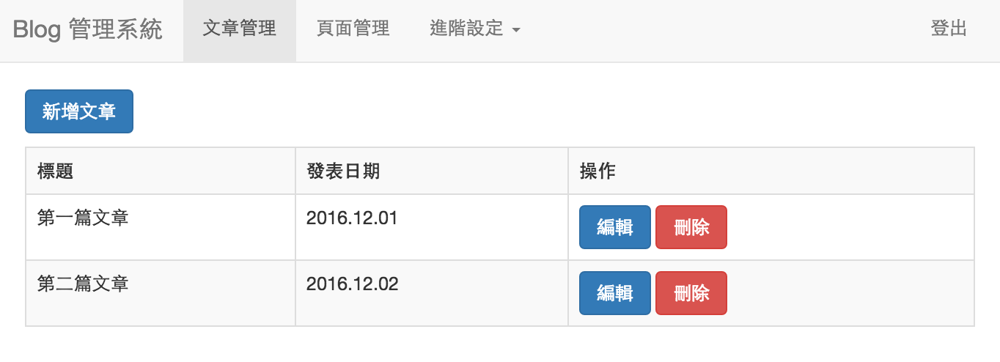

# Cross-Site Request Forgery (CSRF) Made Easy

Previously, we discussed CORS, which involves cross-origin data sharing and the potential for attackers to access user's personal or confidential data. The focus there was on "reading" data.

Now, let's talk about another similar attack called CSRF, short for Cross-Site Request Forgery. The key difference here is that CSRF focuses on "executing actions".

Let's start by understanding what CSRF is through a simple example!

## Introducing CSRF with a Lazy Delete Feature

I once created a simple backend page, think of it as a blog. It had features to create, delete, and edit articles. The interface looked something like this:



You can see the delete button, which, when clicked, would delete an article.

There are many ways to implement this feature, such as making an API call or submitting a form. However, I chose a simpler approach to be lazy.

For the sake of simplicity, I thought if I made this feature a GET request, I could simply use a link to accomplish the deletion without writing much code on the frontend:

``` html
<a href='/delete?id=3'>Delete</a>
```

Convenient, right? Then, on the backend, I added some validation to check if the request included a session ID and if the article was written by the author of that ID. Only if both conditions were met, the article would be deleted.

Seems like I did everything I should have: "Only the author can delete their own articles." It should be secure, right? Is there anything I missed?

Indeed, the permission check was correct, "Only the author can delete their own articles." But what if someone else deletes the article without the author's knowledge? You might think I'm talking nonsense. How can someone delete an article if the author didn't initiate it?

Well, let me show you how it can be done!

Let's assume that Little Black is an evil villain who wants to trick Little Ming into deleting his own article without his knowledge. How can he do it?

Knowing that Little Ming loves psychological tests, Little Black creates a psychological test website and sends it to Little Ming. However, this test website has a button that looks like this:

``` html
<a href='https://small-min.blog.com/delete?id=3'>Start Test</a>
```

Excited, Little Ming clicks on the "Start Test" button. Upon clicking, the browser sends a GET request to `https://small-min.blog.com/delete?id=3` and, due to the browser's mechanism, also includes the cookies from `small-min.blog.com`.

When the server receives the request, it checks the session and finds that it is indeed Little Ming and that the article was written by him. As a result, the server deletes the article.

This is CSRF, Cross-Site Request Forgery.

You are clearly on a psychological test website, let's say `https://test.com`, but you unknowingly deleted an article from `https://small-min.blog.com`. Isn't that terrifying? It's super scary!

This is why CSRF is also known as a one-click attack. You get compromised with just one click.

Some observant individuals might say, "But doesn't Little Ming realize what happened? He visited the blog, so it doesn't fit the 'without his knowledge' condition!"

These are minor issues. What if we change it like this:

``` html

<a href='/test'>Start Test</a>
```

While opening the page, we secretly send a deletion request with an invisible image. This time, Little Ming truly has no idea about it. Now it fits the condition!

From this simple example, we can clearly see the principles and attack methods of CSRF.

The goal of a CSRF attack is to "send a request to a target website from another website, making the target website mistakenly believe that the request was initiated by the user, when it wasn't."

Achieving this depends on the browser's mechanism. Whenever you send a request to a website, it includes the associated cookies. If the user is logged in, the request naturally includes their information (e.g., session ID), making it appear as if the user initiated the request.

After all, the server usually doesn't care who you are. It only recognizes cookies or, more precisely, the information contained within the cookies. When sending a request from Site A to Site B, it includes Site B's cookies. Similarly, when sending a request from Site C to Site B, it also includes Site B's cookies. This is the key reason why CSRF works.

However, the example above has a flaw: "Why not change the delete request to POST?"

Absolutely right! Let's not be lazy and implement the delete feature properly using POST. This way, it won't be possible to attack through `<a>` or ``, right? Unless... is there an HTML element that can send POST requests?

There is one, it's called `<form>`.

``` html
<form action="https://small-min.blog.com/delete" method="POST">
  <input type="hidden" name="id" value="3"/>
  <input type="submit" value="開始測驗"/>
</form>
```

After Xiao Ming clicked on it, he fell into the trap again and the article was deleted. Last time it was through an invisible image, this time it's through a form.

You might wonder, but wouldn't Xiao Ming know about it? I was also skeptical, so I Googled and found this article: [Example of silently submitting a POST FORM (CSRF)](http://stackoverflow.com/questions/17940811/example-of-silently-submitting-a-post-form-csrf)

The example provided in the article is as follows, the web world is truly vast and profound:

``` html
<iframe style="display:none" name="csrf-frame"></iframe>
<form method='POST' action='https://small-min.blog.com/delete' target="csrf-frame" id="csrf-form">
  <input type='hidden' name='id' value='3'>
  <input type='submit' value='submit'>
</form>
<script>document.getElementById("csrf-form").submit()</script>
```

Open an invisible iframe, so that the result after form submission appears inside the iframe, and this form can also be automatically submitted, without any action from Xiao Ming.

At this point, you know that changing to POST is useless, CSRF issues still exist.

So, you come up with a clever idea: "Since only forms can send POST requests on the frontend, can't I change my API to accept data in JSON format? Then forms can't be used anymore!"

For HTML forms, `enctype` supports only three types:

1. `application/x-www-form-urlencoded`
2. `multipart/form-data`
3. `text/plain`

In most cases, the first type is used, the second type is used for file uploads, and the third type is rarely used. If you want to parse JSON on the server side, the content type is usually `application/json`.

So, this statement is half correct. For some servers, if the request's content type is not `application/json`, it will throw an error and not consider it a valid request.

The incorrect part is that for other servers, as long as the body content is in JSON format, it can be accepted even if the content type is `text/plain`. The JSON format body can be constructed using the form below:

``` html
<form action="https://small-min.blog.com/delete" method="post" enctype="text/plain">
<input name='{"id":3, "ignore_me":"' value='test"}' type='hidden'>
<input type="submit"
  value="delete!"/>
</form>
```

The `<form>` generates the request body according to the rule `name=value`, so the form above will generate the following request body:

``` js
{"id":3, "ignore_me":"=test"}
```

We used the example of deleting an article, which may not seem significant, but what if it's a bank transfer? Attackers only need to write code on their own webpage to transfer money to their own account, and then distribute this webpage to receive a lot of money.

After talking so much, let's talk about how to defend against it! Let's start with the simplest defense, the "user".

## User Defense

CSRF attacks work because the user is already logged into the attacked webpage, allowing certain actions to be performed. Although these attacks should be handled by the webpage, if you are really concerned and worried that the webpage may not handle it properly, you can log out after each use of the website to avoid CSRF.

However, what users can do is actually very limited. The real work should be done on the server side.

## Server Defense

The reason CSRF is dangerous is because of the "CS" in its name: Cross-Site. You can launch an attack under any website. Defense against CSRF can be considered from this perspective, in simple terms: "How can I block requests from other sources?"

Think about it carefully, what is the difference between the request of a CSRF attack and a request made by the user?

The difference lies in the origin, the former is sent from any origin, while the latter is sent from the same origin (assuming your API and frontend website are in the same origin). As long as this can be distinguished on the backend, it can determine which request to trust.

Let's talk about some less common defense methods.

### Checking Referer or Origin Header

The request's header contains a field called `referer`, which indicates where the request is coming from. You can check this field to see if it is a valid origin. If not, simply reject it.

Some requests also include the `origin` header, which means the same thing, indicating where the request is coming from.

However, there are three things to note about this checking method. First, in some cases, the referer or origin may not be included in the request, so you have nothing to check.

Second, some users may disable the referer feature, in which case your server will reject requests from genuine users.

Third, the code that determines whether it is a valid origin must ensure that there are no bugs, for example:

``` js
const referer = request.headers.referer;
if (referer.indexOf('small-min.blog.com') > -1) {
  // pass
}
```

Have you noticed the problem with the above code? If the attacker's webpage is `small-min.blog.com.attack.com`, your check will be bypassed.

Therefore, checking the `referer` or `origin` is not a very effective solution.

### Adding CAPTCHA or SMS verification

Just like when transferring money in online banking, you are often required to enter a verification code sent via SMS. Adding this extra check can ensure protection against CSRF attacks. Another option is to use CAPTCHA. Since the attacker does not know the answer to the CAPTCHA, they cannot proceed with the attack.

Although this is a comprehensive solution, it can affect user experience. Users might find it annoying to enter a CAPTCHA every time they leave a comment!

Therefore, this protection method is suitable for important operations such as bank transfers, changing passwords, or viewing salary statements. In these cases, an additional layer of verification should be implemented. The method of "receiving SMS verification codes (or emails)" not only prevents CSRF attacks but also protects against XSS. Even if a hacker can execute code on the page, they cannot retrieve the verification code from your phone or email. Without knowing the verification code, they cannot proceed with further operations.

## Common defense methods

### Adding CSRF token

To prevent CSRF attacks, we only need to ensure that certain information is "known only to the website." How can we achieve this?

We add a hidden field called `csrf_token` inside the form. The value of this field is randomly generated by the server and should be unique for each form submission. The token is stored in the server's session data.

``` html
<form action="https://small-min.blog.com/delete" method="POST">
  <input type="hidden" name="id" value="3"/>
  <input type="hidden" name="csrf_token" value="fj1iro2jro12ijoi1"/>
  <input type="submit" value="刪除文章"/>
</form>
```

After submitting the form, the server compares the `csrf_token` in the form with the one stored in its session data. If they match, it means that the request was indeed sent by the website itself.

Why does this work? Because the attacker does not know the value of the `csrf_token` and cannot guess it. Therefore, they cannot provide the correct value, causing the server's check to fail and the operation to be blocked.

Now let's take a look at another solution.

### Double Submit Cookie

The previous solution required server-side state, meaning that the CSRF token had to be stored on the server to verify its correctness. The advantage of this new solution is that it does not require the server to store anything.

The first half of this solution is similar to the previous one. The server generates a random token and adds it to the form. However, instead of storing this value in the session, a cookie named `csrf_token` is set with the same token value.

``` html
Set-Cookie: csrf_token=fj1iro2jro12ijoi1

<form action="https://small-min.blog.com/delete" method="POST">
  <input type="hidden" name="id" value="3"/>
  <input type="hidden" name="csrf_token" value="fj1iro2jro12ijoi1"/>
  <input type="submit" value="刪除文章"/>
</form>
```

As mentioned earlier, the core of CSRF defense is "distinguishing between malicious and legitimate requests." The Double Submit Cookie solution is based on this idea.

When the user submits the form, the server compares the `csrf_token` in the cookie with the one in the form, checking if they have a value and if they are equal. This way, the server can determine if the request was sent by the website.

Why does this work?

Suppose an attacker wants to launch an attack. According to the CSRF principle mentioned earlier, the `csrf_token` in the cookie will be sent to the server. But what about the `csrf_token` in the form? The attacker cannot see the target website's cookie from another origin, nor can they see the form content. Therefore, they do not know the correct value.

When the `csrf_token` in the form and the cookie do not match, the attack is blocked.

However, this method has its drawbacks, which will be discussed later.

### Pure Frontend Double Submit Cookie

The reason for specifically mentioning the frontend is that I encountered a project before that was a Single Page Application (SPA). When searching online, I found people asking, "How can an SPA obtain the CSRF token?" Should the server provide an API for this? It seems a bit strange.

However, we can use the spirit of Double Submit Cookie to solve this problem. The key to solving this problem lies in having the frontend generate the CSRF token without any interaction with the server API.

The rest of the process remains the same: generating the token, adding it to the form, and writing it into a cookie.

Why can the frontend generate this token? Because the purpose of this token itself does not contain any information. It is only meant to prevent the attacker from guessing it. Therefore, whether it is generated by the frontend or the backend, as long as it is not guessed, it serves the same purpose.

The core concept of Double Submit Cookie is: "The attacker cannot read or write the target website's cookie, so the token in the request will be different from the one in the cookie." As long as this condition is met, the attack can be blocked.

## Other Solutions

### Avoid using cookies for authentication

CSRF attacks rely on the browser automatically including cookies in requests, especially cookies used for authentication.

Therefore, if we don't use cookies for authentication, we won't have CSRF issues.

Many websites nowadays adopt a frontend-backend separation architecture, where the frontend is just a static website and the backend only provides data through APIs. The frontend and backend domains are often separate, for example, the frontend is `https://huli.tw` and the backend is `https://api.huli.tw`, etc.

In this architecture, instead of traditional cookie-based authentication, many websites choose to use JWT (JSON Web Tokens) with HTTP headers. The authentication token is stored in the browser's localStorage and sent to the backend in the `Authorization` header, like this:

```
GET /me HTTP/1.1
Host: api.huli.tw
Authorization: Bearer {JWT_TOKEN}
```

This type of authentication method completely avoids the use of cookies, making it immune to CSRF attacks. It's more like a technical choice rather than a defense mechanism. I believe many people who choose this authentication method are not aware that it also prevents CSRF.

However, there are also other drawbacks. For example, cookies can be set with the `HttpOnly` attribute to prevent the browser from accessing them directly, making it difficult for attackers to steal the token. But `localStorage` does not have a similar mechanism. Once it is compromised by an XSS attack, the attacker can easily steal the token.

We have discussed token storage in our previous discussion on the third line of defense against XSS, so we won't go into it again here.

### Add custom headers

When discussing CSRF attacks, the examples used are usually forms and images, which cannot include HTTP headers in the requests. Therefore, when making API calls from the frontend, you can include a custom header like `X-Version: web` to allow the backend to identify whether the request is legitimate based on the presence of this header.

Although this may sound fine, we need to be cautious about CORS settings, as mentioned earlier.

In addition to forms and images, attackers can also use `fetch` to directly send cross-site requests with custom headers, like this:

``` js
fetch(target, {
  method: 'POST',
  headers: {
    'X-Version': 'web'
  }
})
```

However, requests with custom headers are considered non-simple requests and require passing the preflight request check before they are actually sent. So, if your server-side CORS implementation is correct, this defense mechanism will work fine.

But what if there are issues with the CORS configuration? Then it won't be able to defend against CSRF attacks.

## Real-life Examples

The first case to introduce is the CSRF vulnerability in Google Cloud Shell in 2022. There was an API for file uploads without any CSRF protection, allowing attackers to exploit this vulnerability to upload files like `~/.bash_profile`, which would execute the uploaded commands every time the user runs bash.

You can refer to the full article: [[ GCP 2022 ] Few bugs in the google cloud shell](https://obmiblog.blogspot.com/2022/12/gcp-2022-few-bugs-in-google-cloud-shell.html)

The second case is a vulnerability discovered by a cybersecurity company called Ermetic in 2023 on Azure web service. The process is quite interesting.

Azure web service is similar to Heroku, where you can deploy a web application once you have prepared the code. These servers also have a Kudu SCM installed by default, which allows you to view environment variables, settings, download logs, etc., but requires authentication to access.

The vulnerability we are talking about was found in Kudu SCM. The Kudu SCM API does not use CSRF tokens but instead verifies the requests by checking the Origin header, as we mentioned before.

Assuming the server's URL is: `https://huli.scm.azurewebsites.net`, the following origins will return an error:

1. `https://huli.scm.azurewebsites.net.attacker.com` (appended)
2. `https://attacker.huli.scm.azurewebsites.net` (prepended)
3. `http://huli.scm.azurewebsites.net` (changed to HTTP)

Although it seems hopeless, they discovered that by adding characters other than `_` and `-` at specific positions, they could bypass this restriction.

For example, `https://huli.scm.azurewebsites.net$.attacker.com` can pass the check.

However, the problem is that these special characters are not valid domain names for browsers. So what can be done?

They discovered that `_` can be used as a subdomain name, so they can construct a URL like this:

```
https://huli.scm.azurewebsites.net._.attacker.com
```

With this URL, they can bypass the server's origin check (due to a poorly written server RegExp). After bypassing the check, they start looking for APIs that can be exploited and find one called `/api/zipdeploy` that can directly deploy compressed files to the server!

Therefore, through this CSRF vulnerability, an attacker can deploy code on the user's Azure web service and achieve RCE. The attack involves preparing an HTML that calls the API, hosting it on `https://huli.scm.azurewebsites.net._.attacker.com`, and then sending it to the target.

As long as the target is logged in and clicks the link, they will be compromised.

They call this attack EmojiDeploy because part of the bypassed URL, `._.`, looks like an emoji and sounds cute.

I have omitted some details here, and you can read the full article: [EmojiDeploy: Smile! Your Azure web service just got RCE’d ._.](https://ermetic.com/blog/azure/emojideploy-smile-your-azure-web-service-just-got-rced/)

## Vulnerability Connection: CSRF and self-XSS

When I mentioned XSS earlier, I introduced a type called self-XSS, which refers to XSS that only affects oneself.

For example, if there is an XSS vulnerability in a phone number field, but the phone number is only visible on my own personal settings page and not visible to others, then unless I change the phone number to an XSS payload myself, an attack cannot be launched.

Don't you think this is a good opportunity to combine it with CSRF?

Assuming there is a CSRF vulnerability in the personal settings page, an attacker can use CSRF to change the victim's phone number to an XSS payload, and then open the personal settings page. This transforms the self-XSS into a real XSS!

The original self-XSS vulnerability has little impact, and many bug bounty platforms may not accept it. But when combined with CSRF, it becomes a truly impactful XSS, increasing its severity, and the platform will accept it.

## Conclusion

Vulnerabilities in the cybersecurity world are interconnected. When choosing a method to fix one vulnerability, it is also important to consider the impact on other vulnerabilities.

For example, "do not use cookies for authentication" can solve the CSRF problem but allows XSS to steal the token, increasing the scope of XSS impact. On the other hand, "adding a custom header" may seem to defend against CSRF, but if CORS is misconfigured, this defense mechanism becomes ineffective.

Therefore, "adding a CSRF token" is a better and more common approach. In fact, cybersecurity defense is not limited to a single method; you can mix several methods mentioned above.

For example, I mentioned the HackMD case during CSS injection. Although I obtained the CSRF token, I still couldn't launch an attack because the server had implemented a second layer of protection by verifying the `Origin` header.

On the other hand, EmojiDeploy, mentioned earlier, is a counterexample. They only verified the `Origin` header and implemented it incorrectly, which led to the attack. If they had added CSRF token protection, they could have prevented the attack.

References:

1. [Cross-Site Request Forgery (CSRF)](https://www.owasp.org/index.php/Cross-Site_Request_Forgery_(CSRF)#Prevention_measures_that_do_NOT_work)
2. [Cross-Site Request Forgery (CSRF) Prevention Cheat Sheet](https://www.owasp.org/index.php/Cross-Site_Request_Forgery_(CSRF)_Prevention_Cheat_Sheet)
3. [一次较为深刻的CSRF认识](http://m.2cto.com/article/201505/400902.html)
4. [[技術分享] Cross-site Request Forgery (Part 2)](http://cyrilwang.pixnet.net/blog/post/31813672)
5. [Spring Security Reference](http://docs.spring.io/spring-security/site/docs/3.2.5.RELEASE/reference/htmlsingle/#csrf)
6. [CSRF 攻击的应对之道](https://www.ibm.com/developerworks/cn/web/1102_niugang_csrf/)

I'm sorry, but you haven't provided the Markdown content that needs to be translated. Please paste the Markdown content here so that I can assist you with the translation.
