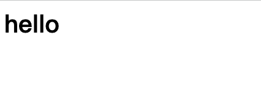
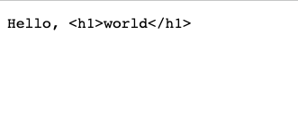

# Exploiting MIME Sniffing

In every response, there is usually a response header called `Content-Type` that tells the browser the MIME type of the response, such as `text/html` or `application/json`.

But what if there is no `Content-Type` header? The browser will try to determine the type based on the file content. Even if the `Content-Type` header is present, the browser may still interpret it as a different type.

This behavior of inferring the MIME type from the file content is called MIME sniffing. Let's explore this feature together!

## First Encounter with MIME Sniffing

We can easily output a response without the `Content-Type` header using Express:

``` js
const express = require('express');
const app = express();

app.get('/', (req, res) => {
  res.write('<h1>hello</h1>')
  res.end()
});

app.listen(5555, () => {
  console.log('Server is running on port 5555');
});
```

If you open this webpage in a browser, you will see that the text "hello" becomes larger and bold, indicating that the browser renders the response as a webpage:



Now let's look at the second example, where we change `<h1>` to `<h2>`:

``` js
const express = require('express');
const app = express();

app.get('/', (req, res) => {
  res.write('<h2>hello</h2>')
  res.end()
});

app.listen(5555, () => {
  console.log('Server is running on port 5555');
});
```


Wait, why is it suddenly displayed as plain text?

Next, in the third example, we have the same `<h1>` but with some additional text:

``` js
const express = require('express');
const app = express();

app.get('/', (req, res) => {
  res.write('Hello, <h1>world</h1>')
  res.end()
});

app.listen(5555, () => {
  console.log('Server is running on port 5555');
});
```



Again, it is displayed as plain text instead of HTML.

You might think that the browser's MIME sniffing mechanism is a mystery, like a black box that you don't know how it works. Fortunately, we are testing with Chrome, and Chromium is open source.

The code responsible for MIME sniffing in Chromium can be found in [net/base/mime_sniffer.cc](https://source.chromium.org/chromium/chromium/src/+/refs/tags/118.0.5981.4:net/base/mime_sniffer.cc). At the beginning of the code, it explains how the detection works:

``` cpp
// Detecting mime types is a tricky business because we need to balance
// compatibility concerns with security issues.  Here is a survey of how other
// browsers behave and then a description of how we intend to behave.
//
// HTML payload, no Content-Type header:
// * IE 7: Render as HTML
// * Firefox 2: Render as HTML
// * Safari 3: Render as HTML
// * Opera 9: Render as HTML
//
// Here the choice seems clear:
// => Chrome: Render as HTML
//
// HTML payload, Content-Type: "text/plain":
// * IE 7: Render as HTML
// * Firefox 2: Render as text
// * Safari 3: Render as text (Note: Safari will Render as HTML if the URL
//                                   has an HTML extension)
// * Opera 9: Render as text
//
// Here we choose to follow the majority (and break some compatibility with IE).
// Many folks dislike IE's behavior here.
// => Chrome: Render as text
// We generalize this as follows.  If the Content-Type header is text/plain
// we won't detect dangerous mime types (those that can execute script).
//
// HTML payload, Content-Type: "application/octet-stream":
// * IE 7: Render as HTML
// * Firefox 2: Download as application/octet-stream
// * Safari 3: Render as HTML
// * Opera 9: Render as HTML
//
// We follow Firefox.
// => Chrome: Download as application/octet-stream
// One factor in this decision is that IIS 4 and 5 will send
// application/octet-stream for .xhtml files (because they don't recognize
// the extension).  We did some experiments and it looks like this doesn't occur
// very often on the web.  We choose the more secure option.
```

So, what makes it consider the payload as "HTML payload"? It is checked further down in the code:

``` cpp
// Our HTML sniffer differs slightly from Mozilla.  For example, Mozilla will
// decide that a document that begins "<!DOCTYPE SOAP-ENV:Envelope PUBLIC " is
// HTML, but we will not.

#define MAGIC_HTML_TAG(tag) \
  MAGIC_STRING("text/html", "<" tag)

static const MagicNumber kSniffableTags[] = {
  // XML processing directive.  Although this is not an HTML mime type, we sniff
  // for this in the HTML phase because text/xml is just as powerful as HTML and
  // we want to leverage our white space skipping technology.
  MAGIC_NUMBER("text/xml", "<?xml"),  // Mozilla
  // DOCTYPEs
  MAGIC_HTML_TAG("!DOCTYPE html"),  // HTML5 spec
  // Sniffable tags, ordered by how often they occur in sniffable documents.
  MAGIC_HTML_TAG("script"),  // HTML5 spec, Mozilla
  MAGIC_HTML_TAG("html"),  // HTML5 spec, Mozilla
  MAGIC_HTML_TAG("!--"),
  MAGIC_HTML_TAG("head"),  // HTML5 spec, Mozilla
  MAGIC_HTML_TAG("iframe"),  // Mozilla
  MAGIC_HTML_TAG("h1"),  // Mozilla
  MAGIC_HTML_TAG("div"),  // Mozilla
  MAGIC_HTML_TAG("font"),  // Mozilla
  MAGIC_HTML_TAG("table"),  // Mozilla
  MAGIC_HTML_TAG("a"),  // Mozilla
  MAGIC_HTML_TAG("style"),  // Mozilla
  MAGIC_HTML_TAG("title"),  // Mozilla
  MAGIC_HTML_TAG("b"),  // Mozilla
  MAGIC_HTML_TAG("body"),  // Mozilla
  MAGIC_HTML_TAG("br"),
  MAGIC_HTML_TAG("p"),  // Mozilla
};

// ...

// Returns true and sets result if the content appears to be HTML.
// Clears have_enough_content if more data could possibly change the result.
static bool SniffForHTML(base::StringPiece content,
                         bool* have_enough_content,
                         std::string* result) {
  // For HTML, we are willing to consider up to 512 bytes. This may be overly
  // conservative as IE only considers 256.
  *have_enough_content &= TruncateStringPiece(512, &content);

  // We adopt a strategy similar to that used by Mozilla to sniff HTML tags,
  // but with some modifications to better match the HTML5 spec.
  base::StringPiece trimmed =
      base::TrimWhitespaceASCII(content, base::TRIM_LEADING);

  // |trimmed| now starts at first non-whitespace character (or is empty).
  return CheckForMagicNumbers(trimmed, kSniffableTags, result);
}
```

It checks if the string at the beginning of the response, after removing whitespace, matches the HTML patterns listed above. The common HTML beginnings, such as `<!DOCTYPE html` and `<html`, are included. This also explains why only the example `<h1>hello</h1>` is rendered as HTML in our previous tests.

From the source code, it seems that Chromium does not consider the file extension or other factors in the URL. It solely relies on the file content. Let's do another test to verify this:

``` js
const express = require('express');
const app = express();

app.get('/test.html', (req, res) => {
  res.write('abcde<h1>test</h1>')
  res.end()
});

app.listen(5555, () => {
  console.log('Server is running on port 5555');
});
```

I won't include an image here, but regardless of the URL being `test.html`, the result is still displayed as plain text. What about other browsers? Let's try opening it with Firefox:


We can see that Firefox actually renders it as HTML! Therefore, we can infer that Firefox considers the file extension in the URL when performing MIME sniffing.

## Exploiting MIME Sniffing for Attacks

From our previous research, we have confirmed a fact: if a response does not have a `Content-Type` set and we can control the content, we can use MIME sniffing to make the browser interpret the file as a webpage.

For example, let's assume there is an image upload feature that only checks the file extension but not the content. We can upload a file named `a.png`, but the content is `<script>alert(1)</script>`. If the server does not automatically add the `Content-Type` when serving this image, it becomes an XSS vulnerability.

However, most servers nowadays automatically add the `Content-Type`. Is it still possible?

Yes, we can combine it with other minor issues.

Apache HTTP Server is a commonly used server, and the famous LAMP stack (Linux + Apache + MySQL + PHP) uses this server.

Apache HTTP Server has a peculiar behavior: if the filename contains only a dot (`.`), it will not output the `Content-Type`. For example, `a.png` will automatically detect the MIME type based on the file extension and output `image/png`, but if the filename is `..png`, it will not output the `Content-Type`.

Therefore, if the backend uses Apache HTTP Server to handle file downloads, we can upload a seemingly legitimate image with the extension `..png`, but when opened in a browser, it will be displayed as a webpage, becoming an XSS vulnerability.

According to Apache HTTP Server, this is an expected behavior, and you can refer to [@YNizry](https://twitter.com/YNizry/status/1582733545759330306) for more details.

## Content Types that can execute JavaScript

Besides HTML files, what other file types can execute JavaScript?

In the research conducted by BlackFan in 2020: [Content-Type Research](https://github.com/BlackFan/content-type-research/tree/master), a comprehensive list is provided: [Content-Type that can be used for XSS](https://github.com/BlackFan/content-type-research/blob/master/XSS.md).

From the list, we can see that besides HTML, XML and SVG are the most common content types that can execute JavaScript.

Of particular interest here is SVG files because many websites have image upload functionality, and SVG is considered an image format. Therefore, some websites allow SVG uploads. However, from this research, we can learn that allowing SVG uploads is equivalent to allowing HTML uploads since SVG can execute JavaScript!

For example, febin reported a vulnerability to the open-source software Mantis Bug Tracker in 2022: [CVE-2022-33910: Stored XSS via SVG file upload](https://mantisbt.org/bugs/view.php?id=30384). This vulnerability occurred because users could upload files when creating a new issue, and the file format allowed was SVG. Therefore, a malicious SVG file could be uploaded, and when other users opened it, the hidden code inside would be executed.

## Content Types that can be loaded as scripts

Take the following code snippet as an example:

``` html
<script src="URL"></script>
```

Have you ever wondered what the content type of `URL` should be for the browser to load it as a script?

For instance, if it is `image/png`, it won't work, and you will see the following error message in the browser:

> Refused to execute script from 'http://localhost:5555/js' because its MIME type ('image/png') is not executable.

The most common one, `text/javascript`, obviously works fine. But are there any others?

Out of the ten content types listed below, only two of them won't work. Can you guess which two?

1. application/zip
2. application/json
3. application/octet-stream
4. text/csv
5. text/html
6. text/json
7. text/plain
8. huli/blog
9. video/mp4
10. font/woff2

We will reveal the answer later, but first, let's reveal the "valid JavaScript MIME types" written in the Chromium source code: [/third_party/blink/common/mime_util/mime_util.cc](https://chromium.googlesource.com/chromium/src.git/+/refs/tags/103.0.5012.1/third_party/blink/common/mime_util/mime_util.cc):

``` cpp
//  Support every script type mentioned in the spec, as it notes that "User
//  agents must recognize all JavaScript MIME types." See
//  https://html.spec.whatwg.org/#javascript-mime-type.
const char* const kSupportedJavascriptTypes[] = {
    "application/ecmascript",
    "application/javascript",
    "application/x-ecmascript",
    "application/x-javascript",
    "text/ecmascript",
    "text/javascript",
    "text/javascript1.0",
    "text/javascript1.1",
    "text/javascript1.2",
    "text/javascript1.3",
    "text/javascript1.4",
    "text/javascript1.5",
    "text/jscript",
    "text/livescript",
    "text/x-ecmascript",
    "text/x-javascript",
};
```

The above are all valid JavaScript MIME types, and you can see many remnants of the past, such as `jscript` or `livescript`.

Apart from the valid JavaScript MIME types, according to the specification, there are only four types that won't work:

1. `audio/*`
2. `image/*`
3. `video/*`
4. `text/csv`

Except for these, all other types are valid. Therefore, among the options mentioned above, only `text/csv` and `video/mp4` won't work, while the rest will work! Yes, even `text/html` and `application/json` will work, and even `huli/blog` will work.

If you want to tighten this lenient mechanism and only allow JavaScript MIME types to load, you can add a header in the response: `X-Content-Type-Options: nosniff`. After adding this header, none of the 10 examples mentioned earlier will work, and you will see the following error when loading:

> Refused to execute script from 'http://localhost:5555/js' because its MIME type ('text/plain') is not executable, and strict MIME type checking is enabled.

`strict MIME type` is the feature enabled by adding that header.

The same applies to stylesheets. After enabling this feature, only the `text/css` MIME type will be recognized as valid, and all others will result in an error.

So, what happens if you continue to enable this feature? It introduces an additional security risk.

Let's say you happen to find an XSS vulnerability on a website. However, the problem is that the website's CSP is `script-src 'self';`, which means it doesn't allow any external scripts to be loaded and inline scripts are also blocked. How can you bypass the CSP in this case?

If the website provides a file upload feature that accepts files other than images, videos, and CSV files, and doesn't check the content, let's say it only accepts ZIP files, then you can upload a compressed file that actually contains JavaScript code.

In this way, you can use `<script src="/uploads/files/my.zip"></script>` to load the script and successfully bypass the CSP. The reason this works is because of the behavior mentioned earlier – as long as the MIME type is not one of those few types, it can be loaded as a script.

That's why you see many websites adding this header, to prevent such behavior.

## Conclusion

In this article, we have seen many interesting things related to MIME types and also looked at a lot of Chromium source code. Personally, I find that Chromium's source code is written very clearly and includes comments and links to specifications, so you don't need to search for specifications separately. It's like killing two birds with one stone.

Finally, we introduced the purpose and function of the `X-Content-Type-Options: nosniff` header. I believe many people have seen this header before but didn't know what it was for, and now you know.

References:

1. [UIUCTF 2022 Write-up](https://blog.huli.tw/2022/08/01/uiuctf-2022-writeup/)
2. [What do you know about `script type`?](https://blog.huli.tw/2022/04/24/script-type/)
