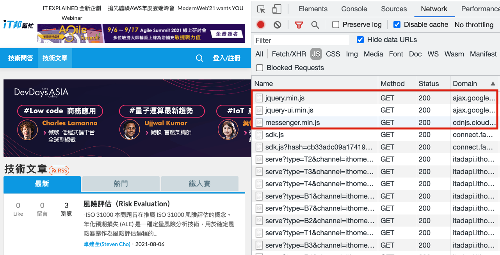

# Frontend Supply Chain Attacks: Attacking Downstream from Upstream

Supply chain attacks, target vulnerabilities in the upstream to launch attacks. Once the upstream is compromised, the downstream will also be contaminated.

Taking the frontend as an example, the npm packages you use or the third-party scripts you import into your code are considered "upstream". Have you ever been aware of the risks associated with using these third-party resources?

This article will use cdnjs as an example to explore frontend supply chain attacks and defense mechanisms.

## cdnjs

When working on the frontend, you often encounter situations where you need to use third-party libraries, such as jQuery or Bootstrap (the former has 4 million weekly downloads on npm, and the latter has 3 million). Let's put aside the fact that most people now use webpack to bundle their own code. In the past, for such requirements, you either downloaded the library files yourself or used a ready-made CDN to load them.

One of the sources is cdnjs, and its website looks like this:


Apart from cdnjs, there are other websites that provide similar services. For example, on the [jQuery](https://jquery.com/download/) official website, you can see their own code.jquery.com, and [Bootstrap](https://getbootstrap.com/) uses a service called [jsDelivr](https://www.jsdelivr.com/).

Let's take a practical example!

Suppose I'm working on a website that requires jQuery. I would use the `<script>` tag in the page to load the jQuery library, and the source could be:

1. My own website
2. jsDelivr: https://cdn.jsdelivr.net/npm/jquery@3.6.0/dist/jquery.min.js
3. cdnjs: https://cdnjs.cloudflare.com/ajax/libs/jquery/3.6.0/jquery.min.js
4. jQuery official: https://code.jquery.com/jquery-3.6.0.min.js

Suppose I choose the URL provided by the jQuery official website. I would write this HTML code:

``` html
<script src="https://code.jquery.com/jquery-3.6.0.min.js"></script>
```

This way, the jQuery library is loaded, and other code can use its functionalities.

So why would I choose a CDN instead of downloading the library and hosting it on my own website? There could be several reasons:

1. Laziness, using someone else's is faster
2. Budget considerations, using someone else's website saves on bandwidth costs and reduces the load on my own website
3. Speed considerations

The third point, speed considerations, deserves special mention. If the library is loaded from a CDN, the download speed may be faster.

The reason for the faster speed is that CDNs are specifically designed for this purpose and have nodes in different countries. For example, if your server is located in the United States and you host the library on your own website, users from Taiwan would have to connect to the server in the United States to fetch these libraries. However, if you use a CDN-provided URL, they may only need to connect to a node in Taiwan, saving some latency.

Taking a well-known IT website in Taiwan as an example, it uses resources from Google and cdnjs:



We've discussed some advantages of using third-party CDNs. What about the disadvantages?

The first disadvantage is that if the CDN goes down, your website may go down with it. Even if it doesn't go down completely, it may experience slow connections. For example, if my website loads jQuery from cdnjs, but cdnjs suddenly becomes slow, my website will also become slow, as it is affected as well.

The company behind cdnjs, Cloudflare, has indeed experienced some [incidents](https://techcrunch.com/2019/06/24/cloudflare-outage-affecting-numerous-sites-on-monday-am/), which affected many websites.

The second disadvantage is that if the CDN is hacked and the library you imported is injected with malicious code, your website will also be compromised. This type of attack is known as "supply chain attack," where the upstream is compromised, affecting the downstream.

Some people may think, "These big companies are unlikely to be hacked, right? And since so many people use these services, someone must be monitoring them."

Next, let's look at a real-world case study.

## Analyzing the RCE Vulnerability in cdnjs

On July 16, 2021, a security researcher [@ryotkak](https://twitter.com/ryotkak) published an article on his blog titled [Remote code execution in cdnjs of Cloudflare](https://blog.ryotak.me/post/cdnjs-remote-code-execution-en/) (referred to as "the author" hereafter).

Remote code execution, abbreviated as RCE, is a vulnerability that allows attackers to execute arbitrary code. It is a high-risk vulnerability. The author discovered an RCE vulnerability in cdnjs, which, if exploited, could allow control over the entire cdnjs service.

The author's blog post provides a detailed account of the process. Here, I will briefly explain how the vulnerability is formed, which consists of two vulnerabilities.

Firstly, Cloudflare has open-sourced cdnjs-related code on GitHub, and one of its automatic update features caught the author's attention. This feature automatically fetches packaged files from npm in the form of compressed files (.tgz), decompresses them, and performs some processing before copying them to the appropriate location.

The author knew that using `archive/tar` for decompression in Go could potentially have vulnerabilities because the decompressed files are not processed. Therefore, the file names can look like this: `../../../../../tmp/temp`.

What's the problem with this?

Let's say you have a piece of code that copies a file and performs similar operations as follows:

1. Concatenate the destination and file name to create the target location and create a new file.
2. Read the original file and write it to the new file.

If the destination is `/packages/test` and the file name is `abc.js`, a new file will be generated at `/packages/test/abc.js`.

Now, if the destination is the same but the file name is `../../../tmp/abc.js`, the file will be written to `/package/test/../../../tmp/abc.js`, which is `/tmp/abc.js`.

Therefore, using this technique, files can be written to any location with appropriate permissions. The cdnjs code has a similar vulnerability that allows files to be written to any location. If this vulnerability can be exploited to overwrite files that are scheduled for automatic execution, RCE can be achieved.

While the author was planning to create a POC to verify this, they became curious about how the Git auto-update feature works (the previous discussion about compressed files was related to npm).

After researching, the author discovered a piece of code for copying files related to Git repo auto-updates, which looks like this:

``` go
func MoveFile(sourcePath, destPath string) error {
    inputFile, err := os.Open(sourcePath)
    if err != nil {
        return fmt.Errorf("Couldn't open source file: %s", err)
    }
    outputFile, err := os.Create(destPath)
    if err != nil {
        inputFile.Close()
        return fmt.Errorf("Couldn't open dest file: %s", err)
    }
    defer outputFile.Close()
    _, err = io.Copy(outputFile, inputFile)
    inputFile.Close()
    if err != nil {
        return fmt.Errorf("Writing to output file failed: %s", err)
    }
    // The copy was successful, so now delete the original file
    err = os.Remove(sourcePath)
    if err != nil {
        return fmt.Errorf("Failed removing original file: %s", err)
    }
    return nil
}
```

It doesn't seem like much, just copying a file, opening a new file, and copying the contents of the old file into it.

But if the original file is a symbolic link, it's different. Before moving forward, let's briefly explain what a symbolic link is.

The concept of a symbolic link is similar to the "shortcut" we used to see on Windows. This shortcut itself is just a link that points to the actual target.

In Unix-like systems, you can use `ln -s target_file link_name` to create a symbolic link. Let's provide an example to better understand.

First, I create a file with the content "hello" at the location `/tmp/hello`. Then, in the current directory, I create a symbolic link that points to the newly created hello file: `ln -s /tmp/hello link_file`.

If I print the contents of `link_file`, it will display "hello" because it's actually printing the contents of `/tmp/hello`. If I write data to `link_file`, it will actually write to `/tmp/hello`.


Now, let's try writing a piece of code in Node.js to copy a file and see what happens:

``` js
node -e 'require("fs").copyFileSync("link_file", "test.txt")'
```

After execution, we find that a `test.txt` file is created in the directory, and its content is the same as the content of `/tmp/hello`.

So, when a program copies a file, it's not "copying a symbolic link," but rather "copying the content of the target file."

Therefore, in the previously mentioned Go code for copying files, if there is a file that is a symbolic link pointing to `/etc/passwd`, after copying, a file with the content `/etc/passwd` will be generated.

We can add a symbolic link named `test.js` in the Git file, pointing to `/etc/passwd`. After cdnjs copies it, a file named test.js will be created, and its content will be `/etc/passwd`!

This leads to an Arbitrary File Read vulnerability.

To summarize, the author found two vulnerabilities: one for writing files and one for reading files. Writing files can cause system crashes if important files are accidentally overwritten. Therefore, the author decided to start with the file reading vulnerability and created a Git repository, published a new version, waited for cdnjs to auto-update, and finally triggered the file reading vulnerability. The content of the read file can be seen in the JS published on cdnjs.

And the file the author reads is `/proc/self/environ` (he originally wanted to read another `/proc/self/maps`), which contains environment variables, including a GitHub API key. This key has write permissions to the repository under cdnjs, so using this key, one can directly modify the code of cdnjs or the cdnjs website, thereby controlling the entire service.

That's the explanation of the cdnjs vulnerability. If you want to see more technical details or a detailed development, you can read the original author's blog post, which contains many details. In any case, even services maintained by large companies are at risk of being compromised.

Cloudflare also released an incident handling report a week later: [Cloudflare's Handling of an RCE Vulnerability in cdnjs](https://blog.cloudflare.com/cloudflares-handling-of-an-rce-vulnerability-in-cdnjs/), which documents the sequence of events and the subsequent remediation measures. They completely rewrote the entire architecture, putting the decompression part into a Docker sandbox, thereby increasing overall security.

## How can frontend engineers defend against this?

So how can we defend against this type of vulnerability? Or perhaps, can we not defend against it at all?

Browsers actually provide a feature: "Do not load the file if it has been tampered with." This way, even if cdnjs is compromised and the jQuery file is tampered with, my website will not load the new jQuery file, thus avoiding file contamination attacks.

On cdnjs, when you decide to use a particular library, you can choose to copy the URL or copy the script tag. If you choose the latter, you will get the following content:

``` html
<script
    src="https://cdnjs.cloudflare.com/ajax/libs/react/17.0.2/umd/react.production.min.js"
    integrity="sha512-TS4lzp3EVDrSXPofTEu9VDWDQb7veCZ5MOm42pzfoNEVqccXWvENKZfdm5lH2c/NcivgsTDw9jVbK+xeYfzezw=="
    crossorigin="anonymous"
    referrerpolicy="no-referrer">
</script>
```

We have already mentioned `crossorigin="anonymous"`. By using CORS to send requests, we can avoid sending cookies to the backend.

The other tag above, `integrity`, is the key to defense. This attribute allows the browser to verify if the resource to be loaded matches the provided hash value. If it doesn't match, it means the file has been tampered with and the resource will not be loaded. So even if cdnjs is compromised and the hacker replaces the react.js file I originally used, the browser will not load the contaminated code because the hash value doesn't match.

If you want to know more, you can refer to MDN, where there is a page dedicated to [Subresource Integrity](https://developer.mozilla.org/en-US/docs/Web/Security/Subresource_Integrity).

However, this method can only prevent "already imported scripts" from being tampered with. If by chance the script is copied after the hacker has tampered with the file, then it won't be effective because the file would already be tampered with.

So if you want to completely avoid this risk, don't use these third-party services. Host these libraries on your own CDN, so the risk shifts from third-party to your own service. Unless your own service is compromised, these libraries should be safe.

Nowadays, many websites use bundlers like webpack to repackage libraries, so they cannot use third-party library CDNs. They must be hosted on their own websites, which eliminates this type of supply chain attack.

However, be aware that you still cannot avoid other supply chain attack risks. Because even if you don't use third-party library CDNs, you still need to download these libraries from somewhere else, such as npm. If npm is compromised and its files are tampered with, it will still affect your service. This is a supply chain attack, where the attack doesn't directly target you but infiltrates through other upstream sources.

However, this type of risk can be mitigated during build time by using static scanning services to detect tampered files or malicious code. Some companies also set up internal npm registries that are not directly synchronized with external npm, ensuring that the libraries used are not tampered with.

## Conclusion

There are countless attack methods, and researchers who discovered the cdnjs vulnerability have recently been interested in supply chain attacks. Not only cdnjs, but even Homebrew, PyPI, and even @types have been found to have vulnerabilities.

If you want to directly include third-party URLs on your page, make sure to verify that the website is trustworthy. If possible, also add the integrity attribute to prevent file tampering and the subsequent impact on your service. Also, pay attention to the CSP configuration. For websites like cdnjs, if you only set the domain, there are already feasible bypass methods, so please be cautious when setting it up.

I hope to raise awareness among frontend engineers about supply chain attacks through the vulnerability in cdnjs. By being aware of this attack method, developers will be more cautious in their future development and will pay attention to the risks associated with importing third-party libraries.
