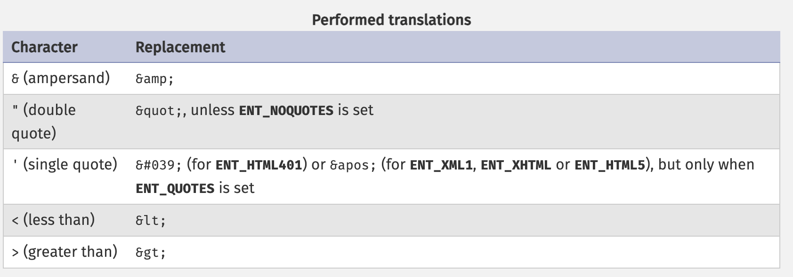
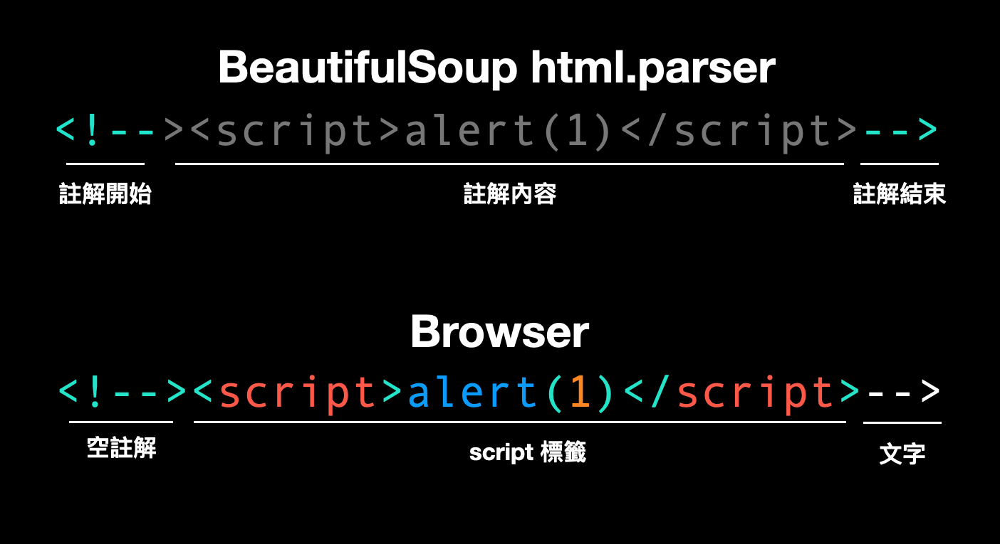
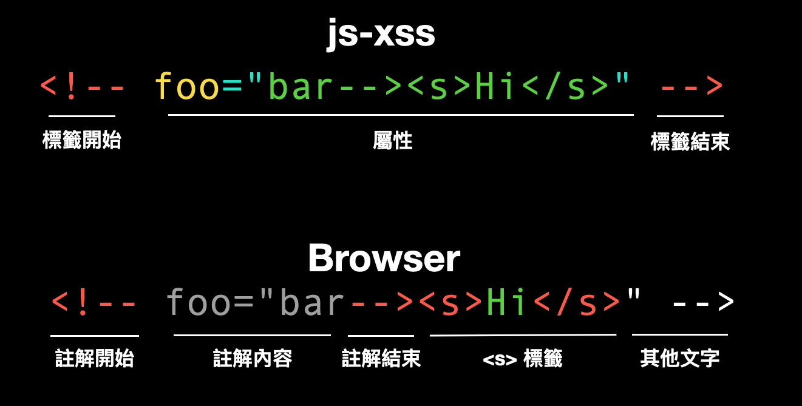
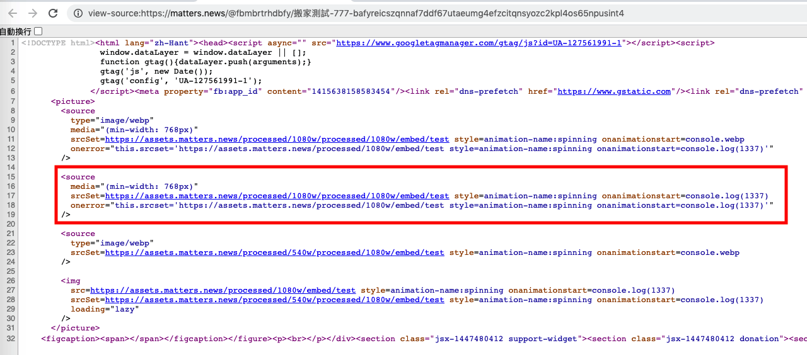

# XSSの第一の防御線：サニタイズ

XSSの様々な基本知識と攻撃手法について説明した後、防御について話しましょう。この記事から、正式に第2章「XSSの防御とバイパス」に入ります。

以前XSSの防御について話した際にも触れましたが、ユーザー入力をエンコードして元の意味として解釈されないようにすることで、リスクを回避できます。

エンコードに加えて、「ユーザー入力から有害な部分を削除する」という別の方法があります。この操作はサニタイズと呼ばれ、通常これを処理するプログラムはサニタイザーと呼ばれます。

これと前述の「エンコード」や「エスケープ」には微妙な違いがあります。エンコードはユーザー入力の特定の文字をエンコードするだけで、最終的にはプレーンテキストとして表示されます。一方、サニタイズはルールに準拠しない部分全体を削除します。

本題に入る前に、前回の記事の解答を見てみましょう。前回の記事の最後に、コードを掲載し、何か問題があるか尋ねました。

```js
// これは、ユーザーがお気に入りのYouTube動画をプロフィールページに埋め込むことができる機能です
const url = "[[ユーザからの入力値]]";

// YouTube動画のURLであることを確認します
if (url.startsWith("https://www.youtube.com/watch")) {
  document.querySelector("iframe").src = url;
}
```

このコードの問題点は、URLの検証が十分に厳密でないため、ユーザーが動画以外のURL（例：`https://www.youtube.com/watch/../account`）を入力できてしまい、アカウント設定ページが表示されてしまうことです。

しかし、特段問題ないように見えます。単に別のYouTubeページであり、依然としてYouTube内にあるはずです。

理論的にはその通りですが、ウェブサイトに[オープンリダイレクト](https://blog.huli.tw/2021/09/26/en/what-is-open-redirect/)の脆弱性があり、任意のURLにリダイレクトできる場合は別です。その場合、攻撃者はiframeに表示されるコンテンツを制御できます。

例えば、`https://www.youtube.com/redirect?target=https://blog.huli.tw` が `https://blog.huli.tw` にリダイレクトする場合、このURLを使用してiframeに私のブログを表示させることができ、期待されるYouTube動画の代わりに表示されます。

そして実際、YouTubeには現在、悪用可能なオープンリダイレクトを持つURLが存在します。ただし、いつでも修正される可能性があるため、ここではURLを提供しません。

URLを検証する必要がある場合は、解析に `new URL()` を使用し、戻り値に基づいて判断することをお勧めします。この方法は、単純な文字列比較や正規表現よりもはるかに堅牢です。

クイズは終わりましたので、ユーザー入力の処理方法について詳しく説明しましょう。

## 最も基本的な対策：エンコード

なぜXSS攻撃は機能するのでしょうか？

それは、エンジニアがユーザー入力を単純なテキスト入力と期待しているのに対し、実際にはこの入力がブラウザによってHTMLコードの一部として解釈されるためです。この違いが脆弱性を生み出します。これはSQLインジェクションに似ており、文字列を入力していると思っているのに、それがSQLコマンドの一部として解釈されるのと同じです。

したがって、修正は簡単です。ユーザー入力をエンコードし、あるべき姿にすることです。

フロントエンド開発では、JavaScriptでユーザー入力を画面に表示する際には、`innerHTML` の代わりに `innerText` または `textContent` を使用することを忘れないでください。これにより、ユーザー入力はプレーンテキストとして解釈されます。

ReactとVueの両方に、同様の機能が組み込まれています。基本的なロジックは次のとおりです。

> デフォルトでは、レンダリングされるものはすべてプレーンテキストとして扱われます。HTMLをレンダリングする必要がある場合は、`dangerouslySetInnerHTML` や `v-html` などの特別なメソッドを使用します。

バックエンドに関しては、PHPでは[htmlspecialchars](https://www.php.net/manual/en/function.htmlspecialchars.php)関数を使用できます。ドキュメントの表には、エンコードされる文字が示されています。



しかし、最近では多くのバックエンドがコンテンツを直接出力しません。テンプレートエンジンを使用して処理します。例えば、一般的に使用される `handlebarsjs` は、デフォルトで `{{ name }}` をエンコードされた出力として扱います。生のコンテンツを出力するには、3つの中括弧が必要です：`{{{ vulnerable_to_xss }}}`。

LaravelのBladeでは、`{{ $text }}` はエンコードされ、`{!! $text !!}` はエンコードされません。感嘆符が警告を意味するのかどうかはわかりません。「おい、これを使うときは注意しなよ」

一部のテンプレートエンジンはフィルターを使用します。例えば、PythonのJinjaでは、`{{ text }}` はエンコードされ、`{{ text | safe }}` はコンテンツが安全であり、元の形式で直接出力できることを意味します。

したがって、コードを書く際には、安全なアプローチをデフォルトにすることが最善です。安全でない部分（以前に言及した `<a href>` の問題を含む、特別な注意が必要）に注意してください。

安全でない出力メソッドはいつ使用するのでしょうか？

通常、これは元のテキストがすでにHTML形式である場合に発生します。例えば、ブログプラットフォームは特定のHTMLタグをサポートする場合があり、これは一般的なシナリオです。

では、この状況をどのように処理すればよいのでしょうか？ここでサニタイズの出番です。

## HTMLの処理

車輪の再発明を試みるのではなく、すでに誰かが構築したライブラリを使用してください。

使用しているフレームワークやプログラミング言語がすでに関連機能を提供している場合は、それを使用してください。そうでない場合は、広く使用されている評判の良いライブラリを見つけてください。もちろん、これらのライブラリには脆弱性がある可能性がありますが、通常は多くのシナリオを考慮し、多くの問題を解決しているため、自分でできることよりもはるかに徹底しています。

さらに、これらのライブラリはサニタイズ目的で特別に設計されている必要があります。そうでない場合は、自分でやっているようなものです。

例えば、Pythonには `BeautifulSoup` というライブラリがあり、ウェブページを解析でき、ウェブスクレイピングによく使用されます。ただし、サニタイズ用には設計されていないため、使用すると問題が発生する可能性があります。

サニタイズ用に設計されていなくても、ウェブページの解析に使用されますよね？では、なぜ使えないのでしょうか？

デモンストレーションしましょう。

```python
from bs4 import BeautifulSoup
html = """
  <div>
    test
    <script>alert(1)</script>
    
  </div>
"""
tree = BeautifulSoup(html, "html.parser")
for element in tree.find_all():
  print(f"name: {element.name}")
  print(f"attrs: {element.attrs}")
```

このプログラムの出力は次のとおりです。

```
name: div
attrs: {}
name: script
attrs: {}
name: img
attrs: {'src': 'x', 'onerror': 'alert(1)'}
```

タグ名と属性を正しく解析しているため、問題ないように見えます。では、自分で許可リストやブロックリストを作成できないのでしょうか？それは合理的だと思われますが、実際には...

```python
from bs4 import BeautifulSoup
html = """
  <div>
    test
    <!--><script>alert(1)</script>-->
  </div>
"""
tree = BeautifulSoup(html, "html.parser")
for element in tree.find_all():
  print(f"name: {element.name}")
  print(f"attrs: {element.attrs}")
```

出力は次のとおりです。

```
name: div
attrs: {}
```

正常に見えますが、上記のHTMLをブラウザで開くと、JavaScriptコードが実行され、おなじみのダイアログが表示されます。BeautifulSoupによるチェックが正常にバイパスされたことを示します。

バイパスは、次のHTMLに対するブラウザとBeautifulSoupの解析の違いに基づいています。

```html
<!--><script>alert(1)</script>-->
```

BeautifulSoupのHTMLパーサーは、これを `<!--` と `-->` で囲まれたコメントとして扱うため、タグや属性を解析しません。

ただし、[HTML5仕様](https://html.spec.whatwg.org/multipage/syntax.html#comments)によると、`<!-->` は有効な空のコメントであるため、上記はコメントの後に `<script>` タグとテキスト `-->` が続くものになります。



このパーサーの違いを利用して、攻撃者はチェックをバイパスし、XSSを正常に実行できます。

ちなみに、BeautifulSoupのパーサーを `lxml` に切り替えても、正しく解析できません。しかし、`html5lib` に切り替えると、`<script>` として正しく解析されます。しかし、`html5lib` にはまた別の問題がある可能性はあります。

（これはCTFチャレンジから学んだテクニックです。参考文献：[irisctf2023 - Feeling Tagged (Web)](https://github.com/Seraphin-/ctf/blob/master/irisctf2023/feelingtagged.md) および [HackTM CTF Qualifiers 2023 - Crocodilu](https://ctf.zeyu2001.com/2023/hacktm-ctf-qualifiers/crocodilu#bypassing-html-sanitization)）

では、サニタイズ専用に設計された推奨ライブラリはありますか？はい、ちょうど知っています。

### DOMPurify

[DOMPurify](https://github.com/cure53/DOMPurify)は、ドイツのサイバーセキュリティ企業であるCure53によって開発されたオープンソースパッケージであり、HTMLサニタイズ専用です。Cure53には、ウェブおよびフロントエンド開発を専門とし、数多くの有名な脆弱性を報告してきた多くのメンバーがいます。彼らはこの分野の専門家です。

DOMPurifyの基本的な使用方法は次のとおりです。

```js
const clean = DOMPurify.sanitize(html);
```

危険なタグや属性を削除するだけでなく、DOM Clobberingなどの他の攻撃からも防御するなど、多くのことを舞台裏で行っています。非常に徹底しています。

DOMPurifyは、デフォルトで `<h1>`、`<p>`、`<div>`、`<span>` などの安全なタグのみを許可します。また、すべてのイベントハンドラーを削除し、前述のjavascript:疑似プロトコルをクリアして、入力したHTMLがデフォルトのシナリオでXSSにならないようにします。

ただし、注意すべき点の1つは、`<style>` タグがデフォルトで有効になっていることであり、関連するリスクについては後で説明します。

より多くのタグや属性を許可したい場合は、関連する設定を調整できます。

```js
const config = {
  ADD_TAGS: ["iframe"],
  ADD_ATTR: ["src"],
};

let html = "<div><iframe src=javascript:alert(1)></iframe></div>";
console.log(DOMPurify.sanitize(html, config));
// <div><iframe></iframe></div>

html = "<div><iframe src=https://example.com></iframe></div>";
console.log(DOMPurify.sanitize(html, config));
// <div><iframe src="https://example.com"></iframe></div>
```

上記の例から、`iframe` タグの `src` 属性を許可しても、危険なコンテンツは自動的にフィルタリングされます。これは、`src` 属性のみを許可し、`javascript:` の使用を許可していないためです。

ただし、XSSを引き起こす可能性のある属性やタグをあえて許可したい場合、DOMPurifyはそれを止めません。

```js
const config = {
  ADD_TAGS: ["script"],
  ADD_ATTR: ["onclick"],
};

html = "abc<script>alert(1)</script><button onclick=alert(2)>abc</button>";
console.log(DOMPurify.sanitize(html, config));
// abc<script>alert(1)</script><button onclick="alert(2)">abc</button>
```

DOMPurifyのドキュメントは非常に詳細であり、このライブラリの目標と問題が発生する可能性のある状況を説明する[Security Goals & Threat Model](https://github.com/cure53/DOMPurify/wiki/Security-Goals-&-Threat-Model)という特定のページがあります。

## 正しいライブラリ、誤った使用方法

これらのライブラリを使用する際には、公式ドキュメントを通じて使用方法を学び、使用中に細心の注意を払うことが重要です。正しいライブラリであっても、誤った構成は依然として問題を引き起こす可能性があります。

最初の典型的なケースは、2019年に有名な台湾のハッカーであるorangeによって発見された脆弱性です。コンテンツをフィルタリングする際、HackMDは次の構成を使用していました（HackMDはjs-xssという別のパッケージを使用しています）。

```js
var filterXSSOptions = {
  allowCommentTag: true,
  whiteList: whiteList,
  escapeHtml: function (html) {
    // allow html comment in multiple lines
    return html
      .replace(/<(?!!--)/g, "&lt;")
      .replace(/-->/g, "-->")
      .replace(/>/g, "&gt;")
      .replace(/-->/g, "-->");
  },
  onIgnoreTag: function (tag, html, options) {
    // allow comment tag
    if (tag === "!--") {
      // do not filter its attributes
      return html;
    }
  },
  // ...
};
```

タグが `!--` の場合、直接無視され、返されません。意図はコメントを保持することであり、例えば `<!-- hello -->` は `!--` という名前のタグとして扱われます。

しかし、orangeは次の方法を使用してバイパスしました。

```html
<!-- foo="bar--><s>Hi</s>" -->
```

`<!--` はタグとして扱われるため、上記の内容は `foo` 属性を追加するだけです。しかし、ブラウザがレンダリングすると、開始の `<!--` が `foo` の `bar-->` と結合し、HTMLコメントになり、その後の `<s>Hi</s>` が表示され、XSS脆弱性になります。



詳細情報と修正については、元の記事を参照してください：[A Wormable XSS on HackMD!](https://blog.orange.tw/2019/03/a-wormable-xss-on-hackmd.html)

私も2021年に別のケースを発見しましたが、それも誤用でした。

あるウェブサイトはバックエンドで `article.content` をサニタイズし、フロントエンドのレンダリングは次のように書かれていました。

```jsx
<>
  <div
    className={classNames({ "u-content": true, translating })}
    dangerouslySetInnerHTML={{
      __html: optimizeEmbed(translation || article.content),
    }}
    onClick={captureClicks}
    ref={contentContainer}
  />

  <style jsx>{styles}</style>
</>
```

すでにフィルタリングされたコンテンツが `optimizeEmbed` 処理を通過しました。つまり、`optimizeEmbed` に問題がある場合、依然としてXSSを引き起こす可能性があります。

この関数が何をするか見てみましょう（コードは抜粋しています）。

```js
export const optimizeEmbed = (content: string) => {
  return content
    .replace(/\<iframe /g, '<iframe loading="lazy"')
    .replace(
      /]*?src\s*=\s*['\"]([^'\"]*?)['\"][^>]*?>/g,
      (match, src, offset) => {
        return /* html */ `
      <picture>
        <source
          type="image/webp"
          media="(min-width: 768px)"
          srcSet=${toSizedImageURL({ url: src, size: "1080w", ext: "webp" })}
          onerror="this.srcset='${src}'"
        />
        
      </picture>
    `;
      }
    );
};
```

ここでは、画像URLが文字列として直接連結され、属性は単一引用符または二重引用符で囲まれていません！`toSizedImageURL` を制御できれば、XSS脆弱性を作成できます。この関数の実装は次のとおりです。

```js
export const toSizedImageURL = ({ url, size, ext }: ToSizedImageURLProps) => {
  const assetDomain = process.env.NEXT_PUBLIC_ASSET_DOMAIN
    ? `https://${process.env.NEXT_PUBLIC_ASSET_DOMAIN}`
    : "";
  const isOutsideLink = url.indexOf(assetDomain) < 0;
  const isGIF = /gif/i.test(url);

  if (!assetDomain || isOutsideLink || isGIF) {
    return url;
  }

  const key = url.replace(assetDomain, ``);
  const extedUrl = changeExt({ key, ext });
  const prefix = size ? "/" + PROCESSED_PREFIX + "/" + size : "";

  return assetDomain + prefix + extedUrl;
};
```

URLが指定された条件を満たさない場合は直接返され、そうでない場合は文字列処理が実行されてから返されます。要約すると、この関数の戻り値を実際に制御できます。

渡されたURLが `https://assets.matters.news/processed/1080w/embed/test style=animation-name:spinning onanimationstart=alert(1337)` の場合、最終的に連結されたHTMLは次のようになります。

```html
<source type="image/webp" media="(min-width: 768px)"
srcSet=https://assets.matters.news/processed/1080w/embed/test
style=animation-name:spinning onanimationstart=console.log(1337)
onerror="this.srcset='${src}'" />
```

イベントハンドラー `onanimationstart=console.log(1337)` とともに `style=animation-name:spinning` を使用することにより、ユーザー操作を必要とせずにXSS脆弱性が正常に作成されます。



上記の2つのケースから、次のことがわかります。

1. 誤った構成の使用
2. フィルタリング後のコンテンツの変更

どちらも問題を引き起こし、XSS脆弱性に発展する可能性があります。

したがって、正しいライブラリを使用しても、使用方法に注意することが重要です。小さな間違いでも、依然としてXSS脆弱性につながる可能性があります。

## まとめ

この記事では、XSSに対する最初の防御である、ユーザー入力をエンコードまたはサニタイズして危険なコンテンツを削除するか、画面に安全にレンダリングする方法を紹介しました。

これは単純に聞こえますが、実際には困難です。そうでなければ、これほど多くのXSS脆弱性は存在しません。この記事では、将来同様の状況で何に注意すべきかを知るために、皆さんが落とし穴を避けるのに役立つ多くの実際の例も紹介しています。

最初の防御線として言及されているため、まだ2番目の防御線があることを意味します。次の記事で2番目の防御線を紹介する前に、誰もが2番目の防御線が何であるかを考えることができます。ウェブサイトがユーザー入力を処理し忘れた場合、XSSをブロックするために使用できる他の方法はありますか？

あるいは、なぜ2番目の防御線が必要なのかを考えることもできます。

参考文献：

1. [Preventing XSS may be more difficult than you think](https://blog.huli.tw/2021/05/25/en/prevent-xss-is-not-that-easy/)。
