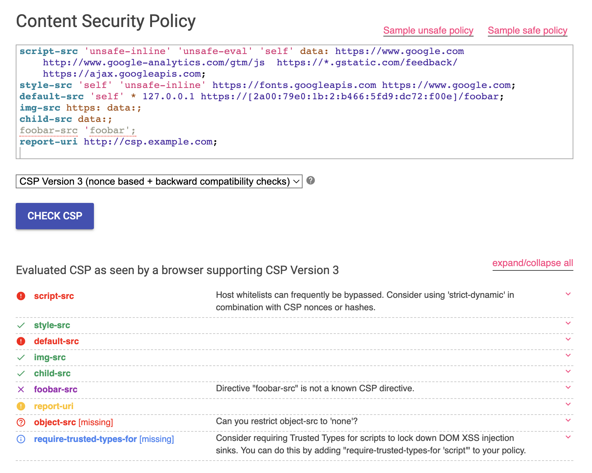
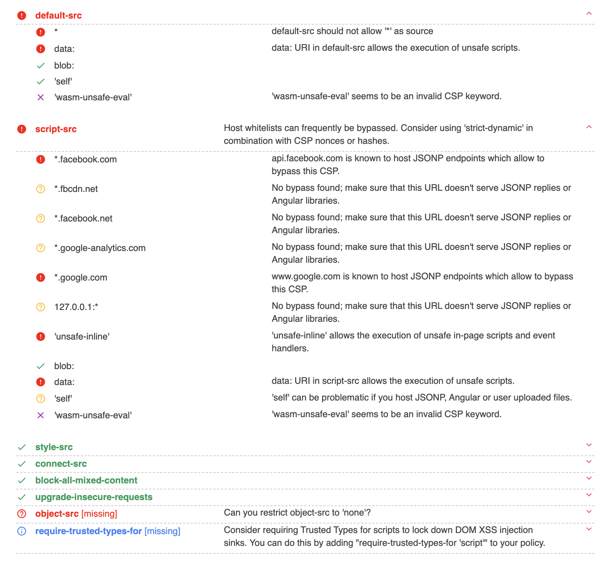

# XSSの第二の防御線：CSP

XSSの第一の防御線は、ユーザー入力をサニタイズし、コンテンツが安全であることを保証することです。しかし、言うは易く行うは難しで、特にレガシープロジェクトではコードが乱雑で複雑なため、どこを修正すべきかを判断するのが困難になります。

さらに、コードを書いているときに間違いを犯す可能性があり、セキュリティ問題には主に3つの原因があります。

1. 特定の行動が問題を引き起こす可能性があることを認識していない。
2. 特定の行動が問題を引き起こす可能性があることを忘れている。
3. 特定の行動が問題を引き起こす可能性があることを認識しているが、プロジェクトの締め切りや上司の指示により、それを無視することを選択する。

最初の理由は、以前に `<a href>` タグで言及した例に似ており、`javascript:` を使用してコードを実行できることを知らない場合があります。

2番目の理由は、XSSの脆弱性を認識しており、出力をエンコードする必要があることを知っているが、そうするのを忘れている場合です。

3番目の理由は、プロジェクトの時間の制約や上司の指示により、エンコードすべきであるにもかかわらず、意図的に脆弱性をエンコードしないままにしておく場合です。

最初の理由の場合、問題に対処する場所や脆弱性があることさえ知らない場合、どのように防御できますか？これが、第二の防御線が必要な理由です。

## 自動防御メカニズム：コンテンツセキュリティポリシー

CSP（Content Security Policy）を使用すると、ウェブページのルールを確立し、これらのルールに準拠するコンテンツのみを許可するようにブラウザに通知できます。準拠しないコンテンツはすべてブロックされます。

ウェブページにCSPを追加するには2つの方法があります。1つはHTTPレスポンスヘッダー `Content-Security-Policy` を介する方法で、もう1つは `<meta>` タグを介する方法です。後者の方がデモンストレーションが簡単なため、そちらに焦点を当てます（ただし、一部のルールは前者でしか設定できないため、前者の方が一般的に使用されます）。

（`<iframe>` の `csp` 属性を含む謎の3番目の方法もありますが、それは別のトピックであり、ここでは説明しません。）

例を見てみましょう。

```html
<!DOCTYPE html>
<html>
<head>
  <meta http-equiv="Content-Security-Policy" content="script-src 'none'">
</head>
<body>
  <script>alert(1)</script>
  CSP test
</body>
</html>
```

上記のウェブページでは、CSPは `script-src 'none'` として宣言されており、これはこのウェブページで「スクリプトの実行は許可されない」ことを意味します。したがって、本文中のスクリプトは実行されません。DevToolsを開くと、次のエラーメッセージが表示されます。

> Refused to execute inline script because it violates the following Content Security Policy directive: "script-src 'none'". Either the 'unsafe-inline' keyword, a hash ('sha256-bhHHL3z2vDgxUt0W3dWQOrprscmda2Y5pLsLg4GF+pI='), or a nonce ('nonce-...') is required to enable inline execution.

これが、CSPを第二の防御線と呼ぶ理由です。第一の防御線（ユーザー入力の処理）が失敗した場合でも、CSPに頼ってスクリプトやその他のリソースの読み込みを防ぎ、XSSの脆弱性を効果的に防止できます。

## CSPのルール

CSPでは、ディレクティブとルールを定義できます。上記の例では、ディレクティブ `script-src` が `'none'` に設定されており、最終的にJavaScriptの実行をブロックします。

まず、ディレクティブ `script-src` を簡単に「スクリプトタグのsrc属性」と解釈すべきではないことに注意することが重要です。ここでの「スクリプト」という用語は、一般的な「スクリプト」を指し、特にスクリプトタグやsrc属性を指すものではありません。

例えば、ページにHTMLスニペット `<a href="javascript:alert(1)">click</a>` があり、スクリプトタグやsrc属性がない場合でも、CSPによってブロックされ、エラーメッセージが表示されます。これは、`script-src 'none'` が「スクリプトタグ、イベントハンドラー、またはjavascript:疑似プロトコルを介しているかどうかに関係なく、JavaScriptの実行をブロックする」ことを意味するためです。

では、利用可能なディレクティブは何でしょうか？

最も重要なものは `default-src` であり、デフォルトのルールを表します。例えば、`script-src` が設定されていない場合、`default-src` のルールが使用されます。ただし、`base-uri` や `form-action` など、一部のディレクティブは `default-src` にフォールバックしないことに注意することが重要です。完全なリストはこちらで確認できます：[The default-src Directive](https://content-security-policy.com/default-src/)

その他の一般的に使用されるディレクティブは次のとおりです。

1. `script-src`：JavaScriptを管理します
2. `style-src`：CSSを管理します
3. `font-src`：フォントを管理します
4. `img-src`：画像を管理します
5. `connect-src`：接続（fetch、XMLHttpRequest、WebSocketなど）を管理します
6. `media-src`：動画と音声を管理します
7. `frame-src`：フレームとiframeを管理します
8. `base-uri`：`<base>` の使用を管理します
9. `form-action`：フォームアクションを管理します
10. `frame-ancestors`：現在のページを埋め込むことができるページを管理します
11. `report-uri`：後で説明します
12. `navigate-to`：ページがナビゲートできる場所を管理します

多くの種類がありますよね？そして、このリストは変更される可能性があります。例えば、最後の `navigate-to` は新しい機能であり、現在のブラウザではまだサポートされていません。

これらに加えて、実際には他にもたくさんありますが、あまり一般的に使用されないものは特に言及しませんでした。興味がある場合は、[MDN: Content-Security-Policy](https://developer.mozilla.org/en-US/docs/Web/HTTP/Headers/Content-Security-Policy) または [Content Security Policy Reference](https://content-security-policy.com/) で詳細を確認できます。

では、これらのそれぞれに可能なルールは何でしょうか？ディレクティブに応じて、異なるルールを使用できます。

一般的に使用されるルールは次のとおりです。

1. `*` - `data:`、`blob:`、`filesystem:` を除くすべてのURLを許可します。
2. `'none'` - 何も許可しません。
3. `'self'` - 同一オリジンリソースのみを許可します。
4. `https:` - すべてのHTTPSリソースを許可します。
5. `example.com` - 特定のドメイン（HTTPとHTTPSの両方）を許可します。
6. `https://example.com` - 特定のオリジン（HTTPSのみ）を許可します。

例えば、`script-src *` は基本的にルールを設定しないことと同じです（すべてのURLを許可しますが、インラインスクリプトは依然としてブロックされることに注意してください）。一方、`script-src 'none'` はJavaScriptの実行を完全にブロックします。

さらに、一部のルールは組み合わせることができます。実際には、次のようなルールをよく見かけます。

```
script-src 'self' cdn.example.com www.google-analytics.com *.facebook.net
```

スクリプトが同一オリジンでホストされている場合があるため、`self` が必要です。一部のスクリプトはCDNでホストされているため、`cdn.example.com` が必要です。また、Google AnalyticsとFacebook SDKが使用されているため、それらのJavaScriptを読み込むには `www.google-analytics.com *.facebook.net` が必要です。

完全なCSPはこれらのルールの組み合わせであり、ディレクティブは次のように `;` で区切られます。

```
default-src 'none'; script-src 'self' cdn.example.com www.google-analytics.com *.facebook.net; img-src *;
```

CSPを介して、どのリソースを読み込むことが許可され、どのリソースを読み込むことが許可されないかをブラウザに通知できます。攻撃者が注入ポイントを見つけたとしても、JavaScriptを実行できない可能性があり、XSS脆弱性の影響を軽減できます（ただし、依然として修正する必要がありますが、リスクは小さくなります）。

## script-srcのルール

読み込むリソースのURLを指定することに加えて、使用できる他のルールがあります。

例えば、CSPを設定した後、デフォルトではインラインスクリプトと `eval` がブロックされます。次のインラインスクリプトがブロックされます。

1. `<script>` タグ内に直接配置されたコード（`<script src>` を使用して外部ソースから読み込む必要があります）
2. `onclick` などのHTMLに記述されたイベントハンドラー
3. `javascript:` 疑似プロトコル

インラインスクリプトの使用を許可するには、`'unsafe-inline'` ルールを追加する必要があります。

また、`eval` のようにコードを実行したい場合は、`'unsafe-eval'` ルールを追加する必要があります。`setTimeout` も次のように文字列としてコードを実行できることを知っている人もいるかもしれません。

``` js
setTimeout('alert(1)')
```

同様に、`setInterval`、`Function` なども同じことを達成できますが、それらはすべて `'unsafe-eval'` ルールを使用する必要があります。

これらに加えて、`'nonce-xxx'` もあります。これは、バックエンドでランダムな文字列（例えば `a2b5zsa19c`）を生成することを意味します。その後、`nonce=a2b5zsa19c` を持つスクリプトタグを読み込むことができます。

```html
<!-- 許可 -->
<script nonce=a2b5zsa19c>
  alert(1)
</script>

<!-- 許可しない -->
<script>
  alert(1)
</script>
```

同様の `'sha256-abc...'` ルールもあり、ハッシュに基づいて特定のインラインスクリプトを許可します。例えば、`alert(1)` を取得してそのsha256ハッシュを計算すると、base64エンコードすると `bhHHL3z2vDgxUt0W3dWQOrprscmda2Y5pLsLg4GF+pI=` になるバイナリ値が得られます。したがって、以下の例では、`alert(1)` の正確なコンテンツを持つスクリプトのみが読み込まれ、他のスクリプトは読み込まれません。

```html
<!DOCTYPE html>
<html>
<head>
  <meta http-equiv="Content-Security-Policy" content="script-src 'sha256-bhHHL3z2vDgxUt0W3dWQOrprscmda2Y5pLsLg4GF+pI='">
</head>
<body>
  <!-- 許可 -->
  <script>alert(1)</script>

  <!-- 許可しない -->
  <script>alert(2)</script>

  <!-- 余分なスペースも、ハッシュ値が異なるため許可されません -->
  <script>alert(1) </script>
</body>
</html>
```

最後に、使用される可能性のあるもう1つのものは `'strict-dynamic'` です。これは、「ルールに準拠するスクリプトは、CSPによって制限されることなく他のスクリプトを読み込むことができる」ことを意味します。次のようになります。

``` html
<!DOCTYPE html>
<html>
<head>
  <meta http-equiv="Content-Security-Policy" content="script-src 'nonce-rjg103rj1298e' 'strict-dynamic'">
</head>
<body>
  <script nonce=rjg103rj1298e>
    const element = document.createElement('script')
    element.src = 'https://example.com'
    document.body.appendChild(element)
  </script>
</body>
</html>
```

設定したCSPでは、スクリプトに対して `nonce-rjg103rj1298e` のみが許可され、他のソースは許可されません。ただし、`<script nonce=rjg103rj1298e>` 内から追加されたスクリプトは制限されず、他のソースからスクリプトを動的に追加できます。これが `'strict-dynamic'` の機能です。

## CSPルールを決定する方法

CSPを設定する際には、通常、デフォルトで同一オリジンリソースを許可する `default-src 'self'` から始めます。

次に、最も重要なスクリプトを処理しましょう。通常、最優先事項は `'unsafe-inline'` と `'unsafe-eval'` を使用しないことです。これら2つがあると、CSPがある場合とない場合であまり違いがなくなるためです。

CSPを追加する目的は何でしょうか？XSS攻撃に対する第二の防御線として機能することです。ただし、`'unsafe-inline'` を追加すると、この防御線が損なわれ、単に `<svg onload=alert(1)>` を挿入するだけでコードを実行できます。

しかし、実際には、`unsafe-inline` を追加せざるを得ない既存のインラインスクリプトがいくつかあります。ここでは、一般的なアプローチを紹介します。例えば、Google Analyticsでは、次のコードをウェブページに追加するように求められます。

``` html
<script async src="https://www.googletagmanager.com/gtag/js?id=UA-XXXXXXXX-X"></script>
<script>
  window.dataLayer = window.dataLayer || [];
  function gtag(){dataLayer.push(arguments);}
  gtag('js', new Date());

  gtag('config', 'UA-XXXXXXXX-X');
</script>
```

これは避けたいインラインスクリプトです。では、どうすればよいでしょうか？Googleが提供する公式ドキュメント[コンテンツセキュリティポリシーでコード管理ツールを使用する](https://developers.google.com/tag-platform/tag-manager/csp?hl=ja)には、2つの解決策が記載されています。

1. その特定のスクリプトにnonceを追加します。
2. そのスクリプトのハッシュを計算し、`sha256-xxx` のようなルールを追加します。

これらの解決策は両方とも、`'unsafe-inline'` の広範な許可に頼ることなく、特定のインラインスクリプトを実行できます。さらに、公式ドキュメントでは、「カスタムJavaScript変数」機能を使用したい場合は、それが機能するために `'unsafe-eval'` を有効にする必要があることも注意喚起しています。

CSPが安全かどうかわからない場合は、Googleが提供する[CSP Evaluator](https://csp-evaluator.withgoogle.com/)というウェブサイトを使用できます。CSPのエラーを検出し、そのセキュリティを評価します。次の画像に示すように。



以前、不適切に構成されたCSPはまったくない場合と同様であると述べましたが、構成がある方が依然として優れています。結局のところ、最初の一歩を踏み出すことが重要です。多くの企業は過去にCSPについて知らなかったかもしれませんが、それを追加することは称賛に値し、改善は徐々に行うことができます。

記事の前半で、「report-uri」というディレクティブについて言及しましたが、これは非常に配慮の行き届いた機能です。CSPが適切に構成されていない場合、通常のリソースをブロックし、ウェブサイトが誤動作したり、特定の機能が壊れたりする可能性があります。これは損失です。

したがって、`Content-Security-Policy-Report-Only` という別のヘッダーがあります。これは、CSPを設定できるが実際には何もブロックしないことを意味します。代わりに、ルールに違反するリソースが読み込まれると、指定されたURLにレポートを送信します。

この機能を使用すると、CSPの違反を監視し、ログを調べて構成ミスがないかどうかを確認できます。すべてが問題ないことを確認したら、`Content-Security-Policy` の使用に切り替えることができます。

## 他の人はどのようにCSPを設定していますか

長いCSPの文字列を見たことがありますか？

GitHubホームページのCSPを見て、長い文字列がどのようなものかを感じてみましょう。

```
default-src
  'none';
base-uri
  'self'; 
child-src
  github.com/assets-cdn/worker/
  gist.github.com/assets-cdn/worker/;
connect-src
  'self'
  uploads.github.com
  objects-origin.githubusercontent.com
  www.githubstatus.com
  collector.github.com
  raw.githubusercontent.com
  api.github.com
  github-cloud.s3.amazonaws.com
  github-production-repository-file-5c1aeb.s3.amazonaws.com
  github-production-upload-manifest-file-7fdce7.s3.amazonaws.com
  github-production-user-asset-6210df.s3.amazonaws.com
  cdn.optimizely.com
  logx.optimizely.com/v1/events
  *.actions.githubusercontent.com
  productionresultssa0.blob.core.windows.net/
  productionresultssa1.blob.core.windows.net/
  productionresultssa2.blob.core.windows.net/
  productionresultssa3.blob.core.windows.net/
  productionresultssa4.blob.core.windows.net/
  wss://*.actions.githubusercontent.com
  github-production-repository-image-32fea6.s3.amazonaws.com
  github-production-release-asset-2e65be.s3.amazonaws.com
  insights.github.com
  wss://alive.github.com github.githubassets.com; 
font-src
  github.githubassets.com;
form-action
  'self'
  github.com
  gist.github.com
  objects-origin.githubusercontent.com;
frame-ancestors
  'none';
frame-src
  viewscreen.githubusercontent.com
  notebooks.githubusercontent.com;
img-src
  'self'
  data:
  github.githubassets.com
  media.githubusercontent.com
  camo.githubusercontent.com
  identicons.github.com
  avatars.githubusercontent.com
  github-cloud.s3.amazonaws.com
  objects.githubusercontent.com
  objects-origin.githubusercontent.com
  secured-user-images.githubusercontent.com/
  user-images.githubusercontent.com/
  private-user-images.githubusercontent.com
  opengraph.githubassets.com
  github-production-user-asset-6210df.s3.amazonaws.com
  customer-stories-feed.github.com
  spotlights-feed.github.com
  *.githubusercontent.com;
manifest-src
  'self';
media-src
  github.com
  user-images.githubusercontent.com/
  secured-user-images.githubusercontent.com/
  private-user-images.githubusercontent.com
  github.githubassets.com;
script-src
  github.githubassets.com;
style-src
  'unsafe-inline'
  github.githubassets.com;
upgrade-insecure-requests;
worker-src
  github.com/assets-cdn/worker/
  gist.github.com/assets-cdn/worker/
```

基本的に、さまざまな可能な構成が含まれています。最も懸念されるスクリプトについては、`github.githubassets.com;` のみが許可されており、これは安全な構成方法です。

GitHubのバグバウンティプログラムには、[GitHub CSP](https://bounty.github.com/targets/csp.html)という特別なカテゴリもあります。CSPをバイパスしてコードを実行できれば、HTMLを注入する場所を見つけられなくても、それは依然としてカウントされます。

次にFacebookを見てみましょう。

```
default-src
  *
  data:
  blob:
  'self'
  'wasm-unsafe-eval'
script-src
  *.facebook.com
  *.fbcdn.net
  *.facebook.net
  *.google-analytics.com
  *.google.com
  127.0.0.1:*
  'unsafe-inline'
  blob:
  data:
  'self'
  'wasm-unsafe-eval'
style-src
  data:
  blob:
  'unsafe-inline'
  *
connect-src
  secure.facebook.com
  dashi.facebook.com
  dashi-pc.facebook.com
  graph-video.facebook.com
  streaming-graph.facebook.com
  z-m-graph.facebook.com
  z-p3-graph.facebook.com
  z-p4-graph.facebook.com
  rupload.facebook.com
  upload.facebook.com
  vupload-edge.facebook.com
  vupload2.facebook.com
  z-p3-upload.facebook.com
  z-upload.facebook.com
  graph.facebook.com
  'self'
  *.fbcdn.net
  wss://*.fbcdn.net
  attachment.fbsbx.com
  blob:
  data:
  *.cdninstagram.com
  *.up.facebook.com
  wss://edge-chat-latest.facebook.com
  wss://edge-chat.facebook.com
  edge-chat.facebook.com
  edge-chat-latest.facebook.com
  wss://gateway.facebook.com
  *.facebook.com/rsrc.php/
  https://api.mapbox.com
  https://*.tiles.mapbox.com
block-all-mixed-content
upgrade-insecure-requests;
```

これも長い文字列ですが、スクリプトに対して `'unsafe-inline'` が有効になっていることに気づくことができます。これは安全性の低いアプローチです。このCSPを前述のCSP Evaluatorに貼り付けると、多くの赤いフラグが表示されます。



## まとめ

個人的にはCSPの設定を強くお勧めします。設定すると、追加の防御層が追加され、問題が発生した場合に軽減する機会が得られます。CSPを介して攻撃者からのXSSペイロードをブロックすることで、損害を最小限に抑えることができます。

さらに、参入障壁は高くありません。「レポートのみ」モードから始めて、ウェブサイトのCSPルールを監視および調整し、ライブにする前に通常のユーザーに影響を与えないことを確認できます。

最後に、今後の記事で回答する簡単なクイズを出しましょう。

この記事を読んだ後、ボブは自分のプロジェクトを振り返り、すべてのJavaScriptファイルが `https://unpkg.com` パッケージから来ていることに気づきました。そのため、次のCSPを追加しました。`script-src` の部分に問題はありますか？

```
Content-Security-Policy: script-src https://unpkg.com;
