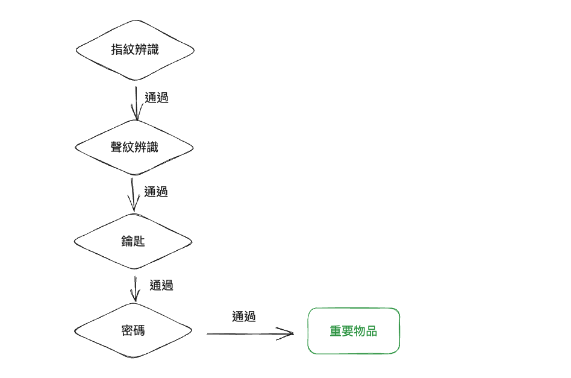
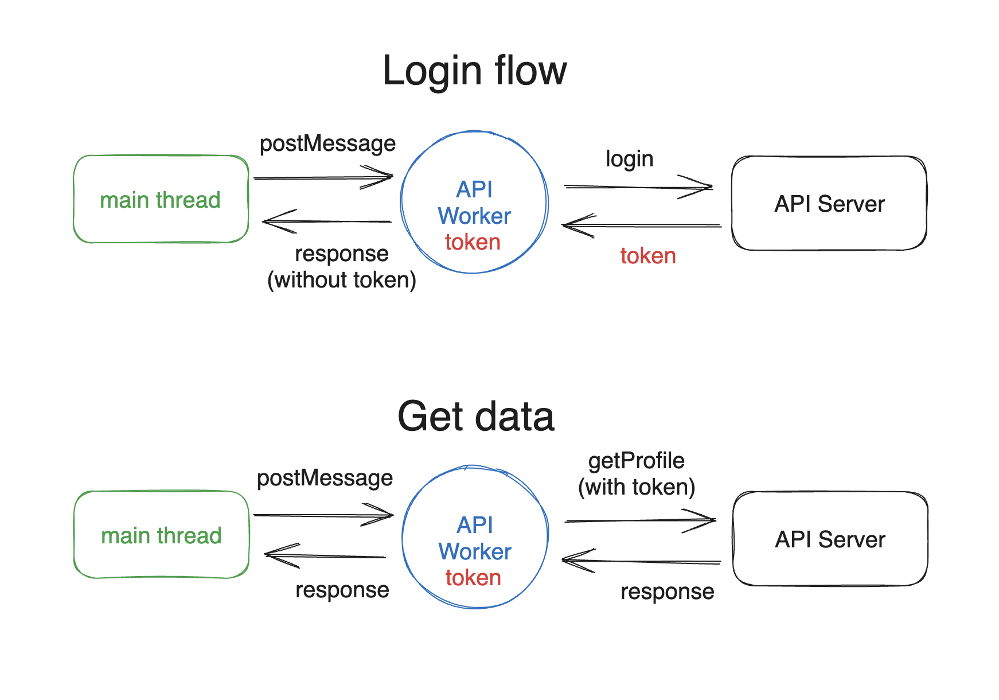
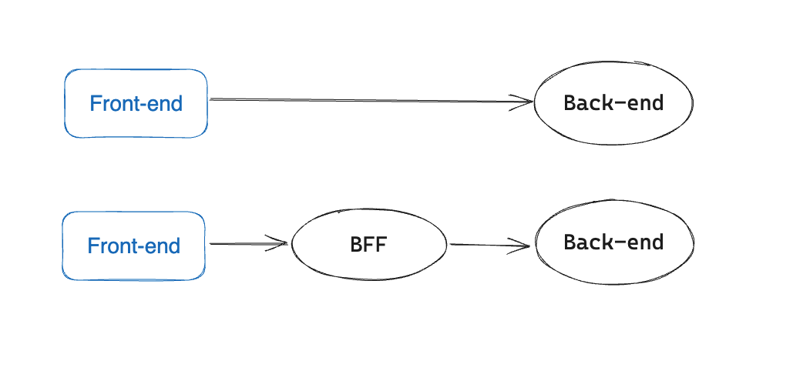

# XSSの第三の防御線：影響範囲の縮小

第一の防御線では、ユーザー入力を処理してエンコードまたはサニタイズし、悪意のあるコンテンツの挿入を防ぎました。第二の防御線はCSPであり、悪意のあるコンテンツが挿入された場合でも、JavaScriptの実行と外部リソースの読み込みを防ぎます。

さて、XSSが必然的に発生すると仮定し、この仮定に基づいて保護戦略を策定する第三の防御線について説明しましょう。

なぜこれを行う必要があるのか疑問に思う人もいるかもしれません。最初の2つの防御線でXSS攻撃を防ぐのに十分ではないでしょうか？なぜXSSが発生すると仮定し、損害を軽減するための戦略を策定する必要があるのでしょうか？これは本末転倒ではありませんか？

例を挙げましょう。「ミッション：インポッシブル」のような映画を見たことがあるでしょう。そこでは盗みのシーンがあります。貴重品が保管されている場所は、常に複数のセキュリティ対策層で設計されています。網膜認識、顔認識、声紋認識、さらには歩行姿勢認識があります。これらのチェックを通過した後でも、金庫のドアを開けるための鍵が必要です。ドアの内側には金庫があり、金庫を開けて最終的にアイテムを入手するには、別のパスワードセットが必要です。



複数のセキュリティ層を持つ理由は単純です。安全性を高めるためです。一部の設計は安全に見えるかもしれませんが、侵害されないことを保証することはできません。したがって、「各層が侵害された場合にのみ損害が発生する」ことを保証するために、追加の保護層が必要であり、それによって攻撃者のコストが増加します。

サイバーセキュリティも同様の原則に従います。バックエンドコードを徹底的にチェックし、すべての部分が適切に検証およびエンコードされていることを確認したとしても、フロントエンドがXSSに対して脆弱になることは決して保証できません。新しい開発者が間違いを犯して安全でないコードを書いたり、サードパーティライブラリに0デイ脆弱性があったり、悪意のあるコードで侵害されたりする可能性があります。これらはすべてリスクです。

そのため、CSPを追加します。これにより、最初の層が侵害された場合でも、2番目の層が攻撃をブロックし、攻撃者が外部リソースを読み込んだりデータを送信したりするのを防ぐことができます。もちろん、2番目の層も絶対確実ではありません。今後の章では、CSPルールをバイパスしてCSPを無効にするテクニックを見ていきます。

XSSから保護するために可能なすべての対策を講じた後、3番目の層は逆方向に考えることです。「XSSが必然的に発生した場合、損害を最小限に抑えるために何ができるか？」これにより、XSSが実際に発生した場合でも、影響がそれほど深刻にならないように、追加のセキュリティ層が追加されます。

まず、すべての企業と製品は、独自のサイバーセキュリティのニーズに基づいて適切な保護対策を選択する必要があることを明確にしておきたいと思います。より専門的に言えば、それはリスク許容度によって異なります。どれだけのリスクを受け入れる意思がありますか？

追加のレイヤーを追加すると、ある程度セキュリティが向上しますが、コストと複雑さも増します。すべての製品がこのような厳格な保護を必要とするわけではありません。たとえば、私のブログウェブサイトの場合、XSSの影響を受けても影響は最小限です。したがって、CSPは必要ありませんし、XSSによって引き起こされる損害を軽減する方法を検討する必要もありません。

一方、暗号通貨取引所の場合、コールドウォレットが盗まれたり侵害されたりすると、損失は甚大になる可能性があります。したがって、通常、一連のリスク管理対策を実施します。たとえば、コールドウォレット自体は高度に暗号化されたストレージデバイスに保存され、その後、耐火性および防水性の金庫に置かれます。この金庫は24時間監視されている部屋に保管され、部屋へのアクセスには指紋認証と鍵などが必要です。

さまざまなレイヤーの利点を知ることで、考えられる解決策をすぐに特定し、そのコストと利点を評価できます。情報が多ければ多いほど、これらの解決策を採用するかどうかをより適切に判断できます。

3番目のレイヤーの保護対策について説明する前に、攻撃者がXSSの脆弱性を見つけたら何ができるかを理解する必要があります。

攻撃者がXSSの脆弱性を発見すると、ユーザーがページを開いたときにそのページでJavaScriptコードを実行できます。したがって、最も一般的なアクションは、認証に使用されるトークンを盗んだり、APIを直接呼び出してパスワードの変更や送金などの危険な操作を実行したりすることです。また、個人情報や取引記録などのデータを盗むこともあります。

XSSの影響を軽減するには、攻撃者ができることを制限する方法を見つける必要があります。

## 戦術1：最も効果的な解決策 - 多要素認証

なぜ攻撃者はXSS後にデータにアクセスしたり操作を実行したりできるのでしょうか？それは、ウェブサイトのバックエンドがリクエストを正当なものと見なしているためです。ユーザー自身からのリクエストであるか、より技術的に言えば、リクエストにユーザーのIDを検証できるトークンが含まれているためです。バックエンドはこのリクエストを信頼し、操作を実行します。

したがって、最も効果的な解決策の1つは、多要素認証を導入することです。トークンに加えて、サーバーはユーザーだけが知っている他の情報を要求し、それによって潜在的な危害を軽減する必要があります。

例えば、オンラインバンキングで送金を行う際、金額と受取人の住所を入力した後、通常、事前に定義されたオンラインバンキングのパスワードを入力したり、SMS認証コードを受信したりするなどの追加の手順があります。これは、セキュリティの追加レイヤーを確保するためです。例えば、銀行のウェブサイトにXSSの脆弱性があり、攻撃者が銀行のページで任意のコードを実行できる場合、追加のセキュリティ手順がなければ、攻撃者は単に `/transfer` APIを呼び出してあなたのお金を送金できてしまう可能性があります。

ただし、追加の手順により、`/transfer` のパラメータの1つがSMS認証コードになります。攻撃者は認証コードを知らないため、APIを正常に呼び出すことができず、したがってあなたのお金を盗むことはできません。

重要な操作には通常、パスワードを変更するために現在のパスワードを入力したり、送金のためにSMS認証コードを受信したりするなど、追加の手順が必要であることがわかります。概念は似ています。

また、XSSに加えて、「誰かがあなたのコンピュータに物理的にアクセスしたとしても、悪意のあることは何もできない」ことも保証します。これはセキュリティの大幅な向上を示しています。通常、セキュリティとユーザーエクスペリエンスは反比例します。セキュリティが高いほど、エクスペリエンスは悪化します。なぜなら、やらなければならないことが増えるからです。これは避けられません。

例えば、最も安全なアプローチは、すべてのAPI呼び出しに対して新しいSMSを要求することです。これは非常に安全ですが、ユーザーエクスペリエンスも非常に悪くなります。したがって、実際には、ほとんどの操作では主要なアクションに対してのみ2番目の検証方法が必要です。取引記録やユーザーデータなどのデータを取得する他のAPIは、追加の保護を必要としません。

## 戦術2：トークン盗難の防止

前述のように、最も一般的な方法は攻撃後にトークンを盗むことです。ここでの「トークン」という用語は、特定のテクノロジーを指すものではありません。セッションID、JWTトークン、またはOAuthトークンである可能性があります。単にIDを検証できるものと考えてください。

トークンが盗まれた場合、ユーザーはそれを使用してブラウザに限定されることなくバックエンドAPIにリクエストを送信できます。

トークンが盗まれたかどうかは重要ですか？と考える人もいるかもしれません。例えば、トークンがHttpOnly Cookieとして保存されているとします。これにより、JavaScriptがCookieにアクセスできないことが保証されます。ただし、攻撃者が `fetch('/api/me')` を使用すると、リクエストにCookieが自動的に含まれるため、依然として個人データを取得できます。

これは正しいですが、違いがないように見えるかもしれませんが、攻撃者は依然として多くのことができます。ただし、いくつかの微妙な違いがあります。

最初の違いは、「ウェブサイトによって制限される」かどうかです。

トークンを持っている場合は、それを返してどこからでもバックエンドにリクエストを送信できます。しかし、持っていない場合は、XSS攻撃ポイントでのみ悪意のあるコードを実行できます。この時点で、ペイロードの長さの制限や同一オリジンポリシーなど、いくつかの制限がある場合があります。

例えば、`a.huli.tw` と `b.huli.tw` という2つのウェブサイトがあり、どちらも認証のために `huli.tw` に保存されているCookieを使用しているとします。

攻撃者が `a.huli.tw` でXSSの脆弱性を正常に見つけたとしますが、ユーザーデータは `b.huli.tw` にあります。この場合、同一オリジンポリシーが `fetch` リクエストをブロックするため、`a` のユーザーデータにアクセスできません。ただし、両方のサービスが同じトークンを使用し、それを `localStorage` に保存している場合、攻撃者はこのトークンを使用して `b` にアクセスし、ユーザーデータを正常に取得できます。

2番目の違いは、「時間制限」があるかどうかです。トークンを持っている場合は、トークンの有効期限が切れていない限り、ユーザーとしてリクエストを送信できます。

しかし、XSSしか使用できない場合は、ユーザーがウェブページを開いているときにのみ攻撃を実行できることを意味します。ユーザーがウェブページまたはブラウザを閉じると、JavaScriptコードを実行できなくなります。

したがって、可能であれば、攻撃者がトークンを取得できないようにするのが最善です。これにより、攻撃者が開始できる攻撃が制限されます。

現在のフロントエンドメカニズムでは、JavaScriptがトークンにアクセスできないようにする唯一の方法は、HttpOnly Cookieを使用することです（ブラウザの脆弱性やトークンを直接返すAPIは除きます）。他の選択肢はありません。

ただし、要件が「特定のJavaScriptのみがトークンにアクセスできるようにする」場合は、別の解決策があります。ただし、この解決策ではトークンが永続的に保存されないことに注意してください。ユーザーがページを更新すると、トークンは失われます。

この解決策は簡単です。トークンをJavaScript変数に保存し、クロージャでラップして外部からアクセスできないようにします。次のようになります。

``` js
const API = (function() {
  let token
  return {
    login(username, password) {
      fetch('/api/login', {
        method: 'POST',
        body: JSON.stringify({ username, password })
      }).then(res => res.json())
      .then(data => token = data.token)
    },

    async getProfile() {
      return fetch('/api/me', {
        headers: {
          'Authorization': 'Bearer ' + token
        }
      })
    }
  }
})()

// APIの使用
API.login()
API.getProfile()
```

このようにして、攻撃者がXSSの脆弱性を見つけたとしても、スコープのために `token` 変数に「直接」アクセスすることはできません。「直接」という言葉をマークしたのは、攻撃者がXSSを取得すると、次のような多くの悪意のあることを実行できるためです。

``` js
window.fetch = function(path, options) {
  console.log(options?.headers?.Authorization)
}
API.getProfile()
```

`window.fetch` の実装を置き換えることにより、関数に渡されたパラメータを傍受し、間接的に `token` にアクセスできます。

したがって、より安全な方法は、XSSがトークンを持つ実行環境に干渉するのを防ぎ、コンテキスト分離を実現することです。ウェブフロントエンドでは、これはWeb Workerを使用して実現できます。Web Workerを使用することにより、次の図に示すように、新しい実行環境を作成して分離できます。



おおよそのコードは次のとおりです。（あくまで概念的な例です）

``` js
// worker.js
let token
async function login({ username, password }) {
  return fetch('/api/login', {
    method: 'POST',
    body: JSON.stringify({ username, password })
  }).then(res => res.json())
  .then(data => {
    // トークンを返さない
    const { token, ...props } = data
    token = data.token
    return props
  })
}

async function getProfile() {
  return fetch('/api/me', {
    headers: {
      'Authorization': 'Bearer ' + token
    }
  })
}

onmessage = async function(e) {
  const { name, params } = e.data
  let response
  if (name === 'login') {
    response = await login(params)
    
  } else if (name === 'getProfile') {
    response = await getProfile()
  }

  postMessage({
    name,
    response
  })
}
```

そして、アプリケーションコードでは、ワーカーを初期化してAPIを呼び出します。

``` js
const apiWorker = new Worker("worker.js");

async function login(params) {
  return new Promise(resolve => {
    apiWorker.postMessage({
      name: 'login',
      params: {
        username,
        password
      }
    })

    apiWorker.onmessage = (e) => {
      const { name, response } = e.data
      if (name === 'login') {
        resolve(e.response)
      }
    }
  })
}

login({
  username: 'test',
  password: 'test'
})
```

実際、アイデアはすべてのAPIネットワークリクエストをワーカーに入れることです。実行環境の分離により、ワーカーにXSSがない限り、メインスレッドはワーカーに干渉できず、そのデータにアクセスできません。これにより、トークンのセキュリティが確保されます。

ただし、この解決策は多くのものを調整する必要があるため、明らかに開発コストが増加します。この解決策の詳細と長所短所に興味がある場合は、日本のフリーマーケットプラットフォームであるメルカリの技術ブログを参照してください：[Web Workerを使用した安全なWebアプリの構築](https://engineering.mercari.com/en/blog/entry/20220930-building-secure-apps-using-web-workers/)

トークンストレージに関しては、JavaScriptでトークンにアクセスする必要があり、永続性が必要ない場合は、このオプションがおそらく最良の解決策です。ID検証を専門とする企業であるAuth0も、トークンストレージについて説明する記事を書いています。参照できます：[Auth0ドキュメント - トークンストレージ](https://auth0.com/docs/secure/security-guidance/data-security/token-storage)

## 戦術3：API呼び出しの制限

前述のように、トークンが盗まれなくても、攻撃者は依然としてXSSを介してAPIを呼び出して応答を取得できます。これは、トークンを保存するためにCookieを使用する場合に当てはまります。

ただし、上記の方法を使用し、Web Workerと変数を使用してトークンを保存する場合、状況は異なります。この方法を使用すると、リクエストにトークンが添付されないため、攻撃者が `fetch()` を使用してAPIを自分で呼び出すのは無意味になり、サーバーの認証はパスしません。

上記の例のように、すべてのAPIリクエストはWeb Workerを通過する必要があり、これはワーカーレベルでフロントエンドプロキシを作成するようなものです。したがって、XSSが `apiWorker` にアクセスできたとしても、`apiWorker` によって実装されたAPIしか呼び出すことができず、他のAPIを呼び出すことはできません。

例えば、バックエンドAPIサーバーが `/uploadFile` 関数を実装しているが、この関数は内部使用専用であるため、ワーカーには実装されていないとします。この場合、攻撃者は何があってもこの関数を使用できず、追加の保護層が追加されます。

## 戦術4：トークンスコープの制限

XSSに対する防御戦略を考案する場合と同様に、XSSが発生した場合の損害を最小限に抑えることが重要です。したがって、最後の手段は、トークンが悪用されると仮定し、損害を軽減するために他に何ができるかを検討することです。

最も直感的なアプローチは、トークンのスコープを制限して、あまり多くのアクションを実行できないようにすることです。もちろん、バックエンドのアクセス制御は必須ですが、フロントエンドでもさらに多くのことができます。

例えば、レストラン予約システムがあり、バックエンドAPIが完全なサービスであり、予約を行うためであろうと内部使用のためであろうと、同じAPIサーバーを使用しているとします。例えば、`/users/me` は自分のデータを取得し、`/internal/users` はすべてのユーザーデータを取得します（権限チェックあり）。

レストラン予約ウェブサイトでXSSが発生し、攻撃対象が権限のある内部従業員であるとします。その場合、攻撃者は `/internal/users` を呼び出してすべてのユーザーデータを取得できます。理想的な解決策は、バックエンドAPIレベルで内部システムとレストラン予約システムを分離することですが、これには時間とコストがかかりすぎる可能性があります。

この場合、Backend For Frontend（BFF）と呼ばれる別の解決策を使用できます。BFFはフロントエンド専用のバックエンドサーバーであり、すべてのフロントエンドリクエストは次の図に示すようにBFFを通過します。



したがって、フロントエンドによって取得されたトークンは、BFFとの通信に使用されるトークンのみであり、BFFの背後にあるバックエンドサーバーのトークンではありません。このようにして、アクセス許可をBFF側で制限し、`/internal` へのすべてのリクエストを直接ブロックし、フロントエンドによって取得されたトークンのアクセス許可を制限して、内部で使用されるAPIが呼び出されないようにすることができます。

## まとめ

「XSSの防止」は必須ですが、それは最初の防御線にすぎません。これだけが行われた場合、防御は0か1のいずれかです。すべてが十分に防御されているか、1つの側面が十分に防御されていない場合は、防御がないかのようになり、システムは簡単に侵害されます。

そのため、より深いセキュリティを提供するために、2番目または3番目の防御線が必要です。1つの側面がユーザー入力をフィルタリングし忘れたとしても、JavaScriptの実行をブロックするCSPがあります。CSPがバイパスされたとしても、モバイル認証コードが必要なため、少なくとも転送機能は実行できません。

防御層が多いほどセキュリティは高くなりますが、コストとシステムの複雑さも高くなります。防御手段を理解することは重要ですが、すべての製品がこれらのすべての手段を必要とするわけではありません。ほとんどのウェブサイトでは、最初の2つの防御線で十分かもしれません。

元々、私はこのトピックについて深く理解していませんでした。たまたまFacebookグループ「Front-End Developers Taiwan」で誰かがこのトピックを取り上げたことで、よりよく理解できるようになり、この一連の記事に含めることにしました。

Auth0の参考資料を提供してくださったHo Hong Yip氏と、複数のリンクを共有してくださった証寓氏に特に感謝します。彼らとの技術的な議論は、この問題についての私の考えをある程度明確にするのに役立ちました（ただし、まだ改善の余地があるかもしれませんので、さらなる議論のためにコメントを残してください）。

参考文献：

1. [Facebookグループ：Front-End Developers Taiwanディスカッションスレッド](https://www.facebook.com/groups/f2e.tw/posts/6432399706797340/)
2. [auth0 - トークンストレージ](https://auth0.com/docs/secure/security-guidance/data-security/token-storage)
3. [Web Workerを使用した安全なWebアプリの構築](https://engineering.mercari.com/en/blog/entry/20220930-building-secure-apps-using-web-workers/)
4. [なぜBFFパターンはSPAにとってより安全と見なされるのですか？](https://stackoverflow.com/questions/73096336/why-is-bff-pattern-deemed-safer-for-spas)
