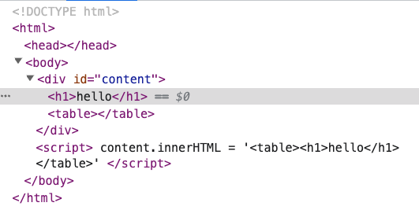
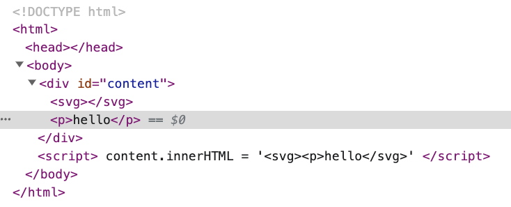
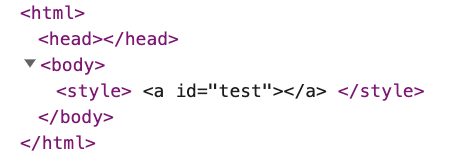
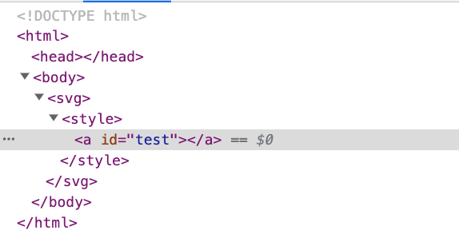
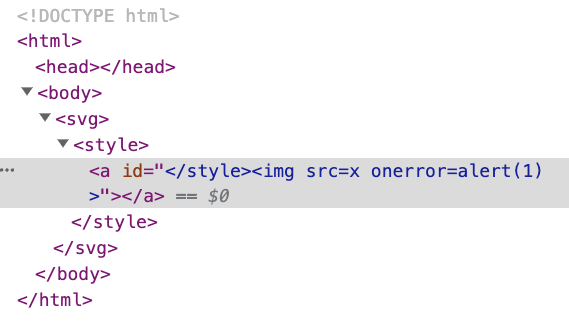
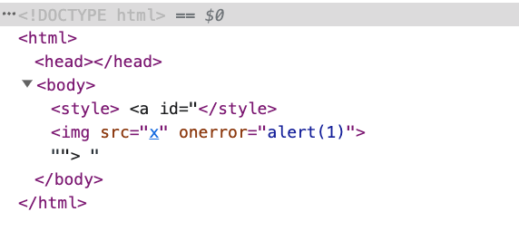

# 防御の回避：Mutation XSS

以前サニタイズについて話した際、自分で実装しようとせず、既存のライブラリを使用するように皆さんに注意を促しました。これは、この分野が深く、多くの落とし穴があるためです。

しかし、これらのライブラリにも問題があるのでしょうか？それは可能であり、実際、以前にも発生しています。サニタイザーに対する一般的な攻撃の1つに、Mutation Based XSS（Mutation XSSまたはmXSSと略される）があります。

mXSSを理解する前に、サニタイザーが通常どのように機能するかを見てみましょう。

## サニタイザーの基本的な流れ

以前の経験に基づくと、サニタイザーへの入力はHTMLを含む文字列であり、出力もHTMLを含む文字列です。使用例は次のとおりです。

```js
const inputHtml = '<h1>hello</h1>'
const safeHtml = sanitizer.sanitize(inputHtml)
document.body.innerHTML = safeHtml
```

では、サニタイザーは内部でどのように機能するのでしょうか？実際、内部の操作は、以前に `BeautifulSoup` を使用して実装したサニタイザーと似ています。

1. `inputHtml` をDOMツリーに解析します。
2. 構成ファイルに基づいて、無効なノードと属性を削除します。
3. DOMツリーを文字列にシリアライズします。
4. 文字列を返します。

このプロセスには問題がないように見えますが、細部に悪魔が潜んでいます。「安全に見えるHTMLが実際には安全ではない」場合はどうでしょうか？待ってください、すでにサニタイズしたのではないでしょうか？どのように安全ではないのでしょうか？まず例を見てみましょう。

## ブラウザの「親切な」機能

ブラウザは、さまざまな状況を処理し、仕様に準拠するために、表示されるHTMLが必ずしも見た目通りにならないことがある、親切なソフトウェアです。例えば、次の例を考えてみましょう。

```html
<!DOCTYPE html>
<html>
<body>
  <div id=content></div>
  <script>
    content.innerHTML = '<table><h1>hello</h1></table>'
  </script>
</body>
</html>
```

`<table>` の中に `<h1>` を置くのは問題ないように見えますが、このウェブページを開くと、次のことに気づくでしょう。



HTMLの構造が変わっています！

次のようになります。

```html
<h1>hello</h1>
<table></table>
```

`<table>` の中にあったはずの `<h1>` が、そこから「飛び出して」います。これは、ブラウザがHTML仕様に基づいて、`<h1>` が `<table>` の中にあってはならないと判断し、親切にそれを取り出したために発生します。ウェブ開発の歴史から見ると、HTMLが無効な場合、ブラウザが常にそれを修正しようとするのは正常です。結局のところ、エラーをスローしたり空白ページを表示したりするよりも良いからです。

この「レンダリング中にブラウザによってHTML文字列が変更される」動作はミューテーションと呼ばれます。そして、この動作を悪用して達成されるXSSは、当然ながらMutation XSSと呼ばれます。

別の例を見てみましょう。

```html
<!DOCTYPE html>
<html>
<body>
  <div id=content></div>
  <script>
    content.innerHTML = '<svg><p>hello</svg>'
  </script>
</body>
</html>
```

レンダリング結果は次のとおりです。



ブラウザは `<p>` が `<svg>` の中にあってはならないと考え、`<svg>` の中の `<p>` を外に移動させ、さらに `</p>` を追加してHTMLを修正します。

このさらに奇妙な例はどうでしょうか？今回は `<p>` ではなく `</p>` です。

```html
<!DOCTYPE html>
<html>
<body>
  <div id=content></div>
  <script>
    content.innerHTML = '<svg></p>hello</svg>'
  </script>
</body>
</html>
```

結果は次のとおりです。

```html
<svg><p></p>hello</svg>
```

ブラウザは自動的に `</p>` を修正し、その前に `<p>` を追加しますが、タグは依然として `<svg>` の中にあります。

（注：現在のChromeブラウザの動作は修正されており、`<svg></svg><p></p>hello` となります。したがって、現在はこの状況を再現できませんが、先に進みましょう。）

ここで興味深いことが起こります。`<svg><p></p>hello</svg>` を再び `innerHTML` に渡すと、結果はどうなるでしょうか？

```html
<!DOCTYPE html>
<html>
<body>
  <div id=content></div>
  <script>
    content.innerHTML = '<svg><p></p>hello</svg>'
    console.log(content.innerHTML)
  </script>
</body>
</html>
```

結果は次のとおりです。

```html
<svg></svg>
<p></p>
hello
```

`<p>` だけでなく、その後の「hello」も飛び出しています。元々 `<svg>` の中にあったものはすべて、今ではその外にあります。

では、この一連の変化は、サニタイザーをバイパスするのにどのように役立つのでしょうか？これは、前述のサニタイザープロセスと組み合わせる必要があります。

`inputHtml` が `<svg></p>hello</svg>` のようになっていると仮定しましょう。サニタイザーの最初のステップは、それをDOMツリーに解析することです。以前の実験に基づくと、次のようになります。

```html
<svg>
  <p></p>
  hello
</svg>
```

フィルタリングするものは何もありません。完全に問題ないように見えます。次のステップは、DOMツリーを文字列にシリアライズすることです。結果は `<svg><p></p>hello</svg>` となります。

次に、フロントエンドチームは `safeHtml` を受け取り、`document.body.innerHTML = safeHtml` を実行しました。結果のHTMLは次のとおりです。

```html
<svg></svg>
<p></p>
hello
```

サニタイザーにとって、`<p>` と「hello」はSVGの中にありますが、最終結果は異なります。それらは外に配置されます。したがって、このミューテーションを介して、任意の要素を `<svg>` から飛び出させることができます。

「それで？何に使うの？」と尋ねるかもしれません。ここが面白いところです。

## HTMLの魔法

`<style>` は魔法のタグです。なぜなら、このタグの中にあるものはすべてテキストとして解釈されるからです。例えば：

```html
<!DOCTYPE html>
<html>
<body>
  <style>
    <a id="test"></a>
  </style>
</body>
</html>
```

は次のように解釈されます。



黒いテキストはテキストノードを表します。

しかし、ここが興味深い部分です。外側に `<svg>` を追加すると、ブラウザがそれを解釈する方法が異なり、すべてが変わります。現在のHTMLソースコードは次のとおりです。

```html
<!DOCTYPE html>
<html>
<body>
  <svg>
    <style>
      <a id="test"></a>
    </style>
  </svg>
</body>
</html>
```

解釈結果は次のとおりです。



`<style>` の中の `<a>` は、単なるプレーンテキストではなく、実際のHTML要素になります。

さらに興味深いのは、次のHTMLを構築できることです。

```html
<svg>
  <style>
    <a id="</style>"></a>
  </style>
</svg>
```

そして、次のように表示されます。



ここでは、`<a>` にidを追加しただけで、内容は `</style>` です。`</style>` が含まれていますが、前の `<style>` を閉じません。代わりに、`id` 属性の一部になります。`` タグも同様です。新しいタグではなく、属性コンテンツの一部です。

ただし、`<svg>` を削除して次のように変更すると：

```html
<style>
  <a id="</style>"></a>
</style>
```

`<a>` は要素ではなく単なるプレーンテキストになったため、属性はありません。したがって、ここでの `</style>` は前の `<style>` を閉じ、次のようになります。



`<a>` のidの中の `` は元々属性コンテンツの一部でしたが、前の `</style>` のために実際のHTML要素として表示されるようになりました。

上記の実験から、`<style>` の外側に `<svg>` があるかどうかは、ブラウザがそれを解釈する方法に影響するため重要であると結論付けられます。

## すべてを組み合わせる

最初に、ブラウザのミューテーションについて言及しました。これにより、「すべての要素を `<svg>` から飛び出させる」ことができます。また、「`<style>` の外側に `<svg>` があるかどうかは重要である」とも述べました。これら2つの概念を組み合わせると、最終的な大ボスであるmXSSになります。

2019年9月19日、DOMPurifyはバージョン2.0.1をリリースしました。これは、ミューテーションを使用してチェックをバイパスするmXSS脆弱性を修正するためでした。当時の問題のある完全なペイロードは次のとおりです。

```html
<svg></p><style><a id="</style>">
```

これをDOMツリーに解析すると、構造は次のようになります。

```html
<svg>
  <p></p>
  <style>
    <a id="</style>"></a>
  </style>
</svg>
```

ブラウザはここでいくつかのことを行います。

1. `</p>` を `<p></p>` に変換します。
2. `<svg>`、`<style>`、`<a>` タグを自動的に閉じます。

次に、DOMPurifyはこのDOMツリーに基づいてチェックします。`<svg>`、`<p>`、`<style>`、`<a>` はすべて許可されたタグであり、idは許可された属性であるため、すべて問題ありません。したがって、シリアライズされた結果を返します。

```html
<svg>
  <p></p>
  <style>
    <a id="</style>"></a>
  </style>
</svg>
```

次に、ユーザーのプログラムはこの文字列を `innerHTML` に渡すと、前述のミューテーションが発生します。すべてのタグが `<svg>` から飛び出し、結果は次のようになります。

```html
<svg></svg>
<p></p>
<style><a id="</style>

"></a>
</style>
```

`<style>` も飛び出したため、`<a>` 要素は存在しなくなり、プレーンテキストになります。その結果、`</style>` が早期に閉じられ、元々属性コンテンツ内に隠されていた `` が実際のHTML要素になります。これにより、最終的にXSSが発生します。

## 問題の修正

この問題を修正するために、DOMPurifyはmXSSの影響を受けないように、コードに[チェック](https://github.com/cure53/DOMPurify/commit/ae16278018e7055c82d6a4ec87132fea3e236e30#diff-ac7cd96b8f4b994868af43ac8aff25573dd7cede1aab33fdcfd438811c7e853d)を追加しました。

同時に、この問題はChromiumにも報告されました。これは、この奇妙なミューテーションを引き起こしたパーサーの動作エラーであったためです。[Issue 1005713: Security: Parser bug can introduce mXSS and HTML sanitizers bypass](https://bugs.chromium.org/p/chromium/issues/detail?id=1005713#c_ts1574850321)。その結果、議論中に開発者はこの動作が仕様に準拠していることを発見しました。つまり、これはHTML仕様のバグだったのです！

したがって、この問題は仕様も修正する必要があることになり、仕様のリポジトリにイシューを開きました：[Unmatched p or br inside foreign context needs a special parser rule #5113](https://github.com/whatwg/html/issues/5113)。

最終的な結果は、仕様に新しいルールが追加され、Chromiumも新しいルールに基づいてこの脆弱性を修正しました。

その後、同様の脆弱性は二度と見つからず、誰もが幸せに暮らしました...そうでしょうか？

いいえ、その後、DOMPurifyにはより複雑なバイパス方法が見つかりましたが、修正後、さらに強力になり、その後は基本的に問題は発生していません。

この問題を発見した人物はMichał Bentkowski氏で、フロントエンドセキュリティに非常に精通したベテランです。彼は大小さまざまな問題を報告しており、HTML解析やさまざまなメカニズムについて深い理解を持っています。彼が報告した古典的な脆弱性のいくつかは後で見ることになります。

この問題についてさらに深く掘り下げたい場合は、彼が以前に書いた記事を参照してください。私のmXSSの知識はすべて彼から学んだものです。

1. [Mutation XSSを使用したDOMPurify 2.0.0バイパスの解説](https://research.securitum.com/dompurify-bypass-using-mxss/)
2. [名前空間の混乱によるMutation XSS – DOMPurify < 2.0.17バイパス](https://research.securitum.com/mutation-xss-via-mathml-mutation-dompurify-2-0-17-bypass/)
3. [Ruby Sanitize < 5.2.1におけるHTMLサニタイズバイパス](https://research.securitum.com/html-sanitization-bypass-in-ruby-sanitize-5-2-1/)

## まとめ

初めてmXSSに触れたとき、ぼんやりとした感覚で、理解したような、していないような感じでした。この記事を書くために、もう一度流れを整理し、自分で試してみたところ、ようやく何が起こっているのか理解できたように感じました。その概念を理解するのは難しくありませんが、すべての詳細を理解するにはもう少し時間が必要です。さらに、発見された問題はすでに修正されているため、現在のブラウザでは再現できないという点も少し面倒です。

しかし、とにかく、mXSSはXSSの中でもより高度なトピックだと思います。HTMLの仕様、ブラウザの解析、サニタイザーの動作方法が関わっています。理解に少し時間をかけるのは正常です。
