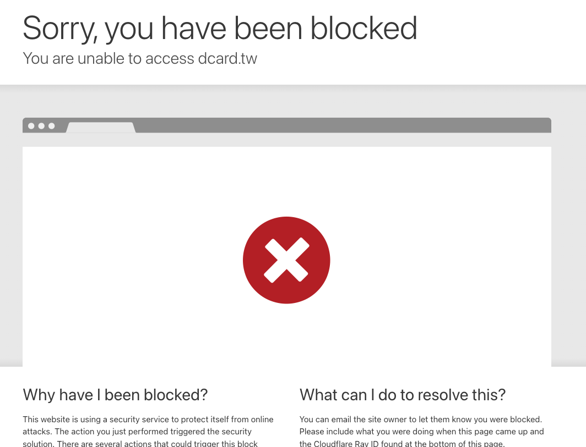

# 攻撃にJavaScriptを直接実行する必要があるなんて誰が言った？

ここまでで、第2章「XSSの防御とバイパス」は正式に終了です。

XSSについては、XSSを実行するさまざまな方法、防御技術、バイパス方法など、多くの時間を費やして議論してきました。ウェブフロントエンドに関しては、ウェブページに対して行える最も深刻なことは、基本的にコードを実行することです。

攻撃の例では、基本的に「HTMLを注入できること」を前提とし、それをXSSに変換する方法を見つけます。以前の例では、この単純なペイロード `` しか使用していませんでしたが、現実世界のシナリオではそれほど簡単ではないかもしれません。

例えば、以前にWAF（Web Application Firewall）と呼ばれる別の防御線があることを簡単に述べました。これはアプリケーション専用のファイアウォールであり、事前に記述されたルールを使用して「悪意があるように見える」ペイロードをブロックします。

例えば、Dcard（台湾のソーシャルメディアプラットフォーム）はCloudflareのWAFを使用しています。このリンクをクリックしてみてください：[https://www.dcard.tw/?a=%3Cscript%3E](https://www.dcard.tw/?a=%3Cscript%3E)

ブロックされたメッセージが表示されます。



最もよく知られているオープンソースのWAFは[ModSecurity](https://github.com/SpiderLabs/ModSecurity)であり、エンジニアが独自のブロックルールを追加したり、他の人が書いたルールを使用したりするためのインフラストラクチャを提供します。

例えば、[OWASP ModSecurity Core Rule Set (CRS)](https://github.com/coreruleset/coreruleset/tree/v4.0/dev)は、ルールのオープンソースコレクションです。小さなセクションを見てみましょう。

出典：[coreruleset/rules/REQUEST-941-APPLICATION-ATTACK-XSS.conf](https://github.com/coreruleset/coreruleset/blob/v4.0/dev/rules/REQUEST-941-APPLICATION-ATTACK-XSS.conf#L105)

```conf
#
# -=[ XSS Filters - Category 1 ]=-
# http://xssplayground.net23.net/xssfilter.html
# script tag based XSS vectors, e.g., <script> alert(1)</script>
#
SecRule REQUEST_COOKIES|!REQUEST_COOKIES:/__utm/|REQUEST_COOKIES_NAMES|REQUEST_FILENAME|REQUEST_HEADERS:User-Agent|REQUEST_HEADERS:Referer|ARGS_NAMES|ARGS|XML:/* "@rx (?i)<script[^>]*>[\s\S]*?" \
    "id:941110,\
    phase:2,\
    block,\
    capture,\
    t:none,t:utf8toUnicode,t:urlDecodeUni,t:htmlEntityDecode,t:jsDecode,t:cssDecode,t:removeNulls,\
    msg:'XSS Filter - Category 1: Script Tag Vector',\
    logdata:'Matched Data: %{TX.0} found within %{MATCHED_VAR_NAME}: %{MATCHED_VAR}',\
    tag:'application-multi',\
    tag:'language-multi',\
    tag:'platform-multi',\
    tag:'attack-xss',\
    tag:'paranoia-level/1',\
    tag:'OWASP_CRS',\
    tag:'capec/1000/152/242',\
    ver:'OWASP_CRS/4.0.0-rc1',\
    severity:'CRITICAL',\
    setvar:'tx.xss_score=+%{tx.critical_anomaly_score}',\
    setvar:'tx.inbound_anomaly_score_pl1=+%{tx.critical_anomaly_score}'"
```

このルールは、正規表現 `<script[^>]*>[\s\S]*?` を使用して `<script` を含むコードを見つけ、それをブロックします。したがって、`<script>alert(1)</script>` は検出されブロックされます。

私たちのお気に入りの `` に対応する他のルールもあります。したがって、実際には、ウェブサイトが攻撃しやすいと思っているのに、WAFによってブロックされる状況によく遭遇します。脆弱性は存在するのに、WAFのために悪用できないため、エラーウィンドウが表示され続けます。

ハッカーとウェブサイトのこの攻防は、サイバーセキュリティの興味深い側面の1つであり、経験と知識が重要である理由を強調しています。WAFに関しては、Twitterで多くのWAFバイパスペイロードが頻繁に表示されます。WAFをバイパスするために、コンテンツは通常意図的に「不快な」ものになっています。例えば、これ（[@bxmbn](https://twitter.com/bxmbn/status/1686415626649145344)に感謝）：

```html
<details/open=/Open/href=/data=; ontoggle="(alert)(document.domain)
```

実際、このペイロードが実行しようとしている内容は `<details open ontoggle=alert(document.domain)>` ですが、それを難読化するために他のキーワードを多数使用しています。多くのWAFは検出に正規表現に依存しているため、ペイロードがWAFによって簡単に認識されない限り、この方法を使用してバイパスできます。

しかし、バイパスできない場合はどうでしょうか？

ウェブサイトがHTMLを注入できたとしても、それが何だというのでしょうか？XSSを実行できるペイロードを書き込めない場合、解決策はないということでしょうか？必ずしもそうではありません。

このように考えるのは、通常、フロントエンドセキュリティの理解が限られており、XSSだけが知られている攻撃であるためです。攻撃を達成するには、コードを直接実行する必要があるとしばしば信じられています。実際には、他の多くの「間接的な攻撃」方法があり、一部の攻撃手法はJavaScriptを実行する必要さえありません。

このシリーズの冒頭で述べたように、フロントエンドセキュリティは広大な宇宙です。XSSの探索にはすでに多くの時間を費やしましたので、新しい銀河に入る時が来ました！少し休憩して、次の記事から正式に第3章「JavaScriptを使用しない攻撃」に入ります。

今後のコンテンツでは、XSS以外の攻撃手法をさらに紹介します。

第3章は、「JavaScriptの実行に間接的に影響を与える」ことから始まり、「JavaScriptがまったく必要ない」まで、そして「JavaScriptだけでなく、CSSも必要ない」まで、段階的に進んでいきます。フロントエンド攻撃の限界を継続的に探求していきます。

第3章に入る前に、聞いたことのある「JavaScriptを直接実行しない攻撃手法」について考えてみてください。今後のコンテンツで取り上げられる可能性が非常に高いです。

最後に、簡単なクイズを出しましょう。ボブは、キャンバスを表す2次元配列を使用してマルチプレイヤーお絵かきゲームを実装しています。プレイヤーは任意のグリッドに好きな色を描くことができ、配列は `onmessage` を使用して更新されます。実装は次のとおりです。

```js
onmessage = function(event){
  const { x, y, color } = event.data
  // 例えば、screen[10][5] = 'red'
  screen[y][x] = color
}
```

このコードの問題点は何でしょうか？次の記事で明らかにします。
