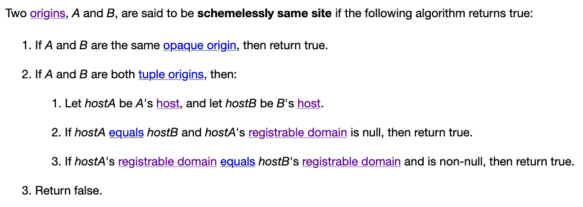
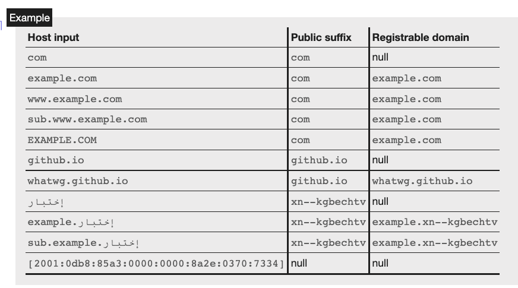
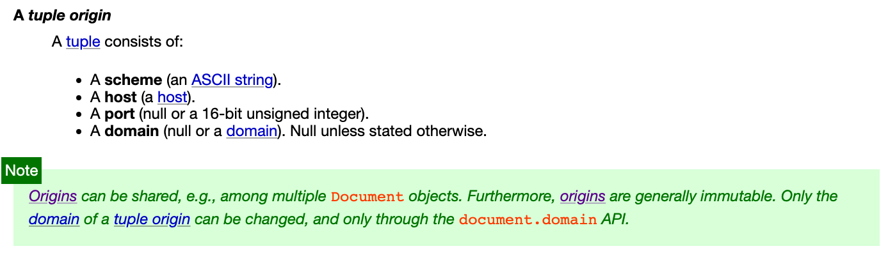
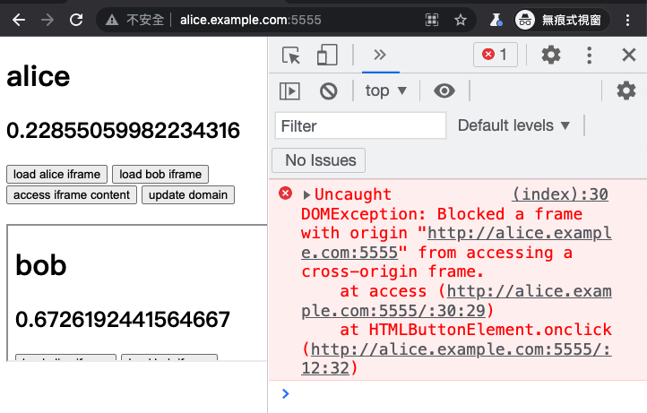
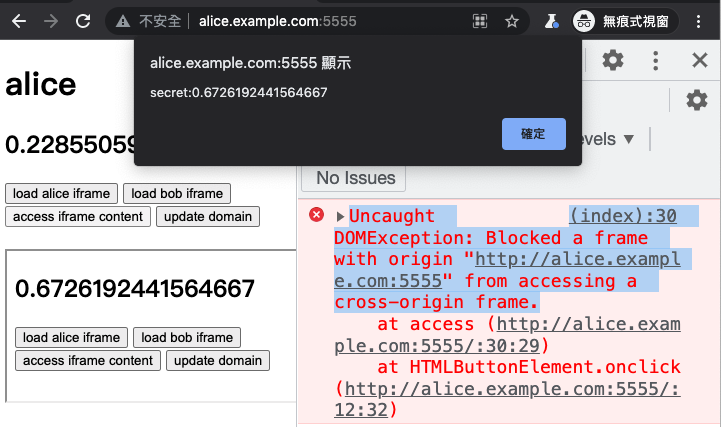
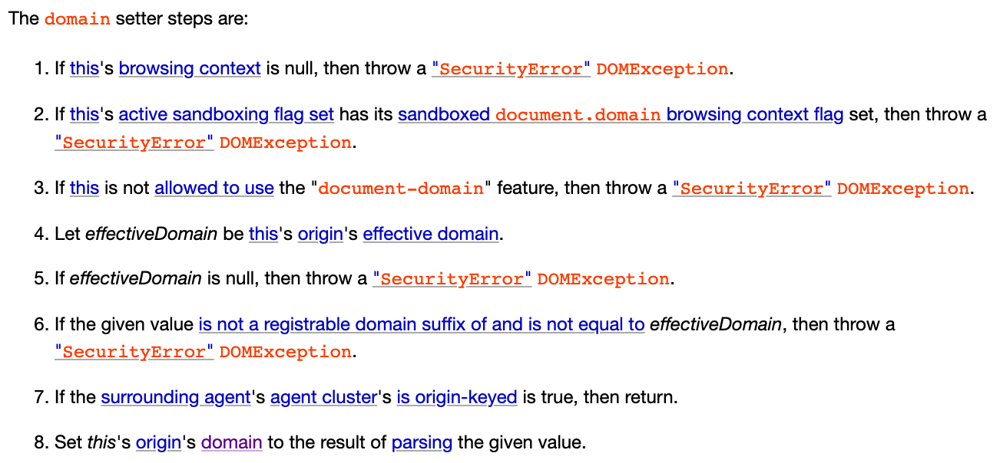

# 最重要：同一オリジンポリシーとサイト

以前の記事で「同一オリジン」について何度か言及しました。これはフロントエンドとサイバーセキュリティの両方の世界で非常に重要な用語です。ブラウザの同一オリジンポリシーは、開発においても攻撃に対処する際にも非常に重要です。

さらに、ホストやサイトなど、しばしば混同される用語がいくつかあります。例えば、XSSのXSはクロスサイトを意味し、CSRFのCSもクロスサイトを意味します。では、オリジンとサイトの違いは何でしょうか？ホストとはどのように違うのでしょうか？

この記事では、これらの概念を完全に理解し、もう混乱しないようにします。

## オリジンとサイトとは正確には何ですか？どのように区別しますか？

まず、単純で多少不正確な説明から始め、後で段階的に修正していきます。

オリジンは、スキーム、ポート、ホストで構成されます。これらを組み合わせると、オリジンが形成されます。

例えば、`https://huli.tw/abc` というURLがある場合、構成要素は次のとおりです。

* スキーム：https
* ポート：443（httpsのデフォルトポート）
* ホスト：huli.tw

したがって、そのオリジンは `https://huli.tw` です。ご覧のように、パスの部分 `/abc` はオリジンに影響を与えず、ポートの部分については、httpsはすでにデフォルトポート443を意味しています。

同一オリジンとは、2つのURLのオリジンが同じである必要があることを意味します。例えば：

1. `https://huli.tw/abc` と `https://huli.tw/hello/yo` は、スキーム、ポート、ホストが同じであり、パスは結果に影響しないため、同一オリジンです。
2. `https://huli.tw` と `http://huli.tw` は、スキームが異なるため、同一オリジンではありません。
3. `http://huli.tw` と `http://huli.tw:8080` は、ポートが異なるため、同一オリジンではありません。
4. `https://huli.tw` と `https://blog.huli.tw` は、ホストが異なるため、同一オリジンではありません。

上記の例から、同一オリジンの条件は非常に厳格であることがわかります。基本的に、パス以外のすべての部分が同じである必要があります。

次に、サイトを見てみましょう。サイトはオリジンと比較して考慮する要素が少なく、スキームとホストのみを見て、ポートは無視します。2つのURLが同一サイトであるという定義はより緩やかで、ホストが完全に同じである必要はなく、サブドメインである限り同一サイトと見なされます。

例えば：

1. `https://huli.tw/abc` と `https://huli.tw/hello/yo` は、スキームとホストが同じであるため、同一サイトです。
2. `https://huli.tw` と `http://huli.tw` は、スキームが異なるため、同一サイトではありません。
3. `http://huli.tw` と `http://huli.tw:8080` は、ポートが結果に影響しないため、同一サイトです。
4. `https://huli.tw` と `https://blog.huli.tw` は、huli.twとblog.huli.twが同じ親ドメインhuli.twの下にあるため、同一サイトです。
5. `https://abc.huli.tw` と `https://blog.huli.tw` も、abc.huli.twとblog.huli.twが同じ親ドメインhuli.twの下にあるため、同一サイトです。

同一オリジンと比較すると、同一サイトは明らかに緩やかです。ポートが異なっていても同一サイトと見なされ、ホストが同じ親ドメインに属している限り、一般的に同一サイトと見なされます。

ただし、冒頭で述べたように、上記の定義はほとんどの場合正しいですが、正確ではありません。例外を確認するために、仕様を直接参照しましょう。

## 同一オリジンの詳細な検討

HTML仕様の[7.5 Origin](https://html.spec.whatwg.org/multipage/origin.html#origin)セクションで、完全な定義を確認できます。仕様のオリジンに関する説明を見てみましょう。

> オリジンは、ウェブのセキュリティモデルの基本的な通貨です。ウェブプラットフォームでオリジンを共有する2つのアクターは、互いに信頼し、同じ権限を持つと見なされます。オリジンが異なるアクターは、互いに対して潜在的に敵対的であると見なされ、さまざまな程度で互いから隔離されます。

ここでの内容は非常に明確です。冒頭で、2つのウェブサイトが同じオリジンを持つ場合、これらの2つのウェブサイトは互いを信頼していることを意味すると説明しています。ただし、オリジンが異なる場合、それらは隔離され、制限されます。

次に、仕様ではオリジンを2つのタイプに分けています：「不透明なオリジン」と「タプルオリジン」。

不透明なオリジンは、特殊な場合にのみ現れるオリジンと考えることができます。例えば、ローカルマシンでウェブページを開くと、URLは「file:///...」になります。この場合、ウェブページ内でリクエストを送信すると、オリジンは不透明なオリジン、つまり「null」になります。

タプルオリジンはより一般的であり、私たちがより関心を持っているオリジンのタイプです。ドキュメントによると、タプルオリジンには以下が含まれます。

1. スキーム（ASCII文字列）。
2. ホスト（ホスト）。
3. ポート（nullまたは16ビット符号なし整数）。
4. ドメイン（nullまたはドメイン）。特に明記されていない限りnull。

ホストとドメインの両方があるのはなぜか疑問に思うかもしれません。これについては後で説明します。

さらに、仕様では、2つのオリジンAとBが同一オリジンであるかどうかを判断するアルゴリズムも説明しています。

1. AとBが同じ不透明なオリジンである場合、trueを返します。
2. AとBが両方ともタプルオリジンであり、スキーム、ホスト、ポートが同一である場合、trueを返します。
3. falseを返します。

2つのオリジンが同じ不透明なオリジンであるか、スキーム、ホスト、ポートがすべて同一である場合にのみ、同一オリジンと見なされます。同一オリジンに加えて、仕様では「同一オリジンドメイン」と呼ばれる別の用語も出てきます。これについては後で説明します。

前述のように、同一オリジンは厳格な制限です。例えば、URL「https://huli.tw/api」の場合、オリジンはパスを考慮しないため、そのオリジンは「https://huli.tw」になります。これは、同一オリジンのウェブサイトは、同一オリジンと見なされるために、URLが「https://huli.tw/*」で始まる必要があることを意味します。

「https://huli.tw」と「https://blog.huli.tw」はドメインとサブドメインの関係ですが、ホストが異なるため、同一オリジンではありません。

これを覚えておいてください。これは重要です。

仕様におけるオリジンと同一オリジンの詳細な検討は、冒頭で述べた「不正確な記述」と比較して、不透明なオリジン、同一オリジンドメイン、およびオリジンタプルに含まれる未使用の「ドメイン」が追加されています。

最後に、もう一つだけ言及させてください。「https://huli.tw/api」のオリジンは「https://huli.tw」であると言うとき、より正確な表現は「「https://huli.tw/api」のオリジンのシリアライズされた形式は「https://huli.tw」である」ということです。

これは、オリジンが実際にはタプルであり、`(https, huli.tw, null, null)` のように表現され、文字列にシリアライズされると `https://huli.tw` になるためです。タプルとしての表現と比較して、シリアライズされた形式の方が読みやすいと思います。したがって、両者が同様の情報を提供できる場合、後者のアプローチを好みます。

## 同一サイトの詳細な検討

サイトの定義も同じ仕様にあり、次のように述べられています。

> サイトは、不透明なオリジンまたはスキームとホストです。

したがって、サイトは不透明なオリジンまたはスキームとホストのいずれかになります。

仕様では、同一サイトに加えて、「スキームなし同一サイト」と呼ばれる別の用語があることがわかります。これら2つの違いも明確です。同一サイトはスキームを考慮しますが、スキームなし同一サイトはスキームを考慮しません。

したがって、2つのオリジンAとBが同一サイトであるかどうかを判断する場合、アルゴリズムは次のようになります。

> 2つのオリジンAとBは、以下の両方のステートメントが真である場合、同一サイトであると言われます。
> 
> * AとBはスキームなし同一サイトである
> * AとBは両方とも不透明なオリジンであるか、または同じスキームを持つタプルオリジンである

AとBが同一サイトである場合、両方とも不透明なオリジンであるか、同じスキームを持ち、スキームなし同一サイトである必要があります。

したがって、同一サイトはスキームを考慮します。httpとhttpsの2つのURLは決して同一サイトではありませんが、スキームなし同一サイトである可能性があります。

ここには少し歴史があります。同一サイトが初めて導入されたとき、スキームは考慮されていませんでした。後になってスキームが考慮されるようになりました。

2016年のRFC: Same-site Cookiesでは、同一サイトの判断にスキームが含まれていないことがわかります。したがって、当時は `https://huli.tw` と `http://huli.tw` は同一サイトと見なされていました。

2019年6月になって初めて、スキームを考慮に入れるかどうかについての議論が始まりました。詳細については、以下を参照してください：https://github.com/w3c/webappsec-fetch-metadata/issues/34

当時、同一サイトの仕様は今日見ているHTML仕様ではなく、別のURL仕様で定義されていました。そのため、議論はそちらに移されました：[Consider introducing a "same-site" concept that includes scheme. #448](https://github.com/whatwg/url/issues/448)。次に、2019年9月に、このPRがありました：[Tighten 'same site' checks to include 'scheme'. #449](https://github.com/whatwg/url/pull/449)。これにより、仕様にスキームが正式に含まれました。同一サイトは「スキームを考慮する」と定義され、スキームを考慮しない場合は、スキームなし同一サイトという新しい用語が導入されました。

その後2ヶ月後、関連する仕様はURLからHTMLに移されました。これらの2つのPRを参照してください：[Let HTML handle the "same site" definition #457](https://github.com/whatwg/url/pull/457)、[Define (schemelessly) same site for origins #5076](https://github.com/whatwg/html/pull/5076)

仕様は仕様ですが、ブラウザがすぐに変更に追いつくとは限りません。では、ブラウザの現在の実装はどうなっているのでしょうか？

2020年11月、Chromeは記事を公開しました：[Schemeful Same-Site](https://web.dev/schemeful-samesite/)。当時、異なるスキームも同一サイトと見なされていたことが示されていますが、[Chrome platform status: Feature: Schemeful same-site](https://chromestatus.com/feature/5096179480133632)から、Chromeはバージョン89以降スキームも考慮するようになったことがわかります。

Firefoxについては、この問題のステータスから：[[meta] Enable cookie sameSite schemeful](https://bugzilla.mozilla.org/show_bug.cgi?id=1651119)、この動作はまだデフォルトではないようです。特に設定されていない場合、異なるスキームも同一サイトと見なされます。

歴史を振り返った後、最も重要なスキームなし同一サイトがどのように判断されるかを見てみましょう。



不透明な部分については今は触れません。上記の重要な点は明らかに新しい用語です：「登録可能なドメイン」。2つのホストが同一サイトであるかどうかを判断する際に、これを使用して比較します。

この登録可能なドメインの定義は、別のURL仕様にあります：[URLの仕様](https://url.spec.whatwg.org/#host-registrable-domain)。

> ホストの登録可能なドメインは、最も具体的な公開サフィックスと、その直前のドメインラベル（存在する場合）によって形成されるドメインです。

ここで、新しい用語「公開サフィックス」が言及されています。

理解を深めるために例から始めましょう。`blog.huli.tw` の登録可能なドメインは `huli.tw` であり、`huli.tw` の登録可能なドメインも `huli.tw` です。

ただし、`bob.github.io` の登録可能なドメインは `github.io` ではなく、`bob.github.io` です。

なぜでしょうか？以下に簡単に説明します。

「登録可能なドメイン」と「公開サフィックス」という概念がなければ、同一サイトの定義は冒頭で述べた通り、`huli.tw` と `blog.huli.tw` は同一サイトであり、問題ありません。

しかし、もしそうであれば、`bob.github.io` と `alice.github.io` も同一サイトになります。

あれ、それは問題ないのでは？

問題です。`github.io` はGitHub Pagesのサービスであり、各GitHubユーザーは独自のサブドメインを使用できます。しかし、GitHubは `bob.github.io` が `alice.github.io` に干渉することを望んでいません。なぜなら、それらは実際には完全に独立した2つのウェブサイトであり、私が両方を所有している `huli.tw` と `blog.huli.tw` とは異なります。

したがって、公開サフィックスの概念が登場しました。これは手動で管理されているリストであり、「同じウェブサイトと見なされたくないドメインのリスト」が含まれています。いくつか例を挙げます。

1. github.io
2. com.tw
3. s3.amazonaws.com
4. azurestaticapps.net
5. herokuapp.com

したがって、ブラウザはこのリストを参照した後、`bob.github.io` と `alice.github.io` は実際には関連がなく、同一サイトではないと判断します。これにはeTLD（effective Top-Level-Domain）という専門用語もあります。詳細については、以下を参照してください：[2つのドメインが同じ所有者であるかどうかを判断する方法](https://blog.kalan.dev/2021-11-09-url-and-samesite/)

前述のように、`github.io` は公開サフィックスリストに含まれているため、`bob.github.io` の登録可能なドメインは `bob.github.io` であり、`alice.github.io` の登録可能なドメインは `alice.github.io` です。

したがって、最初に述べた同一サイトの定義は正しくありません。2つのホストが同じ親ドメインに属しているように見えても、公開サフィックスの存在により、必ずしも同一サイトであるとは限りません。

`bob.github.io` と `alice.github.io` は、登録可能なドメインが異なるため、同一サイトではありません。

`blog.huli.tw`、`huli.tw`、`test.huli.tw` の3つのホストはすべて同一サイトです。登録可能なドメインはすべて `huli.tw` であるためです。

仕様には、より明確な表が添付されています。よく見てください。



最後に、同一サイトについてまとめます。

1. 同一サイトとスキームなし同一サイトがあり、前者の方がよく使われます。
2. 2つのホストが同一サイトであるかどうかを比較する場合、登録可能なドメインを見る必要があります。
3. 登録可能なドメインを決定するには、公開サフィックスリストを参照する必要があります。
4. 2つのホストは、同じ親ドメインに属しているように見えても、公開サフィックスの存在により、必ずしも同一サイトであるとは限りません。
5. 同一サイトはポートを考慮しないため、`http://blog.huli.tw:8888` と `http://huli.tw` は同一サイトです。

## 同一オリジンと同一サイト

同一オリジンは以下によって決定されます。

1. スキーム
2. ポート
3. ホスト

そして、同一サイトは以下です。

1. スキーム
2. ホスト（登録可能なドメイン）

2つのウェブサイトが同一オリジンである場合、同一オリジンの判断基準がより厳格であるため、必ず同一サイトになります。

両者の主な違いは次のとおりです。

1. 同一オリジンはポートを考慮しますが、同一サイトは考慮しません。
2. 同一オリジンはホストを考慮しますが、同一サイトは登録可能なドメインを考慮します。

以下にいくつかの例を示します。

| A                   | B              | 同一オリジン | 同一サイト | 説明 |
|---------------------|----------------|-------------|-----------|------|
| http://huli.tw:8080 | http://huli.tw | X           | O         | 同一サイトはポートを考慮しない |
| https://blog.huli.tw                    |   https://huli.tw             |     X        |   O        | 登録可能なドメインが同じ |
| https://alice.github.io                    |   https://github.io             |     X        |   X        | github.ioは公開サフィックスリストにある |
| https://a.alice.github.io                    |   https://b.alice.github.io             |     X        |   O        | 登録可能なドメインが同じ |
| https://bob.github.io/page1                    |   https://bob.github.io/about             |     O        |   O        | パスは考慮されない |

## 不思議なdocument.domain

オリジンの仕様を見ていると、何に使うのか不明な不思議な「ドメイン」属性の言及がありました。オリジンの仕様には「同一オリジンドメイン」というものまであり、これに直接言及している緑色の注記があります。



オリジンはドメイン属性以外は不変であり、この属性は `document.domain` を使用して変更できると記載されています。仕様には、このことについて説明しているセクション[7.5.2 Relaxing the same-origin restriction](https://html.spec.whatwg.org/multipage/origin.html#relaxing-the-same-origin-restriction)があります。一部を抜粋します。

> (document.domain) は、サブドメインを削除する値に設定でき、オリジンのドメインを変更して、同じドメインの他のサブドメイン上のページ（同じことを行う場合）が互いにアクセスできるようにします。これにより、ドメインの異なるホスト上のページが互いのDOMに同期的にアクセスできるようになります。

理解を深めるために、デモをしてみましょう。

ローカルマシンの `/etc/hosts` ファイルを次のように変更しました。

```
127.0.0.1   alice.example.com
127.0.0.1   bob.example.com
```

これで、これらの両方のURLがローカルマシンに接続されます。次に、簡単なHTTPサーバーを起動し、localhost:5555で実行される基本的なHTMLページを作成しました。

```html
<!DOCTYPE html>
<html>
  <head>
    <meta charset="utf-8" />
    <meta name="viewport" content ="width=device-width, initial-scale=1" />
  </head>
  <body>
    <h1></h1>
    <h2></h2>
    <button onclick="load('alice')">load alice iframe</button>
    <button onclick="load('bob')">load bob iframe</button>
    <button onclick="access()">access iframe content</button>
    <button onclick="update()">update domain</button>
    <br>
    <br>
  </body>
  <script>
    const name = document.domain.replace('.example.com', '')
    document.querySelector('h1').innerText = name
    document.querySelector('h2').innerText = Math.random()

    function load(name) {
      const iframe = document.createElement('iframe')
      iframe.src = 'http://' + name + '.example.com:5555'
      document.body.appendChild(iframe)
    }

    function access() {
      const win = document.querySelector('iframe').contentWindow
      alert('secret:' + win.document.querySelector('h2').innerText)    
    }

    function update() {
      document.domain = 'example.com'
    }
  </script>
</html>
```

ページには3つの機能があります。

1. iframeの読み込み
2. iframeのDOMからデータを読み取る
3. document.domainの変更

まず、`http://alice.example.com:5555` を開き、次に `http://bob.example.com:5555` からiframeを読み込みます。次に、Aliceページの「access iframe content」をクリックします。



コンソールに次のエラーメッセージが表示されます。

> Uncaught DOMException: Blocked a frame with origin "http://alice.example.com:5555" from accessing a cross-origin frame.

これは、AliceとBobは同一サイトですが、同一オリジンではないためです。iframeがDOMのコンテンツにアクセスするには、同一オリジンである必要があります。

次に、AliceとBobの両方がそれぞれのページの「update domain」をクリックし、その後再び「access iframe content」をクリックします。



今回は、Bobのページからデータを正常に取得し、`http://alice.example.com:5555` と `http://bob.example.com:5555` をクロスオリジンから同一オリジンに変更しました。これが忍術、同一サイトを同一オリジンにする術です！

このテクニックは、任意の2つのウェブページで使用できるわけではありません。基本的に、同一サイトのウェブサイトのみが使用でき、設定中にも多くのチェックが行われます。



github.ioを例にとると、`alice.github.io` が `document.domain = 'github.io'` を実行すると、コンソールにエラーが表示されます。

> Uncaught DOMException: Failed to set the 'domain' property on 'Document': 'github.io' is a top-level domain.

`document.domain` を変更すると、なぜ2つのページが同一オリジンになるのでしょうか？厳密に言えば、同一オリジンではなく、同一オリジンドメインです。[document](https://html.spec.whatwg.org/multipage/browsers.html#concept-bcc-content-document)関連の仕様には、一部のチェックは同一オリジンではなく、同一オリジンドメインに基づいていると記載されています。

では、2つのオリジンが同一オリジンドメインであるかどうかをどのように判断するのでしょうか？仕様を見てみましょう。

> 1. AとBが同じ不透明なオリジンである場合、trueを返します。
> 2. AとBが両方ともタプルオリジンである場合、以下のサブステップを実行します。
>   * AとBのスキームが同一であり、ドメインが同一でnullでない場合、trueを返します。
>   * それ以外の場合、AとBが同一オリジンであり、ドメインが同一でnullである場合、trueを返します。
> 3. falseを返します。

AとBのスキームが同じで、ドメイン属性も同じでnullでない場合、trueを返します。それ以外の場合、AとBが同一オリジンでドメインが同一でnullであるかどうかをチェックし、成立した場合にのみtrueを返します。それ以外の場合はfalseを返します。

いくつか興味深い点があります。

1. 両方のウェブページにドメインが設定されていないか、両方に同じドメインが設定されている場合にのみ、trueが返される可能性があります（これは重要です）。
2. ドメインが設定されている場合、同一オリジンドメインのチェックではポートは考慮されません。

`document.domain` は、オリジンタプルのドメイン属性を変更するために使用されます。

上記の例では、両方のウェブページ `http://alice.example.com:5555` と `http://bob.example.com:5555` がドメインを `example.com` に変更したため、同一オリジンドメインです。

次に、3つの興味深いシナリオを見てみましょう。

### シナリオ1：一方的な変更

`https://alice.example.com` が `document.domain = 'example.com'` を実行し、次に `https://example.com` をiframeに埋め込んだ場合、Aliceのページにはドメイン属性がありますが、`example.com` のページにはドメイン属性がないため、それらは依然として同一オリジンドメインではありません。

`example.com` も `document.domain = 'example.com'` を実行する必要があります。そうすれば、それらは同一オリジンドメインになります。

### ケース2：消えるポート

`http://alice.example.com:1234` と `http://alice.example.com:4567` はポートが異なるためクロスオリジンと見なされます。ただし、両方のページが `document.domain = 'alice.example.com'` を実行した場合、それらは同一オリジンドメインになり、ポートが考慮されないため、互いのDOMにアクセスできます。

### ケース3：私は以前の私ではない

`http://alice.example.com` が自身をiframeに埋め込んだと仮定すると、iframeと元のページは明らかに同一オリジンであり、互いのDOMにアクセスできます。

しかし、ページで `document.domain = 'alice.example.com'` を実行すると、そのページにはドメイン属性が設定されますが、iframe内のページにはドメイン属性が設定されていません。したがって、それらは異なるオリジンドメインになります。

## document.domainのフェードアウトと退場

この方法を使用して同一オリジンの制限を緩和することはかなり以前から行われており、早期の動作との互換性のために削除されていません。初期の頃、多くのウェブページがこの方法を使用して同一サイトだがクロスオリジンのページにアクセスしていたと推測されます。

しかし、これは明らかにリスクを伴います。例えば、サブドメインにXSSの脆弱性がある場合、この方法を利用して影響範囲を拡大し、2016年に[@fin1te](https://twitter.com/fin1te)氏が書いた記事[An XSS on Facebook via PNGs & Wonky Content Types](https://whitton.io/articles/xss-on-facebook-via-png-content-types/)では、このテクニックを使用してサブドメインから `www.facebook.com` に正常に迂回してXSSを実行し、脆弱性の影響力を高めました。

セキュリティ上の懸念から、Chromeは2022年1月11日にブログで記事を公開しました：[Chrome will disable modifying document.domain to relax the same-origin policy](https://developer.chrome.com/blog/immutable-document-domain/)。記事では、Chromeバージョン101以降、`document.domain` の変更のサポートを停止すると説明しています。

元の動作は `postMessage` または `Channel Messaging API` に置き換えることができますが、元のDOMを直接操作するほど便利ではないため、コードをもう少し記述する必要があります。

ウェブページがこの `document.domain` の変更機能を引き続き使用したい場合は、応答ヘッダーに `Origin-Agent-Cluster: ?0` を含める必要があります。

記事には、この変更に関する関連する議論スレッドも含まれています：[Deprecating document.domain setter. #564](https://github.com/w3ctag/design-reviews/issues/564)

## まとめ

同一オリジンポリシーとは、セキュリティ上の問題を回避するために、同一オリジンのウェブページのみが互いのデータにアクセスできることを保証するブラウザの保護メカニズムです。したがって、2つのウェブページが同一オリジンであるかどうかを判断するために、オリジンの定義を理解する必要があります。

オリジンとサイトという2つの重要な基本概念を紹介した後、CSRF（クロスサイトリクエストフォージェリ）とCORS（クロスオリジンリソース共有）という2つの関連用語に徐々に遭遇します。

参考文献：

1. [HTML仕様](https://html.spec.whatwg.org/multipage/origin.html#origin)
2. [URL仕様](https://url.spec.whatwg.org/#host-registrable-domain)
3. [2つのドメインが同じ所有者であるかどうかを判断する方法](https://blog.kalan.dev/2021-11-09-url-and-samesite/)
4. [Chrome will disable modifying document.domain to relax the same-origin policy](https://developer.chrome.com/blog/immutable-document-domain/)
