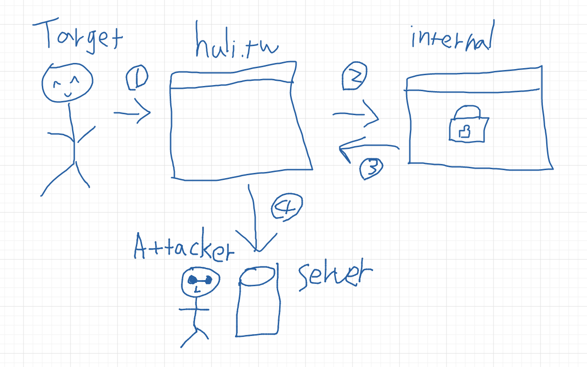
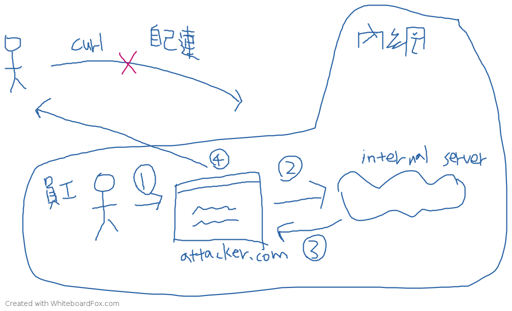

# クロスオリジンリソース共有 CORS 基本紹介

同一オリジンポリシーについて話した際、ブラウザは基本的にあるウェブサイトが異なるオリジンの別のウェブサイトからデータにアクセスすることを防ぐことに言及しました。しかし、開発中、フロントエンドとバックエンドが同じオリジンにない場合があります。例えば、一方が `huli.tw` にあり、もう一方が `api.huli.tw` にある場合、フロントエンドはどのようにバックエンドからデータにアクセスできるのでしょうか？

ここでCORSが登場します。CORSはCross-Origin Resource Sharingの略で、ウェブサイトが異なるオリジン間でデータを交換できるメカニズムです。このメカニズムは開発でよく使用されますが、正しく構成されていない場合、セキュリティ脆弱性になる可能性があります。

CORSが存在する理由を理解するには、ブラウザがクロスオリジンAPI呼び出しをブロックする理由から始める必要があります。

## なぜクロスオリジンAPI呼び出しができないのですか？

より正確に言えば、質問は「なぜ `XMLHttpRequest` や `fetch`（AJAXとも呼ばれる）を使用して異なるオリジンからリソースを取得できないのですか？」であるべきです。

このより正確な定義が必要なのは、「クロスオリジンリソース」を取得することは実際には非常に一般的だからです。例えば、`` は、画像をフェッチするためのクロスオリジンリクエストです。同様に、`<script src="https://another-domain.com/script.js" />` も、JavaScriptファイルをフェッチして実行するためのクロスオリジンリクエストです。

しかし、これら2つのシナリオで問題に遭遇したことはありますか？ほとんどの場合ないでしょう。問題なく使用することに慣れているからです。

では、`XMLHttpRequest` や `fetch` を使用したAJAXの場合、なぜ異なるのでしょうか？なぜこの場合、クロスオリジンリクエストがブロックされるのでしょうか？（この説明は完全に正確ではなく、後で詳しく説明します。）

この問題を理解するには、逆方向に考える必要があります。クロスオリジンリクエストがブロックされることはすでにわかっているので、それには理由があるはずです。しかし、その理由は何でしょうか？これは、背理法を使用するのと似ています。何かを証明するために、クロスオリジンリクエストをブロックすることは間違っている、または無意味であると仮定し、矛盾を見つけることで、クロスオリジンリクエストがブロックされる理由を証明できます。

したがって、次の質問を考えてみましょう。

> クロスオリジンリクエストがブロックされなかったら、どうなるでしょうか？

その場合、CORSの解決策を探す必要なく、自由にAPI呼び出しを行うことができます！問題はないように聞こえます。結局のところ、`` や `<script>` タグはクロスオリジンリソースにアクセスできますが、なぜAJAXはできないのでしょうか？

クロスオリジンAJAXリクエストがブロックされなかった場合、私のウェブページ（例えば `https://huli.tw/index.html`）でAJAXを使用して `https://google.com` からデータをフェッチできますよね？

一見すると無害に見えます。GoogleのホームページのHTMLをフェッチするだけです。大したことではありません。

しかし、もし私があなたの会社に「内部」の公開ウェブサイトがあり、そのURLが `http://internal.good-company.com` であることを偶然知っていたらどうでしょうか？このウェブサイトは外部からアクセスできません。会社の従業員のコンピューターだけがアクセスできます。さて、私のウェブページでその内部ウェブサイトからデータをフェッチするAJAXコードを記述したらどうなるでしょうか？ウェブサイトのコンテンツを取得して私のサーバーに送り返すことができるでしょうか？

これは、攻撃者が機密情報にアクセスできる可能性があるため、セキュリティ上の懸念を引き起こします。



1. ターゲットが悪意のあるウェブサイトを開きます。
2. 悪意のあるウェブサイトはAJAXを使用して内部の機密ウェブサイトからデータをフェッチします。
3. データが取得されます。
4. 攻撃者のサーバーに送り返されます。

「しかし、このテクニックを使用するには、攻撃者は内部ウェブサイトのURLを知る必要があります。それは難しくないですか？」と尋ねるかもしれません。

それが難しすぎると思うなら、別の例を挙げましょう。

開発中、多くの人が自分のコンピューターでサーバーを実行しており、URLは `http://localhost:3000` や `http://localhost:5566` などです。これは現代のフロントエンド開発では非常に一般的です。

ブラウザがクロスオリジンAPIをブロックしなかった場合、次のようなコードを記述できます。

```js
// リクエストを送信して応答を取得します
function sendRequest(url, callback) {
  const request = new XMLHttpRequest();
  request.open('GET', url, true);
  request.onload = function() {
    callback(this.response);
  }
  request.send();
}

// すべてのポートに対してデータを取得しようとします。取得できたら私のサーバーに送り返します。
for (let port = 80; port < 10000; port++) {
  sendRequest('http://localhost:' + port, data => {
    // データを私のサーバーに送り返します
  })
}
```

この場合、localhostでサーバーを実行している限り、そのコンテンツにアクセスして、開発中の内容を知ることができます。仕事の現場では、これは会社の機密情報である可能性があり、または攻撃者はこれらのウェブサイトを分析して脆弱性を見つけ、同様の方法で侵入する可能性があります。

さらに、上記の2つの例が実行不可能だと思う場合、ここで別の仮定をしましょう。クロスオリジンリクエストがブロックされないと仮定することに加えて、「クロスオリジンリクエストには自動的にCookieが含まれる」と仮定しましょう。

したがって、`https://www.facebook.com/messages/t` にリクエストを送信すると、チャットメッセージが表示されます。`https://mail.google.com/mail/u/0/` にリクエストを送信すると、プライベートメールが表示されます。

ここまで来れば、クロスオリジンAJAXリクエストがブロックされる理由を理解できるはずです。一言で言えば「セキュリティ」です。

ブラウザでウェブサイトの完全なコンテンツを取得したい場合（完全に読み取ることができる場合）、基本的に `XMLHttpRequest` または `fetch` を介してのみ行うことができます。これらのクロスオリジンAJAXリクエストが制限されていない場合、ユーザーのブラウザを使用して、「任意のウェブサイト」のコンテンツを取得することが可能になり、機密情報を含む可能性のあるさまざまなウェブサイトが含まれます。

したがって、セキュリティのためにブラウザがクロスオリジンAJAXリクエストをブロックするのは非常に合理的です。

この時点で、「なぜ画像、CSS、またはスクリプトはブロックされないのですか？」という疑問を持つ人もいるかもしれません。

これらは「ウェブサイトのリソースの一部」のようなものです。例えば、他の人の画像を使用したい場合は `` を使用してインポートし、CSSを使用したい場合は `<link href="...">` を使用します。これらのタグで取得できるリソースは制限されています。さらに、これらの取得したリソースを**プログラムで読み取ることはできません**。これは重要です。

画像を読み込んだ後、それは本当に単なる画像です。ブラウザだけが画像の内容を知っており、私はそれを知りませんし、プログラムで読み取ることもできません。プログラムで読み取ることができないため、取得した結果を他の場所に送信することもできず、データ漏洩のリスクは低くなります。

クロスオリジンリクエストを正しく理解するには、まず「なぜブラウザがそれらをブロックするのか」を理解し、次に「どのようにブロックされるのか」を正しく認識することが重要です。以下に、回答を試すための小テストを用意しました。

## 抜き打ちテスト

小明はAPIを連携させるプロジェクトに取り組んでいます。社内には記事を削除するためのAPIがあり、記事IDをPOSTで `application/x-www-form-urlencoded` のコンテンツタイプで送信するだけで削除できます。

例えば、`https://lidemy.com/deletePost` に `id=13` を付けてPOSTリクエストを送信すると、IDが13の記事が削除されます（バックエンドは権限チェックを行いません）。

会社のフロントエンドとバックエンドのドメインは異なり、バックエンドにはCORSヘッダーが追加されていません。したがって、小明はフロントエンドがAJAXを使用して記事を削除するAPI呼び出しを行うと、同一オリジンポリシーによって制限され、リクエストが送信されないと考えています。

実際に呼び出した後、コンソールには「request has been blocked by CORS policy: No 'Access-Control-Allow-Origin' header is present on the requested resource」というエラーが表示されました。

したがって、小明はフロントエンドがAJAXを使用してこのAPIを呼び出し、記事を削除することはできないと考えています。彼は記事が削除されないと思っています。

小明の主張は正しいですか？間違っている場合、間違っている箇所を指摘してください。

## クロスオリジンAJAXはどのようにブロックされるのか？

この問題は、次の概念をテストしています。

> クロスオリジンリクエストがブラウザによってブロックされる場合、それは実際には何を意味するのでしょうか？どのようにブロックされるのでしょうか？

この質問があるのは、「クロスオリジンリクエストをブロックするのはリクエストである」と考える人が多いためです。したがって、小明の例では、リクエストはブラウザによってブロックされ、サーバーに到達できないため、データは削除されません。

しかし、この主張は少し考えれば問題があることがわかります。エラーメッセージを見れば明らかです。

> request has been blocked by CORS policy: No 'Access-Control-Allow-Origin' header is present on the requested resource

ブラウザがヘッダーが存在しないと言っているのは、何を意味するのでしょうか？それは、すでにリクエストを送信し、応答を受け取ったことを意味します。その応答に `Access-Control-Allow-Origin` ヘッダーが存在しないことがわかっただけです。

したがって、ブラウザがブロックするのはリクエストではなく、応答です。これは非常に重要な点です。

あなたのリクエストはすでにサーバーに到達しており、サーバーも応答を返しています。ブラウザが結果をあなたに提供しないだけです。

したがって、この問題の答えは、小明がこのCORSエラーを見たにもかかわらず、リクエストは実際にはサーバーに送信されているため、記事は削除されています。小明が応答を受け取ることができないだけです。はい、信じてください、記事は削除されています、本当に。

これは仕様に完全に準拠していますが、多くの人が理解していません。中には、これをセキュリティ問題だと誤解してChromiumに報告した人もいます。

1. [Issue 1122756: Possible to send XHR POST request from different origins - SOP bypass](https://bugs.chromium.org/p/chromium/issues/detail?id=1122756&q=sop%20bypass&can=1)
2. [Issue 1151540: Same-Origin-Policy is bypassed by an XMLHttpRequest Executed within an eval()](https://bugs.chromium.org/p/chromium/issues/detail?id=1151540)

しかし、結果は常に同じで、「修正しない」とマークされています。これは仕様に準拠した実装であるためです。

最後に、多くの人が理解していない概念をもう一つ補足します。

以前、CORSをブロックするのはセキュリティのためであり、ブロックしないと攻撃者がAJAXを使用して内部の非公開データを取得し、会社の機密情報が漏洩する可能性があると述べました。そしてここで、「ブラウザ以外ではCORSの問題はない」とも述べました。これは、CORSがブロックされていても、同じウェブサイトに自分でリクエストを送信してデータを取得できることを意味するのではないでしょうか？これはセキュリティ問題ではないのでしょうか？

例えば、curlやPostman、または他のツールを使用すれば、CORSの制限を回避できるのではないでしょうか？

このように考える人は、これら2つのアプローチの根本的な違いを見落としています。

今日のターゲットが会社の内部ネットワークであり、URLが `http://internal.good-company.com` であると仮定しましょう。

私のコンピューターからcurlを使用して直接リクエストを送信した場合、エラー画面が表示されるだけです。なぜなら、まず私はその会社の内部ネットワークにいないため権限がなく、次に内部ネットワークだけが解決できるため、そのドメインに接続できない可能性さえあります。

一方、CORSは「内部ネットワークのユーザーがアクセスし、データを取得するためにリクエストを送信するウェブサイトを作成した」というものです。これら2つのアプローチの最大の違いは「誰がウェブサイトにアクセスしているか」です。前者の場合は私自身ですが、後者の場合は他の人（そして内部ネットワークにアクセスできる人）を介しています。



図に示すように、上半分は攻撃者自身がそのURLに接続しようとしていますが、ターゲットが内部ネットワーク内にあるため接続できません。したがって、同一オリジンポリシーがなくても、攻撃者は目的の情報を取得できません。

一方、下半分は、攻撃者が悪意のあるウェブサイトを作成し、ユーザーにそのウェブサイトを訪問させる方法を見つけた場合です。例えば、ポイント1で、ユーザーがウェブサイトを訪問すると、フローはポイント2に進み、ターゲット（内部サーバー）にAJAXリクエストが送信されます。ポイント3でデータを取得した後、ポイント4で攻撃者に戻されます。

同一オリジンポリシーの保護により、JavaScriptはfetchの結果にアクセスできないため、応答が何であるかを知ることができません。したがって、ポイント4は実行されません。

## CORSの設定方法

原理を説明し、ブラウザがクロスオリジンリクエストをブロックする理由を理解したところで、CORSの設定方法について話しましょう。設定方法は簡単です。ブラウザはセキュリティ目的で保護を行っているため、ブラウザに「このリクエストの応答にxxxがアクセスすることを許可します」と伝えるだけで十分です。内容は次のとおりです。

```
Access-Control-Allow-Origin: *
```

この応答ヘッダーは、「任意のオリジンがこの応答を読み取ることを許可する」ことを意味します。単一のオリジンに制限したい場合は、次のように記述します。

```
Access-Control-Allow-Origin: https://blog.huli.tw
```

では、複数許可したい場合はどうでしょうか？現在、それは不可能です。このヘッダーの値は複数のオリジンをサポートしていません。サーバー側で処理し、リクエストに応じて異なるヘッダーを動的に出力するしかありません。

さらに、クロスオリジンリクエストは「単純リクエスト」と「非単純リクエスト」の2種類に分けられます。どちらのタイプであっても、バックエンドは `Access-Control-Allow-Origin` ヘッダーを提供する必要があります。最大の違いは、非単純リクエストは実際の要求を送信する前に、プリフライト要求を送信することです。プリフライトが通過しない場合、実際の要求は送信されません。

プリフライトリクエストの場合、通過するためには `Access-Control-Allow-Origin` ヘッダーも提供する必要があります。

さらに、一部の製品では、現在のウェブサイトのバージョンを示すために、`X-App-Version` のようなカスタムヘッダーを送信したい場合があります。この場合、バックエンドはプリフライトを通過するために `Access-Control-Allow-Headers` ヘッダーを追加する必要があります。

```js
fetch('http://localhost:3000/form', {
      method: 'POST',
      headers: {
        'X-App-Version': "v0.1",
        'Content-Type': 'application/json'
      },
      body: JSON.stringify(data)
    }).then(res => res.json())
      .then(res => console.log(res))
```

まとめると、プリフライトは検証メカニズムであり、バックエンドがフロントエンドからの期待されるリクエストを知っていることを確認し、その後にのみブラウザがそれを許可します。以前述べた「CORSはリクエストではなく応答をブロックする」という説明は、単純なリクエストにのみ適用されます。プリフライトを伴う非単純なリクエストの場合、実際に送信したいリクエストは確かにブロックされます。

では、なぜプリフライトリクエストが必要なのでしょうか？これには2つの観点から考えることができます。

1. 互換性
2. セキュリティ

最初の点に関して、リクエストが非単純リクエストである場合、HTMLのform要素を使用して同じリクエストを作成することは絶対に不可能であることに気づいたかもしれません。逆もまた然りです。例えば、`<form>` のenctypeは `application/json` をサポートしていないため、このコンテンツタイプは非単純リクエストです。一方、enctypeは `multipart/form` をサポートしているため、このコンテンツタイプは単純リクエストに属します。

XMLHttpRequestが登場する以前から存在していた古いウェブサイトの場合、バックエンドはブラウザが `DELETE` や `PATCH` メソッドのリクエストを送信することを想定していませんでした。また、ブラウザが `application/json` のコンテンツタイプのリクエストを送信することも想定していませんでした。なぜなら、その時代には `<form>` や `` などの要素がリクエストを送信できる唯一の方法だったからです。

当時は `fetch` はなく、`XMLHttpRequest` さえもありませんでした。したがって、これらのバックエンドが予期しないリクエストを受信しないようにするために、まずプリフライトリクエストが送信されます。古いバックエンドはこのプリフライトを処理しないため、通過せず、ブラウザは実際のリクエストを送信しません。

これが私が言う互換性です。プリフライトリクエストを通過させることで、初期のウェブサイトが予期しないリクエストを受信しないように保護されます。

2番目のセキュリティに関しては、例を挙げましょう。削除APIは通常 `DELETE` HTTPメソッドを使用します。プリフライトリクエストが最初にブロックしない場合、ブラウザはこのリクエストを実際に送信し、バックエンドで予期しない動作を引き起こす可能性があります（ブラウザがこれを送信することを想定していなかったため）。

そのため、プリフライトリクエストが必要であり、バックエンドがこれから送信されるリクエストが正当であることを確認してから、実際のリクエストを送信します。

最後に、Cookieについて言及します。クロスオリジンリクエストはデフォルトではCookieを含みません。Cookieを含める必要がある場合、3つの条件を満たす必要があります。

1. バックエンドの応答ヘッダーに `Access-Control-Allow-Credentials: true` が含まれている必要があります。
2. バックエンドの応答ヘッダーの `Access-Control-Allow-Origin` は `*` であってはならず、明示的に指定する必要があります。
3. フロントエンドのfetchに `credentials: 'include'` を追加する必要があります。

「単純リクエスト」の場合、3番目の条件のみを満たす必要があります。「非単純リクエスト」の場合、3つの条件すべてを満たす必要があります。

## まとめ

この記事では、CORSの基本的な原理と「なぜブラウザがクロスオリジンリクエストをブロックするのか」を学びました。結局のところ、それはすべてセキュリティのためであり、この制限が存在する理由です。さらに、CORSヘッダーの設定方法も学びました。あるセクションでは、`Access-Control-Allow-Origin` が複数の値をサポートしていないため、多くのオリジンがこのヘッダーを必要とする場合、動的に設定する必要があることについて説明しました。正しく設定されていない場合はどうなるでしょうか？それはセキュリティ脆弱性であり、これについては次の記事で説明します。
