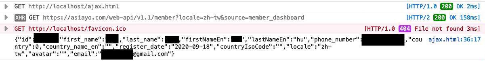
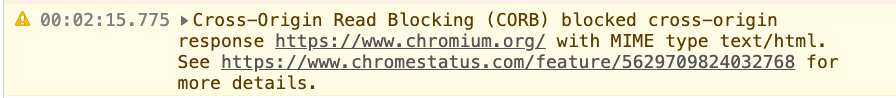

# クロスオリジンセキュリティの問題

一部のウェブサイトでは、リバースプロキシやその他のメカニズムを使用してフロントエンドとバックエンドを同一オリジン下に配置していますが、これは少数派のようです。ほとんどの場合、フロントエンドがクロスオリジンのバックエンドAPIのデータにアクセスできるようにするためには、クロスオリジンアクセスを許可することがほぼ不可避です。

しかし、CORSヘッダーの設定は見た目ほど単純ではなく、実装は必ずしもそうではありません。設定に問題があると、攻撃者がアクセスすべきでないリソースにアクセスできてしまう可能性があります。

さらに、CORSの設定ミスに加えて、``や`<script>`のようなクロスオリジンアクセスにもセキュリティ上の懸念があり、これについてはこの記事で説明します。

## CORSの誤設定

前述の通り、クロスオリジンの非シンプルリクエストがCookieを含めたい場合、`Access-Control-Allow-Origin`は`*`であってはならず、単一のオリジンを指定する必要があります。そうしないと、ブラウザは許可しません。

しかし現実には、オリジンは1つだけではありません。`buy.example.com`、`social.example.org`、`note.example.com.tw`など、多数のオリジンが存在し、すべて`api.example.com`にアクセスする必要がある場合があります。この場合、レスポンスヘッダーのオリジンをハードコーディングすることはできず、動的に調整する必要があります。

まず最悪の書き方から説明します。このようになります。

```js
app.use((req, res, next) => {
  res.headers['Access-Control-Allow-Credentials'] = 'true'
  res.headers['Access-Control-Allow-Origin'] = req.headers['Origin']
})
```

便宜上、リクエストヘッダーのオリジンを直接挿入しています。こうすると、実際にはどのオリジンでもCORSチェックを通過できてしまいます。

これにはどんな問題があるのでしょうか？

問題は大きいです。

今日、私が`https://fake-example.com`というURLのウェブサイトを作成し、ユーザーにこのウェブサイトをクリックさせようとするとします。ウェブサイト内には次のようなスクリプトが書かれています。

```js
// APIを使用してユーザーデータを取得し、Cookieを添付します
fetch('https://api.example.com/me', {
  credentials: 'include'
})
  .then(res => res.text())
  .then(res => {
    // ユーザーデータの取得に成功しました。自分のサーバーに送信できます
    console.log(res)

    // ユーザーを実際のウェブサイトにリダイレクトします
    window.location = 'https://example.com'
  })
```

サーバーが正しいヘッダーを返し、`https://fake-example.com`を有効なオリジンとして認識するため、CORSチェックが通過し、このウェブサイトでも`http://api.example.com/me`のデータを取得できます。

したがって、この攻撃は、ユーザーがウェブサイトをクリックし、`example.com`にログインしている状態であれば成功します。影響範囲はウェブサイトのAPIによって異なりますが、最低でもユーザーデータを取得でき、深刻な場合はユーザーのトークンを取得できる可能性があります（そのようなAPIが存在する場合）。

この攻撃には注意すべき点がいくつかあります。

1. これはXSSではありません。`example.com`でコードを実行しているのではなく、自分のウェブサイト`http://fake-example.com`で実行しているためです。
2. CSRFに少し似ていますが、ウェブサイトは通常GETのAPIにCSRFトークンによる保護を追加しないため、通過できます。
3. SameSite Cookieが設定されている場合、Cookieが送信されないため、攻撃は失敗します。

（CSRFとSameSiteについては後で説明します）

したがって、この攻撃が成立するにはいくつかの前提条件があります。

1. CORSヘッダーが許可すべきでないオリジンに与えられている。
2. ウェブサイトが認証にCookieを使用しており、SameSiteが設定されていない。
3. ユーザーが能動的にウェブサイトをクリックし、ログイン状態である。

最初の点に関して、上記のようにリクエストヘッダーのオリジンを直接使用するような書き方をする人はいないでしょう。より可能性の高い方法は次のとおりです。

```js
app.use((req, res, next) => {
  res.headers['Access-Control-Allow-Credentials'] = 'true'
  const origin = req.headers['Origin']

  // example.comで終わるかどうかを検出します
  if (/example\.com$/.test(origin)) {
    res.headers['Access-Control-Allow-Origin'] = origin
  }
})
```

これにより、以下のオリジンが通過できます。

1. example.com
2. buy.example.com
3. social.example.com

しかし、この書き方には問題があります。なぜなら、これも通過できてしまうからです。

1. fakeexample.com

このような脆弱性は、誤ったCORS設定によって引き起こされるため、CORS misconfigurationと呼ばれます。

解決策は、正規表現で判断するのではなく、事前に許可リストを準備し、リストに存在するオリジンのみを通過させ、それ以外はすべて失敗させることです。これにより、判断上の脆弱性がないことを保証でき、CookieにSameSite属性を追加することも忘れないでください。

```js
const allowOrigins = [
  'https://example.com',
  'https://buy.example.com',
  'https://social.example.com'
]
app.use((req, res, next) => {
  res.headers['Access-Control-Allow-Credentials'] = 'true'
  const origin = req.headers['Origin']

  if (allowOrigins.includes(origin)) {
    res.headers['Access-Control-Allow-Origin'] = origin
  }
})
```

### 実際の事例

最初の事例は、Jordan Milne氏が2016年に発見したJetBrains IDEの脆弱性です。

JetBrains IDEを使用すると、ローカルサーバーが自動的に起動します。ファイルを開いて「ブラウザで表示」をクリックすると、`http://localhost:63342/<projectname>/<your_file.html>`というURLが開きます。これは、そのローカルサーバーが処理しています。

そして、このサーバーは適切に記述されておらず、その`Access-Control-Allow-Origin`ヘッダーは、私が前に挙げた誤った例とまったく同じで、リクエストのオリジンヘッダーを直接使用していました。そのため、任意のウェブサイトがレスポンスを読み取ることができました。

さらに、著者はパストラバーサルの脆弱性を発見し、このAPIを介して任意のファイルを読み取ることができました。したがって、これらを組み合わせると、攻撃者は自分のウェブサイト上で、JetBrainsのローカルサーバーAPIを介してシステム上のファイルを読み取ることができるということになります。

著者が提供した簡単なPoCは次のとおりです。

```html
<script>
var xhr = new XMLHttpRequest();
xhr.open("GET", "http://localhost:63342/testing/something.txt", true);
xhr.onload = function() {alert(xhr.responseText)};
xhr.send();
</script>
```

その後、著者は他の問題を発見し、RCE（リモートコード実行）を成功させました。しかし、それらの部分は、この記事で議論しているCORS設定の問題とは無関係なので、詳細は省略します。興味のある方は、元の記事を参照してください：[JetBrains IDE Remote Code Execution and Local File Disclosure](http://blog.saynotolinux.com/blog/2016/08/15/jetbrains-ide-remote-code-execution-and-local-file-disclosure-vulnerability-analysis/)。

2番目の事例は、James Kettle氏が2017年のAppSec EUカンファレンスで共有したビットコイン取引所の脆弱性に関するものです。

彼は、ある取引所のAPIの1つに同様の脆弱性があり、任意のオリジンがレスポンスをクロスオリジンで読み取れることを見つけました。そのAPIの1つは`/api/requestApiKey`で、ユーザーのapiKeyを取得できました。このapiKeyを使用すると、ユーザーのビットコインを自分のアカウントに送金できました。

詳細については、以下を参照してください：[AppSec EU 2017 Exploiting CORS Misconfigurations For Bitcoins And Bounties by James Kettle](https://www.youtube.com/watch?v=wgkj4ZgxI4c&ab_channel=OWASP)

最後に、私が2020年に報告したAsiayoの脆弱性を見てみましょう。根本原因はまったく同じで、他のウェブサイトで名前、電話番号、メールアドレスなどのユーザーデータを取得できました。



元のレポート：[Asiayo 網站 CORS misconfiguration 漏洞](https://zeroday.hitcon.org/vulnerability/ZD-2020-00829)

## その他の様々なCOXXシリーズヘッダー

最もよく知られているCORS以外にも、COで始まるヘッダーがいくつかあります。

1. CORB（Cross-Origin Read Blocking）
2. CORP（Cross-Origin Resource Policy）
3. COEP（Cross-Origin-Embedder-Policy）
4. COOP（Cross-Origin-Opener-Policy）

これらのヘッダーのCOもCross-originの略であり、したがってクロスオリジンのデータアクセスに関連しています。次に、これらのヘッダーが実際に何をしているのかを見ていきましょう。

## 重大なセキュリティ脆弱性：MeltdownとSpectre

2018年1月3日、GoogleのProject Zeroは「[Reading privileged memory with a side-channel](https://googleprojectzero.blogspot.com/2018/01/reading-privileged-memory-with-side.html)」という記事を公開し、CPUデータキャッシュを標的とする3つの攻撃について説明しました。

* Variant 1: bounds check bypass (CVE-2017-5753)
* Variant 2: branch target injection (CVE-2017-5715)
* Variant 3: rogue data cache load (CVE-2017-5754)

最初の2つはSpectreと呼ばれ、3つ目はMeltdownと呼ばれています。ご記憶の方もいらっしゃると思いますが、当時はCPUに問題があり、簡単に修正できる問題ではなかったため、大きな出来事でした。

そして、この脆弱性の公表は、ブラウザの動作メカニズムに大きな影響を与えた（少なくともブラウザの進化の過程を加速させた）と思います。特にSpectreはブラウザを攻撃するために使用でき、これはもちろんこのシリーズの主題であるクロスオリジンリソースアクセスにも影響します。

したがって、Spectreが何をしているのかを少し理解することは非常に必要だと思います。この攻撃を完全に理解するには、多くの背景知識が必要ですが、これはこの記事の主な焦点ではないため、以下ではSpectreを非常に簡略化されたモデルで説明します。完全に理解したい場合は、上記のリンクを参照してください。

## 超簡略版Spectre攻撃の説明

繰り返しになりますが、これは理解を容易にするために簡略化されたバージョンであり、元の攻撃とはある程度の相違がありますが、中心的な概念は類似しているはずです。

次のようなコード（C言語）があるとします。

```c
uint8_t arr1[16] = {1, 2, 3}; 
uint8_t arr2[256]; 
unsigned int array1_size = 16;

void run(size_t x) {
  if(x < array1_size) {
    uint8_t y = array2[array1[x]];
  }
}

size_t x = 1;
run(x);
```

`uint8_t`型の2つの配列を宣言したので、各配列の要素のサイズは1バイト（8ビット）になります。arr1の長さは16、arr2の長さは256です。

次に、`run`という関数があり、数値xを受け取り、xが`array1_size`より小さいかどうかを判断します。小さい場合は、まず`array1[x]`の値を取得し、それをインデックスとして`array2`にアクセスし、取得した値をyに代入します。

上記の例では、`run(1)`の場合、次のように実行されます。

```C
uint8_t y = array2[array1[1]];
```

そして、`array1[1] `の値は2なので、`y = array2[2]`となります。

このコードは問題なさそうですし、配列長のチェックも行っているので、xがarray1_sizeより小さい場合にのみ処理が続行されるため、配列の範囲外（Out-of-Bounds、略してOOB）になることはありません。

しかし、これはあなたが見ているだけのものです。

CPUがコードを実行する際、分岐予測というメカニズムがあります。コード実行の効率を向上させるため、CPUはif条件に遭遇すると、結果がtrueかfalseかを予測します。予測結果がtrueの場合、if内のコードを先に実行し、結果を事前に計算します。

先ほど述べたのはすべて「予測」であり、実際のif条件の実行が完了した後、予測結果と一致すれば万々歳ですが、一致しない場合は、先ほど計算した結果を破棄します。このメカニズムを投機的実行（speculatively execute）と呼びます。

CPUは結果を破棄するため、CPUが何らかの手がかりを残さない限り、投機的実行の結果を取得することはできません。

そして、これがSpectre攻撃が成立する主な理由です。なぜなら、実際に手がかりが残されているからです。

実行効率をさらに向上させるため、投機的実行中にいくつかの結果がCPUキャッシュに格納され、その後のデータ読み取り効率が向上します。

ABCの3つのものがあり、1つはCPUキャッシュにあり、他の2つはないとします。どれがキャッシュにあるかをどうやって知ることができるでしょうか？

答えは、これら3つのものへのアクセス時間を観察することです！CPUキャッシュ内のものは読み取りが速いため、Aの読み取りに10ms、Bの読み取りに10ms、Cの読み取りに1msしかかからなかった場合、CがCPUキャッシュにあることがわかります。他のチャネルを通じて情報を取得するこの種の攻撃方法をサイドチャネル攻撃と呼び、他のチャネルから情報を取得します。

上記の方法では時間に基づいて判断するため、タイミング攻撃とも呼ばれます。

上記の知識を組み合わせた後、もう一度前のコードを見てみましょう。

```c
uint8_t arr1[16] = {1, 2, 3}; 
uint8_t arr2[256]; 
unsigned int array1_size = 16;

void run(size_t x) {
  if(x < array1_size) {
    uint8_t y = array2[array1[x]];
  }
}

size_t x = 1;
run(x);
```

今、私が`run(10)`を何度も実行すると、CPUは分岐予測のメカニズムに基づいて、次回もif条件を満たし、内部のコードを実行すると合理的に推測します。このとき、突然xを100に設定し、`run(100)`を実行します。

このとき、if内のコードが投機的に実行されます。

```C
uint8_t y = array2[array1[100]];
```

array1[100]の値が38だとすると、`y = array2[38]`となり、`array2[38]`がCPUキャッシュに格納され、その後の読み込み効率が向上します。

次に、実際にif条件を実行すると条件が満たされないことが判明するため、先ほど取得した結果を破棄し、何も起こらずに関数の実行が完了します。

そして、先ほど説明したタイミング攻撃に基づいて、array2の各要素を読み取り、時間を計算すると、`array2[38]`の読み取り時間が最も短いことがわかります。

この時点で、私たちは一つのことを知りました。

> array1[100]の内容は38です

「それで何ができるの？」と尋ねるかもしれませんが、できることはたくさんあります。array1の長さは16しかないので、読み取った値はarray1自体の要素ではなく、アクセスすべきでない他のメモリ部分のものです。そして、このパターンを繰り返しコピーすることで、他の場所のデータをすべて読み出すことができます。

この攻撃がブラウザ上で実行されると、同じプロセス内の他のデータを読み取ることができます。つまり、同じプロセス内に他のウェブサイトのコンテンツがあれば、そのウェブサイトのコンテンツを読み取ることができるのです！

これがSpectre攻撃であり、CPUのいくつかのメカニズムを利用してサイドチャネル攻撃を行い、本来読み取るべきでないデータを読み取り、セキュリティ問題を引き起こします。

したがって、平易な言葉で説明すると、「ブラウザ上で、Spectreは他のウェブサイトのデータを読み取る機会を与える可能性がある」ということです。

Spectreに関する説明はここまでです。上記では多くの詳細を簡略化しており、それらの詳細を私自身も完全に理解しているわけではありません。詳細については、以下を参照してください。

1. [Reading privileged memory with a side-channel](https://googleprojectzero.blogspot.com/2018/01/reading-privileged-memory-with-side.html)
2. [解读 Meltdown & Spectre CPU 漏洞](https://zhuanlan.zhihu.com/p/32757727)
3. [浅谈处理器级Spectre Attack及Poc分析](https://yangrz.github.io/blog/2018/01/09/cpu/)
4. [[閒聊] Spectre & Meltdown漏洞概論(翻譯)](https://www.ptt.cc/bbs/NetSecurity/M.1515146856.A.750.html)
5. [Spectre漏洞示例代码注释](https://github.com/hdzitao/spectre-attack-zh)
6. [Google update: Meltdown/Spectre](https://developers.google.com/web/updates/2018/02/meltdown-spectre)
7. [Mitigating Spectre with Site Isolation in Chrome](https://security.googleblog.com/2018/07/mitigating-spectre-with-site-isolation.html)

そして、それらのCOXXのものは、目的はほぼ同じで、すべてあるウェブサイトが他のウェブサイトのデータを読み取れないようにすることです。悪意のあるウェブサイトとターゲットのウェブサイトが同じプロセスに存在しない限り、この種の攻撃は無効になります。

この観点から、さまざまな関連メカニズムを見てみましょう。

## CORB（Cross-Origin Read Blocking）

GoogleはSpectre攻撃の公開から約1か月後の2018年2月、ブログでChromeがこの種の攻撃を防ぐために行ったことについて説明する記事を公開しました：[Meltdown/Spectre](https://developers.google.com/web/updates/2018/02/meltdown-spectre)。

記事中のCross-Site Document BlockingはCORBの前身です。[Chrome Platform Status](https://www.chromestatus.com/feature/5629709824032768)によると、Chrome for desktop release 67で正式にデフォルトで有効になり、それは2018年5月頃でした。また、ほぼ同じ時期にfetchの仕様にマージされ、仕様の一部となりました（[CORB: blocking of nosniff and 206 responses](https://github.com/whatwg/fetch/pull/686)）。

前述の通り、Spectreは同じプロセス下のデータを読み取ることができるため、防御方法の1つは、他のウェブサイトのデータが同じプロセス下に現れないようにすることです。

ウェブサイトがクロスオリジンリソースを取り込む方法は多数ありますが、例えば`fetch`や`xhr`などです。しかし、これら2つは既にCORSによって管理されており、取得したレスポンスはウェブサイト自体のプロセスではなく、ネットワーク関連のプロセスに保存されるはずなので、Spectreを使っても読み取れません。

しかし、``や`<script>`などのタグを使っても、他のウェブサイトのリソースを簡単に読み込むことができます。例えば、``とします。`secret.json`が機密データであると仮定すると、この機密データを「読み込む」ことができます。

「これに何の意味があるの？それは画像じゃないし、JavaScriptでも読み取れないじゃないか」と疑問に思うかもしれません。その通り、これは画像ではありませんが、Chromeの動作メカニズムからすると、Chromeはダウンロードする前にそれが画像でないことを知りません（拡張子が.jsonでも実際には画像である可能性がありますよね）。そのため、まずダウンロードし、ダウンロード後に結果をレンダリングプロセスに投入します。この時点で初めてそれが画像でないことがわかり、読み込みエラーが発生します。

問題ないように見えますが、Spectreが新たな窓を開いたことを忘れてはいけません。それは「同じプロセス内のデータであれば読み取れる可能性がある」ということです。したがって、「結果をレンダリングプロセスに投入する」ということ自体が許されません。なぜなら、Spectre攻撃によって、攻撃者は依然としてメモリ内に存在するデータを取得できるからです。

したがって、CORBメカニズムの目的は次のとおりです。

> 読み込もうとしているデータの種類がまったく不合理な場合、レンダリングプロセスに読み込む必要はなく、結果を直接破棄すればよい！

上記の例を続けると、そのJSONファイルのMIMEタイプが`application/json`であれば、それは絶対に画像ではないことを意味し、したがってimgタグに入れることはできません。これが私が言う「読み込むデータの種類が不合理」ということです。

CORBが主に保護するデータ型はHTML、XML、JSONの3種類です。では、ブラウザはどのようにしてこれら3種類のデータ型を判別するのでしょうか？レスポンスヘッダーのcontent typeから判断すればよいのではないでしょうか？

残念ながら、できません。なぜなら、多くのウェブサイトのcontent typeが誤って設定されているからです。JavaScriptファイルなのに`text/html`と設定されている可能性があり、その場合CORBによってブロックされ、ウェブサイトが壊れてしまいます。

そのため、Chromeはコンテンツに基づいてファイルタイプを検出（[sniffing](https://mimesniff.spec.whatwg.org/)）し、CORBを適用するかどうかを決定します。

しかし、これにも誤判定の可能性があります。したがって、サーバーが提供するcontent typeがすべて正しいと確信している場合は、`X-Content-Type-Options: nosniff`というレスポンスヘッダーを送信できます。そうすれば、Chromeは自分で検出するのではなく、提供されたcontent typeを直接使用します。



まとめると、CORBはChromeに既にデフォルトで組み込まれているメカニズムであり、``でJSONを読み込んだり、`<script>`でHTMLを読み込んだりするような、不合理なクロスオリジンリソースの読み込みを自動的にブロックします。

詳細な説明については、以下を参照してください。

1. [Cross-Origin Read Blocking for Web Developers](https://www.chromium.org/Home/chromium-security/corb-for-developers)
2. [Cross-Origin Read Blocking (CORB)](https://chromium.googlesource.com/chromium/src/+/master/services/network/cross_origin_read_blocking_explainer.md)

## CORP（Cross-Origin Resource Policy）

CORBはブラウザに組み込まれたメカニズムで、HTML、XML、JSONを自動的に保護し、クロスオリジンのレンダリングプロセスに読み込まれないようにすることで、Spectre攻撃を防ぎます。しかし、他のリソースはどうでしょうか？写真や動画など、他の種類のリソースも機密データである可能性がありますが、それらを保護することはできますか？

これがCORPというHTTPレスポンスヘッダーの機能です。CORPの前身はFrom-Originと呼ばれていました。以下は[Cross-Origin-Resource-Policy (was: From-Origin) #687](https://github.com/whatwg/fetch/issues/687)からの引用です。

> Cross-Origin Read Blocking (CORB) automatically protects against Spectre attacks that load cross-origin, cross-type HTML, XML, and JSON resources, and is based on the browser’s ability to distinguish resource types. We think CORB is a good idea. From-Origin would offer servers an opt-in protection beyond CORB.

どのリソースを保護すべきか自分でわかっている場合は、CORPヘッダーを使用して、これらのリソースをどのオリジンから読み込めるかを指定できます。CORPの内容には3つの種類があります。

1. same-site
2. same-origin
3. cross-origin

3番目のオプションは、設定しない場合とほぼ同じです（ただし、実際には設定しない場合とは違いがあり、後で説明します）。つまり、すべてのクロスオリジンがリソースを読み込むことができます。次に、これを設定するとどうなるかを実際に見てみましょう！

まず、expressで簡単なサーバーを起動し、CORPヘッダーを追加して画像を配置します。画像のURLは`http://b.example.com/logo.jpg`です。

```js
app.use((req, res, next) => {
  res.header('Cross-Origin-Resource-Policy', 'same-origin')
  next()
})
app.use(express.static('public'));
```

次に、`http://a.example.com`でこの画像をインクルードします。

```html

```

リフレッシュしてコンソールを開くと、画像が読み込めないというエラーメッセージが表示されます。ネットワークタブを開くと、その理由が詳細に説明されています。


ヘッダーを`same-site`または`cross-origin`に変更すると、画像が正しく読み込まれるのがわかります。

したがって、このヘッダーは実際には「リソース版CORS」です。元のCORSは、APIや「データ」間のアクセスに関するプロトコルに近く、クロスオリジンアクセスに許可を必要とします。一方、``や`<script>`などを使用したリソースの読み込みでは、クロスオリジン読み込みを阻止したい場合、従来はサーバー側で`Origin`や`Referer`などの値を判断し、動的にデータを返すかどうかを決定するしかありませんでした。

そして、CORPヘッダーが登場した後、「あらゆるクロスオリジン読み込み」を阻止する方法が提供されました。ヘッダーを1つ設定するだけです。したがって、これはセキュリティ上の考慮事項だけでなく、セキュリティはその一部にすぎず、重要なのは他の人があなたのリソースを読み込むのを阻止できるということです。

CORPの前身であるFrom-Originの[仕様](https://www.w3.org/TR/from-origin/)に書かれているように：

> The Web platform has no limitations on embedding resources from different origins currently. E.g. an HTML document on http://example.org can embed an image from http://corp.invalid without issue. This has led to a number of problems:

この種の埋め込みリソースについては、現在Webプラットフォームには異なるオリジンからのリソースの埋め込みに関する制限はありません。例えば、http://example.org上のHTMLドキュメントは、http://corp.invalidからの画像を問題なく埋め込むことができます。これは多くの問題を引き起こしています。

> インラインリンク — 他のサーバーからリソース（画像やフォントなど）を埋め込む行為で、そのサーバーの所有者により高いホスティング料金が発生する原因となります。
> 
> クリックジャッキング — 他のオリジンからリソースを埋め込み、訪問者に隠されたリンクをクリックさせようと試みることで、訪問者に損害を与える行為です。

例えば、私のブログで他人のサーバーの画像に直接リンクすると、トラフィックはその人のサーバーのものになり、請求書もその人が支払うことになります。さらに、クリックジャッキングの問題も発生する可能性があります。

> プライバシー漏洩 — リソースの可用性が、訪問者が特定のウェブサイトにサインインしているかどうかに依存する場合があります。例えば、「サインイン済み」Cookieがある場合にのみ画像が返され、そのようなCookieがない場合はHTMLドキュメントが返されます。そのようなリソース（ユーザーの資格情報で要求された）を埋め込むHTMLドキュメントは、そのリソースの存在を把握し、したがって訪問者がサインインしているかどうか、つまり特定のサービスのアカウントを持っているかどうかを判断できます。

プライバシーに関してもいくつかの問題があります。例えば、あるウェブサイトが他のウェブサイトであなたがログインしているかどうかを知ることができます（後で紹介します）。

では、どうやって知るのでしょうか？なぜなら、一部のリソースはログインしている場合にのみアクセス権限がある可能性があるからです。ある画像のURLがログイン状態でのみ正しく画像を返し、ログインしていない場合はサーバーエラーを返すとします。その場合、次のように書くだけで済みます。

```html

```

画像が正常に読み込まれたかどうかによって、ログインしているかどうかがわかります。

> ライセンスチェック — 特定のフォントライセンスでは、フォントが他のオリジンに埋め込まれるのを防ぐ必要があります。

フォントサイトは、ライセンスのないユーザーがフォントを読み込むのを阻止し、このヘッダーはそのような状況にも適しています。

要するに、前述のCORBは「不合理な読み込みを阻止する」だけであり、例えばimgでHTMLを読み込むような場合です。これは純粋にセキュリティ上の考慮事項にすぎません。

しかし、CORPはあらゆる読み込みを阻止でき（iframeを除く、iframeには効果がありません）、ウェブサイトのリソースが他の人に読み込まれるのを保護できます。より強力で応用範囲の広いヘッダーです。

現在、主要なブラウザはこのヘッダーをサポートしています。

## サイト分離

Spectre攻撃を防ぐには、2つのルートがあります。

1. 攻撃者がSpectre攻撃を実行する機会を与えない。
2. たとえ攻撃が実行されても、目的の情報を取得できないようにする。

Spectre攻撃の原理は前述の通り、データの読み取り時間を測定することでどのデータがキャッシュに格納されたかを知り、メモリからデータを「盗む」というものです。では、ブラウザが提供するタイマーの時間を意図的に不正確にすれば、防御できるのではないでしょうか？なぜなら、攻撃者が計算する秒数はほぼ同じになり、どの読み取りが速いかわからなくなるからです。

Spectre攻撃が登場した後、ブラウザは2つのことを行いました。

1. `performance.now`の精度を低下させる
2. `SharedArrayBuffer`を無効にする

最初の点は理解しやすいです。時間取得関数の精度を低下させることで、攻撃者が正しい読み取り速度を判断できなくなります。では、2番目の点はなぜでしょうか？

まず`SharedArrayBuffer`について説明しましょう。これは、ドキュメントのJavaScriptとWebワーカーが同じメモリブロックを共有し、データを共有できるようにするものです。したがって、Webワーカー内でカウンターを作成してインクリメントし続け、JavaScript内でこのカウンターを読み取ることで、タイマーの機能を実現できます。

したがって、Spectreが登場した後、ブラウザはこれら2つの調整を行い、「攻撃の源を阻止する」という観点から着手しました。これが最初の道です。

そしてもう一つの道は、悪意のあるウェブサイトがクロスオリジンのウェブサイトの情報を取得できないようにすることです。これが前述のCORBであり、そして今紹介するサイト分離です。

この用語は以前の「ブラウザのセキュリティモデル」で少し触れましたが、まずは[Site Isolation for web developers](https://developers.google.com/web/updates/2018/07/site-isolation)の紹介から始めましょう。

> Site Isolation is a security feature in Chrome that offers an additional line of defense to make such attacks less likely to succeed. It ensures that pages from different websites are always put into different processes, each running in a sandbox that limits what the process is allowed to do. It also blocks the process from receiving certain types of sensitive data from other sites

簡単に言うと、サイト分離は、異なるウェブサイトからのリソースが異なるプロセスに配置されることを保証します。したがって、自分のウェブサイトでSpectre攻撃を実行しても、他のウェブサイトのデータを読み取ることができないため、問題ありません。

サイト分離は現在Chromeでデフォルトで有効になっていますが、対応する欠点として、より多くのプロセスが作成されるため、使用するメモリが増加します。その他の影響については、上記の記事を参照してください。

そして、サイト分離以外にも、もう一つ混同しやすいものがあります。それは「クロスオリジン分離状態」です。

この2つの違いは何でしょうか？私の理解によれば、[Mitigating Spectre with Site Isolation in Chrome](https://security.googleblog.com/2018/07/mitigating-spectre-with-site-isolation.html)という記事には次のように記載されています。

> Note that Chrome uses a specific definition of "site" that includes just the scheme and registered domain. Thus, https://google.co.uk would be a site, and subdomains like https://maps.google.co.uk would stay in the same process.

サイト分離の「サイト」の定義は、セームサイトと同じです。`http://a.example.com`と`http://b.example.com`はセームサイトなので、サイト分離の状態であっても、これら2つのウェブページは同じプロセスに配置されます。

そして、クロスオリジン分離状態は、より強力な分離であるべきで、セームオリジンでないものはすべて分離し、たとえセームサイトであっても同様です。したがって、`http://a.example.com`と`http://b.example.com`は分離されます。また、サイト分離はプロセスを分離対象としますが、クロスオリジン分離はブラウジングコンテキストグループを分離し、クロスオリジンのものが同じブラウジングコンテキストグループに存在しないように見えます。

そして、このクロスオリジン分離状態はデフォルトではなく、ウェブページでこれら2つのヘッダーを設定して有効にする必要があります。

1. Cross-Origin-Embedder-Policy: require-corp
2. Cross-Origin-Opener-Policy: same-origin

なぜこの2つなのかは、後で説明します。

## COEP（Cross-Origin-Embedder-Policy）

クロスオリジン分離状態を実現するには、自分のウェブサイト上のすべてのクロスオリジンアクセスが正当であり、権限を持っていることを保証する必要があります。

COEP（Cross-Origin-Embedder-Policy）ヘッダーには2つの値があります。

1. unsafe-none
2. require-corp

1つ目はデフォルト値で、何の制限もありません。2つ目は前述のCORP（Cross-Origin-Resource-Policy）に関連しており、このrequire-corpを使用すると、ブラウザに「ページ上で私が読み込むすべてのリソースは、CORPヘッダー（またはCORS）が存在し、かつ正当でなければならない」と伝えることになります。

今、`a.example.com`というウェブサイトがあり、それをクロスオリジン分離状態にしたいとします。そのため、`Cross-Origin-Embedder-Policy: require-corp`というヘッダーを追加し、ウェブページ内にリソースをインクルードします。

```html

```

次に、b側で正しいヘッダーを送信します。

```js
app.use((req, res, next) => {
  res.header('Cross-Origin-Resource-Policy', 'cross-origin')
  next()
})
```

これにより、最初のステップが達成されます。

また、前述しましたが、CORPを設定しない場合と`cross-origin`に設定する場合とでは微妙な違いがあり、それがここにあります。上記の例で、b側がこのヘッダーを送信しない場合、Embedder Policyは通過しません。

## COOP（Cross-Origin-Opener-Policy）

そして2番目のステップは、このCOOP（Cross-Origin-Opener-Policy）ヘッダーです。`window.open`でウェブページを開くと、そのウェブページのロケーションを操作できます。また、開かれたウェブページも`window.opener`を使ってあなたのウェブページを操作できます。

このようにウィンドウ間に関連性を持たせることは、クロスオリジン分離に適合しません。したがって、COOPヘッダーはウィンドウとオープナー間の関係を規定するためにあり、3つの値があります。

1. Cross-Origin-Opener-Policy: `unsafe-none`
2. Cross-Origin-Opener-Policy: `same-origin`
3. Cross-Origin-Opener-Policy: `same-origin-allow-popups`

最初のものはデフォルト値であり、何の効果もないため説明しません。他の2つは少し複雑なので、簡単な例でまとめてみましょう。

今、ウェブページAがwindow.openでウェブページBを開いたとします。

1. ABがクロスオリジンの場合、ブラウザは元々制限があり、`window.location`や`window.close`などのメソッドにしかアクセスできません。DOMやその他のものにはアクセスできません。
2. ABがセームオリジンの場合、DOMを含め、ほぼ完全に互いのウィンドウにアクセスできます。
3. AがCOOPヘッダーを追加し、値が`same-origin`の場合、2番目のケースに対してさらに制限が加えられ、Bもこのヘッダーを持ち、値も`same-origin`の場合にのみ互いのウィンドウにアクセスできます。
4. AがCOOPヘッダーを追加し、値が`same-origin-allow-popups`の場合も、2番目のケースに対して制限が加えられますが、より緩やかで、BのCOOPヘッダーが`same-origin`でない限り、互いのウィンドウにアクセスできます。

要するに、「互いのウィンドウにアクセスする機会を持つ」ためには、まずセームオリジンでなければならず、これは変わりません。実際にアクセスできるかどうかは、COOPヘッダーが設定されているかどうか、およびヘッダーの値によって決まります。

COOPヘッダーが設定されていてもルールに準拠していない場合、`window.opener`は直接`null`になり、ロケーションも取得できません（ルールが設定されていない場合、クロスオリジンであっても取得できます）。

実際には、[仕様](https://html.spec.whatwg.org/multipage/origin.html#cross-origin-opener-policies)によると、4番目の種類としてsame-origin-plus-COEPもありますが、さらに複雑そうなので、ここでは研究しません。

## 再びクロスオリジン分離状態へ

前述の通り、クロスオリジン分離状態にはこれら2つのヘッダーを設定する必要があります。

1. Cross-Origin-Embedder-Policy: require-corp
2. Cross-Origin-Opener-Policy: same-origin

なぜでしょうか？なぜなら、一度設定すると、ページ上のすべてのクロスオリジンリソースにアクセス権限があることを意味し、権限がない場合はエラーが発生するからです。したがって、設定して通過すれば、クロスオリジンリソースへのアクセスも許可され、セキュリティ上の問題は発生しません。

ウェブサイトでは、次のように使用できます。

```js
self.crossOriginIsolated
```

自分がクロスオリジン分離状態に入ったかどうかを判断します。そうであれば、ブラウザが安全であることを知っているので、いくつかの封印された機能を使用できます。

また、この状態に入ると、以前説明した`document.domain`を変更してセームオリジンポリシーを回避するトリックは機能しなくなり、ブラウザはこの変更を許可しなくなります。

COOPとCOEP、そしてクロスオリジン分離状態についてさらに詳しく知りたい場合は、以下を参照してください。

1. [Making your website "cross-origin isolated" using COOP and COEP](https://web.dev/coop-coep/)
2. [Why you need "cross-origin isolated" for powerful features](https://web.dev/why-coop-coep/)
3. [COEP COOP CORP CORS CORB - CRAP that's a lot of new stuff!](https://scotthelme.co.uk/coop-and-coep/)
4. [Making postMessage() work for SharedArrayBuffer (Cross-Origin-Embedder-Policy) #4175](https://github.com/whatwg/html/issues/4175)
5. [Restricting cross-origin WindowProxy access (Cross-Origin-Opener-Policy) #3740](https://github.com/whatwg/html/issues/3740)
6. [Feature: Cross-Origin Resource Policy](https://www.chromestatus.com/feature/4647328103268352)

## まとめ

この記事では、実際には多くのことを説明しましたが、すべてセキュリティを中心に展開しています。最初に、CORSの設定ミスが引き起こす結果と防御方法について説明し、いくつかの実際の事例も挙げました。

次に、COで始まるさまざまなヘッダーについて説明しました。

1. CORB（Cross-Origin Read Blocking）
2. CORP（Cross-Origin Resource Policy）
3. COEP（Cross-Origin-Embedder-Policy）
4. COOP（Cross-Origin-Opener-Policy）

これら4つをそれぞれ一言でまとめると、次のようになるかもしれません。

1. CORB：ブラウザのデフォルトのメカニズムで、主に``でHTMLを読み込むなど、不合理なリソースの読み込みを防ぎます。
2. CORP：HTTPレスポンスヘッダーで、このリソースを誰が読み込めるかを決定し、画像、動画、またはあらゆるリソースのクロスオリジン読み込みを防ぐことができます。
3. COEP：HTTPレスポンスヘッダーで、ページ上のすべてのリソースが合法的に読み込まれていることを保証します。
4. COOP：HTTPレスポンスヘッダーで、セームオリジンにさらに厳格なウィンドウ共有設定を追加します。

この記事がこれほど長くなった理由は、一つには説明すべき背景がたくさんあること、もう一つにはオリジンというものがブラウザにとってどれほど重要であるかを示すためです。同源ポリシーを保護し、確保するために、これほど多くのものが必要になるほど重要です。

これら多くの同源およびクロスオリジンのものを見た後、次の記事では趣向を変えて、古典的なCSRFを見てみましょう。
