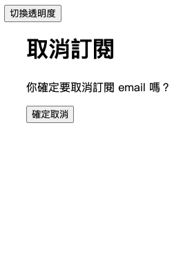
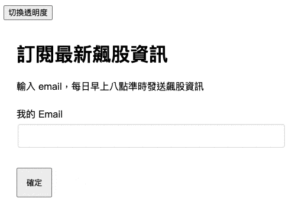
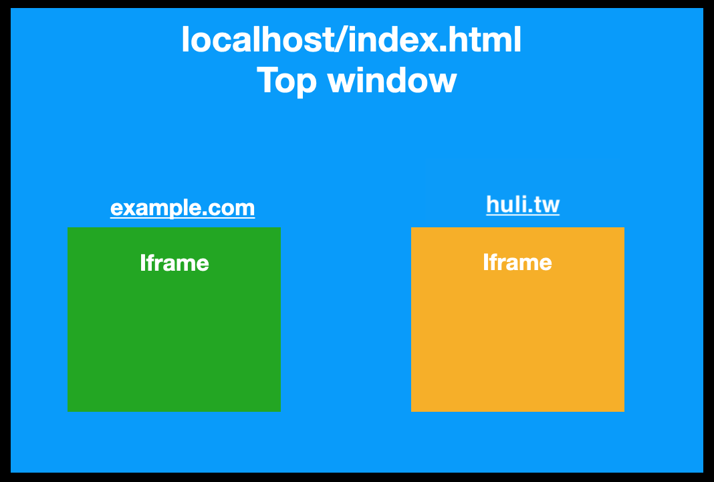

# あなたの画面はあなたの画面ではない：クリックジャッキング

これは第5章「その他の興味深いフロントエンドセキュリティトピック」の冒頭です。この最後の章では、前のカテゴリに分類するのが難しいセキュリティトピックをいくつか紹介し、より広範な内容について説明します。

まず、最初に見るのはクリックジャッキングです。これは、Aサイトのものをクリックしたつもりが、実際にはBサイトのものをクリックしており、クリックがAサイトからBサイトに「乗っ取られる」ことを意味します。

クリック1つだけで、どんな害があるのでしょうか？

背後にあるのが銀行振込ページで、口座と金額が既に入力されており、ボタンを1つ押すだけで送金されるとしたら、その被害は甚大です（これは単なる例ですが、この事例からなぜ振込に第2の認証が必要なのかがわかります）。

あるいは、より一般的な例を挙げると、一見するとメールマガジンの購読解除ページに見えるページがあり、「購読解除の確認」ボタンをクリックしたとします。しかし、実際にはその下にFacebookの「いいね！」ボタンが隠れており、購読解除どころか「いいね！」を騙し取られてしまいます。このような「いいね！」を騙し取る攻撃はライクジャッキングとも呼ばれます。

次に、この攻撃方法について詳しく見ていきましょう！

## クリックジャッキング攻撃の原理

クリックジャッキングの原理は、2つのウェブページを重ね合わせ、CSSを使用してユーザーにはAのウェブページが見えるようにし、実際にはBのウェブページをクリックさせるというものです。

より技術的な言い方をすれば、iframeを使用してBのウェブページを埋め込み、透明度を0.001に設定し、CSSで自分のコンテンツを重ね合わせれば完了です。

クリックジャッキングは、実際に例を見るのが最も面白く、直接的だと思います。以下のGIFを参照してください。



「購読解除の確認」をクリックしたつもりが、実際には「アカウント削除」をクリックしていました。これがクリックジャッキングです。実際に体験したい場合は、このページで遊んでみてください：[クリックジャッキングの例](https://aszx87410.github.io/demo/clickjacking/)。

この例は単純すぎると感じる人もいるかもしれません。実際の応用では、ボタンを1つ押すだけのこのような単純な攻撃はめったにないかもしれません。おそらく、より多くのウェブサイトはもう少し複雑で、例えば最初にいくつかの情報を入力する必要があるかもしれません。

以下の例では、「メールアドレスの変更」機能をターゲットにクリックジャッキングを設計しています。前の例がウェブページ全体を覆っていたのに対し、この例では意図的に元のウェブページの入力欄を残し、他はCSSで覆い、ボタン部分は`pointer-events:none`でイベントを透過させています。

一見するとメールアドレスを入力して情報を購読するウェブページに見えますが、確認ボタンを押すと「メールアドレスの変更に成功しました」と表示されます。なぜなら、背後には実際にはメールアドレス変更ページがあるからです。



同様に、自分で操作できるウェブページ版も提供しています：[高度なクリックジャッキングの例](https://aszx87410.github.io/demo/clickjacking/adv.html)。

クリックジャッキング攻撃の手口は、おおよそ次のようになります。

1. ターゲットのウェブページを悪意のあるウェブページに埋め込む（iframeまたは類似のタグを使用）
2. 悪意のあるウェブページ上でCSSを使用してターゲットのウェブページを覆い、ユーザーに見えないようにする
3. ユーザーを悪意のあるウェブページに誘導し、操作（入力やクリックなど）を行わせる
4. ターゲットのウェブページの動作をトリガーし、攻撃を達成する

したがって、実際の攻撃の難易度は、悪意のあるウェブサイトがどのように設計されているか、およびターゲットのウェブページの元の動作がどの程度の対話を必要とするかによって決まります。例えば、ボタンのクリックは情報の入力よりもはるかに簡単です。

そしてもう1つ注意点があります。この種の攻撃が成功するには、ユーザーがまずターゲットのウェブサイトにログインしている必要があります。ターゲットのウェブページを悪意のあるウェブページに埋め込むことができれば、クリックジャッキングのリスクがあります。

## クリックジャッキングの防御方法

前述の通り、他のウェブページに埋め込まれることができればリスクがあります。言い換えれば、埋め込むことができなければ、クリックジャッキングの問題は発生しません。これがクリックジャッキングを根本的に解決する方法です。

一般的に、クリックジャッキングの防御方法は2つに分けられます。1つはJavaScriptを使用して自分でチェックする方法、もう1つはレスポンスヘッダーを介してブラウザにこのウェブページを埋め込めるかどうかを通知する方法です。

### フレームバスティング

フレームバスティングと呼ばれる方法があり、これは私が前に述べたJavaScriptを使用して自分でチェックする方法です。原理は簡単で、コードも簡単です。

```js
if (top !== self) {
  top.location = self.location
}
```

各ウェブページには独自のウィンドウオブジェクトがあり、`window.self`は自身のウィンドウを指します。一方、`top`はトップウィンドウであり、ブラウザ全体の「タブ」の最上位ウィンドウと考えることができます。

今日、ウェブページが独立して開かれた場合、`top`と`self`は同じウィンドウを指します。しかし、今日、ウェブページがiframe内に埋め込まれている場合、`top`はiframeを使用しているウィンドウを指します。

例を挙げましょう。今日、localhostにindex.htmlがあり、次のように書かれているとします。

```html
<iframe src="https://example.com"></iframe>
<iframe src="https://huli.tw"></iframe>
```

すると、関係図は次のようになります。



緑と黄色はそれぞれiframeで読み込まれた2つのウェブページ、つまり2つの異なるウィンドウです。これらの2つのウェブページ内で`top`にアクセスすると、`localhost/index.html`のウィンドウオブジェクトになります。

したがって、`if (top !== self)`のチェックを通じて、自分がiframe内に配置されているかどうかを知ることができます。そうであれば、top.locationを変更し、最上位のウェブページを他の場所にリダイレクトします。

素晴らしく問題ないように聞こえますが、実際にはiframeの`sandbox`属性によってバイパスされます。この属性については、以前「HTMLだけでも攻撃できる？」という記事で触れましたが、もう一度復習しましょう。

iframeには`sandbox`という属性があり、このiframeの機能が制限されていることを意味します。制限を解除するには明示的に指定する必要があり、指定できる値は多数ありますが、いくつか簡単にリストアップします。

1. `allow-forms`：フォームの送信を許可
2. `allow-scripts`：JSの実行を許可
3. `allow-top-navigation`：トップロケーションの変更を許可
4. `allow-popups`：ポップアップウィンドウを許可

つまり、次のようにiframeを読み込んだ場合：

```html
<iframe src="./busting.html" sandbox="allow-forms">
```

busting.htmlに上記の保護があっても役に立ちません。なぜなら、`allow-scripts`がないためJavaScriptを実行できず、ユーザーは依然としてフォームを正常に送信できるからです。

そこで、既存の基盤にいくつかの改良を加えた、より実用的な方法を提案する人が現れました（コードは[Wikipedia - Framekiller](https://en.wikipedia.org/wiki/Framekiller)から引用）。

```html
<style>html{display:none;}</style>
<script>
   if (self == top) {
       document.documentElement.style.display = 'block'; 
   } else {
       top.location = self.location; 
   }
</script>
```

まずウェブページ全体を非表示にし、JavaScriptを実行しないと開けません。したがって、上記のサンドボックスを使用してスクリプトの実行を阻止すると、空白のウェブページしか表示されません。サンドボックスを使用しない場合、JavaScriptのチェックが通らないため、やはり空白のページしか表示されません。

これにより、より完全な防御が可能になりますが、欠点もあります。その欠点とは、ユーザーがJavaScript機能を積極的にオフにすると、何も表示されなくなることです。したがって、JavaScript機能をオフにしているユーザーにとっては、エクスペリエンスはかなり悪いです。

2008年にクリックジャッキングが初めて登場したとき、関連する防御方法はまだそれほど完全ではなかったため、これらの回避策のような解決策に頼らざるを得ませんでした。そして現在、ブラウザはウェブページが埋め込まれるのを防ぐためのより優れた方法をサポートしています。

### X-Frame-Options

このHTTPレスポンスヘッダーは、2009年にIE8によって最初に実装され、その後他のブラウザが追随し、2013年に完全な[RFC7034](https://www.rfc-editor.org/rfc/rfc7034.txt)になりました。

このヘッダーには次の3つの値があります。

1. `DENY`
2. `SAMEORIGIN`
3. `ALLOW-FROM https://example.com/`

最初のものは、`<iframe>`、`<frame>`、`<object>`、`<applet>`、または`<embed>`などのタグを含め、このウェブページを埋め込むことを拒否します。

2番目は同一オリジンのウェブページのみが許可され、最後のものは特定のオリジンからの埋め込みのみを許可し、それ以外はすべて許可されません（値を1つしか設定できず、リストは設定できないため、複数のオリジンが必要な場合は、CORSヘッダーのようにサーバーで出力を動的に調整する必要があります）。

RFCでは、最後の2つの判定方法が思ったものと異なる可能性があり、各ブラウザの実装に差異があることも特に言及されています。

例えば、一部のブラウザは「1つ上のレイヤー」と「最上位レイヤー」のみをチェックし、すべてのレイヤーをチェックするわけではないかもしれません。この「レイヤー」とはどういう意味でしょうか？iframeは理論的には無限のレイヤーを持つことができるため、AがBを埋め込み、BがCを埋め込み、CがDを埋め込む、というようになります。

この関係をテキストに変換すると、次のようになります。

```
example.com/A.html
--> attacker.com
    --> example.com/B.html
        --> example.com/target.html
```

最内層のtarget.htmlにとって、ブラウザが1つ上のレイヤー（B.html）と最上位レイヤー（A.html）のみをチェックする場合、`X-Frame-Options: SAMEORIGIN`に設定されていても、これらの2つのレイヤーは確かに同じオリジンであるため、チェックは通過します。しかし実際には、間に悪意のあるウェブページが挟まれているため、依然として攻撃されるリスクがあります。

さらに、`X-Frame-Options`には2番目の問題があります。それは、`ALLOW-FROM`のサポートが良くないことです。2023年の現在に至るまで、主要なブラウザは`ALLOW-FROM`という用法をサポートしていません。

`X-Frame-Options`の先頭の`X`は、それが過渡期のものであることを示しています。したがって、新しいブラウザでは、その機能はCSPに置き換えられ、上記の問題は解決されています。

### CSP: frame-ancestors

CSPには`frame-ancestors`というディレクティブがあり、次のように設定されます。

1. `frame-ancestors 'none'`
2. `frame-ancestors 'self'`
3. `frame-ancestors https://a.example.com https://b.example.com`

これら3つは、以前の`X-Frame-Options`の3つのタイプ、`DENY`、`SAMEORIGIN`、および`ALLOW-FROM`にそれぞれ対応しています（ただし、今回は複数のオリジンがサポートされています）。

まず、混乱を招く可能性のある点を説明します。`frame-ancestors`が制限する動作は`X-Frame-Options`と同じで、「どのウェブページが私をiframeで埋め込めるか」ということです。一方、別のCSPルールである`frame-src`は、「このウェブページがどのオリジンからのiframeの読み込みを許可するか」ということです。

例えば、index.htmlで`frame-src: 'none'`というルールを設定すると、index.html内で`<iframe>`を使用してどのウェブページを読み込んでもブロックされます。そのウェブページが何も設定していなくても関係ありません。

別の例を挙げると、私のindex.htmlは`frame-src: https://example.com`に設定されていますが、example.comも`frame-ancestors: 'none'`に設定されています。その場合、index.htmlは依然としてiframeを使用してexample.comを読み込むことができません。なぜなら、相手が拒否したからです。

要するに、`frame-src`は「私と付き合ってくれませんか？」であり、`frame-ancestors`はこのリクエストに対する回答です。`frame-ancestors: 'none'`に設定することができ、これは誰かが私に告白しても断ることを意味します。ブラウザがiframeを正常に表示するには、両方の当事者が同意する必要があり、どちらか一方が同意しないと失敗します。

また、`frame-ancestors`はCSPレベル2でサポートされているルールであり、2014年末頃から主要なブラウザで徐々にサポートされ始めたことにも注意が必要です。

### 防御のまとめ

サポート状況のため、`X-Frame-Options`とCSPの`frame-ancestors`を一緒に使用することをお勧めします。ウェブページをiframeで読み込まれたくない場合は、HTTPレスポンスヘッダーを追加することを忘れないでください。

```
X-Frame-Options: DENY
Content-Security-Policy: frame-ancestors 'none'
```

同一オリジンからの読み込みのみを許可する場合は、次のように設定します。

```
X-Frame-Options: SAMEORIGIN
Content-Security-Policy: frame-ancestors 'self'
```

許可リストを使用して許可されたソースを指定する場合は、次のようになります。

```
X-Frame-Options: ALLOW-FROM https://example.com/
Content-Security-Policy: frame-ancestors https://example.com/
```

最後に、実際にはもう1つの防御方法があり、ブラウザは既にそれを実行しています。それが何であるか思い出せますか？

それはデフォルトの`SameSite=Lax` Cookieです！これがあれば、iframeに埋め込まれたウェブページはサーバーにCookieを送信しないため、クリックジャッキング攻撃の前提条件である「ユーザーがログイン状態である必要がある」を満たしません。この点から見ると、以前に説明したCSRF以外にも、実際にはSame-site Cookieは他の多くのセキュリティ問題を解決しています。

## 実際の事例

### Yelp

hk755a氏は2018年に、アメリカ最大のレストランレビューサイトであるYelpに2つのクリックジャッキング脆弱性を報告しました。それぞれ、[ClickJacking on IMPORTANT Functions of Yelp](https://hackerone.com/reports/305128)と[CRITICAL-CLICKJACKING at Yelp Reservations Resulting in exposure of victim Private Data (Email info) + Victim Credit Card MissUse.](https://hackerone.com/reports/355859)です。

報告書の1つはレストランの予約ページに関するもので、ページにアクセスするとユーザーの個人情報が自動的に入力され、ボタンを1つクリックするだけで予約が完了します。したがって、クリックジャッキングのターゲットはこの予約ボタンです。

では、ユーザーが知らないうちに予約ボタンを押した場合、どのような影響があるのでしょうか？まず、攻撃者は自分でレストランを登録できます。そうすれば、攻撃者は次のことができます。

1. 予約者のデータを見て、メールアドレスを盗む
2. 予約をキャンセルする場合はキャンセル料を支払う必要があり、攻撃者はお金を得ることができる

自分でレストランを登録しなくても攻撃できます。例えば、あるレストランが気に入らない場合、意図的にその予約ページを配置し、多くの偽の予約を作成して、レストランが区別できないようにすることができます。

これらはすべて実際のユーザーによる予約記録ですが、実際には彼らは予約したことをまったく知りません。

### Twitter

まず、filedescriptor氏が2015年にTwitterに報告した脆弱性を見てみましょう：[Highly wormable clickjacking in player card](https://hackerone.com/reports/85624)。

この脆弱性は非常に興味深く、前述のブラウザ実装の問題を利用しています。

この事例では、Twitterは既に`X-Frame-Options: SAMEORIGIN`と`Content-Security-Policy: frame-ancestors 'self'`を設定していましたが、当時一部のブラウザはチェック時にトップウィンドウが条件を満たしているかどうかのみをチェックしていました。

言い換えれば、twitter.com => attacker.com => twitter.comの場合、チェックは通過するため、依然として悪意のあるウェブページに埋め込まれる可能性があります。

さらに、この脆弱性はTwitterのタイムラインで発生するため、ワーム効果を達成できます。クリックジャッキング後にツイートすると、より多くの人がそれを見て、より多くの人が同じツイートをします。

著者のwriteupは素晴らしいですが、ブログがダウンしています。これはアーカイブです：[Google YOLO](http://web.archive.org/web/20190310161937/https://blog.innerht.ml/google-yolo/)

もう1つは、eo420氏が2019年にTwitter傘下のPeriscopeに提出したレポートです：[Twitter Periscope Clickjacking Vulnerability](https://hackerone.com/reports/591432)。

このバグは互換性の問題によるもので、ウェブページはCSPを設定せずに`X-Frame-Options: ALLOW-FROM`のみを設定していました。これでは実際にはあまり意味がありません。なぜなら、現在のブラウザは`ALLOW-FROM`をサポートしていないからです。考えられる影響としては、ウェブサイトに「アカウント無効化」ボタンがあり、ユーザーを誘導して知らないうちにクリックさせることができます。

解決策は簡単で、現在のブラウザがサポートしている`frame-ancestors` CSPを使用するだけです。

### Tumblr

fuzzme氏は2020年にTumblrに脆弱性を報告しました：[[api.tumblr.com] Exploiting clickjacking vulnerability to trigger self DOM-based XSS](https://hackerone.com/reports/953579)。

この事例を特に選んだのは、攻撃チェーンの連携だからです！

以前、セルフXSSと呼ばれる脆弱性の一種について言及しました。これは自分自身だけがXSSをトリガーできるもので、影響がほとんどないため、多くのバグバウンティプログラムではこの種の脆弱性を受け付けていません。

そして、このレポートではセルフXSSとクリックジャッキングを連携させ、クリックジャッキングによってユーザーにセルフXSSをトリガーさせ、攻撃チェーンを連携させることで、この攻撃をより簡単に達成できるようにし、実現可能性を高めています。

どのように連携するのでしょうか？

まず、ユーザーを誘導して特定のボタンを押させ、背後で密かにXSSペイロードをコピーし、次に別の入力欄に貼り付けるように指示し、貼り付けた後にもう1つのボタンを押させます。その入力欄は実際にはユーザー名フィールドであり、最後のボタンは「データ更新」です。指示通りに操作を完了すると、自分でユーザー名をXSSペイロードに変更してしまいます。

以上がクリックジャッキング関連の実際の事例の一部です。互換性の問題によって引き起こされた問題がいくつかあることに注意することが重要であり、設定がないわけではありません。したがって、正しく設定することも非常に重要です。

## 防御不可能なクリックジャッキング？

クリックジャッキングの防御方法は、結局のところ、他の人に自分のウェブページを埋め込ませないようにすることですが、このウェブページの目的が他の人に埋め込ませることである場合はどうすればよいでしょうか？

例えば、Facebookウィジェット、よく見かける「いいね！」や「シェア」ボタンは、他の人がiframeで埋め込めるようにするためのものです。この種のウィジェットはどうすればよいのでしょうか？

これら2つの記事によると：

1. [Clickjacking Attack on Facebook: How a Tiny Attribute Can Save the Corporation](https://www.netsparker.com/blog/web-security/clickjacking-attack-on-facebook-how-tiny-attribute-save-corporation/)
2. [Facebook like button click](https://stackoverflow.com/questions/61968091/facebook-like-button-click)

そこから得られた情報によると、おそらく現在のところ、セキュリティと引き換えにユーザーエクスペリエンスを少し低下させるしかないようです。例えば、ボタンをクリックした後に確認のポップアップが表示されるようにするなどです。ユーザーにとってはクリックが1つ増えますが、ライクジャッキングのリスクも回避できます。

あるいは、ウェブサイトのソースに応じてこの動作があるかどうかを決定する可能性もあると思います。例えば、より信頼性の高いウェブサイトでは、このポップアップが表示されないかもしれません。

簡単なデモページを作成しました：https://aszx87410.github.io/demo/clickjacking/like.html

ライクジャッキングが成功した場合、ボタンをクリックするとFacebook Developer Pluginのファンページに「いいね！」が付きます（私自身は実験に成功しました）。皆さんも試してみてください。クリックした後、「元のウェブページを表示」をクリックしてボタンの下がどうなっているかを確認し、ついでに「いいね！」を取り消してください。

## まとめ

以前のブラウザのサポートがそれほど完全ではなかった時代に比べて、現在ははるかに恵まれています。ブラウザもますます多くのセキュリティ機能と新しいレスポンスヘッダーを実装し、ブラウザを通じてユーザーを悪意のある攻撃から保護しています。

デフォルトのSame-site Cookieの新時代が到来し、クリックジャッキングの達成はますます困難になっていますが、記事で言及されている`X-Frame-Options`とCSPを設定することを忘れないでください。結局のところ、セキュリティとはそういうものであり、防御層を1つ追加することは常に良いことです。

参考文献：

1. [TOPCLICKJACKING.md](https://github.com/reddelexc/hackerone-reports/blob/master/tops_by_bug_type/TOPCLICKJACKING.md)
2. [Clickjacking Defense Cheat Sheet](https://cheatsheetseries.owasp.org/cheatsheets/Clickjacking_Defense_Cheat_Sheet.html#x-frame-options-header-types)
3. [CSP frame-ancestors](https://content-security-policy.com/frame-ancestors/)
