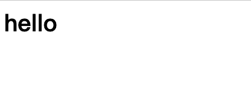
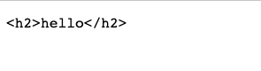
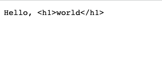
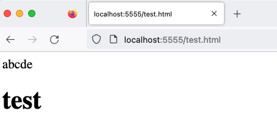

# MIMEスニッフィングを利用した攻撃

すべてのレスポンスには、通常、ブラウザにレスポンスのMIMEタイプ（`text/html`や`application/json`など）を伝える`Content-Type`というレスポンスヘッダーがあります。

しかし、`Content-Type`ヘッダーがない場合はどうなるでしょうか？ブラウザはファイルの内容に基づいてタイプを決定しようとします。`Content-Type`ヘッダーが存在する場合でも、ブラウザはそれを異なるタイプとして解釈することがあります。

ファイルの内容からMIMEタイプを推測するこの動作は、MIMEスニッフィングと呼ばれます。この機能について一緒に探ってみましょう！

## MIMEスニッフィング入門

Expressを使用して、`Content-Type`ヘッダーのないレスポンスを簡単に出力できます。

```js
const express = require('express');
const app = express();

app.get('/', (req, res) => {
  res.write('<h1>hello</h1>')
  res.end()
});

app.listen(5555, () => {
  console.log('Server is running on port 5555');
});
```

このウェブページをブラウザで開くと、「hello」というテキストが大きく太字になり、ブラウザがレスポンスをウェブページとしてレンダリングしていることがわかります。



次に、2番目の例を見てみましょう。ここでは`<h1>`を`<h2>`に変更します。

```js
const express = require('express');
const app = express();

app.get('/', (req, res) => {
  res.write('<h2>hello</h2>')
  res.end()
});

app.listen(5555, () => {
  console.log('Server is running on port 5555');
});
```



あれ、なぜ突然プレーンテキストとして表示されるのでしょうか？

次に、3番目の例では、同じ`<h1>`ですが、いくつかの追加テキストがあります。

```js
const express = require('express');
const app = express();

app.get('/', (req, res) => {
  res.write('Hello, <h1>world</h1>')
  res.end()
});

app.listen(5555, () => {
  console.log('Server is running on port 5555');
});
```



繰り返しになりますが、HTMLではなくプレーンテキストとして表示されます。

ブラウザのMIMEスニッフィングメカニズムは、どのように機能するのかわからないブラックボックスのような謎だと思うかもしれません。幸いなことに、私たちはChromeでテストしており、Chromiumはオープンソースです。

ChromiumでMIMEスニッフィングを担当するコードは[net/base/mime_sniffer.cc](https://source.chromium.org/chromium/chromium/src/+/refs/tags/118.0.5981.4:net/base/mime_sniffer.cc)にあります。コードの冒頭には、検出の仕組みが説明されています。

```cpp
// MIMEタイプの検出は、互換性の懸念とセキュリティ問題のバランスを取る必要があるため、トリッキーな作業です。以下に、他のブラウザの動作の概要と、私たちが意図する動作の説明を示します。
//
// HTMLペイロード、Content-Typeヘッダーなし：
// * IE 7：HTMLとしてレンダリング
// * Firefox 2：HTMLとしてレンダリング
// * Safari 3：HTMLとしてレンダリング
// * Opera 9：HTMLとしてレンダリング
//
// ここでの選択は明確です：
// => Chrome：HTMLとしてレンダリング
//
// HTMLペイロード、Content-Type：「text/plain」：
// * IE 7：HTMLとしてレンダリング
// * Firefox 2：テキストとしてレンダリング
// * Safari 3：テキストとしてレンダリング（注：URLにHTML拡張子がある場合、SafariはHTMLとしてレンダリングします）
// * Opera 9：テキストとしてレンダリング
//
// ここでは、大多数に従うことを選択します（そしてIEとの互換性を一部損ないます）。
// 多くの人々はIEのここでの動作を嫌っています。
// => Chrome：テキストとしてレンダリング
// これを次のように一般化します。Content-Typeヘッダーがtext/plainの場合、危険なMIMEタイプ（スクリプトを実行できるもの）は検出しません。
//
// HTMLペイロード、Content-Type：「application/octet-stream」：
// * IE 7：HTMLとしてレンダリング
// * Firefox 2：application/octet-streamとしてダウンロード
// * Safari 3：HTMLとしてレンダリング
// * Opera 9：HTMLとしてレンダリング
//
// Firefoxに従います。
// => Chrome：application/octet-streamとしてダウンロード
// この決定の要因の1つは、IIS 4および5が.xhtmlファイルのapplication/octet-streamを送信することです（拡張子を認識しないため）。いくつかの実験を行ったところ、これはWeb上ではあまり発生しないようです。より安全なオプションを選択します。
```

では、ペイロードが「HTMLペイロード」と見なされるのはどのような場合でしょうか？コードのさらに下の方でチェックされています。

```cpp
// HTMLスニッファはMozillaのものとは若干異なります。例えば、Mozillaは「<!DOCTYPE SOAP-ENV:Envelope PUBLIC 」で始まるドキュメントをHTMLと判断しますが、私たちはそうしません。

#define MAGIC_HTML_TAG(tag) \
  MAGIC_STRING("text/html", "<" tag)

static const MagicNumber kSniffableTags[] = {
  // XML処理命令。これはHTMLのMIMEタイプではありませんが、text/xmlはHTMLと同じくらい強力であり、空白スキップ技術を活用したいため、HTMLフェーズでこれをスニッフィングします。
  MAGIC_NUMBER("text/xml", "<?xml"),  // Mozilla
  // DOCTYPE
  MAGIC_HTML_TAG("!DOCTYPE html"),  // HTML5 spec
  // スニッフィング可能なタグ、スニッフィング可能なドキュメントでの出現頻度順。
  MAGIC_HTML_TAG("script"),  // HTML5 spec, Mozilla
  MAGIC_HTML_TAG("html"),  // HTML5 spec, Mozilla
  MAGIC_HTML_TAG("!--"),
  MAGIC_HTML_TAG("head"),  // HTML5 spec, Mozilla
  MAGIC_HTML_TAG("iframe"),  // Mozilla
  MAGIC_HTML_TAG("h1"),  // Mozilla
  MAGIC_HTML_TAG("div"),  // Mozilla
  MAGIC_HTML_TAG("font"),  // Mozilla
  MAGIC_HTML_TAG("table"),  // Mozilla
  MAGIC_HTML_TAG("a"),  // Mozilla
  MAGIC_HTML_TAG("style"),  // Mozilla
  MAGIC_HTML_TAG("title"),  // Mozilla
  MAGIC_HTML_TAG("b"),  // Mozilla
  MAGIC_HTML_TAG("body"),  // Mozilla
  MAGIC_HTML_TAG("br"),
  MAGIC_HTML_TAG("p"),  // Mozilla
};

// ...

// コンテンツがHTMLであるように見える場合はtrueを返し、結果を設定します。
// より多くのデータが結果を変更する可能性がある場合は、have_enough_contentをクリアします。
static bool SniffForHTML(base::StringPiece content,
                         bool* have_enough_content,
                         std::string* result) {
  // HTMLの場合、最大512バイトまで考慮します。IEは256バイトしか考慮しないため、これは過度に保守的かもしれません。
  *have_enough_content &= TruncateStringPiece(512, &content);

  // HTMLタグをスニッフィングするためにMozillaが使用する戦略に似た戦略を採用しますが、HTML5仕様によりよく一致するようにいくつかの変更を加えています。
  base::StringPiece trimmed =
      base::TrimWhitespaceASCII(content, base::TRIM_LEADING);

  // |trimmed| は最初の非空白文字から始まるか、空です。
  return CheckForMagicNumbers(trimmed, kSniffableTags, result);
}
```

レスポンスの先頭の文字列（空白を除去後）が上記のHTMLパターンと一致するかどうかを確認します。`<!DOCTYPE html`や`<html`などの一般的なHTMLの先頭が含まれています。これにより、以前のテストで`<h1>hello</h1>`の例のみがHTMLとしてレンダリングされた理由も説明できます。

ソースコードから、ChromiumはURLのファイル拡張子やその他の要因を考慮していないように見えます。ファイルの内容のみに依存しています。これを検証するために、もう一度テストしてみましょう。

```js
const express = require('express');
const app = express();

app.get('/test.html', (req, res) => {
  res.write('abcde<h1>test</h1>')
  res.end()
});

app.listen(5555, () => {
  console.log('Server is running on port 5555');
});
```

ここでは画像は含めませんが、URLが`test.html`であるにもかかわらず、結果は依然としてプレーンテキストとして表示されます。他のブラウザはどうでしょうか？Firefoxで開いてみましょう。



Firefoxは実際にHTMLとしてレンダリングしていることがわかります！したがって、FirefoxはMIMEスニッフィングを実行する際にURLのファイル拡張子を考慮すると推測できます。

## MIMEスニッフィングを利用した攻撃

以前の調査から、レスポンスに`Content-Type`が設定されておらず、コンテンツを制御できる場合、MIMEスニッフィングを使用してブラウザにファイルをウェブページとして解釈させることができるという事実を確認しました。

例えば、ファイル拡張子のみをチェックし、コンテンツはチェックしない画像アップロード機能があるとします。`a.png`という名前のファイルをアップロードできますが、コンテンツは`<script>alert(1)</script>`です。サーバーがこの画像を提供する際に自動的に`Content-Type`を追加しない場合、XSS脆弱性になります。

しかし、最近のほとんどのサーバーは自動的に`Content-Type`を追加します。それでも可能なのでしょうか？

はい、他の軽微な問題と組み合わせることができます。

Apache HTTP Serverは一般的に使用されるサーバーであり、有名なLAMPスタック（Linux + Apache + MySQL + PHP）はこのサーバーを使用しています。

Apache HTTP Serverには奇妙な動作があります。ファイル名にドット（`.`）のみが含まれている場合、`Content-Type`を出力しません。例えば、`a.png`はファイル拡張子に基づいてMIMEタイプを自動的に検出し、`image/png`を出力しますが、ファイル名が`..png`の場合、`Content-Type`を出力しません。

したがって、バックエンドがApache HTTP Serverを使用してファイルダウンロードを処理している場合、拡張子が`..png`の正当に見える画像をアップロードできますが、ブラウザで開くとウェブページとして表示され、XSS脆弱性になります。

Apache HTTP Serverによると、これは期待される動作であり、詳細については[@YNizry](https://twitter.com/YNizry/status/1582733545759330306)を参照してください。

## JavaScriptを実行できるコンテンツタイプ

HTMLファイル以外に、JavaScriptを実行できるファイルタイプは他にありますか？

2020年にBlackFan氏が行った調査「[Content-Type Research](https://github.com/BlackFan/content-type-research/tree/master)」では、包括的なリストが提供されています：[Content-Type that can be used for XSS](https://github.com/BlackFan/content-type-research/blob/master/XSS.md)。

リストから、HTML以外にも、XMLとSVGがJavaScriptを実行できる最も一般的なコンテンツタイプであることがわかります。

ここで特に興味深いのはSVGファイルです。なぜなら、多くのウェブサイトには画像アップロード機能があり、SVGは画像形式と見なされているからです。したがって、一部のウェブサイトではSVGのアップロードが許可されています。しかし、この調査から、SVGのアップロードを許可することは、SVGがJavaScriptを実行できるため、HTMLのアップロードを許可することと同じであることがわかります！

例えば、febin氏は2022年にオープンソースソフトウェアMantis Bug Trackerに脆弱性を報告しました：[CVE-2022-33910: Stored XSS via SVG file upload](https://mantisbt.org/bugs/view.php?id=30384)。この脆弱性は、ユーザーが新しい問題を作成する際にファイルをアップロードでき、許可されるファイル形式がSVGであったために発生しました。したがって、悪意のあるSVGファイルをアップロードでき、他のユーザーがそれを開くと、内部に隠されたコードが実行されます。

## スクリプトとして読み込めるコンテンツタイプ

次のコードスニペットを例にとってみましょう。

```html
<script src="URL"></script>
```

ブラウザが`URL`をスクリプトとして読み込むには、`URL`のコンテンツタイプが何であるべきか考えたことはありますか？

例えば、`image/png`の場合、機能せず、ブラウザに次のエラーメッセージが表示されます。

> スクリプト 'http://localhost:5555/js' の実行を拒否しました。MIMEタイプ ('image/png') が実行可能でないためです。

最も一般的な`text/javascript`は明らかに問題なく動作します。しかし、他にはありますか？

以下にリストされている10個のコンテンツタイプのうち、機能しないのは2つだけです。どちらの2つか推測できますか？

1. application/zip
2. application/json
3. application/octet-stream
4. text/csv
5. text/html
6. text/json
7. text/plain
8. huli/blog
9. video/mp4
10. font/woff2

答えは後で明らかにしますが、まず、Chromiumのソースコードに書かれている「有効なJavaScript MIMEタイプ」を明らかにしましょう：[/third_party/blink/common/mime_util/mime_util.cc](https://chromium.googlesource.com/chromium/src.git/+/refs/tags/103.0.5012.1/third_party/blink/common/mime_util/mime_util.cc)：

```cpp
//  仕様で言及されているすべてのスクリプトタイプをサポートします。仕様には「ユーザーエージェントはすべてのJavaScript MIMEタイプを認識しなければならない」と記載されているためです。https://html.spec.whatwg.org/#javascript-mime-type を参照してください。
const char* const kSupportedJavascriptTypes[] = {
    "application/ecmascript",
    "application/javascript",
    "application/x-ecmascript",
    "application/x-javascript",
    "text/ecmascript",
    "text/javascript",
    "text/javascript1.0",
    "text/javascript1.1",
    "text/javascript1.2",
    "text/javascript1.3",
    "text/javascript1.4",
    "text/javascript1.5",
    "text/jscript",
    "text/livescript",
    "text/x-ecmascript",
    "text/x-javascript",
};
```

上記はすべて有効なJavaScript MIMEタイプであり、`jscript`や`livescript`など、過去の多くの名残を見ることができます。

有効なJavaScript MIMEタイプ以外に、仕様によると、機能しないタイプは4つだけです。

1. `audio/*`
2. `image/*`
3. `video/*`
4. `text/csv`

これらを除いて、他のすべてのタイプは有効です。したがって、上記のオプションの中で、`text/csv`と`video/mp4`のみが機能せず、残りは機能します！はい、`text/html`と`application/json`も機能し、`huli/blog`も機能します。

この寛大なメカニズムを強化し、JavaScript MIMEタイプのみを読み込ませたい場合は、レスポンスにヘッダーを追加できます：`X-Content-Type-Options: nosniff`。このヘッダーを追加すると、前述の10個の例はすべて機能しなくなり、読み込み時に次のエラーが表示されます。

> スクリプト 'http://localhost:5555/js' の実行を拒否しました。MIMEタイプ ('text/plain') が実行可能でなく、厳密なMIMEタイプチェックが有効になっているためです。

`strict MIME type`は、そのヘッダーを追加することで有効になる機能です。

スタイルシートも同様です。この機能を有効にすると、`text/css` MIMEタイプのみが有効として認識され、その他はすべてエラーになります。

では、この機能を有効にし続けるとどうなるでしょうか？追加のセキュリティリスクが発生します。

あるウェブサイトでXSS脆弱性を見つけたとします。しかし、問題は、ウェブサイトのCSPが`script-src 'self';`であり、外部スクリプトの読み込みが許可されておらず、インラインスクリプトもブロックされていることです。この場合、どのようにCSPをバイパスできるでしょうか？

ウェブサイトが画像、動画、CSVファイル以外のファイルを受け入れるファイルアップロード機能を提供し、コンテンツをチェックしない場合、ZIPファイルのみを受け入れるとします。その場合、JavaScriptコードを含むファイルをアップロードできます。

このようにして、`<script src="/uploads/files/my.zip"></script>`を使用してスクリプトを読み込み、CSPを正常にバイパスできます。これが機能する理由は、前述の動作のためです。MIMEタイプがそれらのいくつかのタイプでない限り、スクリプトとして読み込むことができます。

これが、多くのウェブサイトがこのヘッダーを追加している理由であり、そのような動作を防ぐためです。

## まとめ

この記事では、MIMEタイプに関連する多くの興味深いことを見て、Chromiumのソースコードもたくさん見ました。個人的には、Chromiumのソースコードは非常に明確に書かれており、コメントや仕様へのリンクも含まれているため、別途仕様を検索する必要がないと感じています。一石二鳥のようなものです。

最後に、`X-Content-Type-Options: nosniff`ヘッダーの目的と機能を紹介しました。多くの人がこのヘッダーを見たことがあると思いますが、何のためにあるのか知らなかったでしょう。そして今、あなたは知っています。

参考文献：

1. [UIUCTF 2022 Write-up](https://blog.huli.tw/2022/08/01/en/uiuctf-2022-writeup/)
2. [スクリプトタイプについてどれくらい知っていますか？](https://blog.huli.tw/2022/04/24/ja/script-type/)
