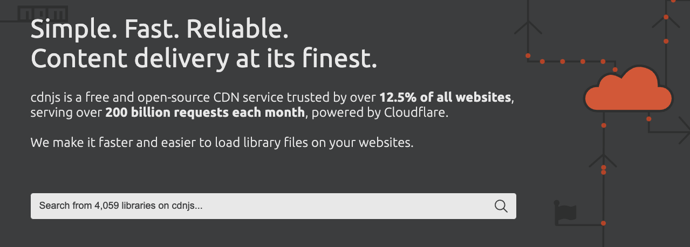
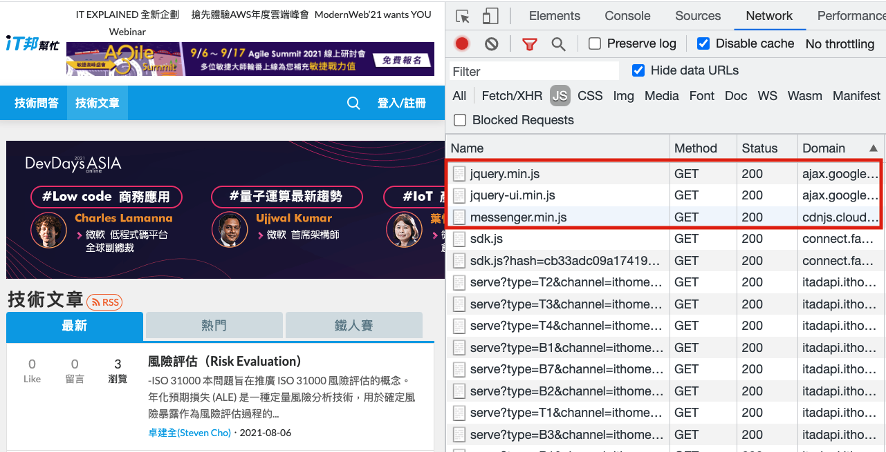
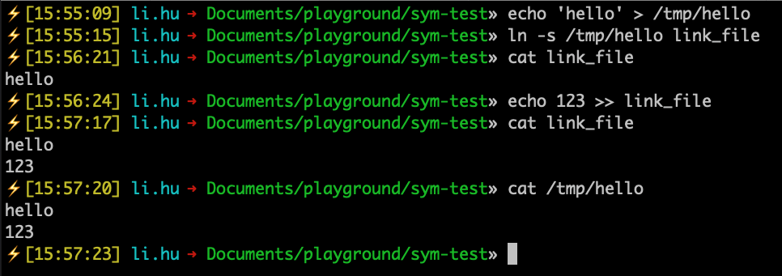

# フロントエンドサプライチェーン攻撃：上流から下流への攻撃

サプライチェーン攻撃は、上流の脆弱性を標的にして攻撃を開始します。上流が侵害されると、下流も汚染されます。

フロントエンドを例にとると、使用するnpmパッケージやコードにインポートするサードパーティスクリプトは「上流」と見なされます。これらのサードパーティリソースを使用する際に、関連するリスクを認識したことがありますか？

この記事では、cdnjsを例として、フロントエンドのサプライチェーン攻撃と防御メカニズムについて説明します。

## cdnjs

フロントエンドで作業していると、jQueryやBootstrapなどのサードパーティライブラリを使用する必要がある状況によく遭遇します（前者はnpmで週に400万回、後者は300万回ダウンロードされています）。最近ではほとんどの人がwebpackを使用して独自のコードをバンドルしているという事実はさておき、以前は、そのような要件に対して、ライブラリファイル自体をダウンロードするか、既製のCDNを使用してロードするかのどちらかでした。

ソースの1つはcdnjsであり、そのウェブサイトは次のようになっています。



cdnjs以外にも、同様のサービスを提供する他のウェブサイトがあります。例えば、[jQuery](https://jquery.com/download/)の公式サイトでは、独自のcode.jquery.comを見ることができ、[Bootstrap](https://getbootstrap.com/)は[jsDelivr](https://www.jsdelivr.com/)というサービスを使用しています。

具体的な例を挙げましょう！

jQueryが必要なウェブサイトで作業しているとします。ページの`<script>`タグを使用してjQueryライブラリを読み込みます。ソースは次のいずれかになります。

1. 自分のウェブサイト
2. jsDelivr: https://cdn.jsdelivr.net/npm/jquery@3.6.0/dist/jquery.min.js
3. cdnjs: https://cdnjs.cloudflare.com/ajax/libs/jquery/3.6.0/jquery.min.js
4. jQuery公式：https://code.jquery.com/jquery-3.6.0.min.js

jQuery公式サイトが提供するURLを選択したとします。次のHTMLコードを記述します。

```html
<script src="https://code.jquery.com/jquery-3.6.0.min.js"></script>
```

このようにして、jQueryライブラリが読み込まれ、他のコードはその機能を使用できます。

では、なぜライブラリをダウンロードして自分のウェブサイトでホストするのではなく、CDNを選択するのでしょうか？いくつかの理由が考えられます。

1. 怠惰、他人のものを使うのが速い
2. 予算の考慮、他人のウェブサイトを使用すると帯域幅のコストを節約し、自分のウェブサイトの負荷を軽減できる
3. 速度の考慮

3番目の点である速度の考慮事項は、特に言及する価値があります。ライブラリがCDNから読み込まれる場合、ダウンロード速度が速くなる可能性があります。

速度が速い理由は、CDNがこの目的のために特別に設計されており、さまざまな国にノードを持っているためです。例えば、サーバーが米国にあり、ライブラリを自分のウェブサイトでホストしている場合、台湾のユーザーはこれらのライブラリを取得するために米国のサーバーに接続する必要があります。しかし、CDN提供のURLを使用する場合、台湾のノードに接続するだけで済む可能性があり、遅延がいくらか節約されます。

台湾の有名なITウェブサイトを例にとると、Googleとcdnjsのリソースを使用しています。



サードパーティCDNを使用する利点についていくつか説明しました。では、欠点は何でしょうか？

最初の欠点は、CDNがダウンした場合、ウェブサイトも一緒にダウンする可能性があることです。完全にダウンしなくても、接続が遅くなる可能性があります。例えば、私のウェブサイトがcdnjsからjQueryを読み込んでいるが、cdnjsが突然遅くなった場合、私のウェブサイトも影響を受けて遅くなります。

cdnjsの背後にある会社であるCloudflareは、実際にいくつかの[インシデント](https://techcrunch.com/2019/06/24/cloudflare-outage-affecting-numerous-sites-on-monday-am/)を経験しており、多くのウェブサイトに影響を与えました。

2番目の欠点は、CDNがハッキングされ、インポートしたライブラリに悪意のあるコードが注入された場合、ウェブサイトも侵害されることです。この種の攻撃は「サプライチェーン攻撃」として知られており、上流が侵害され、下流に影響を与えます。

「これらの大企業がハッキングされる可能性は低いでしょう？それに、これほど多くの人がこれらのサービスを利用しているのだから、誰かが監視しているはずです」と思う人もいるかもしれません。

次に、実際のケーススタディを見てみましょう。

## cdnjsにおけるRCE脆弱性の解析

2021年7月16日、セキュリティ研究者の[@ryotkak](https://twitter.com/ryotkak)氏が自身のブログで「[Remote code execution in cdnjs of Cloudflare](https://blog.ryotak.me/post/cdnjs-remote-code-execution-en/)」（以下「著者」と呼ぶ）という記事を公開しました。

リモートコード実行（RCE）は、攻撃者が任意のコードを実行できる脆弱性です。これはリスクの高い脆弱性です。著者はcdnjsにRCE脆弱性を発見し、悪用されればcdnjsサービス全体を制御できる可能性があると述べています。

著者のブログ記事にはプロセスの詳細な説明が記載されています。ここでは、2つの脆弱性からなる脆弱性がどのように形成されるかを簡単に説明します。

まず、Cloudflareはcdnjs関連のコードをGitHubでオープンソース化しており、その自動更新機能の1つが著者の注意を引きました。この機能は、圧縮ファイル（.tgz）の形式でnpmからパッケージ化されたファイルを自動的に取得し、解凍し、いくつかの処理を実行してから適切な場所にコピーします。

著者は、Goで`archive/tar`を使用して解凍すると、解凍されたファイルが処理されないため、脆弱性が存在する可能性があることを知っていました。したがって、ファイル名は`../../../../../tmp/temp`のようになる可能性があります。

これに何の問題があるのでしょうか？

ファイルをコピーし、次のような同様の操作を実行するコードがあるとします。

1. 宛先とファイル名を連結してターゲットの場所を作成し、新しいファイルを作成します。
2. 元のファイルを読み取り、新しいファイルに書き込みます。

宛先が`/packages/test`でファイル名が`abc.js`の場合、`/packages/test/abc.js`に新しいファイルが生成されます。

さて、宛先が同じでファイル名が`../../../tmp/abc.js`の場合、ファイルは`/package/test/../../../tmp/abc.js`、つまり`/tmp/abc.js`に書き込まれます。

したがって、この手法を使用すると、適切な権限を持つ任意の場所にファイルを書き込むことができます。cdnjsコードには、任意の場所にファイルを書き込むことができる同様の脆弱性があります。この脆弱性を悪用して、自動実行がスケジュールされているファイルを上書きできれば、RCEを達成できます。

著者がこれを検証するためのPOCを作成しようとしていたとき、Git自動更新機能がどのように機能するのか（圧縮ファイルに関する前述の議論はnpmに関連していました）に興味を持ちました。

調査の結果、著者はGitリポジトリの自動更新に関連するファイルをコピーするためのコードの一部を発見しました。それは次のようになっています。

```go
func MoveFile(sourcePath, destPath string) error {
    inputFile, err := os.Open(sourcePath)
    if err != nil {
        return fmt.Errorf("Couldn't open source file: %s", err)
    }
    outputFile, err := os.Create(destPath)
    if err != nil {
        inputFile.Close()
        return fmt.Errorf("Couldn't open dest file: %s", err)
    }
    defer outputFile.Close()
    _, err = io.Copy(outputFile, inputFile)
    inputFile.Close()
    if err != nil {
        return fmt.Errorf("Writing to output file failed: %s", err)
    }
    // The copy was successful, so now delete the original file
    err = os.Remove(sourcePath)
    if err != nil {
        return fmt.Errorf("Failed removing original file: %s", err)
    }
    return nil
}
```

大したことではないように見えます。単にファイルをコピーし、新しいファイルを開き、古いファイルの内容を新しいファイルにコピーするだけです。

しかし、元のファイルがシンボリックリンクの場合、話は別です。先に進む前に、シンボリックリンクとは何かを簡単に説明しましょう。

シンボリックリンクの概念は、Windowsで以前見られた「ショートカット」に似ています。このショートカット自体は、実際のターゲットを指す単なるリンクです。

Unixライクなシステムでは、`ln -s target_file link_name`を使用してシンボリックリンクを作成できます。よりよく理解するために例を挙げましょう。

まず、`/tmp/hello`という場所に「hello」という内容のファイルを作成します。次に、現在のディレクトリに、新しく作成したhelloファイルを指すシンボリックリンクを作成します：`ln -s /tmp/hello link_file`。

`link_file`の内容を出力すると、「hello」と表示されます。なぜなら、実際には`/tmp/hello`の内容を出力しているからです。`link_file`にデータを書き込むと、実際には`/tmp/hello`に書き込まれます。



さて、Node.jsでファイルをコピーするコードを書いてみて、何が起こるか見てみましょう。

```js
node -e 'require("fs").copyFileSync("link_file", "test.txt")'
```

実行後、ディレクトリに`test.txt`というファイルが作成され、その内容は`/tmp/hello`の内容と同じであることがわかります。

したがって、プログラムがファイルをコピーするとき、「シンボリックリンクをコピーする」のではなく、「ターゲットファイルの内容をコピーする」のです。

したがって、前述のGoのファイルコピーコードでは、`/etc/passwd`を指すシンボリックリンクであるファイルがある場合、コピー後に`/etc/passwd`の内容を持つファイルが生成されます。

Gitファイルに`test.js`という名前のシンボリックリンクを追加し、`/etc/passwd`を指すようにすることができます。cdnjsがそれをコピーした後、test.jsという名前のファイルが作成され、その内容は`/etc/passwd`になります！

これにより、任意のファイル読み取り脆弱性が生じます。

まとめると、著者は2つの脆弱性を発見しました。1つはファイルの書き込み用、もう1つはファイルの読み取り用です。ファイルを書き込むと、重要なファイルが誤って上書きされるとシステムがクラッシュする可能性があります。したがって、著者はファイル読み取り脆弱性から始めることにし、Gitリポジトリを作成し、新しいバージョンを公開し、cdnjsが自動更新するのを待ち、最後にファイル読み取り脆弱性をトリガーしました。読み取られたファイルの内容は、cdnjsで公開されているJSで確認できます。

そして著者が読み取ったファイルは`/proc/self/environ`（元々は別の`/proc/self/maps`を読みたかった）であり、これには環境変数が含まれており、GitHub APIキーも含まれていました。このキーはcdnjs以下のリポジトリへの書き込み権限を持っていたため、このキーを使用することで、cdnjsまたはcdnjsウェブサイトのコードを直接変更し、サービス全体を制御することができました。

以上がcdnjsの脆弱性の説明です。より技術的な詳細や詳細な経緯を知りたい場合は、元の著者のブログ記事を参照してください。多くの詳細が記載されています。いずれにせよ、大企業が保守しているサービスでさえ、侵害されるリスクがあります。

Cloudflareも1週間後にインシデント対応レポートを公開しました：[Cloudflare's Handling of an RCE Vulnerability in cdnjs](https://blog.cloudflare.com/cloudflares-handling-of-an-rce-vulnerability-in-cdnjs/)。これには、事の経緯と事後の修正措置が記録されています。彼らはアーキテクチャ全体を完全に書き直し、解凍部分をDockerサンドボックスに入れ、全体的なセキュリティを向上させました。

## フロントエンドエンジニアとして、これに対してどのように防御できますか？

では、この種の脆弱性に対してどのように防御できるのでしょうか？あるいは、まったく防御できないのでしょうか？

ブラウザは実際には、「ファイルが改ざんされている場合は読み込まない」という機能を提供しています。これにより、たとえcdnjsが侵害され、jQueryファイルが改ざんされても、私のウェブサイトは新しいjQueryファイルを読み込まず、ファイル汚染攻撃を回避できます。

cdnjsでは、特定のライブラリを使用することを決定した場合、URLをコピーするかスクリプトタグをコピーするかを選択できます。後者を選択すると、次の内容が得られます。

```html
<script
    src="https://cdnjs.cloudflare.com/ajax/libs/react/17.0.2/umd/react.production.min.js"
    integrity="sha512-TS4lzp3EVDrSXPofTEu9VDWDQb7veCZ5MOm42pzfoNEVqccXWvENKZfdm5lH2c/NcivgsTDw9jVbK+xeYfzezw=="
    crossorigin="anonymous"
    referrerpolicy="no-referrer">
</script>
```

`crossorigin="anonymous"`については既に説明しました。CORSを使用してリクエストを送信することで、Cookieをバックエンドに送信することを回避できます。

上記のもう1つのタグである`integrity`が防御の鍵です。この属性により、ブラウザは読み込むリソースが提供されたハッシュ値と一致するかどうかを確認できます。一致しない場合、ファイルが改ざんされていることを意味し、リソースは読み込まれません。したがって、たとえcdnjsが侵害され、ハッカーが元々使用していたreact.jsファイルを置き換えたとしても、ハッシュ値が一致しないため、ブラウザは汚染されたコードを読み込みません。

詳細については、MDNを参照してください。[Subresource Integrity](https://developer.mozilla.org/ja/docs/Web/Security/Subresource_Integrity)専用のページがあります。

ただし、この方法は「既にインポートされたスクリプト」が改ざんされるのを防ぐことしかできません。ハッカーがファイルを改ざんした後にたまたまスクリプトがコピーされた場合、ファイルは既に改ざんされているため効果がありません。

したがって、このリスクを完全に回避したい場合は、これらのサードパーティサービスを使用しないでください。これらのライブラリを独自のCDNでホストすれば、リスクはサードパーティから独自のサービスに移ります。独自のサービスが侵害されない限り、これらのライブラリは安全なはずです。

最近では、多くのウェブサイトがwebpackのようなバンドラを使用してライブラリを再パッケージ化するため、サードパーティのライブラリCDNを使用できません。それらは独自のウェブサイトでホストする必要があり、これによりこの種のサプライチェーン攻撃が排除されます。

ただし、他のサプライチェーン攻撃のリスクを依然として回避できないことに注意してください。なぜなら、サードパーティのライブラリCDNを使用しなくても、npmなどの他の場所からこれらのライブラリをダウンロードする必要があるからです。npmが侵害され、そのファイルが改ざんされると、依然としてサービスに影響を与えます。これはサプライチェーン攻撃であり、攻撃は直接あなたを標的にするのではなく、他の上流ソースを通じて侵入します。

ただし、この種のリスクは、ビルド時に静的スキャンサービスを使用して、改ざんされたファイルや悪意のあるコードを検出することで軽減できます。一部の企業では、使用されるライブラリが改ざんされないように、外部npmと直接同期されない内部npmレジストリも設定しています。

## まとめ

攻撃手法は無数にあり、cdnjsの脆弱性を発見した研究者は最近、サプライチェーン攻撃に関心を持っています。cdnjsだけでなく、Homebrew、PyPI、さらには@typesでさえ脆弱性が発見されています。

ページにサードパーティのURLを直接含める場合は、ウェブサイトが信頼できることを確認してください。可能であれば、ファイルの改ざんとそれに続くサービスへの影響を防ぐために、integrity属性も追加してください。また、CSP設定にも注意してください。cdnjsのようなウェブサイトの場合、ドメインのみを設定すると、既に実行可能なバイパス方法があるため、設定する際には注意してください。

cdnjsの脆弱性を通じて、フロントエンドエンジニアがサプライチェーン攻撃について認識を深めることを願っています。この攻撃方法を認識することで、開発者は将来の開発においてより慎重になり、サードパーティライブラリのインポートに伴うリスクに注意を払うようになります。
