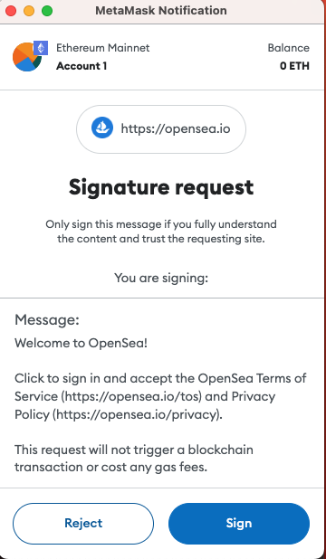

# Web3におけるウェブフロントエンド攻撃の応用

Web3というと、多くの人が暗号通貨、メタバース、NFTなどを思い浮かべるでしょう。これらはすべてブロックチェーンとスマートコントラクトという基盤技術の上に成り立っており、まったく異なるシステムを形成しています。

しかし、Web3の世界にも依然として入口が必要であり、その入口がWeb2、つまり私たちがよく知るウェブの世界であることを忘れてはいけません。

この記事では、Web2の視点からWeb3の世界への攻撃の実際の事例をいくつか見ていきます。

## より影響力のあるXSS

典型的なウェブサイトでは、XSS脆弱性がうまく悪用されると、攻撃者は通常、電話番号、メールアドレス、名前などのユーザーデータを盗むことができます。

しかし、Web3の世界でXSS脆弱性が見つかった場合はどうなるでしょうか？データを盗むだけでなく、より価値のあるもの、つまり暗号通貨を盗むことにつながる可能性があります。

暗号通貨の世界では、誰もが自分のウォレットを持っており、ブラウザで最もよく知られているウォレットの1つがMetamaskです。トランザクションを承認したり、メッセージに署名したりする必要がある場合、次のインターフェースが表示されます。



それがトランザクションまたはスマートコントラクトの承認である場合、コントラクトアドレスやその他の詳細が表示されます。

私たちは皆、未知のソースからのトランザクションをむやみに受け入れたり、疑わしいウェブサイトを無視したりしないように知っています。しかし、それがPancakeSwapのような有名なウェブサイトの場合はどうでしょうか？そのようなウェブサイトでアクションを実行し、「確認」をクリックすると、Metamaskがトランザクションの承認を求めるプロンプトを表示します。90％の人が単に「確認」をクリックすると私は信じています。

しかし、この小さなクリックにより、大量の暗号通貨を失う可能性があります。

「トランザクションへの署名」という行為は、実際にはウェブサイトがJavaScriptを介してウォレットが提供するAPIを呼び出し、ウォレットのインターフェースをプロンプト表示することです。ユーザーが「承認」をクリックした場合にのみ、トランザクションは秘密鍵を使用して署名され、トランザクションが有効になります。

したがって、Web3の世界では、ハッカーがJavaScriptの実行を制御できるようになると、一見正当に見えるウェブサイトで悪意のあるトランザクションを実行できます。ユーザーが同意すると、知らず知らずのうちに自分の暗号通貨をハッカーのスマートコントラクトに承認してしまい、資金が盗まれる結果となります。

例えば、2022年にPREMINTというNFTウェブサイトのJavaScriptファイルが侵害され、一部のユーザーが意図せずにハッカーのスマートコントラクトを承認してしまいました。詳細については、[PREMINT NFTインシデント分析](https://www.certik.com/resources/blog/77oaazrsx1mewnraJePYQI-premint-nft-incident-analysis)を参照してください。

XSSに対して脆弱なウェブサイトを見つけた場合、その特定のウェブサイトのみを攻撃できます。ただし、複数のウェブサイトで使用されているライブラリに脆弱性を見つけた場合、影響ははるかに大きくなります。

前述のサプライチェーン攻撃は、Web3ウェブサイトにも適用できます。次に、2022年にSam Curry氏が公開した記事について説明します：[Web3の隠れた攻撃対象領域の悪用：NetlifyのNext.jsライブラリにおけるユニバーサルXSS](https://samcurry.net/universal-xss-on-netlifys-next-js-library/)

記事の中で、彼はNext.jsライブラリと@netlify/ipxの脆弱性を発見したことについて説明しており、これによりこれらのライブラリを使用している任意のウェブサイトでXSS攻撃が可能になります。

Netlifyは、特に従来のバックエンドを持たない静的ページである可能性のあるWeb3ウェブサイトなど、ウェブサイトをデプロイするための一般的なプラットフォームです。すべてのページ機能は、バックエンドAPIを必要とせずにHTML、CSS、およびJavaScriptを通じて実現できます。

したがって、この脆弱性を介して、GeminiやPancakeSwapなどの有名なウェブサイトを攻撃し、XSSを使用してスマートコントラクトの承認インターフェースをプロンプト表示し、ユーザーを騙してクリックさせることが可能です。

## Cookie Bombの実用的な応用

前述のCookie Bombは、Web3の世界でも新たな意味合いを持ちます。

2023年にOtterSecが公開した記事「[Web2 Bug Repellant Instructions](https://osec.io/blog/2023-08-11-web2-bug-repellant-instructions)」では、実際の事例が紹介されています。

多くのウェブサイトが画像のアップロードをサポートしており、一部はSVGファイルも許可しています。

では、SVGと他の画像形式の違いは何でしょうか？違いは、SVGファイルは以下の例のようにスクリプトを実行できることです。

```svg
<?xml version="1.0" standalone="no"?>
<!DOCTYPE svg PUBLIC "-//W3C//DTD SVG 1.1//EN" "http://www.w3.org/Graphics/SVG/1.1/DTD/svg11.dtd">

<svg version="1.1" xmlns="http://www.w3.org/2000/svg">
  <script type="text/javascript">
    alert("Hello");
  </script>
</svg>
```

したがって、ウェブサイトがSVGのアップロードをサポートしている場合、SVGを使用してXSS脆弱性を悪用する可能性が高くなります。

しかし、1つ問題があります。多くの画像アップロード場所はメインウェブサイトから分離されており、特定のドメイン設定なしにS3に直接アップロードされるなどしています。したがって、せいぜい画像ドメインでXSSを達成するだけであり、影響は限定的です。

しかし、NFTウェブサイトの場合は異なります。

NFTウェブサイトにとって、画像は重要な部分です。画像が表示されない場合、ウェブサイト全体の使いやすさが大幅に影響を受けます。したがって、Cookie Bombを使用して画像に対してDoS攻撃を実行することは、NFTウェブサイトに大きな影響を与えます。

同じ脆弱性の深刻度と影響は、製品の種類によって異なる場合があります。

例えば、DoS脆弱性はどちらもウェブページを一時的にクラッシュさせる可能性がありますが、昨年のクリスマスイベントのウェブページにとっては大したことではないかもしれませんが、暗号通貨取引所にとっては大きな損失を引き起こす可能性があります。

## 結論

この記事では、Web3製品も従来のウェブページと同じセキュリティ問題に直面する必要があり、保護されなければならないことを見てきました。適切に保護されていない場合、侵入がスマートコントラクトでなくても、特定の損害を引き起こす可能性があります。

Web3の攻撃対象領域はスマートコントラクトに限定されません。従来のウェブセキュリティ、フィッシング攻撃、秘密鍵のセキュリティはすべて、防御する必要のある領域です。

この記事のアイデアを提供してくれた[@BrunoModificato](https://twitter.com/BrunoModificato)氏に感謝します。
