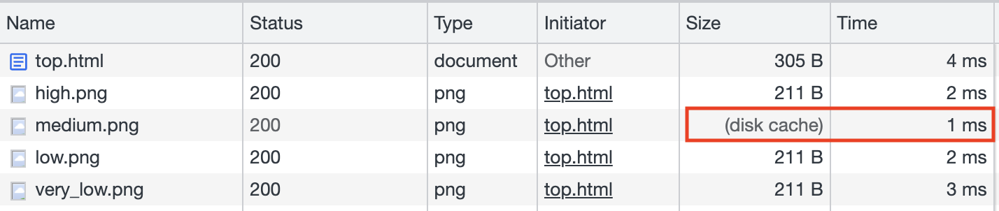
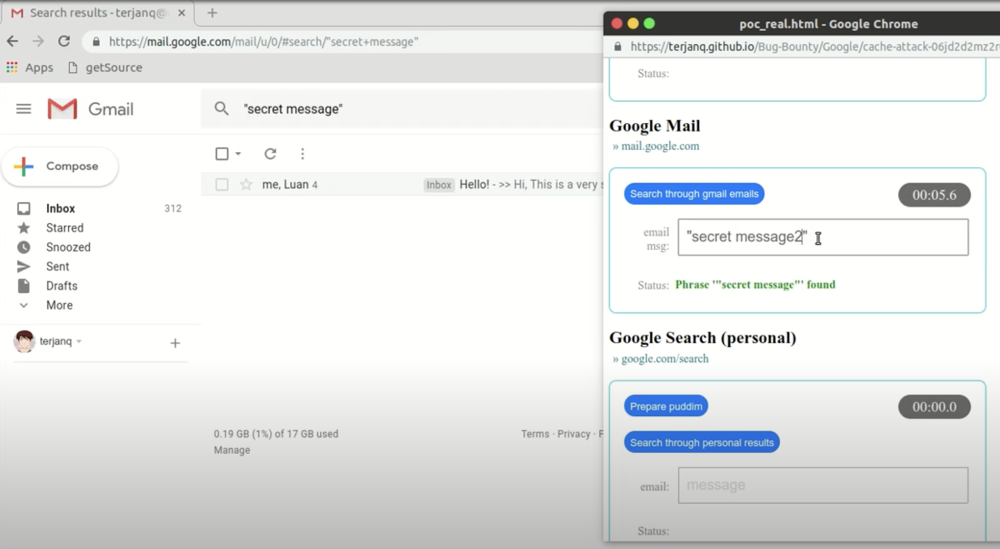

# 最も興味深いフロントエンドサイドチャネル攻撃：XSLeaks（パート2）

前回の投稿の最後の段落から、XSLeaksと検索を組み合わせると、より大きな影響を生み出すことができることがわかります。この攻撃方法はXS-Searchと呼ばれます。

影響が大きくなる理由は、検索結果は一般的にプライベートであると考えられるためです。特定の手段によって検索結果を推測できるようになると、攻撃者は検索機能を通じて機密情報を取得できます。では、どのような手段を利用できるのでしょうか？

前回の投稿で述べた方法に加えて、この記事ではより一般的に使用される方法であるキャッシュプロービングについて説明します。

## キャッシュプロービング

キャッシュメカニズムはコンピュータサイエンスの世界ではどこにでも見られます。リクエストの送信に関して言えば、JavaScriptで独自のキャッシュを実装し、繰り返されるリクエストは再送信しないようにすることができます。ブラウザ自体もHTTP仕様に基づいてキャッシュメカニズムを実装しており、実際にリクエストを送信する際にはDNSにもキャッシュがあります！

ブラウザにはDNSキャッシュがあり、オペレーティングシステムにも独自のキャッシュがあり、DNSサーバーにも独自のキャッシュがあります。キャッシュはどこにでも存在し、CPUでさえL1やL2などのキャッシュメカニズムを備えており、実行速度を上げるために時間と空間を交換しています。

覚えていらっしゃるかもしれませんが、以前に述べたCPUの脆弱性であるSpectreとMeltdownはキャッシュに関連しています。実際、それらはこの記事で説明するキャッシュプロービング技術と似ています。

名前が示すように、この手法は、何かがキャッシュにあるかどうかを使用して元の情報を推測します。

例えば、ユーザーがログインしている場合、ウェブサイトにウェルカムページが表示され、その上にwelcome.png画像が表示されるとします。ユーザーがログインしていない場合、ログインページにリダイレクトされます。画像が表示されると、ブラウザのキャッシュに保存されます。

キャッシュ内の画像は読み込みが速いため、welcome.pngの読み込み時間を測定することで画像がキャッシュにあるかどうかを検出し、ユーザーがログインしているかどうかを判断できます。

過去の事例を見て、より早く理解しましょう。2020年、SecuritumはポーランドのアプリProteGo Safeの侵入テストを実施中に脆弱性を発見しました：[XS-Leaksを介したCOVIDリスクグループの漏洩](https://www.youtube.com/watch?v=Cknka1pN268&ab_channel=Securitum)。

COVID-19パンデミックの間、多くの政府が健康状態の統一報告などのために独自のアプリやウェブサイトを開発しました。ポーランドも例外ではなく、政府はProteGo Safeウェブサイトを立ち上げ、人々が自分の状態を報告したり、最新情報を閲覧したりできるようにしました。

状態報告のためのアンケートに基づいて、4つの結果が得られました。

1. 高
2. 中
3. 低
4. 非常に低い

結果に応じて、ページには異なる画像が表示されます（例えば、`high.png`や`medium.png`など）。例えば、最もリスクが低い場合は、安全を示すシンボルで表されます。

これに基づいて、著者は画像の読み込み時間を測定することで、ユーザーが報告した健康状態を検出しました。`high.png`の読み込みが最も速い場合、ユーザーの状態が高いことを意味します。検出に使用されたコードは次のとおりです。

```html


```

各画像の読み込み時間は`performance.getEntries()`を使用して取得でき、これによりどの画像が最も速く読み込まれるかを判断できます。



しかし、小さな問題があります。このトリックは1回しか使用できません。ウェブサイトを1回開くと、4つの画像すべてが読み込まれ、次回テストすると、4つすべてがキャッシュにあり、すぐに読み込まれます。したがって、ユーザーのキャッシュをクリアする方法を見つける必要があります。

ブラウザがエラーステータスコード（4xxおよび5xx）のレスポンスを受信すると、キャッシュをクリアします。では、`https://example.com/high.png`のレスポンスがエラーを返すようにするにはどうすればよいでしょうか？

著者はここで巧妙なテクニックを使用しました。このウェブサイトはCloudflareでホストされており、WAF（Web Application Firewall）機能が有効になっているため、特定のペイロードを自動的にブロックします。例えば、URL `https://example.com/high.png?/etc/passwd`は、疑わしい`/etc/passwd`が含まれているためブロックされ、403ステータスコードが返されます。

したがって、著者はページに`?etc/passwd`を追加し、次のコードを使用しました。

```js
fetch(url, {
  cache: 'reload',
  mode: 'no-cors',
  referrerPolicy: 'unsafe-url'
})
```

このようにして、送信された画像には`/etc/passwd`を含むリファラーヘッダーが含まれ、サーバーはそれをブロックしてエラーを返し、キャッシュをクリアします。

この考えを拡張すると、特定の状態を陽性であると報告できるウェブサイトがあり、結果に基づいて異なる画像も表示するとします。同じ手法を使用して、XSLeaksに依存してウェブサイトを開いている人が陽性であるかどうかを検出し、それによって個人のプライバシーを漏洩させることができます。

## エラーイベントによるキャッシュプロービング

リソースがキャッシュにあるかどうかを時間に基づいて判断することは効果的な方法ですが、ネットワークの不確実性の影響を受けることがあります。例えば、ネットワークが非常に高速な場合、すべてのリソースの応答時間が1msまたは2msであるように見え、どのリソースがキャッシュされているかを判断するのが難しい場合があります。

したがって、前述の``を使用して画像が読み込まれたかどうかを検出する方法とキャッシュプロービングを組み合わせた別の攻撃手法があります。時間に依存するのではなく、エラーイベントに依存してリソースがキャッシュにあるかどうかを判断します。

`https://app.huli.tw/search?q=abc`というページがあり、検索結果に基づいて異なるコンテンツを表示するとします。何かが見つかった場合、画像`https://app.huli.tw/found.png`が表示されます。それ以外の場合、画像は表示されません。

まず、前のステップと同様に、キャッシュをクリアする必要があります。これにはさまざまな方法がありますが、その1つは、以前に説明したCookie Bombメソッドに似ており、大きなリクエストを送信してサーバーにエラーを強制的に返させ、ブラウザのキャッシュをクリアします。

```js
// コードはhttps://github.com/xsleaks/xsleaks/wiki/Browser-Side-Channels#cache-and-error-eventsから変更されています
let url = 'https://app.huli.tw/found.png';

// これにより、URLに多くの文字が追加され、リクエストヘッダーが巨大になります
history.replaceState(1,1,Array(16e3));

// リクエストを送信
await fetch(url, {cache: 'reload', mode: 'no-cors'});
```

2番目のステップは、ターゲットのウェブサイト`https://app.huli.tw/search?q=abc`を読み込むことです。この時点で、ページは検索結果に基づいて表示されます。前述のように、何かが見つかった場合、画像`https://app.huli.tw/found.png`が表示され、ブラウザのキャッシュに保存されます。

最後のステップは、URLを非常に長くしてから画像を再度読み込むことです。

```js
// コードはhttps://github.com/xsleaks/xsleaks/wiki/Browser-Side-Channels#cache-and-error-eventsから変更されています
let url = 'https://app.huli.tw/found.png';

history.replaceState(1,1,Array(16e3));
let img = new Image();
img.src = url;
try {
  await new Promise((r, e)=>{img.onerror=e;img.onload=r;});
  alert('Resource was cached'); // そうでなければエラーになっていたはずです
} catch(e) {
  alert('Resource was not cached'); // そうでなければ読み込まれていたはずです
}
```

画像がキャッシュにない場合、ブラウザはそれを取得するためにリクエストを送信します。これは最初のステップと同じ状況に遭遇し、ヘッダーが長すぎるためにサーバーがエラーを返し、`onerror`イベントがトリガーされます。

一方、画像がキャッシュにある場合、ブラウザはリクエストを送信せずにキャッシュされた画像を直接使用します。キャッシュから画像を読み込んだ後、`onload`イベントがトリガーされます。

このようにして、時間の不安定な要因を排除し、キャッシュとエラーイベントを使用してXSLeaksを実行できます。

## Google XS-Searchの実際の例

この手法が適用された実際のケースを見てみましょう。

2019年、terjanq氏はさまざまなGoogle製品でXS-Searchの脆弱性を発見し、「[Massive XS-Search over multiple Google products](https://terjanq.medium.com/massive-xs-search-over-multiple-google-products-416e50dd2ec6)」というタイトルの記事を書きました。技術的な詳細は[Mass XS-Search using Cache Attack](https://terjanq.github.io/Bug-Bounty/Google/cache-attack-06jd2d2mz2r0/index.html)に記載されています。影響を受ける製品には次のものがあります。

1. マイアクティビティ
2. Gmail
3. Google検索
4. Googleブックス
5. Googleブックマーク
6. Google Keep
7. Googleコンタクト
8. YouTube

これらのXS-Search攻撃手法を通じて、攻撃者は次のような情報を取得できます。

1. 検索履歴
2. 視聴した動画
3. メール内容
4. 個人的なメモ
5. ブックマークされたウェブページ

元の記事にはさらに多くの例が記載されていましたが、ここではより深刻なものをいくつか強調しました。

Gmailを例にとると、Google検索と同様の「高度な検索」機能を提供しており、フィルターを使用して検索条件を指定できます。この検索機能のURLもコピー＆ペーストでき、検索ページを直接開くことができます。

検索が成功すると、特定のアイコンが表示されます：`https://www.gstatic.com/images/icons/material/system/1x/chevron_left_black_20dp.png`

この時点で、前述の手法を使用して、検索で特定のキーワードが存在するかどうかを検出できます（[PoC動画](https://www.youtube.com/watch?v=H3JTx0JhAng&ab_channel=terjanq)からのスクリーンショット）。



メールには多くの機密情報が保存されているため、例えば、実装が不十分なウェブサイトでは平文のパスワードをユーザーに直接送信する場合があります。この手法を使用して、パスワードを徐々に漏洩させることができます。

例えば、メールの形式が「あなたのパスワードは12345です。大切に保管してください」のようになっている場合、順番に検索できます。

1. あなたのパスワードは1
2. あなたのパスワードは2
3. あなたのパスワードは3
4. ...

こうすることで、パスワードの最初の文字を明らかにすることができます。それを漏洩させた後、検索を続けます。

1. あなたのパスワードは11
2. あなたのパスワードは12
3. あなたのパスワードは13
4. ...

2番目の文字を漏洩させることができ、継続的に試行することで完全なパスワードを漏洩させることができます。

しかし、技術的には可能ですが、この攻撃を実行するのはより困難です。結局のところ、漏洩には時間がかかり、疑わしい新しいウィンドウが開きます。ユーザーに気づかれないようにするには、ソーシャルエンジニアリングのテクニックに頼る必要があります。

terjanq氏の実験から、キャッシュを使用したXSLeaksは多くの製品で実行可能であり、実現可能であることがわかります。Google以外にも、同様の方法を使用して情報を漏洩できるウェブサイトは多数あるはずです。多くのウェブサイトが影響を受けます。

多くのウェブサイトに影響を与え、ウェブサイト固有の問題とは見なされないこのような脆弱性は、通常ブラウザによって処理されます。

## キャッシュパーティショニング

以前の悪用方法は、「すべてのウェブサイトのキャッシュが共有されている」という仮定に基づいていました。言い換えれば、この仮定が破られれば、この攻撃方法は効果がなくなります。

したがって、Chromeは2020年に新しいメカニズムを導入しました。それはキャッシュパーティショニングです。以前は、キャッシュは各ウェブサイトで共有され、キャッシュキーはURLでした。これにより、XSLeaksはキャッシュの存在を悪用して情報を漏洩させることができました。

キャッシュパーティショニングの導入により、キャッシュキーが変更されました。現在は、次の3つの値で構成されるタプルです。

1. トップレベルサイト
2. 現在のフレームサイト
3. リソースURL

前述の攻撃の例では、画像`https://app.huli.tw/found.png`が`https://app.huli.tw/search?q=abc`から読み込まれるとします。キャッシュキーは次のようになります。

1. https://huli.tw
2. https://huli.tw
3. https://app.huli.tw/found.png

そして、画像`https://app.huli.tw/found.png`が別のページ`https://localhost:5555/exploit.html`から読み込まれる場合、キャッシュキーは次のようになります。

1. http://localhost:5555
2. http://localhost:5555
3. https://app.huli.tw/found.png

キャッシュパーティショニング以前は、キャッシュキーには3番目の値しかありませんでした。そのため、これら2つのケースでは同じキャッシュを共有していました。しかし、キャッシュパーティショニングでは、キャッシュにアクセスするには3つの値すべてが同じである必要があります。これら2つのケースは明らかにキーが異なるため、異なるキャッシュを使用します。

異なるキャッシュが使用されるため、攻撃者は他のページからキャッシュプロービング攻撃を実行してキャッシュの存在を検出できません。

このキャッシュパーティショニングの実装は、通常のウェブサイトにもいくつかの影響を与えます。その1つの例は共有CDNです。[cdnjs](https://cdnjs.cloudflare.com/)などの一部のウェブサイトは、多くのJavaScriptライブラリを無料でホストしており、ウェブサイトが簡単に読み込めるようにしています。

```html
<script
  src="https://cdnjs.cloudflare.com/ajax/libs/jquery/3.5.1/jquery.min.js"
  integrity="sha512-bLT0Qm9VnAYZDflyKcBaQ2gg0hSYNQrJ8RilYldYQ1FxQYoCLtUjuuRuZo+fjqhx/qtq/1itJ0C2ejDxltZVFg=="
  crossorigin="anonymous"
></script>
```

主なセールスポイントの1つは、キャッシュのおかげで読み込み速度が速いことです。多くのウェブサイトがcdn.jsサービスを使用しているとします。ウェブサイトAでこのファイルを読み込んだ場合、ウェブサイトBでは再度読み込まれません。

しかし、キャッシュパーティショニングでは、ウェブサイトAとウェブサイトBは異なるキーを持つため、これはもはや不可能です。したがって、ファイルは依然として再度読み込まれます。

最後に、キャッシュパーティショニングは主に「オリジン」ではなく「サイト」に依存することに注意してください。したがって、Same-siteの状況にいる場合、キャッシュパーティショニングは違いを生みません。

前述の例では、攻撃が`http://localhost:5555`からではなく`https://test.huli.tw`から開始された場合はどうなるでしょうか？キャッシュキーは次のようになります。

1. https://huli.tw
2. https://huli.tw
3. https://app.huli.tw/found.png

これは`https://app.huli.tw/search?q=abc`から画像を読み込むのと同じなので、キャッシュプロービング攻撃は依然として実行可能です。

さらに、ヘッドレスChromeではデフォルトでキャッシュパーティショニングが有効になっていません。したがって、Puppeteerをヘッドレスモードで使用してウェブサイトにアクセスする場合でも、同じキャッシュキーを共有します。

## その他のXSLeaks

スペースの都合上、XSLeaksのいくつかの方法しか紹介できませんでした。実際には、他にも多くの手法があります。

[XS-Leaks Wiki](https://xsleaks.dev/)の知識ベースを参照することに加えて、2021年に公開された「XSinator.com: From a Formal Model to the Automatic Evaluation of Cross-Site Leaks in Web Browsers」という論文があり、自動化された手法を使用して多くの新しいXSLeaksメソッドを発見しました。

また、影響を受けるブラウザのバージョンを説明するウェブサイトも提供しています：https://xsinator.com/

漏洩する可能性のあるものは、合計5つのカテゴリに分類されます。

1. ステータスコード
2. リダイレクト
3. APIの使用状況
4. ページコンテンツ
5. HTTPヘッダー

これらのカテゴリにはそれぞれ、リークを達成するための独自の方法があります。

例えば、リダイレクトのカテゴリには、「Max Redirect Leak」と呼ばれる方法があり、許可されるリダイレクトの最大数を利用して、ウェブページがサーバーサイドリダイレクトを実行しているかどうかを検出します。

原理は次のとおりです。fetch仕様では、レスポンスのリダイレクト数に制限があります。

> リクエストのリダイレクト数が20の場合、ネットワークエラーを返します。

したがって、テスト対象が`http://target.com/test`であると仮定すると、まず自分のサーバーで19回リダイレクトするAPIを作成し、最後のリダイレクトで`http://target.com/test`に誘導します。

`http://target.com/test`からのレスポンスがリダイレクトの場合、最大20回のリダイレクト制限がトリガーされ、ネットワークエラーがスローされます。リダイレクトでない場合は、何も起こりません。

`fetch()`の実行中にエラーが発生するかどうかを確認することで、`http://target.com/test`がリダイレクトされているかどうかを判断できます。

xsinatorのウェブサイトには、多くの興味深いXSLeaksの手法が含まれています。興味があれば、見てみてください。

## まとめ

この記事では、前回の記事で言及したXSLeaksについて引き続き説明し、リークオラクルとしてキャッシュを使用する攻撃方法を紹介します。これはサイドチャネル攻撃の世界では一般的な慣行です。さらに、XSLeaksを実際のウェブサイトに適用した場合の影響を示す実際の例もいくつか提供します。例えば、Googleの例は、XSLeaksと検索機能を組み合わせることで、想像以上の大きな影響を生み出すことができることを示しています。

XSLeaksは、私のお気に入りのフロントエンドセキュリティのトピックです。真剣に書くなら、30日間かけて完全な記事シリーズを簡単に書けるでしょう。なぜなら、XSLeaksを使用するには本当に多くのさまざまな方法があり、一部の攻撃方法はより低レベルのコンポーネントを利用するため、攻撃はより困難になり、より多くの前提知識が必要になるからです。

XSLeaksは間接的な攻撃方法であるため、直接的なXSS攻撃ほどの影響力はないかもしれませんが、それでも非常に魅力的です。
