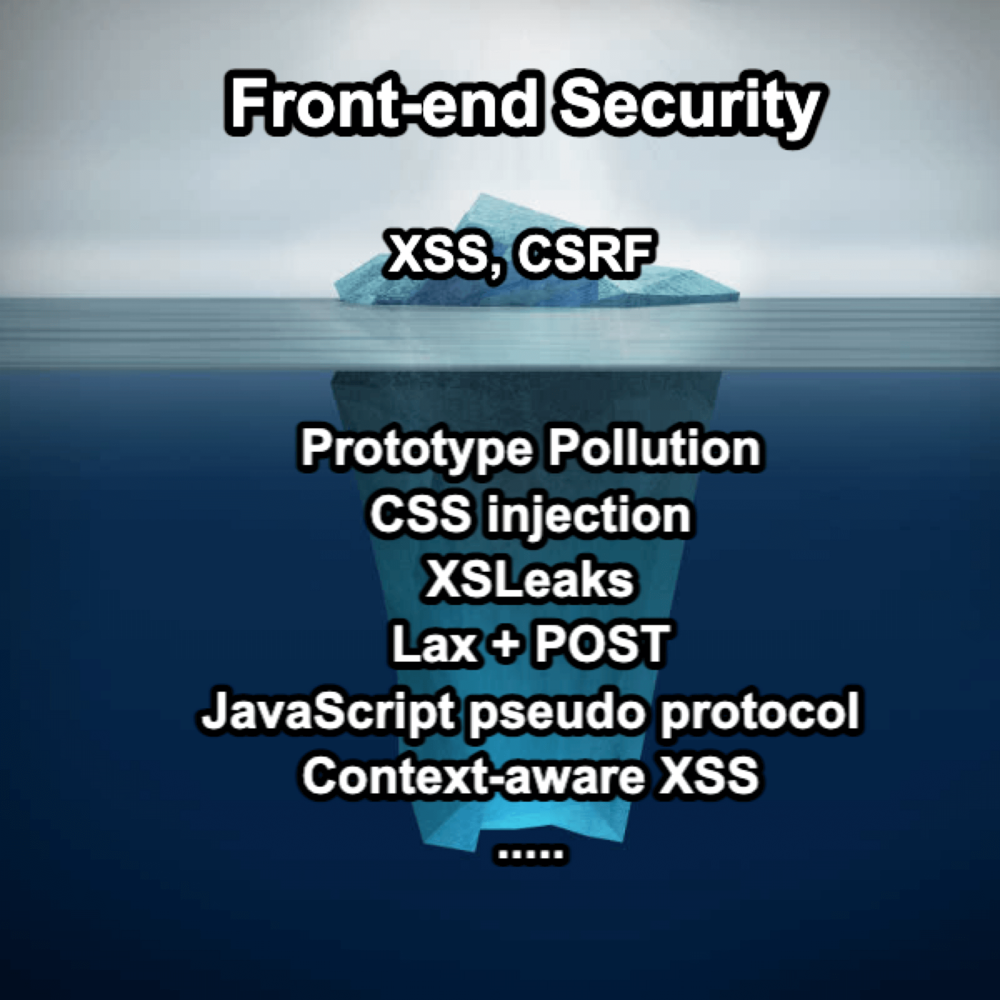

# このシリーズについて

ソフトウェア・エンジニアであれば、情報セキュリティについてある程度精通していなければなりません。 静的コード・スキャン、脆弱性スキャン、侵入テストなど、仕事の一環でセキュリティ監査を受けたことがあるかもしれませんし、より高度なレベルで、包括的なレッドチーム演習を行ったことがあるかもしれません。 もしかすると、OWASPのことを聞いたことがあるかもしれませんし、OWASP Top 10とはなにか、一般的なセキュリティの脆弱性が何であるかを知っているかもしれません。

しかし、範囲を「Webフロントエンドにおけるセキュリティ」に限定すると、多くの人はXSSについてだけ知っていて、あとは何も知らない事が多いのです。

（This also has an <a href="https://aszx87410.github.io/beyond-xss/en/" target="_self" noopener noreferrer>English version</a>）

Webフロントエンドセキュリティの分野を宇宙に例えるなら、XSSは多くの人の注目を集める最も大きく明るい惑星かもしれません。しかし、XSS以外にもあなたが気づいていないだけで、いつもそこにある小さな惑星や星がたくさんあります。

XSS 以外にも、JavaScript の機能を悪用したプロトタイプ汚染、JavaScript なしで実行可能な CSS インジェクション攻撃、Webフロントエンド開発における XSLeaks のようなサイドチャネル攻撃など、学ぶ価値のあるセキュリティトピックはたくさんあります。

私がフロントエンド・エンジニアとしてセキュリティの分野に足を踏み入れたとき、それはまるで別の世界のような感覚だった。その世界では、見慣れたHTML、CSS、JavaScriptが、見たこともないような使われ方をしていた。この分野で5、6年働いてきて、使い方の80％くらいは見てきたつもりだったが、セキュリティの世界に飛び込んでみると、逆に80％くらいはまったく初めて見るものでした！

そこで、この連載では、フロントエンド・セキュリティのトピックをいくつか紹介し、フロントエンド・セキュリティの世界を一緒に探検することを目的とします！

このシリーズで扱うトピックは以下の通りです：

1. XSS (Cross-Site Scripting)
2. CSP (Content Security Policy)
3. Sanitization
4. HTML injection
5. CSS injection
6. DOM clobbering
7. Prototype pollution
8. CSRF (Cross-site request forgery)
9. CORS (Cross-origin resource sharing)
10. Cookie tossing
11. Cookie bomb
12. Clickjacking
13. MIME sniffing
14. XSLeaks (Cross-site leaks)
15. CSTI (Client side template injection)
16. Subdomain takeover
17. Dangling markup injection
18. Supply chain attack

このシリーズは、大きく以下の5つの章に分けられます：

第1章：XSSから見たフロントエンド・セキュリティ  
第2章：XSSの防御と回避  
第3章：JavaScriptを使わない攻撃  
第4章：クロスサイト攻撃  
第5章：その他の興味深いフロントエンド・セキュリティのトピック 

このシリーズの対象読者は、フロントエンドエンジニアやセキュリティに関心のある人たちです。読者は、フロントエンドとバックエンドの違いを理解し、HTML、CSS、JavaScriptの基本的な理解を持っているなど、少なくとも基本的な技術的知識を持っていることを前提としています。

セキュリティの世界では、知識が非常に重要だ。知らないことには知らないことがある。開発をしていると、あるコードの書き方に問題があることを知らないために、知らず知らずのうちにセキュリティの脆弱性を持ち込んでしまうことがある。この連載を通して、新しい知識を学んでいただければ幸いです。フロントエンド・セキュリティに興味を持つきっかけになれば、それは素晴らしいことだ。しかし、たとえそうでなかったとしても、少なくともフロントエンド開発の違った側面をお見せし、私が初めてセキュリティに出会ったときに感じたようなこと、簡単に言えば、「すごいな、どうして今までこんなことを知らなかったんだろう？」と感じていただければ幸いです。

最後に、情報セキュリティの分野は広大で奥が深い。もし私の記事に技術的な誤りがあれば、読者の皆さんからのご指摘をお待ちしています。ありがとうございました。

## このシリーズの原点

このシリーズを始めたきっかけは、台湾の[2023 iT Ironman Contest](https://ithelp.ithome.com.tw/2023ironman/event)というオンラインイベントだった。これは、30日間継続的に記事を掲載する必要があるコンテストだ。コンテストを終えた後、私はコンテンツを抽出し、全コンテンツに簡単にアクセスできるように docusaurus を使ってこのウェブサイトを構築した。

すべての記事は私の母国語である繁体字中国語で書かれています。翻訳完了後、ChatGPTを使って翻訳し、手作業で修正しました。誤訳を避けるために最善を尽くしましたが、それでもまだ見つけられなかった部分があるかもしれません。ご理解のほど、よろしくお願いいたします。

## 著者について

台湾出身のHuliです。

フロントエンドエンジニアであり、サイバーセキュリティの愛好家でもある私の経歴は、ウェブフロントエンドのセキュリティに特別な関心を寄せています。時々[Water Paddler](https://twitter.com/Water_Paddler)のCTFチャレンジに参加したり、技術ブログを運営しています。

詳しくは私のブログをご覧ください： https://blog.huli.tw/en/about/

X(Twitter)：https://twitter.com/aszx87410